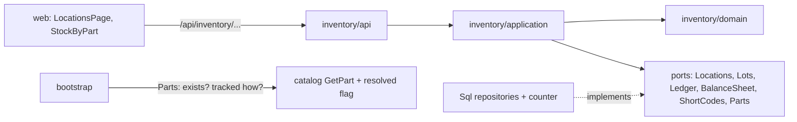

# Design Document: inventory stock

## Overview

The first of three specs in `v0.4.0` Inventory. It creates the `inventory` module that
[docs/architecture.md](../../../docs/architecture.md) plans — *locations, lots, units,
ledger* — for the three movement kinds this release covers. Stock is an append-only ledger of
movements with a balance projection written in the same transaction, exactly as
[ADR 0002](../../../docs/adr/0002-stock-ledger.md) decided; `inventory` is the second
workspace-scoped module after `catalog`, so it reuses the isolation plumbing of
[ADR 0007](../../../docs/adr/0007-workspace-isolation.md).

Design-First: the architecture is already fixed by ADR 0001, ADR 0002 and ADR 0007, so the
design comes first and the requirements are written against it.

**Owner decisions (2026-09-26), final**, and the reason each shapes the design:

1. **Unit-tracked is a category property.** Every microcontroller board is an individual
   unit; parts elsewhere are counted in lots. "Tracked individually" is a flag on the
   category, inherited by subcategories. → the catalog change in Architecture, and the
   `tracked-units` spec.
2. **Consumables are out of scope**, no special handling. → nothing here treats them apart;
   they are ordinary lot-counted parts if stocked at all.
3. **No printed QR labels.** Locations and units get human-readable short codes
   (`WX-L-0001`, `WX-U-0001`), sequential per workspace, shown and searchable. → the short
   codes in Components, and the README line changed in the last task.
4. **A change history is not `v0.4.0`** (it is `v0.8.0`). → no change log built. The ledger
   is a full history of *stock*, but nothing logs edits to locations or settings.
5. **`v0.4.0` records `RECEIVE`, `ADJUST` and `MOVE` only.** `RESERVE`/`RELEASE`/`CONSUME`/
   `RETURN` arrive with builds in `v0.5.0`. → the ledger's `kind` enum keeps all seven ADR
   0002 names, but the application writes only the first three; the projection carries
   `reserved`/`available` from day one so `v0.5.0` adds behaviour, not a migration.

In scope:

- The `inventory` module: `domain`, `application`, `infrastructure`, `api`.
- A location tree (room → cabinet → drawer → bin), each location a short code `WX-L-0001`.
- Stock lots, one per (part, location), counted through the ledger.
- The append-only ledger: `RECEIVE`, `ADJUST`, `MOVE`, each row one lot, one signed quantity.
- The balance projection (`on_hand`, `reserved`, `available`) written in the same
  transaction, with the ADR 0002 invariant enforced in the domain and by CHECK constraints.
- `wiredex stock rebuild`: recompute every balance from the ledger.
- Gap-free, per-workspace short codes for locations (and, from the next spec, units).
- A small catalog change: a `tracked_individually` flag on categories, inherited along the
  ancestor chain, and a `Parts.describe` port so inventory learns whether a part is real and
  how it is counted, without importing catalog.
- Web: a locations page, receive / adjust / move dialogs, and stock shown per part.
- Inventory sample data for the demo workspace.

Out of scope:

- **Tracked units** (`tracked-units`, next spec): the units themselves. This spec lays the
  ledger, the short-code mechanism and the `tracked_individually` flag that spec builds on,
  but creates no unit.
- **Quick-add and CSV import** (`quick-add-and-import`).
- `RESERVE`/`RELEASE`/`CONSUME`/`RETURN` and the revision link (`v0.5.0`), and a change
  history (`v0.8.0`).

## Architecture



Dependencies point inward, enforced by `import-linter`: `api`/`infrastructure` → `application`
→ `domain`; the domain imports no framework. `inventory` imports neither `catalog` nor
`identity` (the independence contract), and no foreign key crosses a module boundary.

**The catalog change: the `tracked_individually` flag and the `Parts` port.** Owner
decision 1 makes "tracked individually" a property of the **category**, inherited by
subcategories. Catalog owns categories, so the flag lives there; inventory reads it through a
port, never importing catalog — the pattern `files` already uses with `Subjects`.

- `categories` gains a nullable boolean `tracked_individually`: `NULL` means "inherit from
  the parent"; an explicit `true`/`false` overrides. Resolution walks the existing
  `ancestors` chain, nearest set value wins; if nothing in the chain sets it, the default is
  **false** (counted in lots), matching decision 1. This reuses catalog's inheritance
  machinery — the recursive `ancestors` CTE already loads the chain for schemas — and matches
  how attribute schemas already inherit.
- The catalog category responses carry `tracked_individually` (the set value) and
  `tracked_individually_resolved` (the inherited answer); `PATCH /catalog/categories/{id}`
  can set or clear it. `make client` runs after this.
- Changing the flag affects **future** receives only. Existing lots and units are left as
  they are; `v0.4.0` has no history and no retroactive conversion.

`bootstrap/inventory.py` implements the `Parts` port over catalog's `GetPart` plus the
resolved flag: a `PartNotFoundError` becomes `PartStockInfo(exists=False,
tracked_individually=False)`, so inventory learns both facts in one call and never sees a
`Category`.

**Workspace scoping.** The second workspace-scoped module; the plumbing catalog first used is
reused wholesale, no identity change needed (catalog already put `workspace_id` on
`CurrentUser` and `/auth/me`). Both ADR 0007 gates: repositories filter on `workspace_id`
(gate one) *and* every inventory table gets `isolate_by_workspace` (gate two). The unit of
work is one per workspace, so `set_config('app.workspace_id', …, true)` reaches Postgres
untouched. `wiredex stock rebuild` runs as `wiredex_app`, per workspace, so the rebuild is
isolated like everything else.

## Components and Interfaces

### Domain

`apps/api/src/wiredex/inventory/domain/`:

| File | Holds |
| --- | --- |
| `values.py` | Ids, `WorkspaceId`, `PartId`, `LocationName`, `ShortCode`, `Quantity`, `MovementKind`, `MovementReason`, `Note` |
| `location.py` | `Location`, `MAX_LOCATION_DEPTH` |
| `ledger.py` | `StockMovement`, `MovementGroup`, the `Balances` first-class collection |
| `lot.py` | `StockLot`, `StockBalance` |
| `errors.py` | `InventoryError` and its leaves |

Ids are `NewType` over `UUID`, UUIDv7 from `IdGenerator`, as elsewhere.

```python
WorkspaceId = NewType("WorkspaceId", UUID)
LocationId = NewType("LocationId", UUID)
StockLotId = NewType("StockLotId", UUID)
StockMovementId = NewType("StockMovementId", UUID)
MoveGroupId = NewType("MoveGroupId", UUID)
PartId = NewType("PartId", UUID)          # catalog's PartDefinitionId, named locally
```

`inventory` declares its own `WorkspaceId` and `PartId` rather than importing catalog's:
modules don't import each other's domain. When a third module needs `WorkspaceId`, promote it
to `shared_kernel/domain/values.py`, as the catalog spec noted.

**Values** are frozen slotted dataclasses that validate in `__post_init__`, normalize
through `object.__setattr__`, and raise an `InventoryError`, the same shape as
`catalog/domain/values.py`.

- `LocationName`: trimmed, whitespace collapsed, non-empty, capped at 80. Not lower-cased.
- `ShortCode`: `^WX-[LU]-\d{4,}$`, upper-cased, stored whole. `ShortCode.for_location(n)` and
  `ShortCode.for_unit(n)` format an integer as `WX-L-{n:04d}` / `WX-U-{n:04d}`; four digits
  is the minimum width, and a workspace past 9999 rolls to five digits (`WX-L-10000`) without
  breaking, because the width is display, not identity. Units are minted by the next spec;
  the value object serves both so the scheme lives in one place.
- `Quantity`: a non-negative `int` count (`>= 0`), the amount *in* a lot. A movement's signed
  change is a plain `int`, not a `Quantity`, because it can be negative.
- `MovementKind(StrEnum)`: the full seven of ADR 0002 — `RECEIVE`, `ADJUST`, `MOVE`,
  `RESERVE`, `RELEASE`, `CONSUME`, `RETURN`. The domain accepts all seven; the application
  writes only the first three this release (see Use cases), so the ledger only ever contains
  those. Keeping the enum whole means `v0.5.0` adds behaviour, not a migration.
- `MovementReason(StrEnum)`: `recount`, `damaged`, `lost`, `found`, `correction` — why an
  `ADJUST` happened. `RECEIVE` and `MOVE` carry no reason.
- `Note`: optional, trimmed, capped at 500.

**Location.**

```python
@dataclass(eq=False)
class Location:
    id: LocationId
    workspace_id: WorkspaceId
    parent_id: LocationId | None
    code: ShortCode
    name: LocationName
    created_at: datetime

    def rename(self, name: LocationName) -> bool: ...
    def move_under(self, parent: Location | None, ancestors: Sequence[LocationId]) -> None: ...
```

`move_under` raises `CircularLocationError` when the new parent is the location itself or one
of its descendants; the domain can't query, so the use case passes the candidate parent's
ancestor chain in, exactly as `Category.move_under` does. Depth is capped at 6
(`MAX_LOCATION_DEPTH`); a move that would push any descendant past the cap is refused.
`rename` returns whether anything changed, so a no-op skips the `commit()`. The `code` is
assigned once, at creation, and never changes.

**The ledger and balances.**

```python
@dataclass(eq=False)
class StockMovement:
    id: StockMovementId
    workspace_id: WorkspaceId
    lot_id: StockLotId
    kind: MovementKind
    change: int                     # signed: +receive, ±adjust delta, ∓ the two move rows
    reason: MovementReason | None
    note: Note | None
    move_group: MoveGroupId | None  # set on the two rows of a MOVE, else None
    revision_id: UUID | None        # ADR 0002's "caused by"; always None until v0.5.0
    created_at: datetime
```

A movement is immutable: nothing updates or deletes a row (ADR 0002). The seven-name `kind`
and the always-`None` `revision_id` are the seams `v0.5.0` grows into.

```python
@dataclass(eq=False)
class StockBalance:
    lot_id: StockLotId
    on_hand: Quantity
    reserved: Quantity
    version: int

    @property
    def available(self) -> Quantity: ...        # on_hand - reserved

    def apply(self, movement: StockMovement) -> StockBalance: ...
```

`apply` returns a **new** balance with `on_hand` moved by `movement.change`, and raises
`NegativeStockError` if `on_hand` would drop below zero (the floor holds for *every* kind,
`ADJUST` included), and `ReservationError` if the result would break `reserved <= on_hand`
(unreachable in `v0.4.0` but guarded and property-tested, so `v0.5.0` inherits it proven).
`version` is optimistic locking's column (ADR 0002): a stale write is retried by the use
case. `available` is derived on the entity but stored on the projection so reads don't
recompute it.

`Balances` is a first-class collection used by `stock rebuild`: fold the whole ledger,
grouped by lot, into the set of balances, so "the projection equals the sum of the ledger" is
one method with one obvious implementation.

```python
class Balances:
    @classmethod
    def rebuilt_from(cls, movements: Iterable[StockMovement]) -> Balances: ...
    def of(self, lot_id: StockLotId) -> StockBalance: ...
```

**Stock lot.**

```python
@dataclass(eq=False)
class StockLot:
    id: StockLotId
    workspace_id: WorkspaceId
    part_id: PartId
    location_id: LocationId
    created_at: datetime
```

A lot is the thin identity of "this part, in this location". It is created the first time a
part is received into a location and is never deleted in `v0.4.0` (a lot at zero is normal).
`(workspace_id, part_id, location_id)` is unique.

### Application

`inventory/application/ports.py` — Protocols only, repositories speaking domain types, the
unit of work exposing them as read-only properties:

```python
class Locations(Protocol):
    async def add(self, location: Location) -> None: ...
    async def get(self, location_id: LocationId) -> Location | None: ...
    async def all(self) -> list[Location]: ...
    async def ancestors(self, location_id: LocationId) -> list[Location]: ...
    async def children_of(self, location_id: LocationId) -> list[Location]: ...
    async def sibling_named(self, parent_id: LocationId | None, name: LocationName) -> Location | None: ...
    async def has_lots(self, location_id: LocationId) -> bool: ...
    async def remove(self, location: Location) -> None: ...

class Lots(Protocol):
    async def get(self, lot_id: StockLotId) -> StockLot | None: ...
    async def for_part_at(self, part_id: PartId, location_id: LocationId) -> StockLot | None: ...
    async def add(self, lot: StockLot) -> None: ...

class Ledger(Protocol):
    async def append(self, movement: StockMovement) -> None: ...
    async def movements_of(self, lot_id: StockLotId) -> list[StockMovement]: ...
    async def all(self) -> AsyncIterator[StockMovement]: ...      # rebuild, ordered

class BalanceSheet(Protocol):
    async def get(self, lot_id: StockLotId) -> StockBalance | None: ...
    async def put(self, balance: StockBalance) -> None: ...        # optimistic on version
    async def totals_by_part(self, part_ids: Sequence[PartId]) -> dict[PartId, int]: ...
    async def by_part(self, part_id: PartId) -> list[LotBalance]: ...  # per-location breakdown
    async def replace_all(self, balances: Iterable[StockBalance]) -> None: ...  # rebuild

class ShortCodes(Protocol):
    async def next(self, kind: ShortCodeKind) -> int: ...          # in-transaction, gap-free

@dataclass(frozen=True, slots=True)
class PartStockInfo:
    exists: bool
    tracked_individually: bool

class Parts(Protocol):
    async def describe(self, workspace_id: WorkspaceId, part_id: PartId) -> PartStockInfo: ...
```

`ShortCodes.next` advances the workspace's counter for a kind (`location` or `unit`) inside
the current transaction and returns the next integer; the location use case formats it with
`ShortCode.for_location`. The domain never touches the database, and `ShortCode` only
validates and formats. Units use the same port in the next spec.

Use cases, one class with one `async __call__`, grouped by file:

| File | Use cases |
| --- | --- |
| `locations.py` | `CreateLocation`, `RenameLocation`, `MoveLocation`, `DeleteLocation`, `ListLocations` |
| `movements.py` | `ReceiveStock`, `AdjustStock`, `MoveStock` |
| `stock.py` | `PartStock` (per-part total and breakdown), `RebuildBalances` |

Commands and results are frozen slotted dataclasses of domain types in the same file:
`NewLocation`, `Receipt(part_id, location_id, quantity, note)`,
`Adjustment(part_id, location_id, counted, reason, note)`,
`Move(part_id, from_location_id, to_location_id, quantity, note)`,
`LocationNode(location, child_count, lot_count)`, `LotBalance(location, on_hand)`,
`PartStockView(total, breakdown)`.

The three movement use cases, precisely:

- **`ReceiveStock`** loads the part through `Parts.describe`. Not `exists` → 404. Its category
  is `tracked_individually` → 422 (`ReceiveAsUnitsError`, "this part is tracked as units"):
  a lot receive into a unit-tracked part is refused, and `tracked-units` handles the unit
  path. Otherwise: find or create the lot (lots have no short code — only locations and units
  do), append one `RECEIVE` of `+quantity`, apply it, `put` the balance, `commit`.
  `quantity >= 1`.
- **`AdjustStock`** takes an **absolute counted quantity** (`counted >= 0`), not a delta. It
  reads the lot's current `on_hand`, computes `change = counted - on_hand`, and appends one
  `ADJUST` carrying that signed delta plus a `MovementReason`. Storing the delta keeps "sum
  of a lot's movements == on_hand" a single uniform property across all kinds; the *absolute*
  number is only the API's input.
- **`MoveStock`** writes **two** ledger rows sharing one `MoveGroupId`: `-quantity` on the
  source lot and `+quantity` on the destination lot, updating both balances, all in one
  transaction. The source lot must hold at least `quantity` (`InsufficientStockError`, 409);
  source and destination must differ (`SameLocationError`, 422); the destination lot is
  created if absent. One transaction means a failure on either side writes neither row.

`RebuildBalances` (`wiredex stock rebuild`) streams the whole ledger in workspace and time
order, folds it with `Balances.rebuilt_from`, and `replace_all`s the projection, one
transaction per workspace. It is the ledger's proof of itself.

**`v0.5.0` seam.** `RESERVE`/`RELEASE`/`CONSUME`/`RETURN` have no use case, no command and no
route here, so the ledger cannot contain one in `v0.4.0`.

Nothing is saved without `commit()`, and one use case is one transaction (AGENTS.md). The
in-memory fakes count commits so a no-op is asserted to write nothing.

### Short codes

Gap-free, sequential-per-workspace codes need a per-workspace counter, which a global
Postgres `SEQUENCE` can't give (it is per database and leaves gaps). `SqlShortCodes.next(kind)`
runs, inside the use case's transaction:

```sql
INSERT INTO short_code_counters (workspace_id, kind, next_value)
VALUES (:workspace_id, :kind, 2)
ON CONFLICT (workspace_id, kind)
DO UPDATE SET next_value = short_code_counters.next_value + 1
RETURNING next_value - 1
```

The row lock `ON CONFLICT DO UPDATE` takes serializes two concurrent receives in the same
workspace, so `WX-L-0007` is handed out once. The advance is part of the use case's one
transaction: a rolled-back create doesn't burn a number, though a committed create followed
by a later delete leaves a gap — honest, and `v0.4.0` has no soft-delete. The counter is a
workspace-scoped table, isolated by the same RLS. Codes are searchable: the locations list
and parts pages match a query against the code as a case-insensitive substring, reusing the
`pg_trgm` approach the catalog uses for names. No QR, no print (decision 3).

### HTTP API

`create_router(use_cases, current_workspace)`, prefix `/inventory`, tag `inventory`, mounted
under `/api`. Handlers are closures inside `_add_location_routes`, `_add_movement_routes` and
`_add_stock_routes` to stay under the complexity cap, as catalog's router splits.

| Method | Path | Answers |
| --- | --- | --- |
| GET | `/inventory/locations` | The whole tree, flat, with `code`, `child_count`, `lot_count` |
| POST | `/inventory/locations` | 201 `LocationResponse`, code minted |
| PATCH | `/inventory/locations/{id}` | Rename, move, or both |
| DELETE | `/inventory/locations/{id}` | 204, or 409 when it has children or lots |
| POST | `/inventory/receive` | 201: a `RECEIVE` into (part, location) |
| POST | `/inventory/adjust` | 200: an `ADJUST` to an absolute counted quantity |
| POST | `/inventory/move` | 200: a `MOVE` between two locations |
| GET | `/inventory/parts/stock?part_id=…&part_id=…` | Per-part totals for a page of parts |
| GET | `/inventory/parts/{part_id}/stock` | One part's total and per-location breakdown |

Receive, adjust and move are POSTs, so they carry the CSRF header like every unsafe method
(ADR 0008); auth and CSRF tests cover them as catalog's do. Movement responses carry the
resulting balance so the web updates without a refetch: `{ "lot_id": …, "on_hand": 42,
"reserved": 0, "available": 42 }`. A move returns both lots' balances. No `operation_id` is
set, matching the rest of the API; `make client` runs after this lands.

### CLI and bootstrap

- `bootstrap/inventory.py`: builds the use cases over
  `lambda workspace_id: SqlInventoryUnitOfWork(session_factory, workspace_id)`, and the
  `Parts` port over catalog's `GetPart` plus the resolved flag (the files-style pattern).
- `bootstrap/app.py`: includes the router under `API_PREFIX` with the `current_workspace`
  dependency built from identity, as it does for catalog.
- `wiredex stock rebuild`: a `stock` CLI group with a `rebuild` command running
  `RebuildBalances` for every workspace, over its own engine, per the files prune/clear
  pattern. Added nowhere in the nightly timer (it is a manual repair tool, not a job).
- `wiredex demo reset` also restores inventory sample data (locations and some received
  stock), after catalog's parts are restored, since stock points at parts.

### Web

`apps/web/src/features/inventory/`:

| File | What |
| --- | --- |
| `inventory.ts` | TanStack Query hooks over the generated client, query keys, invalidation |
| `LocationsPage.tsx` | The tree with add, rename, move, delete; each node shows its code |
| `LocationTree.tsx` | The tree control, keyboard-operable, roles and accessible names |
| `ReceiveDialog.tsx` | Receive a quantity of a part into a location |
| `AdjustDialog.tsx` | Recount: set the absolute quantity, pick a reason, note |
| `MoveDialog.tsx` | Move a quantity from one location to another |
| `StockByPart.tsx` | The per-part total and per-location breakdown, on the part page |
| `stock.ts` | Formatters for counts and codes |

How the two features compose without a module import:

- The **parts list** (catalog feature) shows a stock column, fed by `GET
  /inventory/parts/stock?part_id=…` (the batch route, accepting the ids on the current page)
  through the generated client. The catalog page calls an inventory endpoint over HTTP; no
  code import crosses features, mirroring the backend's facade rule.
- The **part page** mounts `StockByPart`, which fetches the single-part route and offers
  *Receive* / *Adjust* / *Move*. The dialogs invalidate both the inventory stock query and
  the catalog part query so the number updates in place.
- The location picker is a searchable tree matching on name and code.

Notes: routes in `app/router.tsx`: `/locations`; nav gets *Locations*; the dashboard's
"nothing here yet" copy loses its inventory sentence. Every string is an i18n key under
`inventory.*` in **both** `en.json` and `pt-BR.json`; colours come from theme tokens. The
category form (catalog feature) gains a tri-state *Tracked individually* control — inherit,
yes, no — showing the resolved answer when set to inherit.

## Data Models

`inventory/infrastructure/orm.py`, tables on the shared `metadata`, mapped imperatively. The
catalog flag ships as its own migration and inventory's tables as the next; the catalog,
pinouts, files and search migrations took `0005`–`0008`, so the flag is `0009_category_tracking.py`
and inventory is `0010_inventory.py`. The rule is the flag migration lands before inventory's
tables, and each is reversible; the exact numbers are settled when they are generated.

```
locations
  id uuid pk · workspace_id uuid not null (index) · parent_id uuid null → locations.id (RESTRICT)
  code varchar(16) not null · name varchar(80) not null · created_at timestamptz not null
  unique (workspace_id, parent_id, name) NULLS NOT DISTINCT
  unique (workspace_id, code)
  index gin (code gin_trgm_ops)          -- substring search on the code

short_code_counters
  workspace_id uuid not null · kind varchar(16) not null (CHECK: location|unit)
  next_value integer not null default 1
  primary key (workspace_id, kind)

stock_lots
  id uuid pk · workspace_id uuid not null (index)
  part_id uuid not null · location_id uuid not null → locations.id (RESTRICT)
  created_at timestamptz not null
  unique (workspace_id, part_id, location_id)
  index (workspace_id, part_id)          -- per-part aggregation

stock_movements
  id uuid pk · workspace_id uuid not null (index)
  lot_id uuid not null → stock_lots.id (RESTRICT)
  kind varchar(16) not null (CHECK: the seven ADR 0002 names)
  change integer not null
  reason varchar(16) null (CHECK: recount|damaged|lost|found|correction)
  note varchar(500) null · move_group uuid null · revision_id uuid null
  created_at timestamptz not null
  index (workspace_id, lot_id, created_at)   -- rebuild reads a lot's rows in order
  index (workspace_id, created_at)           -- rebuild streams the workspace in order

stock_balances
  lot_id uuid pk → stock_lots.id (RESTRICT)
  workspace_id uuid not null (index)
  on_hand integer not null (CHECK: on_hand >= 0)
  reserved integer not null default 0 (CHECK: reserved >= 0 AND reserved <= on_hand)
  available integer not null (CHECK: available = on_hand - reserved)
  version integer not null default 0
```

Notes that matter:

- **`NULLS NOT DISTINCT`** on the sibling-name constraint, so two root locations can't both
  be named *Lab*, as catalog does for categories. Verified supported in SQLAlchemy 2.0 /
  Postgres 18.
- **The `kind` CHECK lists all seven ADR 0002 names**, not just the three `v0.4.0` writes.
  The application is the gate on which three are written; the column stays open so `v0.5.0`
  adds behaviour, not a migration ("expand now, contract later").
- **`available` is a stored, checked column**, not computed on read. The CHECK `available =
  on_hand - reserved` plus `reserved <= on_hand` makes the ADR 0002 invariant a database
  guarantee as well as a domain one: even a bug that wrote a bad projection row would be
  rejected. It costs one integer per lot.
- **`version`** gives the balance optimistic locking (ADR 0002). `BalanceSheet.put` writes
  `WHERE lot_id = :id AND version = :seen` and bumps `version`; zero rows updated means a
  concurrent movement won, and the use case retries from the reloaded balance, bounded to
  three attempts, then surfaces `ConcurrentStockError` (409).
- **No foreign key to `part_definitions`.** `part_id` is a bare `uuid`: modules don't point
  at each other's tables (the rule `files` follows). A part's existence is checked through
  the `Parts` port, not a constraint.
- **`stock_movements` has no `UPDATE`/`DELETE` path** — `Ledger` exposes only `append`,
  `movements_of` and `all`. Append-only is enforced by the absence of a mutator; a DB trigger
  is considered and rejected as belt-on-braces the RLS role doesn't need.
- Value objects reach the columns through `TypeDecorator`s in
  `inventory/infrastructure/types.py`, each repeating `cache_ok = True`, as catalog's do.
- Every workspace-scoped table (`locations`, `short_code_counters`, `stock_lots`,
  `stock_movements`, `stock_balances`) ends the migration with
  `isolate_by_workspace(op.execute, "<table>")`. `stock_balances` carries its own
  `workspace_id` for that reason, despite `lot_id` being its key.

The location tree uses the same recursive-CTE `ancestors` as categories, capped by
`MAX_LOCATION_DEPTH`. Per-part totals are one grouped query over `stock_balances` joined to
`stock_lots` on `lot_id`, filtered by `part_id in (...)`, so the parts list never loads a
balance per row.

**The catalog change** adds a nullable `tracked_individually boolean` to `categories`, with
its own reversible migration. Resolution reuses the existing `ancestors` CTE.

## Correctness Properties

Checked with Hypothesis in the domain and application tests. ADR 0002's headline invariant is
the reason property tests are a `v0.4.0` quality gate in the README.

### Property 1: on_hand never goes negative

For any sequence of movements applied to a starting balance, `on_hand` is `>= 0` at every
step, and a movement that would take it below zero raises rather than storing a bad balance.

**Validates: Requirements 3.6, 5.4**

### Property 2: reserved stays within on_hand

For any sequence of movements, `0 <= reserved <= on_hand` and `available == on_hand -
reserved` hold at every step. In `v0.4.0` no movement sets `reserved`, so this reduces to
`available == on_hand`; the property is written over the general `apply`, so `v0.5.0` inherits
it proven.

**Validates: Requirements 3.4, 3.5, 3.7**

### Property 3: the ledger sums to the balance

For any sequence of movements on one lot, folding their signed `change` from zero equals the
lot's `on_hand`.

**Validates: Requirements 5.1, 5.4**

### Property 4: a move conserves total on_hand

For any move of a valid quantity, the two grouped rows sum to zero, so the workspace's total
`on_hand` for that part is unchanged; only its distribution across locations changes.

**Validates: Requirements 4.5, 4.6**

### Property 5: adjust reaches exactly the counted quantity

For any lot and any counted quantity `>= 0`, after the adjust the lot's `on_hand` equals the
counted quantity, and the stored movement's `change` equals `counted - previous_on_hand`.

**Validates: Requirements 4.3, 4.4**

### Property 6: rebuild reproduces the projection

For any sequence of accepted movements, `wiredex stock rebuild` computes a projection equal to
the one written incrementally, balance for balance.

**Validates: Requirements 5.2, 5.3**

The ledger-sums-to-balance property (3) and the rebuild property (6) are the ones to write
first: they are the assumptions the whole module rests on.

## Error Handling

`InventoryError(ValueError)` and its leaves, each mapped by the router with `raise ... from
error` and no global handler, as catalog maps its own:

| Domain / application error | Status |
| --- | --- |
| `LocationNotFoundError`, `PartNotFoundError`, `LotNotFoundError` | 404 |
| `DuplicateLocationNameError`, `LocationInUseError`, `InsufficientStockError`, `ConcurrentStockError` | 409 |
| `ReceiveAsUnitsError`, `SameLocationError`, `NegativeStockError`, and any other bad value | 422 |

422 bodies name the field that failed, since the web renders errors per field. A part that
doesn't exist behind the `Parts` port is a `PartNotFoundError` (404); a lot receive into a
unit-tracked part is a `ReceiveAsUnitsError` (422) that names units as the path.

## Testing Strategy

| Level | Where | Covers |
| --- | --- | --- |
| Unit, domain | `tests/inventory/test_values.py` | `ShortCode` format and rollover, `Quantity` floor, `MovementKind`/`MovementReason`, `LocationName` |
| Unit, domain | `test_location.py` | Depth cap, cycle refusal, no-op rename, code untouched by rename/move |
| Unit, domain | `test_ledger.py`, `test_balances.py` | `apply`, the floor, the reserved guard, `Balances.rebuilt_from`; **properties 1–4** |
| Unit, application | `test_location_use_cases.py` | Duplicate siblings incl. two roots, cycle, depth, delete refusing children and lots, no-op rename not committing, code minted once |
| Unit, application | `test_movement_use_cases.py` | Receive lot-counted; receive unit-tracked refused (fake `Parts`); adjust as absolute count storing the delta; move writing two grouped rows; insufficient source; same-location; **property 5** |
| Unit, application | `test_stock_use_cases.py` | Per-part total and breakdown, the empty case; `RebuildBalances`; **property 6** |
| Unit, api | `test_inventory_api.py` | Bare `FastAPI` + `create_router(fakes, stub_workspace)`, `TestClient`; every status in the mapping; balances in movement responses |
| Unit, api | `test_inventory_auth.py` | 401 without a session; 403 without CSRF on the POSTs |
| Integration | `tests/integration/test_inventory_repositories.py` | The recursive ancestor query, the code trigram search, the `available`/`reserved` CHECKs, the optimistic `version` retry, per-part totals in one query |
| Integration | `tests/integration/test_short_codes.py` | Concurrent `next()` handing out distinct gap-free integers; two workspaces numbering independently |
| Integration | `tests/integration/test_inventory_isolation.py` | As `wiredex_app`, a lot/location/movement in A invisible and unwritable from B; B can't touch A's counter |
| Integration | `tests/integration/test_catalog_repositories.py` | The `tracked_individually` flag resolving along the ancestor chain |
| Integration | `test_migrations.py`, `test_demo_cli.py`, `test_stock_cli.py` | Both migrations' round trip; a reset restoring sample locations and stock; `stock rebuild` restoring a tampered balance |
| Web | Vitest + MSW next to each component | The tree by keyboard, receive/adjust/move dialogs, stock shown per part, the tri-state tracking control |
| E2E | `e2e/tests/inventory.spec.ts` | Create a location, receive 100 into it, see 100 on the parts page, move 40 to another location, see the split, adjust to a recount |

After this spec: ADR 0002 gets an "Implementation (v0.4)" section (the two-row MOVE with a
`move_group`, the absolute-count ADJUST stored as a delta, `reserved` staying zero, `wiredex
stock rebuild`); ADR 0007's isolated-table list grows by five; the README's two ledger lines
are ticked and the QR-label line is changed to short codes (decision 3); `docs/architecture.md`
§4 keeps only the `UNIT` node and its revision edge unimplemented after this spec.
