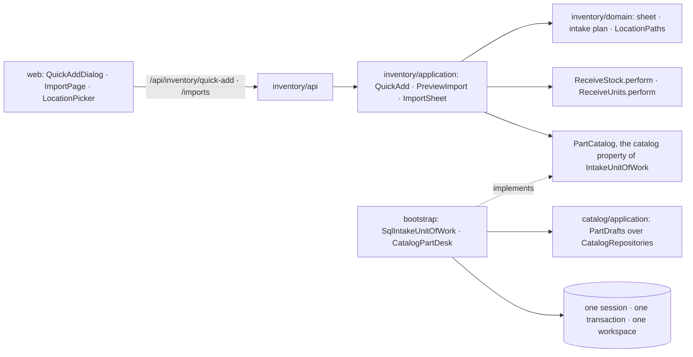
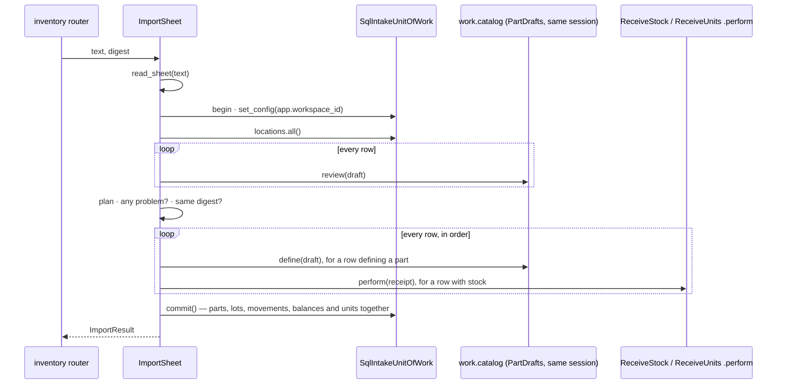

# Design Document: quick-add and import

## Overview

The last of three specs in `v0.4.0` Inventory, and the one that closes the phase. It delivers
the roadmap's two remaining Inventory lines, *keyboard-first quick-add and duplicate-part* and
*CSV import with validated preview*, which [05-inventory-stock](../05-inventory-stock/design.md)
and [06-tracked-units](../06-tracked-units/design.md) both left here.
[docs/architecture.md](../../../docs/architecture.md) §7 asks for "a quick-add form reachable
from anywhere" beside the `Ctrl K` palette; the palette is `v0.8.0` (18-command-palette), so
quick-add is built for the palette to open.

Everything here writes into two modules at once: a quick-add, or a row of a sheet, defines a
part (catalog) and receives its stock (inventory).
[ADR 0001](../../../docs/adr/0001-modular-monolith.md) already settled that "cross-module
operations that must be atomic … run in one database transaction", and AGENTS.md that one use
case is one unit of work. This spec is the first to need both at once, so most of its design is
how an inventory use case writes catalog rows in its own transaction without inventory
importing catalog.

**Owner decisions that bind this spec**, and what each does here:

- **Every microcontroller board is a unit**, by the category's "tracked individually" flag
  (2026-09-26, 05 and 06). Quick-add and import receive a unit-tracked part as units, through
  06's `ReceiveUnits`, and never as a loose count.
- **No printed QR labels; short codes are shown and searchable** (2026-09-26). A sheet may name
  a location by its code, and decision 15 finishes making codes searchable.
- **`v0.4.0` records `RECEIVE`, `ADJUST` and `MOVE` only** (2026-09-26). Intake records
  `RECEIVE` and nothing else.
- **One PR per spec with auto-merge; the release PR waits for the phase's last spec, and only
  the owner merges it** (2026-09-27). This spec is that last one, so it carries
  `Release-As: 0.4.0`. The same day's "not stocked" flag for consumables is built by 09 and 10;
  see *Seams for later specs*.

**Decisions this spec makes (2026-09-27), for the owner to check.** Where the repository
doesn't settle something, it is decided here, with the reason:

1. **Quick-add and import live in `inventory`, not in a new module.** Both are receiving
   stock, and inventory already leans on catalog through its `Parts` port. The stock half of
   the work is then inventory's own code, and only the part half crosses the boundary. A
   separate `intake` module would need a second port for the stock half and a sixth
   import-linter container, for no gain in a one-owner app.
2. **One transaction, through a port that rides the unit of work.** Inventory declares a
   `PartCatalog` port and exposes it as the `catalog` property of `IntakeUnitOfWork`
   (inventory's unit of work plus that one property). The composition root's
   `SqlIntakeUnitOfWork` opens one session, scopes it to the workspace once, and binds both
   inventory's repositories and a catalog adapter to it, so one `commit()` writes the part and
   its stock together and a failure writes neither. Catalog offers the part half as
   in-transaction operations (`PartDrafts`) over a repositories-only protocol that never opens
   or commits a unit of work: the shape `MoveStock.perform` already has inside `MoveUnit`. This
   is how ADR 0001's atomic cross-module operations get built without a module importing
   another; ADR 0001 records it in an "Implementation (v0.4)" section, and `v0.5.0`'s build
   lifecycle (a revision reserving and consuming stock) reuses it.
3. **The preview is a read-only plan, and nothing is staged.** A preview plans every row and
   writes nothing: it opens the intake unit of work, reads, and leaves without `commit()`. The
   import sends the same text back and is planned again from scratch. No import table, no
   session to expire, no cleanup job, no migration.
4. **What you import is what you previewed.** The preview answers a digest, a SHA-256 over
   every planned value: resolved ids, the part drafts as read, quantities and unit labels. The
   import sends it back; if the plan made now has another digest (a part with that number
   appeared meanwhile, a location was renamed), it answers 409 and writes nothing, and the
   owner previews again instead of importing something they never saw.
5. **All or nothing.** A sheet with any problem imports nothing. There is no "skip the bad
   rows": a partial import is the half-state the preview exists to prevent, and fixing a row
   and previewing again is cheap.
6. **A sheet defines parts, receives lots and receives units, and nothing else.** It can't
   create categories, attribute definitions or locations, adjust or move stock, or edit a part
   it names. Schemas and trees are where a sheet's typos cost the most, a recount stays a
   deliberate *Adjust*, and a named part's cells are ignored rather than applied (decision 7).
   The owner builds the trees and fields first; the sheet fills them.
7. **A row names a part by manufacturer and part number, the catalog's own uniqueness key.** A
   row whose pair (folded as the unique index folds it) belongs to a stored part stocks that
   part and ignores its other part cells. The first row that gives a new pair defines the part,
   and later rows giving it stock that part. A row with no part number always defines a new
   part. Importing a sheet twice therefore re-stocks, and never re-defines, anything with a part
   number (requirement 8.7). A blank manufacturer matches only a part stored without one, as
   the index does.
8. **Categories and locations are found by path, and locations also by code.** A cell is names
   separated by `/`, compared ignoring case, accents and spacing, and it matches every node
   whose path ends with them: `Passives / Resistors`, or just `Resistors` when only one
   category has that name. A node whose whole path is those names wins over the ones they only
   end, so a root `Boards` beside `Legacy / Boards` can still be named (owner, 2026-09-27,
   after property 2 found the clash). A location cell may instead be its short code, in any
   case, which is what the codes are for. No match, or more than one, is a problem naming the
   candidates.
9. **The server reads the sheet, unlike the pinout paste.** The preview has to be checked
   against the workspace anyway, the import must not trust rows a client shaped, and the
   reader's round trip is a Hypothesis property under the README's `v0.4.0` gate. The separator
   is found the way the pinout paste finds it (tab, then `;`, then `,`); the semicolon matters,
   because spreadsheets set to Brazilian Portuguese save CSV with semicolons. Headers are
   accepted in English and Portuguese.
10. **Limits sized for one transaction on the small host**: a sheet holds at most 500 entries,
    64 columns and 262,144 characters, and plans at most 500 units; a row or a quick-add
    receives at most 100 units (06's receipt cap) or 1,000,000 of a lot. A bigger bench is two
    sheets. Each unit mints its code with a statement of its own and the whole sheet holds one
    transaction open, so the caps keep an import to seconds.
11. **Quick-add's stock is one location and one quantity.** A lot-counted part gets one
    `RECEIVE`; a unit-tracked part gets that many units with blank serial and MAC, their codes
    shown on success. Serials and MACs go through the unit page's *Relabel* or a sheet row:
    typing twelve of them is not quick.
12. **Alt+N opens quick-add**, from anywhere but a text field, beside a *Quick add* button in the
    header. Not a single letter (WCAG 2.1.4 wants a modifier or a way to turn it off), not
    `Ctrl N` (the browser's), and not while typing (on macOS, Option+N is how `ã` is typed).
    `Ctrl K` stays with the `v0.8.0` palette, which opens quick-add through `useQuickAdd()`.
13. **Duplicate is quick-add prefilled from the source part.** Category, name (selected, to be
    typed over), manufacturer, package and attribute values are copied; the part number is
    cleared, because the copy can't share it. Saving copies the source's pinout in the same
    transaction: 02-part-pinouts left "copying a pinout from another part" for later, and this
    is where it lands. Stock, units and attachments are not copied: stock is physical, and
    attachments belong to `files`, where attaching a datasheet again stores nothing twice.
14. **Add another keeps what a bag of parts has in common**: category, manufacturer, package and
    location. Name, part number, attribute values and quantity are cleared, and focus returns to
    the name.
15. **Short codes become searchable in the app.** 05 minted and showed the codes, and its
    repository can search them, but no route or screen used that search, so 05's "shown and
    searchable" was half-done and the README line "Location tree with human-readable short
    codes" stayed unticked. The Locations page gets a filter and quick-add a location picker,
    both matching names, paths and codes over the tree the page has already loaded; the
    phase-closing task then ticks the line.
16. **No demo data, no migration, no new ADR.** Quick-add and import create data from what is
    typed, so there is nothing to seed; a guest's imports are wiped by the nightly reset like
    any other change, and `wiredex demo reset` doesn't change. Nothing new is stored, so the
    head stays `0012_units.py`. ADR 0001 (the transaction), 0002 (units on the ledger, which 06
    deferred here) and 0007 (the `units` table, which 06 added without a documentation task)
    gain notes instead, and 0014 stays free.
17. **Problems carry codes, and sentences stay English.** As `AttributeProblemResponse` already
    does for `catalog.review.problem.*`, every problem has a code the web translates in both
    languages; the server's sentence rides along as the detail of a refused value ("resistance
    takes a number, not text"), as the part form already shows it.

**Seen while designing, not changed here.** `ReceiveStock` and `ReceiveUnits` don't check that
the location exists: an unknown `location_id` reaches the `stock_lots` foreign key and fails as
a 500 instead of a 404. Intake checks its own locations (quick-add by id, a sheet against the
tree it read), so this spec neither needs nor makes the fix; it deserves a small
`fix(inventory)` of its own.

In scope:

- Catalog: a collect-all attribute check, finding a category by path, and `PartDrafts`, which
  reviews and defines a part inside a transaction another module opened and copies a pinout on
  the way.
- Inventory: reading and writing a sheet, the per-row plan and its digest, finding a location
  by code or path, `QuickAdd`, `PreviewImport`, `ImportSheet`, and receipts that run inside an
  open transaction.
- The composition root's shared-session unit of work and the catalog adapter behind the port.
- Four routes: quick-add, preview, import, and the sheet template.
- Web: quick-add from any page (header button, Alt+N, `useQuickAdd`), duplicate on the part
  page, the import page, a location picker, and the Locations page filter.
- The phase-closing documentation, with `Release-As: 0.4.0`.

Out of scope:

- The command palette (`v0.8.0`, 18-command-palette); it opens quick-add through `useQuickAdd`.
- Creating categories, attributes or locations from a sheet; adjusting or moving stock from a
  sheet; editing a part a sheet names.
- Exporting inventory to CSV, and the KiCad BOM import on the roadmap's *Later* list.
- Filling a part in from its MPN or a label photo (*Later*).
- A history of imports (`v0.8.0`, with every other change).
- The "not stocked" flag for consumables (09 and 10).

## Architecture



Dependencies still point inward (`api`/`infrastructure` → `application` → `domain`), and
`inventory` still imports neither `catalog` nor `identity`, so the independence contract holds
unchanged. What is new is *where* the other module is reached: until now a port like `Parts`
was a constructor argument, answered in a transaction of its own. A write has to share the
caller's transaction, so `PartCatalog` is a property of the caller's unit of work instead, and
only the composition root, which already knows both modules, builds a unit of work that has it.

**The shared transaction.** `SqlIntakeUnitOfWork` extends `SqlInventoryUnitOfWork`, so its
`__aenter__` does what every unit of work does: one `AsyncSession`, one `begin()`, one
`set_config('app.workspace_id', …, true)`, and inventory's repositories bound to that session.
It then binds `catalog` — `CatalogPartDesk` over catalog's `PartDrafts` over
`SqlCatalogRepositories` — to the same session. Catalog's rows and inventory's are therefore
written in one transaction, seen by both of ADR 0007's gates under one workspace setting, and
kept or dropped by one `commit()`: leaving the block without it discards everything, as
`SqlUnitOfWork` always has.

An import, confirmed:



A preview is the same up to *plan*, then leaves the block without committing: it only ever
read. A quick-add is a one-row version with no sheet and no digest.

## Components and Interfaces

### Catalog: the part half

**Domain**, in `apps/api/src/wiredex/catalog/domain/`:

- `schema.py`: `AttributeSchema.check(values: Mapping[AttributeKey, object]) ->
  tuple[AttributeProblem, ...]`, the collect-all twin of `validate`. It reports every missing
  required value, every refused value and every key the schema doesn't define, in form order
  and then the unknown keys, with the existing `AttributeProblemKind` names. `validate` stays
  the write path; `check` is empty exactly when `validate` accepts the map (Property 3).
- `category.py`: `CategoryPaths(categories)`, a first-class collection over the tree read once.
  `find(text) -> Category` splits the text on `/`, folds each name (NFKC, accents dropped,
  case-folded, whitespace collapsed) and keeps the categories whose chain from the root ends
  with those names, a name holding a `/` itself compared piece by piece from where it starts;
  a category whose whole chain is those names wins over the rest. One match is the answer,
  none is `CategoryNotFoundError`, several is `AmbiguousCategoryError` naming their full
  paths. `path_of(category)` gives the full path the preview shows (`Passives / Resistors`),
  and `find` reads it back.
- `errors.py`: `AmbiguousCategoryError`, and `DraftRefusedError`, which carries the
  `DraftProblem`s it refused.

**Application**, in `catalog/application/`:

- `ports.py`: `CatalogRepositories(Protocol)` holds the four read-only repository properties,
  and `CatalogUnitOfWork(CatalogRepositories, UnitOfWork, Protocol)` is the unit of work as
  before. `load_category`, `resolve_schema`, `resolve_tracking` and `load_part` take
  `CatalogRepositories`, so they run over a transaction someone else owns.
- `parts.py`: `define_part(work, new, clock, ids) -> PartDefinition`, taken out of
  `DefinePart.__call__` (load the category, resolve and validate the schema, check the part
  number is free, add). `DefinePart` opens, calls it and commits; `PartDrafts` calls it inside
  the intake transaction. One write path for a part, whichever door it comes through.
- `drafts.py`:

```python
@dataclass(frozen=True, slots=True)
class RawPartDraft:
    """A part as a quick-add or a sheet row typed it; nothing is typed until `review`."""

    category_id: CategoryId | None = None      # quick-add picks one
    category_path: str | None = None           # a sheet names one
    name: str | None = None
    manufacturer: str | None = None
    mpn: str | None = None
    package: str | None = None
    attributes: Mapping[str, object] = _NOTHING  # by attribute key, blank cells already dropped


class DraftProblemKind(StrEnum):
    UNKNOWN_CATEGORY = "unknown_category"
    AMBIGUOUS_CATEGORY = "ambiguous_category"
    MISSING = "missing"                # no category, no name, or a required attribute left out
    INVALID = "invalid"                # a value its value object or validator refuses
    NOT_AN_ATTRIBUTE = "not_an_attribute"


@dataclass(frozen=True, slots=True)
class DraftProblem:
    field: str        # category | name | manufacturer | mpn | package | an attribute key
    kind: DraftProblemKind
    message: str


@dataclass(frozen=True, slots=True)
class DraftReview:
    problems: tuple[DraftProblem, ...]
    existing: PartDefinition | None      # the part already holding this manufacturer and MPN
    category: Category | None            # the draft's category, or the existing part's
    category_path: str | None            # its full path, for the preview
    tracked_individually: bool | None    # resolved along the chain
    identity: str | None                 # manufacturer and MPN folded, what a sheet matches on


class PartDrafts:
    """Part drafts reviewed and defined inside a transaction another module opened.

    Never opens or commits a unit of work: the caller's does (design decision 2).
    """

    def __init__(self, work: CatalogRepositories, clock: Clock, ids: IdGenerator) -> None: ...
    async def review(self, draft: RawPartDraft) -> DraftReview: ...
    async def define(
        self, draft: RawPartDraft, pinout_from: PartDefinitionId | None = None
    ) -> PartDefinition: ...
```

`review` reads the manufacturer and part number first. When both read and a stored part holds
them (`parts.with_mpn`, folded as the unique index folds), it answers that part with its
category's resolved flag and nothing else: a row naming a part isn't judged on cells it doesn't
use. Otherwise it reads everything a new part needs and collects every problem at once: the
category by id or by path, the name (required), the manufacturer, part number and package
through their value objects, the attribute keys (text that can't be a key is
`not_an_attribute`), then `schema.check`. A sheet can only hold text, while `BoolValidator`
takes a real boolean, so before the check a yes-or-no attribute given as text reads `true`,
`yes`, `sim` or `1` as true and `false`, `no`, `não` or `0` as false, in any case; other text
stays text and is refused as `invalid`. Numbers already arrive as text (`4k7`) through the part
form, so they need nothing new. The tree is read once per `PartDrafts`
(`categories.all()`, which also resolves every path and flag), and each distinct category's
schema once. The adapter builds one `PartDrafts` per transaction, so those caches live exactly
as long as one quick-add or one sheet (requirement 12.2).

`define` reviews again and refuses with `DraftRefusedError` or `DuplicateMpnError`, defines
through `define_part`, and, given `pinout_from`, copies the source part's pinout: `load_part`
(404 when the source isn't in the workspace), `pinouts.of_part`, then `pinouts.replace` on the
new part. The copy is the same `Pinout` value, so it is equal pin for pin (Property 8).

**Infrastructure**: `unit_of_work.py` gains `SqlCatalogRepositories(session, workspace_id)`,
which binds the four repositories to a session someone else opened; `SqlCatalogUnitOfWork`
builds its own through it. Every query still filters `workspace_id` (gate one).
`SqlPinouts.replace` already flushes before its Core statements, so a part defined earlier in
the same transaction exists by the time its copied pins point at it.

### Inventory: domain

`apps/api/src/wiredex/inventory/domain/`:

| File | Holds |
| --- | --- |
| `sheet.py` (new) | `Column`, `SheetRow`, `Sheet`, `read_sheet`, `write_sheet`, `template_sheet`, `SheetRefusal`, the limits |
| `intake.py` (new) | `ProblemCode`, `CellProblem`, `PartDraft`, `KnownPart`, the row outcomes, `PlannedRow`, `ImportPlan`, `ImportSummary`, `plan_stock`, `quantity_problem`, `SheetBook` |
| `location.py` (extended) | `LocationPaths`: find a location by short code or path, and name its path |
| `errors.py` (extended) | `SheetUnreadableError`, `AmbiguousLocationError`, `IntakeRefusedError`, `PartAlreadyDefinedError`, `ImportChangedError` |

**The sheet** (`sheet.py`) knows how a sheet is written, nothing about what it means:

```python
class Column(StrEnum):
    CATEGORY = "category"
    NAME = "name"
    MANUFACTURER = "manufacturer"
    MPN = "mpn"
    PACKAGE = "package"
    LOCATION = "location"
    QUANTITY = "quantity"
    SERIAL = "serial"
    MAC = "mac"


@dataclass(frozen=True, slots=True)
class SheetRow:
    number: int                  # as the spreadsheet numbers it; the header is row 1
    cells: Mapping[str, str]     # a fixed column's value or an attribute key → the cell as read
    overflows: bool              # a non-blank cell beyond the header's columns


@dataclass(frozen=True, slots=True)
class Sheet:
    columns: tuple[str, ...]
    rows: tuple[SheetRow, ...]


def read_sheet(text: str) -> Sheet: ...
def write_sheet(sheet: Sheet, separator: str = ",") -> str: ...
def template_sheet() -> Sheet: ...
```

`read_sheet` drops a leading byte-order mark and refuses text holding U+FFFD, the mark a
browser leaves when it decodes a file that wasn't UTF-8 (`not_utf8`). The header is the first
non-blank record (none is `empty`), and it picks the separator: tab, else `;`, else `,`. The
standard `csv` module does the reading, so quoted cells keep separators, doubled quotes and line
breaks as RFC 4180 has them. Each header is folded (NFKC, accents dropped, case-folded, spacing
collapsed) and read as a fixed column in either language, or else as an attribute key under
the rule catalog's `AttributeKey` applies (a letter, then letters, digits or `_`, at most 40,
lower-cased), restated here because inventory can't import catalog; anything else is
`unknown_column`, and a column seen twice is `duplicate_column`. More than 64 columns is
`too_many_columns`; more than 500 non-blank entries is `too_many_rows`. Each is a
`SheetUnreadableError` carrying its `SheetRefusal` code and the column it is about. Cells are kept exactly as read, since trimming is the value
objects' job; a blank header cell is skipped, and any cell under it counts as overflow. Every
record counts toward the row numbers, blank or not, so the preview's row 7 is the spreadsheet's
row 7. `write_sheet` is the reader's inverse (Property 1) and makes the template.

**The plan's vocabulary** (`intake.py`), plain data and pure rules:

```python
@dataclass(frozen=True, slots=True)
class CellProblem:
    row: int | None         # None: the sheet as a whole
    column: str | None      # a fixed column's value or an attribute key; None: the whole row
    code: ProblemCode
    message: str            # English; the web translates the code


@dataclass(frozen=True, slots=True)
class PartDraft:
    """The part half of a quick-add or a sheet row, as typed, blank cells dropped."""

    category_id: UUID | None
    category_path: str | None
    name: str | None
    manufacturer: str | None
    mpn: str | None
    package: str | None
    attributes: Mapping[str, str | bool]


@dataclass(frozen=True, slots=True)
class KnownPart:
    id: PartId
    name: str
    tracked_individually: bool


# What a row does with a part.
@dataclass(frozen=True, slots=True)
class DefinesPart:
    draft: PartDraft
    category_id: UUID | None           # None while the category is a problem
    category_path: str | None
    identity: str | None               # None: no part number, so no later row can name it
    tracked_individually: bool | None


@dataclass(frozen=True, slots=True)
class NamesPart:
    part: KnownPart


@dataclass(frozen=True, slots=True)
class SameAsRow:
    row: int
    tracked_individually: bool | None


# What a row puts away.
@dataclass(frozen=True, slots=True)
class UnitLabels:
    serial: Serial | None
    mac: Mac | None


@dataclass(frozen=True, slots=True)
class ReceivesLot:
    location: Location
    quantity: Quantity


@dataclass(frozen=True, slots=True)
class ReceivesUnits:
    location: Location
    units: tuple[UnitLabels, ...]


@dataclass(frozen=True, slots=True)
class PlannedRow:
    row: int
    part: DefinesPart | NamesPart | SameAsRow
    stock: ReceivesLot | ReceivesUnits | None
    problems: tuple[CellProblem, ...]


@dataclass(frozen=True, slots=True)
class ImportPlan:
    rows: tuple[PlannedRow, ...]
    sheet_problems: tuple[CellProblem, ...]

    @property
    def problems(self) -> tuple[CellProblem, ...]: ...   # the sheet's, then every row's
    @property
    def summary(self) -> ImportSummary: ...
    @property
    def digest(self) -> str: ...
```

`plan_stock(row, tracked, locations)` holds the stock rules of requirement 6 and answers an
outcome with its problems. `quantity_problem(quantity, tracked)` is the one quantity rule
(1–1,000,000 for a lot, 1–100 for units) that quick-add and a sheet row both answer to.
`SheetBook` remembers, while a sheet is planned, the first row of each part identity, of each
serial per part and of each MAC, so a later row's duplicate names the earlier one.
`ImportSummary` counts rows, new parts, named parts, lot receipts and their total, units, and
rows with problems. The digest is described under Data Models.

**Finding a location** (`location.py`): `LocationPaths(locations)` over the tree read once.
`find(text)` tries the text as a `ShortCode` first, since a code is unique and exact, then as a
path under the same folding and suffix rule as `CategoryPaths`; none is `LocationNotFoundError`,
several is `AmbiguousLocationError` naming their paths. `path_of(location)` is what the preview
shows.

### Inventory: application

`inventory/application/ports.py` gains the catalog half, in inventory's own words:

```python
@dataclass(frozen=True, slots=True)
class PartReview:
    """What the catalog says about a draft: its problems, or the part it names."""

    problems: tuple[CellProblem, ...]    # row left None; the planner stamps it
    existing: KnownPart | None
    category_id: UUID | None
    category_path: str | None
    tracked_individually: bool | None
    identity: str | None


class PartCatalog(Protocol):
    async def review(self, draft: PartDraft) -> PartReview: ...

    async def define(self, draft: PartDraft, pinout_from: PartId | None = None) -> KnownPart:
        """Define the part in the caller's transaction; the caller commits.

        Refuses with inventory's own errors (`IntakeRefusedError`, `PartAlreadyDefinedError`,
        `PartNotFoundError`), since inventory can't catch catalog's.
        """
        ...


class IntakeUnitOfWork(InventoryUnitOfWork, Protocol):
    @property
    def catalog(self) -> PartCatalog: ...
```

**Receipts inside an open transaction.** `ReceiveStock.perform(workspace_id, work, receipt) ->
StockBalance` and `ReceiveUnits.perform(workspace_id, work, receipt) -> UnitsReceived` are what
the two `async with` bodies do today, minus the commit: find or create the lot, append the
`RECEIVE`, move the balance, and for units reject a duplicate serial or MAC, mint the codes and
create the units. `__call__` keeps the `Parts` check, opens, performs and commits, so both
routes behave as before. `MoveStock.perform` is the model. Intake calls `perform` directly,
because the caller has already asked its own catalog, in its own transaction, whether the part
is unit-tracked, including a part defined a moment earlier that the `Parts` port, reading in a
separate transaction, couldn't see yet.

**Quick-add**, `inventory/application/intake.py`:

```python
@dataclass(frozen=True, slots=True)
class QuickStock:
    location_id: LocationId
    quantity: int


@dataclass(frozen=True, slots=True)
class QuickAddition:
    part: PartDraft                      # category_id set, category_path None
    stock: QuickStock | None = None
    pinout_from: PartId | None = None    # a duplicate's source


@dataclass(frozen=True, slots=True)
class QuickAdded:
    part: KnownPart
    balance: StockBalance | None         # a lot receipt's
    units: tuple[Unit, ...]              # a unit receipt's, codes minted


class QuickAdd:
    def __init__(
        self,
        unit_of_work: IntakeUnitOfWorkFactory,
        receive_stock: ReceiveStock,
        receive_units: ReceiveUnits,
    ) -> None: ...

    async def __call__(self, workspace_id: WorkspaceId, addition: QuickAddition) -> QuickAdded: ...
```

It opens one intake unit of work and asks `work.catalog.review(part)`. A part already holding
the manufacturer and part number is a `PartAlreadyDefinedError` (409) naming it. Otherwise it
gathers every problem (the review's, an unknown location through `locations.get`, and
`quantity_problem` against the review's tracking flag) and refuses them together as one
`IntakeRefusedError` (422). With none, it defines through `work.catalog.define(part,
pinout_from)`, receives through `ReceiveStock.perform` or `ReceiveUnits.perform` (that many
units with blank labels), and commits once.

**The import**, `inventory/application/imports.py`:

| Piece | Does |
| --- | --- |
| `plan_import(work, sheet) -> ImportPlan` | Reads the location tree once into `LocationPaths`. For every row: the draft from its part cells; `work.catalog.review(draft)`; the part outcome (`NamesPart` for a stored part, `SameAsRow` when `SheetBook` has seen the identity, else `DefinesPart`); `plan_stock` with that tracking flag; the labels against `SheetBook` and the stored units (`units.serial_taken` for a named part, `units.mac_taken` for every MAC); `overflows` as `extra_cells`. Then more than 500 planned units is a sheet problem. Reads only. |
| `PreviewImport(unit_of_work)` | `read_sheet`, then opens the intake unit of work, plans, and leaves without committing. Answers the plan. |
| `ImportSheet(unit_of_work, receive_stock, receive_units)` | `read_sheet`, opens, plans again; any problem is `IntakeRefusedError` (422) and another digest `ImportChangedError` (409), both before a single write. Then, row by row in order: `DefinesPart` goes through `work.catalog.define`, and its part id is kept by row; `NamesPart` uses its id and `SameAsRow` the earlier row's; stock goes through the two `perform`s, one `RECEIVE` per row. Commits once and answers `ImportResult(summary, parts, units)`. |

Nothing is written unless a clean plan has just been made with the digest the caller sent, and
then everything is written in one transaction: the two halves of Property 4 and Property 5.
The in-memory fakes count commits and write straight into their stores, so the tests can assert
that a preview or a refused import leaves every store as it was and commits nothing.

### Bootstrap

`bootstrap/intake.py` (new), the one file that knows both modules' intake halves:

- `CatalogPartDesk`, the `PartCatalog` port over one `PartDrafts`. `review` turns a `PartDraft`
  into a `RawPartDraft` and a `DraftReview` into a `PartReview`: fields become columns, and each
  `DraftProblemKind` becomes the `ProblemCode` of the same name (a test keeps the two enums in
  step). `define` translates back, and turns catalog's `DraftRefusedError` into
  `IntakeRefusedError`, `DuplicateMpnError` into `PartAlreadyDefinedError` (reviewing again to
  find the holder, which catalog's error doesn't carry), and a missing pinout source into
  inventory's `PartNotFoundError`. A catalog error there means the state moved between the
  review and the write in the same transaction, which a concurrent request can still do, so
  the rest are refusals too: a category deleted since the review is an `unknown_category`
  problem, and any other catalog refusal an `invalid` one carrying catalog's sentence. No
  catalog error reaches the inventory router.
- `SqlIntakeUnitOfWork(SqlInventoryUnitOfWork)`: its `__aenter__` calls the base (one session,
  the workspace setting, inventory's repositories), then binds `catalog =
  CatalogPartDesk(PartDrafts(SqlCatalogRepositories(self.session, …), clock, ids))`.

`bootstrap/inventory.py` wires `QuickAdd`, `PreviewImport` and `ImportSheet` over `lambda
workspace_id: SqlIntakeUnitOfWork(session_factory, workspace_id, clock, ids)` and the same
`ReceiveStock` and `ReceiveUnits` instances the routes already use. No CLI command is added, and
`wiredex demo reset` is unchanged (decision 16).

### HTTP API

New routes in the `inventory` router, prefix `/inventory`, in a new `_add_intake_routes`:

| Method | Path | Answers |
| --- | --- | --- |
| POST | `/inventory/quick-add` | 201: the part defined, the lot's balance or the units received; 422 with every problem; 409 naming the part that holds the number; 404 for a duplicate's missing source |
| POST | `/inventory/imports/preview` | 200: the plan (rows, summary, sheet problems, digest), problems included; 422 for a sheet that can't be read |
| POST | `/inventory/imports` | 201: the summary, the parts defined and the units received; 422 with the problems; 409 when the outcome changed since the preview |
| GET | `/inventory/imports/template` | 200 `text/csv`: the fixed columns' header row, as a download |

The three POSTs carry the CSRF header like every unsafe method (ADR 0008), which
`test_inventory_auth.py` covers. `InventoryUseCases` gains `quick_add`, `preview_import` and
`import_sheet`; the template route calls `write_sheet(template_sheet())` directly, since it
reads no workspace. Refusals with a structure (the problems, the part that holds the number,
the unreadable sheet's code) go through a `_structured_refusals()` nested inside `_refusals()`,
the way catalog's `_refused_rows()` handles a pin table, so no other route changes shape. Unit
rows answer through `UnitResponse` with their location, as 06's receive does. `make client`
runs after this lands, and `packages/api-client/src/index.ts` gains aliases for the new schemas.

### Web

`apps/web/src/features/inventory/` gains:

| File | What |
| --- | --- |
| `LocationPicker.tsx` | A combobox over the loaded tree: typing filters by name, path or short code; each option shows the code and path; arrows move, Enter picks, Escape closes; an exact code picks on Enter |
| `inventory.ts` (extended) | `locationPath(location, all)` and `matchesLocation(location, text)`, shared by the picker and the filter |
| `LocationsPage.tsx` (extended) | A *Filter locations* box: matching locations and their ancestors stay in the tree |
| `intake/intake.ts` | `useQuickAddPart`, `usePreviewImport`, `useImportSheet` over the generated client; `IntakeRefusal` carrying the problems, the part that holds the number, or the sheet's code; every success invalidates the catalog and inventory roots |
| `intake/QuickAddProvider.tsx` | `QuickAddProvider` and `useQuickAdd(): { open(options?: QuickAddOptions) }`; listens for Alt+N outside text fields and dialogs |
| `intake/QuickAddDialog.tsx` | Category, name, part number, manufacturer, package, the category's fields, `LocationPicker`, quantity (named *Units*, with the unit-tracked hint, when the category resolves tracked); Enter submits; each problem lands on its field; on success, *Added …* with any unit codes, *Add another* (focused) and *Open the part* |
| `intake/ImportPage.tsx` | `/import`: a file input and a text box (a chosen file fills the box, so a cell can be fixed in place), *Preview*, the summary in a polite live region, *Import* only for a clean preview of the text as it stands, the changed-since-preview message, the result with its unit codes, *Download the template* |
| `intake/ImportPreviewTable.tsx` | One row per sheet row: its number, the part (new, with its category path; existing; same as row N), the stock (a quantity or units, at a location's code and name), its problems |
| `intake/problems.ts` | `problemText(problem, t)`: a code and a column become a sentence in the reader's language, with the server's sentence as the detail of a refused value |

And elsewhere:

- `catalog/partFields.tsx`: the category choice, the detail fields and the Zod resolver move out
  of `PartForm.tsx`, so the part form and quick-add read one set of rules. `PartForm` keeps its
  behaviour and tests.
- `catalog/PartPage.tsx`: *Duplicate* beside *Edit*, calling `useQuickAdd().open({ duplicateOf:
  part })`.
- `catalog/PartsPage.tsx`: *Import from a sheet* beside *New part*.
- `app/AppLayout.tsx`: `QuickAddProvider` around the signed-in layout, and the header's *Quick
  add* button with `aria-keyshortcuts="Alt+N"` and a visible `Alt N` hint.
- `app/router.tsx`: `/import`.

```ts
type QuickAddOptions = {
  duplicateOf?: PartDetails;   // prefill from this part, part number blank, pinout copied
  categoryId?: string;
  locationId?: string;
  name?: string;               // what the palette's query already holds
};
```

**Keyboard.** The dialog is a `dialog` named by its heading, on 05's `StockDialog` shell, so
Escape and the backdrop close it. Focus lands on the first empty field (the name, for a
duplicate, selected). Enter submits from any field, and the done panel focuses *Add another*,
so a bag of resistors is typed as *name, Tab, value, Enter, Enter, name…*. Alt+N is matched on
the key, or on its physical position when the platform turns Option+N into a dead key, and is
ignored inside inputs, text areas, selects and editable content, and while any dialog is open.

**How features compose.** `PartPage` already mounts `StockByPart` from inventory; it now also
calls `useQuickAdd` from `inventory/intake`, and quick-add reuses catalog's `AttributeField`,
`useCategories` and `useCategorySchema`. No data crosses between features except through the
generated client. Each problem's column is also a form field's name (`category` →
`categoryId`, an attribute key → `attributes.<key>`), which is how a 422 lands on the field it
names. Every string is a key under `inventory.quickAdd.*`, `inventory.import.*`,
`inventory.intake.problem.*`, `inventory.picker.*` or `inventory.locations.filter*`, in **both**
`en.json` and `pt-BR.json`; colours come from theme tokens.

## Data Models

**No migration.** Nothing new is stored: a preview keeps no state, and an import writes only
rows the existing tables already hold (`part_definitions`, `pins`, `stock_lots`,
`stock_movements`, `stock_balances`, `units` and the `unit` counter). The head stays
`0012_units.py`, and no index is needed: codes, `(workspace_id, part_id, location_id)`, the
folded part number, serials and MACs are already indexed by 05, 06 and the catalog.

**The sheet's columns.** Headers are compared folded (case, accents and spacing ignored):

| Column | Accepted headers | The cell |
| --- | --- | --- |
| `category` | category, categoria | A category path or a unique name. A new part needs it |
| `name` | name, nome | A new part's name. A new part needs it |
| `manufacturer` | manufacturer, fabricante | Optional; with `mpn`, how a row names a stored part |
| `mpn` | mpn, part number, código do fabricante | Optional; a row without it always defines a new part |
| `package` | package, encapsulamento | Optional |
| `location` | location, local, localização | A short code or a location path |
| `quantity` | quantity, qty, quantidade, qtd | A whole number: 1–1,000,000 of a lot, 1–100 units |
| `serial` | serial, serial number, número de série | One unit's serial; unit-tracked parts only |
| `mac` | mac, mac address, endereço mac | One unit's MAC, any spelling 06 accepts |
| an attribute key | the key itself, e.g. `resistance`, `tolerance` | Validated by the row's category, a yes-or-no attribute read from `true`/`yes`/`sim`/`1` or `false`/`no`/`não`/`0`; blank means not given |

A fixed column wins over an attribute with the same key, so an attribute keyed `package` can't
be imported by column. The template is the nine fixed headers in English; the reader takes
either language.

**Limits:**

| What | At most | When passed |
| --- | --- | --- |
| Characters in a sheet | 262,144 | 422 from the request schema |
| Entries in a sheet | 500 | 422 `too_many_rows` |
| Columns in a sheet | 64 | 422 `too_many_columns` |
| Units a sheet plans | 500 | a sheet problem, `sheet_too_many_units` |
| Units a row or a quick-add receives | 100 | a problem, `too_many_units` |
| A lot quantity in a row or a quick-add | 1,000,000 | a problem, `bad_quantity` |

**Problem codes** (`ProblemCode`; the web has a sentence for each, in both languages):

| Code | About |
| --- | --- |
| `unknown_category`, `ambiguous_category` | The category cell, or quick-add's category |
| `missing` | A new part without a category or a name, or without a required attribute |
| `invalid` | A value its value object or validator refuses; the detail says why |
| `not_an_attribute` | A non-blank cell under a key the row's category doesn't define |
| `unknown_location`, `ambiguous_location` | The location cell, or quick-add's location |
| `location_needed`, `quantity_needed` | One of the pair given without the other |
| `bad_quantity` | Not a whole number in range |
| `too_many_units` | More than 100 units in one row or quick-add |
| `counted_in_lots` | A serial or MAC on a lot-counted part |
| `one_unit_per_label` | A serial or MAC with a quantity other than blank or 1 |
| `bad_serial`, `bad_mac` | A serial or MAC its value object refuses |
| `serial_taken`, `mac_taken` | Held by a stored unit, or by an earlier row (named) |
| `extra_cells` | A non-blank cell beyond the header's columns |
| `sheet_too_many_units` | The sheet as a whole plans more than 500 units |

An unreadable sheet is refused with a `SheetRefusal` instead: `not_utf8`, `empty`,
`unknown_column`, `duplicate_column`, `too_many_columns` or `too_many_rows`.

**On the wire.** A quick-add:

```json
POST /api/inventory/quick-add
{
  "part": {
    "category_id": "0199…", "name": "BME280 breakout", "manufacturer": "Bosch",
    "mpn": "BME280", "package": "LGA-8", "attributes": { "i2c_address": "0x76" }
  },
  "stock": { "location_id": "0199…", "quantity": 5 },
  "pinout_from": null
}

201
{ "part_id": "0199…", "name": "BME280 breakout",
  "balance": { "lot_id": "0199…", "on_hand": 5, "reserved": 0, "available": 5 },
  "units": [] }

422
{ "detail": { "message": "the part can't be added as it is",
  "problems": [ { "row": null, "column": "resistance", "code": "invalid",
                  "message": "resistance takes a number, not text" } ] } }

409
{ "detail": { "message": "BME280 is already the part BME280 breakout",
              "part_id": "0199…", "name": "BME280 breakout" } }
```

A preview; the import sends the same `csv` with the `digest`:

```json
POST /api/inventory/imports/preview
{ "csv": "categoria;nome;mpn;local;quantidade\nResistors;10k 0805;RC0805FR-0710KL;WX-L-0003;200\n" }

200
{ "digest": "9f2c…64 hex…",
  "summary": { "rows": 1, "new_parts": 1, "existing_parts": 0, "receipts": 1,
               "pieces": 200, "units": 0, "rows_with_problems": 0 },
  "problems": [],
  "rows": [ { "row": 2,
    "part": { "kind": "new", "part_id": null, "name": "10k 0805",
              "category": "Passives / Resistors", "same_as_row": null },
    "stock": { "kind": "lot", "quantity": 200, "units": [],
               "location": { "id": "0199…", "code": "WX-L-0003", "name": "Drawer 3", "…": "…" } },
    "problems": [] } ] }

POST /api/inventory/imports
{ "csv": "…the same text…", "digest": "9f2c…" }

201
{ "summary": { "…": "…" },
  "parts": [ { "row": 2, "part_id": "0199…", "name": "10k 0805" } ],
  "units": [] }
```

The request models: `QuickAddRequest` (`part: QuickPartBody`, `stock: QuickStockBody | None`,
`pinout_from: UUID | None`), `ImportSheetRequest` (`csv`, at most 262,144 characters) and
`ImportRequest` (the same plus `digest`, 64 lower-case hex). The responses: `QuickAddResponse`,
`ImportPreviewResponse`, `ImportRowResponse`, `PartOutcomeResponse` (`kind`: `new` |
`existing` | `same_as_row`), `StockOutcomeResponse` (`kind`: `lot` | `units`, with the location
and each unit's canonical serial and MAC), `ImportSummaryResponse`, `CellProblemResponse`,
`ImportedPartResponse` and `ImportResultResponse`. `ProblemCodeName` spells the codes out as a
`Literal`, kept in step with `ProblemCode` by a test, as `MovementReasonName` is.

Settled while building the routes (task 9): `QuickPartBody` leaves every field optional, the
category and the name too, so a blank one is a `missing` problem among the others rather than
a schema refusal on its own, and a null or blank attribute value is nothing given.
`QuickStockBody` requires both halves, so a pair missing one is the schema's 422 naming it
(requirement 1.7), while the quantity's range stays with the use case. A planned unit is a
`PlannedUnitResponse` (`serial`, `mac`), and the kinds are `PartOutcomeName` and
`StockOutcomeName`. The three structured `detail`s are `IntakeRefusalResponse`,
`SheetRefusalResponse` (its `code` a `SheetRefusalName`, kept in step with `SheetRefusal`)
and `PartTakenResponse`; like catalog's `PinoutRefusalResponse` they ride an `HTTPException`,
so they stay out of the OpenAPI schema and the web parses them from the error body. The
template downloads as `wiredex-import.csv`.

**The digest** is the SHA-256, in hex, of the plan's rows in a canonical JSON form (compact
separators, UTF-8), one entry per row:

```
[row, part, stock]
  part  = ["defines", category_id, identity, name, manufacturer, mpn, package, attributes sorted by key]
        | ["names", part_id]
        | ["same_as", earlier row]
  stock = null | ["lot", location_id, quantity] | ["units", location_id, [[serial, mac], …]]
```

Draft cells enter trimmed; serials and MACs enter as their value objects normalized them. So the
digest follows what the import will do, not how the sheet happens to be spelled: another column
order or header language gives the same digest, and any change in what a row does gives another
(Property 6).

## Correctness Properties

*A property is a characteristic or behavior that should hold true across all valid executions
of a system — essentially, a formal statement about what the system should do. Properties serve
as the bridge between human-readable specifications and machine-verifiable correctness
guarantees.*

Checked with Hypothesis, over the domain and over the application with its in-memory fakes,
which write straight into their stores and count commits, so "nothing written" is something a
test can see.

### Property 1: a sheet survives its own text

For any header of at least two distinct columns (fixed columns and attribute keys) and any rows
with at least one non-blank cell (cells holding separators, doubled quotes, line breaks and any
Unicode but NUL and U+FFFD, which a sheet can't carry), and for each of tab, `;` and `,`,
reading what `write_sheet` wrote gives back the same columns and the same cells, row for row.

**Validates: Requirements 4.2, 4.8**

### Property 2: a path or a code finds exactly the node it names

For any category tree and any location tree whose sibling names differ once folded, a node's
full path, typed in any case and with any spacing, finds that node; a shorter tail of its path
finds the node whose whole path it is, when there is one, else it finds this node exactly when
no other node's path ends the same way, and is refused as ambiguous otherwise; and a location's
short code, in any case, finds that location.

**Validates: Requirements 5.4, 6.5**

### Property 3: checking a draft agrees with validating it

For any category schema and any attribute map, `AttributeSchema.check` reports no problem if and
only if `validate` accepts the map, and when `validate` refuses it, the attribute it names is
among the ones `check` reports.

**Validates: Requirements 1.1, 1.5, 5.3, 5.5**

### Property 4: nothing is written unless a clean plan is confirmed

For any sheet and any starting state, previewing leaves every store as it was and commits
nothing; and importing a sheet whose plan has a problem, or sending a digest other than the
plan's (including after a part holding one of the sheet's new part numbers appears between the
preview and the import), is refused, leaves every store as it was, and commits nothing.

**Validates: Requirements 7.1, 8.2, 8.3**

### Property 5: an import does exactly what its preview showed

For any sheet whose preview is clean, importing it with that preview's digest defines exactly
the parts the preview marked new (one per first occurrence of a part number, one per row without
one), raises each (part, location) lot's `on_hand` by exactly the quantities and unit counts
planned there, mints exactly the planned units with their labels, and commits once. Afterwards
every lot it touched has an `on_hand` equal to the sum of its movements and, for a unit-tracked
part, to its in-stock units; and previewing and importing the same sheet a second time defines
none of its part-numbered parts again.

**Validates: Requirements 5.1, 5.2, 6.1, 6.2, 8.1, 8.6, 8.7**

### Property 6: the digest follows what the plan will do

For any sheet and state, previewing it twice gives the same digest, and so does the same sheet
with its columns in another order or its headers in the other language; and changing what any
row will do (the part it resolves to, a location, a quantity, a label, a new part's cells)
changes the digest.

**Validates: Requirements 7.4, 8.3**

### Property 7: quick-add agrees with a one-row import

For any part draft and optional stock whose part number isn't already in the catalog, quick-add
succeeds if and only if a one-row sheet of the same values (the category given by its path, the
location by its code) previews clean. When both succeed they define the same part and put away
the same stock; when quick-add is refused it reports the same problems the preview does, row
number aside, and leaves every store as it was.

**Validates: Requirements 1.1, 1.4, 1.5, 1.8, 5.3**

### Property 8: a duplicate carries its source's pinout

For any source part with any pinout, defining a duplicate with `pinout_from` gives the new part
a pinout equal to the source's, pin for pin and in order, and leaves the source part and its
pinout unchanged.

**Validates: Requirements 3.2, 3.3**

Properties 4 and 5 are the ones to write first: together they are what makes the preview a
promise rather than a guess, and what lets one transaction span two modules without either of
them knowing the other.

## Error Handling

Extends `inventory`'s mapping (05's and 06's Error Handling), with the same `raise ... from
error` and no global handler. The structured bodies go through `_structured_refusals()`, nested
inside `_refusals()` as catalog nests `_refused_rows()`:

| Error | Status | Body |
| --- | --- | --- |
| `IntakeRefusedError` (a quick-add's problems, or an import whose plan has problems) | 422 | `{"detail": {"message", "problems": [CellProblem…]}}` |
| `SheetUnreadableError` | 422 | `{"detail": {"message", "code", "column"}}`, the code a `SheetRefusal` |
| `PartAlreadyDefinedError` | 409 | `{"detail": {"message", "part_id", "name"}}` |
| `ImportChangedError` | 409 | `{"detail": "the sheet's outcome changed since its preview; preview it again"}` |
| `PartNotFoundError` (a duplicate's source) | 404 | as for every inventory 404 |
| `ConcurrentStockError` (a balance lost a race three times) | 409 | as 05 answers it; trying again is enough |
| A body the request schema refuses (no `part`, a `csv` over 262,144 characters, a digest that isn't 64 hex) | 422 | FastAPI's own list, as for every route |

- **Catalog's errors never reach the inventory router.** Inside the shared transaction,
  `CatalogPartDesk` turns them into inventory's own (`DraftRefusedError` into
  `IntakeRefusedError`, `DuplicateMpnError` into `PartAlreadyDefinedError`, a missing pinout
  source into `PartNotFoundError`), so the router maps only `InventoryError`s, as it does today.
- **A preview's problems are its answer**, a 200, never an error. Only a sheet that can't be
  read at all is a 422 at preview time.
- **A failure while an import writes rolls the whole import back.** A `ConcurrentStockError`, or
  a database error from a location deleted between the plan and the write, escapes the unit of
  work before `commit()`, and nothing of the sheet is kept (requirement 8.4). The owner previews
  again.
- Sentences stay English and are safe to show; the web translates the code and shows the
  sentence as the detail of a refused value. `IntakeRefusal` in `intake.ts` parses the three
  structured shapes: the dialog marks each problem's field, the 409 on quick-add says which part
  already holds the number and links to it, the import page shows row problems in the table and
  a sheet refusal above it, and a changed outcome offers *Preview again*.

## Testing Strategy

| Level | Where | Covers |
| --- | --- | --- |
| Unit, catalog domain | `tests/catalog/test_schema.py`, `tests/catalog/test_category.py` (extended) | `check` for each problem kind and for several at once; **property 3**; `CategoryPaths` by full path, by tail, by unique name, ambiguous, not found; **property 2** over category trees |
| Unit, catalog application | `tests/catalog/test_drafts.py` over `InMemoryCatalog` | Every field's problem reported together; a stored part matched, folded and without a manufacturer; the inherited flag; the identity; a yes-or-no attribute read from its spellings in both languages; `define` equal to `DefinePart`'s part; no commit; the tree and each schema read once; **property 8** with the pinout strategies of `tests/support/pinouts.py` |
| Unit, inventory domain | `tests/inventory/test_sheet.py` | Each separator; quotes, separators and line breaks in cells; the byte-order mark; `not_utf8`; every header spelling in both languages; attribute columns; unknown and duplicate columns; the caps at their boundaries; blank rows keeping numbers; overflow; the template; **property 1** |
| Unit, inventory domain | `tests/inventory/test_intake_plan.py`, `tests/inventory/test_location.py` (extended) | Every `plan_stock` rule; `quantity_problem` at its bounds; `SheetBook` naming the earlier row; `LocationPaths` by code in any case and by path; **property 2** over location trees; **property 6** |
| Unit, inventory application | `tests/inventory/test_movement_use_cases.py`, `tests/inventory/test_unit_use_cases.py` (extended) | Both `perform`s write without committing, and a caller commits once for two of them; the existing tests unchanged |
| Unit, inventory application | `tests/inventory/test_quick_add.py` over `InMemoryIntake` | Part only, a lot, units with codes; every problem at once; the 409; an unknown location; the bounds per tracking; one commit; `pinout_from` reaching the port |
| Unit, inventory application | `tests/inventory/test_imports.py` over `InMemoryIntake` | Named, same-as-row and new parts; the summary; stored serials and MACs; the units cap; the tree and schema reads counted; **properties 4, 5 and 7** |
| Unit, bootstrap | `tests/bootstrap/test_intake_desk.py` | `CatalogPartDesk` over the in-memory catalog: every `DraftProblemKind` maps to a `ProblemCode`; each catalog refusal translated |
| Unit, api | `tests/inventory/test_intake_api.py`, `tests/inventory/test_inventory_auth.py` (extended) | Every route and status; the structured bodies; 200 for a preview with problems; the template's content type and header; `ProblemCodeName` in step with `ProblemCode`; 401 without a session and 403 without CSRF on the three POSTs |
| Integration | `tests/integration/test_intake_transaction.py` | Real Postgres, as `wiredex_app`: a quick-add's part and stock in one commit; a duplicate's pins in that commit; a receipt that fails after the part is defined leaving no part, lot, movement, balance or unit; a preview leaving every table's row count unchanged; workspace B's category, part number and location unknown to A's sheet |
| Integration | `test_demo_cli.py` (extended), `test_migrations.py` | A part and stock quick-added in a demo bench are gone after the nightly reset, which seeds nothing new; `test_migrations.py` unchanged, since this spec adds no migration |
| Web | Vitest + MSW next to each component | The picker and the filter by name, path and code; Alt+N and the header button; focus, Enter and Escape; problems on their fields; the 409 link; *Add another*; `open(options)`; *Duplicate*'s prefill and `pinout_from`; the import page's preview, Import kept off, changed text, the 409 and the result; every `ProblemCodeName` has a sentence in both locales |
| E2E | `e2e/tests/intake.spec.ts` | Quick-add by keyboard with stock, *Add another*, open the part; duplicate it; import a sheet holding a new part, a named part, a board with a MAC and one bad row; fix the row, preview, import; the totals and the board found by its MAC |

Unit tests and properties divide the work as in 05 and 06: examples pin the specific rules and
the shapes on the wire, and the eight properties cover the input space (sheets, trees, schemas,
drafts, pinouts). Each property is one Hypothesis test at the default 100 examples, named after
it in its docstring (`Property 5: an import does exactly what its preview showed`), as 05's and
06's are. The fakes can't roll back, which is why atomicity after a failed write (requirement
8.4) is an integration example rather than a property.

## Seams for later specs

| Seam | For | What it is |
| --- | --- | --- |
| `useQuickAdd().open(options)` in `features/inventory/intake/QuickAddProvider.tsx` | 18-command-palette | Opens quick-add from anywhere, to duplicate a part or prefilled with a category, a location or a name |
| A port on the caller's unit of work, bound to its session by bootstrap (`IntakeUnitOfWork`, `SqlIntakeUnitOfWork`) | 10 (build lifecycle) | How a projects use case reserves or consumes stock in the transaction that moves its revision |
| `ReceiveStock.perform`, `ReceiveUnits.perform` (and 05's `MoveStock.perform`) | 10 and after | Stock operations another use case composes inside its own transaction |
| `PartDrafts`, `CatalogRepositories`, `define_part` | Any later intake (a KiCad BOM, MPN auto-fill) | Review and define a part inside a caller's transaction |
| `read_sheet`, `write_sheet`, `CellProblem`, `ProblemCode` | A later sheet import (a BOM) | The reader and the problem vocabulary |
| `LocationPicker`, `LocationPaths` | Any screen that picks a location | A keyboard picker by code, name or path, and the server's resolver |
| `PartReview.tracked_individually` | 09 and 10's "not stocked" flag | Where that flag joins, so intake applies to such parts whatever rule 09 gives the receive |

After this spec: the README's four `v0.4.0` lines are ticked (the location line because
decision 15 finished it), its Inventory feature row says short codes instead of printable QR
labels, and its property-test gate is marked in place. `docs/architecture.md` §10 records
question 1 as answered (every board is a unit, by the category flag, as 06's design settled)
and question 7 (no printed labels; short codes), §4 drops its QR sentence, §7's keyboard-first
line names quick-add's Alt+N and `useQuickAdd`, and §2's inventory → catalog arrow adds "intake
defines parts". ADR 0001 gains an "Implementation (v0.4)" section on cross-module writes riding
the caller's unit of work; ADR 0002's section gains the units rules 06 deferred (units ride the
ledger; retiring is an `ADJUST −1` and un-retiring an `ADJUST +1`, stock-neutral as a pair) and
intake's receipts as ordinary `RECEIVE`s; ADR 0007's list of isolated tables gains `units`.
AGENTS.md's architecture rules gain the cross-module write. That commit carries `Release-As:
0.4.0`, and the release PR it produces waits for the owner.
