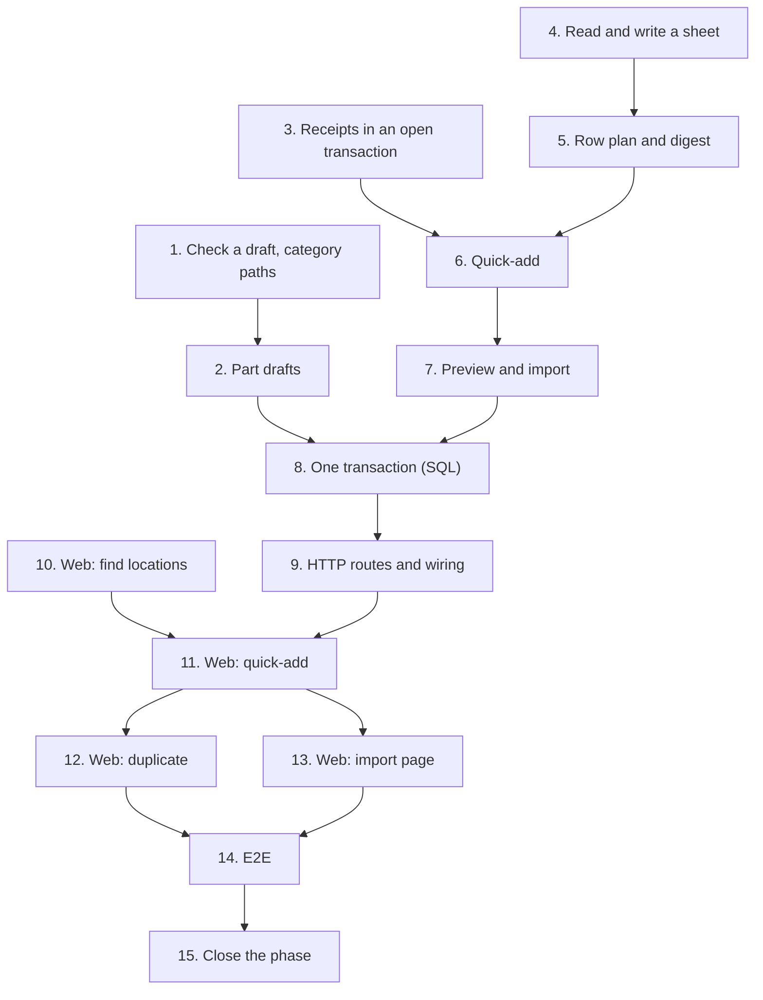

# Implementation Plan

## Overview

Fifteen tasks that build the `quick-add-and-import` slice described in [design.md](design.md)
and required by [requirements.md](requirements.md): catalog's collect-all check, category paths
and `PartDrafts`; inventory's receipts inside an open transaction, the sheet reader, the row
plan and its digest, quick-add, preview and import; the shared-session unit of work in the
composition root; the HTTP routes; the web location picker and filter, quick-add from any page,
duplicate and the import page; the end-to-end journey; and the documentation that closes
`v0.4.0`.

This spec adds no module, no table and no migration: the head stays `0012_units.py`. It extends
`catalog` and `inventory`, and the composition root binds the two into one transaction (design
decision 2). It adds no demo data, and `wiredex demo reset` is unchanged (decision 16).

Branch first. Before task 1, run `git switch main && git pull && git switch -c
feat/quick-add-and-import`, and never commit this spec's work on `main`. Task 1's commit also
adds this spec's `requirements.md`, `design.md` and `tasks.md`.

One task, one commit. Every commit has to pass `make check` **on its own**, because `main` is
rebase-merged and each commit lands (AGENTS.md). Each task says when it also needs
`make coverage` (it touches SQL or its wiring), `make e2e` (it touches the web) or `make client`
(it changes routes or schemas; the regenerated client goes in that same commit). Tick the task
in this file in the same commit. Suggested Conventional Commit subjects are in `code` under
each task.

Release footer: this spec is **the last of three** in `v0.4.0` (05-inventory-stock and
06-tracked-units are merged), so it closes the phase. Task 15, the phase-closing documentation,
carries `Release-As: 0.4.0` in its commit footer. That commit changes files, so the rebase merge
keeps it and its footer (ADR 0012's amendment); no other task carries the footer, and it never
goes on an empty commit. See [Notes](#one-pr-per-spec-and-the-release).

## Tasks

- [x] 1. Catalog: check a whole draft, and find categories by path
  - `catalog/domain/schema.py`: `AttributeSchema.check(values) -> tuple[AttributeProblem, ...]`,
    every missing required value, refused value and unknown key at once, in form order and then
    the unknown keys; `validate` unchanged.
  - `catalog/domain/category.py`: `CategoryPaths` (`find(text)` by the folded tail of a path,
    `path_of(category)`); `catalog/domain/errors.py`: `AmbiguousCategoryError`, asserted a
    `CatalogError` in `tests/catalog/test_errors.py`.
  - `tests/catalog/test_schema.py`: each problem kind, several at once, their order;
    **property 3** (`check` reports nothing exactly when `validate` accepts, and `validate`'s
    refused key is among `check`'s) as Hypothesis.
  - `tests/catalog/test_category.py`: a full path, a tail, a unique name, case, accents and
    spacing ignored, an ambiguity naming both paths, not found; **property 2** over generated
    category trees.
  - This commit also adds `.kiro/specs/07-quick-add-and-import/requirements.md`, `design.md` and
    `tasks.md`, on the `feat/quick-add-and-import` branch.
  - Checks: `make check`.
  - `feat(catalog): check every attribute of a draft and find categories by path`
  - _Requirements: 1.5, 5.4, 5.5_

- [x] 2. Catalog: part drafts inside a caller's transaction
  - `catalog/application/ports.py`: `CatalogRepositories` (the four read-only repository
    properties) and `CatalogUnitOfWork(CatalogRepositories, UnitOfWork, Protocol)`;
    `load_category`, `resolve_schema`, `resolve_tracking` and `load_part` take
    `CatalogRepositories`.
  - `catalog/application/parts.py`: `define_part(work, new, clock, ids)` out of
    `DefinePart.__call__`, which now opens, calls it and commits.
  - `catalog/application/drafts.py`: `RawPartDraft`, `DraftProblemKind`, `DraftProblem`,
    `DraftReview` and `PartDrafts`. `review` answers a stored part by its folded manufacturer and
    part number, or else every problem of a new part at once, with the resolved flag and the
    identity, reading the tree once and each schema once per instance. `define` reviews again,
    refuses, calls `define_part` and copies `pinout_from`'s pinout. Neither commits.
    `catalog/domain/errors.py`: `DraftRefusedError`, carrying the problems.
  - `tests/catalog/test_drafts.py` over `InMemoryCatalog`: every field's problem together; a
    stored part matched, folded and without a manufacturer; the inherited flag; the identity; a
    yes-or-no attribute read from `yes`, `SIM` and `0`, and `maybe` refused; `define` equal to
    `DefinePart`'s part; a missing pinout source refused; no commit; the tree and each schema
    read once for a batch of drafts; **property 8** (a duplicate's pinout equals its source's,
    the source unchanged) with the strategies in `tests/support/pinouts.py`.
    `tests/catalog/test_part_use_cases.py` stays green unchanged.
  - Checks: `make check`.
  - `feat(catalog): review and define part drafts inside a caller's transaction`
  - _Requirements: 1.1, 1.5, 1.6, 3.2, 3.3, 3.4, 5.1, 5.3, 5.7, 5.9, 12.2_

- [x] 3. Inventory: receipts inside an open transaction
  - `inventory/application/movements.py`: `ReceiveStock.perform(workspace_id, work, receipt) ->
    StockBalance`, the lot, the `RECEIVE` and the balance without the commit; `__call__` keeps
    the `Parts` check, opens, performs and commits, as `MoveStock` does.
  - `inventory/application/units.py`: `ReceiveUnits.perform(workspace_id, work, receipt) ->
    UnitsReceived`, the duplicate checks, the lot, the `RECEIVE`, the codes and the units
    without the commit; `__call__` the same way.
  - `tests/inventory/test_movement_use_cases.py` and `test_unit_use_cases.py`: both `perform`s
    write without committing, and a caller running two of them commits once. Every existing test
    passes unchanged: the two routes behave as before.
  - Checks: `make check`.
  - `refactor(inventory): let receipts run inside a transaction another use case opened`
  - _Requirements: 8.6, 12.1_

- [x] 4. Inventory: read and write a sheet
  - `inventory/domain/sheet.py`: `Column`, `SheetRow`, `Sheet`, `read_sheet` (the byte-order
    mark, `not_utf8`, the header and its separator, `csv` quoting, header spellings folded in
    both languages, attribute keys, blank rows counted, overflow, the 500-entry and 64-column
    caps), `write_sheet`, `template_sheet` and `SheetRefusal`; `inventory/domain/errors.py`:
    `SheetUnreadableError`, carrying its code and column.
  - `tests/inventory/test_sheet.py`: each separator; quoted separators, doubled quotes and line
    breaks; the byte-order mark; U+FFFD refused; every fixed column in English and Portuguese,
    with case, accents and spacing varied; an attribute column; `unknown_column` and
    `duplicate_column` (including `quantity` beside `quantidade`); 500 and 501 entries, 64 and 65
    columns; blank rows keeping the spreadsheet's numbers; a short row and an overflowing one;
    the template read back as the nine fixed columns; **property 1** (writing then reading gives
    the same sheet, for each separator) as Hypothesis.
  - Checks: `make check`.
  - `feat(inventory): read and write import sheets`
  - _Requirements: 4.1, 4.2, 4.3, 4.4, 4.5, 4.6, 4.7, 4.8, 4.9, 12.7_

- [x] 5. Inventory: plan a row's stock and fingerprint a plan
  - `inventory/domain/intake.py`: `ProblemCode`, `CellProblem`, `PartDraft`, `KnownPart`, the
    part outcomes (`DefinesPart`, `NamesPart`, `SameAsRow`), `UnitLabels`, `ReceivesLot`,
    `ReceivesUnits`, `PlannedRow`, `ImportPlan` (`problems`, `summary`, `digest`),
    `ImportSummary`, `plan_stock`, `quantity_problem`, `SheetBook`, the limits and the sheet's
    500-unit rule.
  - `inventory/domain/location.py`: `LocationPaths` (a short code first, then a path's tail;
    `path_of`); `inventory/domain/errors.py`: `AmbiguousLocationError`.
  - `tests/inventory/test_intake_plan.py`: every `plan_stock` rule (a lot, units, one unit per
    label, counted in lots, one of the pair without the other, nothing given, and the quantity
    cells `1,000`, `12 pcs` and `-3` refused); `quantity_problem` at 0, 1, 100, 101, 1,000,000
    and 1,000,001; a MAC canonicalized and a bad one; `SheetBook` naming the earlier row; 500
    and 501 planned units; the summary; **property 6** (the digest follows what the plan will
    do) as Hypothesis.
  - `tests/inventory/test_location.py`: a code in any case, a path, a tail, an ambiguity;
    **property 2** over generated location trees.
  - Checks: `make check`.
  - `feat(inventory): plan an import row's stock and fingerprint the plan`
  - _Requirements: 6.1, 6.2, 6.3, 6.4, 6.5, 6.6, 6.7, 6.8, 6.10, 6.11, 7.3, 7.4, 7.6_

- [x] 6. Inventory: quick-add
  - `inventory/application/ports.py`: `PartReview`, `PartCatalog`, `IntakeUnitOfWork` and
    `IntakeUnitOfWorkFactory`.
  - `inventory/domain/errors.py`: `IntakeRefusedError` (the problems), `PartAlreadyDefinedError`
    (the known part) and `ImportChangedError`, each asserted an `InventoryError` in
    `tests/inventory/test_errors.py`.
  - `inventory/application/intake.py`: `QuickStock`, `QuickAddition`, `QuickAdded` and
    `QuickAdd`: review; a 409 for a stored part; every problem together as one 422 (the review's,
    the location through `locations.get`, `quantity_problem` against the review's flag); define
    through the port with `pinout_from`; one `perform`; one commit.
  - `tests/support/inventory.py`: `FakePartCatalog` (categories by id and by path with a flag
    and required keys, parts by folded manufacturer and part number, and a record of the drafts
    it defined and the pinout sources it was given), and `InMemoryIntake(InMemoryInventory)`
    exposing it as `catalog`; the `World` builds on it.
  - `tests/inventory/test_quick_add.py`: a part alone; a lot with its balance; three units with
    their codes; every problem at once; the 409 naming the part; an unknown location; the
    quantity bounds for each kind of part; nothing written and no commit on a refusal; one commit
    on success; `pinout_from` reaching the port.
  - Checks: `make check`.
  - `feat(inventory): quick-add a part with its first stock`
  - _Requirements: 1.1, 1.2, 1.3, 1.4, 1.5, 1.6, 1.8, 1.9, 3.2, 12.1_

- [x] 7. Inventory: preview and import a sheet
  - `inventory/application/imports.py`: `plan_import` (the location tree read once; each row's
    draft reviewed through the port; `NamesPart`, `SameAsRow` or `DefinesPart`; `plan_stock`;
    labels against `SheetBook` and the stored units; `extra_cells`; the 500-unit rule),
    `PreviewImport` (never commits), `ImportSheet` (plans again; a 422 on any problem and a 409
    on another digest before a single write; defines, receives in row order and commits once)
    and `ImportResult`.
  - `tests/inventory/test_imports.py` over `InMemoryIntake`: named, same-as-row and new parts;
    two rows without a part number planning two parts; a blank attribute cell not given; the
    summary; a stored serial refused for the same part and allowed for another; a stored MAC;
    the location tree read once whatever the rows; **property 4** (nothing written unless a clean
    plan is confirmed), **property 5** (an import does exactly what its preview showed, the
    ledger and unit counts agreeing afterwards, a second import defining no part again) and
    **property 7** (quick-add agrees with a one-row import) as Hypothesis over generated sheets.
  - Checks: `make check`.
  - `feat(inventory): preview and import a sheet in one transaction`
  - _Requirements: 5.1, 5.2, 5.6, 5.8, 6.9, 6.11, 7.1, 7.2, 7.5, 8.1, 8.2, 8.3, 8.5, 8.6, 8.7,
    12.2, 12.7_

- [x] 8. One transaction across catalog and inventory
  - `catalog/infrastructure/unit_of_work.py`: `SqlCatalogRepositories(session, workspace_id)`;
    `SqlCatalogUnitOfWork` builds its repositories through it.
  - `bootstrap/intake.py`: `CatalogPartDesk` (the `PartCatalog` port over one `PartDrafts`:
    drafts and reviews translated, each `DraftProblemKind` onto the `ProblemCode` of its name,
    catalog's refusals raised as inventory's) and `SqlIntakeUnitOfWork(SqlInventoryUnitOfWork)`,
    whose `__aenter__` binds `catalog` to the same session.
  - `tests/bootstrap/test_intake_desk.py`, over the in-memory catalog: every `DraftProblemKind`
    has its `ProblemCode`, and each catalog refusal is translated.
  - `tests/integration/test_intake_transaction.py`, as `wiredex_app`: a quick-add's part and
    stock land in one commit; a duplicate's pins land with it; a receipt failing after the part
    is defined leaves no part, lot, movement, balance or unit; a preview leaves every table's row
    count unchanged; workspace B's category path, part number and location code are unknown to
    A's sheet.
  - `tests/integration/test_demo_cli.py` (extended): a part and its stock quick-added in a demo
    bench are gone after `wiredex demo reset`, which restores only the sample data it always
    has.
  - Checks: `make check`, then `make coverage`: this task is SQL. `wiredex db check` still finds
    no drift, with the head at `0012_units.py`.
  - `feat(inventory): run quick-add and import in one transaction with the catalog`
  - _Requirements: 1.2, 1.3, 1.4, 3.2, 8.4, 10.1, 10.2, 10.5, 12.1, 12.3, 12.4, 12.6_

- [x] 9. HTTP routes and wiring
  - `inventory/api/schemas.py`: `QuickPartBody`, `QuickStockBody`, `QuickAddRequest`,
    `QuickAddResponse`, `CellProblemResponse`, `ImportSheetRequest` (at most 262,144
    characters), `ImportRequest` (plus the 64-hex `digest`), `ImportPreviewResponse`,
    `ImportRowResponse`, `PartOutcomeResponse`, `StockOutcomeResponse`,
    `ImportSummaryResponse`, `ImportedPartResponse` and `ImportResultResponse`;
    `ProblemCodeName` as a `Literal`.
  - `inventory/api/router.py`: `_add_intake_routes` with `POST /inventory/quick-add`,
    `POST /inventory/imports/preview`, `POST /inventory/imports` and
    `GET /inventory/imports/template`; `_structured_refusals()` nested inside `_refusals()`;
    `InventoryUseCases` gains `quick_add`, `preview_import` and `import_sheet`.
  - `bootstrap/inventory.py`: the three use cases over `SqlIntakeUnitOfWork` and the same
    `ReceiveStock` and `ReceiveUnits` instances the routes use; `tests/support/inventory.py`:
    `World.inventory_use_cases()` gains them.
  - `tests/inventory/test_intake_api.py`: every route and status; the structured bodies; a
    preview with problems answering 200; a stock pair missing a half refused; the template's
    `text/csv` and its header; `ProblemCodeName` kept in step with `ProblemCode`.
    `tests/inventory/test_inventory_auth.py`: 401 without a session, 403 without CSRF on the three
    POSTs.
  - Run `make client`, add aliases for the new schemas to `packages/api-client/src/index.ts`, and
    commit the regenerated client in this task.
  - Checks: `make check`, `make coverage` (the wiring runs in the integration suite),
    `make client`.
  - `feat(inventory): expose quick-add and sheet import over HTTP`
  - _Requirements: 1.5, 1.6, 1.7, 3.4, 4.6, 4.9, 7.2, 7.5, 7.6, 8.2, 8.3, 8.5, 10.3, 10.4, 12.5,
    12.6_

- [x] 10. Web: find locations by name or short code
  - `features/inventory/inventory.ts`: `locationPath` and `matchesLocation`.
  - `features/inventory/LocationPicker.tsx`: a combobox over the loaded tree, filtering by name,
    path or code, each option showing its code and path; arrows, Enter and Escape; an exact code
    picked on Enter.
  - `features/inventory/LocationsPage.tsx`: the *Filter locations* box, matches kept with their
    ancestors.
  - `inventory.picker.*` and `inventory.locations.filter*` keys in both `en.json` and
    `pt-BR.json`.
  - `LocationPicker.test.tsx` and `LocationsPage.test.tsx` (extended), with MSW: by code, by
    name, by a fragment of a path, nothing found, keyboard only, every control found by role and
    accessible name.
  - Checks: `make check`, `make e2e`.
  - `feat(web): find locations by name or short code`
  - _Requirements: 9.1, 9.2, 9.3, 11.8, 11.9_

- [x] 11. Web: quick-add from any page
  - `features/catalog/partFields.tsx`: the category choice, the detail fields and the Zod
    resolver moved out of `PartForm.tsx`, which keeps its behaviour and its tests.
  - `features/inventory/intake/intake.ts`: `useQuickAddPart` and `IntakeRefusal`, invalidating
    the catalog and inventory roots; `intake/problems.ts`: `problemText`.
  - `intake/QuickAddProvider.tsx`: `QuickAddProvider` and `useQuickAdd().open(options)`, with
    Alt+N handled outside text fields and dialogs.
  - `intake/QuickAddDialog.tsx`: the part fields, the category's fields, `LocationPicker`, the
    quantity with the unit-tracked hint; Enter submits; each problem on its field; the 409 with a
    link to the part; the done panel with *Add another* (keeping the category, manufacturer,
    package and location) and *Open the part*.
  - `app/AppLayout.tsx`: the provider around the signed-in layout, and the header's *Quick add*
    button with `aria-keyshortcuts="Alt+N"` and its visible hint.
  - `inventory.quickAdd.*` and `inventory.intake.problem.*` keys in both locale files, with a
    sentence for every `ProblemCodeName`.
  - `QuickAddProvider.test.tsx` and `QuickAddDialog.test.tsx`, with MSW: Alt+N opens it and
    doesn't from inside a text field; the header button; focus, Enter and Escape; a lot and a
    unit-tracked quick-add; the problems on their fields; the 409 link; *Add another*;
    `open(options)` prefilling a category, a location and a name; every code translated.
  - Checks: `make check`, `make e2e`.
  - `feat(web): quick-add a part from any page`
  - _Requirements: 1.1, 1.2, 1.3, 1.5, 1.6, 2.1, 2.2, 2.3, 2.4, 2.5, 2.6, 2.7, 11.7, 11.8,
    11.9_

- [x] 12. Web: duplicate a part
  - `features/catalog/PartPage.tsx`: *Duplicate* beside *Edit*, calling
    `useQuickAdd().open({ duplicateOf: part })`.
  - `intake/QuickAddDialog.tsx`: the duplicate's title and prefill (the category, the name
    selected, the manufacturer, the package and the attribute values as displayed; the part
    number blank), sending `pinout_from` when the part has pins.
  - `catalog.part.duplicate` and `inventory.quickAdd.duplicateTitle` in both locale files.
  - `PartPage.test.tsx` and `QuickAddDialog.test.tsx` (extended): *Duplicate* opens the
    prefilled dialog with the name selected and the part number blank; the saved body carries
    `pinout_from` only when the source has pins.
  - Checks: `make check`, `make e2e`.
  - `feat(web): duplicate a part from its page`
  - _Requirements: 3.1, 3.2, 3.3_

- [x] 13. Web: import a sheet
  - `intake/intake.ts`: `usePreviewImport` and `useImportSheet`.
  - `intake/ImportPage.tsx`: the file input and the text box (a chosen file fills the box),
    *Preview*, the summary in a polite live region, *Import* only for a clean preview of the
    text as it stands, the changed-since-preview message with *Preview again*, the result with
    its unit codes, and *Download the template*.
  - `intake/ImportPreviewTable.tsx`: each row's number, part, stock and translated problems,
    and the sheet's own problems above the table.
  - `app/router.tsx`: `/import`; `features/catalog/PartsPage.tsx`: *Import from a sheet* beside
    *New part*.
  - `inventory.import.*` keys in both locale files.
  - `ImportPage.test.tsx`, with MSW: a file filling the box; a preview with problems keeping
    *Import* off; an edit after a clean preview turning it off again; a clean import showing the
    summary and the codes; a 409 offering *Preview again*; an unreadable sheet's message;
    `PartsPage.test.tsx` (extended) for the link. The web suite stays at or above its 85 %
    floor.
  - Checks: `make check`, `make e2e`.
  - `feat(web): import parts and stock from a sheet`
  - _Requirements: 11.1, 11.2, 11.3, 11.4, 11.5, 11.6, 11.7, 11.8, 11.9, 12.6_

- [x] 14. End-to-end journey
  - `e2e/tests/intake.spec.ts`, reusing the logged-in session, every name and the MAC stamped
    with `Date.now()`:
    - Set up through the pages, as the other journeys do: a location `Bin <stamp>`, a
      lot-counted root category `Passives <stamp>`, and a root category `Boards <stamp>` marked
      tracked individually.
    - Press Alt+N on the dashboard; quick-add part A in Passives with 25 into the bin, the bin
      picked by typing its name; Enter; *Add another* keeps the category and the bin; add part B
      with 10; *Open the part* shows `10 in stock`.
    - On B's page, *Duplicate*: the name is selected and the part number blank; save it as part
      C with a new number; C's page shows B's category and `0 in stock`.
    - From the parts page, *Import from a sheet*: choose a file (`setInputFiles` with a buffer)
      with Portuguese headers and semicolons, holding a new part D with 100 into the bin by its
      path, part A's part number with 5, a new board E in Boards with the stamped MAC, and a row
      naming `Nowhere <stamp>`. Preview: the bad row shows *unknown location* and *Import* is
      off. Fix that row in the text box, preview again, import: the result shows E's `WX-U-…`
      code.
    - A's page shows `30 in stock`; the units search finds E by its MAC.
  - Checks: `make e2e`.
  - `test(e2e): cover quick-add, duplicate and sheet import`
  - _Requirements: all, end to end_

- [ ] 15. Close the inventory phase
  - `README.md`: tick the four `v0.4.0` lines: "Location tree with human-readable short codes"
    (05, with task 10 making the codes searchable), "Tracked units (label, serial or MAC)" (06),
    "Keyboard-first quick-add and duplicate-part" and "CSV import with validated preview". The
    Features table's Inventory row says human-readable short codes instead of printable QR
    labels; the Quality gates' *Property tests* row is marked ✅.
  - `docs/architecture.md`: §10 question 1 answered ("**Decided (2026-09-26):** every
    microcontroller board is a unit, by its category's *tracked individually* flag, inherited
    along the tree", linking 06's design) and question 7 answered (no printed labels; locations
    and units carry short codes that are shown and searchable); §4's sentence about QR labels and
    `LOC-7K2Q` replaced by the `WX-L-`/`WX-U-` codes; §7's keyboard-first line names quick-add's
    Alt+N and `useQuickAdd`, which the `v0.8.0` palette opens; §2's inventory → catalog arrow adds
    "intake defines parts".
  - `docs/adr/0001-modular-monolith.md`: an "Implementation (v0.4)" section. Modules reach each
    other through ports the consumer declares and bootstrap implements; a write into two modules
    rides the caller's unit of work, the port being a property of it that bootstrap binds to the
    same session, so one commit and one workspace setting cover both; the provider offers
    in-transaction operations over a repositories-only protocol (`PartDrafts` over
    `CatalogRepositories`, as `MoveStock.perform` runs inside `MoveUnit`). Quick-add and import
    use it first, `v0.5.0`'s build lifecycle next.
  - `docs/adr/0002-stock-ledger.md`: the "Implementation (v0.4)" section gains the units rules.
    Units ride the ledger: receiving N units is the lot, one `RECEIVE` of N and N unit rows in
    one transaction, and a lot's `on_hand` equals its in-stock units. Moving a unit is the
    two-row `MOVE` of 1 and a repointed lot. Retiring is an `ADJUST −1` (`damaged` or `lost`) and
    un-retiring an `ADJUST +1` (`found`), stock-neutral as a pair. Only a retired unit is
    deleted, and its movements stay. Quick-add and import record ordinary `RECEIVE`s, one per
    row.
  - `docs/adr/0007-workspace-isolation.md`: `units` (tracked-units, `v0.4`) joins the list of
    isolated tables; intake adds no table and scopes catalog and inventory together in one
    transaction.
  - `AGENTS.md`, Architecture rules: one line on cross-module writes (the caller exposes the port
    on its unit of work, bootstrap binds it to the same session, the other module offers
    `perform`-style operations that never commit; ADR 0001).
  - The commit's footer is `Release-As: 0.4.0`. It changes files, so the rebase merge keeps it.
  - Checks: `make check`.
  - `docs: close the inventory phase`, with the footer `Release-As: 0.4.0`
  - _Requirements: none (documentation)_

## Task Dependency Graph



The same graph as waves: every task in a wave can be worked once the waves above it have
landed.

```json
{
  "waves": [
    {
      "wave": 1,
      "tasks": [
        { "id": "1", "name": "Check a draft, category paths", "dependsOn": [] },
        { "id": "3", "name": "Receipts in an open transaction", "dependsOn": [] },
        { "id": "4", "name": "Read and write a sheet", "dependsOn": [] },
        { "id": "10", "name": "Web: find locations", "dependsOn": [] }
      ]
    },
    {
      "wave": 2,
      "tasks": [
        { "id": "2", "name": "Part drafts", "dependsOn": ["1"] },
        { "id": "5", "name": "Row plan and digest", "dependsOn": ["4"] }
      ]
    },
    { "wave": 3, "tasks": [{ "id": "6", "name": "Quick-add", "dependsOn": ["3", "5"] }] },
    { "wave": 4, "tasks": [{ "id": "7", "name": "Preview and import", "dependsOn": ["6"] }] },
    {
      "wave": 5,
      "tasks": [{ "id": "8", "name": "One transaction (SQL)", "dependsOn": ["2", "7"] }]
    },
    {
      "wave": 6,
      "tasks": [{ "id": "9", "name": "HTTP routes and wiring", "dependsOn": ["8"] }]
    },
    {
      "wave": 7,
      "tasks": [{ "id": "11", "name": "Web: quick-add", "dependsOn": ["9", "10"] }]
    },
    { "wave": 8, "tasks": [{ "id": "12", "name": "Web: duplicate", "dependsOn": ["11"] }] },
    { "wave": 9, "tasks": [{ "id": "13", "name": "Web: import page", "dependsOn": ["11"] }] },
    { "wave": 10, "tasks": [{ "id": "14", "name": "E2E", "dependsOn": ["12", "13"] }] },
    { "wave": 11, "tasks": [{ "id": "15", "name": "Close the phase", "dependsOn": ["14"] }] }
  ]
}
```

Reading it:

- **Roots.** 1, 3, 4 and 10 depend on nothing. 10 is web-only over the locations endpoint 05
  already serves, so it can land at any point before 11, which needs its picker. The whole spec
  sits downstream of 05 and 06 having merged (the ledger, `ShortCodes`, `ReceiveUnits`,
  `MoveStock.perform`), which is a phase-level dependency, not a task edge.
- **Critical path.** 4 → 5 → 6 → 7 → 8 → 9 → 11, then 12 and 13 one after the other, then 14
  → 15. The catalog chain (1 → 2) runs beside it and joins at 8.
- **Parallel.** 1, 3, 4 and 10 at the start, then 2 and 5. 12 and 13 don't depend on each other,
  but both write the locale files (and 13 extends `intake.ts`, which 11 created), so they land
  one after the other rather than side by side.
- **Why these edges.** 6 needs 3's `perform`s and 5's vocabulary; 7 builds on 6's ports and
  fakes; 8 binds 2's `PartDrafts` to 6's port and runs 7's use cases on Postgres; 9 wires what 8
  built; 11 uses 9's regenerated client and 10's picker; 14 walks everything; 15 goes last,
  because its README ticks are only true once 14 passes.

## Notes

### Before pushing

- `make check` on every commit, not only the last.
- `make coverage` on the commits touching SQL or its wiring (8, 9): API floor 90 %, web floor
  85 %.
- `make e2e` on the web commits (10–13) and after task 14.
- `make client` in task 9, whose commit carries the regenerated client and the new aliases in
  `packages/api-client/src/index.ts`; after it, `make client` must leave the package unchanged,
  or CI's contract gate fails.
- No migration: `wiredex db check` must stay clean with the head at `0012_units.py`.

### One PR per spec, and the release

The owner chose one PR per spec with auto-merge (2026-09-27). Open this spec's PR from
`feat/quick-add-and-import`, based on `main` after 06-tracked-units merged, with
`gh pr merge N --rebase --auto`. Task 15's `Release-As: 0.4.0` footer lands with it, so
release-please's PR becomes `0.4.0` and ships the whole Inventory phase at once. Merging that
release PR deploys to production: only the owner does it (AGENTS.md, Safety), never an agent.
