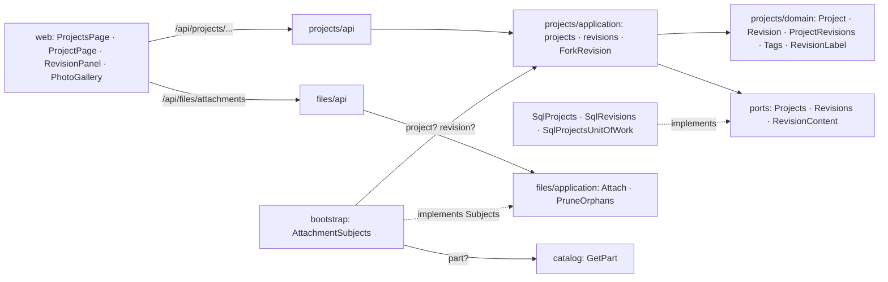
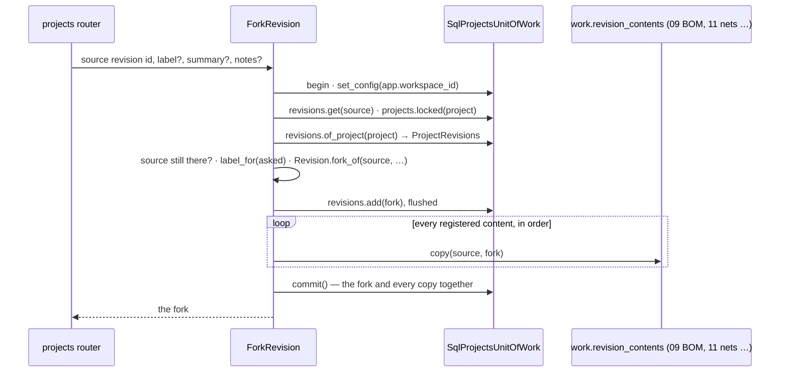

# Design Document: projects and revisions

## Overview

The first of three specs in `v0.5.0` Projects & BOM. It delivers the roadmap's *projects with
description, tags and photos* and *revisions, including forking from an existing revision*,
and it creates the `projects` module that [docs/architecture.md](../../../docs/architecture.md)
§2 plans — *projects · revisions · BOM · netlist* — leaving the BOM to
[09-bill-of-materials](../09-bill-of-materials/design.md), the build lifecycle to
[10-build-lifecycle](../10-build-lifecycle/design.md) and the netlist to 11-netlist-editor.
It builds what [ADR 0003](../../../docs/adr/0003-project-revisions.md) decided: `Project`
holds identity, description, tags and photos; `Revision` (`A – breadboard`) holds what those
later specs add; a new revision can be forked from an existing one; the latest opens by
default.

Most of the module is ordinary: two aggregates, their repositories, a router. Three things
carry the design. What a revision stores now, so that 10 adds a state machine without
reshaping the table (decision 5). How a fork copies content that doesn't exist yet, so that
09 and 11 extend it without editing it (decision 6). And how `files`, which only knew parts,
comes to hold a project's photos and a revision's files without importing either (decisions
12 and 13).

**Owner decisions that bind this spec**, and what each does here:

- **A BOM line names exactly one part definition; no substitutes before 1.0** (2026-09-27).
  09's to build. Here it only means a fork will copy BOM lines exactly as 09 stores them.
- **Consumables are marked "not stocked"** by a category flag inherited like
  `tracked_individually` (2026-09-27). 09 builds it; nothing here reads it.
- **One PR per spec with auto-merge; the release PR waits for the phase's last spec, and only
  the owner merges it** (2026-09-27). This spec is the phase's first: it carries no
  `Release-As` footer, and its commits wait on `main` for 10's release.
- **No printed QR labels; short codes where a label is stuck on a thing** (2026-09-26, 05).
  Why projects get no code (decision 10).
- **A change history waits for `v0.8.0`** (2026-09-26, 05). A fork records its source and
  nothing else logs edits.

**Decisions this spec makes (2026-09-27), for the owner to check.** Where the repository
doesn't settle something, it is decided here, with the reason:

1. **`projects` is a module of its own.** ADR 0001 names it and docs/architecture.md §2 draws
   it. It gets the four layers of §3, a router factory built in `bootstrap/app.py`, and a
   place in all three import-linter contracts from its first commit, so its layers and its
   independence are checked before there is code to break them. It imports no other module:
   `files` learns whether a project or a revision exists through its `Subjects` port, which
   the composition root answers from projects' read use cases (decision 12), the way it
   answers parts from catalog.
2. **A project always has a revision.** Creating a project creates revision `A` in the same
   transaction, and a project's only revision can't be deleted (409: delete the project
   instead). ADR 0003's "the latest revision opens by default" then always has an answer, the
   project page never shows a project with no revision, and 09's BOM editor always has a
   revision to put lines on.
3. **The latest revision is the one created last**, by `created_at` and then the
   time-ordered UUIDv7 id. No "current revision" pointer to keep in step: forking `C` from `A`
   while `B` exists makes `C` the latest, because `C` is the newest work. Nothing stores
   "latest"; it is read off the revisions.
4. **Labels are short, unique per project, and suggested.** A label is 1–16 ASCII letters,
   digits, `.`, `-` or `_`, starting and ending with a letter or a digit (`A`, `B`, `v2`,
   `1.1`, `rev-c`), and two revisions of one project can't share one, ignoring case. What the
   revision *is* goes in a separate summary, so ADR 0003's `A – breadboard` is the label `A`
   and the summary *breadboard*. When no label is typed, the suggestion steps the latest
   revision's label — its trailing number up by one, keeping its zero padding (`v2` → `v3`,
   `v09` → `v10`), or else its trailing letters in spreadsheet-column order (`A` → `B`, `Z` →
   `AA`) — until it reaches a free one, and a project's first revision is `A`. The API applies
   it when a request leaves the label out and answers it as the project's `next_label`, so the
   fork dialog prefills the same value. ASCII keeps the stepping and the case folding
   unambiguous.
5. **The status is stored now, and it is always `draft`.** `revisions.status` is text with a
   CHECK over ADR 0003's four states — `draft`, `reserved`, `built`, `dismantled` — and
   `RevisionStatus` names all four, but nothing in this spec moves a revision out of `draft`.
   10-build-lifecycle then adds transitions and their stock effects, not a column or a CHECK:
   the "expand now" the ledger's `kind` column took in `0010`, so 10's migration needs nothing
   for the status itself. The rules that depend on a status are written now against the stored
   value and tested with revisions built in each state: only a draft can be deleted, so a
   project can be deleted only while every revision of it is a draft; a revision in any status
   can be forked, since the next stage starts from what was built; a revision's label, summary
   and notes can be edited in any status. What else a status locks (a reserved revision's BOM)
   is 09's and 10's to say.
6. **A fork copies through the revision contents its unit of work carries.** `ForkRevision`
   creates the draft, then asks every `RevisionContent` of `work.revision_contents` to copy
   itself from the source to the fork, in the order they are registered, and commits once: the
   fork and every copy land together or not at all. This spec registers none, so a fork today
   copies the lineage and nothing else. The extension point is the unit of work, not the use
   case:
   - 09-bill-of-materials adds its BOM-line repository to `SqlProjectsUnitOfWork` (and to the
     in-memory fake) and registers `CopyBomLines(self.bom_lines)` first;
   - 11-netlist-editor registers `CopyNetlist(self.nets)` after it, because a copied net finds
     the BOM line its pins belong to in the fork by designator, which 09 keeps unique per
     revision, so no map of old ids to new ones passes between contents;
   - content another module keeps (13-firmware-versions' firmware line, if its design keeps
     one per revision) is registered by a bootstrap unit of work that extends
     `SqlProjectsUnitOfWork` and binds that module's port to the same session, 07's
     cross-module write pattern ([ADR 0001](../../../docs/adr/0001-modular-monolith.md)
     "Implementation (v0.4)").

   `ForkRevision` never changes; each of those specs proves its own copy with a property of
   its own.
7. **A fork is a draft of the same project that remembers its source and carries no files.**
   `forked_from` keeps the lineage the revision page shows (*Forked from A*) and goes null if
   the source is deleted later. The fork's summary and notes are its own, as the owner types
   them. Photos and files stay where they were added: `A`'s Gerbers and build photos document
   `A`, not `B`. Forking into another project, to start a new design from an old one, is left
   for later; the use case would take a target project, and nothing here stands in the way.
8. **Tags are free text, normalized, per workspace, on the project row.** A tag is Unicode
   NFKC, trimmed, its whitespace collapsed, lower-cased, 1–32 characters with no comma or
   control character (`esp32`, `i2c`, `greenhouse`). A project carries at most 20, stored
   distinct and sorted in a `varchar(32)[]` with a GIN index, the shape `pins.functions`
   already has. There is no tag table: a tag has no identity of its own until something
   renames one across projects, and a workspace holds tens of projects. The list keeps the
   projects carrying every tag asked for (all of them, not any) and those whose name holds a
   text; `GET /projects/tags` answers the workspace's tags with their counts, for the tag box's
   suggestions and the list's filter chips. Row-level security keeps a guest's tags out of the
   owner's suggestions like any other row.
9. **Project names are unique per workspace, ignoring case**, as a part number is: a folded
   unique index. Two projects called *Weather station* would make the list, the tag filter and
   the `v0.8.0` palette ambiguous, and a double-submitted form would create the second.
10. **Projects get no short code.** Short codes exist where a label is stuck on a physical
    thing — a bin, a board — and a project isn't one; what gets built from it is made of units
    that already carry `WX-U-` codes. 19-command-palette finds a project by its unique name or
    its tags. A code later is an additive column, a counter and a backfill, cheap enough not to
    reserve now.
11. **The list opens on recent work.** It is ordered by last activity, newest first: the later
    of the project's own `updated_at` and its revisions' `updated_at`, deleting a revision
    touching its project so the deletion counts. Later specs get this without writing the
    project row: 09's BOM edits touch their revision's `updated_at`. There is no paging: a
    workspace holds tens of projects, and the list costs two queries whatever their number
    (the projects, then their revisions).
12. **Projects hold photos, revisions hold files, both through `files`.** `SubjectKind` gains
    `project` and `revision`, so a photo is an attachment of `project:<id>` and a Gerber
    archive one of `revision:<id>`: stored once by content, counted against the quota and
    pruned exactly as a part's are. A project takes images only (PNG, JPEG, WebP), because ADR
    0003 gives a project photos and its section is a gallery that would otherwise hide a PDF;
    a revision takes everything a part takes. The composition root's `Subjects` adapter, which
    until now read any subject id as a part id, answers each kind from its own module. Deleting
    a project or a revision leaves its attachments for the nightly prune, as deleting a part
    does.
13. **Revisions take Gerbers: `files` learns ZIP.** Gerbers travel as a ZIP of the plotted
    layers and drill files, and docs/architecture.md §10 question 4 puts them in `v0.5.0`. A
    ZIP is recognized by its local-file-header signature (`PK\x03\x04`), like the other four
    types, never by its name; a browser never renders one, and the content route always sends
    it as a download with its own type and `nosniff`, so it brings none of the risk that keeps
    SVG and HTML out (03-files-and-attachments). Two kinds join the four: `schematic` and
    `gerbers`. The web suggests them for a revision's PDF and ZIP, keeps *datasheet* for a
    part's PDF, and suggests *other* for a part's ZIP.
14. **Descriptions and notes are plain text**: line breaks kept, ends trimmed, up to 4,000
    characters, shown as written. No Markdown: rendering it safely needs a sanitizer the web
    doesn't carry, for text only the owner writes.
15. **Changes to one project's revisions take turns.** Adding, forking, relabelling and
    deleting a revision lock the project's row first (`Projects.locked`, a `SELECT … FOR
    UPDATE`) and read the siblings after, so two requests can't both take label `C`, or both
    delete one of the last two revisions. The unique indexes back the label and name rules
    underneath. Two projects created at the same moment under one name can't be serialized by a
    row that doesn't exist yet; the index refuses the second, which fails once with nothing
    written, and the web's disabled *Save* is what keeps a single owner from sending it.
16. **Sample projects in the demo, and a new bench seeded whole.** `wiredex demo reset`
    restores two sample projects after the catalog and the inventory, one of them with revision
    `B` forked from `A`, so a guest sees a fork and can try one. `wiredex demo invite` now
    restores the same sample data the reset does — catalog, inventory and projects — where it
    seeded only the catalog, so a new guest never waits a night for half a bench; this also
    moves when a new bench gets its sample stock and units. No sample photos: 03 keeps binary
    files out of the repository.
17. **Three migrations and no new ADR.** `0013` creates the two tables; `0014` widens the
    subjects an attachment may name; `0015` widens the media types and the kinds. Each only adds
    or widens, so the release before this one keeps working against the schema (Data Models
    says where a manual rollback would still trip). No decision here is costly to reverse
    beyond what ADR 0003 settles, so ADR `0014` stays free. ADR 0007's list of isolated tables
    gains `projects` and `revisions` with `0013`, and ADR 0003 gains its implementation note
    when 10 closes the phase.

**Seen while designing.** `ListAttachments` doesn't check that its subject exists, so listing
`project:<an unknown id>` answers an empty list rather than a 404. That is harmless for a read,
as it already is for a part, and it stays. The composition root's `CatalogSubjects`, by
contrast, read every subject id as a part id: right while parts were the only kind, and what
decision 12 replaces.

In scope:

- The `projects` module (`domain`, `application`, `infrastructure`, `api`), its router, its
  wiring and its import-linter contracts.
- Projects with a name, a description and tags; the workspace's tag list; the project list with
  its text and tag filters.
- Revisions: add, edit, delete and fork; labels and their suggestion; the stored status; the
  latest revision.
- The fork's extension point, `RevisionContent`, for 09, 11 and 13.
- `files`: project and revision subjects, ZIP archives, and the schematic and Gerbers kinds.
- Migrations `0013`, `0014` and `0015`.
- Sample projects in the demo bench, and the invite seeding a bench whole.
- Web: the projects list, the new-project page, the project page with its revisions, forking,
  tags, photos and files, and the *Projects* entry in the navigation.

Out of scope:

- BOM lines, designators, the shortage report and the "not stocked" flag
  (09-bill-of-materials).
- The state machine, `RESERVE`/`RELEASE`/`CONSUME`/`RETURN`, and the phase-closing
  documentation with `Release-As: 0.5.0` (10-build-lifecycle).
- The netlist (11-netlist-editor) and firmware lines (13-firmware-versions).
- Forking into another project, archiving a project, and soft delete with a trash view
  (`v0.8.0`).
- A cover photo in the project list, and thumbnails (images are scaled by the browser, as 03
  left them).
- A history of changes to projects and revisions (`v0.8.0`).

## Architecture



Dependencies point inward in the new module as in every other (`api`/`infrastructure` →
`application` → `domain`), and `projects` imports no other module, which the independence
contract now checks for it too. Two arrows cross modules, and the composition root draws both:
the web sends photos and files to the `files` API with a `project:` or `revision:` subject, and
`files` asks bootstrap's `AttachmentSubjects` whether that subject exists, which asks catalog
about a part and projects about a project or a revision. `projects` doesn't know `files` exists,
and `files` doesn't know projects: it knows three subject kinds and a port.

**The fork, in one transaction.** A fork is the one write here that later specs extend, so its
shape is fixed now:



The project's row is locked before the siblings are read, so the label is chosen against the
revisions as they are once no other change to the project is in flight (decision 15), and the
source is looked for again among them: a source deleted while the fork waited for the lock is a
404, never a fork pointing at nothing. The fork's row is flushed as it is added, so a content
that writes its copies with Core finds the row its foreign keys point at, the reason
`SqlPinouts.replace` flushes before its own statements. Leaving the block without `commit()` —
a refused label, a content raising — discards the fork and every copy together, as
`SqlUnitOfWork` always has.

## Components and Interfaces

### Projects: domain

`apps/api/src/wiredex/projects/domain/`, plain Python like every domain package:

| File | Holds |
| --- | --- |
| `values.py` | `WorkspaceId`, `ProjectId`, `RevisionId`, `ProjectName`, `Description`, `Notes`, `Summary`, `Tag`, `Tags`, `RevisionLabel`, `RevisionStatus`, the limits |
| `project.py` | `ProjectDetails`, `Project` |
| `revision.py` | `RevisionDetails`, `Revision` |
| `project_revisions.py` | `ProjectRevisions`, the first-class collection of one project's revisions |
| `filter.py` | `ProjectFilter` |
| `errors.py` | `ProjectsError` and its leaves |

**Values.** Frozen slotted dataclasses that validate and normalize in `__post_init__`, as
catalog's and inventory's do. `projects` declares its own `WorkspaceId`, as every module does.

```python
WorkspaceId = NewType("WorkspaceId", UUID)
ProjectId = NewType("ProjectId", UUID)
RevisionId = NewType("RevisionId", UUID)

MAX_PROJECT_NAME_LENGTH = 120
MAX_TEXT_LENGTH = 4_000          # a project's description, a revision's notes
MAX_SUMMARY_LENGTH = 120
MAX_TAG_LENGTH = 32
MAX_TAGS = 20
MAX_LABEL_LENGTH = 16


@dataclass(frozen=True, slots=True)
class ProjectName:
    """Trimmed, whitespace collapsed, 1-120 characters, kept as cased."""

    value: str

    def fold(self) -> str:
        """What uniqueness compares: lower(), the unique index's own expression."""


@dataclass(frozen=True, slots=True)
class Description:
    """Plain text: \\r\\n and \\r read as \\n, ends trimmed, line breaks kept, 1-4,000 characters.
    Blank text is no description, which the edge reads as None before it gets here."""

    value: str


@dataclass(frozen=True, slots=True)
class Notes:
    """A revision's notes: what changed, what to watch. The description's rules."""

    value: str


@dataclass(frozen=True, slots=True)
class Summary:
    """A few words on what a revision is (breadboard): trimmed, collapsed, 1-120 characters."""

    value: str


@dataclass(frozen=True, slots=True)
class Tag:
    """A word a project is filed under: NFKC, trimmed, whitespace collapsed, lower-cased,
    1-32 characters, no comma (the tag box splits on it) and no control character."""

    value: str


@dataclass(frozen=True, slots=True)
class Tags:
    """A project's tags: each once, alphabetical, at most twenty (decision 8)."""

    values: tuple[Tag, ...]

    @classmethod
    def of(cls, texts: Iterable[str]) -> Tags:
        """Every text through `Tag`, then deduplicated and sorted; over 20 is refused."""

    @classmethod
    def none(cls) -> Tags: ...

    def include(self, wanted: Tags) -> bool:
        """Whether every wanted tag is among these, what the list's tag filter asks."""

    def texts(self) -> tuple[str, ...]: ...


@dataclass(frozen=True, slots=True)
class RevisionLabel:
    """A revision's short name in its project: 1-16 ASCII letters, digits, '.', '-' or '_',
    starting and ending with a letter or a digit. Kept as typed, compared folded."""

    value: str

    @classmethod
    def first(cls) -> RevisionLabel:
        """`A`, a project's first revision (decision 2)."""

    def fold(self) -> str: ...

    def successor(self) -> RevisionLabel | None:
        """The next label in the owner's own scheme (decision 4): the trailing number up by
        one, keeping its width (v09 → v10, 1.9 → 1.10), or else the trailing letters one step
        on in spreadsheet-column order, in their case (A → B, Z → AA, rev-c → rev-d; letters
        of mixed case step as capitals). None when that would pass 16 characters, the only way
        a label runs out."""


class RevisionStatus(StrEnum):
    """ADR 0003's four states. This spec writes only DRAFT; 10-build-lifecycle moves the rest."""

    DRAFT = "draft"
    RESERVED = "reserved"
    BUILT = "built"
    DISMANTLED = "dismantled"
```

**The project.** One entity, its editable details one comparable value, as catalog's
`PartDetails` is:

```python
@dataclass(frozen=True, slots=True)
class ProjectDetails:
    name: ProjectName
    description: Description | None = None
    tags: Tags = Tags.none()


@dataclass(eq=False)
class Project:
    id: ProjectId
    workspace_id: WorkspaceId
    name: ProjectName
    description: Description | None
    tags: Tags
    created_at: datetime
    updated_at: datetime

    @classmethod
    def start(
        cls, project_id: ProjectId, workspace_id: WorkspaceId, details: ProjectDetails, now: datetime
    ) -> Project: ...

    @property
    def details(self) -> ProjectDetails: ...

    def revise(self, details: ProjectDetails, now: datetime) -> bool:
        """Replaces the details; returns whether anything changed, so a no-op commits nothing."""

    def touch(self, now: datetime) -> None:
        """A revision of it was deleted: the one change its revisions' dates can't show."""
```

**The revision.** Its project and workspace come from the project it is drafted in, or from the
revision it is forked from, never from an argument that could disagree:

```python
@dataclass(frozen=True, slots=True)
class RevisionDetails:
    label: RevisionLabel
    summary: Summary | None = None
    notes: Notes | None = None


@dataclass(eq=False)
class Revision:
    id: RevisionId
    workspace_id: WorkspaceId
    project_id: ProjectId
    label: RevisionLabel
    summary: Summary | None
    notes: Notes | None
    status: RevisionStatus
    forked_from: RevisionId | None
    created_at: datetime
    updated_at: datetime

    @classmethod
    def draft(
        cls, revision_id: RevisionId, project: Project, details: RevisionDetails, now: datetime
    ) -> Revision:
        """A new draft of the project, forked from nothing."""

    @classmethod
    def fork_of(
        cls, source: Revision, revision_id: RevisionId, details: RevisionDetails, now: datetime
    ) -> Revision:
        """A new draft of the source's project, whatever the source's status, remembering it."""

    @property
    def details(self) -> RevisionDetails: ...

    def revise(self, details: RevisionDetails, now: datetime) -> bool:
        """Replaces label, summary and notes, in any status; whether anything changed."""

    def ensure_deletable(self) -> None:
        """Refuses anything but a draft with `RevisionInUseError` (decision 5)."""
```

**One project's revisions.** The rules that look across siblings live in a first-class
collection, built from the one read the repository makes:

```python
@dataclass(frozen=True, slots=True)
class ProjectRevisions:
    """One project's revisions, oldest first."""

    items: tuple[Revision, ...]

    @property
    def latest(self) -> Revision | None:
        """The one created last, created_at then id (decision 3). None only for a project being
        created, before its revision A exists."""

    def suggested_label(self) -> RevisionLabel | None:
        """A for none; else the latest's successor, stepped on past every label taken."""

    def label_for(
        self, asked: RevisionLabel | None, renaming: Revision | None = None
    ) -> RevisionLabel:
        """The label asked for, refused (`DuplicateRevisionLabelError`) when a sibling other than
        `renaming` holds it folded; or the suggestion, refused (`NoLabelLeftError`) when there
        is none."""

    def ensure_removable(self, revision: Revision) -> None:
        """The only revision is kept (`LastRevisionError`), and only a draft goes (decisions 2, 5)."""

    def ensure_all_deletable(self) -> None:
        """Every revision a draft, which deleting the project needs (requirement 1.8)."""

    def includes(self, revision_id: RevisionId) -> bool: ...
```

`suggested_label` always ends: the stepping is strictly increasing within 16 characters, and at
most as many successors can be taken as there are revisions (Property 4).

**The list's filter.** `ProjectFilter(text: str | None, tags: Tags)` with `matches(project)`:
the name contains the text ignoring case, and the project's tags include every wanted tag. The
in-memory fake filters with it and the SQL repository compiles the same two conditions (an
escaped `ILIKE` and `tags @> …`), which the integration tests hold side by side.

**Errors**, each a `ProjectsError(ValueError)` with a message safe to show:

| Error | Raised when |
| --- | --- |
| `ProjectNotFoundError`, `RevisionNotFoundError` | The id isn't in the workspace |
| `DuplicateProjectNameError` | Another project holds the name, folded; the message names it |
| `DuplicateRevisionLabelError` | Another revision of the project holds the label, folded |
| `LastRevisionError` | Deleting a project's only revision |
| `RevisionInUseError` | Deleting a revision that isn't a draft, or a project holding one |
| `NoLabelLeftError` | No label was given and none can be suggested within 16 characters |
| `InvalidProjectNameError`, `InvalidTextError`, `InvalidSummaryError`, `InvalidTagError`, `TooManyTagsError`, `InvalidRevisionLabelError` | A value its value object refuses |

### Projects: application

`projects/application/ports.py`. No repository method takes a workspace: the unit of work is
built for one, and its repositories only see that workspace's rows (ADR 0007), as in every
module.

```python
class Projects(Protocol):
    async def add(self, project: Project) -> None: ...
    async def get(self, project_id: ProjectId) -> Project | None: ...

    async def locked(self, project_id: ProjectId) -> Project | None:
        """The project, its row locked until the transaction ends (decision 15)."""
        ...

    async def named(self, name: ProjectName) -> Project | None:
        """The project holding the name, compared folded as the unique index folds it."""
        ...

    async def matching(self, wanted: ProjectFilter) -> list[Project]: ...

    async def tag_counts(self) -> list[TagCount]:
        """Each tag the workspace's projects carry, with how many carry it, alphabetical."""
        ...

    async def remove(self, project: Project) -> None:
        """The project and, by the database's cascade and the fakes' own, its revisions."""
        ...


class Revisions(Protocol):
    async def add(self, revision: Revision) -> None:
        """Flushed at once, so content copied with Core in the same transaction finds it."""
        ...

    async def get(self, revision_id: RevisionId) -> Revision | None: ...
    async def of_project(self, project_id: ProjectId) -> ProjectRevisions: ...

    async def of_projects(
        self, project_ids: Sequence[ProjectId]
    ) -> Mapping[ProjectId, ProjectRevisions]:
        """Every listed project's revisions in one read, for the list (decision 11)."""
        ...

    async def remove(self, revision: Revision) -> None: ...


class RevisionContent(Protocol):
    """One kind of thing a revision holds, as a fork copies it (decision 6).

    Bound to the fork's transaction by whoever builds the unit of work; never commits. 09's BOM
    lines and 11's nets implement it inside `projects`; content another module keeps arrives
    through a unit of work bootstrap extends.
    """

    async def copy(self, source: Revision, target: Revision) -> None: ...


class ProjectsUnitOfWork(UnitOfWork, Protocol):
    async def clear(self) -> None:
        """Every project and revision of the workspace, for a demo bench being restored."""
        ...

    @property
    def projects(self) -> Projects: ...

    @property
    def revisions(self) -> Revisions: ...

    @property
    def revision_contents(self) -> Sequence[RevisionContent]:
        """What a fork copies, in order. Empty in this spec."""
        ...
```

The commands and views travel next to the ports, as inventory's do:

```python
@dataclass(frozen=True, slots=True)
class NewRevision:
    """A revision to add or fork: no label means the suggested one (decision 4)."""

    label: RevisionLabel | None = None
    summary: Summary | None = None
    notes: Notes | None = None

    def details_with(self, label: RevisionLabel) -> RevisionDetails: ...


@dataclass(frozen=True, slots=True)
class ProjectView:
    project: Project
    revisions: ProjectRevisions      # oldest first; the latest and the next label read off it


@dataclass(frozen=True, slots=True)
class ProjectSummary:
    project: Project
    latest: Revision
    revision_count: int
    last_activity: datetime          # decision 11


@dataclass(frozen=True, slots=True)
class TagCount:
    tag: Tag
    projects: int
```

The use cases, `type UnitOfWorkFactory = Callable[[WorkspaceId], ProjectsUnitOfWork]`, each
one unit of work and nothing saved without `commit()`:

| Use case | In | Does |
| --- | --- | --- |
| `CreateProject` | `projects.py` | Refuses a name another project holds (`named`, 409); `Project.start`, then `Revision.draft` labelled `RevisionLabel.first()`; adds both; commits; answers the `ProjectView` |
| `UpdateProject` | `projects.py` | Loads (404); a changed name must be free (409); `revise`; commits only when something changed; answers the view |
| `DeleteProject` | `projects.py` | Locks the project (404); its revisions `ensure_all_deletable` (409); removes it with its revisions; commits |
| `GetProject` | `projects.py` | The project and its `ProjectRevisions`, two reads |
| `ListProjects` | `projects.py` | `matching(filter)`, then `of_projects` of those ids in one read; a `ProjectSummary` each, ordered by last activity newest first, the id breaking ties |
| `ListProjectTags` | `projects.py` | `tag_counts()` |
| `AddRevision` | `revisions.py` | Locks the project (404); siblings; `label_for(new.label)`; `Revision.draft`; adds; commits |
| `ForkRevision` | `revisions.py` | The sequence diagram: source (404), lock, siblings, the source found again (404), `label_for`, `Revision.fork_of`, add, every content's `copy`, one commit |
| `UpdateRevision` | `revisions.py` | Loads (404); when the label changes, locks the project, finds the revision again among the siblings (404) and asks `label_for(label, renaming=revision)`; `revise`; commits only when something changed |
| `DeleteRevision` | `revisions.py` | Loads (404); locks the project; siblings; the revision found again (404); `ensure_removable` (409); removes it; `project.touch`; commits |
| `GetRevision` | `revisions.py` | The revision, or 404: what `files` asks through `Subjects` |

`load_project`, `lock_project` and `load_revision` sit beside them and raise the 404s, as
catalog's `load_part` does, so "no such project" reads the same through every door.

```python
class ForkRevision:
    """A draft revision started from another of the same project, carrying its content.

    The revision row is this spec's. What a revision holds is copied by the contents the unit
    of work carries, in their order, before the one commit (decision 6): none here, 09's BOM
    lines and 11's nets later, without this class changing.
    """

    def __init__(self, unit_of_work: UnitOfWorkFactory, clock: Clock, ids: IdGenerator) -> None:
        ...

    async def __call__(
        self, workspace_id: WorkspaceId, source_id: RevisionId, new: NewRevision
    ) -> Revision:
        async with self._unit_of_work(workspace_id) as work:
            source = await load_revision(work, source_id)
            await lock_project(work, source.project_id)
            siblings = await work.revisions.of_project(source.project_id)
            if not siblings.includes(source.id):
                raise RevisionNotFoundError("that revision doesn't exist")
            label = siblings.label_for(new.label)
            fork = Revision.fork_of(
                source, RevisionId(self._ids.new_id()), new.details_with(label), self._clock.now()
            )
            await work.revisions.add(fork)
            for content in work.revision_contents:
                await content.copy(source, fork)
            await work.commit()
            return fork
```

### Projects: infrastructure

- `orm.py`: the `projects` and `revisions` tables (Data Models), `Project` and `Revision` mapped
  imperatively, `RevisionStatus` through a non-native `Enum` with its CHECK, as every enum
  column in the schema is.
- `types.py`: `TypeDecorator`s for `ProjectName`, `Description`, `Notes`, `Summary`,
  `RevisionLabel`, and `TagsType`, which stores `Tags` as `varchar(32)[]` and reads it back
  through `Tags.of`.
- `repositories.py`: `SqlProjects` (`locked` with `with_for_update()`, as `SqlUnits.get`
  locks; `named` through `lower(name)`, the index's expression; `matching` with the
  wildcard-escaped `ILIKE` catalog uses and `tags @> :wanted`; `tag_counts` over
  `unnest(tags)`) and `SqlRevisions` (`add` flushing; `of_project` and `of_projects` ordered
  by `created_at, id`). Every statement filters `workspace_id` itself, ADR 0007's first gate.
- `unit_of_work.py`: `SqlProjectsUnitOfWork(SqlUnitOfWork)`, binding `projects`, `revisions` and
  `revision_contents = ()` in `__aenter__`, and `clear()` deleting the workspace's revisions
  and projects.

### HTTP API

`projects/api/router.py`: `create_router(use_cases: ProjectsUseCases, current_workspace)`,
prefix `/projects`, split into `_add_project_routes` and `_add_revision_routes`:

| Method | Path | Answers |
| --- | --- | --- |
| GET | `/projects?q=…&tag=…&tag=…` | 200: `ProjectSummaryResponse[]`, newest activity first; up to 20 tags |
| POST | `/projects` | 201: `ProjectResponse`, with revision `A`; 409 for a name taken; 422 |
| GET | `/projects/tags` | 200: `ProjectTagResponse[]` |
| GET | `/projects/{project_id}` | 200: `ProjectResponse`; 404 |
| PATCH | `/projects/{project_id}` | 200: `ProjectResponse`; 409; 422; 404 |
| DELETE | `/projects/{project_id}` | 204; 409 while a revision isn't a draft; 404 |
| POST | `/projects/{project_id}/revisions` | 201: `RevisionResponse`; 409 for a label taken; 422 when no label can be suggested; 404 |
| PATCH | `/projects/revisions/{revision_id}` | 200: `RevisionResponse`; 409; 422; 404 |
| DELETE | `/projects/revisions/{revision_id}` | 204; 409 for the only revision or one that isn't a draft; 404 |
| POST | `/projects/revisions/{revision_id}/fork` | 201: `RevisionResponse`, the fork; 409; 422; 404 |

`/projects/tags` is declared before `/projects/{project_id}`: FastAPI takes the first route
whose path matches, and `tags` would otherwise reach the id route and fail as a UUID. Every
write is a POST, PATCH or DELETE, so it carries the CSRF header (ADR 0008), which
`test_projects_auth.py` covers. An edit replaces what it names, as a part's edit does: `PATCH
/projects/{id}` carries the name, the description and the tags, `PATCH
/projects/revisions/{id}` the label, the summary and the notes. A blank description, summary
or notes reads as none. `_refusals()` maps the errors as the other routers do, leaf by leaf with
`raise … from error` and no global handler (Error Handling). `make client` runs after this
lands, and `packages/api-client/src/index.ts` gains aliases for the new schemas.

### Files: projects and revisions as subjects

`files/domain/values.py`:

```python
class SubjectKind(StrEnum):
    """What an attachment belongs to: a part, a project's photos, a revision's files."""

    PART = "part"
    PROJECT = "project"
    REVISION = "revision"

    def accepts(self, media_type: MediaType) -> bool:
        """A project takes photos, so images only; a part and a revision take every type."""
```

`Attach` asks `subject.kind.accepts(file.media_type)` once the bytes are sniffed, before
anything is stored, and refuses with `UnsupportedFileTypeError` ("a project takes photos: PNG,
JPEG or WebP"), a 415 like any refused type. Its two part-only sentences name the subject's
kind instead ("that project doesn't exist", "that file is already attached to this
revision"). `Subject.parse` already reads any kind `SubjectKind` knows, so `project:<uuid>` and
`revision:<uuid>` parse with no other change, and the list, content, rename and remove routes
work for them as they are.

`bootstrap/files.py`: `AttachmentSubjects(get_part, get_project, get_revision)` replaces
`CatalogSubjects` in `files_use_cases` and in `prune_orphans_use_case`. `exists` matches on the
kind and asks catalog's `GetPart` or projects' `GetProject` or `GetRevision`, each read-only in
a transaction of its own; a not-found error reads as "no such subject", so an upload to it is a
404 and the prune removes its attachments (requirement 7.8).

### Files: Gerber archives and design-file kinds

```python
class MediaType(StrEnum):
    PDF = "application/pdf"
    PNG = "image/png"
    JPEG = "image/jpeg"
    WEBP = "image/webp"
    ZIP = "application/zip"          # decision 13: Gerbers

    @classmethod
    def sniff(cls, head: bytes) -> MediaType:
        """…the four signatures as before, and b"PK\\x03\\x04", a ZIP's local file header."""

    @property
    def previewable(self) -> bool:
        """Whether a browser shows it in place: the PDF and the images; never a ZIP."""


class AttachmentKind(StrEnum):
    DATASHEET = "datasheet"
    IMAGE = "image"
    PINOUT_DIAGRAM = "pinout_diagram"
    SCHEMATIC = "schematic"
    GERBERS = "gerbers"
    OTHER = "other"

    @classmethod
    def suggested_for(cls, media_type: str, subject: SubjectKind) -> AttachmentKind: ...
```

The suggestion the web mirrors (a suggestion only; the owner changes it before or after the
upload):

| Subject | PDF | Image | ZIP |
| --- | --- | --- | --- |
| part | datasheet | image | other |
| project | — (refused) | image | — (refused) |
| revision | schematic | image | gerbers |

The content route sends a type that isn't `previewable` with `Content-Disposition: attachment`
whether or not `?download=1` was asked, so a ZIP is only ever saved, never opened by the
browser; its `ETag`, `nosniff` and private cache headers are unchanged. The wire's
`MediaTypeName` gains `application/zip` and `AttachmentKindName` gains `schematic` and
`gerbers`, kept in step with the enums by the tests that already do.

### Bootstrap and CLI

- `bootstrap/projects.py` (new): `projects_use_cases(session_factory) -> ProjectsUseCases`,
  every use case over `lambda workspace_id: SqlProjectsUnitOfWork(session_factory,
  workspace_id)`, `SystemClock` and `Uuid7Generator`.
- `bootstrap/app.py`: includes the projects router, with `_projects_workspace(auth)` turning
  the session's workspace into projects' own `WorkspaceId`, as `_inventory_workspace` does.
- `bootstrap/files.py`: `AttachmentSubjects`, above.
- `bootstrap/projects_demo.py` (new): `restore_sample_projects_use_case(settings)`, its own
  engine, as `restore_sample_inventory_use_case` has.
- `bootstrap/cli.py`: `_restore_benches(settings, benches)` opens the catalog, inventory and
  projects restores once and runs them for each bench, in that order. `_reset` calls it after
  the files clear, and `_invite` calls it for the new bench (decision 16). Projects come last
  because 09's sample BOM lines will point at the sample parts.
- `bootstrap/orm.py`: imports `projects.infrastructure.orm`, so Alembic sees the two tables.

`projects/application/demo.py`: `RestoreSampleProjects(unit_of_work, create_project,
update_revision, fork_revision)` clears the bench's projects and writes `SAMPLE_PROJECTS`
through the same use cases the web calls, so a rule that stopped accepting a sample would fail
the nightly job rather than seed something the app can't hold:

| Project | Tags | Revisions |
| --- | --- | --- |
| *Weather station*: a BME280 on an ESP32, logging temperature, humidity and pressure every five minutes | `esp32`, `i2c`, `outdoor` | `A – breadboard`; `B – perfboard`, forked from `A`, with a note on moving the sensor off the board |
| *Greenhouse controller*: waters the tomatoes when the soil dries out | `esp32`, `relay` | `A – breadboard` |

No CLI command is added: the demo restore rides `wiredex demo reset` and `wiredex demo invite`,
and nothing in projects needs a job of its own (ADR 0011).

### Web

`apps/web/src/features/projects/`:

| File | What |
| --- | --- |
| `projects.ts` | `projectKeys` (`all`, `list(filters)`, `tags`, `project(id)`), `useProjects(filters)`, `useProject(id)`, `useProjectTags()`, the mutations (`useCreateProject`, `useUpdateProject`, `useDeleteProject`, `useAddRevision`, `useForkRevision`, `useUpdateRevision`, `useDeleteRevision`), and `ProjectRefusal` carrying the status and the API's message; every write refreshes `projectKeys.all` through `refreshAfterWrite` |
| `ProjectsPage.tsx` | `/projects`: the search box and the tag chips (the workspace's tags, each a toggle with `aria-pressed`), both written to the address (`q`, `tag`) once typing pauses; one row per project (its name linking to it, its tags, the latest revision as `B – perfboard` with its status, the last activity); *New project*; an empty state that offers to clear the filters |
| `ProjectForm.tsx` | Name, description and `TagInput`, React Hook Form with a Zod schema mirroring the value rules; `NewProjectPage` at `/projects/new` and the project page's *Edit* both use it; a 409 lands on the name |
| `TagInput.tsx` | Chips and a text box. Enter or a comma adds what was typed, normalized as the server does so the chip shows what will be stored; Backspace in an empty box removes the last chip; each chip has a *Remove esp32* button; the workspace's tags are suggested in a listbox the arrow keys move through |
| `ProjectPage.tsx` | `/projects/$projectId` and `/projects/$projectId/revisions/$revisionId`: the header (name, tags linking to the filtered list, the description as written), *Edit* and *Delete* (asks first; a 409 says a revision isn't a draft), the `PhotoGallery`, the *Revisions* navigation (a link per revision, `A – breadboard · Draft`, the open one `aria-current="page"`), *New revision*, and the `RevisionPanel` of the open revision: the latest when the address names none, and a message with a link to the latest when it names one the project doesn't have |
| `RevisionPanel.tsx` | A region named by its heading (`Revision B – perfboard`): the status badge, *Forked from A* linking to it, the notes, *Edit*, *Fork* and *Delete* (unavailable for the only revision, the reason as its description), and the revision's files through `AttachmentsSection`. 09, 11 and 13 add their sections here |
| `RevisionDialogs.tsx` | `NewRevisionDialog`, `ForkRevisionDialog` (the label prefilled with `next_label`, summary, notes; Enter submits; a 409 lands on the label) and `EditRevisionDialog`, on 05's `StockDialog` shell, which 07's quick-add uses too |
| `status.ts` | Each `RevisionStatusName`'s i18n key and theme token (draft `text-muted`, reserved `text-accent-ink`, built `text-ok`, dismantled `text-muted`) |

`apps/web/src/features/files/`, for decisions 12 and 13:

| File | What |
| --- | --- |
| `attachments.ts` | `AttachmentOwner = { kind: "part" \| "project" \| "revision"; id: string }` and `subjectOf(owner)`; `subjectOfPart` stays, over it |
| `AttachmentsSection.tsx` | Takes an `owner` instead of a `partId`: the heading (*Attachments* on a part, *Files* on a revision) and the drop zone follow it; a ZIP's row offers *Download* only |
| `DropZone.tsx` | Takes the `owner`: what it accepts (images for a project; PDF, images and ZIP otherwise), the kind it suggests (the table above) and how a refusal reads (*A project's photos are PNG, JPEG or WebP pictures*) |
| `PhotoGallery.tsx` | A project's photos as a grid of figures, each image's `alt` its title, opening full size in a new tab, renamed and removed in place |
| `attachmentControls.tsx` | The rename form and the ask-first remove button, moved out of `AttachmentsSection` so the gallery and the list share them |

And elsewhere: `catalog/PartPage.tsx` passes `owner={{ kind: "part", id: part.id }}`;
`app/router.tsx` declares `/projects` (its search validated to `q` and a list of `tag`),
`/projects/new`, `/projects/$projectId` and `/projects/$projectId/revisions/$revisionId`;
`app/AppLayout.tsx` adds *Projects* to the navigation after *Units*.

**How the pieces compose.** The project page mounts `PhotoGallery` and, inside
`RevisionPanel`, `AttachmentsSection` from `files`, as the part page already mounts `files` and
`inventory` components; no data crosses features except through the generated client. After a
fork or a new revision the page navigates to the new revision's address; after deleting a
revision, to the project's (its latest); after deleting a project, to `/projects`. Every string
is a key under `projects.*`, `nav.projects` or `files.*`, in **both** `en.json` and
`pt-BR.json`: the two new kinds' names, the *Files* heading, the gallery's strings and the
photo refusal are new under `files`, and `files.upload.refused.duplicate` no longer says
"this part". `dashboard.empty` stops promising that projects are coming. Colours come from
theme tokens.

## Data Models

**Migration `0013_projects.py`**, the third set of workspace tables after catalog's and
inventory's:

```
projects
  id uuid pk · workspace_id uuid not null (index)
  name varchar(120) not null
  description varchar(4000) null
  tags varchar(32)[] not null default '{}'
  created_at timestamptz not null · updated_at timestamptz not null
  unique (workspace_id, id)                                  -- what the revisions' key points at
  unique index uq_projects_name (workspace_id, lower(name))  -- decision 9
  index ix_projects_tags using gin (tags)                    -- tags @> ARRAY[…]
  check at_most_twenty_tags: cardinality(tags) <= 20

revisions
  id uuid pk · workspace_id uuid not null (index)
  project_id uuid not null
  label varchar(16) not null
  summary varchar(120) null · notes varchar(4000) null
  status varchar(16) not null  check (status IN ('draft', 'reserved', 'built', 'dismantled'))
  forked_from uuid null → revisions.id  ON DELETE SET NULL
  created_at timestamptz not null · updated_at timestamptz not null
  foreign key (workspace_id, project_id) → projects (workspace_id, id)  ON DELETE CASCADE
  unique index uq_revisions_label (workspace_id, project_id, lower(label))   -- decision 4
  index ix_revisions_forked_from (forked_from)
```

Notes that matter:

- **The project key is the pair.** Postgres checks foreign keys without row-level security, so a
  plain `project_id` key would let a bug file a revision of workspace A under a project of
  workspace B; with `(workspace_id, project_id)` the database refuses it (requirement 8.4),
  exactly as `pins` points at `part_definitions`. `UniqueConstraint("workspace_id", "id")` on
  `projects` is what that key needs to point at.
- **Deleting a project deletes its revisions** through the cascade, so `DeleteProject` doesn't
  have to remember to, and 09's BOM lines will cascade from their revision the same way.
- **`forked_from` is a plain key with `SET NULL`**: a fork's source is read through the
  workspace-scoped repository under the project's lock, so it is always a sibling; deleting it
  later clears the pointer and keeps the fork (requirement 5.4). Its index keeps that `SET
  NULL` from scanning the table.
- **The status CHECK lists all four states** though only `draft` is written (decision 5).
- **Names and labels are unique folded**, by the two expression indexes, which `named` and
  `label_for` mirror in Python.
- **Tags live on the row**, a `varchar(32)[]` like `pins.functions`, with a GIN index for `@>`
  and a CHECK repeating the domain's cap of 20.
- **No trigram index on the name.** The list's name filter is an `ILIKE` over tens of rows;
  19-command-palette adds one if its search needs it.
- Both tables end the migration with `isolate_by_workspace(op.execute, "<table>")`, and ADR
  0007's list of isolated tables gains them in the same commit. The `downgrade` drops
  `revisions`, then `projects`; `DROP TABLE` takes the indexes and the policies with it.

**Migration `0014_attachment_subjects.py`** drops `ck_attachments_subject_kind`, the CHECK
`0007` created, and creates it again as `subject_kind IN ('part', 'project', 'revision')`. Its
`downgrade` first deletes the attachments of projects and revisions (their file rows, then
unused, and their objects are left to the prune), then narrows the CHECK back to `part`.

**Migration `0015_revision_files.py`** widens `ck_files_media_type` with `application/zip` and
`ck_attachments_attachment_kind` with `schematic` and `gerbers`. Its `downgrade` re-kinds
schematic and Gerbers attachments as `other`, deletes the attachments of ZIP files and then the
ZIP file rows (the foreign key is `RESTRICT`), and narrows both CHECKs back.

The three names are the ones the shared naming convention gives `0007`'s enum CHECKs
(`ck_<table>_<enum name>`), which is how the model renders them too.

**The release before this one.** The three migrations only add tables and widen CHECKs, so the
previous API keeps working against the new schema — until it reads a row it has no name for:
its `SubjectKind`, `AttachmentKind` and `MediaType` don't know the new values, and its nightly
prune lists every subject. A failed deploy rolls back within minutes, before any project photo
or ZIP exists, so nothing trips. A manual rollback after photos or Gerbers were added would
need them removed first, which is what the two downgrades do.

**Limits:**

| What | At most | When passed |
| --- | --- | --- |
| A project's name | 120 characters | 422 |
| A description, a revision's notes | 4,000 characters | 422 |
| A tag | 32 characters | 422 naming it |
| Tags on a project, tags in a filter | 20 | 422 |
| A revision's label | 16 characters | 422 |
| A revision's summary | 120 characters | 422 |
| A file | 25 MiB, as every attachment | 413 |

**On the wire.** A project, created and answered:

```json
POST /api/projects
{ "name": "Weather station",
  "description": "A BME280 on an ESP32, logging every five minutes.",
  "tags": ["ESP32", " i2c ", "esp32"] }

201
{ "id": "0199…", "name": "Weather station",
  "description": "A BME280 on an ESP32, logging every five minutes.",
  "tags": ["esp32", "i2c"], "created_at": "…", "updated_at": "…",
  "revisions": [ { "id": "0199…a", "project_id": "0199…", "label": "A", "summary": null,
                   "notes": null, "status": "draft", "forked_from": null,
                   "created_at": "…", "updated_at": "…" } ],
  "latest_revision_id": "0199…a", "next_label": "B" }

409
{ "detail": "there is already a project named Weather station" }
```

A fork, and the list it changes:

```json
POST /api/projects/revisions/0199…a/fork
{ "summary": "perfboard" }

201
{ "id": "0199…b", "project_id": "0199…", "label": "B", "summary": "perfboard", "notes": null,
  "status": "draft", "forked_from": "0199…a", "created_at": "…", "updated_at": "…" }

GET /api/projects?tag=i2c&q=weather
200
[ { "id": "0199…", "name": "Weather station", "tags": ["esp32", "i2c"], "revision_count": 2,
    "latest_revision": { "id": "0199…b", "label": "B", "summary": "perfboard",
                         "status": "draft" },
    "last_activity": "…" } ]

GET /api/projects/tags
200
[ { "tag": "esp32", "projects": 2 }, { "tag": "i2c", "projects": 1 } ]
```

The request models: `CreateProjectRequest` and `UpdateProjectRequest` (`name`, `description`
nullable, `tags` a list of at most 20), `NewRevisionRequest` (`label`, `summary`, `notes`, all
optional, for both adding and forking) and `UpdateRevisionRequest` (`label`, `summary`,
`notes`). The responses: `ProjectResponse`, `ProjectSummaryResponse`, `RevisionResponse`,
`RevisionSummaryResponse` and `ProjectTagResponse`. `RevisionStatusName` spells the four states
out as a `Literal`, kept in step with `RevisionStatus` by a test, as `MovementReasonName` is.

## Correctness Properties

*A property is a characteristic or behavior that should hold true across all valid executions
of a system — essentially, a formal statement about what the system should do. Properties serve
as the bridge between human-readable specifications and machine-verifiable correctness
guarantees.*

Checked with Hypothesis, over the domain and over the application with its in-memory fakes,
which write straight into their stores and count commits, so "nothing written" is something a
test can see.

### Property 1: text values are fixpoints of their own rules

For any text, each of `ProjectName`, `Description`, `Notes`, `Summary`, `Tag` and
`RevisionLabel` either refuses it or accepts it as a value that, built again from its own
stored text, is equal to it. An accepted description or notes keeps every inner line break of
the text; a name, a summary or a tag has no run of whitespace left; a tag is lower-case; and
the texts refused are exactly those that normalize to nothing or past the value's cap, a tag
holding a comma or a control character, and a label holding a character outside its alphabet
or starting or ending with `.`, `-` or `_`.

**Validates: Requirements 1.2, 1.4, 2.1, 2.2, 4.2, 4.7**

### Property 2: tags are a set

For any list of texts `Tag` accepts, `Tags.of` gives the same tags whatever the order and the
repetition of the list, holds them distinct and in alphabetical order, refuses exactly the lists
holding more than 20 distinct tags, and gives the same tags back from `Tags.of(tags.texts())`.

**Validates: Requirements 2.3, 2.4, 2.5**

### Property 3: a label's successors never repeat

For any valid label, following `successor` gives valid labels that are pairwise distinct when
folded and keep everything before the trailing run; a trailing number goes up by exactly one at
each step, trailing letters follow spreadsheet-column order, and the chain ends (`None`) only
where the next label would pass 16 characters.

**Validates: Requirements 4.2, 4.4, 4.6**

### Property 4: a suggested label is always free

For any revisions of one project with distinct labels, the suggestion is `A` when there are
none, and is otherwise held by no revision of the project, folded, and equal to the latest
revision's successor whenever that successor is free; when no label is left within 16
characters, there is no suggestion, and adding a revision without a label is refused.

**Validates: Requirements 4.4, 4.5, 4.6**

### Property 5: a project keeps its revisions' invariants

For any sequence of operations on one project — adding, forking and relabelling with no label,
a free one or a taken one in any case, and deleting any of its revisions — after every step the
project has at least one revision, its labels are distinct when folded, every revision is a
draft, the latest is the one created last, and no `forked_from` names a revision that is gone.
A refused step changes nothing and commits nothing; an accepted one commits exactly once.

**Validates: Requirements 1.1, 4.1, 4.3, 4.9, 4.10, 5.1, 5.2, 5.4**

### Property 6: a fork adds one draft and copies every content once, in order

For any project with any revisions, any source revision in any of the four statuses, and any
number of registered contents, forking adds exactly one revision: a draft of the same project,
labelled as asked or as suggested, forked from the source. Every content's `copy` is called
exactly once, with the source and the fork, in the order the contents were registered, before
the single commit; the source and every other revision are unchanged; and when a content
raises, nothing is committed.

**Validates: Requirements 6.1, 6.2, 6.3, 6.5, 6.7**

### Property 7: the list shows every match once, freshest first

For any projects with any revisions and update dates, and any filter of a text and tags,
`ListProjects` answers exactly the projects whose name holds the text ignoring case and whose
tags include every wanted tag, each once, with its latest revision and its number of revisions,
ordered by last activity — the later of the project's own date and its revisions' dates —
newest first, ties broken by id.

**Validates: Requirements 3.1, 3.2, 3.4**

### Property 8: content alone decides a file's type, ZIP included

For any bytes and any file name or claimed type, `MediaType.sniff` gives the same answer; bytes
that begin with a ZIP local file header are a ZIP; and bytes that begin like SVG, HTML or XML
are still refused. This is 03-files-and-attachments' Property 1 with its generator extended by
the ZIP signature, one test rather than a second.

**Validates: Requirements 7.2, 7.3**

Properties 5 and 6 are the ones to write first: 10's state machine leans on the invariants of a
project's revisions, and 09 and 11 lean on the fork calling their copies once, in order, inside
its transaction. Atomicity after a failing copy (requirement 6.4) needs a real rollback, which
the fakes can't give, so it is an integration example rather than a property.

## Error Handling

`ProjectsError(ValueError)` and its leaves, mapped by the projects router as every router maps
its own: leaf by leaf, `raise HTTPException(...) from error`, no global handler, and anything
unmapped a 422.

| Error | Status | Body |
| --- | --- | --- |
| `ProjectNotFoundError`, `RevisionNotFoundError` | 404 | `{"detail": "that project doesn't exist"}` |
| `DuplicateProjectNameError` | 409 | `{"detail": "there is already a project named Weather station"}` |
| `DuplicateRevisionLabelError` | 409 | `{"detail": "Weather station already has a revision B"}` |
| `LastRevisionError` | 409 | `{"detail": "a project keeps at least one revision; delete the project instead"}` |
| `RevisionInUseError` | 409 | `{"detail": "revision B is built, and only a draft can be deleted"}` |
| `NoLabelLeftError` | 422 | `{"detail": "give the revision a label"}` |
| Any other `ProjectsError` (a name, tag, label, summary or text its value refuses) | 422 | The value's sentence, naming the value |
| A body the request schema refuses (no name, 21 tags) | 422 | FastAPI's own list, as for every route |

In `files`, a non-image uploaded to a project is an `UnsupportedFileTypeError` (415, "a project
takes photos: PNG, JPEG or WebP"), and an unknown project or revision a `SubjectNotFoundError`
(404, "that project doesn't exist"), both mapped by the files router's table as they are today.
A file-store failure is still a 503.

- **The one race the lock can't take.** Two projects created at the same moment with one name
  both pass `named` and meet at the unique index: the second flush raises an `IntegrityError`
  that no rule maps, so it fails as a server error once, with nothing of it written (decision
  15). Every other revision rule runs under the project's lock and answers its 409.
- **A copy that fails rolls the fork back.** Whatever a registered content raises escapes the
  unit of work before `commit()`, so neither the fork nor any copy is kept (requirement 6.4); a
  content's own rule errors are `ProjectsError`s and map like any other.
- **Revisions that aren't drafts can't exist yet**, so `RevisionInUseError` is only reachable
  from tests in this spec; it is mapped now so 10's statuses answer 409 without touching the
  router.
- Sentences stay English and are safe to show. `ProjectRefusal` in `projects.ts` keeps the
  status and the sentence: the project form puts a 409 on the name, the revision dialogs put a
  409 on the label, deleting a project that holds a built revision shows the sentence, and the
  gallery shows the photo refusal in its own words.

## Testing Strategy

| Level | Where | Covers |
| --- | --- | --- |
| Unit, domain | `tests/projects/test_values.py` | Each value's rules at its boundaries (120/121, 4,000/4,001, 32/33, 16/17, blank, CRLF, NFKC forms); the status vocabulary; **properties 1, 2 and 3** |
| Unit, domain | `tests/projects/test_project.py`, `test_revision.py`, `test_project_revisions.py`, `test_filter.py`, `test_errors.py` | `start`, `revise` and its no-op, `touch`; `draft` and `fork_of` from each of the four statuses; `ensure_deletable` per status; `latest` on ties; `label_for` (taken in another case, the revision's own label on a relabel, the suggestion, none left); `ensure_removable` and `ensure_all_deletable`; `matches`; every leaf a `ProjectsError`; **property 4** |
| Unit, application | `tests/projects/test_project_use_cases.py` over `tests/support/projects.py` | Create with revision `A` in one commit; a folded name taken; edit replacing and its no-op; delete taking the revisions and refused while one is built; get; the tag counts; every 404; two reads for a page and two for a list, whatever their size; **property 7** |
| Unit, application | `tests/projects/test_revision_use_cases.py` | Add with and without a label; relabel to a taken label and to its own; delete of the only revision and of a built one refused; fork lineage; a fork of a built revision is a draft; deleting a fork's source clears its `forked_from` in the fakes too; a content raising commits nothing; **properties 5 and 6** |
| Unit, application | `tests/projects/test_demo.py` | The samples through the use cases; a second restore gives the same projects; the fork of the sample `B` |
| Unit, files | `tests/files/test_values.py`, `test_media_type.py`, `test_attachment_use_cases.py`, `test_files_api.py` (extended) | `project:` and `revision:` parse; `accepts` for every kind and type; a PDF to a project refused with 415 before anything is stored; the ZIP signature; `previewable`; `suggested_for` per subject; a ZIP served as an attachment with and without `?download=1`; the two literals in step; **property 8** |
| Unit, bootstrap | `tests/bootstrap/test_attachment_subjects.py` | `AttachmentSubjects` over the in-memory catalog and projects: each kind asked of its own module, a missing one answered as absent |
| Unit, api | `tests/projects/test_projects_api.py`, `tests/projects/test_projects_auth.py` | Every route and status; `/projects/tags` never read as an id; blank texts as none; `RevisionStatusName` in step with `RevisionStatus`; 401 without a session on every route and 403 without CSRF on every write |
| Integration | `tests/integration/test_projects_repositories.py` | Real Postgres: the folded name and label indexes; `tags @>` and the counts; `%` and `_` in a name filter matching themselves, agreeing with `ProjectFilter.matches`; the list's order; the cascade; `SET NULL` on a deleted source; the status CHECK refusing a fifth value; the lock — two deletes of a project's last two revisions and two forks taking one suggestion, each pair one after the other; a failing content leaving no revision |
| Integration | `tests/integration/test_projects_isolation.py` | As `wiredex_app`: workspace B's projects, revisions and tags invisible and unwritable from A; a revision under another workspace's project refused by the composite key |
| Integration | `test_migrations.py`, `test_files_repositories.py`, `test_files_cli.py`, `test_demo_cli.py` (extended) | `0013`–`0015` up, down and up, and `alembic check` clean; a ZIP file row and the two kinds accepted; the prune removing a deleted project's photos and a deleted revision's files; the reset restoring the samples in demo benches only, twice alike; the invite seeding a bench whole |
| Web | Vitest + MSW next to each component | The list's search and tags in the address; the tag chips; a new project opening on `A`; `TagInput` by keyboard; the latest revision by default and `aria-current`; the fork dialog prefilled with `next_label`; edit and delete; the only revision's delete unavailable with its reason; the gallery's `alt` texts, add, rename, remove and the photo refusal; a revision's suggestions per type; a ZIP row with *Download* only; the part page's attachments unchanged |
| E2E | `e2e/tests/projects.spec.ts` | Create a project with tags, name revision `A`, fork `B`, the latest after a reload, a photo, a Gerber archive, the list by tag and by text, delete `A`, `B` kept, delete the project |

Unit tests and properties divide the work as in 05, 06 and 07: examples pin the specific rules
and the shapes on the wire, and the eight properties cover the input space (texts, tag lists,
labels, revision histories, operation sequences, contents, project sets, byte strings). Each
property is one Hypothesis test at the default 100 examples, named after it in its docstring
(`Property 6: a fork adds one draft and copies every content once, in order`), as the earlier
specs' are.

## Seams for later specs

| Seam | For | What it is |
| --- | --- | --- |
| `RevisionContent` and `ProjectsUnitOfWork.revision_contents` | 09, 11, 13 | What a fork copies: each spec binds its content in the unit of work's `__aenter__` (09 first, 11 after it), or, for another module's content, in a bootstrap unit of work extending `SqlProjectsUnitOfWork` on the same session. `ForkRevision` is untouched |
| `revisions.status`, `RevisionStatus`, `Revision.ensure_deletable`, `ProjectRevisions.ensure_all_deletable` | 10 | The four states stored and checked from the start; 10 adds the transitions (the State pattern of docs/architecture.md §5) and their stock effects, and says what a status locks, with no migration for the status |
| `Projects.locked` | 09, 10 | Serializes a project's revision-level changes; 10's reserve and build take the same lock before touching stock |
| `load_revision`, `GetRevision`, `RevisionId` | 09, 10, 13 | Reading a revision in a caller's use case; a stock movement's `revision_id` (05's bare uuid) is a projects `RevisionId` |
| `revision.updated_at` feeding the list's last activity | 09, 11, 13 | Touch the revision when its content changes and the project rises in the list |
| `SqlProjectsUnitOfWork` bound to a session by bootstrap | 10 | Where 07's pattern binds inventory's port (`reserve`, `consume`) to the revision's transaction |
| `RevisionPanel` in `features/projects/` | 09, 11, 13 | Where each adds its section: the BOM, the wiring, the firmware line |
| `/projects/$projectId/revisions/$revisionId`, `projectKeys`, `useProject` | 09, 11, the `v0.8.0` dashboard | A revision's address and cache, for links and invalidation |
| Unique names, `ProjectFilter`, `GET /projects?q=&tag=` and `GET /projects/tags` | 19-command-palette | Jumping to a project by name or tag |
| `AttachmentSubjects`, `SubjectKind`, `AttachmentOwner` | Any later owner of files | How a new kind of thing becomes an attachment subject |
| `RestoreSampleProjects` and `_restore_benches` | 09, 13 | 09 gives the sample revisions BOM lines; firmware adds its samples in the same helper |

## After this spec

`projects` exists with its tables isolated (ADR 0007's list updated with `0013`), photos and
revision files live in `files`, and the demo has sample projects. The roadmap lines stay
unticked until the phase ships whole. 10-build-lifecycle's phase-closing task records, for this
spec:

- **README.md**: ticks *Projects with description, tags and photos* and *Revisions, including
  forking from an existing revision*, next to 09's and 10's own lines.
- **ADR 0003, a new "Implementation (v0.5)" section**, this spec's part: a `projects` module of
  its own; a project always keeps a revision (`A` is created with it, the only revision can't be
  deleted); the latest is the one created last; labels are unique per project, ignoring case,
  and suggested by stepping the latest label's trailing number or letters; the status column
  and its CHECK held all four states from `v0.5.0`'s first migration, with only drafts
  deletable; a fork copies what the revision holds through the unit of work's revision
  contents in one transaction, records `forked_from` and copies no attachments; a project's
  photos and a revision's files are `files` subjects.
- **docs/architecture.md**: §10 question 4 answered (build photos, schematics and Gerbers are
  attachments of `revision:` subjects, project photos of `project:` ones; ZIP accepted for
  Gerbers and always served as a download); §4's diagram gains `REVISION |o--o{ REVISION :
  "forked from"`, `PROJECT ||--o{ ATTACHMENT : photos` and `REVISION ||--o{ ATTACHMENT : files`;
  §2's `PRJ → FIL` arrow notes that `files` asks projects, through bootstrap, whether a subject
  exists.
- **Nothing more in ADR 0007** (its list was updated with `0013`), and **no new ADR**: `0014` is
  still free when the phase closes, unless 09 or 10 takes it.
