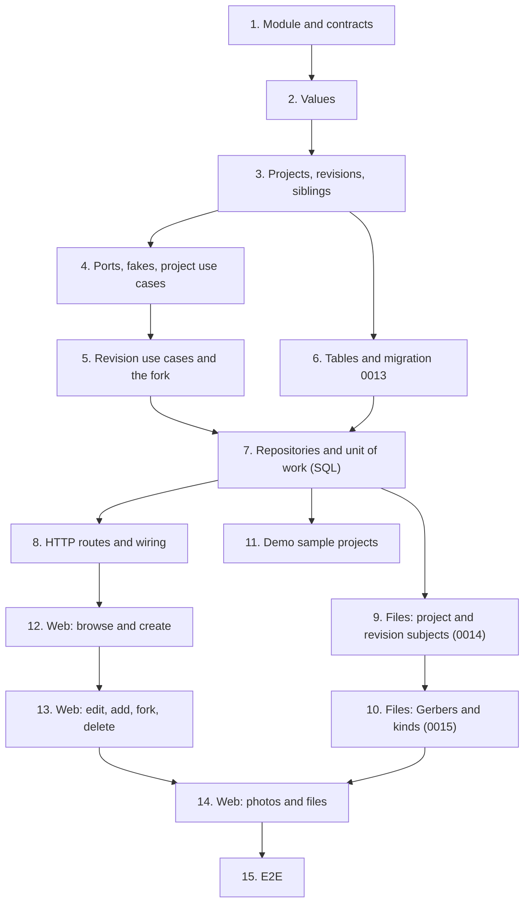

# Implementation Plan

## Overview

Fifteen tasks that build the `projects-and-revisions` slice described in [design.md](design.md)
and required by [requirements.md](requirements.md): the new `projects` module (its import
contracts, its values, projects, revisions and a project's revisions in the domain, the project
and revision use cases with the fork and its extension point, the two tables, the repositories
and the unit of work, the HTTP routes); `files` learning project and revision subjects, ZIP
archives and two new kinds; sample projects in the demo bench; the web pages for browsing,
creating and editing projects and their revisions, photos and files; and the end-to-end journey.

This spec adds one module (`projects`), two tables (`projects`, `revisions`) and three
migrations: `0013_projects.py`, `0014_attachment_subjects.py` and `0015_revision_files.py`,
after 07-quick-add-and-import added none, so the head moves from `0012_units.py` to `0015`. It
adds no ADR: `0014` stays free (design decision 17). ADR 0007's list of isolated tables gains
`projects` and `revisions` in task 6, the commit that creates them.

Branch first. Before task 1, run `git switch main && git pull && git switch -c
feat/projects-and-revisions`, and never commit this spec's work on `main`. Task 1's commit also
adds this spec's `requirements.md`, `design.md` and `tasks.md`.

One task, one commit. Every commit has to pass `make check` **on its own**, because `main` is
rebase-merged and each commit lands (AGENTS.md). Each task says when it also needs
`make coverage` (it touches SQL or its wiring), `make e2e` (it touches the web) or `make client`
(it changes routes or schemas; the regenerated client goes in that same commit). Tick the task
in this file in the same commit. Suggested Conventional Commit subjects are in `code` under
each task.

Release footer: this spec is **the first of three** in `v0.5.0` (09-bill-of-materials and
10-build-lifecycle follow), so **no task here carries `Release-As: 0.5.0`**. That footer belongs
on 10's phase-closing documentation task, a commit that changes files, never an empty one (ADR
0012's amendment). See [Notes](#one-pr-per-spec-and-the-release).

## Tasks

- [x] 1. Open the projects module and its import contracts
  - Create `apps/api/src/wiredex/projects/` with `__init__.py` files for the package and for
    `domain`, `application`, `infrastructure` and `api`.
  - `apps/api/pyproject.toml`: add `wiredex.projects` to the layers contract's `containers`, to
    the bootstrap contract's `source_modules` and to the independence contract's `modules`, so
    the new module's layers and its independence are checked from its first commit.
  - `projects/domain/errors.py`: `ProjectsError(ValueError)` and the leaves of the design's
    table (`ProjectNotFoundError`, `RevisionNotFoundError`, `DuplicateProjectNameError`,
    `DuplicateRevisionLabelError`, `LastRevisionError`, `RevisionInUseError`,
    `NoLabelLeftError`, and the value errors).
  - `tests/projects/test_errors.py`: each leaf is a `ProjectsError` and a `ValueError`.
  - This commit also adds `.kiro/specs/08-projects-and-revisions/requirements.md`, `design.md`
    and `tasks.md`, on the `feat/projects-and-revisions` branch.
  - Checks: `make check` (`make architecture` now lists `wiredex.projects` in all three
    contracts).
  - `feat(projects): open the module and its import contracts`
  - _Requirements: 11.1_

- [x] 2. Project and revision values
  - `projects/domain/values.py`: `WorkspaceId`, `ProjectId`, `RevisionId`; `ProjectName` (with
    `fold`), `Description`, `Notes`, `Summary`, `Tag`, `Tags` (`of`, `none`, `include`,
    `texts`), `RevisionLabel` (`first`, `fold`, `successor`), `RevisionStatus` (the four ADR
    0003 states) and the limits; frozen slotted dataclasses validating in `__post_init__`, as
    `inventory/domain/values.py` does.
  - `tests/projects/test_values.py`: each rule at its boundaries (120 and 121 characters, 4,000
    and 4,001, 32 and 33, 16 and 17; blank; `\r\n` and `\r` read as `\n`; inner line breaks
    kept; a tag's fullwidth and upper-case spellings folding to one; a comma and a control
    character refused; a label with a leading `-`, a space or an accented letter refused); 21
    distinct tags refused and 25 texts holding 20 distinct accepted; `successor` on `A` → `B`,
    `Z` → `AA`, `AZ` → `BA`, `z` → `aa`, `v9` → `v10`, `v09` → `v10`, `1.9` → `1.10`, `rev-c` →
    `rev-d`, and sixteen `Z`s → `None`; **property 1** (text values are fixpoints of their own
    rules), **property 2** (tags are a set) and **property 3** (a label's successors never
    repeat) as Hypothesis.
  - Checks: `make check`.
  - `feat(projects): add the project and revision values`
  - _Requirements: 1.2, 1.4, 2.1, 2.2, 2.3, 2.4, 2.5, 4.2, 4.4, 4.6, 4.7, 4.9, 11.6_

- [x] 3. Projects, revisions and a project's revisions
  - `projects/domain/project.py`: `ProjectDetails` and `Project` (`start`, `details`, `revise`
    returning whether anything changed, `touch`).
  - `projects/domain/revision.py`: `RevisionDetails` and `Revision` (`draft`, `fork_of`,
    `details`, `revise`, `ensure_deletable`).
  - `projects/domain/project_revisions.py`: `ProjectRevisions` (`latest`, `suggested_label`,
    `label_for`, `ensure_removable`, `ensure_all_deletable`, `includes`).
  - `projects/domain/filter.py`: `ProjectFilter` with `matches`.
  - `tests/projects/test_project.py`: `start` stamps both dates; `revise` and its no-op;
    `touch`.
  - `tests/projects/test_revision.py`: `draft` takes its project's workspace and id; `fork_of`
    from each of the four statuses gives a draft of the source's project recording the source;
    `revise` in any status; `ensure_deletable` refusing `reserved`, `built` and `dismantled`.
  - `tests/projects/test_project_revisions.py`: `latest` by `created_at`, then id on a tie;
    `label_for` refusing a label a sibling holds in another case, keeping a revision's own
    label on a relabel, answering the suggestion, and refusing when none is left;
    `ensure_removable` for the only revision and for a built one; `ensure_all_deletable`;
    **property 4** (a suggested label is always free) as Hypothesis.
  - `tests/projects/test_filter.py`: the text folded, every tag required, a blank text as none.
  - Checks: `make check`.
  - `feat(projects): model projects, revisions and a project's revisions`
  - _Requirements: 1.5, 1.8, 3.3, 3.4, 4.1, 4.3, 4.4, 4.5, 4.6, 4.8, 4.10, 5.2, 5.3, 6.1, 6.5_

- [x] 4. Ports, fakes and the project use cases
  - `projects/application/ports.py`: `Projects`, `Revisions`, `RevisionContent`,
    `ProjectsUnitOfWork` (read-only properties, `revision_contents` among them, and `clear`),
    `NewRevision`, `ProjectView`, `ProjectSummary` and `TagCount`.
  - `tests/support/projects.py`: `InMemoryProjects` and `InMemoryRevisions` (removing a project
    takes its revisions, and removing a revision clears every `forked_from` naming it, as the
    cascade and `SET NULL` do), `InMemoryProjectsUnitOfWork` (counts commits and reads, records
    the workspace it was opened for, and holds a settable `revision_contents`), a
    `RecordingContent` and a `FailingContent`, and a `World` building the use cases.
  - `projects/application/projects.py`: `CreateProject`, `UpdateProject`, `DeleteProject`,
    `GetProject`, `ListProjects`, `ListProjectTags`, `load_project`, `lock_project`, and `type
    UnitOfWorkFactory = Callable[[WorkspaceId], ProjectsUnitOfWork]`.
  - `tests/projects/test_project_use_cases.py`: create writes the project and revision `A` in
    one commit; a name another project holds in another case is refused on create and on
    rename, and a project's own name on a rename is fine; an edit replaces the details and a
    no-op commits nothing; delete takes the revisions, and is refused with a built revision
    placed in the fakes; get answers the latest and `next_label`; the tag counts; every 404; a
    page and a list each cost two reads whatever their size; **property 7** (the list shows
    every match once, freshest first) as Hypothesis.
  - Checks: `make check`.
  - `feat(projects): create, edit, list and delete projects`
  - _Requirements: 1.1, 1.3, 1.5, 1.6, 1.7, 1.8, 1.9, 2.6, 3.1, 3.2, 3.4, 3.5, 11.3, 11.6_

- [x] 5. Revision use cases and the fork
  - `projects/application/revisions.py`: `AddRevision`, `ForkRevision`, `UpdateRevision`,
    `DeleteRevision`, `GetRevision` and `load_revision`. Adding, forking, relabelling and
    deleting lock the project first and read the siblings after; the fork and the delete look
    for their revision again among them; the fork runs every `work.revision_contents` entry, in
    order, before its one commit; a delete touches the project.
  - `tests/projects/test_revision_use_cases.py`: add with a label and without one (the
    suggestion); relabel to a taken label in another case refused, and to its own label
    accepted; deleting the only revision and a built one refused; a fork records its source
    and takes the suggestion; a fork of a built revision is a draft; deleting a fork's source
    clears its `forked_from`; a `FailingContent` means no commit; every 404; **property 5** (a
    project keeps its revisions' invariants) and **property 6** (a fork adds one draft and
    copies every content once, in order) as Hypothesis.
  - Checks: `make check`.
  - `feat(projects): add, fork, edit and delete revisions`
  - _Requirements: 3.2, 4.1, 4.3, 4.4, 4.6, 4.8, 4.10, 5.1, 5.2, 5.3, 5.4, 5.6, 6.1, 6.2, 6.3,
    6.5, 6.6, 6.7, 11.6_

- [x] 6. The tables and migration 0013
  - `projects/infrastructure/types.py`: the value types, and `TagsType` over `varchar(32)[]`.
  - `projects/infrastructure/orm.py`: `projects` and `revisions` as the design's Data Models
    give them (the composite key, the cascade, `forked_from` with `SET NULL` and its index, the
    folded unique indexes on name and label, the GIN index and the CHECK on tags, the status
    CHECK over the four states), and `Project` and `Revision` mapped imperatively.
  - `bootstrap/orm.py`: import `projects.infrastructure.orm`, so Alembic sees the tables.
  - `make migration m="projects"`, then fix `0013_projects.py` by hand: a real `downgrade`
    (`revisions` before `projects`), `op.f()` on constraints, the two expression indexes written
    out (`lower(name)`, `lower(label)`), and `isolate_by_workspace(op.execute, …)` for both
    tables.
  - `docs/adr/0007-workspace-isolation.md`: `projects` and `revisions` (projects, `v0.5`) join
    the list of isolated tables, in this same commit.
  - `tests/integration/test_migrations.py` covers the round trip and `alembic check`; confirm
    both pass.
  - Checks: `make check`, then `make coverage`: this task is SQL. `wiredex db check` finds no
    drift with the head at `0013`.
  - `feat(projects): add the projects and revisions tables with workspace isolation`
  - _Requirements: 4.9, 8.1, 8.4, 11.2_

- [x] 7. The repositories and the unit of work
  - `projects/infrastructure/repositories.py`: `SqlProjects` (`locked` with
    `with_for_update()`; `named` through `lower(name)`; `matching` with the wildcard-escaped
    `ILIKE` and `tags @> :wanted`; `tag_counts` over `unnest(tags)`) and `SqlRevisions` (`add`
    flushing; `of_project` and `of_projects` ordered by `created_at, id`), every statement
    filtering `workspace_id`.
  - `projects/infrastructure/unit_of_work.py`: `SqlProjectsUnitOfWork(SqlUnitOfWork)`, binding
    both repositories and `revision_contents = ()` in `__aenter__`, and `clear()`.
  - `tests/integration/test_projects_repositories.py`: the folded name and label indexes
    enforced by Postgres; tags stored and read back equal; `tags @>` and the counts; `%` and
    `_` in a name filter matching themselves and agreeing with `ProjectFilter.matches`; the
    list's order; the cascade; `SET NULL` on a deleted source; a fifth status refused by the
    CHECK; the lock — two concurrent deletes of a project's last two revisions leave one, and
    two concurrent forks take `B` and `C`; a `FailingContent` registered on a test subclass of
    the unit of work leaves no revision row.
  - `tests/integration/test_projects_isolation.py`: as `wiredex_app`, workspace B's projects,
    revisions and tags are invisible and unwritable from A; a revision filed under another
    workspace's project is refused by the composite key.
  - Checks: `make check`, then `make coverage`: this task is SQL.
  - `feat(projects): store projects and revisions in PostgreSQL`
  - _Requirements: 1.3, 1.7, 2.5, 2.6, 3.2, 3.3, 3.4, 4.3, 4.9, 5.4, 5.5, 6.4, 8.1, 8.2, 8.3,
    8.4, 11.3_

- [x] 8. HTTP routes and wiring
  - `projects/api/schemas.py`: `CreateProjectRequest`, `UpdateProjectRequest`,
    `NewRevisionRequest`, `UpdateRevisionRequest`, `ProjectResponse`, `ProjectSummaryResponse`,
    `RevisionResponse`, `RevisionSummaryResponse`, `ProjectTagResponse`, and
    `RevisionStatusName` as a `Literal`.
  - `projects/api/router.py`: `ProjectsUseCases`, `create_router`, `_add_project_routes` and
    `_add_revision_routes` (`/projects/tags` and `/projects/revisions/…` declared before
    `/projects/{project_id}`), and `_refusals()` with the design's error table.
  - `bootstrap/projects.py`: `projects_use_cases(session_factory)`; `bootstrap/app.py`: the
    router and `_projects_workspace(auth)`; `tests/support/projects.py`:
    `World.projects_use_cases()`.
  - `tests/projects/test_projects_api.py`: every route and status; `/projects/tags` never read as
    a project id; blank texts read as none; tags normalized on the way in; 21 tags refused;
    `RevisionStatusName` kept in step with `RevisionStatus`.
    `tests/projects/test_projects_auth.py`: 401 without a session on every route, and 403
    without CSRF on every write.
  - Run `make client`, add aliases for the new schemas to `packages/api-client/src/index.ts`
    (`ProjectSummary`, `ProjectDetails`, `ProjectTag`, `NewProject`, `ProjectChange`,
    `RevisionDetails`, `RevisionSummary`, `NewRevision`, `RevisionChange`, `RevisionStatus`),
    and commit the regenerated client in this task.
  - Checks: `make check`, `make coverage` (the wiring runs in the integration suite),
    `make client`.
  - `feat(projects): expose projects and revisions over HTTP`
  - _Requirements: 1.3, 1.4, 1.6, 1.9, 2.2, 2.4, 2.6, 3.1, 3.5, 4.2, 4.6, 5.2, 5.3, 5.6, 8.2,
    8.5, 8.6, 11.4, 11.5_

- [x] 9. Files: photos on projects, files on revisions
  - `files/domain/values.py`: `SubjectKind.PROJECT` and `SubjectKind.REVISION`, and
    `SubjectKind.accepts(media_type)` (a project takes images only).
  - `files/application/attachments.py`: `Attach` refuses a type the subject doesn't accept with
    `UnsupportedFileTypeError` (415) once the bytes are sniffed and before anything is stored;
    its two part-only sentences name the subject's kind.
  - `bootstrap/files.py`: `AttachmentSubjects(get_part, get_project, get_revision)` in place of
    `CatalogSubjects`, in `files_use_cases` and in `prune_orphans_use_case`, each kind asked of
    its own module.
  - `make migration m="attachment subjects"` gives an empty file, since autogenerate doesn't
    compare CHECKs; write `0014_attachment_subjects.py` by hand: drop
    `ck_attachments_subject_kind` and create it again over `part`, `project` and `revision`;
    `downgrade` deletes the attachments of projects and revisions, then narrows it back.
  - `tests/files/test_values.py`: `project:<uuid>` and `revision:<uuid>` parse; `accepts` for
    every kind and type. `tests/files/test_attachment_use_cases.py`: a PNG attached to a
    project; a PDF refused on a project with the store and the rows untouched; a PDF attached
    to a revision.
  - `tests/bootstrap/test_attachment_subjects.py`: over the in-memory catalog and projects,
    each kind is asked of its own module, and a missing part, project or revision is absent.
  - `tests/integration/test_files_cli.py` (extended): the prune removes a deleted project's
    photo and a deleted revision's file. `tests/integration/test_files_repositories.py`
    (extended): a `revision` subject row accepted by the widened CHECK.
  - Checks: `make check`, `make coverage`. `make client` leaves the package unchanged: a
    subject is a string on the wire.
  - `feat(files): attach photos to projects and files to revisions`
  - _Requirements: 7.1, 7.6, 7.7, 7.8, 11.1, 11.2_

- [x] 10. Files: Gerber archives and design-file kinds
  - `files/domain/values.py`: `MediaType.ZIP`, sniffed from `PK\x03\x04`, and
    `MediaType.previewable`; `AttachmentKind.SCHEMATIC` and `AttachmentKind.GERBERS`;
    `AttachmentKind.suggested_for(media_type, subject)` as the design's table gives it.
  - `files/api/router.py`: a type that isn't previewable is always sent as `attachment`;
    `files/api/schemas.py`: `MediaTypeName` gains `application/zip`, `AttachmentKindName`
    gains `schematic` and `gerbers`.
  - Write `0015_revision_files.py` by hand: widen `ck_files_media_type` and
    `ck_attachments_attachment_kind`; `downgrade` re-kinds the two new kinds as `other`,
    deletes the attachments of ZIP files and then the ZIP file rows, and narrows both back.
  - Web, so the typed i18n keys and the drop zone stay whole: `files.kinds.schematic` and
    `files.kinds.gerbers` in both locale files; the two kinds in the `KINDS` lists of
    `DropZone.tsx` and `AttachmentsSection.tsx`; `application/zip` in the drop zone's `accept`;
    `files.upload.refused.unsupported` naming ZIP archives in both locales; a ZIP's row
    offering *Download* only.
  - `tests/files/test_media_type.py`: the ZIP signature, and **property 8** (content alone
    decides a file's type, ZIP included) as 03's Property 1 with its generator extended.
    `tests/files/test_values.py`: `previewable`; `suggested_for` per subject.
    `tests/files/test_files_api.py`: a ZIP's content comes as an attachment with and without
    `?download=1`, with `nosniff`; the two literals kept in step with their enums.
    `tests/integration/test_files_repositories.py`: a ZIP file row and the two kinds accepted.
    `AttachmentsSection.test.tsx` and `DropZone.test.tsx`: the new kinds offered; a ZIP row
    without *Open*.
  - Run `make client` and commit the regenerated client in this task.
  - Checks: `make check`, `make coverage`, `make client`, `make e2e`.
  - `feat(files): accept Gerber archives and schematics`
  - _Requirements: 7.2, 7.3, 7.4, 7.5, 11.2, 11.4, 11.6_

- [x] 11. Sample projects in the demo bench
  - `projects/application/demo.py`: `RestoreSampleProjects` and `SAMPLE_PROJECTS` as the design's
    table gives them, written through `CreateProject`, `UpdateRevision` and `ForkRevision`
    after the bench's projects are cleared.
  - `bootstrap/projects_demo.py`: `restore_sample_projects_use_case(settings)`, its own engine,
    as `restore_sample_inventory_use_case` has.
  - `bootstrap/cli.py`: `_restore_benches(settings, benches)` opens the catalog, inventory and
    projects restores once and runs them per bench in that order; `_reset` calls it after the
    files clear, and `_invite` calls it for the new bench (design decision 16).
  - `tests/projects/test_demo.py` over the fakes: the two projects with their tags and
    revisions, `B` forked from `A`; a second restore gives the same projects; a project a guest
    added is gone.
  - `tests/integration/test_demo_cli.py`: the `database` fixture also truncates `projects` and
    `revisions`; the reset restores the sample projects in demo benches only; a second reset
    puts back a deleted and a renamed sample; a new guest's bench holds the sample catalog,
    stock, units and projects straight after `wiredex demo invite`.
  - Checks: `make check`, `make coverage`.
  - `feat(projects): seed the demo workspace with sample projects`
  - _Requirements: 9.1, 9.2, 9.3, 9.4_

- [x] 12. Web: browse and create projects
  - `features/projects/projects.ts`: `projectKeys`, `useProjects`, `useProject`,
    `useProjectTags`, `useCreateProject` and `ProjectRefusal`.
  - `features/projects/TagInput.tsx`, `ProjectForm.tsx` (with `NewProjectPage`) and
    `ProjectsPage.tsx`.
  - `features/projects/ProjectPage.tsx` and `RevisionPanel.tsx`, read-only for now: the header,
    the *Revisions* navigation with the open one marked, the latest revision when the address
    names none, and the open revision's label, summary, status, notes and source;
    `features/projects/status.ts`.
  - `app/router.tsx`: `/projects` (its search validated to `q` and a list of `tag`),
    `/projects/new`, `/projects/$projectId` and `/projects/$projectId/revisions/$revisionId`;
    `app/AppLayout.tsx`: *Projects* after *Units*.
  - `nav.projects` and the `projects.*` keys these pages use, in both `en.json` and
    `pt-BR.json`; `dashboard.empty` reworded in both, so it no longer says projects are coming.
  - `src/test/server.ts`: `aProject`, `aRevision`, `aProjectSummary`, `respondWithProjects`,
    `respondWithProject`, `respondWithProjectTags` and `acceptProjectCreates`.
  - `ProjectsPage.test.tsx` (the rows; the search and the tags written to the address; a tag
    toggle's `aria-pressed`; the empty state clearing the filters), `TagInput.test.tsx` (Enter,
    comma, Backspace, each chip's remove button, suggestions by the arrow keys, what a chip
    shows once normalized), `ProjectForm.test.tsx` (the rules; a 409 on the name; saving opens
    the new project on `A`), `ProjectPage.test.tsx` (the latest by default, another revision by
    its address, `aria-current`, a revision the project doesn't have), and `router.test.tsx`
    (the navigation entry), every control found by role and accessible name.
  - Checks: `make check`, `make e2e`.
  - `feat(web): browse and create projects`
  - _Requirements: 2.1, 10.1, 10.2, 10.3, 10.4, 10.5, 10.7, 10.10, 10.11, 10.12_

- [x] 13. Web: edit projects and add, fork, edit and delete revisions
  - `features/projects/projects.ts`: `useUpdateProject`, `useDeleteProject`, `useAddRevision`,
    `useForkRevision`, `useUpdateRevision` and `useDeleteRevision`, each refreshing
    `projectKeys.all`.
  - `ProjectPage.tsx`: *Edit* (the `ProjectForm` in place), *Delete* (asks first; a 409 shows
    its sentence; then `/projects`) and *New revision*.
  - `RevisionPanel.tsx`: *Edit*, *Fork* and *Delete*, deleting unavailable for the only
    revision with the reason as its description.
  - `RevisionDialogs.tsx`: `NewRevisionDialog`, `ForkRevisionDialog` (the label prefilled with
    `next_label`; Enter submits; a 409 on the label) and `EditRevisionDialog`, on 05's
    `StockDialog` shell.
  - The `projects.*` keys these add, in both locale files.
  - `src/test/server.ts`: `acceptProjectWrites` for the project and revision writes.
  - `ProjectPage.test.tsx` and `RevisionPanel.test.tsx` (extended), `RevisionDialogs.test.tsx`:
    an edit refreshing the page; deleting a project and landing on the list; a fork prefilled,
    opening the fork; a new revision; an edit keeping its revision open; deleting a revision and
    landing on the latest; the only revision's delete unavailable, with its reason; a 409 on the
    label.
  - Checks: `make check`, `make e2e`.
  - `feat(web): edit projects and add, fork, edit and delete revisions`
  - _Requirements: 1.5, 5.1, 5.2, 10.5, 10.6, 10.10, 10.11, 10.12_

- [x] 14. Web: photos on projects and files on revisions
  - `features/files/attachments.ts`: `AttachmentOwner` and `subjectOf`; `subjectOfPart` kept
    over it.
  - `features/files/attachmentControls.tsx`: the rename form and the ask-first remove button,
    moved out of `AttachmentsSection.tsx`, which keeps its behaviour.
  - `AttachmentsSection.tsx` takes an `owner` (*Attachments* on a part, *Files* on a revision);
    `DropZone.tsx` takes the `owner` (images only for a project, the suggested kind per owner,
    the photo refusal); `features/files/PhotoGallery.tsx`.
  - `catalog/PartPage.tsx`: `owner={{ kind: "part", id: part.id }}`; `ProjectPage.tsx` mounts
    `PhotoGallery`; `RevisionPanel.tsx` mounts the revision's `AttachmentsSection`.
  - `files.revisionTitle`, `files.photos.*` and `files.upload.refused.notAPhoto` in both locale
    files, and `files.upload.refused.duplicate` reworded in both to fit any owner.
  - `PhotoGallery.test.tsx` (the images with their titles as text alternatives, opening in a new
    tab, a photo added by the picker, renamed, and removed after asking, a PDF refused in the
    photo wording), `DropZone.test.tsx` (a revision's PDF suggested as schematic, its ZIP as
    Gerbers and its picture as image; a part's PDF still a datasheet),
    `AttachmentsSection.test.tsx` (the *Files* heading on a revision), and
    `PartPage.test.tsx`, unchanged in behaviour. The web suite stays at or above its 85 % floor.
  - Checks: `make check`, `make e2e`.
  - `feat(web): add photos to projects and files to revisions`
  - _Requirements: 7.1, 7.2, 7.7, 10.5, 10.8, 10.9, 10.10, 10.11, 10.12, 11.5_

- [~] 15. End-to-end journey
  - `e2e/tests/projects.spec.ts`, reusing the logged-in session, every name stamped with
    `Date.now()`:
    - From the navigation, *Projects*, then *New project*: `Weather station <stamp>`, a
      description, and the tags typed as `ESP32` then Enter and `i2c,`. Saving opens the project
      on revision `A`, a draft, with the tags `esp32` and `i2c`.
    - Edit revision `A`: the summary *breadboard*; the panel reads `Revision A – breadboard`.
    - On `A`'s *Files*, add the smallest ZIP the API sniffs, built in the test: it is suggested
      and listed as *Gerbers*, and its row offers *Download* and no *Open*.
    - *Fork* `A`: the label is prefilled `B`; the summary *perfboard*. The fork opens, says
      *Forked from A*, and its *Files* are empty; the *Revisions* navigation lists `A` and `B`,
      `B` marked.
    - Go to the project's own address again: `B` opens, the latest.
    - Add a tiny PNG built in the test to the project's *Photos*: the gallery shows it, its
      title as its text alternative.
    - On the projects list, the `i2c` chip keeps the project, a search for the stamp keeps it,
      and a search for `Nowhere <stamp>` shows the empty state.
    - Open `A` from the navigation and delete it: `B` stays, and its *Delete revision* is
      unavailable and says a project keeps one revision.
    - Delete the project: the list no longer shows it.
  - Checks: `make e2e`.
  - `test(e2e): cover projects, revisions, forking, tags and files`
  - _Requirements: all, end to end_

## Task Dependency Graph



The same graph as waves: every task in a wave can be worked once the waves above it have
landed.

```json
{
  "waves": [
    { "wave": 1, "tasks": [{ "id": "1", "name": "Module and contracts", "dependsOn": [] }] },
    { "wave": 2, "tasks": [{ "id": "2", "name": "Values", "dependsOn": ["1"] }] },
    {
      "wave": 3,
      "tasks": [{ "id": "3", "name": "Projects, revisions, siblings", "dependsOn": ["2"] }]
    },
    {
      "wave": 4,
      "tasks": [
        { "id": "4", "name": "Ports, fakes, project use cases", "dependsOn": ["3"] },
        { "id": "6", "name": "Tables and migration 0013", "dependsOn": ["3"] }
      ]
    },
    {
      "wave": 5,
      "tasks": [{ "id": "5", "name": "Revision use cases and the fork", "dependsOn": ["4"] }]
    },
    {
      "wave": 6,
      "tasks": [
        { "id": "7", "name": "Repositories and unit of work (SQL)", "dependsOn": ["5", "6"] }
      ]
    },
    {
      "wave": 7,
      "tasks": [
        { "id": "8", "name": "HTTP routes and wiring", "dependsOn": ["7"] },
        { "id": "9", "name": "Files: project and revision subjects (0014)", "dependsOn": ["7"] },
        { "id": "11", "name": "Demo sample projects", "dependsOn": ["7"] }
      ]
    },
    {
      "wave": 8,
      "tasks": [{ "id": "10", "name": "Files: Gerbers and kinds (0015)", "dependsOn": ["9"] }]
    },
    { "wave": 9, "tasks": [{ "id": "12", "name": "Web: browse and create", "dependsOn": ["8"] }] },
    {
      "wave": 10,
      "tasks": [{ "id": "13", "name": "Web: edit, add, fork, delete", "dependsOn": ["12"] }]
    },
    {
      "wave": 11,
      "tasks": [{ "id": "14", "name": "Web: photos and files", "dependsOn": ["10", "13"] }]
    },
    { "wave": 12, "tasks": [{ "id": "15", "name": "E2E", "dependsOn": ["14"] }] }
  ]
}
```

Reading it:

- **Root.** Only 1 depends on nothing. The whole spec sits downstream of 07-quick-add-and-import
  having merged (and, for the PR, of the `0.4.0` release: see the Notes), which is a
  phase-level dependency, not a task edge.
- **Critical path.** 1 → 2 → 3 → 4 → 5 → 7 → 8 → 12 → 13 → 14 → 15. The tables (6) run beside
  the use cases (4, 5) and join them at 7; the two files tasks (9, 10) run beside the routes and
  the first web task and join at 14.
- **Parallel.** 4 and 6 once the domain exists; then 8, 9 and 11 once the repositories exist.
  10 and 12 don't depend on each other, but both write the locale files (and 10 the generated
  client, which 12 reads), so they land one after the other; 12, 13 and 14 all write the
  locale files and the project page, so they stay in line too.
- **Why these edges.** 6 maps the domain classes 3 defines; 7 implements the ports of 4 and
  runs 5's fork against Postgres over 6's tables; 8 wires 7's unit of work and regenerates the
  client 12 uses; 9's `AttachmentSubjects` asks projects' `GetProject` and `GetRevision` over
  7's unit of work, and its migration `0014` must precede 10's `0015`; 11 restores through 5's
  use cases on 7's tables; 14 needs 10's kinds and 13's revision panel; 15 walks everything.
  11 is on no web path: it can land any time after 7.

## Notes

### Before pushing

- `make check` on every commit, not only the last.
- `make coverage` on the commits touching SQL or its wiring (6, 7, 8, 9, 10, 11): API floor
  90 %, web floor 85 %.
- `make e2e` on the web commits (10, 12, 13, 14) and after task 15.
- `make client` in tasks 8 and 10, whose commits carry the regenerated client (8 also the new
  aliases in `packages/api-client/src/index.ts`); after each, `make client` must leave the
  package unchanged, or CI's contract gate fails.
- Migrations `0013_projects.py`, `0014_attachment_subjects.py` and `0015_revision_files.py`, in
  that order; `wiredex db check` stays clean after each. The two `files` migrations are written
  by hand: autogenerate doesn't compare CHECK constraints. Their names (`ck_attachments_subject_kind`,
  `ck_files_media_type`, `ck_attachments_attachment_kind`) are the ones the naming convention
  gave `0007`; confirm them with `\d attachments` and `\d files` in `make psql` before writing.

### One PR per spec, and the release

The owner chose one PR per spec with auto-merge (2026-09-27). Open this spec's PR from
`feat/projects-and-revisions`, based on `main` after 07-quick-add-and-import merged, and turn on
auto-merge (`gh pr merge N --rebase --auto`) only once the owner has merged the `0.4.0` release
PR that 07's footer opens: release-please folds every commit on `main` into the open release
PR, so merging earlier would ship half of Projects inside the Inventory release. This spec
carries no footer; 10-build-lifecycle's phase-closing task carries `Release-As: 0.5.0`, and the
release PR it produces waits for the owner. Merging a release PR deploys to production: only
the owner does it (AGENTS.md, Safety), never an agent.
