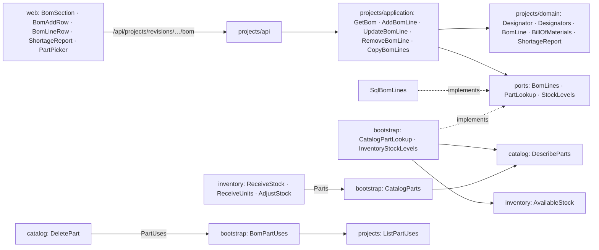
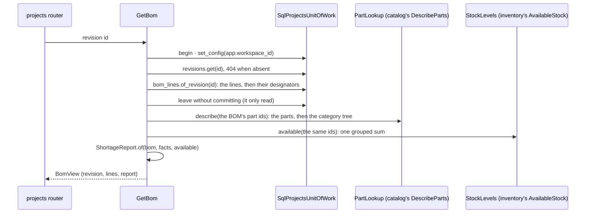
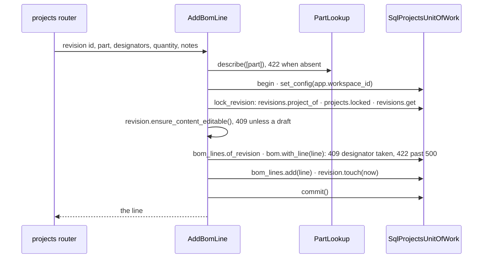

# Design Document: bill of materials

## Overview

The second of three specs in `v0.5.0` Projects & BOM. It delivers the phase's roadmap line
*BOM editor with designators and a shortage report* and the README's Bill of materials row,
*designators (`R1–R4`), quantities, notes and a live shortage report against available stock*.
It gives each revision of [08-projects-and-revisions](../08-projects-and-revisions/design.md)
the bill of materials [ADR 0003](../../../docs/adr/0003-project-revisions.md) puts there, builds
the `Designator` value object and the `BillOfMaterials` first-class collection that
[docs/architecture.md](../../../docs/architecture.md) §5 names ("designators unique"), and fills
08's fork extension point with the BOM's copy. It also builds the owner's answer to §10
question 3: consumables are marked by a *not stocked* flag on their category, inherited down the
tree as [05-inventory-stock](../05-inventory-stock/design.md)'s *tracked individually* is, which
reaches catalog (the flag), inventory (receipts) and
[07-quick-add-and-import](../07-quick-add-and-import/design.md) (intake).
[10-build-lifecycle](../10-build-lifecycle/design.md) comes next and reserves what a BOM lists;
until then nothing reserves stock, so a part's available stock is what is on hand.

Most of the spec is a collection with rules and a table editor. Four things carry the design.
How projects learns about parts and stock without importing catalog or inventory (decisions 1,
13 and 14). What a designator is, and how a list of them is read and written back so the text
round-trips and 11's netlist can point at one (decisions 5, 6 and 8). How the shortage report
stays right without storing anything (decision 10). And where the not-stocked flag bites, alone
and beside tracking (decisions 2 to 4).

**Owner decisions that bind this spec**, and what each does here:

- **A BOM line names exactly one part definition; no substitutes before 1.0** (2026-09-27,
  docs/architecture.md §10 question 2). A line holds one `part_id`; nothing matches parts by
  their attributes.
- **Consumables use a "not stocked" category flag, inherited along the tree like
  `tracked_individually`, and this spec builds it** (2026-09-27, §10 question 3). Decisions 2
  to 4.
- **Every microcontroller board is a unit**, by the category's tracking flag (2026-09-26, 05 and
  06). Why the two flags must combine (decision 3): a board category can be tracked and still
  stop being stocked.
- **One PR per spec with auto-merge; the release PR waits for the phase's last spec, and only
  the owner merges it** (2026-09-27). This spec is the phase's second: it carries no
  `Release-As` footer, and its commits wait on `main` for 10's release.
- **A change history waits for `v0.8.0`** (2026-09-26, 05). A BOM edit moves its revision's
  last change and logs nothing else.

**Decisions this spec makes (2026-09-27), for the owner to check.** Where the repository
doesn't settle something, it is decided here, with the reason:

1. **The BOM is two tables in `projects`, and projects still imports no other module.**
   `bom_lines` and `bom_designators` live with the revisions they belong to. Projects asks two
   questions of other modules through ports of its own: `PartLookup` (what the catalog holds
   about some parts: name, manufacturer, part number, package and resolved flags) and
   `StockLevels` (how many of some parts are available). The composition root answers them over
   a new catalog use case, `DescribeParts`, and a new inventory one, `AvailableStock`. Both are
   reads in transactions of their own, not 07's shared-session pattern: a BOM write writes only
   projects rows, and the report is recomputed on every read, so a read that sees the catalog a
   moment apart from the BOM can't leave anything wrong behind. The one race this leaves is
   decision 13's.
2. **`categories.not_stocked` is a nullable tri-state**, as `tracked_individually` is: null
   inherits, a set value overrides, the nearest set value from the category up to the root wins,
   and nothing set anywhere means stocked. One `resolve_flags_of(chain)` resolves both flags into
   a `CategoryFlags` value, and every place that resolved tracking now answers both.
3. **The two flags may combine, and they resolve independently.** *Not stocked* governs stock
   not yet held: no receipt, never reserved (10), never short. *Tracked individually* governs
   stock already held: units stay units. A category set to both, a board type the owner stopped
   keeping, receives nothing and keeps its existing units as units. The table under Components
   lists every operation for each combination.
4. **Inventory refuses new stock for a consumable, and nothing else.** A `RECEIVE` of a part
   whose category resolves not stocked, as a lot or as units, is a 422 `NotStockedError`, and so
   is an `ADJUST` at a location where the part has no lot, since that would create stock from
   nothing. A lot or units held before the flag was set keep working: recount, move, retire,
   un-retire and delete as before. Flipping the flag converts nothing, either way. 07's
   quick-add and import get a `not_stocked` problem code for stock given to a consumable, and
   `PartReview`, `KnownPart`, `DefinesPart` and `SameAsRow` carry the flag so the planner knows.
5. **A designator is 1–8 ASCII letters, then a whole number from 1 to 9999**, after NFKC and
   trimming, stored with its letters upper-cased and its number without leading zeros: `r01`,
   `R1` and `Ｒ１` are one designator, `R1`. No dot, because 11's pin references are `U1.21` and
   must split at it unambiguously; no suffix such as `U1A`, because a multi-unit part is one
   designator whose pins the netlist names. ASCII keeps the sorting and the folding unambiguous,
   as it does for 08's labels.
6. **A designator list reads the way a schematic writes it.** Commas or whitespace separate
   items; an item is a designator or a range of two joined by `-`, `–` or `—`, spaces around the
   dash allowed, and the second end may be a bare number that takes the first's letters
   (`R1-4`). A range runs upwards within one prefix (`R4–R1` and `R1–C4` are refused), and a
   list naming a designator twice, directly or through a range, is refused naming it. The
   canonical text orders the designators by letters and then number, writes each run of three
   or more consecutive numbers as a range with an en dash (`R1–R4`), and separates everything
   else with a comma and a space (`R1, R2, R7`); reading it back gives the same designators
   (Property 3).
7. **With designators the quantity is their count; without, it is typed.** A line with
   designators takes their number as its quantity, and a quantity sent that disagrees is a 422
   on the quantity; a line without designators needs a whole number from 1 to 10,000. Wire,
   heat-shrink and solder are one line of quantity 1 with the amount in its notes (*about 2 m*):
   a consumable is never counted, so a length would be precision nothing reads.
8. **Designators are unique per revision, and they are rows.** `bom_designators` holds one row
   per designator, keyed `(workspace_id, revision_id, designator)`, so the database refuses two
   lines of a revision sharing one and 11's pin references can point a foreign key at a
   designator. A line's designators are written by difference: an edit from `R1–R3` to `R2–R4`
   deletes `R1`, inserts `R4` and keeps the rows of `R2` and `R3`, so whatever 11 hangs off them
   survives an edit that didn't remove them.
9. **The same part may sit on several lines, and lines keep the order they were added in**
   (`created_at`, then the time-ordered id). A BOM groups by function, the I²C pull-ups and the
   decoupling capacitors, and a 4k7 can serve both; the report sums per part, so the split costs
   nothing. An edit keeps its line's place.
10. **The shortage report is per revision, per part, computed on every read and never stored.**
    A part's need is the sum of its lines' quantities; its available stock is the sum of
    `stock_balances.available` over its lots, which for a unit-tracked part already equals its
    in-stock units less the reserved ones, by 06's invariant that a lot's `on_hand` is its
    in-stock units (requirement 6.3). A not-stocked part is never short and has no available
    stock to show; a part the catalog no longer holds is an `unknown_part`. Storing nothing means
    a receipt, a rename or a flag change is right at the next read with nothing to invalidate
    (requirements 6.7 and 8.3), for the price of two other modules' reads per BOM
    (requirement 12.3).
11. **Only a draft's BOM can change.** A line added to, edited on or removed from a revision in
    any other status is a 409 `RevisionContentLockedError` (requirement 5.1), raised by
    `Revision.ensure_content_editable()`, which 11's netlist asks too. Nothing here moves a
    revision out of draft; 10 does, and this is what its statuses lock.
12. **BOM writes take the project's lock, and read the status after it.** A new
    `lock_revision` reads the revision's project id alone (`Revisions.project_of`), locks the
    project's row (08's `Projects.locked`), and only then loads the revision, with
    `populate_existing` as 08's lock reads have. Loading it first
    would put it in the session's identity map, every later read in the transaction would hand
    back that copy, and a status 10 changed while the write waited for the lock would go unseen.
    Two writes to one BOM therefore take turns, and so do a write and 10's transitions, which
    take the same lock. Each write moves the revision's `updated_at`, so the project list's last
    activity follows the BOM (08 decision 11).
13. **A line names its part by a bare `part_id`, with no foreign key**, as every inventory table
    does: modules don't point at each other's tables. Deleting a part that any BOM of the
    workspace names is refused with 409 instead, through a new catalog port, `PartUses`, which
    bootstrap answers from projects' `ListPartUses`; the refusal names up to three of those BOMs
    and how many more there are. A deletion racing a line added for the same part can pass both
    checks; the line then reads as an `unknown_part` until it is pointed at another part or
    removed, which is why the report has that status.
14. **One adapter answers inventory's `Parts` port.** `bootstrap/inventory.py` and
    `bootstrap/inventory_demo.py` each define a `CatalogParts` over `GetPart` and
    `GetCategorySchema`. `bootstrap/parts.py` replaces both with one `CatalogParts` over
    `DescribeParts`, which answers the part and both flags in one catalog transaction of three
    statements, where the pair opened two transactions and read a schema and a pin count that
    nothing used. Projects' `CatalogPartLookup` sits beside it, over the same use case.
15. **The fork's copy is registered first, and needs ids.** `SqlProjectsUnitOfWork` registers
    `CopyBomLines(self.bom_lines, self._ids)` as its first revision content, so it takes an
    `IdGenerator` in its constructor, as 07's `SqlIntakeUnitOfWork` takes a clock and ids. 08
    wrote the registration as `CopyBomLines(self.bom_lines)`; each copied line needs an id of its
    own (requirement 7.2), so the constructor grows by one argument and `ForkRevision` still
    doesn't change. Copied lines take the fork's `created_at` and ids minted in the source's
    order, and CPython's `uuid7` keeps ids rising within a millisecond, so the copies keep the
    source's order.
16. **Limits sized for one owner's boards:** 500 lines per revision, 256 designators per line,
    notes up to 500 characters, and a designator list's text up to 4,000 characters, the
    request's transport bound.
17. **The web editor is a spreadsheet row.** The BOM section of the revision panel is a table
    whose last row adds a line (Designators, Part, Quantity, Notes): Enter adds it from any field,
    the row clears and focus returns to Designators, so a schematic goes in as *designators, Tab,
    part, Enter* over and over. Designators preview their canonical text and count as they are
    typed, and the count is the quantity. A line is edited in its own row (Enter saves, Escape
    restores) and removed after asking in the row. The part picker is a combobox over catalog's
    search, in `features/catalog/` because 11 picks parts too. A refusal lands on the field it
    names, translated from a code the API answers beside its English sentence, as 07's decision
    17 does for intake.
18. **Sample BOMs in the demo.** The sample catalog gains a *Consumables* root category, not
    stocked, holding *Hook-up wire 22 AWG* with no manufacturer and no part number, since an
    invented part number could pass for a real product's. *Weather station* `A` is short its
    BME280; `B`, forked from `A`, copies its lines and adds an AMS1117 and two 2u2 capacitors,
    all short; *Greenhouse controller* `A` is complete and fills `R1–R3`. The sample lines name
    their parts by sample name, which is unique in a bench that was just restored.
19. **Two migrations and no new ADR.** `0016_category_stocking.py` adds `categories.not_stocked`;
    `0017_bill_of_materials.py` adds a `(workspace_id, id)` unique key on `revisions`, which the
    lines' composite key points at, and the two BOM tables. Both only add, so the release before
    this one keeps working against the schema. ADR 0007's list of isolated tables gains the two
    tables in `0017`'s commit; nothing here is costly to reverse beyond what ADR 0003 settles, so
    ADR `0014` stays free.

**Seen while designing, not changed here.** `DeletePart` doesn't look at stock: deleting a part
leaves its lots, movements and units behind, pointing at a part id nothing answers for. It
predates this spec, and `PartUses` is where a stock check can join later, one more question asked
before the delete, in a `fix(catalog)` of its own. Separately, `PartResponse` never carried the
resolved tracking flag, so the part page read it off the category's schema; requirement 1.5 puts
both flags on the part, and the page reads them there.

In scope:

- Catalog: the not-stocked flag, `CategoryFlags` and `resolve_flags_of`; both flags on
  categories and parts over HTTP; `DescribeParts`; refusing to delete a part a BOM names.
- Inventory: refusing new stock for consumables; `AvailableStock`; 07's intake reporting
  `not_stocked`.
- Projects: `Designator`, `Designators`, `BomLine`, `BillOfMaterials` and `ShortageReport`; the
  BOM use cases, `lock_revision`, `ListPartUses` and the fork's `CopyBomLines`; the two tables,
  their repository and their routes.
- Bootstrap: `bootstrap/parts.py`, the stock-level and part-use adapters, and sample BOMs in the
  demo bench.
- Migrations `0016` and `0017`.
- Web: the not-stocked switch, consumables on the part page and in quick-add, the BOM section
  with its shortage report, the keyboard editor and its part picker, and the part page naming
  the BOMs that keep a part.

Out of scope:

- Reserving, consuming and returning stock, and anything a reserved or built revision shows
  beyond a locked BOM (10-build-lifecycle).
- The netlist and its pin references (11-netlist-editor), beyond the designator key it will
  point at.
- Substitutes and attribute-matched lines (after 1.0); BOM cost and supplier links, and a KiCad
  BOM import (*Later*); exporting a BOM.
- Shortages across projects on a dashboard, and a history of BOM edits (`v0.8.0`).
- Refusing to delete a part that holds stock (seen, not fixed).

## Architecture



Dependencies point inward in every module, and no module imports another: `projects` knows two
ports of its own and nothing of catalog or inventory, catalog knows `PartUses` and nothing of
projects, and inventory's `Parts` port only gains a flag. Only the composition root imports two
modules at once, and the independence contract keeps it that way (requirement 12.1). Four
questions cross module lines, all reads, each answered in the answering module's own
transaction:

| Who asks | Port | Answered by | Over |
| --- | --- | --- | --- |
| projects: a line's part, the report | `PartLookup` | `CatalogPartLookup` | catalog's `DescribeParts` |
| projects: the report | `StockLevels` | `InventoryStockLevels` | inventory's `AvailableStock` |
| inventory: receipts and recounts | `Parts` | `CatalogParts` | catalog's `DescribeParts` |
| catalog: deleting a part | `PartUses` | `BomPartUses` | projects' `ListPartUses` |

**A BOM read.** The one read that touches three modules, so its shape is fixed now:



Nine statements whatever the size of the BOM: four in projects (the workspace setting, the
revision, the lines, the designators), three in catalog (the setting, the parts, the tree) and
two in inventory (the setting, the sum). An empty BOM asks neither port.

**A line added**, under the project's lock:



The part is asked about before the unit of work opens, as `ReceiveStock` asks `Parts` before
its own, so no lock is held across another module's read. The project's row is locked before
the status and the lines are read, so the draft check and the designator check see the BOM and
the status as they are once no other change to the project is in flight (decision 12). An edit
is the same with `bom.replacing` and the designators written by difference; a removal skips the
part.

## Components and Interfaces

### Catalog: the not-stocked flag

`catalog/domain/category.py`:

```python
@dataclass(eq=False)
class Category:
    ...
    tracked_individually: bool | None = None
    # Whether the parts here are consumables: never received, reserved or counted short.
    # None inherits the nearest ancestor's answer; a set value overrides (decision 2).
    not_stocked: bool | None = None

    def set_not_stocked(self, not_stocked: bool | None) -> bool:
        """Sets or clears the flag; answers whether it changed, so a no-op commits nothing."""


@dataclass(frozen=True, slots=True)
class CategoryFlags:
    """A category's resolved answers: each the nearest set value from it up to the root,
    False when none sets it. The two resolve independently (decision 3)."""

    tracked_individually: bool = False
    not_stocked: bool = False


def resolve_flags_of(chain: Sequence[Category]) -> CategoryFlags:
    """Both flags along a chain, root first and the category last: `resolve_tracking_of`'s
    rule, applied once per flag."""


def flags_in_tree(category: Category, by_id: Mapping[CategoryId, Category]) -> CategoryFlags:
    """The same answer from a tree already in memory, walking the parent links: what the
    category list and `DescribeParts` use instead of a chain query per category."""
```

`resolve_tracking_of` goes, and so does `catalog/application/categories.py`'s
`resolve_tracking_in`, the tree walk `ListCategories` and `catalog/application/drafts.py`'s `_Tree`
use: `flags_in_tree` is that walk moved into the domain beside `resolve_flags_of`, answering both
flags, because `DescribeParts` walks the tree too and `PartDrafts` needs the not-stocked answer.

`catalog/application/`:

- `categories.py`: `CategoryView` and `CategoryNode` carry `flags: CategoryFlags` in place of
  `tracked_individually_resolved: bool`; `resolve_flags(work, category) -> CategoryFlags`
  replaces `resolve_tracking`; `SetCategoryStocking(unit_of_work)` mirrors `SetCategoryTracking`:
  load (404), `set_not_stocked`, commit only when it changed, answer the view (requirement 1.1).
  `ListCategories` resolves both flags from the tree it already read.
- `attributes.py`: `CategorySchema.flags` in place of `tracked_individually_resolved`.

Setting the flag writes the category row and nothing else. No lot, movement, unit or BOM line is
read or rewritten (requirement 1.6), because nothing stores a resolved answer: inventory asks at
every receipt, and the report at every read. A move under another category re-resolves both
flags in the view it answers, and changes nothing else either.

`catalog/infrastructure/orm.py`: `Column("not_stocked", Boolean, nullable=True)` beside
`tracked_individually`, which `0016` adds.

**Over HTTP**, in `catalog/api/`:

- `UpdateCategoryRequest.not_stocked: bool | None` with `sets_stocking()`, tri-state as
  `tracked_individually` is: `null` clears it back to inheriting, `true` and `false` set it, and
  leaving it out changes nothing. `_update_category` runs `set_category_stocking` after the
  tracking step, and a patch carrying none of the four fields is still a 422.
- `CategoryResponse` gains `not_stocked` (the value set on this category, `null` when it
  inherits) and `not_stocked_resolved`, beside the tracking pair, so the node list, a single
  category and a schema all answer both (requirement 1.4).
- `PartResponse` gains `tracked_individually` and `not_stocked`, the part's resolved flags
  (requirement 1.5), taken from the schema read `_read_values` already makes.
  `PartSummaryResponse`, a row of the list, gains nothing: a page of rows resolves no flags.

### Catalog: describing parts, and the parts BOMs name

`catalog/application/ports.py`: `PartDefinitions.with_ids(part_ids) -> list[PartDefinition]`,
one `IN` query filtered by the workspace. `catalog/application/parts.py`:

```python
@dataclass(frozen=True, slots=True)
class PartDescription:
    """A part as other modules ask about it: the part, and its category's resolved flags."""

    part: PartDefinition
    flags: CategoryFlags


class DescribeParts:
    """Several parts and their resolved flags, in two reads whatever their number (12.3).

    What inventory's `Parts` and projects' `PartLookup` are answered from, through bootstrap.
    A part the workspace doesn't hold is left out, so another workspace's id reads as absent
    and a line naming it is refused as an unknown part (9.3).
    """

    def __init__(self, unit_of_work: UnitOfWorkFactory) -> None: ...

    async def __call__(
        self, workspace_id: WorkspaceId, part_ids: Sequence[PartDefinitionId]
    ) -> dict[PartDefinitionId, PartDescription]:
        """No ids, no transaction. Else `parts.with_ids`, then `categories.all()`, and each
        part's flags by `flags_in_tree`: the tree is tens of rows read once, where a chain
        per part would be a recursive query each."""
```

The deletion guard: two plain values in a new `catalog/domain/usage.py`, so that
`PartInUseError` can carry them without the domain importing the application, and the port in
`ports.py`:

```python
# catalog/domain/usage.py
@dataclass(frozen=True, slots=True)
class PartUse:
    """A BOM that names a part: its project and revision, as the refusal names them."""

    project_id: UUID
    project_name: str
    revision_id: UUID
    revision_label: str


@dataclass(frozen=True, slots=True)
class PartUsage:
    uses: tuple[PartUse, ...]        # the first few, as many as asked for
    total: int                       # every BOM of the workspace that names the part

    @property
    def more(self) -> int: ...       # total less the ones named


# catalog/application/ports.py
class PartUses(Protocol):
    async def of_part(
        self, workspace_id: WorkspaceId, part_id: PartDefinitionId, limit: int
    ) -> PartUsage:
        """The BOMs naming the part: the first `limit`, and how many in all (decision 13)."""
        ...
```

`DeletePart(unit_of_work, part_uses)` loads the part (404), asks `part_uses.of_part(…, limit=3)`,
a read in projects' own transaction as `PruneOrphans` asks `Subjects` inside its own, and raises
`PartInUseError(usage)` (409) when the total isn't zero, before anything is removed; otherwise
it removes and commits as it always has (requirements 8.1, 8.2). Loading first keeps a part that
is already gone a 404, even when a raced line still names it.

### Inventory: consumables and available stock

`PartStockInfo` gains `not_stocked: bool`, which `CatalogParts` fills from `DescribeParts`.
`inventory/domain/errors.py` gains `NotStockedError`, which falls through the router's table to
422 as `ReceiveAsUnitsError` does, so the router doesn't change. The rules, by resolved flags:

| Resolved flags | Receive a lot | Receive units | Recount (`ADJUST`) | Move a lot | Its units | On a BOM |
| --- | --- | --- | --- | --- | --- | --- |
| neither | yes | 422, counted in lots | yes | yes | — | counted |
| tracked | 422, tracked as units | yes | 422, tracked as units | 422, tracked as units | move, retire, un-retire, delete | counted |
| not stocked | 422, not stocked | 422, not stocked | where it has a lot, else 422, not stocked | yes | — | never short |
| both | 422, not stocked | 422, not stocked | 422, tracked as units | 422, tracked as units | move, retire, un-retire, delete | never short |

So the checks read, in `movements.py` and `units.py`:

- `ReceiveStock`: the part exists (404), isn't a consumable (422 `NotStockedError`, requirement
  2.1), isn't tracked (422 `ReceiveAsUnitsError`).
- `ReceiveUnits`: exists (404), isn't a consumable (422), is tracked (422 `ReceiveAsLotError`).
  The consumable check comes first in both, so a part resolving both flags is refused as not
  stocked (requirement 2.4).
- `AdjustStock`: exists and isn't tracked, as before; then, inside its transaction and before
  anything is written, a consumable with no lot at the location is refused (requirement 2.2). A
  lot at zero is still a lot: recounting a drawer the part was already kept in is recounting
  held stock.
- `MoveStock` and the unit use cases don't change: a consumable's lot moves, creating the
  destination's lot as any move does, and its units move, retire, un-retire and are deleted as
  before (requirement 2.3).

`AvailableStock`, in `stock.py` beside `PartTotals`:

```python
class AvailableStock:
    """What is available of several parts, summed over each part's lots, in one query.

    `available` is `on_hand - reserved`, stored and CHECKed per balance (ADR 0002), so the sum
    needs no unit logic: a unit-tracked part's lots hold its in-stock units (06). A part no lot
    holds is absent, read as zero. No ids, no transaction.
    """

    async def __call__(
        self, workspace_id: WorkspaceId, part_ids: Sequence[PartId]
    ) -> dict[PartId, int]: ...
```

It reads `BalanceSheet.available_by_part(part_ids)`, the query of `totals_by_part` summing
`available` instead of `on_hand`.

**Intake**, 07's code, on `main` since `v0.4.0`: catalog's `DraftReview` gains
`not_stocked: bool | None`, resolved from the tree `PartDrafts` already reads; `CatalogPartDesk`
carries it into `PartReview.not_stocked`; `KnownPart.not_stocked: bool`,
`DefinesPart.not_stocked: bool | None` and `SameAsRow.not_stocked: bool | None` let the planner
see it for every kind of row. `ProblemCode.NOT_STOCKED = "not_stocked"` joins the vocabulary,
and `ProblemCodeName` with it. `plan_stock(row, tracked, not_stocked, locations)` answers a
consumable given any stock with one `not_stocked` problem on the row's first stock cell, in the
order `quantity`, `location`, `serial`, `mac`, and plans no stock (requirement 2.5); `QuickAdd`
reports it on `quantity`. A row or a quick-add that defines a consumable and gives no stock
defines it like any other part (requirement 2.6). The digest needs nothing new: a plan with a
problem never imports.

### Projects: domain

New and extended in `apps/api/src/wiredex/projects/domain/`:

| File | Holds |
| --- | --- |
| `values.py` (extended) | `BomLineId`, and `PartId`, a catalog part definition as projects names it |
| `designators.py` (new) | `Designator`, `Designators`, the designator limits |
| `bom.py` (new) | `LineQuantity`, `BomNotes`, `LineContent`, `BomLine`, `PartNeed`, `BillOfMaterials`, `MAX_LINES` |
| `shortage.py` (new) | `PartFacts`, `StockStatus`, `PartShortage`, `ShortageSummary`, `ShortageReport` |
| `revision.py` (extended) | `Revision.ensure_content_editable`, `Revision.touch` |
| `errors.py` (extended) | `BomField`, `ContentRefusal`, `ContentError` and its leaves, `BomLineNotFoundError` |

**Designators.**

```python
MAX_DESIGNATOR_LETTERS = 8
MAX_DESIGNATOR_NUMBER = 9_999
MAX_DESIGNATORS = 256                # on one line


@dataclass(frozen=True, slots=True, order=True)
class Designator:
    """A reference designator: letters, then a number (decision 5). Ordered by its letters
    and then its number, which is the canonical order: C1 < R1 < R2 < R10 < RN1."""

    letters: str                     # 1-8 ASCII capitals
    number: int                      # 1-9999

    @classmethod
    def parse(cls, text: str) -> Designator:
        """NFKC, trimmed, then `[A-Za-z]{1,8}[0-9]+` whose number is from 1 to 9999; the
        letters upper-cased, leading zeros dropped. Anything else is `InvalidDesignatorError`
        naming the text."""

    def __str__(self) -> str: ...        # R1


@dataclass(frozen=True, slots=True)
class Designators:
    """A line's designators: each once, in canonical order, at most 256."""

    values: tuple[Designator, ...]

    @classmethod
    def parse(cls, text: str) -> Designators:
        """A list as typed (decision 6). Blank text is no designators."""

    @classmethod
    def of(cls, designators: Iterable[Designator]) -> Designators:
        """Sorted; a repeat is `RepeatedDesignatorError` naming it, and more than 256 is
        `TooManyDesignatorsError`."""

    @classmethod
    def none(cls) -> Designators: ...

    def text(self) -> str:
        """The canonical text: `C1, R1–R3, R7`."""

    def __len__(self) -> int: ...
    def __iter__(self) -> Iterator[Designator]: ...
    def __contains__(self, designator: object) -> bool: ...
```

`Designators.parse` normalizes the text with NFKC, closes up any whitespace around a dash,
splits on runs of commas and whitespace, and reads each item as a designator or a range. A
range's start is a designator and its end a designator or a bare number taking the start's
letters; the end has to be above the start with the same letters, or the range is an
`InvalidDesignatorRangeError` naming it. A range is counted before it is expanded, so
`R1–R9999` is refused as too many without building 9,999 values. An item that is neither
(`R1-`, `R1-4-6`, `U1A`, `R1;R2`) is refused naming it. The list then goes through `of`, which
names the first designator it meets twice. `text()` walks the sorted values: within one prefix,
a maximal run of three or more consecutive numbers becomes `first–last`, a shorter run stays one
designator at a time, and the items are joined with `, `. The grammar, as the owner types it:

```
list  = [ item { sep item } ]           sep = one or more of "," and whitespace
item  = designator | designator dash end
end   = designator | number             a bare number takes the start's letters
dash  = "-" | "–" | "—", with whitespace around it allowed
```

**Lines and a revision's bill of materials.**

```python
# values.py, beside 08's ids
BomLineId = NewType("BomLineId", UUID)
PartId = NewType("PartId", UUID)         # a catalog part definition, as projects names it

# bom.py
MAX_LINE_QUANTITY = 10_000
MAX_NOTES_LENGTH = 500
MAX_LINES = 500


@dataclass(frozen=True, slots=True)
class LineQuantity:
    """How many of a line's part: a whole number from 1 to 10,000."""

    value: int


@dataclass(frozen=True, slots=True)
class BomNotes:
    """A line's note: trimmed, whitespace collapsed, 1-500 characters. Blank text is no
    note, which the edge reads as None before it gets here (requirement 4.5)."""

    value: str


@dataclass(frozen=True, slots=True)
class LineContent:
    """What a line says, and everything an edit replaces (requirement 4.9)."""

    part_id: PartId
    designators: Designators
    quantity: LineQuantity
    notes: BomNotes | None

    @classmethod
    def of(
        cls,
        part_id: PartId,
        designators: Designators,
        quantity: int | None,
        notes: BomNotes | None,
    ) -> LineContent:
        """Decision 7: with designators the quantity is their count, and a quantity given
        that differs is `QuantityMismatchError`; without, a quantity from 1 to 10,000 is
        required (`InvalidLineQuantityError`)."""


@dataclass(frozen=True, slots=True)
class BomLine:
    """One line of a BOM. Immutable: an edit is a new value with the same id, which is what
    lets the repository write only the difference (decision 8)."""

    id: BomLineId
    workspace_id: WorkspaceId
    revision_id: RevisionId
    content: LineContent
    created_at: datetime

    @classmethod
    def on(
        cls, revision: Revision, line_id: BomLineId, content: LineContent, now: datetime
    ) -> BomLine:
        """A new line of the revision: its workspace and revision come from the revision."""

    def revised(self, content: LineContent) -> BomLine: ...

    def copied_to(self, target: Revision, line_id: BomLineId) -> BomLine:
        """The same content on a fork, created with it (decision 15)."""


@dataclass(frozen=True, slots=True)
class PartNeed:
    part_id: PartId
    quantity: int                    # the sum of the part's lines' quantities
    lines: int


@dataclass(frozen=True, slots=True)
class BillOfMaterials:
    """One revision's lines, oldest first. Its rules: at most 500 lines, and no designator on
    two of them (docs/architecture.md §5, "designators unique")."""

    revision_id: RevisionId
    lines: tuple[BomLine, ...]

    def with_line(self, line: BomLine) -> BillOfMaterials:
        """The line after the others: `TooManyLinesError` for a 501st (4.7), and
        `DesignatorTakenError` naming the first of its designators another line holds, and
        that line (4.6)."""

    def replacing(self, line: BomLine) -> BillOfMaterials:
        """The line's new value in its place; its own designators don't count against it."""

    def without(self, line_id: BomLineId) -> BillOfMaterials: ...

    def line(self, line_id: BomLineId) -> BomLine:
        """`BomLineNotFoundError` for a line that isn't on this BOM, another revision's line
        included (requirement 4.12)."""

    def line_with(self, designator: Designator) -> BomLine | None:
        """The line holding a designator: what 11's pin references resolve through."""

    def needs(self) -> tuple[PartNeed, ...]:
        """Per part, in the order each first appears: what the report reads and 10 reserves."""

    def part_ids(self) -> tuple[PartId, ...]: ...
```

**What a status locks**, on 08's `Revision`:

```python
    def ensure_content_editable(self) -> None:
        """Refuses anything but a draft with `RevisionContentLockedError`, naming the status
        (decision 11). The BOM asks it now; 11's netlist asks it too."""

    def touch(self, now: datetime) -> None:
        """Its content changed: the revision's last change moves, and the project's last
        activity with it (requirement 5.3)."""
```

**The shortage report.**

```python
@dataclass(frozen=True, slots=True)
class PartFacts:
    """What the catalog says about a part a BOM names, in projects' own words."""

    part_id: PartId
    name: str
    manufacturer: str | None
    mpn: str | None
    package: str | None
    tracked_individually: bool
    not_stocked: bool


class StockStatus(StrEnum):
    COVERED = "covered"              # the available stock covers the need
    SHORT = "short"
    NOT_STOCKED = "not_stocked"      # a consumable: never short (decision 3)
    UNKNOWN_PART = "unknown_part"    # the catalog no longer holds it (decision 13)


@dataclass(frozen=True, slots=True)
class PartShortage:
    need: PartNeed
    part: PartFacts | None           # None: an unknown part
    available: int | None            # None for a consumable and for an unknown part
    short: int                       # the need less the available stock when positive, else 0
    status: StockStatus


@dataclass(frozen=True, slots=True)
class ShortageSummary:
    lines: int
    parts: int
    short_parts: int
    short_pieces: int
    not_stocked_parts: int
    unknown_parts: int

    @property
    def complete(self) -> bool:
        """No part short and none unknown (requirement 6.6); a consumable doesn't count."""


@dataclass(frozen=True, slots=True)
class ShortageReport:
    parts: tuple[PartShortage, ...]  # in the order `needs()` gives them
    summary: ShortageSummary

    @classmethod
    def of(
        cls,
        bom: BillOfMaterials,
        facts: Mapping[PartId, PartFacts],
        available: Mapping[PartId, int],
    ) -> ShortageReport:
        """Decision 10 and nothing else: a part absent from `facts` is unknown, a consumable
        is never short, and any other part has `available.get(part_id, 0)`."""
```

A pure function of three values: what 10's reserve and the `v0.8.0` dashboard reuse, and what
Properties 7 and 8 test without a database.

**Errors.** A refused change to what a revision holds carries a code the web translates and the
field it is about:

```python
class BomField(StrEnum):
    PART = "part"
    DESIGNATORS = "designators"
    QUANTITY = "quantity"
    NOTES = "notes"


class ContentError(ProjectsError):
    """A refused change to a revision's content. `code` and `field` are class-level; a leaf
    naming a designator or a typed item carries it in `item`."""

    code: ClassVar[ContentRefusal]
    field: ClassVar[BomField | None] = None
    item: str | None
```

| Error | Code | Field | Status |
| --- | --- | --- | --- |
| `InvalidDesignatorError` | `invalid_designator` | designators, naming the item | 422 |
| `InvalidDesignatorRangeError` | `invalid_range` | designators, naming the range | 422 |
| `RepeatedDesignatorError` | `repeated_designator` | designators, naming it | 422 |
| `TooManyDesignatorsError` | `too_many_designators` | designators | 422 |
| `DesignatorTakenError` | `designator_taken` | designators, naming it and carrying the line | 409 |
| `QuantityMismatchError` | `quantity_mismatch` | quantity | 422 |
| `InvalidLineQuantityError` | `invalid_quantity` | quantity | 422 |
| `InvalidBomNotesError` | `invalid_notes` | notes | 422 |
| `UnknownPartError` | `unknown_part` | part | 422 |
| `TooManyLinesError` | `too_many_lines` | none | 422 |
| `RevisionContentLockedError` | `revision_locked` | none | 409 |

`BomLineNotFoundError` is a plain `ProjectsError`, a 404 like `RevisionNotFoundError`.
`DesignatorTakenError` also carries the line holding the designator, its id and its canonical
text, so the message reads *R7 is already on the line R5–R7* without the domain knowing part
names.

### Projects: application

`projects/application/ports.py` gains:

```python
class BomLines(Protocol):
    """A revision's lines and their designators, written with Core as a pinout is."""

    async def of_revision(self, revision_id: RevisionId) -> BillOfMaterials:
        """The lines oldest first with their designators, in two reads (12.3)."""
        ...

    async def add(self, line: BomLine) -> None: ...

    async def add_all(self, lines: Sequence[BomLine]) -> None:
        """Many lines at once, for a fork's copy: two statements whatever their number."""
        ...

    async def update(self, before: BomLine, after: BomLine) -> None:
        """The part, quantity and notes, and the designators by difference (decision 8)."""
        ...

    async def remove(self, line: BomLine) -> None:
        """The line and, by the database's cascade and the fakes' own, its designators."""
        ...

    async def uses_of(self, part_id: PartId, limit: int) -> BomUses:
        """The revisions whose BOM names the part: the first `limit`, by project name and
        then oldest revision first, and how many there are in all."""
        ...


class PartLookup(Protocol):
    async def describe(
        self, workspace_id: WorkspaceId, part_ids: Sequence[PartId]
    ) -> Mapping[PartId, PartFacts]:
        """The parts the workspace's catalog holds among these; a part it doesn't is absent."""
        ...


class StockLevels(Protocol):
    async def available(
        self, workspace_id: WorkspaceId, part_ids: Sequence[PartId]
    ) -> Mapping[PartId, int]:
        """Each part's available stock over its lots; a part no lot holds is absent."""
        ...
```

`Revisions` gains `project_of(revision_id) -> ProjectId | None`, one column and no entity
(decision 12). The `bom_lines` property goes on a port of its own, `BomUnitOfWork(
ProjectsUnitOfWork, Protocol)`, as 07's `IntakeUnitOfWork` extends inventory's: `GetBom`, the
three writes and `ListPartUses` take a factory of it, while 08's use cases keep theirs. Bootstrap
wires 08's use cases with `SqlProjectsUnitOfWork` today, and mypy checks it against
`ProjectsUnitOfWork`; had that port gained `bom_lines`, every commit between the port and the SQL
repository would fail `make check`. `SqlProjectsUnitOfWork` becomes a `BomUnitOfWork` once it binds
`bom_lines`, and its `revision_contents` then starts with `CopyBomLines`. The commands and views
travel beside them:

```python
@dataclass(frozen=True, slots=True)
class NewBomLine:
    """A line as the API read it: values typed, the quantity rule not yet applied. Adding
    and editing both take one, since an edit replaces all four (requirement 4.9)."""

    part_id: PartId
    designators: Designators = Designators.none()
    quantity: int | None = None
    notes: BomNotes | None = None

    def content(self) -> LineContent: ...


@dataclass(frozen=True, slots=True)
class BomView:
    revision: Revision
    bom: BillOfMaterials
    report: ShortageReport

    @property
    def editable(self) -> bool: ...      # the revision is a draft (requirement 5.2)


@dataclass(frozen=True, slots=True)
class BomUse:
    project_id: ProjectId
    project_name: ProjectName
    revision_id: RevisionId
    revision_label: RevisionLabel


@dataclass(frozen=True, slots=True)
class BomUses:
    uses: tuple[BomUse, ...]
    total: int
```

The use cases, in `projects/application/bom.py`, each one unit of work and nothing saved
without `commit()`:

| Use case | Does |
| --- | --- |
| `GetBom(unit_of_work, parts, stock)` | `load_revision` (404); `bom_lines.of_revision`; leaves the unit of work; `parts.describe` and `stock.available` for the BOM's part ids, neither for an empty BOM; `ShortageReport.of`; answers the `BomView` |
| `AddBomLine(unit_of_work, parts, clock, ids)` | The part through `PartLookup` (422 `UnknownPartError`, requirement 4.2); `lock_revision` (404); `ensure_content_editable` (409); `new.content()` (422s); `BomLine.on`; `bom.with_line` (409, 422); `bom_lines.add`; `revision.touch`; commits; answers the line |
| `UpdateBomLine(unit_of_work, parts, clock)` | The part (422); `lock_revision`; `ensure_content_editable`; `bom.line(line_id)` (404); `new.content()` (422s); `revised`, where the same content commits nothing (requirement 4.9); `bom.replacing` (409); `bom_lines.update(before, after)`; `touch`; commits; answers the line |
| `RemoveBomLine(unit_of_work, clock)` | `lock_revision`; `ensure_content_editable`; `bom.line(line_id)` (404); `bom_lines.remove`; `touch`; commits |
| `ListPartUses(unit_of_work)` | `bom_lines.uses_of(part_id, limit)`, read only: what `BomPartUses` answers catalog from |
| `CopyBomLines(bom_lines, ids)` | The `RevisionContent` of decision 15: the source's BOM, each line `copied_to` the fork with an id minted in order, then `add_all`. Never commits: the fork's unit of work does |

An edit asks about its part even when the part didn't change, so a line whose part was deleted
by a race can't be saved until it names a part the catalog holds; it can always be removed.
`lock_revision` sits beside 08's `load_revision` in `revisions.py`, which already imports 08's
`lock_project` from `projects.py`; it takes a plain `ProjectsUnitOfWork`, so 10's transitions
use it too:

```python
async def lock_revision(work: ProjectsUnitOfWork, revision_id: RevisionId) -> Revision:
    """The revision, read for the first time after its project's row is locked (decision 12).

    A revision that isn't in the workspace, or that went away with its project while this
    waited for the lock, is a 404.
    """
    project_id = await work.revisions.project_of(revision_id)
    if project_id is None or await work.projects.locked(project_id) is None:
        raise RevisionNotFoundError("that revision doesn't exist")
    return await load_revision(work, revision_id)
```

### Projects: infrastructure

- `orm.py`: `UniqueConstraint("workspace_id", "id")` on `revisions`, and `bom_lines` and
  `bom_designators` as Core tables with no mapping, as `pins` is: a line is a value written back
  whole, and a designator has no identity outside its line.
- `types.py`: `DesignatorType` (`varchar(12)`, read back through `Designator.parse`),
  `LineQuantityType` and `BomNotesType`, as 08's value types are.
- `repositories.py`: `SqlBomLines`, with Core, every statement filtering `workspace_id`, ADR
  0007's first gate. `of_revision` reads the lines ordered by `created_at, id`, then the
  revision's designators in a second query, grouped per line. `add` and `add_all` flush the
  session first, as `SqlPinouts.replace` does, so a fork's revision row exists before its copied
  lines point at it, then insert the lines and their designators with one executemany each.
  `update` writes the three columns, then deletes and inserts only the designators that differ.
  `remove` deletes the line, and the cascade takes its designators. `uses_of` joins the lines to
  their revisions and projects, one row per revision, ordered by the project's name folded and
  the revision's `created_at`, with the count in a second query. `SqlRevisions.project_of` is one
  `select(revisions.c.project_id)`. `SqlRevisions.get` gains `populate_existing`, as `locked` and
  `of_project` have: `lock_revision` reads the revision after the project's lock, and a copy the
  session already held (a caller that read it earlier in the transaction) is refreshed with the
  row as the lock left it instead of handed back stale.
- `unit_of_work.py`: `SqlProjectsUnitOfWork(session_factory, workspace_id, ids)` binds
  `bom_lines` and `revision_contents = (CopyBomLines(self.bom_lines, self._ids),)` in
  `__aenter__`. Every place that builds it passes the ids: `bootstrap/projects.py`,
  `bootstrap/projects_demo.py`, `bootstrap/files.py` (the subjects' reads), `bootstrap/catalog.py`
  (`BomPartUses`) and the integration tests' helpers. `clear()` doesn't change: deleting the
  revisions takes their lines and designators with them.

### HTTP API

New routes in the projects router, in a new `_add_bom_routes`:

| Method | Path | Answers |
| --- | --- | --- |
| GET | `/projects/revisions/{revision_id}/bom` | 200: `BomResponse`, the lines, the report and whether the BOM can change; 404 |
| POST | `/projects/revisions/{revision_id}/bom/lines` | 201: `BomLineResponse`; 422 with a refusal; 409 for a designator taken or a revision that isn't a draft; 404 |
| PATCH | `/projects/revisions/{revision_id}/bom/lines/{line_id}` | 200: `BomLineResponse`; 422; 409; 404, a line of another revision included |
| DELETE | `/projects/revisions/{revision_id}/bom/lines/{line_id}` | 204; 409 for a revision that isn't a draft; 404 |

A line is always named under its revision, so a line id sent under another revision is a 404
(requirement 4.12), and a revision or a line of another workspace is simply not found, a 404
rather than a 403 (requirement 9.4). The writes are POST, PATCH and DELETE, so they carry the
CSRF header (ADR 0008) and answer 403 without it; the router's workspace dependency answers 401
without a session, as for every projects route (requirements 9.5 and 9.6), and
`test_bom_auth.py` covers both. `ProjectsUseCases` gains `get_bom`, `add_bom_line`,
`update_bom_line` and `remove_bom_line`. Refusals of line writes go through `_bom_refusals()`,
nested inside `_refusals()` as catalog nests `_refused_rows()`, and answer a
`BomRefusalResponse`. The three write routes declare it as their 409
(`responses={409: {"model": BomRefusalResponse}}`, as the readiness route declares its 503),
which puts the model and its `BomRefusalCodeName` into the OpenAPI schema: the web's sentences
are typed against the generated codes, so a code can't ship untranslated, and the contract gate
keeps the two in step. The same body comes with the 422 of a refused value; FastAPI's own list
still answers a body its schema refuses. `make client` runs after this lands (requirement 12.4),
and `packages/api-client/src/index.ts` gains aliases for the new schemas.

### Bootstrap

- `bootstrap/parts.py` (new): `CatalogParts`, inventory's `Parts` over `DescribeParts`
  (decision 14), and `CatalogPartLookup`, projects' `PartLookup` over the same use case, turning
  each `PartDescription` into `PartFacts`. Both translate ids and workspace ids between the
  modules' own `NewType`s, as every adapter does.
- `bootstrap/inventory.py` and `bootstrap/inventory_demo.py`: their `CatalogParts` classes go,
  and both build `CatalogParts(DescribeParts(…))` from `bootstrap/parts.py`.
- `bootstrap/projects.py`: `InventoryStockLevels`, projects' `StockLevels` over
  `AvailableStock`; the four BOM use cases; the unit of work built with `Uuid7Generator()`.
- `bootstrap/catalog.py`: `BomPartUses`, catalog's `PartUses` over projects' `ListPartUses` on
  `SqlProjectsUnitOfWork`, handed to `DeletePart`.
- `bootstrap/projects_demo.py`: `restore_sample_projects_use_case` also builds `AddBomLine`
  over `CatalogPartLookup`, and reads the bench's sample parts by name through catalog's
  `ListParts`.

No wiring forms a loop: each adapter builds its own use case over its own module's
unit-of-work factory, so catalog's `DeletePart` holding `ListPartUses` and projects'
`AddBomLine` holding `DescribeParts` are separate objects.

### The demo bench

`catalog/application/demo.py`: `SampleCategory.not_stocked`, and a root
`SampleCategory("Consumables", not_stocked=True, parts=(SamplePart("Hook-up wire 22 AWG"),))`
(requirement 10.1). The inventory samples don't change; none of them stocks the wire, which a
receipt would now refuse.

`projects/application/demo.py`: each sample revision gains `lines: tuple[SampleBomLine, ...]`,
where `SampleBomLine(designators: str, part: str, quantity: int | None = None, notes: str |
None = None)` names its part by its sample name. `RestoreSampleProjects(unit_of_work,
create_project, update_revision, fork_revision, add_bom_line, demo_parts)` takes `demo_parts:
Callable[[WorkspaceId], Awaitable[Mapping[str, PartId]]]`, resolved by the composition root. It
now adds `A`'s lines before forking `B`, so the fork copies them through `CopyBomLines`, then
adds `B`'s own (requirement 10.2). A line whose part the sample catalog no longer holds is
skipped, as inventory's samples skip one. 08's `_restore_benches` runs the catalog, inventory
and projects restores in that order for the nightly reset and for every invite, so both put back
the same BOMs, run after run (requirement 10.3).

| Revision | Lines | Its report |
| --- | --- | --- |
| *Weather station* `A – breadboard` | `U1` ESP32-DevKitC; `U2` BME280; `R1, R2` Resistor 4k7 0805, *I²C pull-ups*; `C1` Capacitor 100n 0603 X7R, *BME280 decoupling*; Hook-up wire 22 AWG, quantity 1, *about 2 m of jumpers* | The BME280 short by 1; the wire not stocked |
| *Weather station* `B – perfboard`, forked from `A` | `A`'s five lines, copied; then `U3` AMS1117-3.3, *3V3 from the battery*; `C2, C3` Capacitor 2u2 0805 X5R, *regulator input and output* | The BME280, the AMS1117 and the 2u2 short; the wire not stocked |
| *Greenhouse controller* `A – breadboard` | `U1` ESP32-DevKitC; `R1–R3` Resistor 10k 0603, *soil probe divider and pull-downs*; `C1` Capacitor 100n 0603 X7R | Complete |

Against the sample stock: the one sample ESP32 unit covers each revision on its own, since
nothing reserves until 10; 180 of the 4k7, 200 of the 10k and 100 of the 100n cover their lines;
and no BME280, AMS1117 or 2u2 is stocked.

### Web

`apps/web/src/features/projects/bom/`:

| File | What |
| --- | --- |
| `bom.ts` | `bomKeys` (`all`, `revision(id)`), `useBom(revisionId)`, `useAddBomLine`, `useUpdateBomLine`, `useRemoveBomLine`, and `BomRefusal` (the status, the code, the field, the item and the line, read from a refusal body or from FastAPI's own list); every write refreshes `bomKeys.revision(id)` and `projectKeys.all` through `refreshAfterWrite` |
| `designators.ts` | `readDesignators(text)`: the server's rules mirrored, answering the designators, their canonical text and their count, or the item refused, for the live preview. The server's answer is what gets stored, so a disagreement costs a 422, never a wrong line |
| `BomSection.tsx` | A region named by its heading (*Bill of materials*): the report's summary and `ShortageReport`, a table of the lines (Designators, Part, Quantity, Notes, Stock) captioned by its name (requirement 11.1), the add row for a draft, and for any other status the lines without controls and a note saying why, with the status in 08's words (requirement 11.9) |
| `BomAddRow.tsx` | The add row: Designators (the preview and the count as its description), Part (`PartPicker`), Quantity (the count, read-only while designators are given), Notes. Enter adds from any field; on success the row clears and focus returns to Designators (requirements 11.2, 11.3); a refusal lands on its field (requirement 11.7) |
| `BomLineRow.tsx` | A line's row. *Edit line R1–R4* turns it into the same fields in place; Enter saves, Escape restores it and returns focus to *Edit* (requirement 11.5). *Remove line R1–R4* asks in the row (*Remove this line?*, with *Remove* and *Keep*, focus on *Keep*; requirement 11.6) |
| `ShortageReport.tsx` | The summary; each short part with its need, available stock and shortage; each unknown part; each linking to its part page; *Nothing is short* when the BOM is complete (requirement 11.8) |
| `stockStatus.ts` | Each `StockStatus`'s i18n key and theme token: covered `text-ok`, short `text-crit`, not stocked `text-muted`, unknown `text-warn` |

`features/catalog/PartPicker.tsx`: a combobox (`role="combobox"`, `aria-expanded`,
`aria-controls`, `aria-activedescendant`) over catalog's search, `POST /catalog/parts/search`
with the typed text and a limit of 8 once typing pauses. Each option shows the part's name, part
number and manufacturer; the arrow keys move, Enter picks the active option (and only submits
the row once the list is closed), and Escape closes it. The search's text filter also matches
the package, which only adds suggestions (requirement 11.4). `catalog/search/search.ts` gains
`usePartSuggestions(text)`.

And elsewhere:

- `projects/RevisionPanel.tsx`: mounts `BomSection` after the notes and before the files.
- `catalog/CategoriesPage.tsx`: *Not stocked* beside *Tracked individually*, the same
  tri-state, with the inherited answer shown while it inherits (requirement 11.10).
- `catalog/PartPage.tsx`: `StockByPart` gets `unitTracked` and `notStocked` from the part's own
  flags. A *Delete* refused because BOMs name the part lists them, each a link to its revision,
  and how many more (requirement 11.13); `catalog.ts`'s `CatalogRefusal` carries a 409's uses.
- `inventory/StockByPart.tsx`: for a not-stocked part, a line saying it isn't stocked, no
  *Receive* or *Receive units*, and *Adjust* and *Move* only while it holds stock; a tracked
  consumable still lists its units (requirement 11.11).
- `inventory/intake/QuickAddDialog.tsx`: when the chosen category resolves not stocked, the
  location and the quantity are hidden with a line saying why, and no stock is sent
  (requirement 11.12). `intake/problems.ts` has a sentence for `not_stocked`, and
  `intake/intake.ts` refreshes `bomKeys.all` after a quick-add or an import (requirement 11.14).

**Keyboard.** Designators is the row's first field and takes focus after each add, so a
schematic goes in as *R1-4, Tab, 4k7, Enter*. Every button carries its line in its accessible
name (*Edit line R1–R4*), the preview is the Designators field's description
(`aria-describedby`), a refused field gets `aria-invalid` with its sentence as its description,
and nothing needs a pointer (requirement 11.16).

**How features compose.** The revision panel mounts `BomSection`, which mounts catalog's
`PartPicker`; the part page mounts inventory's `StockByPart` as before; intake refreshes the BOM
root. No data crosses features except through the generated client. Every string is a key under
`projects.bom.*`, `catalog.categories.stocking.*`, `catalog.part.inUse.*`,
`inventory.stock.notStocked*`, `inventory.quickAdd.notStocked` or
`inventory.intake.problem.not_stocked`, in **both** `en.json` and `pt-BR.json`, with one sentence
for every `BomRefusalCodeName`; colours come from theme tokens (requirement 11.15). On a phone
the BOM table and the report's table sit in their own `overflow-x-auto` box, as the search
results and the import preview do, the add row's fields wrap, and the page itself never scrolls
sideways (requirement 11.17); the E2E journey runs in the Pixel 7 project too.

## Data Models

**Migration `0016_category_stocking.py`** adds `categories.not_stocked boolean NULL`, as `0009`
added `tracked_individually`: NULL inherits and a set value overrides, and the row-level security
`0005` put on `categories` already covers the new column. Its `downgrade` drops it.

**Migration `0017_bill_of_materials.py`**:

```
revisions
  + unique (workspace_id, id)                            -- what the lines' key points at

bom_lines
  id uuid pk · workspace_id uuid not null (index)
  revision_id uuid not null
  part_id uuid not null                                  -- catalog's; no foreign key (decision 13)
  quantity integer not null  check (quantity BETWEEN 1 AND 10000)
  notes varchar(500) null
  created_at timestamptz not null
  unique (workspace_id, revision_id, id)                 -- what the designators' key points at
  foreign key (workspace_id, revision_id) → revisions (workspace_id, id)  ON DELETE CASCADE
  index ix_bom_lines_part (workspace_id, part_id)        -- PartUses, at every part deletion

bom_designators
  workspace_id uuid not null
  revision_id uuid not null
  line_id uuid not null
  designator varchar(12) not null  check (designator ~ '^[A-Z]{1,8}[1-9][0-9]{0,3}$')
  primary key (workspace_id, revision_id, designator)    -- decision 8; 11's pin refs point here
  foreign key (workspace_id, revision_id, line_id)
    → bom_lines (workspace_id, revision_id, id)  ON DELETE CASCADE
  index ix_bom_designators_line (workspace_id, revision_id, line_id)   -- the cascade's lookup
```

Notes that matter:

- **The keys are composite, so the database keeps workspaces and revisions apart.** Postgres
  checks foreign keys without row-level security, so plain ids would let a bug file a line of
  workspace A under a revision of workspace B. With `(workspace_id, revision_id)` it can't
  (requirement 9.2), exactly as a revision points at its project; and with `(workspace_id,
  revision_id, line_id)` a designator can only belong to a line of its own revision, so the key
  that makes it unique per revision can't disagree with its line.
- **Deleting cascades, and nothing else does.** A revision takes its lines and a line its
  designators, so 08's `DeleteRevision` and `DeleteProject` need nothing new (requirement 5.5).
- **A line's quantity is stored** even when its designators decide it, so the report and
  `uses_of` sum one column. The domain keeps the two in step; no CHECK can see across tables.
- **The designator CHECK is the canonical form**, upper-case letters and no leading zero, so a
  join on it, 11's included, never has to fold.
- **The lines' order** is `created_at, id` over at most 500 rows, found by the unique index's
  first two columns; no index needs to sort them.
- Both tables end the migration with `isolate_by_workspace(op.execute, "<table>")`, so
  `wiredex_app` can neither read nor write another workspace's lines and designators
  (requirement 9.1), and ADR 0007's list of isolated tables gains them in the same commit. The
  `downgrade` drops `bom_designators`, then `bom_lines`, then the unique constraint on
  `revisions`. Autogenerate writes the two tables with their CHECKs and keys, since they are
  new; the workspace isolation and the downgrade's order are written by hand.

**The release before this one.** `0.4.0` doesn't know `revisions` exists, maps `categories`
without `not_stocked`, never selects it, and inserts leave it null. Both migrations only add a
column, a unique constraint and tables, and each passes the up, down and up round trip
(requirement 12.2), so a failed deploy of `0.5.0` rolls back onto a schema the old API works
with. A manual downgrade
of `0017` drops every BOM with its tables, which is what undoing a table-creating migration
means.

**Limits:**

| What | At most | When passed |
| --- | --- | --- |
| Lines on a revision's BOM | 500 | 422 `too_many_lines` |
| Designators on a line | 256 | 422 `too_many_designators` |
| A designator's letters, its number | 8 letters, 9,999 | 422 `invalid_designator` |
| A line's quantity, without designators | 10,000 | 422 `invalid_quantity` |
| A line's notes, normalized | 500 characters | 422 `invalid_notes` |
| The designator text and the notes, as sent | 4,000 characters each | 422 from the request schema |

**On the wire.** A line added, and two refusals:

```json
POST /api/projects/revisions/0199…a/bom/lines
{ "part_id": "0199…", "designators": "r1-2, R7", "quantity": null,
  "notes": "  I²C   pull-ups " }

201
{ "id": "0199…", "revision_id": "0199…a", "part_id": "0199…",
  "designators": ["R1", "R2", "R7"], "designator_text": "R1, R2, R7",
  "quantity": 3, "notes": "I²C pull-ups", "created_at": "…" }

409
{ "detail": { "message": "R7 is already on the line R5–R7", "code": "designator_taken",
              "field": "designators", "item": "R7", "line_id": "0199…", "line": "R5–R7" } }

422
{ "detail": { "message": "R1–R4 are 4 designators, so the quantity is 4, not 5",
              "code": "quantity_mismatch", "field": "quantity", "item": null,
              "line_id": null, "line": null } }
```

A BOM read:

```json
GET /api/projects/revisions/0199…a/bom
200
{ "revision_id": "0199…a", "status": "draft", "editable": true,
  "lines": [ { "id": "0199…", "part_id": "0199…bme", "designators": ["U2"],
               "designator_text": "U2", "quantity": 1, "notes": null, "created_at": "…" },
             "…" ],
  "report": {
    "summary": { "lines": 5, "parts": 5, "short_parts": 1, "short_pieces": 1,
                 "not_stocked_parts": 1, "unknown_parts": 0, "complete": false },
    "parts": [
      { "part_id": "0199…bme", "lines": 1, "need": 1, "available": 0, "short": 1,
        "status": "short",
        "part": { "name": "BME280", "manufacturer": "Bosch Sensortec", "mpn": "BME280",
                  "package": "LGA-8", "tracked_individually": false, "not_stocked": false } },
      { "part_id": "0199…wire", "lines": 1, "need": 1, "available": null, "short": 0,
        "status": "not_stocked",
        "part": { "name": "Hook-up wire 22 AWG", "manufacturer": null, "mpn": null,
                  "package": null, "tracked_individually": false, "not_stocked": true } },
      "…" ] } }
```

The lines come oldest first, each with its designators both as a list and as canonical text
(requirement 4.11). An unknown part answers `"part": null`, `"available": null`, `"short": 0` and
`"status": "unknown_part"`.

The request model is `BomLineRequest` (`part_id`; `designators`, a string of at most 4,000
characters, empty by default; `quantity`, an integer or null; `notes`, a string of at most 4,000
characters or null), for adding and for editing. The responses: `BomResponse`,
`BomLineResponse`, `ShortageReportResponse`, `ShortageSummaryResponse`, `BomPartResponse`,
`BomPartFactsResponse` and `BomRefusalResponse`. `StockStatusName`, `BomFieldName` and
`BomRefusalCodeName` spell their enums out as `Literal`s, kept in step by tests, as
`RevisionStatusName` is.

In catalog, `CategoryResponse` answers `"not_stocked": true | false | null` and
`"not_stocked_resolved"` beside the tracking pair, and `PartResponse` answers
`"tracked_individually"` and `"not_stocked"`. A refused deletion:

```json
DELETE /api/catalog/parts/0199…bme
409
{ "detail": { "message": "BME280 is on 2 bills of materials; take it off them first",
              "uses": [ { "project_id": "0199…", "project_name": "Weather station",
                          "revision_id": "0199…a", "revision_label": "A" },
                        { "project_id": "0199…", "project_name": "Weather station",
                          "revision_id": "0199…b", "revision_label": "B" } ],
              "more": 0 } }
```

`PartInUseResponse` isn't declared on the route, as `PinoutRefusalResponse` isn't, so catalog's
deletion guard leaves the generated client unchanged; the part page reads the body by hand, as
the pinout editor reads its refusal.

## Correctness Properties

*A property is a characteristic or behavior that should hold true across all valid executions
of a system — essentially, a formal statement about what the system should do. Properties serve
as the bridge between human-readable specifications and machine-verifiable correctness
guarantees.*

Checked with Hypothesis (requirement 12.6), over the domain and over the application with its
in-memory fakes, which write straight into their stores and count commits, so "nothing written"
is something a test can see.

### Property 1: flags resolve independently, and the nearest set value wins

For any chain of one to six categories, root first, each setting each of its two flags to yes,
no or nothing, `resolve_flags_of` answers for each flag the value set on the category nearest the
end of the chain that sets it, and no when none does; changing one flag's values anywhere in the
chain never changes the other flag's answer; and for any category tree, `flags_in_tree` answers
for every category exactly what `resolve_flags_of` answers for its chain.

**Validates: Requirements 1.2, 1.3**

### Property 2: a designator is exactly its grammar, and its text is a fixpoint

For any text, `Designator.parse` accepts it if and only if, after NFKC and trimming, it is 1 to 8
ASCII letters followed by ASCII digits whose value is from 1 to 9999, and a refused text is the
item its refusal names. An accepted designator's text is its letters upper-cased and its number
without leading zeros; parsing that text gives an equal designator; and every other spelling of
it, in another case, with leading zeros, in fullwidth forms or with spaces around it, parses
equal to it.

**Validates: Requirements 3.1, 3.2**

### Property 3: canonical text reads back as the same designators

For any set of at most 256 distinct designators, the canonical text of `Designators.of(set)`
lists them ordered by letters and then number, writes as `first–last`, with an en dash, exactly
the maximal runs of three or more consecutive numbers of one prefix and nothing else, and reading
it with `Designators.parse` gives the same designators.

**Validates: Requirements 3.7, 3.8**

### Property 4: any spelling of a list reads the same

For any set of at most 256 distinct designators and any way of writing it (items in any order,
separated by any mix of commas and whitespace, runs of any length written as ranges joined by
`-`, `–` or `—` with or without spaces around the dash, their ends in full or in the short form
`R1-4`), `Designators.parse` reads exactly that set. Adding to such a text a designator it
already names, directly or inside a range, is refused naming a designator the text names twice;
a range whose end isn't above its start, or whose ends' letters differ, is refused naming that
range; and a text naming more than 256 designators is refused.

**Validates: Requirements 3.3, 3.4, 3.5, 3.6**

### Property 5: a line's content is exactly what its rules allow

For any designators (none or some), any quantity (none, or any integer) and any notes text,
`LineContent.of` accepts exactly when the line has designators and the quantity is none or their
count, or has no designators and the quantity is a whole number from 1 to 10,000; an accepted
line with designators has their count as its quantity. `BomNotes` accepts exactly the texts whose
trimmed and collapsed form is 1 to 500 characters, blank text reading as no note, and the value
it keeps has no whitespace at its ends and no run of it inside, and is equal to itself built
again from its own text.

**Validates: Requirements 4.3, 4.4, 4.5**

### Property 6: a BOM keeps its invariants under any edits

For any sequence of adds, replacements and removals applied to one `BillOfMaterials`, with parts
drawn from a small pool so that lines share parts and designators drawn so that they often
clash, every step agrees with a model that is a plain list of lines and their designator sets.
An add is refused exactly when one of its designators is held by another line, naming such a
designator and the line holding it, and otherwise lands after every other line. A replacement is
refused exactly when one of its new designators is held by another line, never for one of its
own, and otherwise keeps its line's place. A removal frees its designators for later lines. After
every step, no designator is on two lines, lines naming the same part are all kept, and the lines
are in the order they were added.

**Validates: Requirements 4.1, 4.6, 4.8, 4.9, 4.10**

### Property 7: the report adds up

For any BOM, any part facts that leave some of its parts out and mark some not stocked or
tracked, and any available stock, `ShortageReport.of` lists each part the BOM names exactly once,
in the order it first appears, with the number of lines naming it and their summed quantities as
its need. A part without facts is `unknown_part`, with no facts, no available stock and none
short. A not-stocked part is `not_stocked`, with no available stock and none short, whatever
stock is given for it. Any other part has the stock given for it, or zero, as its available
stock, `max(0, need − available)` short, and is `short` exactly when that is positive. The
summary's counts are the sums over the parts, and the BOM is `complete` exactly when no part is
short and none is unknown.

**Validates: Requirements 6.1, 6.2, 6.4, 6.5, 6.6**

### Property 8: the report ignores order and splits

For any BOM, facts and stock, reordering its lines, or splitting a designator-free line's
quantity across several lines of the same part and merging such lines back, gives a report with
the same need, available stock, shortage and status for every part, and the same summary but for
its count of lines.

**Validates: Requirements 6.8**

### Property 9: a fork carries its source's BOM, first

For any project, any source revision in any of the four statuses with any BOM, and any contents
registered after the copy, forking gives the fork lines whose contents equal the source's, line
for line and in order, each with an id of its own and on the fork; leaves the source's BOM as it
was; runs the copy before every other content, which finds the fork's lines already there; and
commits once.

**Validates: Requirements 7.1, 7.2, 7.3**

Properties 4, 6 and 7 are the ones to write first: 11's pin references stand on designators that
read right and stay unique, and 10's reserve on what `needs()` and the report say. Atomicity
after a failing copy (requirement 7.4), the project's lock under concurrency (5.4), the cascades
(5.5), row-level security and the composite keys (9.1, 9.2) and the count of statements (12.3)
need a real database, which the fakes can't give, so they are integration examples rather than
properties.

## Error Handling

Extends projects' mapping (08's Error Handling), catalog's and inventory's, each with
`raise … from error` and no global handler; anything a router doesn't map stays a 422.

| Error | Status | Body |
| --- | --- | --- |
| `RevisionNotFoundError`, `BomLineNotFoundError` | 404 | `{"detail": "that line isn't on this revision's BOM"}` |
| `DesignatorTakenError`, `RevisionContentLockedError` | 409 | `BomRefusalResponse`: `message`, `code`, `field`, `item`, `line_id`, `line` |
| Any other `ContentError` (a designator, a range, a repeat, too many, the quantity, the notes, an unknown part, a 501st line) | 422 | `BomRefusalResponse` |
| A body the request schema refuses (a designator text or notes over 4,000 characters, a part id that isn't a UUID) | 422 | FastAPI's own list, as for every route |
| `NotStockedError`, in inventory | 422 | `{"detail": "this part's category isn't stocked, so none of it is received"}` |
| `PartInUseError`, in catalog | 409 | `PartInUseResponse`: `message`, `uses`, `more` |

- **Other modules' errors never reach the projects router.** The adapters answer a part the
  catalog doesn't hold as absent instead of raising, `UnknownPartError` is projects' own, and
  `StockLevels` has nothing to refuse.
- **The race decision 13 leaves.** A part deleted between a line's check and its commit leaves a
  line naming nothing: the report shows it as an unknown part, the BOM isn't complete, an edit is
  refused until the line names a part the catalog holds, and removing it always works.
- **Two writes claiming one designator** take turns on the project's lock, so the second sees the
  first's line and answers the 409 naming it. The primary key would still refuse the second, as
  an `IntegrityError` no rule maps, a server error once with nothing of it written, should a
  write ever skip the lock.
- **A copy that fails rolls the fork back**, as 08 said of any content: whatever `CopyBomLines`
  raises, or a content after it, escapes the unit of work before `commit()`, and neither the fork
  nor a copied line is kept (requirement 7.4).
- **Revisions that aren't drafts can't exist yet**, so `RevisionContentLockedError` is reached only
  by tests that store another status, as 08's `RevisionInUseError` is. It answers 409 now so 10's
  statuses lock the BOM without touching the router.
- **Sentences stay English, and codes are translated.** `BomRefusal` in `bom.ts` keeps the code,
  the field and the named item: the add row and an edited row mark the field and show the code's
  sentence in the reader's language, a taken designator names the line holding it, and a locked
  BOM says why. The part page builds its sentence from the uses a 409 lists, and the stock
  dialogs show the not-stocked 422 as they show every inventory refusal.

## Testing Strategy

| Level | Where | Covers |
| --- | --- | --- |
| Unit, catalog domain | `tests/catalog/test_category.py` (extended) | `set_not_stocked` and its no-op; `resolve_flags_of` with each flag set at a different level; **property 1** |
| Unit, catalog application | `tests/catalog/test_category_use_cases.py`, `test_part_use_cases.py` (extended) | `SetCategoryStocking` in every (current, wanted) pair, a no-op committing nothing, parts untouched; views, nodes and schemas carrying both flags; `DescribeParts` resolving from the tree, leaving out an unknown id, opening nothing for no ids, and reading twice whatever the number of parts; `DeletePart` over `FakePartUses` naming one, three and five BOMs |
| Unit, catalog api | `tests/catalog/test_catalog_api.py` (extended) | The PATCH tri-state, both flags in one patch; both flags on the node list, a category, a schema and a part; the 409 of a part a BOM names |
| Unit, inventory | `tests/inventory/test_movement_use_cases.py`, `test_unit_use_cases.py`, `test_stock_use_cases.py`, `test_inventory_api.py`, `test_unit_api.py` (extended) | The four combinations of flags against every operation in the Components table; held lots and units still working; nothing written on a refusal; `AvailableStock`, a unit-tracked part answering its in-stock units after a retire and an un-retire |
| Unit, intake | 07's `test_intake_plan.py`, `test_quick_add.py`, `test_imports.py`, `tests/catalog/test_drafts.py`, `tests/bootstrap/test_intake_desk.py`, `test_intake_api.py` (extended) | The `not_stocked` problem on the first stock cell given; a consumable defined without stock; a named part's and a same-as-row's flag; `ProblemCodeName` in step |
| Unit, projects domain | `tests/projects/test_designators.py`, `test_bom.py`, `test_shortage.py`, `test_revision.py` and `test_errors.py` (extended) | Each rule at its boundaries (8 and 9 letters, 9,999 and 10,000, 256 and 257 designators, 10,000 and 10,001 pieces, 500 and 501 characters, 500 and 501 lines); `U1A`, `U1.2`, `R0`, `r01`, `Ｒ１`; `ensure_content_editable` in each status; every leaf's code and field; **properties 2 to 8** |
| Unit, projects application | `tests/projects/test_bom_use_cases.py`, `test_fork_bom.py`, `test_demo.py` (extended) | Every write and the read over the fakes; the part asked first; every 404; each write refused in each non-draft status with no commit; `touch` and the project's last activity; a no-op edit committing nothing; the report following a rename, a flag and a receipt between two reads; the reads and port calls counted; `ListPartUses`; **property 9**; the sample BOMs |
| Unit, bootstrap | `tests/bootstrap/test_parts_adapters.py`, `test_stock_levels.py`, `test_bom_part_uses.py` | Each adapter over the in-memory module it asks: a missing part absent, both flags inherited, ids translated |
| Unit, api | `tests/projects/test_bom_api.py`, `tests/projects/test_bom_auth.py` | Every route and status; each refusal's body with its code and field; blank designators and notes; the 4,000-character bounds; `StockStatusName`, `BomFieldName` and `BomRefusalCodeName` in step; 401 without a session on every route and 403 without CSRF on every write |
| Integration | `test_catalog_repositories.py`, `test_catalog_isolation.py`, `test_inventory_repositories.py` (extended) | The column's three states; `with_ids` and `available_by_part` in one statement each; another workspace's parts and lots left out |
| Integration | `tests/integration/test_consumables.py` | Through `inventory_use_cases` on Postgres: receipts of a consumable refused; a lot held before the flag still recounted and moved; setting the flag and moving the category leaving every lot, movement and unit as it was |
| Integration | `tests/integration/test_bom_repositories.py`, `test_bom_isolation.py` | Lines and designators round-tripped in order; an edit keeping its unchanged designator rows (their `xmin` unchanged); the primary key and both composite keys refusing; the cascades from a line, a revision and a project; `uses_of`'s order, limit and count; two concurrent adds claiming `R1` giving one line and one 409; an add that waited on the lock while the status became `reserved` refused; a fork's copy in its one transaction, and a failing content after it leaving no revision and no line; as `wiredex_app`, workspace B's lines and designators invisible and unwritable |
| Integration | `test_bom_reads.py`, `test_part_uses.py`, `test_migrations.py`, `test_demo_cli.py` (extended) | Nine statements for a BOM read of one line and of forty lines over thirty parts; another workspace's part refused as unknown; the part guard through the real wiring; `0016` and `0017` up, down and up, `alembic check` clean; the reset and the invite restoring the sample BOMs, twice alike, the wire never received |
| Web | Vitest + MSW next to each component | The not-stocked control; consumables on the part page, with and without stock; quick-add hiding the stock fields; the BOM table, its report and a locked BOM; the add row by keyboard, its preview and its read-only quantity; the part picker; inline edit and ask-first removal; each refusal on its field; the BOM refreshed after a line write, a quick-add and an import; a refused deletion naming the BOMs; a sentence for every refusal and problem code in both locales |
| E2E | `e2e/tests/bom.spec.ts` | The journey: consumables, a BOM typed by keyboard, its shortages, an edit, a fork and a refused deletion |

Unit tests and properties divide the work as in 07 and 08: examples pin the specific rules and
the shapes on the wire, and the nine properties cover the input space (flag chains and trees,
texts, designator sets and their spellings, line contents, edit sequences, BOMs with facts and
stock, forks). Each property is one Hypothesis test at the default 100 examples, named after it
in its docstring (`Property 4: any spelling of a list reads the same`), as the earlier specs'
are; the strategies for designators, lists and BOMs live in `tests/support/bom.py`. The web
mirror of the designator rules is tested with the server's own examples, since the web carries
no property-testing library and the server's answer is what gets stored. The API suite stays at
or above its 90 % floor and the web suite at or above its 85 % (requirement 12.5).

## Seams for later specs

| Seam | For | What it is |
| --- | --- | --- |
| `lock_revision` | 10 | A revision read after its project's lock: 10's reserve, cancel, build and dismantle take it, so a transition and a BOM write never interleave |
| `Revision.ensure_content_editable`, `RevisionContentLockedError` | 10, 11 | What a status locks: 10 moves the status and the BOM follows; 11's netlist asks the same question |
| `BillOfMaterials.needs()`, `BomLines.of_revision` | 10 | Per part, what a revision needs, read inside 10's own transaction: what `RESERVE` reserves, `CONSUME` consumes and `RETURN` returns |
| `ShortageReport.of`, `StockStatus` | 10, the `v0.8.0` dashboard | A reserve refused lists the report's short and unknown parts; the dashboard's shortages are the reports of the revisions it shows |
| `GetBom`, `BomView` | 10 | The lines, the report and `editable` in one read, for 10's reserve button and its refusal |
| `StockLevels` | 10 | The report's stock; 10's reserve writes through a port bound to its own transaction (07's pattern) and checks again there |
| The not-stocked status (`PartFacts.not_stocked`, `StockStatus.NOT_STOCKED`) | 10 | The parts 10 never reserves, consumes or returns |
| `Designator`, `Designators` | 11 | A pin reference `U1.21` is a designator, a dot and a pin number; `Designator.parse` reads its left half, which a dot never belongs to |
| `BillOfMaterials.line_with` | 11 | Which line, so which part and which pinout, a designator belongs to |
| `bom_designators (workspace_id, revision_id, designator)` | 11 | The key a pin reference's foreign key points at; rows kept across edits that keep them (decision 8) |
| `CopyBomLines` first in `revision_contents` | 11 | `CopyNetlist` registers after it and finds each copied pin's line in the fork by designator |
| Web `designators.ts`, `PartPicker` | 11 | The netlist editor reads designators and picks parts the same way |
| `AvailableStock` | The `v0.8.0` dashboard | Available stock of many parts in one query |
| `ListPartUses`, `BomLines.uses_of` | The `v0.8.0` dashboard | Which BOMs name a part: *parts tied up in builds* starts here |
| `DescribeParts`, `PartLookup` | Any later module | Part facts and resolved flags for many parts in two reads |
| `PartUses` | Any later module | Whatever else keeps a part joins the deletion guard here, the stock check seen while designing included |
| `CategoryFlags`, `resolve_flags_of`, `flags_in_tree` | Any later flag | A third category flag resolves the same way, in the same pass |

## After this spec

Categories carry a not-stocked flag, `bom_lines` and `bom_designators` exist with their tables
isolated (ADR 0007's list updated with `0017`), and the demo's sample revisions have BOMs. The
roadmap line stays unticked until the phase ships whole. 10-build-lifecycle's phase-closing task
records, for this spec:

- **README.md**: ticks *BOM editor with designators and a shortage report*, next to 08's and 10's
  own lines.
- **ADR 0003, its new "Implementation (v0.5)" section**, this spec's part: a revision's BOM is two
  tables in `projects`, its lines and their designators, unique per revision as a key; a line
  names one part definition by a bare id, and a part a BOM names can't be deleted; with
  designators the quantity is their count; only a draft's BOM changes, under the project's lock;
  the shortage report is computed at every read from catalog and inventory through ports and
  stored nowhere; a fork copies the BOM before any other content.
- **docs/architecture.md**: §10 question 2 answered (**Decided (2026-09-27):** no substitutes
  before 1.0; a BOM line names exactly one part definition) and question 3 answered (**Decided
  (2026-09-27):** consumables are marked by their category's *not stocked* flag, inherited along
  the tree like *tracked individually*; they sit on BOMs, are never received, reserved or counted
  short, and stock held before the flag was set keeps working); §4's diagram gains
  `BOM_LINE ||--o{ BOM_DESIGNATOR : fills`.
- **ADR 0002's implementation notes** gain one line: a part whose category resolves not stocked
  is refused `RECEIVE`, and 10 never reserves it.
- **Nothing more in ADR 0007**, and **no new ADR**: `0014` is still free when the phase closes,
  unless 10 takes it.
