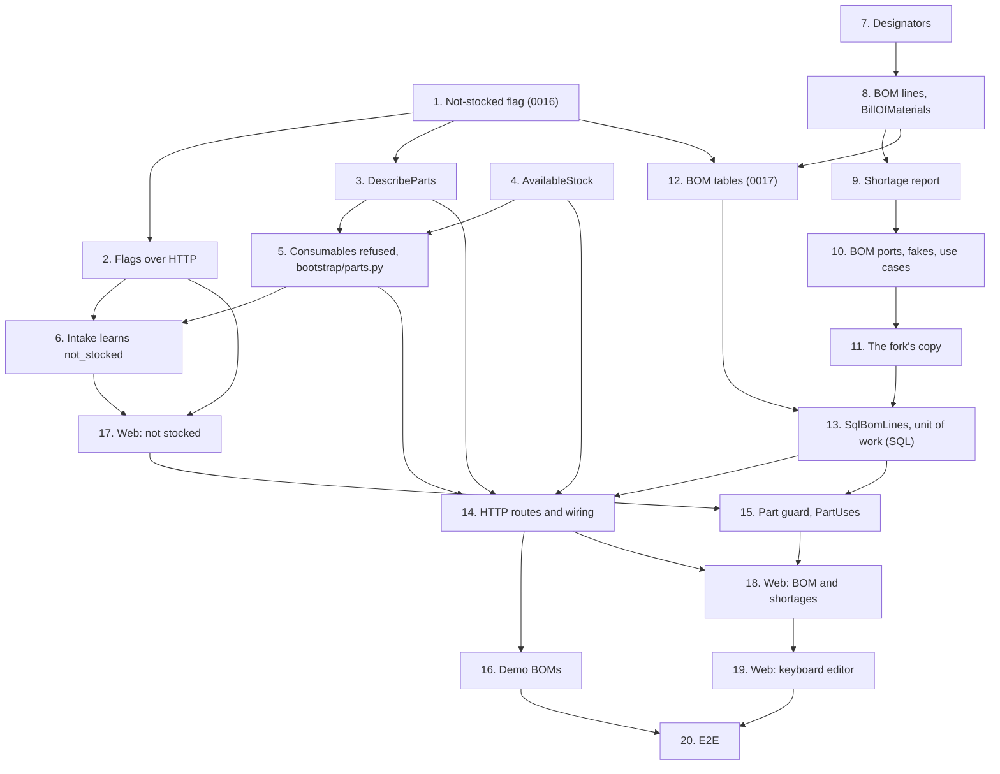

# Implementation Plan

## Overview

Twenty tasks that build the `bill-of-materials` slice described in [design.md](design.md) and
required by [requirements.md](requirements.md): catalog's not-stocked flag, its resolution beside
tracking and both flags over HTTP, and `DescribeParts`; inventory's `AvailableStock` and its
refusal of new stock for consumables through one `Parts` adapter; 07's intake learning the flag;
projects' designators, BOM lines, bill of materials and shortage report, the BOM ports and use
cases and the fork's copy; the two tables, their repository and their routes; catalog keeping a
part that a BOM names; sample BOMs in the demo bench; the web's not-stocked switch, the BOM
section with its shortage report and its keyboard editor; and the end-to-end journey.

This spec adds no module, two tables (`bom_lines` and `bom_designators`) and two migrations:
`0016_category_stocking.py`, a column on catalog's `categories`, and `0017_bill_of_materials.py`,
a unique key on `revisions` and the two tables, after 08-projects-and-revisions' `0015`, so the
head moves from `0015_revision_files.py` to `0017`. It adds no ADR: `0014` stays free (design
decision 19). ADR 0007's list of isolated tables gains `bom_lines` and `bom_designators` in task
12, the commit that creates them.

Branch first, once 08-projects-and-revisions' PR has merged: before task 1, run `git switch
main && git pull && git switch -c feat/bill-of-materials`, and never commit this spec's work on
`main`. Task 1's commit also adds
this spec's `requirements.md`, `design.md` and `tasks.md`.

One task, one commit. Every commit has to pass `make check` **on its own**, because `main` is
rebase-merged and each commit lands (AGENTS.md). Each task says when it also needs
`make coverage` (it touches SQL or its wiring: tasks 1 to 5, 10 and 12 to 16), `make e2e` (it
touches the web: 6, 15, 17, 18 and 19, and 20 itself) or `make client` (it changes routes or
schemas: 2, 6 and 14; the regenerated client goes in that same commit). Tick the task in this
file in the same commit. Suggested Conventional Commit subjects are in `code` under each task.

Release footer: this spec is **the second of three** in `v0.5.0` (08-projects-and-revisions
before it, 10-build-lifecycle after it), so **no task here carries `Release-As: 0.5.0`**. That
footer belongs on 10's phase-closing documentation task, a commit that changes files, never an
empty one (ADR 0012's amendment). See [Notes](#one-pr-per-spec-and-the-release).

## Tasks

- [x] 1. Catalog: store and resolve the not-stocked flag
  - `catalog/domain/category.py`: `Category.not_stocked: bool | None = None` and
    `set_not_stocked(value) -> bool`; `CategoryFlags`; `resolve_flags_of(chain)` in place of
    `resolve_tracking_of`; `flags_in_tree(category, by_id)` in place of
    `catalog/application/categories.py`'s `resolve_tracking_in`, the tree walk it moves into the
    domain.
  - `catalog/application/categories.py`: `CategoryView` and `CategoryNode` carry
    `flags: CategoryFlags` in place of `tracked_individually_resolved`; `resolve_flags(work,
    category)` in place of `resolve_tracking`; `SetCategoryStocking` (load, `set_not_stocked`,
    commit only on a change, answer the view); `ListCategories` resolving both flags from its
    tree. `catalog/application/attributes.py`: `CategorySchema.flags`.
  - Callers kept whole in this commit: `catalog/api/schemas.py` reads the resolved tracking
    answer from `flags`, so the wire doesn't change yet; `catalog/application/drafts.py`'s
    `_Tree.describe` calls `flags_in_tree` and keeps answering the tracking flag;
    `bootstrap/inventory.py` and `bootstrap/inventory_demo.py` read
    `schema.flags.tracked_individually`; and `tests/integration/test_catalog_repositories.py`
    calls `resolve_flags` where it called `resolve_tracking`.
  - `catalog/infrastructure/orm.py`: `Column("not_stocked", Boolean, nullable=True)`. Run
    `make migration m="category stocking"`, then check `0016_category_stocking.py`: the one
    `add_column`, a `downgrade` that drops it, and a docstring saying, as `0009`'s does, why the
    column needs no `isolate_by_workspace`.
  - `tests/catalog/test_category.py`: `set_not_stocked` to yes, no and inherit, and its no-op;
    `resolve_flags_of` with the two flags set at different levels and a set value below an
    inherited one; **property 1** (flags resolve independently, and the nearest set value wins)
    as Hypothesis, over generated chains and trees.
  - `tests/catalog/test_category_use_cases.py`: `SetCategoryStocking` in each (current, wanted)
    pair, a no-op committing nothing, the parts and the tracking flag left as they were; views,
    nodes and schemas carrying both resolved flags; a move answering both under the new parent.
  - `tests/integration/test_catalog_repositories.py`: the column's three states written and read
    back. `tests/integration/test_migrations.py` covers the round trip and `alembic check`;
    confirm both pass.
  - This commit also adds `.kiro/specs/09-bill-of-materials/requirements.md`, `design.md` and
    `tasks.md`, on the `feat/bill-of-materials` branch.
    *Done differently:* the three documents landed in their own commit before this task
    (`docs: add the bill-of-materials spec`), so this commit only ticks the task.
  - Checks: `make check`, then `make coverage`: this task is SQL. `wiredex db check` finds no
    drift with the head at `0016`.
  - `feat(catalog): mark categories not stocked, inherited along the tree`
  - _Requirements: 1.1, 1.2, 1.3, 1.6, 12.2, 12.6_

- [x] 2. Catalog: set and answer both flags over HTTP
  - `catalog/api/schemas.py`: `UpdateCategoryRequest.not_stocked` and `sets_stocking()`,
    tri-state as `tracked_individually` is; `CategoryResponse.not_stocked` and
    `not_stocked_resolved`; `PartResponse.tracked_individually` and `not_stocked`, the part's
    resolved flags.
  - `catalog/api/router.py`: `CatalogUseCases.set_category_stocking`; `_update_category` runs it
    after the tracking step and still refuses a patch that carries nothing; `_read_values` hands
    the schema read's flags to `PartResponse`. `bootstrap/catalog.py`: wires
    `SetCategoryStocking`.
  - `tests/catalog/test_catalog_api.py`: `{"not_stocked": true}`, `false`, `null` and absent;
    both flags in one patch; the node list, a category and a schema answering both set values and
    both resolved answers; a part answering both flags inherited from a grandparent, and both
    false under a tree that sets neither.
  - Run `make client` and commit the regenerated client in this task; the existing aliases
    (`CategoryNode`, `CategoryChange`, `CategorySchema`, `PartDetails`) cover the changed
    schemas.
  - `apps/web/src/test/server.ts`: `aCategory` and `aPartDetails` fill the new fields, so `tsc`
    stays green; no screen changes yet.
  - Checks: `make check`, `make coverage` (the wiring changed), `make client`.
  - `feat(catalog): set and answer the not-stocked flag over HTTP`
  - _Requirements: 1.1, 1.4, 1.5, 12.4_

- [x] 3. Catalog: describe several parts and their flags
  - `catalog/application/ports.py`: `PartDefinitions.with_ids(part_ids)`.
    `catalog/infrastructure/repositories.py`: `SqlPartDefinitions.with_ids`, one `IN` query
    filtered by `workspace_id`. `tests/support/catalog.py`: `InMemoryPartDefinitions.with_ids`.
  - `catalog/application/parts.py`: `PartDescription` and `DescribeParts` (no ids, no
    transaction; else `with_ids`, then `categories.all()`, and each part's flags by
    `flags_in_tree`).
  - `tests/catalog/test_part_use_cases.py`: parts answered with both flags inherited; an unknown
    id left out; an empty list opening no unit of work; two reads for one part and for thirty.
  - `tests/integration/test_catalog_repositories.py`: `with_ids` as one statement for one id and
    for thirty, counted with `tests/support/sql.py`'s `counting`.
    `tests/integration/test_catalog_isolation.py`: as `wiredex_app`, workspace B's part left out
    of A's answer.
  - Checks: `make check`, `make coverage`.
  - `feat(catalog): describe several parts and their resolved flags in two reads`
  - _Requirements: 1.2, 1.3, 9.3, 12.3_

- [x] 4. Inventory: the available stock of several parts
  - `inventory/application/ports.py`: `BalanceSheet.available_by_part(part_ids)`.
    `inventory/infrastructure/repositories.py`: `SqlBalanceSheet.available_by_part`,
    `totals_by_part`'s grouped query summing `available`. `tests/support/inventory.py`:
    `InMemoryBalanceSheet.available_by_part`.
  - `inventory/application/stock.py`: `AvailableStock`, beside `PartTotals`.
  - `tests/inventory/test_stock_use_cases.py`: the sum over a part's lots; a part with no lot
    absent; no ids opening no unit of work; a unit-tracked part answering its in-stock units
    after three are received and one retired, and again once it is un-retired.
  - `tests/integration/test_inventory_repositories.py`: one grouped statement whatever the number
    of parts; the same as `on_hand` while nothing is reserved; another workspace's lots never
    summed.
  - Checks: `make check`, `make coverage`.
  - `feat(inventory): answer the available stock of several parts in one query`
  - _Requirements: 6.2, 6.3, 12.3_

- [x] 5. Inventory: refuse new stock for consumables
  - `inventory/application/ports.py`: `PartStockInfo.not_stocked`. `inventory/domain/errors.py`:
    `NotStockedError`, asserted an `InventoryError` in `tests/inventory/test_errors.py`; it falls
    through the router's table to 422, so the router doesn't change.
  - `inventory/application/movements.py`: `ReceiveStock` checks that the part exists, then that
    it isn't a consumable, then that it isn't tracked; `AdjustStock` refuses a consumable at a
    location where it has no lot, inside its transaction and before any write; `MoveStock`
    doesn't change. `inventory/application/units.py`: `ReceiveUnits` checks existence, then the
    consumable, then tracking.
  - `bootstrap/parts.py` (new): `CatalogParts`, inventory's `Parts` over `DescribeParts` (design
    decision 14). `bootstrap/inventory.py` and `bootstrap/inventory_demo.py` build it and lose
    their own `CatalogParts`.
  - `tests/support/inventory.py`: `FakeParts` also knows a consumable part and a tracked
    consumable.
  - `tests/inventory/test_movement_use_cases.py` and `test_unit_use_cases.py`: every operation of
    the design's table for each combination of flags; nothing written and no commit on a
    refusal; a lot and units received before the fake's flag was set still recounted, moved,
    retired, un-retired and deleted. `tests/inventory/test_inventory_api.py` and
    `test_unit_api.py`: the 422 and its sentence.
  - `tests/bootstrap/test_parts_adapters.py` (new): `CatalogParts` over the in-memory catalog: a
    missing part, both flags inherited, ids translated between the modules.
  - `tests/integration/test_consumables.py` (new): through `inventory_use_cases` on Postgres, a
    lot receipt and a unit receipt of a not-stocked category's parts refused; a lot received
    before the flag was set still recounted and moved; setting the flag and moving the category
    leaving every lot, movement and unit as it was. `tests/integration/test_demo_cli.py` passes
    unchanged, now that the inventory demo describes parts through the new adapter.
  - Checks: `make check`, `make coverage`. `make client` leaves the package unchanged.
  - `feat(inventory): refuse new stock for parts that aren't stocked`
  - _Requirements: 1.6, 2.1, 2.2, 2.3, 2.4, 12.1_

- [x] 6. Intake: report stock given to a consumable
  - Builds on 07-quick-add-and-import's intake code, on `main` since `v0.4.0` (see Reading it).
  - `catalog/application/drafts.py`: `DraftReview.not_stocked`, resolved from the tree
    `PartDrafts` already reads.
  - `inventory/domain/intake.py`: `ProblemCode.NOT_STOCKED`; `KnownPart.not_stocked`,
    `DefinesPart.not_stocked` and `SameAsRow.not_stocked`; `plan_stock(row, tracked,
    not_stocked, locations)` answers one `not_stocked` problem on the first stock cell given, in
    the order `quantity`, `location`, `serial`, `mac`, and plans no stock.
  - `inventory/application/ports.py`: `PartReview.not_stocked`. `inventory/application/intake.py`:
    `QuickAdd` reports `not_stocked` on `quantity`. `inventory/application/imports.py`:
    `plan_import` hands every row's flag to `plan_stock`. `bootstrap/intake.py`: `CatalogPartDesk`
    carries the flag. `inventory/api/schemas.py`: `ProblemCodeName` gains `not_stocked`.
  - `tests/catalog/test_drafts.py`: the flag inherited, for a new part and for a stored one.
    `tests/inventory/test_intake_plan.py`: the problem on each first stock cell, and no stock
    planned. `tests/inventory/test_quick_add.py`: stock for a consumable refused, the part alone
    accepted in one commit. `tests/inventory/test_imports.py`: a row naming a stored consumable
    with stock refused; a consumable defined without stock; a row repeating an earlier row's new
    part carrying its flag; 07's generators drawing not-stocked categories too, so 07's
    properties 4, 5 and 7 cover them.
    `tests/bootstrap/test_intake_desk.py`: the flag carried. `tests/inventory/test_intake_api.py`:
    `ProblemCodeName` kept in step.
  - Web: `features/inventory/intake/problems.ts` and `inventory.intake.problem.not_stocked` in
    both locale files; `intake/QuickAddDialog.tsx` hides the location and quantity when the
    chosen category's schema resolves not stocked, says why (`inventory.quickAdd.notStocked`, in
    both locale files) and sends no stock; `QuickAddDialog.test.tsx`, and the test that every
    `ProblemCodeName` has a sentence in both locales.
    *Done differently:* `problems.ts` needed no change, since it picks the sentence by code; and
    the dialog reads `not_stocked_resolved` off the category list it already reads
    `tracked_individually_resolved` from, not off the schema, so both flags come from one place
    and the fields hide as soon as the category is picked.
  - Run `make client` and commit the regenerated client in this task.
  - Checks: `make check`, `make client`, `make e2e`.
  - `feat(inventory): keep quick-add and import from stocking consumables`
  - _Requirements: 2.5, 2.6, 11.12, 11.15, 12.4_

- [x] 7. Projects: designators and designator lists
  - `projects/domain/designators.py`: `Designator` (`parse`, `__str__`, ordered by letters and
    then number), `Designators` (`parse`, `of`, `none`, `text`, `__len__`, `__iter__`,
    `__contains__`), `MAX_DESIGNATOR_LETTERS`, `MAX_DESIGNATOR_NUMBER` and `MAX_DESIGNATORS`; a
    range counted before it is expanded.
  - `projects/domain/errors.py`: `BomField`, `ContentRefusal`, and `ContentError` with its `code`,
    `field` and `item`; the designator leaves `InvalidDesignatorError`,
    `InvalidDesignatorRangeError`, `RepeatedDesignatorError` and `TooManyDesignatorsError`, each
    asserted a `ContentError` with its code and field in `tests/projects/test_errors.py`.
  - `tests/support/bom.py` (new): Hypothesis strategies for designators, designator sets and the
    many ways of writing a set.
  - `tests/projects/test_designators.py`: `r01`, `Ｒ１` and ` c12 ` read as `R1` and `C12`;
    `U1A`, `U1.2`, `R0`, `R10000`, `ABCDEFGHI1`, `1R` and `Ω1` refused, each named; `R1-4`,
    `R1 – R4`, `R1—R4` and `r1-r4` read alike; `R4-R1`, `R3-R3` and `R1-C4` refused; `R1, R1` and
    `R1-R3, R2` refused naming the repeat; 256 and 257 designators; `R1–R9999` refused as too
    many; the canonical texts `C1, R1–R3, R7`, `R1, R2` and `R1, R2, R4–R6`; **property 2** (a
    designator is exactly its grammar, and its text is a fixpoint), **property 3** (canonical
    text reads back as the same designators) and **property 4** (any spelling of a list reads the
    same) as Hypothesis.
    *Done differently:* `pyproject.toml` allows the en and em dashes as ruff confusables
    (`allowed-confusables`), since the canonical text is written with the en dash and both are
    typed; `ContentRefusal` holds the four designator codes here and grows with task 8's leaves.
  - Checks: `make check`.
  - `feat(projects): read and write designator lists`
  - _Requirements: 3.1, 3.2, 3.3, 3.4, 3.5, 3.6, 3.7, 3.8, 12.6_

- [x] 8. Projects: BOM lines and a revision's bill of materials
  - `projects/domain/values.py`: `BomLineId` and `PartId`, beside 08's ids.
    `projects/domain/bom.py`: `LineQuantity`, `BomNotes`, `LineContent.of` (design decision 7),
    `BomLine` (`on`, `revised`, `copied_to`), `PartNeed`, `BillOfMaterials` (`with_line`,
    `replacing`, `without`, `line`, `line_with`, `needs`, `part_ids`), `MAX_LINES` and the other
    limits.
  - `projects/domain/revision.py`: `Revision.ensure_content_editable()` and `Revision.touch(now)`.
  - `projects/domain/errors.py`: `QuantityMismatchError`, `InvalidLineQuantityError`,
    `InvalidBomNotesError`, `UnknownPartError`, `DesignatorTakenError` (carrying the line that
    holds it), `TooManyLinesError`, `RevisionContentLockedError` and `BomLineNotFoundError`, each
    asserted in `tests/projects/test_errors.py`.
  - `tests/projects/test_bom.py`: the quantity at 0, 1, 10,000 and 10,001; a quantity equal to and
    differing from the designator count; notes of 500 and 501 characters once collapsed, and
    blank ones; a 501st line refused; a taken designator naming the line `R5–R7`; an edit keeping
    its own designators and its place; `line_with`; `needs` summing two lines of one part, in
    first-appearance order; `copied_to` taking the target's revision, workspace and date;
    **property 5** (a line's content is exactly what its rules allow) and **property 6** (a BOM
    keeps its invariants under any edits) as Hypothesis.
    *Done differently:* `tests/support/bom.py` also gains the BOM strategies (`line_contents`,
    `boms`) and `a_revision`/`a_line` here, since property 6 needs them before task 9 does.
  - `tests/projects/test_revision.py`: `ensure_content_editable` in each of the four statuses;
    `touch`.
  - Checks: `make check`.
  - `feat(projects): model BOM lines and a revision's bill of materials`
  - _Requirements: 4.1, 4.3, 4.4, 4.5, 4.6, 4.7, 4.8, 4.9, 4.10, 5.1, 12.6_

- [x] 9. Projects: the shortage report
  - `projects/domain/shortage.py`: `PartFacts`, `StockStatus`, `PartShortage`, `ShortageSummary`
    with `complete`, and `ShortageReport.of`.
  - `tests/projects/test_shortage.py`: a covered part, a short one, a consumable holding a lot, an
    unknown part, a part both tracked and not stocked, a need summed across two lines, and an
    empty BOM complete; **property 7** (the report adds up) and **property 8** (the report
    ignores order and splits) as Hypothesis, over `tests/support/bom.py`'s BOM strategies.
  - Checks: `make check`.
  - `feat(projects): compute a bill of materials' shortage report`
  - _Requirements: 6.1, 6.2, 6.4, 6.5, 6.6, 6.8, 12.6_

- [x] 10. Projects: BOM ports, fakes and use cases
  - `projects/application/ports.py`: `BomLines`, `PartLookup`, `StockLevels`,
    `Revisions.project_of`, and `BomUnitOfWork(ProjectsUnitOfWork, Protocol)` with its `bom_lines`
    (design's Projects: application); `NewBomLine`, `BomView`, `BomUse` and `BomUses`.
    `ProjectsUnitOfWork` itself doesn't grow a member `SqlProjectsUnitOfWork` lacks, so the
    bootstrap wiring of 08's use cases still type-checks.
  - `projects/infrastructure/repositories.py`: `SqlRevisions.project_of`, one select over the
    existing table, in this same commit, since `Revisions` grows by it; its integration test
    comes with task 13's.
  - `projects/application/revisions.py`: `lock_revision` (design decision 12).
  - `projects/application/bom.py`: `GetBom`, `AddBomLine`, `UpdateBomLine`, `RemoveBomLine` and
    `ListPartUses`.
  - `tests/support/projects.py`: `InMemoryBomLines` (lines by revision in `created_at, id`
    order; removing a revision or a project, and `clear`, taking their lines as the cascade does;
    reads counted), `InMemoryRevisions.project_of`, the unit of work's `bom_lines`,
    `FakePartLookup` and `FakeStockLevels` (their calls counted), and a `World` that builds the
    BOM use cases.
  - `tests/projects/test_bom_use_cases.py`: add, edit and remove on a draft, each touching the
    revision and lifting its project in `ListProjects`; the part asked before the unit of work
    opens, and an unknown part refused on add and on edit; every 404, a line named under another
    revision included; each write refused with no commit in `reserved`, `built` and `dismantled`,
    stored in the fakes; a no-op edit committing nothing; the 409 naming the line; the 501st
    line; `lock_revision` locking the project before loading the revision; `GetBom` answering
    `editable` in each status, and a report following a rename, a flag change and a receipt made
    between two reads; one BOM read costing the revision, two BOM reads, one lookup and one stock
    call whatever its size, and neither port for an empty BOM; `ListPartUses` naming three and
    counting the rest.
    *Done differently:* the fake counts a call to `of_revision` as one read, not the two
    statements `SqlBomLines` makes; the test pins one revision read, one BOM read, one lookup
    and one stock call for a BOM of one line and of forty. `NewBomLine.designators` defaults
    through `field(default_factory=Designators.none)`, since ruff refuses a call as a dataclass
    default.
  - Checks: `make check`, `make coverage` (`SqlRevisions.project_of`).
  - `feat(projects): add, edit, remove and read BOM lines`
  - _Requirements: 4.1, 4.2, 4.6, 4.9, 4.10, 4.12, 5.1, 5.2, 5.3, 5.4, 6.7, 8.3, 12.1, 12.3_

- [x] 11. Projects: a fork copies the BOM
  - `projects/application/bom.py`: `CopyBomLines(bom_lines, ids)`, the `RevisionContent` of
    design decision 15: the source's BOM, each line `copied_to` the fork with an id minted in
    order, one `add_all`, and no commit.
  - `tests/support/projects.py`: the in-memory unit of work, given the `World`'s ids, registers
    `CopyBomLines(self.bom_lines, ids)` first; `revision_contents` stays settable, so 08's fork
    tests still register their own.
  - `tests/projects/test_fork_bom.py`: forks of a draft and of a built revision carrying the
    lines; the source's BOM unchanged; fresh ids on the fork; an empty BOM copying nothing; a
    `FailingContent` registered after the copy meaning no commit; **property 9** (a fork carries
    its source's BOM, first) as Hypothesis, with a `RecordingContent` after the copy that finds
    the fork's lines already there.
  - Checks: `make check`.
  - `feat(projects): copy a revision's bill of materials when it is forked`
  - _Requirements: 7.1, 7.2, 7.3, 7.4, 12.6_

- [x] 12. Projects: the BOM tables and migration 0017
  - `projects/infrastructure/types.py`: `DesignatorType`, `LineQuantityType` and `BomNotesType`.
  - `projects/infrastructure/orm.py`: `UniqueConstraint("workspace_id", "id")` on `revisions`;
    `bom_lines` and `bom_designators` as the design's Data Models give them (the composite keys
    and their cascades, the quantity and designator CHECKs, the primary key, `ix_bom_lines_part`
    and `ix_bom_designators_line`), Core tables with no mapping.
  - Run `make migration m="bill of materials"`, then fix `0017_bill_of_materials.py` by hand:
    `op.f()` on constraint names, the regex CHECK written out,
    `isolate_by_workspace(op.execute, …)` for both tables, and a `downgrade` that drops
    `bom_designators`, then `bom_lines`, then the unique constraint on `revisions`.
    *Done differently:* autogenerate put the unique constraint on `revisions` last; it moves
    first by hand, since Postgres needs it before the lines' key can point at it.
  - `docs/adr/0007-workspace-isolation.md`: `bom_lines` and `bom_designators` (projects, `v0.5`)
    join the list of isolated tables, in this same commit.
  - `tests/integration/test_migrations.py` covers the round trip and `alembic check`; confirm
    both pass.
  - Checks: `make check`, then `make coverage`: this task is SQL. `wiredex db check` finds no
    drift with the head at `0017`.
  - `feat(projects): add the BOM tables with workspace isolation`
  - _Requirements: 5.5, 9.1, 9.2, 12.2_

- [x] 13. Projects: store BOM lines in PostgreSQL
  - `projects/infrastructure/repositories.py`: `SqlBomLines` (Core, every statement filtering
    `workspace_id`; `of_revision` in two reads; `add` and `add_all` flushing the session first,
    then one executemany each for the lines and their designators; `update` writing only the
    designators that differ; `remove`; `uses_of` with its order, limit and count), and
    `SqlRevisions.get` reading with `populate_existing`.
  - `projects/infrastructure/unit_of_work.py`: `SqlProjectsUnitOfWork(session_factory,
    workspace_id, ids)`, binding `bom_lines` and `revision_contents =
    (CopyBomLines(self.bom_lines, self._ids),)`, which makes it a `BomUnitOfWork`.
    `bootstrap/projects.py`, `bootstrap/projects_demo.py` and `bootstrap/files.py` build it with
    `Uuid7Generator()`, and so do the helpers in `tests/integration/test_projects_repositories.py`
    and `test_projects_isolation.py`.
  - `tests/integration/test_bom_repositories.py`: lines and designators read back equal and in
    order; an edit from `R1–R3` to `R2–R4` keeping the rows of `R2` and `R3` (their `xmin`
    unchanged); a duplicate designator in a revision refused by the primary key, and a designator
    filed under a line of another revision refused by the composite key; the cascades from a
    line, a revision and a project; `uses_of` across two projects; two concurrent adds claiming
    `R1` leaving one line and answering one 409; an add that waited on the project's lock while
    another transaction set the revision to `reserved`, refused; a fork copying its source's
    lines in its one transaction, and a `FailingContent` registered after the copy on a test
    subclass of the unit of work leaving no revision and no line; `SqlRevisions.project_of` for
    a revision of the workspace, one of another and none.
  - `tests/integration/test_bom_isolation.py`: as `wiredex_app`, workspace B's lines and
    designators invisible and unwritable from A; as the owner, a line whose workspace differs
    from its revision's refused by the key.
    *Done differently:* `test_bom_repositories.py` also holds an edit that waited on the lock
    while the revision became `reserved`, and `SqlRevisions.get` refreshing a revision the
    session already held; `test_projects_repositories.py`'s check that a fresh unit of work
    registers no content now expects the BOM's copy alone.
  - Checks: `make check`, then `make coverage`: this task is SQL.
  - `feat(projects): store BOM lines and designators in PostgreSQL`
  - _Requirements: 4.10, 4.11, 5.4, 5.5, 7.4, 9.1, 9.2, 9.4, 12.3_

- [x] 14. Projects: HTTP routes and wiring
  - `projects/api/schemas.py`: `BomLineRequest`, `BomResponse`, `BomLineResponse`,
    `ShortageReportResponse`, `ShortageSummaryResponse`, `BomPartResponse`,
    `BomPartFactsResponse` and `BomRefusalResponse`; `StockStatusName`, `BomFieldName` and
    `BomRefusalCodeName` as `Literal`s.
  - `projects/api/router.py`: `_add_bom_routes` (GET a revision's BOM; POST, PATCH and DELETE a
    line under its revision), the three writes declaring `BomRefusalResponse` as their 409,
    `_bom_refusals()` nested inside `_refusals()`, and `BomLineNotFoundError` and the two 409s in
    the status table; `ProjectsUseCases` gains `get_bom`, `add_bom_line`, `update_bom_line` and
    `remove_bom_line`.
  - `bootstrap/parts.py`: `CatalogPartLookup`. `bootstrap/projects.py`: `InventoryStockLevels`,
    and the four use cases over `DescribeParts` and `AvailableStock`. `tests/support/projects.py`:
    `World.projects_use_cases()` gains them.
  - `tests/projects/test_bom_api.py`: every route and status; each refusal's body with its code
    and field; blank designators and notes read as none; the 4,000-character bounds;
    `StockStatusName`, `BomFieldName` and `BomRefusalCodeName` kept in step with their enums.
    `tests/projects/test_bom_auth.py`: 401 without a session on the four routes, and 403 without
    CSRF on the three writes.
  - `tests/bootstrap/test_parts_adapters.py` (extended): `CatalogPartLookup`.
    `tests/bootstrap/test_stock_levels.py` (new): `InventoryStockLevels` over the in-memory
    inventory.
  - `tests/integration/test_bom_reads.py` (new): through the real wiring, nine statements for a
    BOM of one line and of forty lines over thirty parts; a line naming workspace B's part
    refused as unknown; a renamed part and a category flag change answered at the next read; a
    unit-tracked part's available stock equal to its in-stock units.
  - Run `make client`, add aliases for the new schemas to `packages/api-client/src/index.ts`
    (`Bom`, `BomLine`, `BomLineChange`, `ShortageReport`, `ShortageSummary`, `BomPart`,
    `BomPartFacts`, `StockStatus`, `BomRefusal`, `BomRefusalCode`, `BomField`), and commit the
    regenerated client in this task.
  - Checks: `make check`, `make coverage` (the wiring runs in the integration suite),
    `make client`.
  - `feat(projects): expose bills of materials over HTTP`
  - _Requirements: 3.1, 4.2, 4.11, 4.12, 5.2, 6.1, 6.3, 6.7, 8.3, 9.3, 9.4, 9.5, 9.6, 12.1, 12.3,
    12.4_

- [ ] 15. Catalog: keep a part that a bill of materials names
  - `catalog/domain/usage.py` (new): `PartUse` and `PartUsage`, plain values.
    `catalog/application/ports.py`: `PartUses`. `catalog/domain/errors.py`: `PartInUseError`,
    carrying the usage, asserted a `CatalogError` in `tests/catalog/test_errors.py`.
  - `catalog/application/parts.py`: `DeletePart(unit_of_work, part_uses)` loads the part (404),
    asks `of_part(…, limit=3)`, raises `PartInUseError` before anything is removed, and otherwise
    deletes as before. `tests/support/catalog.py`: `FakePartUses`.
  - `catalog/api/schemas.py`: `PartInUseResponse` and `PartUseResponse`. `catalog/api/router.py`:
    `PartInUseError` a 409 through `_part_in_use()`, nested inside `_refusals()` and undeclared on
    the route, as the pinout's refusal is.
  - `bootstrap/catalog.py`: `BomPartUses`, catalog's `PartUses` over projects' `ListPartUses` on
    `SqlProjectsUnitOfWork`, handed to `DeletePart`.
  - `tests/catalog/test_part_use_cases.py`: a part one BOM names refused, with nothing removed;
    five BOMs, three named and two more counted; a part no BOM names deleted; a part already gone
    still a 404. `tests/catalog/test_catalog_api.py`: the 409's body.
    `tests/bootstrap/test_bom_part_uses.py` (new): `BomPartUses` over the in-memory projects.
    `tests/integration/test_part_uses.py` (new): through the real wiring, a part on two BOMs
    refused naming both, then deleted once its lines are gone.
  - Web: `features/catalog/catalog.ts`'s `CatalogRefusal` carries a 409's uses and how many more;
    `PartPage.tsx`'s *Delete* lists the BOMs, each a link to its revision's address, and how many
    more; `catalog.part.inUse.*` in both locale files; `src/test/server.ts`: a refused deletion;
    `PartPage.test.tsx`: the refusal's BOMs found by role and accessible name.
  - Checks: `make check`, `make coverage`, `make e2e`. `make client` leaves the package unchanged:
    the 409 isn't declared.
  - `feat(catalog): keep a part that a bill of materials names`
  - _Requirements: 8.1, 8.2, 11.13, 11.15, 12.1_

- [ ] 16. Sample BOMs in the demo bench
  - `catalog/application/demo.py`: `SampleCategory.not_stocked`, and the root *Consumables*, not
    stocked, holding *Hook-up wire 22 AWG* with no manufacturer and no part number.
  - `projects/application/demo.py`: `SampleBomLine`, each sample revision's lines as the design's
    table gives them, and `RestoreSampleProjects(…, add_bom_line, demo_parts)`: `A`'s lines added
    before `B` is forked, `B`'s own after; a line whose part the mapping lacks skipped.
  - `bootstrap/projects_demo.py`: `AddBomLine` over `CatalogPartLookup`, and the bench's sample
    parts by name from catalog's `ListParts`.
  - `tests/catalog/test_demo.py`: *Consumables* resolves not stocked and holds the wire.
    `tests/projects/test_demo.py`: every sample revision's lines; `B` holding `A`'s five and three
    more; the BME280, the AMS1117 and the 2u2 short, the wire not stocked and the greenhouse
    complete, over fake facts and the sample stock's numbers; a second restore giving the same
    BOMs; a missing part skipped.
  - `tests/integration/test_demo_cli.py`: the `database` fixture also truncates
    `bom_designators` and `bom_lines`; the reset and the invite restore the sample BOMs in demo
    benches only, twice alike; no lot of the wire is ever received.
  - Checks: `make check`, `make coverage`.
  - `feat(projects): seed the demo workspace with sample bills of materials`
  - _Requirements: 10.1, 10.2, 10.3_

- [x] 17. Web: the not-stocked switch and consumables on the part page
  - `features/catalog/CategoriesPage.tsx`: *Not stocked* beside *Tracked individually*, as
    inherit, yes or no, with the inherited answer shown while it inherits, sending `not_stocked`.
  - `features/catalog/PartPage.tsx`: `StockByPart` gets `unitTracked` and `notStocked` from the
    part's own flags, no longer from the schema.
  - `features/inventory/StockByPart.tsx`: `notStocked`: a line saying the part isn't stocked, no
    *Receive* or *Receive units*, *Adjust* and *Move* only while the part holds stock, and a
    tracked consumable's units still listed.
  - `catalog.categories.stocking.*` and `inventory.stock.notStocked*` in both `en.json` and
    `pt-BR.json`.
  - `CategoriesPage.test.tsx` (the control's three values, the inherited answer, the patch body),
    `StockByPart.test.tsx` (a consumable with and without stock, and a tracked one) and
    `PartPage.test.tsx` (the flags read from the part), every control found by role and
    accessible name.
  - Checks: `make check`, `make e2e`.
  - `feat(web): mark categories not stocked and show consumables as such`
  - _Requirements: 11.10, 11.11, 11.15, 11.16_

- [ ] 18. Web: a revision's bill of materials and its shortages
  - `features/projects/bom/bom.ts`: `bomKeys`, `useBom` and `BomRefusal`. `bom/stockStatus.ts`;
    `bom/ShortageReport.tsx` (the summary, the short and unknown parts with their links, *Nothing
    is short*); `bom/BomSection.tsx`, read-only for now (the table of lines with each part's
    status, and for a revision that isn't a draft the note saying why).
  - `features/projects/RevisionPanel.tsx`: mounts `BomSection` after the notes, before the files.
  - `features/inventory/intake/intake.ts`: a quick-add and an import refresh `bomKeys.all`
    beside the catalog and inventory roots.
  - `projects.bom.*` keys for the section, the report and the statuses, in both locale files.
  - `src/test/server.ts`: `aBom`, `aBomLine`, `aBomPart` and `respondWithBom`.
  - `BomSection.test.tsx` (the rows with their designators, part, quantity, notes and status; a
    reserved revision's BOM with no controls and its note), `ShortageReport.test.tsx` (short and
    unknown parts linking to their pages; the message when nothing is short),
    `RevisionPanel.test.tsx` (the section mounted), and the intake tests seeing the BOM fetched
    again after a quick-add and an import. The table and the report sit in their own
    `overflow-x-auto` box, so a phone never scrolls the page sideways.
  - Checks: `make check`, `make e2e`.
  - `feat(web): show a revision's bill of materials and its shortages`
  - _Requirements: 11.1, 11.8, 11.9, 11.14, 11.15, 11.16, 11.17_

- [ ] 19. Web: write a bill of materials from the keyboard
  - `features/projects/bom/designators.ts`: `readDesignators(text)`, the server's rules mirrored
    for the preview.
  - `features/catalog/PartPicker.tsx`, and `catalog/search/search.ts`'s
    `usePartSuggestions(text)`.
  - `bom/bom.ts`: `useAddBomLine`, `useUpdateBomLine` and `useRemoveBomLine`, each refreshing
    `bomKeys.revision(id)` and `projectKeys.all`; `BomRefusal` read from a refusal body or from
    FastAPI's own list.
  - `bom/BomAddRow.tsx` and `bom/BomLineRow.tsx`; `BomSection.tsx` mounts them for a draft.
  - `projects.bom.*` keys for the editor, with a sentence for every `BomRefusalCodeName` typed
    against the generated union, in both locale files.
  - `src/test/server.ts`: `acceptBomWrites` and `respondWithPartSuggestions`.
  - `designators.test.ts` (the server's examples and canonical texts), `PartPicker.test.tsx`
    (typing, the arrow keys, Enter, Escape, `aria-activedescendant`), `BomAddRow.test.tsx` (Enter
    from every field, the row clearing and Designators focused again, the preview and the
    read-only quantity, each refusal on its field) and `BomLineRow.test.tsx` (Enter saves,
    Escape restores and focuses *Edit* again, removal asked in the row with focus on *Keep*), all
    driven by the keyboard alone and found by role and accessible name. The web suite stays at or
    above its 85 % floor.
  - Checks: `make check`, `make e2e`.
  - `feat(web): write a bill of materials from the keyboard`
  - _Requirements: 11.2, 11.3, 11.4, 11.5, 11.6, 11.7, 11.14, 11.15, 11.16, 12.5_

- [ ] 20. End-to-end journey
  - `e2e/tests/bom.spec.ts`, reusing the logged-in session, every name stamped with
    `Date.now()`:
    - Set up through the pages, as the other journeys do: a location `Drawer <stamp>`; a root
      category `Consumables <stamp>`, set *Not stocked* on the categories page, and a root
      category `Passives <stamp>`; the parts `Resistor <stamp>` and `Sensor <stamp>` in Passives
      and `Wire <stamp>` in Consumables; 3 of the resistor received on its page. The wire's page
      says it isn't stocked and offers no receipt.
    - Create the project `Station <stamp>`. On revision `A`'s BOM, by keyboard alone: type
      `r1-4` (the preview reads `R1–R4` and 4, and the quantity shows 4, read-only), Tab,
      `Resistor <stamp>`, arrow down, Enter, Enter: the line appears and focus is back on
      Designators. Add `U1` with the sensor, picked the same way, then the wire with no
      designators, quantity 1 and the notes *2 m*.
    - The report: the resistor short 1 (need 4, 3 available), the sensor short 1, the wire not
      stocked, and each short part links to its page.
    - Type `R4` for the sensor: the refusal lands on Designators, naming the line `R1–R4`.
    - Edit the resistor's line to `R1-3` and press Enter: its quantity is 3 and it isn't short any
      more. Edit it again, change the notes and press Escape: nothing changed.
    - Receive 1 of the sensor on its page, then open `A` again: *Nothing is short*.
    - Fork `A` into `B`: `B`'s BOM holds the same three lines.
    - Delete the sensor on its page: refused, naming `Station <stamp>` revisions `A` and `B`.
    - On `B`, remove the sensor's line, asked first in its row: it is gone from `B` and still on
      `A`.
    - In the Pixel 7 project, the revision page with its BOM and report open has no horizontal
      page overflow (`document.documentElement.scrollWidth` at most the viewport's width).
  - Checks: `make e2e`.
  - `test(e2e): cover the bill of materials, its shortages and consumables`
  - _Requirements: all, end to end_

## Task Dependency Graph



The same graph as waves: every task in a wave can be worked once the waves above it have
landed.

```json
{
  "waves": [
    {
      "wave": 1,
      "tasks": [
        { "id": "1", "name": "Not-stocked flag (0016)", "dependsOn": [] },
        { "id": "4", "name": "AvailableStock", "dependsOn": [] },
        { "id": "7", "name": "Designators", "dependsOn": [] }
      ]
    },
    {
      "wave": 2,
      "tasks": [
        { "id": "2", "name": "Flags over HTTP", "dependsOn": ["1"] },
        { "id": "8", "name": "BOM lines, BillOfMaterials", "dependsOn": ["7"] }
      ]
    },
    {
      "wave": 3,
      "tasks": [
        { "id": "3", "name": "DescribeParts", "dependsOn": ["1"] },
        { "id": "9", "name": "Shortage report", "dependsOn": ["8"] }
      ]
    },
    {
      "wave": 4,
      "tasks": [
        { "id": "5", "name": "Consumables refused, bootstrap/parts.py", "dependsOn": ["3", "4"] },
        { "id": "10", "name": "BOM ports, fakes, use cases", "dependsOn": ["9"] }
      ]
    },
    {
      "wave": 5,
      "tasks": [
        { "id": "6", "name": "Intake learns not_stocked", "dependsOn": ["2", "5"] },
        { "id": "11", "name": "The fork's copy", "dependsOn": ["10"] },
        { "id": "12", "name": "BOM tables (0017)", "dependsOn": ["1", "8"] }
      ]
    },
    {
      "wave": 6,
      "tasks": [
        { "id": "13", "name": "SqlBomLines, unit of work (SQL)", "dependsOn": ["11", "12"] },
        { "id": "17", "name": "Web: not stocked", "dependsOn": ["2", "6"] }
      ]
    },
    {
      "wave": 7,
      "tasks": [
        { "id": "14", "name": "HTTP routes and wiring", "dependsOn": ["3", "4", "5", "13"] },
        { "id": "15", "name": "Part guard, PartUses", "dependsOn": ["13", "17"] }
      ]
    },
    {
      "wave": 8,
      "tasks": [
        { "id": "16", "name": "Demo BOMs", "dependsOn": ["14"] },
        { "id": "18", "name": "Web: BOM and shortages", "dependsOn": ["14", "15"] }
      ]
    },
    { "wave": 9, "tasks": [{ "id": "19", "name": "Web: keyboard editor", "dependsOn": ["18"] }] },
    { "wave": 10, "tasks": [{ "id": "20", "name": "E2E", "dependsOn": ["16", "19"] }] }
  ]
}
```

Reading it:

- **Roots.** 1, 4 and 7 depend on no task here. The whole spec sits downstream of
  08-projects-and-revisions having merged: the `projects` module and its unit of work,
  `RevisionContent`, `Projects.locked`, `load_revision`, the revision panel and the demo's
  `_restore_benches`. Task 6 also needs 07-quick-add-and-import's intake code on `main`
  (`PartReview`, `plan_stock`, `QuickAdd`, `CatalogPartDesk`, the quick-add dialog). Both are
  phase-level dependencies, not task edges; 08's own PR waits for 07, so both are on `main` before
  task 1 starts.
- **Critical path.** 7 → 8 → 9 → 10 → 11 → 13 → 14 → 18 → 19 → 20, one task per wave. The catalog
  and inventory chain (1 → 3 → 5 → 6 → 17 → 15) runs beside it and joins it at 14 and 18.
- **Parallel.** Each wave pairs a catalog or inventory task with a projects task, since they write
  different modules. 3 needs only 1, and 12 only 1 and 8; they sit in the third and fifth waves so
  the catalog's commits land in order and 12's tables land just before 13's repository, which
  costs nothing while the projects chain is the critical path.
- **Kept apart though independent.** 6, 15, 17, 18 and 19 all write the locale files, and 15, 18
  and 19 `src/test/server.ts` too, so no two of them share a wave; 2, 6 and 14 regenerate the
  client, so neither do they. 4 and 5 both write inventory's ports and fakes, which is 5's edge
  to 4.
- **One change from the planned waves.** 15 sits in the seventh wave, beside 14, instead of the
  eighth beside 18: 15 and 18 both write the locale files and the MSW fixtures, so they can't
  share a wave. 15 needs 13's repository and 17's part page but not 14's routes, and it leaves the
  generated client alone, so it lands beside 14 without either touching the other's files.
- **Why these edges.** 2 exposes 1's use case and regenerates the client 6 and 17 read; 3 walks
  1's tree; 5 builds `bootstrap/parts.py` over 3; 6 reads 5's flag in the fakes and 2's schema in
  the dialog; 8 holds 7's designators; 9 reads 8's needs; 10's use cases run 8 and 9; 11 registers
  its copy in 10's fakes; 12 maps 8's values and follows 1's migration; 13 implements 10's ports
  over 12's tables and runs 11's copy on Postgres; 14 wires 13 with 3's and 4's use cases through
  5's `bootstrap/parts.py`; 15 answers catalog from 13's `uses_of` and extends 17's part page; 16
  restores through 14's wiring; 18 reads 14's client after 15's locale keys; 19 edits what 18
  shows; 20 walks everything.

## Notes

### Before pushing

- `make check` on every commit, not only the last.
- `make coverage` on the commits touching SQL or its wiring (1 to 5, 10, and 12 to 16): API floor
  90 %, web floor 85 %.
- `make e2e` on the web commits (6, 15, 17, 18, 19) and after task 20.
- `make client` in tasks 2, 6 and 14, whose commits carry the regenerated client (14 also the new
  aliases in `packages/api-client/src/index.ts`); after each, `make client` must leave the
  package unchanged, or CI's contract gate fails. Tasks 5 and 15 touch API files without changing
  the schema (`NotStockedError` falls through to 422, and the part guard's 409 isn't declared),
  so there the `api-client-sync` hook reports the client already in sync.
- Migrations `0016_category_stocking.py` and `0017_bill_of_materials.py`, in that order;
  `wiredex db check` stays clean after each. In `0017`, the workspace isolation and the
  downgrade's order are written by hand; confirm the constraint names the naming convention gives
  (`uq_revisions_workspace_id`, `uq_bom_lines_workspace_id`) with `\d revisions` and
  `\d bom_lines` in `make psql`.

### One PR per spec, and the release

The owner chose one PR per spec with auto-merge (2026-09-27). Open this spec's PR from
`feat/bill-of-materials`, based on `main` after 08-projects-and-revisions merged, and turn on
auto-merge with `gh pr merge N --rebase --auto`; the `0.4.0` release 08's PR waited for is
already out. This spec carries no footer: as 08's commits did, its commits wait on `main`, and
the release PR release-please keeps open meanwhile stays unmerged until 10-build-lifecycle's
phase-closing commit carries `Release-As: 0.5.0`. Merging that release PR deploys to production:
only the owner does it (AGENTS.md, Safety), never an agent.
