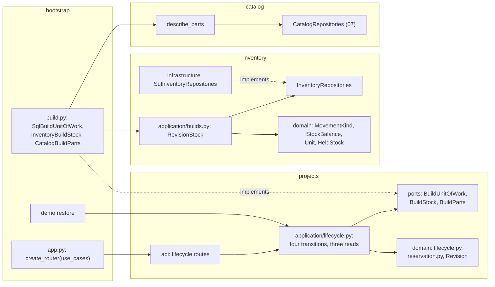
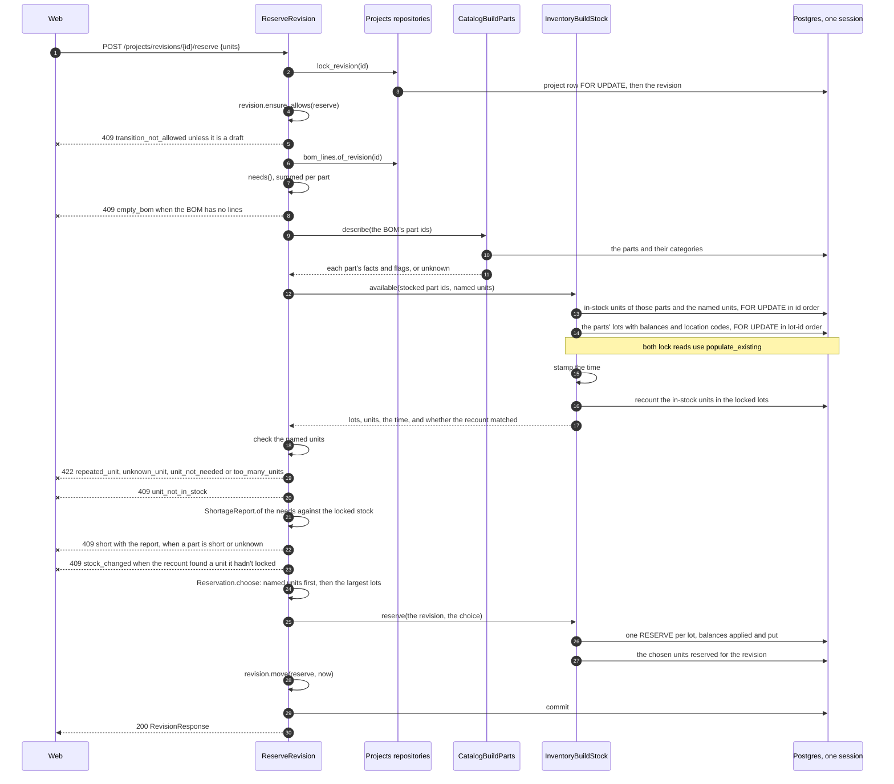
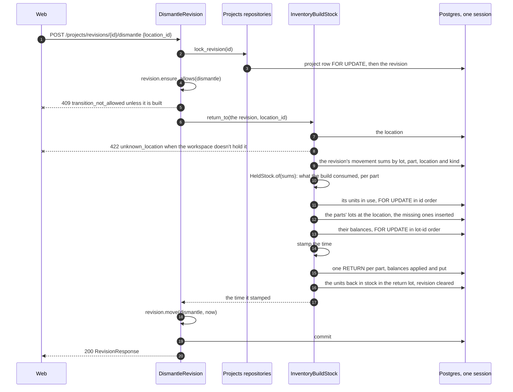

# Design Document: build lifecycle

## Overview

The last of three specs in `v0.5.0` Projects & BOM. It delivers the phase's roadmap line *Build
lifecycle: reserve, cancel, build, dismantle, each with its ledger effect* and the README's
promise that *moving a revision to Reserved reserves stock, Built consumes it, and Dismantled
returns it*. It builds [ADR 0003](../../../docs/adr/0003-project-revisions.md)'s state machine,
`Draft → Reserved → Built → Dismantled` with `Reserved → Draft` on cancel, over the status column
[08-projects-and-revisions](../08-projects-and-revisions/design.md) stored from its first
migration; it gives [ADR 0002](../../../docs/adr/0002-stock-ledger.md)'s ledger the four kinds it
has carried unused since `v0.4.0`, `RESERVE`, `RELEASE`, `CONSUME` and `RETURN`, each naming its
revision; and it reserves what [09-bill-of-materials](../09-bill-of-materials/design.md)'s BOMs
list, skipping 09's consumables. Boards tracked as units
([06-tracked-units](../06-tracked-units/design.md)) are set aside and built in one by one, so a
unit learns which revision it went into. The demo bench opens with a reserved sample build, and
the spec closes the phase with the documentation commit that carries `Release-As: 0.5.0`.

Five things carry the design. Where a revision's holdings live: in the ledger, with no table of
their own (decision 1). Which lots and units a reservation takes (decision 2). Why reserved stock
can't be recounted or moved away, so a build never fails halfway (decision 3). How one
transaction spans projects, catalog and inventory while projects imports neither (decision 8).
And the lock order that lets transitions, BOM writes and stock writes run side by side without
deadlocks or lost updates (decisions 10 and 12).

**Owner decisions that bind this spec**, and what each does here:

- **A BOM line names exactly one part definition; no substitutes before 1.0** (2026-09-27,
  docs/architecture.md §10 question 2). A reservation takes one part per line, summed per part as
  09's `BillOfMaterials.needs()` sums them; nothing looks for an equivalent part when one is short.
- **Consumables, the parts whose category resolves not stocked, are never reserved, consumed or
  returned, and never short** (2026-09-27, built by 09). Decision 16.
- **Every microcontroller board is a unit** (2026-09-26, 05 and 06). Why a reservation takes
  units one by one and a unit gains the reserved and in-use statuses (decisions 2 and 5).
- **One PR per spec with auto-merge; the release PR waits for the phase's last spec, and only the
  owner merges it**, which deploys to production (2026-09-27). This is that last spec: its closing
  task carries the `Release-As: 0.5.0` footer, and the release PR that follows is the owner's.
- **A change history waits for `v0.8.0`** (2026-09-26, 05). A transition moves its revision's last
  change and writes its stock effect to the ledger, and logs nothing else; 16 reads both.

**Decisions this spec makes (2026-09-27), for the owner to check.** Where the repository doesn't
settle something, it is decided here, with the reason:

1. **Holdings come from the ledger; there is no reservations table.** A revision's reservation on
   a lot is the sum of its `RESERVE`, `RELEASE` and `CONSUME` changes on that lot; its consumption
   of a part is minus the sum of its `CONSUME` and `RETURN` changes on the part's lots.
   `stock_movements.revision_id` has been there since 05, so the ledger already holds everything a
   second store would copy, and a copy would have to stay in step with every transition and with
   `wiredex stock rebuild`. The fold is domain code, `HeldStock.of(sums)`; SQL only groups a
   revision's rows by lot, part, location and kind, over a new partial index
   `(workspace_id, revision_id) WHERE revision_id IS NOT NULL`. A revision has a few rows per lot,
   so the read is one small query (requirements 8.5, 8.6, 10.6).
2. **A reservation takes named units first, then the largest lots.** For each part, the units the
   owner named are taken from their own lots. The rest of the need comes from the part's lots
   ordered by the available stock the named units left, most first, ties by location code; taking
   the largest first draws on the fewest lots any choice could (requirement 2.5). Within a lot,
   its in-stock units go first, in code order, one per piece, then loose pieces (requirements 3.1
   to 3.3), and no lot gives more than its available stock. One `RESERVE` per lot carries the
   lot's whole share (requirement 14.3).
3. **Reserved stock is a hard hold.** A recount below a lot's reserved quantity is refused naming
   how many are reserved, and a move out of a lot is checked against its available stock, not its
   on hand (requirements 7.1, 7.2). Both raise a new `ReservedStockError(ReservationError)`, and
   `ReservationError` joins inventory's error table as a 409; today it isn't there and answers
   422. So a build always succeeds and consumes exactly what was reserved, lot by lot (requirement
   5.2). The owner who needs the parts elsewhere cancels the reservation first; a soft hold that
   let a recount eat into it would leave the build to fail halfway, which requirement 7 rules out.
4. **Dismantling returns everything to one location the owner picks.** One `RETURN` per part goes
   into the part's lot at that location, created when absent, and the returned units move into
   that lot (requirement 6.2). A breadboard pulled apart lands in one tray; a per-part form would
   ask for places nobody knows yet, and moving parts on afterwards is 05's move.
5. **Units gain two statuses and a revision.** A unit is `in_stock`, `reserved`, `in_use` or
   `retired`, and a new nullable bare `units.revision_id` is set exactly while it is reserved or
   in use, which a CHECK holds. The domain gains `Unit.reserve_for`, `release`, `build`,
   `return_to`, `ensure_movable` and `ensure_deletable`; retiring a held unit is refused, and
   un-retiring acts only on a retired unit, which fixes `UnretireUnit` putting any unit that isn't
   in stock back in stock. A refusal is a `UnitHeldError`, 409, whose message says whether
   cancelling the reservation or dismantling the build frees it (requirement 3.8); relabelling
   works in every status. A unit in use keeps its old `lot_id` (the column is NOT NULL, RESTRICT)
   but answers `location: null` and its revision instead: it sits on a board, not in the drawer.
   The invariant, for every lot whose stock came in as units: on hand is its in-stock plus
   reserved units, and reserved is its reserved units (requirement 3.9). It replaces 06's
   *on hand equals in-stock units*: 06's `Units.in_stock_at(lot_id)` keeps counting in-stock
   units only, the invariant's checks (06's property 1, the fakes' and the integration tests')
   add the lot's reserved units to it, and a location's unit list (`Units.of_location`) leaves
   units in use out, since they answer no location.
6. **Migration `0018` only expands** (requirement 14.2): it widens `ck_units_status`, adds
   `units.revision_id`, two CHECKs on `stock_movements` and two partial indexes, all satisfied by
   every row the previous release writes (Data Models). Its downgrade first turns reserved units
   back to in stock and built ones to retired, clearing `revision_id`, so the old CHECK holds. One
   caveat goes in the runbook: the previous release's `wiredex stock rebuild` folds every kind into
   on hand, so after a rollback it must not run against a ledger holding the new kinds. A second
   one: the previous release's `UnitStatus` has two members, so once any unit is reserved or in use
   (the nightly demo reset reserves one in every bench, decision 9) that release fails reading it.
   A deploy that never gets ready rolls back before any of that is written; a later, manual
   rollback past `0.5.0` first cancels or dismantles what holds units, or runs 0018's downgrade by
   hand, since deploys never downgrade (deploy/README.md).
7. **Reserved and built revisions can't be deleted; dismantled ones now can.** A revision that
   holds stock is refused with 409 saying what to do first, and so is its project (requirements
   9.1, 9.3). A dismantled revision holds nothing, and its movements outlive it, since
   `revision_id` is a bare uuid (requirement 9.2). **This widens 08's requirements 1.8 and 5.3,
   which let only drafts be deleted; the owner should confirm.** Any status forks, and the fork is
   a draft holding nothing: holdings are read by revision id, and the fork's id has no movements
   (requirement 9.4).
8. **A transition is one transaction on one session.** Projects declares two ports: `BuildStock`
   (`available(part_ids, named)`, which locks, then `reserve`, `release`, `consume`, `return_to`,
   `holdings`, `holdings_of_part` and `units_of`) and `BuildParts` (`describe`), which
   `BuildUnitOfWork(BomUnitOfWork)`, 09's unit of work with its `bom_lines`, exposes as `stock`
   and `parts`. `bootstrap/build.py`
   binds them, the second use of 07's shared-session pattern: `SqlBuildUnitOfWork(
   SqlProjectsUnitOfWork)`; `InventoryBuildStock`, which translates ids and errors and keeps the
   locked hold for its transaction; and `CatalogBuildParts`, over `describe_parts(work:
   CatalogRepositories, ids)`, extracted from 09's `DescribeParts`. Inventory gains a
   repositories-only `InventoryRepositories` protocol with `SqlInventoryRepositories(session,
   workspace_id)`, and `inventory/application/builds.py`'s `RevisionStock(work, clock, ids)`, which
   never commits. 09's reads could each take a transaction of their own; a reserve can't, because
   it writes what it read. And one session holds one connection, which matters on a pool of 5
   plus 5 overflow (requirements 1.3, 11.1, 14.1).
9. **The demo reserves its greenhouse through the use case.** The sample *Greenhouse controller*
   revision `A` is reserved by `ReserveRevision` with no named units, so the automatic choice takes
   WX-U-0001, three 10k from Drawer 3 and one 100n from the Parts box, and both *Weather station*
   revisions then report the ESP32 short (requirement 12). Going through the use case means the
   demo can't show a reservation the product couldn't make.
10. **One lock order for everything that touches stock.** The project row first (09's
    `lock_revision`), then units by id, then balances by lot id, then the timestamp, then, for a
    reserve only, a recount of the in-stock units in the lots it locked. Every lock read uses
    `populate_existing`, so a row already in the session's identity map is refreshed with what the
    lock saw. 06's writers already lock a unit before its balance, and `MoveStock.perform`, which
    `MoveUnit` calls, already takes its two balances in lot-id order, so no two writers wait on
    each other in a circle (requirements 1.5, 2.8). What is new is keeping that order in every new
    lock read.
11. **The state machine is a table.** `projects/domain/lifecycle.py` holds `Transition` (reserve,
    cancel, build, dismantle), the `LIFECYCLE` rows, `step_for` and `transitions_from`;
    `Revision.ensure_allows(transition)` and `Revision.move(transition, now)` use them, and
    `RevisionStatus` gains `holds_stock` and `deletable`. This is docs/architecture.md §5's State
    pattern in its data form: four states whose only behaviour is which moves they allow would be
    four classes answering one question, and the table answers it in one place a property can
    enumerate. Each transition's stock effect is its own use case: `ReserveRevision`,
    `CancelReservation`, `BuildRevision` and `DismantleRevision`.
12. **A reserve refuses before it writes, in a fixed order.** 404 for a revision the workspace
    doesn't hold; 409 when the status doesn't allow it; 409 for an empty BOM; then the part facts
    and the lock; then the named units: repeated, unknown (another workspace's included), without
    a stocked need (a consumable's unit included, per requirement 2.7), and more than a part's
    need, each 422 naming the unit; then 409 for a named unit not in stock; then 409 with 09's
    shortage report; and last 409 `stock_changed` when the recount after the balance lock found an
    in-stock unit it hadn't locked, a `ReceiveUnits` committed between the two locks. Nothing
    retries that one: on a single-owner system the owner presses the button again.
13. **Seven routes.** `POST /projects/revisions/{id}/reserve` (body `{units: [uuid]}`, at most 100),
    `/cancel`, `/build` and `/dismantle` (body `{location_id}`) answer 08's `RevisionResponse`.
    `GET /projects/revisions/{id}/lifecycle` answers `LifecycleResponse`: the status, the
    transitions it allows, whether it can be deleted (its status allows it and its project has
    other revisions), and each part it holds with its facts, its reservation per location, its
    consumption and its units. `GET /projects/revisions/{id}` answers `RevisionRefResponse`, a
    revision found by id alone (requirement 10.2), and `GET /projects/parts/{part_id}/holdings`
    answers `PartHoldingResponse[]` (requirement 10.4).
14. **A refusal says what broke, in a code the web translates.** `LifecycleRefusalResponse`
    carries `message`, `code`, `transition`, `status`, `unit_id`, `unit_code` and `report` (09's
    `ShortageReportResponse`), and is declared on the four transitions' 409 and 422. The codes:
    `transition_not_allowed`, `empty_bom`, `short`, `unknown_unit`, `repeated_unit`,
    `unit_not_needed`, `too_many_units`, `unit_not_in_stock`, `unknown_location` and
    `stock_changed` (requirement 13.13).
15. **The movement rules live in the domain.** `MovementKind` gains `moves_on_hand`,
    `moves_reserved`, `names_a_revision` and a sign check; `StockBalance.apply` moves each count by
    them; `StockMovement.__post_init__` refuses a row the database's CHECKs would refuse, so a bug
    fails in a unit test rather than at the commit; and inventory gains its own `RevisionId`.
    `RetireUnit` and `UnretireUnit` now build their `ADJUST`, and read the clock, after the balance
    lock, as every transition does, so the ledger's `(created_at, id)` order is the order the
    balances changed and a rebuild folds the rows through the same states (requirement 8.4).
16. **Flags are read once, at the reserve.** A consumable is never reserved; once a revision is
    reserved, cancelling, building and dismantling follow what the ledger says it holds, whatever
    the category flags say now (requirement 5.3). A `RETURN` isn't a receipt, so 09's refusal of
    new stock for a consumable doesn't apply, and a part that became not stocked after the build
    still comes back.
17. **`SqlBalanceSheet.put` decides insert or update from the version it writes.** Version 1 is a
    lot's first write and inserts; a later version updates where the stored version is one less,
    and a miss is the `ConcurrentStockError` it is today. That drops the SELECT `put` runs per lot,
    so a transition's reads stay fixed whatever the number of lots (requirement 14.3).
18. **The web's lifecycle lives in `features/projects/build/`**: `lifecycle.ts`, `transitions.ts`,
    `LifecycleActions`, `ReserveDialog` (a checkbox per in-stock unit, at most the part's need,
    none checked meaning automatic), an in-place `ConfirmTransition`, `DismantleDialog` (07's
    `LocationPicker`), `HoldingsSection`, `PartHoldings` and `RevisionLink` (`useRevisionRef`). A
    transition refreshes the project, BOM, lifecycle, inventory and catalog query roots; every
    stock view shows on hand, reserved and available; units show reserved and in use with a link
    to their revision.
19. **No new ADR**: ADRs 0002 and 0003 already decided the ledger kinds and the lifecycle, and the
    closing task records how they were built; `0014` stays free. **Requirement 8.6 is reworded**
    from "reservations summing to its stocked needs" to "reservations summing to the stocked needs
    it was reserved for": read literally, the old wording contradicted requirement 5.3 when a
    category flag changes after the reserve, since the part's stocked need then differs from what
    the ledger holds.

**Seen while designing, not changed here:**

- 06's gap: a part that stops being tracked after its units were received can have a lot move or
  recount leave those units behind, so the lot's count and its units disagree. This spec states
  its invariant for lots whose stock came in as units, takes units only up to a lot's available
  stock, and refuses a named unit its lot's count can't cover as not in stock.
- 05's design said a stale balance write retries three times; the code has no retry, and
  `ConcurrentStockError` answers 409. Under `FOR UPDATE` only two first writes to one lot can race,
  so it stays.
- `LocateUnits` reads each lot and location one at a time. The lifecycle read doesn't use it: it
  joins units to their lots and locations in one query.
- `0011_append_only_ledger`'s docstring says deleting a lot cascades to its movements; the key is
  RESTRICT, and the migration is `REVOKE UPDATE ON stock_movements FROM wiredex_app`, not a
  trigger, with DELETE kept for the demo reset. The closing docs state the rule as it is; the
  applied migration is left alone.

**In scope:** the lifecycle table and its four transitions, as use cases and routes; the four
ledger kinds, their balance effects, their CHECKs and a rebuild over all seven; the choice of lots
and units, named units included; the reserved and in-use unit statuses and `units.revision_id`; the
hard hold on recounts and moves; the lifecycle, revision and part-holdings reads, and reserved and
available wherever stock is answered; deleting and forking revisions that hold stock; the demo's
reservation; the web's actions, dialogs, holdings and stock columns; the E2E journey of
docs/architecture.md §8; and the phase's closing documentation.

**Out of scope:** substitutes (owner, before 1.0); reserving part of a BOM, or reserving with
shortages; building or dismantling part of a revision, or returning parts to more than one
location; editing a reserved revision's BOM (cancel or fork first, 09's lock); retrying
`stock_changed` or `ConcurrentStockError`; reserving or counting consumables; the netlist (11), the
flash log (15), the change history (17) and the dashboard (18), which read the seams at the end.

## Architecture



Arrows point the way imports go. Projects imports nothing of inventory or catalog, and
`RevisionStock` imports only inventory (requirement 14.1). `bootstrap/build.py` is the one place
that sees all three, and every repository it binds shares the session `SqlProjectsUnitOfWork`
opened, under the workspace setting that unit of work applied, so row-level security scopes every
read and write of a transition (requirement 11.1).

### A reserve



Each crossed arrow is a refusal, and this is the order of decisions 10 and 12. Every refusal comes
before the first write, so a refused reserve has nothing to undo: the use case raises before
`commit()`, and the status, the movements, the balances and the units stay as they were
(requirements 1.4, 2.2, 3.4, 3.5); the 404 comes first, from `lock_revision`. The facts come before
the lock because only stocked parts' stock is locked, and the named units are checked after it
because a unit's status only holds once it is locked. Units are locked before balances because
06's writers already lock a unit before its balance, and one order for every writer means none
waits on another in a circle; balances go in lot-id order for the same reason. The balance lock is
what makes the second of two reserves on the same stock see what the first left (requirement 2.8),
and the clock is read after it, so the ledger's order is the order the balances changed. Units
first leaves one window: a `ReceiveUnits`, or any write that puts a unit in stock in one of those
lots, can commit between the two locks, and the balance lock then counts pieces whose units the
unit lock never saw. Reserving them as loose pieces would break decision 5's invariant, so the
recount refuses the reserve as `stock_changed`. It is checked last because it is the one refusal a
second try clears: the others would come back, so the owner hears them first.

### A dismantle



The location is checked first, so its 422 comes before any lock or write (requirement 6.1). Cancel
and build run the same steps with `release` and `consume`, and no location: the revision's sums,
folded by `HeldStock.of`, give what it reserves in each lot; its reserved units are locked by id
and those lots' balances by lot id; the time is stamped; and each lot gets one row of the whole
quantity reserved there (requirements 4.1, 5.1). None of the three reads the catalog: each follows
what the ledger says the revision holds, whatever the category flags say now (decision 16,
requirement 5.3). And once the status allows a cancel or a build, the stock can't refuse it:
decision 3's hard hold keeps every reserved piece on hand, so a build consumes exactly what was
reserved, lot by lot (requirement 5.2).

| Transition | From → to | Ledger rows | Balance effect | Units |
| --- | --- | --- | --- | --- |
| reserve | draft → reserved | one `RESERVE` per lot | reserved + | reserved, linked |
| cancel | reserved → draft | one `RELEASE` per lot, of the whole reservation | reserved − | in stock, link cleared |
| build | reserved → built | one `CONSUME` per lot | on hand − and reserved − | built, link kept |
| dismantle | built → dismantled | one `RETURN` per part, at the chosen location | on hand + | in stock in the return lot, link cleared |

The rows are requirements 2.4 to 2.6 and 3.1 (reserve), 4.1, 4.2 and 3.7 (cancel), 5.1 and 3.6
(build), and 6.2, 6.3 and 3.7 (dismantle).

## Components and Interfaces

### Inventory: movements and balances

Inventory gains `RevisionId`, its own name for a revision's uuid, declared like its other ids, so
its domain never imports projects' (decision 15). `StockMovement.revision_id`, the column 05
created, is typed `RevisionId | None`. `MovementKind` keeps its seven members and learns what each
one moves:

```python
class MovementKind:  # 05's enum; its seven members stay as they are
    @property
    def moves_on_hand(self) -> bool:
        """RECEIVE, ADJUST, MOVE, CONSUME and RETURN (requirement 8.3)."""

    @property
    def moves_reserved(self) -> bool:
        """RESERVE, RELEASE and CONSUME (requirement 8.3)."""

    @property
    def names_a_revision(self) -> bool:
        """RESERVE, RELEASE, CONSUME and RETURN must name one; the other three must not (8.1)."""

    def sign_allows(self, change: int) -> bool:
        """> 0 for RESERVE and RETURN, < 0 for RELEASE and CONSUME, others as today (8.2)."""


class StockMovement:  # 05's dataclass
    def __post_init__(self) -> None:
        """Refuse what 0018's two CHECKs refuse: a revision on the wrong kind, a wrong sign."""


class StockBalance:  # 05's
    def apply(self, movement: StockMovement) -> StockBalance:
        """The balance after the movement, each count moved by its kind, one version on."""


class ReservedStockError(ReservationError):
    """On hand would drop below what builds reserve; reserved says how many (7.1, 7.2)."""

    reserved: int
```

`__post_init__` raises `ValueError`: only a bug builds such a movement, so it fails in a unit test
rather than at the commit, and no route answers it. `apply` moves each count by the movement's
kind (requirements 2.6, 7.3, 8.3):

| Kind | On hand | Reserved |
| --- | --- | --- |
| `RECEIVE`, `ADJUST`, `MOVE`, `RETURN` | by the change | as it was |
| `RESERVE`, `RELEASE` | as it was | by the change |
| `CONSUME` | by the change | by the change |

It still raises `NegativeStockError` when on hand would go below zero with nothing reserved, and
`ReservationError` when reserved would leave 0 ≤ reserved ≤ on hand (requirement 7.4). When an
on-hand kind would take on hand below what is reserved, the error is `ReservedStockError`, whose
message says how many are reserved (requirements 7.1, 7.2). Inventory's router adds
`ReservationError` to its error table as 409, which covers the subclass; today it isn't there and
answers 422 (decision 3). `wiredex stock rebuild` folds each lot's movements through `apply`, in
the ledger's `(created_at, id)` order, so it rebuilds reserved as well as on hand (requirement
8.4). 05's rule that *the sum of a lot's changes is its on hand* becomes a rule per count: on hand
is the sum of the changes of the kinds that move it, and reserved the sum of those that move
reserved; 05's balance properties in `tests/inventory/test_balances.py` are restated that way.

### Inventory: units in builds

`UnitStatus` gains two members, and `Unit` a revision and six methods (decision 5):

```python
class UnitStatus:  # 06's enum
    IN_STOCK = "in_stock"
    RESERVED = "reserved"  # new
    IN_USE = "in_use"  # new: built into a revision
    RETIRED = "retired"


class Unit:  # 06's entity, plus:
    revision_id: RevisionId | None  # set exactly while reserved or in use, as 0018's CHECK holds

    def reserve_for(self, revision_id: RevisionId) -> None:
        """In stock to reserved, linked to the revision (requirement 3.1)."""

    def release(self) -> None:
        """Reserved to in stock, link cleared (requirement 3.7)."""

    def build(self) -> None:
        """Reserved to built, link kept; lot_id stays, the location answers null (3.6)."""

    def return_to(self, lot_id: StockLotId) -> None:
        """Built to in stock in the return lot, link cleared (requirement 3.7)."""

    def ensure_movable(self) -> None:
        """UnitHeldError when reserved or in use (requirement 3.8)."""

    def ensure_deletable(self) -> None:
        """UnitHeldError when reserved or in use (requirement 3.8)."""
```

The four moves each act on one status and raise `ValueError` on any other: `RevisionStock` reaches
them only with units it locked in that status, so another is a bug, not a refusal. Retiring now
refuses a reserved or in-use unit with `UnitHeldError`, and un-retiring acts only on a retired one,
so `UnretireUnit` no longer puts a held unit back in stock; `ensure_movable` guards `MoveUnit`, and
`ensure_deletable` 06's unit delete. Relabelling works in every status. Every unit read answers
`revision_id`, and a unit in use answers `location: null` (requirement 3.10).

`UnitHeldError` answers 409 from inventory's error table. Its message names the unit's code and
what frees it: cancelling the reservation for a reserved unit, dismantling the build for a built
one (requirement 3.8).

For every lot whose stock came in as units, on hand is its in-stock plus reserved units, and
reserved is its reserved units (requirement 3.9). Every writer keeps that by changing a lot's
counts and its units together: a receipt adds n units and n pieces; a reserve marks one in-stock
unit per piece it takes; a release and a build change exactly the units whose pieces they release
or consume; a return puts the units in use into the return lot with their pieces; and retire,
un-retire and a unit move each change one unit and one piece. Under the invariant a lot's
available stock is its in-stock units, so taking units first (decision 2) reserves only units from
such a lot.

### Inventory: holdings and the revision's stock

`inventory/domain/holdings.py` folds a revision's movements into what it holds (decision 1):

```python
@dataclass(frozen=True)
class MovementSum:
    """One revision's changes of one kind on one lot, summed by the database."""

    lot_id: StockLotId
    part_id: PartId
    location_id: LocationId
    location_code: str
    kind: MovementKind
    change: int


@dataclass(frozen=True)
class LotHolding:
    lot_id: StockLotId
    part_id: PartId
    location_id: LocationId
    location_code: str
    quantity: int


@dataclass(frozen=True)
class HeldStock:
    """What one revision holds: per lot what it reserves, per part what its build consumed."""

    reserved: tuple[LotHolding, ...]
    consumed: Mapping[PartId, int]

    @classmethod
    def of(cls, sums: Iterable[MovementSum]) -> HeldStock:
        """RESERVE + RELEASE + CONSUME per lot; minus CONSUME + RETURN per part; zeros dropped."""
```

`HeldStock.of` reads no status: a draft or dismantled revision holds nothing because its rows sum
to zero (requirements 8.5, 8.6).

`InventoryRepositories` is a protocol of the repositories inventory's unit of work exposes, with
no commit, as 07's `CatalogRepositories` is for catalog. `SqlInventoryRepositories(session,
workspace_id)` builds them on a session another unit of work opened and set the workspace on; the
`workspace_id` stamps the rows it inserts (decision 8, requirement 11.1).

`inventory/application/builds.py` holds `RevisionStock(work, clock, ids)`: an
`InventoryRepositories`, and the clock and id source inventory's use cases take. It never
commits; the projects unit of work does.

```python
class RevisionStock:
    async def available(
        self, part_ids: Collection[PartId], named: Collection[UnitId]
    ) -> LockedStock:
        """Lock the parts' in-stock units and the named ones, then their lots; stamp; recount."""

    async def reserve(
        self, stock: LockedStock, revision_id: RevisionId, takes: Sequence[LotTake]
    ) -> None:
        """One RESERVE per lot taken, its balance applied and put, its units reserved."""

    async def release(self, revision_id: RevisionId) -> datetime:
        """One RELEASE per lot of the whole reservation, the units back in stock."""

    async def consume(self, revision_id: RevisionId) -> datetime:
        """One CONSUME per lot of the whole reservation, the units built."""

    async def return_to(self, revision_id: RevisionId, location_id: LocationId) -> datetime:
        """One RETURN per consumed part into its lot at the location, the units in stock there."""

    async def holdings(self, revision_id: RevisionId) -> HeldStock:
        """HeldStock.of the revision's sums, in one query."""

    async def holdings_of_part(self, part_id: PartId) -> list[PartHolding]:
        """Each revision holding some of the part, folded the same way (requirement 10.4)."""

    async def units_of(self, revision_id: RevisionId) -> list[RevisionUnit]:
        """Units.of_revision (requirement 3.11)."""


@dataclass(frozen=True)
class LockedStock:
    """What available() locked; InventoryBuildStock keeps it for reserve() (decision 8)."""

    lots: tuple[LockedLot, ...]  # lot, part, location code and balance, in lot-id order
    units: tuple[Unit, ...]  # the parts' in-stock units, in id order
    named: Mapping[UnitId, Unit]  # the named units the workspace holds, in any status
    now: datetime  # stamped after the balance lock
    changed: bool  # the recount found an in-stock unit the unit lock missed


@dataclass(frozen=True)
class LotTake:
    lot_id: StockLotId
    quantity: int
    unit_ids: tuple[UnitId, ...]  # one per piece, up to quantity


@dataclass(frozen=True)
class PartHolding:
    revision_id: RevisionId
    reserved: int
    consumed: int


@dataclass(frozen=True)
class RevisionUnit:
    unit_id: UnitId
    code: str
    part_id: PartId
    status: UnitStatus
    location_code: str | None  # None while built
```

The three writes other than `reserve` return the time they stamped after the balance lock, which
the use case passes to `revision.move`; a reserve's is `LockedStock.now`. `return_to` refuses a
location the workspace doesn't hold as inventory's other writes do, and `InventoryBuildStock`
turns that into `unknown_location`.

New repository queries, each one statement whatever the number of rows (requirements 10.6, 14.3):

- `Units.of_revision(revision_id)`: the units reserved for or built into it, joined to their lots
  and locations (requirement 3.11).
- The ledger's `sums_of_revision(revision_id)`: the revision's changes grouped by lot, part,
  location and kind, over the partial index `(workspace_id, revision_id) WHERE revision_id IS NOT
  NULL`; `sums_of_part(part_id)` groups one part's lots the same way, by revision too.
- Locks: `Units.lock(...)` takes the parts' in-stock units, units by id, or a revision's units, in
  id order; `BalanceSheet.lock(...)` takes balances by lot id or by part, in lot-id order, with
  their lots' parts and location codes; `Lots.at(location_id, part_ids)` finds the return lots.
  Every lock read is `FOR UPDATE` with `populate_existing` (decision 10).

### Inventory: existing use cases that change

- `AdjustStock`: a count below the lot's reserved quantity is refused with `ReservedStockError`
  from `apply`, 409, saying how many are reserved, and nothing is written (requirement 7.1).
- `MoveStock.perform`: the quantity is checked against the source lot's available stock, not its
  on hand, so moving reserved pieces raises `ReservedStockError` (requirement 7.2), and what
  arrives adds to the target's available stock (requirement 7.3). It already locks its two
  balances in lot-id order, whichever lot is the source (decision 10), and keeps doing so.
- `MoveUnit`: `ensure_movable` refuses a reserved or in-use unit with `UnitHeldError` (requirement
  3.8); its two balances are locked by `MoveStock.perform`, in lot-id order.
- `DeleteUnit`: 06 already refuses any unit that isn't retired (`UnitNotRetiredError`, 409);
  `ensure_deletable` runs first, so a reserved or in-use unit gets `UnitHeldError`'s message saying
  what frees it instead.
- `RetireUnit` and `UnretireUnit`: retiring a held unit is refused, and un-retiring acts only on a
  retired unit. Both build their `ADJUST`, and read the clock, after the balance lock, so the
  ledger's `(created_at, id)` order is the order the balances changed (decision 15, requirement
  8.4).
- Stock reads: `PartStockView`, `LotBalance` and `BalanceSheet.by_part` carry `reserved` and
  `available` beside `on_hand`, per location and in total (requirement 10.3). Available is on hand
  less reserved, computed, never stored.
- `SqlBalanceSheet.put(balance)`: version 1 inserts; a later version updates where the stored
  version is one less. A first write that finds the row already there, or an update that matches
  nothing, is the `ConcurrentStockError` it is today, and no SELECT runs first, so a transition's
  reads stay fixed however many lots it touches (decision 17, requirement 14.3).

### Catalog

`describe_parts(work: CatalogRepositories, ids)` is the body of 09's `DescribeParts`, taken out so
it can run on a session another unit of work owns. It answers what `DescribeParts` answers today,
each part's facts and its resolved category flags, in the same queries, and a part it doesn't find
is 09's unknown part. `DescribeParts` opens its unit of work and calls it, so 09's reads and their
tests don't change; `CatalogBuildParts` calls it over the `CatalogRepositories` bound to the
transition's session (decision 8).

### Projects: the lifecycle

`projects/domain/lifecycle.py` is decision 11's table and the two lookups over it:

```python
class Transition(StrEnum):
    RESERVE = "reserve"
    CANCEL = "cancel"
    BUILD = "build"
    DISMANTLE = "dismantle"


@dataclass(frozen=True)
class Step:
    source: RevisionStatus
    transition: Transition
    target: RevisionStatus


LIFECYCLE: tuple[Step, ...] = (
    Step(RevisionStatus.DRAFT, Transition.RESERVE, RevisionStatus.RESERVED),
    Step(RevisionStatus.RESERVED, Transition.CANCEL, RevisionStatus.DRAFT),
    Step(RevisionStatus.RESERVED, Transition.BUILD, RevisionStatus.BUILT),
    Step(RevisionStatus.BUILT, Transition.DISMANTLE, RevisionStatus.DISMANTLED),
)


def step_for(status: RevisionStatus, transition: Transition) -> Step | None:
    """The row leaving status by transition, or None when the table has none (1.1)."""


def transitions_from(status: RevisionStatus) -> tuple[Transition, ...]:
    """The transitions the table allows from status, in its order (10.1, 13.1)."""
```

08's `Revision` and `RevisionStatus` use it:

```python
class Revision:  # 08's entity, plus:
    def ensure_allows(self, transition: Transition) -> None:
        """TransitionNotAllowedError when no row leaves the status by it (1.2)."""

    def move(self, transition: Transition, now: datetime) -> None:
        """Status to the row's target and updated_at to now, checked as ensure_allows (1.3)."""


class RevisionStatus:  # 08's enum, plus:
    @property
    def holds_stock(self) -> bool:
        """Reserved and built: a revision in them holds stock (decision 7)."""

    @property
    def deletable(self) -> bool:
        """Draft and dismantled: a revision in them can be deleted (9.1, 9.2)."""
```

| From | Transition | To | Use case |
| --- | --- | --- | --- |
| draft | reserve | reserved | `ReserveRevision` |
| reserved | cancel | draft | `CancelReservation` |
| reserved | build | built | `BuildRevision` |
| built | dismantle | dismantled | `DismantleRevision` |

No row leaves dismantled, so a dismantled revision stays dismantled and a new build of it starts
from a fork (requirement 1.6). `ensure_allows` is each transition's first check after the lock,
before any stock is read, and its refusal names the status and the transition, in its message and
in its fields (requirement 1.2). `move` finds the same row, so no use case can move a revision the
table refuses, and it stamps `updated_at` with the time the stock write stamped, so the revision's
last change and its movements carry one instant (requirement 1.3). Over the four statuses
`deletable` is `not holds_stock`; the deletes refuse on `holds_stock` and the lifecycle read
answers `deletable`, so a status added later has to answer both.

The table is docs/architecture.md §5's State pattern in its data form (decision 11). Four state
classes would each answer one question, which moves they allow, while what differs between the
transitions, the stock effect, needs the ports and lives in the use cases either way. The table
answers the question in one place, and a Hypothesis property can walk every status and transition
against it (requirement 14.6).

### Projects: choosing what a reservation takes

`projects/domain/reservation.py` holds the stock a reserve locked, in projects' own types, and the
two decisions made over it: which named units a reserve accepts, and what it takes. Projects names
the ids it only passes along, `LotId`, `UnitId` and `LocationId`, as its own, declared beside its
other ids as inventory declares `RevisionId` (decision 15), so neither module imports the other's.

```python
@dataclass(frozen=True)
class ReservableLot:
    lot_id: LotId
    part_id: PartId
    location_code: str
    available: int  # on hand less reserved, as the balance lock saw it


@dataclass(frozen=True)
class StockUnit:
    unit_id: UnitId
    code: str
    part_id: PartId
    lot_id: LotId
    in_stock: bool  # False when reserved, built or retired


@dataclass(frozen=True)
class ReservableStock:
    """LockedStock in projects' terms: what BuildStock.available locked for this reserve."""

    lots: tuple[ReservableLot, ...]  # the stocked parts' lots, in lot-id order
    units: tuple[StockUnit, ...]  # their in-stock units, in id order
    named: Mapping[UnitId, StockUnit]  # the named units the workspace holds, in any status
    now: datetime  # stamped after the balance lock: the reserve's time
    changed: bool  # the recount found an in-stock unit the unit lock missed

    def free(self) -> Mapping[PartId, int]:
        """Each part's available summed over its locked lots, the report's free stock (2.1)."""


@dataclass(frozen=True)
class LotPick:
    lot_id: LotId
    quantity: int
    unit_ids: tuple[UnitId, ...]  # one per piece, up to quantity; the rest are loose pieces


@dataclass(frozen=True)
class Reservation:
    picks: tuple[LotPick, ...]  # one per lot taken from, in lot-id order

    @classmethod
    def choose(
        cls, needs: Mapping[PartId, int], stock: ReservableStock, named: Sequence[UnitId]
    ) -> Reservation:
        """Named units from their lots, the rest from the largest lots first (decision 2)."""


def check_named_units(
    needs: Mapping[PartId, int],
    facts: Mapping[PartId, PartFacts],
    named: Sequence[UnitId],
    stock: ReservableStock,
) -> None:
    """Refuse the first named unit that fails, in decision 12's order."""
```

`check_named_units` runs five checks, each over the units in the order the owner named them; the
first unit that fails a check is the one its refusal names, and no later check runs (requirements
3.4, 3.5):

1. named twice: `RepeatedUnitError`;
2. missing from `stock.named`, which is also how another workspace's unit looks, row-level
   security hiding it (requirement 11.2): `UnknownUnitError`;
3. of a part with no stocked need, a consumable's unit included (requirement 2.7):
   `UnitNotNeededError`;
4. past its part's need, counting in the order named: `TooManyUnitsError`;
5. not in stock, or past what its lot's available stock covers (06's gap, seen while designing):
   `UnitNotInStockError`.

The first four answer 422 and the last 409. All five run after the lock, since a unit's status
only holds once it is locked, and before the shortage report (decision 12).

`Reservation.choose` takes the stocked needs, which the use case keeps from `needs` by the facts,
and works part by part:

- the part's named units come from their own lots, one piece each (requirement 3.2);
- the rest of its need comes from its lots ordered by the available stock the named units left,
  most first, ties by location code, each lot giving at most what it has left (requirement 2.5);
- within a lot, its in-stock units that weren't named go first, in code order, one per piece, then
  loose pieces (requirements 3.1, 3.3);
- a lot's named units, chosen units and loose pieces make one `LotPick`, so one `RESERVE` per lot
  carries its whole share (requirement 14.3).

A part's picks sum to its stocked need (requirement 2.4) and no pick passes its lot's available
stock, so no lot's reserved passes its on hand (requirement 2.8). The checks and the report come
first, so `choose` only meets stock that covers the needs, and raises `ValueError` otherwise: a
bug, not a refusal. It is a pure function of its arguments, so the same stock always gets the same
choice, which the demo relies on (decision 9). With no named units it draws on the fewest lots any
choice could, which a property can check against every set of lots; named units keep their lots,
and the rest follows the same order.

`InventoryBuildStock` does the translating, both ways. `available` turns each `LockedLot` into
the `ReservableLot` of its lot and part, its location code and its balance's on hand less reserved,
and each locked `Unit` into a `StockUnit` whose `in_stock` says its status is `IN_STOCK`; `now` and
`changed` pass through. `reserve` turns each `LotPick` into the `LotTake` of the same lot, quantity
and unit ids, and hands them to `RevisionStock.reserve` with the `LockedStock` it kept from
`available`. An id crosses as the same uuid under the other module's name.

### Projects: errors

A transition's refusals share one base, so projects' router answers each in one shape,
`LifecycleRefusalResponse` (decision 14). They live with projects' other domain errors, since
`Revision.ensure_allows` and `check_named_units` raise them:

```python
class LifecycleRefusal(Exception):
    """A transition refused before it wrote; code is what the web translates (13.13)."""

    code: ClassVar[str]
    transition: Transition
```

One subclass per code, in decision 14's order:

| Class | `code` | Status | Carries | Criteria |
| --- | --- | --- | --- | --- |
| `TransitionNotAllowedError` | `transition_not_allowed` | 409 | the revision's status | 1.2, 1.5 |
| `EmptyBomError` | `empty_bom` | 409 | | 2.3 |
| `ShortError` | `short` | 409 | 09's `ShortageReport` | 2.1, 2.2, 2.8 |
| `UnknownUnitError` | `unknown_unit` | 422 | the unit | 3.4, 11.2 |
| `RepeatedUnitError` | `repeated_unit` | 422 | the unit | 3.4 |
| `UnitNotNeededError` | `unit_not_needed` | 422 | the unit | 2.7, 3.4 |
| `TooManyUnitsError` | `too_many_units` | 422 | the unit | 3.4 |
| `UnitNotInStockError` | `unit_not_in_stock` | 409 | the unit | 3.5 |
| `UnknownLocationError` | `unknown_location` | 422 | | 6.1, 11.2 |
| `StockChangedError` | `stock_changed` | 409 | | decision 12 |

The status comes from projects' error table, as inventory's router maps its errors, so the domain
names no HTTP status. A unit refusal carries the unit's `unit_id` and, when the workspace holds the
unit, its `unit_code`; `TransitionNotAllowedError` carries the revision's `status` beside the
transition; `ShortError` carries the report computed on the locked stock (requirement 2.2). Every
message is plain English naming what broke, *unit WX-U-0004 is named twice*, for API clients and
logs; the web shows its own words for the code (requirement 13.13).

`Revision.ensure_allows` raises the first; `ReserveRevision` raises `EmptyBomError`, `ShortError`,
and `StockChangedError` when `stock.changed` says so; `check_named_units` raises the five unit
refusals; and `InventoryBuildStock` raises `UnknownLocationError` when `return_to` doesn't find the
location, and `StockChangedError` in place of inventory's `ConcurrentStockError`, which only two
first writes to one new return lot can raise and which pressing again clears too.

A delete isn't a transition, so its refusal answers in the shape of 08's other refusals:
`RevisionHoldsStockError` carries the revision's label and status and answers 409 from projects'
error table. It is 08's `RevisionInUseError` renamed, which `Revision.ensure_deletable` and
`ProjectRevisions.ensure_all_deletable` raise and the router's `_STATUS_BY_ERROR` already maps to
409; both now refuse on `status.holds_stock` instead of on anything but a draft. Its message says what comes first: cancelling the reservation for a reserved revision,
dismantling the build for a built one (requirement 9.1). `DeleteProject` raises it for the first of
the project's revisions, by label, that holds stock (requirement 9.3).

### Projects: ports and use cases

Projects' ports gain decision 8's two, over projects' own types, and a unit of work that exposes
them:

```python
class BuildStock(Protocol):
    """Inventory's stock as a transition sees it, on the transition's session (decision 8)."""

    async def available(
        self, part_ids: Collection[PartId], named: Collection[UnitId]
    ) -> ReservableStock:
        """Lock the parts' in-stock units and the named ones, then their lots (decision 10)."""

    async def reserve(self, revision_id: RevisionId, reservation: Reservation) -> None:
        """Write the choice against what available() locked in this transaction."""

    # RevisionStock's own, in projects' types; the three writes answer the time they stamped
    async def release(self, revision_id: RevisionId) -> datetime: ...
    async def consume(self, revision_id: RevisionId) -> datetime: ...
    async def return_to(self, revision_id: RevisionId, location_id: LocationId) -> datetime: ...
    async def holdings(self, revision_id: RevisionId) -> Holdings: ...
    async def holdings_of_part(self, part_id: PartId) -> list[RevisionHolding]: ...
    async def units_of(self, revision_id: RevisionId) -> list[HeldUnit]: ...


class BuildParts(Protocol):
    async def describe(self, part_ids: Collection[PartId]) -> Mapping[PartId, PartFacts]:
        """09's facts and resolved flags on this session; a part it doesn't find is unknown."""


class BuildUnitOfWork(BomUnitOfWork):  # 09's, which adds bom_lines to 08's
    @property
    def stock(self) -> BuildStock: ...

    @property
    def parts(self) -> BuildParts: ...


@dataclass(frozen=True)
class HeldLot:
    part_id: PartId
    location_id: LocationId
    location_code: str
    quantity: int


@dataclass(frozen=True)
class Holdings:
    """HeldStock in projects' terms: per lot what the revision reserves, per part consumed."""

    reserved: tuple[HeldLot, ...]
    consumed: Mapping[PartId, int]


@dataclass(frozen=True)
class RevisionHolding:
    revision_id: RevisionId
    reserved: int
    consumed: int


@dataclass(frozen=True)
class HeldUnit:
    unit_id: UnitId
    code: str
    part_id: PartId
    location_code: str | None  # None while built
```

`InventoryBuildStock` copies `HeldStock`, `PartHolding` and `RevisionUnit` into `Holdings`,
`RevisionHolding` and `HeldUnit` field by field, leaving out the lot id and the unit's status.
`HeldUnit` needs no status: a reserved revision's units are all reserved and a built one's all
built (requirement 3.6), so the revision's status says it.

`projects/application/lifecycle.py` holds the four transitions and the three reads. Each takes
`unit_of_work`, the factory of a `BuildUnitOfWork` for a workspace, as 08's use cases take theirs:

| Use case | Takes | Its stock step | Criteria |
| --- | --- | --- | --- |
| `ReserveRevision` | the revision id, the named unit ids | *A reserve* | 2, 3.1 to 3.5, 12.1 |
| `CancelReservation` | the revision id | `stock.release` | 3.7, 4 |
| `BuildRevision` | the revision id | `stock.consume` | 3.6, 5 |
| `DismantleRevision` | the revision id, a location id | `stock.return_to` | 3.7, 6 |

Each opens one `BuildUnitOfWork`, takes 09's `lock_revision` first, which answers 404 for a
revision the workspace doesn't hold (requirements 1.7, 11.3), calls `revision.ensure_allows`, runs
its stock step, calls `revision.move` with the time the step stamped, and commits once, so the
status, the movements, the balances, the units and the last change land together (requirement
1.3). A refusal raises before the commit and the unit of work rolls the session back, so nothing is
written (requirement 1.4). The project row's lock puts transitions and BOM writes to one project in
a line: a second, identical transition waits, then sees the status the first left and is refused
as not allowed (requirement 1.5).

`ReserveRevision` runs *A reserve*: 09's BOM lines and `needs()`, with `EmptyBomError` when there
are none; `parts.describe` of the needs' parts; `stock.available` of the stocked parts, known and
not consumables, and of the named units; `check_named_units`; 09's `ShortageReport.of` with
`stock.free()` as the free stock, and `ShortError` when a part is short or unknown (requirement
2.1); `StockChangedError` when `stock.changed`; `Reservation.choose`; `stock.reserve`; and
`revision.move(Transition.RESERVE, stock.now)`. A BOM of consumables only locks and writes no
stock and still moves to reserved: a build that takes nothing from the shelves. A revision
cancelled back to draft reserves against the stock as it then stands, since every reserve reads it
afresh (requirement 4.3). `CancelReservation`, `BuildRevision` and `DismantleRevision` read no
catalog: each follows what the ledger says the revision holds (decision 16, requirement 5.3).

The reads lock nothing and answer these:

```python
@dataclass(frozen=True)
class Lifecycle:
    status: RevisionStatus
    transitions: tuple[Transition, ...]  # transitions_from(status)
    deletable: bool  # status.deletable and the project has other revisions (9.2)
    parts: tuple[HeldPart, ...]  # by part name


@dataclass(frozen=True)
class HeldPart:
    part_id: PartId
    facts: PartFacts | None  # None for a part the catalog no longer holds, 09's unknown
    reserved: tuple[HeldLot, ...]  # by location code
    consumed: int
    units: tuple[HeldUnit, ...]  # in code order


@dataclass(frozen=True)
class RevisionRef:
    revision_id: RevisionId
    label: str
    summary: str
    status: RevisionStatus
    project_id: ProjectId
    project_name: str


@dataclass(frozen=True)
class PartHoldingView:
    revision: RevisionRef
    reserved: int
    consumed: int
```

- `GetLifecycle`, by revision id, on a `BuildUnitOfWork`: the revision, 404 when the workspace
  doesn't hold it; whether its project has other revisions; `stock.holdings`; `stock.units_of`;
  and `parts.describe` of the parts it holds. A fixed number of queries, whatever it holds
  (requirements 10.1, 10.6).
- `GetRevisionRef`, by revision id, on 08's unit of work: one query joining the revision to its
  project, 404 as above (requirements 10.2, 11.3).
- `ListPartHoldings`, by part id, on a `BuildUnitOfWork`: `stock.holdings_of_part`, then those
  revisions' refs in one query, ordered by project name and label (requirements 10.4, 10.6). A
  revision that holds stock can't be deleted (decision 7), so each has its ref; a part nothing
  holds answers an empty list.

Projects' revision repository gains `ref(revision_id)` and `refs(revision_ids)` for the last two.

08's `DeleteRevision` and `DeleteProject` change one rule: a revision whose status holds stock is
refused with `RevisionHoldsStockError`, and a draft or a dismantled one is deleted, 08's other
rules standing (requirements 9.1 to 9.3). That widens 08's requirements 1.8 and 5.3, as decision 7
says. Both already decide under the project row's lock: 08's `lock_project`, then the revisions
read fresh by `of_project` (`populate_existing`), so a delete and a transition of one project run
one after the other and the delete sees the status the transition left. A deleted revision's movements stay, since
`revision_id` is a bare uuid (requirement 9.2). The fork is untouched: it makes a draft with a new
id, and holdings are read by revision id, so the fork holds nothing and the source keeps what it
holds (requirement 9.4).

### Bootstrap: one session for three modules

`bootstrap/build.py` binds projects' two ports on the session projects' unit of work opens, the
second use of 07's shared-session pattern (decision 8):

```python
class SqlBuildUnitOfWork(SqlProjectsUnitOfWork):  # a BuildUnitOfWork
    async def __aenter__(self) -> Self:
        """08's session and workspace setting, then stock and parts bound on that session."""


class InventoryBuildStock:  # a BuildStock
    def __init__(self, stock: RevisionStock) -> None:
        """RevisionStock over SqlInventoryRepositories(session, workspace_id)."""


class CatalogBuildParts:  # a BuildParts
    def __init__(self, repositories: CatalogRepositories) -> None:
        """07's CatalogRepositories, built on the transition's session."""
```

`__aenter__` lets `SqlProjectsUnitOfWork` open its session, apply the workspace setting and bind
09's `bom_lines`, then
builds `SqlInventoryRepositories(session, workspace_id)` and catalog's repositories on that same
session, wraps them, and binds them as `stock` and `parts`. Commit and rollback stay 08's, so one
commit covers the rows of all three modules, and row-level security scopes every read and write
under one setting (requirements 1.3, 11.1). Reading `stock` or `parts` outside the `async with`
raises: a bug.

`InventoryBuildStock` is built per unit of work, so the `LockedStock` it keeps from `available`
lives exactly as long as the transaction, and a `reserve` with no `available` before it raises, a
bug. It translates ids and types as the two sections above say, and inventory's errors into
projects' codes:

| Inventory raises | `InventoryBuildStock` raises |
| --- | --- |
| its not-found error for the location `return_to` is given | `UnknownLocationError`, 422 `unknown_location` |
| `ConcurrentStockError` | `StockChangedError`, 409 `stock_changed` |
| anything else | the same error: a bug the checks should have kept out, surfacing as a 500 |

`CatalogBuildParts.describe` calls `describe_parts` over its repositories and turns the answer into
09's part facts the way 09's binding of `DescribeParts` does.

`bootstrap/projects.py` wires them: a factory of `SqlBuildUnitOfWork`, given the session maker and
the clock and id source inventory's use cases take, builds the four transitions, `GetLifecycle` and
`ListPartHoldings`; `GetRevisionRef` and the two deletes keep 08's unit of work; and
`bootstrap/app.py` hands them to projects' `create_router(use_cases)`. Projects imports nothing of
inventory or catalog, and `bootstrap/build.py` is the one module that sees all three, as the import
contracts require (requirement 14.1).

One session is also one connection. Three sessions would each hold one for the whole transaction,
and on the API's pool of 5 plus 5 overflow four transitions at once would need twelve of the ten;
bound on one session, a transition holds one connection and never waits for a second.

The demo restore, after it has put back the sample projects, their BOMs and the stock, reserves
*Greenhouse controller* `A` through `ReserveRevision` with no named units, in a unit of work of its
own (decision 9, requirement 12.1). Decision 2's choice takes WX-U-0001, three 10k from Drawer 3
and one 100n from the Parts box, and with the bench's one ESP32 reserved both *Weather station*
revisions report it short (requirement 12.3). A reset and an invitation both clear the bench's
rows, movements included, and restore them the same way, and `choose` is a pure function of the
stock, so every restore lands on the same reservation whatever the guest did (requirement 12.2). A
refusal there means the sample data no longer fits its BOM: it fails the restore, and the demo's
tests with it.

### HTTP

Decision 13's routes, on projects' router:

| Method | Path | Body | Answer | Statuses |
| --- | --- | --- | --- | --- |
| POST | `/projects/revisions/{id}/reserve` | `ReserveRequest`: `{units: [uuid]}`, at most 100, empty by default | `RevisionResponse` | 200, 404, 409, 422 |
| POST | `/projects/revisions/{id}/cancel` | none | `RevisionResponse` | 200, 404, 409 |
| POST | `/projects/revisions/{id}/build` | none | `RevisionResponse` | 200, 404, 409 |
| POST | `/projects/revisions/{id}/dismantle` | `DismantleRequest`: `{location_id: uuid}` | `RevisionResponse` | 200, 404, 409, 422 |
| GET | `/projects/revisions/{id}/lifecycle` | none | `LifecycleResponse` | 200, 404 |
| GET | `/projects/revisions/{id}` | none | `RevisionRefResponse` | 200, 404 |
| GET | `/projects/parts/{part_id}/holdings` | none | `PartHoldingResponse[]` | 200 |

The four transitions' 409 and 422 answer `LifecycleRefusalResponse`: reserve's 409 is
`transition_not_allowed`, `empty_bom`, `unit_not_in_stock`, `short` or `stock_changed`, and its 422
one of the four unit codes; cancel's and build's 409 is `transition_not_allowed`; dismantle's 409
is `transition_not_allowed` or `stock_changed`, and its 422 `unknown_location`. Every route answers
401 without a valid session, and every POST 403 without the CSRF header, before touching anything,
as the app's other routes do (requirements 11.4, 11.5); a revision of another workspace is 404, not
403 (requirement 11.3). A body that fails validation, a 101st unit included, still gets FastAPI's
own 422, which carries no `code`; the web builds these bodies, so it meets that one only through a
bug.

```python
TransitionName = Literal["reserve", "cancel", "build", "dismantle"]
RefusalCode = Literal[
    "transition_not_allowed", "empty_bom", "short", "unknown_unit", "repeated_unit",
    "unit_not_needed", "too_many_units", "unit_not_in_stock", "unknown_location",
    "stock_changed",
]


class LifecycleResponse(BaseModel):
    status: RevisionStatusName  # as RevisionResponse answers it
    transitions: list[TransitionName]  # transitions_from(status)
    deletable: bool
    parts: list[HeldPartResponse]


class HeldPartResponse(BaseModel):
    part_id: UUID
    # the part's name and facts as 09's BOM lines answer them, null for an unknown part
    reserved: list[HeldLocationResponse]  # location_id, location_code, quantity
    consumed: int
    units: list[HeldUnitResponse]  # unit_id, code, location_code: null while in use


class RevisionRefResponse(BaseModel):
    """A revision found by id alone: label, summary and status as RevisionResponse has them."""

    id: UUID
    label: str
    summary: str
    status: RevisionStatusName
    project_id: UUID
    project_name: str


class PartHoldingResponse(BaseModel):
    revision: RevisionRefResponse
    reserved: int
    consumed: int


class LifecycleRefusalResponse(BaseModel):
    message: str
    code: RefusalCode
    transition: TransitionName
    status: RevisionStatusName | None  # transition_not_allowed's
    unit_id: UUID | None  # the five unit refusals'
    unit_code: str | None  # when the workspace holds the unit
    report: ShortageReportResponse | None  # 09's, for short
```

The router declares `LifecycleRefusalResponse` on the four transitions' 409 and 422, and maps every
`LifecycleRefusal` to it with the status its error table gives, `report` through 09's mapping of
`ShortageReport`. 08's two deletes answer `RevisionHoldsStockError` as 409, in their usual body.

Inventory's answers change where stock and units show:

- `PartStockResponse`: each location's row and the totals gain `reserved` and `available` beside
  `on_hand` (requirement 10.3).
- `UnitResponse` gains `revision_id: UUID | None`; `UnitStatusName` takes four values, `in_stock`,
  `reserved`, `in_use` and `retired`; and a unit in use answers `location: null` (requirement 3.10).
- Inventory's error table gains `ReservationError`, which covers `ReservedStockError`, and
  `UnitHeldError`, both as 409 (decision 3, requirements 3.8, 7.1, 7.2).

`make client` regenerates `packages/api-client` from the new schema, and CI fails while it is stale
(requirement 14.4).

### Web

`apps/web/src/features/projects/build/` holds the lifecycle (decision 18):

- `lifecycle.ts`: `lifecycleKeys`, in `projectKeys`' style, with `all`, `revision(id)` for the
  lifecycle read, `ref(id)` for revision refs and `partHoldings(partId)`; the queries
  `useLifecycle`, `useRevisionRef` and `usePartHoldings`; and one mutation per transition,
  `useReserveRevision`, `useCancelReservation`, `useBuildRevision` and `useDismantleRevision`. Each
  mutation, on success, invalidates the project, BOM, lifecycle, inventory and catalog roots, so the
  new status shows in the revision panel, the project page's revisions and the project list, and
  the BOM and every stock view on screen refresh in place, without a reload (requirement 13.7).
- `transitions.ts`: the table as the web needs it, the actions each status offers in the API's
  order, each with its label key and whether it opens a dialog (reserve, dismantle) or confirms in
  place (build, cancel), and `holdsStock(status)` for the delete. The API still decides: a stale
  screen offering a move the status no longer allows gets `transition_not_allowed`, shown like any
  refusal.
- `LifecycleActions`, in the revision panel beside the status: *Reserve parts* for a draft,
  *Build* and *Cancel reservation* for a reserved revision, *Dismantle* for a built one, and for a
  dismantled one no action but a line saying a new build starts from a fork (requirements 1.6,
  13.1).
- `ReserveDialog`: from 09's BOM read, each stocked part with its need and the consumables that
  won't be reserved, by name; and for each part tracked as units, a checkbox per unit in stock from
  06's units read, labelled with its code. Once a part's need is checked its other boxes are
  disabled; none checked means automatic, which the dialog says (requirement 13.2). A refusal stays
  in the dialog, in an alert: for `short`, each short and unknown part with its need, available
  stock and shortage, linking to the part's page, and for a unit refusal, the unit's code
  (requirement 13.3).
- `ConfirmTransition`: *Build* and *Cancel reservation* turn, in place, into a question with a
  confirm and a back-out button, focus on the confirm, Escape backing out (requirement 13.4).
- `DismantleDialog`: 07's `LocationPicker` and a line saying everything the build used returns to
  the location chosen; the send stays disabled until one is, and `unknown_location` shows in the
  dialog (requirement 13.5).
- `HoldingsSection`, on a reserved or built revision, from `useLifecycle`: each part with its
  quantity and the locations it is set aside in, or its quantity in the build, and each unit's code
  linking to the unit's page (requirement 13.6).
- `PartHoldings`: each revision holding the part, with how many it reserves and how many its build
  consumed, each through a `RevisionLink` (requirement 13.8).
- `RevisionLink`: the project's name and the revision's label, linking to the revision. It takes a
  ref where the answer carries one (`PartHoldings`) and an id otherwise (`UnitsList`, `UnitPage`),
  which `useRevisionRef` resolves, one request per revision, shared through the query cache
  (requirements 13.8, 13.9).

Existing screens change:

- `StockByPart` shows on hand, reserved and available per location and in total, and
  `PartHoldings` under them (requirement 13.8).
- The recount and move dialogs refuse, before sending, a count below the location's reserved
  quantity or a move above its available stock, with a field error saying how many are reserved;
  the API's 409 stays behind them (requirement 13.10).
- `UnitsList` and `UnitPage` show the reserved and built statuses with a `RevisionLink`, and offer
  no move or retire for such a unit; relabelling stays (requirements 3.8, 13.9).
- 09's BOM report, for a revision that isn't a draft, is titled as what building it again would be
  missing (requirements 10.5, 13.11).
- 08's delete, for a revision whose status holds stock, is unavailable: `aria-disabled`, still
  focusable, and described by the reason, cancelling the reservation or dismantling the build first
  (requirement 13.12).
- A refusal shows in the reader's language from its code, `projects.lifecycle.refusal.<code>`, with
  the unit's code, the status and the transition filled in; the API's English message isn't shown,
  and an answer with no code gets the generic error (requirement 13.13).

Every string is an i18n key present in both `en.json` and `pt-BR.json`: `projects.lifecycle.*` for
the actions, confirmations, dialogs, holdings and refusals, `inventory.stock.reserved*` and
`inventory.stock.available*`, and `inventory.units.status.reserved` and `.in_use`. Every colour is a
theme token (`bg-surface`, `text-muted` and the rest), never raw hex (requirement 13.14). On a
phone the holdings, the stock table with its three columns and the reserve dialog's unit list sit
in their own `overflow-x-auto` box or wrap, and the page never scrolls sideways (requirement
13.16); the E2E journey runs in the Pixel 7 project too. Every
action is a button; the dialogs, built like the recount and move dialogs, keep focus inside, close
on Escape and give focus back to the button that opened them; the in-place confirm takes focus and
gives it back; and checkboxes, pickers and alerts carry a role and an accessible name (requirement
13.15).

### Where each requirement is answered

| Requirement | Answered by |
| --- | --- |
| 1. The build lifecycle | `LIFECYCLE`, `Revision.ensure_allows` and `move`; the four transitions, each under `lock_revision` with one commit on `SqlBuildUnitOfWork`; the lock order (decision 10) for 1.5 |
| 2. Reserving | `ReserveRevision`; `RevisionStock.available` and `reserve`; 09's `ShortageReport.of` on `stock.free()` and `ShortError`; `Reservation.choose`; `StockBalance.apply`; the balance lock for 2.8 |
| 3. Boards in builds | `Unit`'s statuses and moves (Inventory: units in builds); `check_named_units` and `choose`'s order within a lot; `Units.of_revision`; `UnitHeldError`; `UnitResponse`; `ReserveDialog`, `UnitsList` and `UnitPage` |
| 4. Cancelling a reservation | `CancelReservation`, `RevisionStock.release`, `HeldStock.of`; every reserve reading the stock afresh for 4.3 |
| 5. Building | `BuildRevision`, `RevisionStock.consume`; decision 3's hard hold for 5.2; decision 16 for 5.3 |
| 6. Dismantling | `DismantleRevision`, `RevisionStock.return_to` and `Lots.at`, `UnknownLocationError`, `DismantleDialog` |
| 7. Reserved stock stays reserved | `StockBalance.apply` and `ReservedStockError`; `AdjustStock`, `MoveStock` and `MoveUnit` (Inventory: existing use cases that change); the recount and move dialogs' checks |
| 8. The ledger and its projection | `MovementKind`'s rules and `StockMovement.__post_init__` (Inventory: movements and balances); 0018's CHECKs (decision 6); `wiredex stock rebuild` through `apply`; `HeldStock.of` over `sums_of_revision` |
| 9. Deleting and forking | `RevisionStatus.holds_stock` and `deletable`; `DeleteRevision` and `DeleteProject` under the project row's lock; `RevisionHoldsStockError`; the fork, untouched |
| 10. Reading builds and stock | `GetLifecycle`, `GetRevisionRef` and `ListPartHoldings` with their routes; inventory's stock reads with reserved and available; 09's BOM read, unchanged, for 10.5; the one-statement queries (Inventory: holdings and the revision's stock) for 10.6 |
| 11. Workspace isolation | `SqlBuildUnitOfWork`'s one session and workspace setting; `stock.named` and `return_to`'s location check for 11.2; `lock_revision`'s 404; the app's session and CSRF checks for 11.4 and 11.5 |
| 12. The demo workspace | the demo restore reserving through `ReserveRevision` (Bootstrap: one session for three modules) |
| 13. Web | `features/projects/build/` and the changed screens (Web), each bullet citing its criterion |
| 14. Non-functional | 14.1 the ports in projects and the bindings in `bootstrap/build.py`; 14.2 migration `0018` (decision 6); 14.3 the lock reads, `sums_of_revision` and `put` without a SELECT (decision 17); 14.4 `make client`; 14.5 and 14.6 the tests; 14.7 the closing documentation task |

## Data Models

One migration, `0018_build_lifecycle.py`, and no new table: what a revision holds is its rows in
the ledger (decision 1), and a unit's link to its build is one column on `units` (decision 5).

### Migration 0018

Upgrade:

```sql
-- units: two more statuses, and the revision a held unit belongs to (decision 5)
ALTER TABLE units DROP CONSTRAINT ck_units_status;
ALTER TABLE units ADD CONSTRAINT ck_units_status
    CHECK (status IN ('in_stock', 'reserved', 'in_use', 'retired'));
ALTER TABLE units ADD COLUMN revision_id uuid NULL;
ALTER TABLE units ADD CONSTRAINT ck_units_revision_held
    CHECK ((status IN ('reserved', 'in_use')) = (revision_id IS NOT NULL));
CREATE INDEX ix_units_revision ON units (workspace_id, revision_id)
    WHERE revision_id IS NOT NULL;

-- stock_movements: the four new kinds name a revision and the other three don't (8.1),
-- and each new kind has its sign (8.2)
ALTER TABLE stock_movements ADD CONSTRAINT ck_stock_movements_revision_named
    CHECK ((kind IN ('RESERVE', 'RELEASE', 'CONSUME', 'RETURN')) = (revision_id IS NOT NULL));
ALTER TABLE stock_movements ADD CONSTRAINT ck_stock_movements_revision_sign
    CHECK ((kind NOT IN ('RESERVE', 'RETURN') OR change > 0)
       AND (kind NOT IN ('RELEASE', 'CONSUME') OR change < 0));
CREATE INDEX ix_stock_movements_revision ON stock_movements (workspace_id, revision_id)
    WHERE revision_id IS NOT NULL;
```

Downgrade:

```sql
-- held units back to the two statuses the previous release knows, their link cleared
UPDATE units SET status = 'in_stock', revision_id = NULL WHERE status = 'reserved';
UPDATE units SET status = 'retired', revision_id = NULL WHERE status = 'in_use';

DROP INDEX ix_stock_movements_revision;
DROP INDEX ix_units_revision;
ALTER TABLE stock_movements DROP CONSTRAINT ck_stock_movements_revision_sign;
ALTER TABLE stock_movements DROP CONSTRAINT ck_stock_movements_revision_named;
ALTER TABLE units DROP CONSTRAINT ck_units_revision_held;
ALTER TABLE units DROP COLUMN revision_id;
ALTER TABLE units DROP CONSTRAINT ck_units_status;
ALTER TABLE units ADD CONSTRAINT ck_units_status CHECK (status IN ('in_stock', 'retired'));
```

Every row the previous release writes passes the new CHECKs, so it keeps working on 0018's schema
(requirement 14.2). Its movements are `RECEIVE`, `ADJUST` and `MOVE` and name no revision, which
`ck_stock_movements_revision_named` accepts and `ck_stock_movements_revision_sign` leaves alone
whatever the sign. Its units are in stock or retired, and since its mapping has no `revision_id`,
its inserts leave the column null, which `ck_units_revision_held` accepts. The rows already in the
tables are rows of that kind, so each new CHECK validates on the spot, and a nullable column with
no default rewrites nothing.

The downgrade's two updates put each held unit in the old status its lot's on hand already counts
it in: a reserved piece is still on hand, and a built one was consumed, as a retired one was
adjusted out. It deletes no movement, so the ledger keeps the new kinds, and that is decision 6's
caveat for the runbook: the previous release's `wiredex stock rebuild` folds every kind into on
hand, so after a rollback it must not run against a ledger holding them.

`units.revision_id` is bare, as `stock_movements.revision_id` is: inventory names a revision by id
and holds no key into projects' tables. It never points at a deleted revision, since a revision
that holds a unit is reserved or in use and can't be deleted (decision 7).

No table is new, so ADR 0007's list of isolated tables is unchanged and the migration makes no
`isolate_by_workspace` call: row-level security already covers `units` and `stock_movements`, the
new column and the new kinds' rows with them. Both indexes lead with `workspace_id`, which every
query of them filters on.

The four CHECK names are the metadata's naming convention, `ck_%(table_name)s_%(constraint_name)s`,
applied to `status`, `revision_held`, `revision_named` and `revision_sign`. The migration writes
them in full with `op.f()`, which marks a name as already converted, so Alembic doesn't run the
convention over it a second time.

### Limits and wire examples

- A reserve names at most 100 units. The list defaults to empty, `{}` meaning the same as
  `{"units": []}`: the automatic choice. A 101st unit gets FastAPI's own 422 (decision 13); a
  repeated unit isn't a schema error, since the use case refuses it as `repeated_unit`, naming it.
- A dismantle requires `location_id`. A missing or malformed one gets FastAPI's 422, and a location
  the workspace doesn't hold gets `unknown_location` (requirement 6.1).
- Cancel and build take no body.

A reserve naming one board, the rest of the BOM chosen automatically:

```json
{ "units": ["0199f2a4-7c1e-7b3d-9a52-6e8f0c4d2b17"] }
```

A `short` refusal, for a *Weather station* revision in a fresh demo bench, whose one ESP32 the
greenhouse holds (requirement 12.3):

```jsonc
// 409 from POST /projects/revisions/{id}/reserve
{
  "message": "the BOM is short of 1 part",
  "code": "short",
  "transition": "reserve",
  "status": null,
  "unit_id": null,
  "unit_code": null,
  "report": { /* 09's ShortageReportResponse, computed on the locked stock */ }
}
```

`report` has the shape 09's BOM read answers: each short part with its need, available stock and
shortage, and each unknown part (requirement 2.2).

## Correctness Properties

A property is a characteristic that should hold across all valid executions of the system: a
formal statement of what it should do, which a test checks against many generated inputs rather
than a few chosen ones.

### Property 1: The lifecycle follows its table

For any status and any transition, `Revision.ensure_allows` accepts the transition exactly when
`LIFECYCLE` has a row leaving that status by it, and `move` then sets the row's target and stamps
`updated_at` with the time it is given; for every other pair both raise
`TransitionNotAllowedError` naming the status and the transition, and leave the revision as it
was. So any sequence of transitions from draft walks only the table's four rows, and once
dismantled a revision accepts none.

**Validates: Requirements 1.1, 1.2, 1.6**

### Property 2: Each movement moves the balance by its kind

For any balance with 0 ≤ reserved ≤ on hand and any movement of any of the seven kinds whose
change its kind's sign allows, `StockBalance.apply` either answers the balance with on hand moved
by the change if the kind moves on hand and reserved moved by it if the kind moves reserved, each
otherwise as it was, and the version one on, or raises; it raises exactly when that balance would
break 0 ≤ reserved ≤ on hand, so every balance it answers keeps it, with available equal to on
hand less reserved.

**Validates: Requirements 2.6, 7.3, 7.4, 8.3**

### Property 3: A rebuild over all seven kinds reproduces the balances

For any sequence of movements of all seven kinds over any lots, each accepted by `apply` when it
was written, folding each lot's movements through `apply` from an empty balance in the order they
were written, which is the ledger's `(created_at, id)` order, gives every lot the on hand and
reserved written as the movements happened, as `wiredex stock rebuild` must.

**Validates: Requirements 8.4**

### Property 4: A reservation takes exactly the need, units first, and with no named units from the fewest lots

For any stocked needs, any locked stock that covers them and any named units `check_named_units`
accepts, `Reservation.choose` answers one pick per lot it takes from, in lot-id order, where each
part's picks sum to its stocked need and no pick passes its lot's available stock; every named
unit is in the pick of its own lot; each pick's units are its lot's named units, then its other
in-stock units in code order, as many as its quantity allows, before any loose piece; and nothing
is taken of a part with no stocked need. With no named units, each part's lots are taken by
available stock, most first, ties by location code, all but the last giving all they have, so the
picks draw on as few lots as any choice covering the need could.

**Validates: Requirements 2.4, 2.5, 3.1, 3.2, 3.3, 14.3**

### Property 5: Named units are refused exactly by their rules

For any needs, part facts, locked stock and list of named units, `check_named_units` refuses
exactly when a unit is named twice, is missing from `stock.named`, is of a part with no stocked
need, is past its part's need counting in the order named, or is not in stock or past what its
lot's available stock covers; it raises the error of the first of those five checks any unit
fails, naming the first unit, in the order named, that fails it, and accepts every other list, the
empty one included.

**Validates: Requirements 2.7, 3.4, 3.5**

### Property 6: Units and their lots stay consistent

For any sequence of unit receipts, reserves, releases, builds, returns, retires, un-retires and
unit moves, each applied when its checks allow it and left out when they refuse it, every lot
whose stock came in as units keeps its on hand equal to its in-stock plus reserved units, and its
reserved equal to its reserved units.

**Validates: Requirements 3.9**

### Property 7: What a revision holds follows its status, and a fork holds nothing

For any stock and any walk of the lifecycle from draft, the holdings computed from the revision's
movements are empty while it is a draft or dismantled; while it is reserved, they are per lot
exactly what the reserve took, summing per part to the stocked needs it was reserved for; and
while it is built, they are per part a consumption equal to those needs, with nothing reserved. A
revision id with no movements, as a fork's is, holds nothing whatever its source holds, and the
source's holdings stay as they were.

**Validates: Requirements 8.5, 8.6, 9.4**

### Property 8: Round trips restore the stock

For any stock and any reservation of it, reserving and then cancelling leaves every lot's on hand
and reserved, and every unit's status, lot and revision, as they started; for any build and any
location, building and then dismantling to that location leaves each part's total on hand as it
was before the build, with everything the build consumed on hand at that location; and a reserve
after a cancel reads the stock as it then stands, seeing what a first reserve on that stock would.

**Validates: Requirements 4.2, 4.3, 6.3**

### Property 9: Reserved stock stays reserved until the build takes it

For any reservation and any sequence of receipts, recounts and stock moves between the reserve
and the build, a recount below a lot's reserved quantity and a move of more than a lot's available
stock are refused with `ReservedStockError` giving the reserved quantity, the others apply, and no
lot's reserved changes; the build then writes one `CONSUME` per lot the reservation took from, of
exactly the quantity reserved there, and never fails for want of stock.

**Validates: Requirements 5.2, 7.1, 7.2**

### Property 10: A refused request writes nothing

For any revision, any transition or delete asked of it, and any BOM, stock, named units and
location, a request that is refused, whichever the refusal, commits nothing and leaves the
revision's status and last change, the ledger, the balances, the units and the project's
revisions as they were.

**Validates: Requirements 1.4, 2.2, 3.4, 3.5, 6.1, 9.1, 9.3**

### Property 11: Flags changed after the reserve don't change what goes back

For any reservation and any change to the category flags of the BOM's parts made after the
reserve, cancelling releases, building consumes and dismantling then returns exactly what the
ledger says the revision holds, the same as with the flags unchanged: a part that became a
consumable still comes back, and one that stopped being one is still not taken.

**Validates: Requirements 5.3**

Each property is one Hypothesis test at the default 100 examples, whose docstring names it by
number and title, as in 07 to 09.

## Error Handling

| Error | Status | Code | Raised where |
| --- | --- | --- | --- |
| `TransitionNotAllowedError` | 409 | `transition_not_allowed` | `Revision.ensure_allows`, the first check after `lock_revision` in each transition (1.2, 1.5) |
| `EmptyBomError` | 409 | `empty_bom` | `ReserveRevision`, when the BOM has no lines (2.3) |
| `ShortError` | 409 | `short` | `ReserveRevision`, from 09's `ShortageReport.of` on the locked stock (2.1, 2.2, 2.8) |
| `UnknownUnitError` | 422 | `unknown_unit` | `check_named_units`, for a unit `stock.named` lacks, another workspace's included (3.4, 11.2) |
| `RepeatedUnitError` | 422 | `repeated_unit` | `check_named_units`, for a unit named twice (3.4) |
| `UnitNotNeededError` | 422 | `unit_not_needed` | `check_named_units`, for a unit of a part with no stocked need (2.7, 3.4) |
| `TooManyUnitsError` | 422 | `too_many_units` | `check_named_units`, for a unit past its part's need (3.4) |
| `UnitNotInStockError` | 409 | `unit_not_in_stock` | `check_named_units`, for a unit not in stock or past its lot's available stock (3.5) |
| `UnknownLocationError` | 422 | `unknown_location` | `InventoryBuildStock.return_to`, from inventory's not-found error for the location (6.1, 11.2) |
| `StockChangedError` | 409 | `stock_changed` | `ReserveRevision` when the recount found a unit the lock missed; `InventoryBuildStock` for a `ConcurrentStockError` (decision 12) |
| `RevisionHoldsStockError` | 409 | none: 08's refusal body | `DeleteRevision` and `DeleteProject`, under the project row's lock (9.1, 9.3) |
| `ReservedStockError` | 409 | none: inventory's body | `StockBalance.apply`: `AdjustStock` below the reserved count, `MoveStock` past the available stock (7.1, 7.2) |
| `ReservationError` | 409 | none: inventory's body | `StockBalance.apply`, when reserved would leave 0 ≤ reserved ≤ on hand; new in inventory's error table, 422 before (decision 3) |
| `UnitHeldError` | 409 | none: inventory's body | `Unit`, when a reserved or in-use unit is moved, retired or deleted: `MoveUnit`, `RetireUnit`, 06's unit delete (3.8) |
| `ConcurrentStockError` | 409 | none on inventory's routes; `stock_changed` inside a transition | `SqlBalanceSheet.put`, when a first write finds the row or an update matches nothing (decision 17) |
| 08's not-found error | 404 | none | `lock_revision` and the revision reads, for a revision the workspace doesn't hold, another workspace's included (1.7, 11.3) |
| no valid session; no CSRF header | 401; 403 | none: the app's body | the app's session check on every route and its CSRF check on every POST, before anything else (11.4, 11.5) |
| a body that fails validation | 422 | none: FastAPI's `detail` | FastAPI, before the use case: a 101st unit, a missing or malformed `location_id`, an id that isn't a uuid |

Every refusal the checks make is raised before the first write, in decision 12's order for a
reserve, so a refused request has nothing to undo: the use case raises before `commit()`, the unit
of work rolls the session back on its way out, and the status, the movements, the balances and the
units stay as they were (requirements 1.4, 2.2, 3.4, 3.5, 6.1). The one error a write raises,
`ConcurrentStockError` from `put`, is taken back by the same rollback. Nothing is retried,
`stock_changed` included: on a single-owner system the owner presses the button again. A
`ValueError` from the domain, and any inventory error `InventoryBuildStock` doesn't translate, is a
bug and surfaces as a 500.

The web shows each refusal in the reader's language from its code,
`projects.lifecycle.refusal.<code>`, never the API's English message, and an answer without a code,
FastAPI's 422 included, gets the generic error (requirement 13.13).

## Testing Strategy

| Level | Where | Covers |
| --- | --- | --- |
| Unit, inventory domain | `test_balances.py`, `test_ledger.py`, `test_unit.py`, `test_holdings.py` | `MovementKind`'s four rules and `StockMovement.__post_init__` refusing what 0018's CHECKs refuse; `StockBalance.apply` per kind, with `NegativeStockError`, `ReservationError` and `ReservedStockError` and its reserved count; the rebuild's fold; `Unit`'s four moves, `ensure_movable`, `ensure_deletable`, retire refusing a held unit and un-retire acting only on a retired one; `HeldStock.of` over a draft's, a reserved, a built and a dismantled revision's sums; properties 2 and 3 |
| Unit, inventory application | `test_revision_stock.py`; the changed movement and unit use-case tests | `RevisionStock`: one row per lot, the units each write changes, the time it answers, `LockedStock.changed`, `return_to`'s lots created when absent and its refusal of an unknown location, `holdings`, `holdings_of_part` and `units_of`; `AdjustStock` and `MoveStock` refusing into a reservation; `MoveUnit` refusing a held unit; `MoveStock` and `MoveUnit` locking in lot-id order; `RetireUnit` and `UnretireUnit` building their `ADJUST` after the balance lock; reserved and available in the stock reads (10.3); properties 6 to 9 |
| Unit, projects domain | `test_lifecycle.py`, `test_reservation.py` | `LIFECYCLE`, `step_for`, `transitions_from`, `holds_stock` and `deletable`; `Revision.ensure_allows` and `move`; `check_named_units`' five checks and their order; `ReservableStock.free`; `Reservation.choose` on examples, the demo's choice among them; properties 1, 4 and 5 |
| Unit, projects application | `test_lifecycle_use_cases.py`; `test_demo.py`, extended | each transition's steps in decision 12's order, its one commit and its last change; `GetLifecycle`, `GetRevisionRef` and `ListPartHoldings`, `deletable` included; `DeleteRevision` and `DeleteProject` refusing a held revision and deleting a dismantled one; a fork of a held revision holding nothing; the demo reserving *Greenhouse controller* `A` (WX-U-0001, three 10k from Drawer 3, one 100n from the Parts box) and both *Weather station* revisions reporting the ESP32 short; properties 10 and 11 |
| Unit, bootstrap | `test_build_stock.py` | `InventoryBuildStock`'s translations of ids, types and errors (not found to `unknown_location`, `ConcurrentStockError` to `stock_changed`, anything else unchanged); the `LockedStock` it keeps for `reserve`, and `reserve` without `available` raising; `CatalogBuildParts` answering 09's facts; `stock` and `parts` read outside the `async with` raising |
| Unit, API | `test_lifecycle_api.py`, `test_lifecycle_auth.py`; inventory's API tests, extended | the seven routes' answers; each refusal code in `LifecycleRefusalResponse` with its status, `report` included; FastAPI's 422 for a 101st unit and a missing `location_id`; 404 for a revision the workspace doesn't hold; 401 on every route and 403 on every POST without the CSRF header, touching nothing; `RevisionHoldsStockError` on 08's deletes; `PartStockResponse` with reserved and available, `UnitResponse` with `revision_id` and a unit in use's `location: null`, and `ReservationError`, `ReservedStockError` and `UnitHeldError` as 409 |
| Integration | `test_migrations.py` | 0018's up → down → up round trip, the downgrade turning reserved units back in stock and in-use ones retired; the new CHECKs refusing a revision on the wrong kind, a wrong sign and a held unit with no revision (8.1, 8.2, 14.2) |
| Integration | `test_build_transactions.py` | one commit across projects, catalog and inventory; a refused reserve leaving every table as it was; two concurrent reserves on the same stock, the second reserved against what the first left or refused as short (2.8); a receipt committed between a reserve's two locks giving `stock_changed`; the lock order holding, with no deadlock, while moves and retires run beside transitions; the query counts of a transition and of the three reads, fixed whatever the number of lots, units and revisions (10.6, 14.3) |
| Integration | `test_build_isolation.py` | every transition and read as `wiredex_app` under row-level security: another workspace's revision 404, its units `unknown_unit`, its locations `unknown_location` (11.1 to 11.3) |
| Integration | `test_stock_cli.py`, extended | `wiredex stock rebuild` over all seven kinds giving back the balances written, reserved included (8.4) |
| Integration | `test_demo_cli.py`, extended | a reset and an invitation both restoring the same reservation, whatever the guest reserved, built, cancelled or dismantled (12.2) |
| Web | Vitest with MSW (`src/test/server.ts` gains the lifecycle routes), beside each component | by role and accessible name: the actions each status offers; `ReserveDialog`'s unit choice and its refusals; the in-place confirm; `DismantleDialog`; `HoldingsSection`, `PartHoldings` and `RevisionLink`; reserved and available in the stock views; the recount and move checks; the unavailable delete and its reason; every refusal code in both locales; keyboard-only use (13.1 to 13.15) |
| E2E | `e2e/tests/build.spec.ts` | docs/architecture.md §8's journey: add a part → receive stock → create a project → its BOM → reserve → build → the stock decreases → dismantle returns it |

`make coverage` runs every API test, integration included, and holds the 90 % floor; the web suite
holds 85 % (requirement 14.5). The properties live beside the code they drive (requirement 14.6):
1, 4 and 5 in projects' domain tests (`test_lifecycle.py`, `test_reservation.py`); 2 in
`test_balances.py` and 3 in `test_ledger.py`; 6 to 9 in `test_revision_stock.py`; and 10 and 11 in
`test_lifecycle_use_cases.py`.

## Seams for later specs

| Seam | For | What it is |
| --- | --- | --- |
| `Revision.ensure_content_editable` | 11-netlist-editor | Unchanged here, it still says what a status locks: only a draft's content changes. A netlist is revision content, so its writes ask it after `lock_revision`, as 09's BOM writes do |
| a unit in use's `status` and `revision_id`; `Units.of_revision`; `UnitResponse.revision_id`; `RevisionRefResponse` | 15-flash-log | Which board went into which build: a flash entry for a unit can say *on the greenhouse A board* from its `revision_id` and the revision's ref, with no new link |
| status changes only in `ReserveRevision`, `CancelReservation`, `BuildRevision` and `DismantleRevision`; the ledger rows carrying `revision_id` | 17-history | Where a revision's history is written: each status change happens in one of the four, under `lock_revision` with one commit, so a history row joins that commit, and its stock effect is already recorded as the ledger rows that name the revision |
| `holdings`, `holdings_of_part`, `GET /projects/parts/{part_id}/holdings`, `stock_balances.reserved`, `GetLifecycle` | 18-dashboard (`v0.8.0`) | What builds hold, per revision and per part, and each lot's reserved count, each read in a fixed number of queries |
| `InventoryRepositories`, `SqlBuildUnitOfWork` | any later cross-module write | The second use of 07's shared-session pattern: another module's repositories bound in bootstrap on the unit of work's session, for one commit on one connection, the calling module importing neither |
| decision 10's lock order | any later writer of stock | The project row, then units by id, then balances by lot id, then the clock, every lock read with `populate_existing`: a writer that takes its locks in this order never waits on a transition in a circle |

## After this spec

Revisions move through the lifecycle, the ledger uses all seven kinds, units are reserved and built
with a link to their revision, and the demo bench opens with a reserved build. The phase ships
whole, so this spec's last task is the phase-closing documentation commit, the one carrying the
`Release-As: 0.5.0` footer; the release PR that follows is the owner's to merge. It writes, for
08, 09 and this spec:

- **README.md**: ticks the four `v0.5.0` lines: 08's *Projects with description, tags and photos*
  and *Revisions, including forking from an existing revision*, 09's *BOM editor with designators
  and a shortage report*, and this spec's *Build lifecycle: reserve, cancel, build, dismantle, each
  with its ledger effect*.
- **ADR 0003, a new "Implementation (v0.5)" section**, in three parts:
  - 08's, as its design words it: a `projects` module of its own; a project always keeps a
    revision (`A` is created with it, the only revision can't be deleted); the latest is the one
    created last; labels are unique per project, ignoring case, and suggested by stepping the
    latest label's trailing number or letters; the status column and its CHECK held all four
    states from `v0.5.0`'s first migration, with only drafts deletable; a fork copies what the
    revision holds through the unit of work's revision contents in one transaction, records
    `forked_from` and copies no attachments; a project's photos and a revision's files are
    `files` subjects.
  - 09's, as its design words it: a revision's BOM is two tables in `projects`, its lines and
    their designators, unique per revision as a key; a line names one part definition by a bare
    id, and a part a BOM names can't be deleted; with designators the quantity is their count;
    only a draft's BOM changes, under the project's lock; the shortage report is computed at every
    read from catalog and inventory through ports and stored nowhere; a fork copies the BOM before
    any other content.
  - This spec's: the lifecycle is a table, `Draft → Reserved → Built → Dismantled` with cancel
    back to draft and nothing leaving dismantled; what a revision holds is read from the ledger,
    with no table of its own; reserved and built revisions can't be deleted and dismantled ones
    can, which the section states in place of 08's *only drafts deletable*; units are reserved and
    built with a link to the revision.
- **ADR 0002, a new "Implementation (v0.5)" section**: the four kinds each name their revision,
  `RESERVE` raising reserved, `RELEASE` lowering it, `CONSUME` lowering on hand and reserved
  together and `RETURN` raising on hand; `ck_stock_movements_revision_named` and
  `ck_stock_movements_revision_sign` hold the revision and the sign in the database; a reservation
  takes named units first, then the lots with the most available stock, ties by location code,
  units before loose pieces, one `RESERVE` per lot; units are reserved and built one by one,
  `units.revision_id` naming the revision while they are; reserved stock is a hard hold, a recount
  below it or a move past the available stock refused, so a build consumes exactly what was
  reserved; a part whose category resolves not stocked is refused `RECEIVE` and never reserved
  (09's line); `wiredex stock rebuild` folds all seven kinds, reserved included; and the
  append-only rule as it is: `REVOKE UPDATE ON stock_movements FROM wiredex_app`, not a trigger,
  with DELETE kept for the demo reset.
- **ADR 0001** gains the second use of 07's shared-session pattern: `bootstrap/build.py` binds
  inventory's `InventoryRepositories` and catalog's `CatalogRepositories` on the session projects'
  unit of work opens, so a transition is one transaction, one workspace setting and one connection
  across three modules, and projects imports neither.
- **docs/architecture.md**: §10 question 2 answered (**Decided (2026-09-27):** no substitutes
  before 1.0; a BOM line names exactly one part definition) and question 3 answered (**Decided
  (2026-09-27):** consumables are marked by their category's *not stocked* flag, inherited along
  the tree like *tracked individually*; they sit on BOMs, are never received, reserved or counted
  short, and stock held before the flag was set keeps working), as 09 words them; question 4
  answered as 08 words it (build photos, schematics and Gerbers are attachments of `revision:`
  subjects, project photos of `project:` ones; ZIP accepted for Gerbers and always served as a
  download); §4's diagram gains 08's `REVISION |o--o{ REVISION : "forked from"`,
  `PROJECT ||--o{ ATTACHMENT : photos` and `REVISION ||--o{ ATTACHMENT : files`, 09's
  `BOM_LINE ||--o{ BOM_DESIGNATOR : fills` and this spec's `UNIT }o--o| REVISION : "built into"`;
  §2's `PRJ → FIL` arrow notes that `files` asks projects, through bootstrap, whether a subject
  exists (08's); and §8's journey is noted as covered by `e2e/tests/build.spec.ts`.
- **Nothing in ADR 0007**: 0018 adds no table, and its list already holds 08's `0013` and 09's
  `0017`.
- **AGENTS.md** only where one of its rules changed.
- **No new ADR** (decision 19): `0014` is still free when the phase closes.
