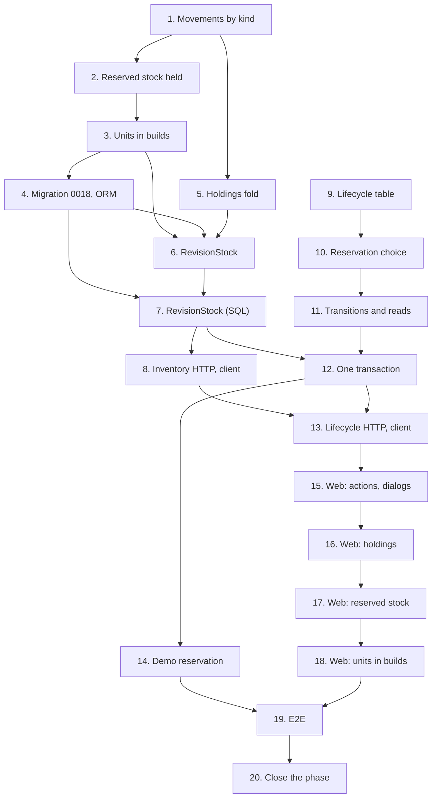

# Implementation Plan

## Overview

Twenty tasks that build [design.md](design.md) against [requirements.md](requirements.md):
inventory applying each movement by its kind, holding reserved stock, units in builds, the
migration, the holdings fold and a revision's stock; projects' lifecycle table, the reservation's
choice, the transitions and reads, one transaction across three modules, the routes and the demo's
reserved build; the web; the end-to-end journey; and the phase-closing documentation.

One migration, `0018_build_lifecycle.py`, moves the head from `0017` to `0018`. No new table,
module or ADR: `0014` stays free.

Branch first. Before task 1, run `git switch main && git pull && git switch -c
feat/build-lifecycle`, and never commit this spec's work on `main`. Task 1's commit also adds this
spec's `requirements.md`, `design.md` and `tasks.md`. The spec needs 07, 08 and 09 merged first.

One task, one commit, each passing `make check` **on its own** (AGENTS.md). `make coverage` on
tasks 4, 6, 7, 8, 11, 12, 13 and 14; `make client` on 3, 8 and 13, the regenerated client in that
commit; `make e2e` on 3, 8 and 15 to 19. A port that grows a method grows it in the same commit
as its SQL implementation: bootstrap wires the SQL units of work into the existing use cases, and
mypy checks them against the ports on every commit. Tick the task in this file in the same commit. Suggested commit
subjects are in `code` under each task.

Release footer: this spec is **the last of three** in `v0.5.0`, so task 20 carries
`Release-As: 0.5.0`, on a commit that changes files; no other task does. See
[Notes](#one-pr-per-spec-and-the-release).

## Tasks

- [x] 1. Inventory: apply each movement by its kind
  - Inventory's domain: `RevisionId`; `MovementKind`'s revision rule and `sign_allows`;
    `StockMovement.__post_init__` refusing what 0018's CHECKs will; `StockBalance.apply` by kind,
    raising `ReservedStockError`. `ReservationError` answers 409; `wiredex stock rebuild` folds
    through `apply`.
  - Tests: `test_balances.py` (property 2, and 05's balance properties restated per count),
    `test_ledger.py` (property 3).
  - The commit also adds `requirements.md`, `design.md` and `tasks.md`.
  - Checks: `make check`.
  - `feat(inventory): apply each movement kind to its balance`
  - _Requirements: 2.6, 7.3, 7.4, 8.1, 8.2, 8.3, 8.4, 14.6_

- [x] 2. Inventory: hold reserved stock against recounts and moves
  - `AdjustStock` refuses a count below the lot's reserved with 409; `MoveStock` is checked
    against the available stock. `MoveStock.perform`, which `MoveUnit` calls, already locks its
    two balances in lot-id order; it keeps doing so.
  - Tests: the movement use-case tests, extended with both refusals and a test pinning the lock
    order.
  - Checks: `make check`.
  - `feat(inventory): hold reserved stock against recounts and moves`
  - _Requirements: 7.1, 7.2, 7.3_

- [x] 3. Inventory: units reserved for and in use in revisions
  - `UnitStatus`'s four values; `Unit.revision_id` and its moves (`reserve_for`, `release`,
    `build`, `return_to`); retiring refuses a held unit, un-retiring acts only on a retired one;
    `UnitHeldError`, 409.
  - `MoveUnit` and 06's unit delete refuse a held unit; `RetireUnit` and `UnretireUnit` build
    their `ADJUST` after the balance lock; `Units.of_location` and its fake leave units in use out.
  - `inventory/api/schemas.py`: `UnitStatusName` takes the four values in this commit, since
    `tests/inventory/test_unit_api.py` keeps it in step with `UnitStatus`; `make client`, the
    regenerated client in this commit, and `inventory.units.status.reserved` and `.in_use` in both
    locale files, so `UnitsList`'s status column still type-checks. Nothing sends or shows the
    new statuses yet (task 18).
  - Tests: `test_unit.py` and the unit use-case tests; the fakes' and tests' invariant checks
    count in-stock plus reserved units against on hand.
  - Checks: `make check`, `make client`, `make e2e`.
  - `feat(inventory): let units be reserved for and built into revisions`
  - _Requirements: 3.6, 3.7, 3.8, 3.9, 8.4_

- [x] 4. Inventory: migration 0018 and the ORM
  - The mapping's four-value status type and `units.revision_id`; `make migration`, hand-fixed
    into `0018_build_lifecycle.py`: the four CHECKs and two partial indexes of Data Models, the
    downgrade running its UPDATEs first.
  - Tests: `test_migrations.py`, the up → down → up round trip and each new CHECK's refusal.
  - Checks: `make check`, `make coverage`.
  - `feat(inventory): widen units and movements for builds`
  - _Requirements: 3.10, 8.1, 8.2, 14.2_

- [x] 5. Inventory: fold a revision's holdings
  - `inventory/domain/holdings.py`: `MovementSum`, `LotHolding`, `HeldStock.of`.
  - Tests: `test_holdings.py`, over a draft's, a reserved, a built and a dismantled revision's
    sums.
  - Checks: `make check`.
  - `feat(inventory): fold what a revision holds from the ledger`
  - _Requirements: 8.5, 8.6, 14.6_

- [x] 6. Inventory: a revision's stock in a caller's transaction
  - `InventoryRepositories`; `inventory/application/builds.py`'s `RevisionStock` and its types,
    never committing; the new port methods (`Units.of_revision` and `lock`, `sums_of_revision`,
    `sums_of_part`, `BalanceSheet.lock`, `Lots.at`), their fakes, and their SQL in
    `inventory/infrastructure/repositories.py` (every lock `FOR UPDATE` in id or lot-id order,
    with `populate_existing`), so `SqlInventoryUnitOfWork` stays an `InventoryUnitOfWork`.
  - Tests: `test_revision_stock.py` (properties 6 to 9); `test_inventory_repositories.py` and
    `test_unit_repositories.py` for the new queries.
  - Checks: `make check`, `make coverage`.
  - `feat(inventory): reserve, release, consume and return a revision's stock`
  - _Requirements: 3.1, 3.6, 3.7, 3.9, 3.11, 4.1, 4.2, 5.1, 5.2, 6.2, 6.3, 7.4, 8.5, 14.6_

- [x] 7. Inventory: the revision's stock in PostgreSQL
  - `SqlInventoryRepositories(session, workspace_id)`; `SqlBalanceSheet.put` by version, without
    a SELECT.
  - Integration: the lock order and fixed statement counts; `test_stock_cli.py`'s rebuild over all
    seven kinds; isolation as `wiredex_app`.
  - Checks: `make check`, `make coverage`.
  - `feat(inventory): lock and sum a revision's stock in PostgreSQL`
  - _Requirements: 2.8, 3.11, 8.4, 8.5, 11.2, 14.3_

- [x] 8. Inventory: reserved, available and held units over HTTP
  - Stock reads and `PartStockResponse` with `reserved` and `available`;
    `UnitResponse.revision_id`, a unit in use's `location: null`.
  - `make client`, the regenerated client in this commit; `src/test/server.ts`'s fakes follow the
    new shapes. Tests: inventory's API tests, extended.
  - Checks: `make check`, `make coverage`, `make e2e`.
  - `feat(inventory): answer reserved and available stock and held units`
  - _Requirements: 3.10, 10.3, 10.6, 14.4_

- [x] 9. Projects: the lifecycle table and refusals
  - `projects/domain/lifecycle.py`; `Revision.ensure_allows` and `move`; `holds_stock` and
    `deletable`; projects' own `LotId`, `UnitId` and `LocationId`; `LifecycleRefusal` with its ten
    codes.
  - Tests: `test_lifecycle.py` (property 1).
  - Checks: `make check`.
  - `feat(projects): model the build lifecycle as a table`
  - _Requirements: 1.1, 1.2, 1.6, 9.1, 9.2, 9.3, 14.6_

- [x] 10. Projects: choose what a reservation takes
  - `projects/domain/reservation.py`: `ReservableStock`, `check_named_units`,
    `Reservation.choose`.
  - Tests: `test_reservation.py` (properties 4 and 5), and the demo's choice as an example.
  - Checks: `make check`.
  - `feat(projects): choose which lots and units a reservation takes`
  - _Requirements: 2.4, 2.5, 2.7, 3.1, 3.2, 3.3, 3.4, 3.5, 14.3, 14.6_

- [x] 11. Projects: transitions and reads over fakes
  - Ports: `BuildStock`, `BuildParts`, `BuildUnitOfWork(BomUnitOfWork)` and the holdings types;
    `Revisions.ref` and `refs`, with `SqlRevisions.ref` and `refs` in this same commit, since
    `SqlProjectsUnitOfWork` must stay a `ProjectsUnitOfWork`.
  - `projects/application/lifecycle.py`: `ReserveRevision`, `CancelReservation`, `BuildRevision`,
    `DismantleRevision`, `GetLifecycle`, `GetRevisionRef`, `ListPartHoldings`.
  - `DeleteRevision` and `DeleteProject` refuse a held revision and delete a dismantled one: 08's
    `RevisionInUseError` renamed `RevisionHoldsStockError`, raised by `Revision.ensure_deletable`
    and `ProjectRevisions.ensure_all_deletable` on `status.holds_stock`; the router's
    `_STATUS_BY_ERROR` row and 08's tests follow the rename.
  - Fakes for the new ports. Tests: `test_lifecycle_use_cases.py` (properties 10 and 11);
    `test_projects_repositories.py` for `ref` and `refs`.
  - Checks: `make check`, `make coverage`.
  - `feat(projects): reserve, cancel, build and dismantle revisions`
  - _Requirements: 1.2, 1.3, 1.4, 1.5, 1.7, 2.1, 2.2, 2.3, 2.7, 3.2, 3.4, 3.5, 4.1, 4.3, 5.1,
    5.3, 6.1, 9.1, 9.2, 9.3, 9.4, 10.1, 10.2, 10.4, 14.1_

- [x] 12. One transaction across three modules
  - Catalog: `describe_parts(work: CatalogRepositories, ids)` extracted from 09's `DescribeParts`.
  - `bootstrap/build.py`: `SqlBuildUnitOfWork`, `InventoryBuildStock`, `CatalogBuildParts`. The
    use cases are wired into `ProjectsUseCases` in task 13, with their routes; the integration
    tests here build them over `SqlBuildUnitOfWork` themselves.
  - Tests: `test_build_stock.py`; integration `test_build_transactions.py` and
    `test_build_isolation.py`.
  - Checks: `make check`, `make coverage`.
  - `feat(projects): run a transition in one transaction across three modules`
  - _Requirements: 1.3, 1.4, 1.5, 2.8, 4.2, 4.3, 5.2, 5.3, 6.3, 8.6, 9.4, 10.6, 11.1, 11.2, 14.1,
    14.3_

- [x] 13. Projects: the lifecycle over HTTP
  - The schemas and the seven routes on projects' router, from `bootstrap/app.py`;
    `ProjectsUseCases` gains the seven use cases, which `bootstrap/projects.py` wires over
    `SqlBuildUnitOfWork`; every `LifecycleRefusal` mapped by the error table; 08's deletes answer
    `RevisionHoldsStockError` as 409, through the row task 11 renamed.
  - `make client`, the regenerated client and its aliases in `packages/api-client/src/index.ts`
    in this commit.
  - Tests: `test_lifecycle_api.py`, `test_lifecycle_auth.py`.
  - Checks: `make check`, `make coverage`.
  - `feat(projects): expose the build lifecycle over HTTP`
  - _Requirements: 1.2, 1.7, 2.2, 3.4, 3.5, 6.1, 10.1, 10.2, 10.4, 10.5, 10.6, 11.3, 11.4, 11.5,
    14.4_

- [x] 14. A reserved build in the demo
  - `RestoreSampleProjects` reserves *Greenhouse controller* `A` through `ReserveRevision`, with
    no named units, in a unit of work of its own.
  - Tests: `test_demo.py` (the demo's choice; both *Weather station* revisions short of the
    ESP32); `test_demo_cli.py` (a reset and an invitation restore the same reservation).
  - Checks: `make check`, `make coverage`.
  - `feat(projects): seed the demo bench with a reserved build`
  - _Requirements: 12.1, 12.2, 12.3_

- [x] 15. Web: lifecycle actions and dialogs
  - `apps/web/src/features/projects/build/`: `lifecycle.ts`, `transitions.ts`,
    `LifecycleActions`, `ReserveDialog`, `ConfirmTransition`, `DismantleDialog`, in the revision
    panel.
  - `projects.lifecycle.*` keys, every refusal code included, in `en.json` and `pt-BR.json`; the
    lifecycle routes in `src/test/server.ts`.
  - Tests: Vitest beside each component, by role and accessible name, keyboard-only included.
  - Checks: `make check`, `make e2e`.
  - `feat(web): reserve, build, cancel and dismantle from the revision panel`
  - _Requirements: 1.6, 13.1, 13.2, 13.3, 13.4, 13.5, 13.7, 13.13, 13.14, 13.15, 13.16_

- [x] 16. Web: what a build holds
  - `HoldingsSection`; `RevisionLink` and `useRevisionRef`; the new status refreshed in the
    revision panel, the project page and the project list.
  - Delete offered unavailable, with its reason, while a revision holds stock; 09's report titled
    for a revision that isn't a draft. Keys in both locales.
  - Tests: Vitest beside each component.
  - Checks: `make check`, `make e2e`.
  - `feat(web): show what a build holds`
  - _Requirements: 13.6, 13.7, 13.11, 13.12, 13.14, 13.15, 13.16_

- [x] 17. Web: reserved and available stock
  - `StockByPart`: on hand, reserved and available per location and in total, `PartHoldings`
    under them; the recount and move dialogs' checks before sending. Keys in both locales. The
    wider stock table scrolls inside its own `overflow-x-auto` box on a phone.
  - Tests: Vitest beside each component.
  - Checks: `make check`, `make e2e`.
  - `feat(web): show reserved and available stock and who holds it`
  - _Requirements: 13.8, 13.10, 13.14, 13.15, 13.16_

- [x] 18. Web: units in builds
  - `UnitsList` and `UnitPage`: the reserved and built statuses with a `RevisionLink`, no move or
    retire for a held unit. Keys in both locales.
  - Tests: Vitest beside each component; the web suite at or above 85 %.
  - Checks: `make check`, `make e2e`.
  - `feat(web): show units reserved for and in use in revisions`
  - _Requirements: 13.9, 13.14, 13.15, 14.5_

- [~] 19. E2E: the build lifecycle journey
  - `e2e/tests/build.spec.ts` on the shared session, names from `Date.now()`: a part, its stock,
    a project and its BOM.
  - Reserve refused as short, then reserved after a receipt; a recount below reserved refused;
    build (the total drops); dismantle into a chosen location (the total is back, there); delete
    the dismantled revision.
  - In the Pixel 7 project, the revision page with its holdings and the part's stock view have no
    horizontal page overflow.
  - Checks: `make check`, `make e2e`.
  - `test(e2e): cover the build lifecycle journey`
  - _Requirements: 1.1, 2.1, 2.2, 3.2, 5.1, 6.2, 6.3, 7.1, 7.2, 9.2, 13.1, 13.2, 13.3, 13.4,
    13.5, 13.6, 13.7, 13.8, 13.9, 13.10, 13.16_

- [~] 20. Close the projects phase
  - Everything design.md's [After this spec](design.md#after-this-spec) lists, in one commit.
  - Footer `Release-As: 0.5.0`, on this commit, which changes files.
  - Checks: `make check`.
  - `docs: close the projects phase`
  - _Requirements: 14.7_

## Task Dependency Graph



```json
{
  "waves": [
    {
      "wave": 1,
      "tasks": [
        { "id": "1", "name": "Movements by kind", "dependsOn": [] },
        { "id": "9", "name": "Lifecycle table", "dependsOn": [] }
      ]
    },
    {
      "wave": 2,
      "tasks": [
        { "id": "2", "name": "Reserved stock held", "dependsOn": ["1"] },
        { "id": "5", "name": "Holdings fold", "dependsOn": ["1"] },
        { "id": "10", "name": "Reservation choice", "dependsOn": ["9"] }
      ]
    },
    {
      "wave": 3,
      "tasks": [
        { "id": "3", "name": "Units in builds", "dependsOn": ["2"] },
        { "id": "11", "name": "Transitions and reads", "dependsOn": ["10"] }
      ]
    },
    { "wave": 4, "tasks": [{ "id": "4", "name": "Migration 0018, ORM", "dependsOn": ["3"] }] },
    { "wave": 5, "tasks": [{ "id": "6", "name": "RevisionStock", "dependsOn": ["3", "4", "5"] }] },
    { "wave": 6, "tasks": [{ "id": "7", "name": "RevisionStock (SQL)", "dependsOn": ["4", "6"] }] },
    {
      "wave": 7,
      "tasks": [
        { "id": "8", "name": "Inventory HTTP, client", "dependsOn": ["7"] },
        { "id": "12", "name": "One transaction", "dependsOn": ["7", "11"] }
      ]
    },
    {
      "wave": 8,
      "tasks": [
        { "id": "13", "name": "Lifecycle HTTP, client", "dependsOn": ["8", "12"] },
        { "id": "14", "name": "Demo reservation", "dependsOn": ["12"] }
      ]
    },
    { "wave": 9, "tasks": [{ "id": "15", "name": "Web: actions, dialogs", "dependsOn": ["13"] }] },
    { "wave": 10, "tasks": [{ "id": "16", "name": "Web: holdings", "dependsOn": ["15"] }] },
    { "wave": 11, "tasks": [{ "id": "17", "name": "Web: reserved stock", "dependsOn": ["16"] }] },
    { "wave": 12, "tasks": [{ "id": "18", "name": "Web: units in builds", "dependsOn": ["17"] }] },
    { "wave": 13, "tasks": [{ "id": "19", "name": "E2E", "dependsOn": ["14", "18"] }] },
    { "wave": 14, "tasks": [{ "id": "20", "name": "Close the phase", "dependsOn": ["19"] }] }
  ]
}
```

Reading it:

- **Roots.** 1 (inventory) and 9 (projects) depend on no task here. The spec as a whole needs
  07, 08 and 09 on `main`; that is a phase-level dependency, not a task edge.
- **Critical path.** 1 → 2 → 3 → 4 → 6 → 7 → 8 → 13 → 15 → 16 → 17 → 18 → 19 → 20, one task
  per wave. 6 follows 4 because its SQL reads `units.revision_id`, which 4's migration adds. The projects chain (9 → 10 → 11) runs beside inventory's and joins it at 12.
- **Kept in line though close to independent.** 15 to 18 all write the locale files and
  `src/test/server.ts`, so no two share a wave.
- **13 after 8.** Both regenerate the client, so 13 waits for 8 and the two regenerations never
  collide; 3 regenerates it too, and 8 already follows 3 through 4 and 7.

## Notes

### Before pushing

- `make check` on every commit, not only the last.
- `make coverage` on 4, 6, 7, 8, 11, 12, 13 and 14: API floor 90 %, web floor 85 %.
- `make client` in 3, 8 and 13, whose commits carry the regenerated client; after each, `make
  client` must leave the package unchanged, or CI's contract gate fails.
- `make e2e` on 3, 8 and on 15 to 19.
- `wiredex db check` clean at `0018`.
- The PR description carries decision 6's two rollback caveats: after a rollback, the previous
  release's `wiredex stock rebuild` must not run against a ledger holding the new kinds, and that
  release can't read a reserved or in-use unit, so a manual rollback past `0.5.0` cancels or
  dismantles what holds units first.

### One PR per spec, and the release

Open this spec's PR from `feat/build-lifecycle`, based on `main` after 09-bill-of-materials
merged, and turn on auto-merge with `gh pr merge N --rebase --auto`. Task 20's
`Release-As: 0.5.0` footer makes the release PR release-please keeps open `0.5.0`, with 08's, 09's
and this spec's commits. Merging it deploys to production: only the owner does it (AGENTS.md,
Safety), never an agent. The first `v0.6.0` spec's PR turns on auto-merge only after that release
is out.
