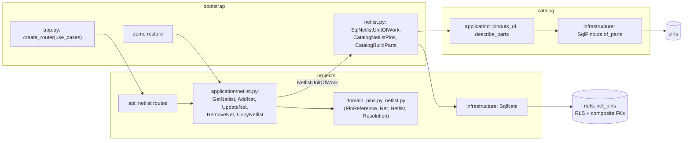

# Design Document: netlist editor

## Overview

The first of two specs in `v0.6.0` Wiring. It delivers the phase's roadmap line *Netlist editor
on top of real pinouts* and the netlist half of
[ADR 0004](../../../docs/adr/0004-netlist-and-pinouts.md), whose pinout half
[02-part-pinouts](../02-part-pinouts/design.md) built in `v0.3.0`. A revision of
[08-projects-and-revisions](../08-projects-and-revisions/design.md) gains its nets; each net
connects pin references, a designator of
[09-bill-of-materials](../09-bill-of-materials/design.md)'s BOM plus a pin of that designator's
part; the `Netlist` first-class collection that
[docs/architecture.md](../../../docs/architecture.md) §5 names is built; and 08's fork extension
point copies the netlist after the BOM. The demo bench opens wired.
[12-wiring-validation](../12-wiring-validation/requirements.md) follows: the four rules, the pin
usage view, and the phase's closing documentation.

Four things carry the design. What a pin reference stores and how it resolves, so the wiring
survives a BOM or pinout edit without a foreign key (decisions 2 and 3). What a write checks and
what it leaves to 12 (decisions 4 and 5). How projects reads catalog's pinouts in its own
transaction while importing nothing from catalog (decision 1). And a keyboard editor that offers
`GPIO21` where the owner would otherwise look up pin 25 (decision 14).

**Owner decisions that bind this spec**, and what each does here:

- **`v0.6.0` is two specs** (2026-09-29): this one, *nets between real pins with wire colors*,
  and 12-wiring-validation, *the rules (unknown pin, pin reused, voltage mismatch, input-only
  driven) and the per-part pin usage view*. This spec checks that a new reference names a real
  pin and answers what each reference resolves to; every rule, and every message that calls
  something an error or a warning, is 12's.
- **A reference that stops resolving is kept and marked, never blocking and never deleted**
  (2026-09-29). A pinout replaced, a BOM line's designators changed or a line pointed at another
  part go through as before; the reference stays in its net and reads as unresolved. Decisions 2
  and 3.
- **A part with no pinout is wired by pin number**, its pins unchecked (2026-09-29). Decision 4;
  12 warns about it.
- **Wiring never blocks a reserve** (2026-09-29). Nothing here touches 10's transitions; the
  netlist locks with the BOM once a revision leaves draft (decision 9), and 12 shows its findings
  in the reserve dialog.
- **One PR per spec with auto-merge; the release PR waits for the phase's last spec, and only the
  owner merges it** (2026-09-27). This spec is the phase's first: it carries no `Release-As`
  footer, and, as 10's notes say, its PR turns on auto-merge only after `0.5.0` is released.
- **A change history waits for `v0.8.0`** (2026-09-26). A net write moves its revision's last
  change and logs nothing else.

**Decisions this spec makes (2026-09-29), for the owner to check.** Where the repository doesn't
settle something, it is decided here, with the reason:

1. **The netlist is two tables in `projects`, and pinouts arrive on the same session.** `nets`
   and `net_pins` live with the revisions and BOM lines they belong to. Projects declares a port,
   `NetlistPins` (`of_parts(part_ids)`: each part's pins, a part with none absent), and reuses
   10's `BuildParts` (`describe`), both as properties of a `NetlistUnitOfWork(BomUnitOfWork)`.
   `bootstrap/netlist.py` binds them, the third use of 07's shared-session pattern:
   `SqlNetlistUnitOfWork(SqlProjectsUnitOfWork)` puts `CatalogNetlistPins` and 10's
   `CatalogBuildParts` over a `SqlCatalogRepositories` on the session projects opened. Catalog
   gains `pinouts_of(work: CatalogRepositories, ids)` over a new `SqlPinouts.of_parts`. The same
   session, not 09's separate reads, because a write checks new references against the BOM it
   read under the project's lock: a catalog read in a transaction of its own would either run
   with the lock held, across a second connection, or before the lock, against a BOM that could
   still change. Nothing locks catalog rows: a pinout replaced a moment after the write only turns
   a reference unresolved, which the owner's decision makes a state, not a fault.
2. **A pin reference is text, a designator and a pin number, with no foreign key.** `net_pins`
   stores `(designator, pin)`, both in canonical form, and points at nothing but its net. 09
   planned a key from pin references to `bom_designators` (its decision 8 and seams table); the
   owner's decision rules it out, since a cascade would delete wiring when a designator goes and a
   restriction would block the BOM edit. For the same reason the pin is a number, not a key into
   catalog's `pins`: modules don't point at each other's tables, and a replaced pinout must leave
   the reference standing. What a reference means is worked out at each read (decision 3), as 09's
   shortage report is.
3. **A reference resolves to one of five states, computed at every read and stored nowhere.**
   Through the BOM's `line_with(designator)` to the line's part, then that part's pins:
   `resolved` (the part's pinout holds the number; the answer carries the pin's label, type,
   functions and voltage), `unchecked` (the part has no pinout), `unknown_designator` (no line
   holds the designator), `unknown_part` (the line names a part the catalog no longer holds) and
   `unknown_pin` (the pinout has no such number). The last three are *unresolved*. This is
   `Resolution.of(reference, bom, parts, pins)` in the domain, one function the read and the
   write both use. Storing nothing means a pinout edit, a BOM edit or a catalog rename is right
   at the next read with nothing to invalidate, as 09's decision 10 argued for the report
   (requirements 4.3, 4.4).
4. **A write accepts a new reference only when it names a real pin, and keeps old ones as they
   are.** A reference the net didn't hold before must resolve, or its part must have no pinout:
   an unknown designator, an unknown part or a pin the pinout lacks is a 422 naming the reference
   (requirement 3). The typed pin is matched against the part's pinout by number first, then by
   label, then by function, labels and functions compared case-folded, and stored as the number
   it matched: `U2.SDA` on the BME280 is stored `U2.3`. A label or function on several pins
   (`U1.GND` on the DevKitC, pins 14, 20 and 26) is a 422 `ambiguous_pin` naming the numbers.
   For a part with no pinout the typed pin must be a pin number by 02's grammar and is stored as
   one, `R1.1`, resolving `unchecked`. A reference the net already held is compared by its stored
   form and kept whatever it resolves to, so editing a net's color never demands fixing a
   reference a BOM edit broke (requirement 3.8). This is the owner's *nets between real pins*,
   and it is all a write checks: whether the wiring makes electrical sense is 12's.
5. **Within a net a pin appears once; across nets it may repeat, for 12 to report.** Two typed
   references resolving to one stored reference (`U2.3, U2.SDI`) are a 422 `repeated_pin` naming
   the second. The same pin in two nets is stored: the owner put *pin reused* among 12's rules,
   and a rule can only report what the netlist can hold. docs/architecture.md §5 lists "pin in ≤ 1
   net" as a collection rule; 12's closing documentation rewrites that line to say it is a
   finding.
6. **A net is a name, an optional wire color, notes and 1 to 256 pins.** The name is 1 to 32
   characters after trimming and collapsing whitespace, no control characters, unique per
   revision ignoring case, as 08's labels are: `SDA`, `3V3`, `GND`, `SOIL_ADC`. Its case is kept.
   A net needs a pin, since a net with none connects nothing and a removed net is what the owner
   means; one pin is allowed, a wire still to be finished. Limits sized as 09's: 500 nets per
   revision, 256 pins per net (a big board's ground), notes up to 500 characters, a typed pin
   list up to 4,000 characters, the request's transport bound.
7. **Wire colors are a fixed palette of ten: the resistor code's black, brown, red, orange,
   yellow, green, blue, violet, grey and white.** Those are the colors jumper kits come in, and a
   fixed set gives each a theme token for its swatch, a translated name, and a value a later
   filter can match. Free text would store `red`, `Red`, `rd` and `vermelho` as four colors. No
   color is allowed too.
8. **Nets are written one at a time, and an edit replaces a net whole.** Add, edit and remove,
   as 09's lines are, rather than replacing the netlist as 02 replaces a pinout: nets go in one at
   a time from the keyboard, and each write stays small. An edit replaces the name, color, notes
   and pins; its pin rows are rewritten in two statements, a delete and one insert, since nothing
   hangs off them. Nets keep the order they were added in (`created_at`, then the time-ordered
   id); a net's pins are kept in canonical order, designators as 09 orders them and then pin
   numbers comparing runs of digits as numbers, so `U1.2, U1.10, U2.3` reads the way a schematic
   is read and the stored order needs no column.
9. **Only a draft's netlist changes, under the project's lock.** Each write calls 09's
   `lock_revision`, then `Revision.ensure_content_editable()`, then reads the BOM and the netlist,
   so net writes, BOM writes and 10's transitions to one project take turns, and a write checks
   its new references against the BOM the previous change left (requirement 5.4). A refused write
   is 409 `revision_locked`, as a BOM write's is. Each write moves the revision's `updated_at`.
10. **A fork copies the netlist second.** `SqlProjectsUnitOfWork` registers
    `CopyNetlist(self.nets, self._ids)` after 09's `CopyBomLines`, as 08's decision 6 planned.
    References are copied as stored, unresolved ones included; the fork's BOM is a copy of the
    source's, so every reference resolves in the fork as it did in the source, with no map of old
    ids to new ones. Copied nets take the fork's date and ids minted in the source's order, 09's
    decision 15 again.
11. **One read serves the section and the editor.** `GET /projects/revisions/{id}/netlist`
    answers `NetlistResponse`: `editable`; the nets, each reference with its canonical text, its
    resolution and, when resolved, its pin's label, type, functions and voltage; a summary; the
    BOM's designators with their parts; and once per part on the BOM its pins. It opens the same
    `NetlistUnitOfWork` as the writes and reads eight times whatever the sizes (requirement 7.3):
    the revision, the BOM's lines and designators, the nets and their pins, the parts and the
    category tree (10's `describe_parts`), and the pins of every part on the BOM. With the
    workspace setting that is nine statements in one transaction, where 09's BOM read takes nine
    over three.
12. **Four routes, and refusals that name the reference.** `GET …/netlist`, `POST
    …/netlist/nets`, `PATCH` and `DELETE …/netlist/nets/{net_id}`, `PATCH` replacing a net whole as 09's line edit does. A net is sent as `{name, color,
    notes, pins}`, `pins` the list as typed, as 09 sends designators. A refusal is
    `NetRefusalResponse`: `message`, `code`, `field` (`name`, `color`, `notes`, `pins`), `item`
    (the reference as typed), `candidates` (the pin numbers an ambiguous pin could be) and, for a
    name taken, `net_id` and `net`. The codes are in Error Handling.
13. **Projects keeps its own copy of the pin vocabulary.** `projects/domain/pins.py` holds
    `PinNumber` (02's grammar: 1 to 16 of `A–Z 0–9 _ . + -` after NFKC, trimming and upper-casing),
    `PinType` (02's eight values) and `PinFacts`. Projects can't import catalog's, and a pin
    reference must normalize its number exactly as a pinout does or a stored `U1.a1` would never
    find ball `A1`. `bootstrap/netlist.py` translates catalog's `Pin` into `PinFacts`, and a
    bootstrap test pins the two grammars and the two enumerations to each other over generated
    text. A pin number may hold a dot (`P1.3`), so a reference splits at its first dot: a
    designator never holds one (09's decision 5).
14. **The web editor is a spreadsheet row with a pin combobox.** The Wiring section of the
    revision panel sits after the BOM: a table of nets (name, color swatch, pins, notes) whose last
    row adds one (Name, Color, Pins, Notes). Enter adds it from any field, the row clears and focus
    returns to Name, as 09's BOM row does. The Pins field is `PinListInput`, a combobox over the
    token being typed: before a dot it offers the BOM's designators with their parts, after one
    the part's pins as `25 · GPIO21`, filtered by number, label or function, and picking one
    writes the number. Pins show as chips, `U1.25 GPIO21`; an unchecked chip says *not checked*
    and an unresolved one says which (*not on the BOM*, *part not in the catalog*, *no such pin*),
    in words and an icon, never color alone. The color is a native select with the swatch beside
    it. Edits happen in the row (Enter saves, Escape restores) and removal asks in the row.
15. **Wire swatches are theme tokens.** `styles.css` gains `--color-wire-black` to
    `--color-wire-white`, one value each for light and dark: a red wire is red in either theme.
    Black and white swatches carry the `border-strong` outline so they show on both backgrounds.
16. **The demo bench opens wired.** The sample *ESP32-DevKitC* gains the pinout of its two
    19-pin headers, numbered 1 to 38 (Data Models), its GPIO34 to GPIO39 typed `input`, the flash
    pins `other`. *Weather station* `A` gets `3V3`, `GND`, `SDA` and `SCL`; the fork `B` copies
    them, then adds `VBAT` and wires its regulator into `3V3` and `GND` through `UpdateNet`;
    *Greenhouse controller* `A` gets `3V3`, `GND`, `SOIL` and `PUMP`, written before 10's reserve
    locks it. The sample nets name pins by number (`U1.14` for a ground, since the DevKitC has
    three), by label (`U1.3V3`) and by function (`U1.SDA`), and wire resistors and capacitors,
    which have no pinout, by number.
17. **One migration and no new ADR.** `0019_netlist.py` adds `nets` and `net_pins`, both isolated
    by workspace, and changes nothing that exists, so the release before this one keeps working
    against it. ADR 0004 already decided the model; the owner's decision on unresolved references
    changes how it is stored, not what it is, and 12's closing task records it in ADR 0004's new
    *Implementation (v0.6)* section. `0014` stays free.

**Seen while designing, not changed here:**

- 02's design says resolving `U2.SDA` by label is "a UI convenience for later, valid only when
  that label is unique on the part". Decision 4 does it on the server, for labels and functions,
  with the same condition; the web only suggests.
- ADR 0004's implementation notes say the `pins` key `(part_id, number)` "is exactly how the
  netlist's `PinRef` will reference a pin". It references the pin by number through a
  designator, with no key (decision 2); 12's closing task corrects the sentence.
- 09's seams table lists `bom_designators` as "the key a pin reference's foreign key points at".
  No key points there (decision 2), and the table's rows stay as 09 wrote them.

**In scope:** the pin vocabulary in projects; `PinReference`, `PinList`, `NetName`, `WireColor`,
`Net`, `Netlist` and `Resolution`; the net use cases, `GetNetlist` and `CopyNetlist`; catalog's
`pinouts_of`; `bootstrap/netlist.py`; migration `0019` with its tables, repository and routes;
the sample pinout and netlists; the web's Wiring section, its editor and its pin combobox; the
E2E journey.

**Out of scope:** every rule and finding (12): unknown pin as an error, pin reused, voltage
mismatch, input-only driven, parts without a pinout as a warning, and the reserve dialog's
warnings; the pin usage view per part (12); a rendered wiring diagram (*Later*); wiring to
things that aren't on the BOM, such as a battery's leads, other than through a designator the
owner adds; importing a netlist from KiCad (*Later*, with its BOM import); a history of net
edits (`v0.8.0`).

## Architecture



Projects still imports no other module: `NetlistPins` and `BuildParts` are projects' ports,
answered in projects' words, and only `bootstrap/netlist.py` sees both modules.

### A net write

```mermaid
sequenceDiagram
    participant R as router
    participant U as AddNet / UpdateNet
    participant W as SqlNetlistUnitOfWork (one session)
    participant C as catalog repositories (same session)
    R->>U: workspace, revision id, NetDraft.parse(name, color, notes, pins text)
    U->>U: NetDraft: name, color, notes, typed references (422 before any read)
    U->>W: open (SET LOCAL app.workspace_id)
    U->>W: lock_revision (project row FOR UPDATE), then the revision
    U->>U: ensure_content_editable (409 revision_locked)
    U->>W: BOM lines and designators; the netlist
    U->>U: the references this net didn't hold: their designators' parts
    U->>C: describe(those parts); of_parts(those parts)
    U->>U: TypedReference.resolve → stored PinReference, or 422 naming it
    U->>U: Netlist.with_net / replacing: name free, ≤ 500 nets, each pin once
    U->>W: insert net and its pins (or delete + insert its pins); revision.touch
    U->>W: commit
```

Everything a write can refuse for is decided before its first write statement, so a refused
write leaves nothing behind (Property 8).

## Components and Interfaces

### Projects: the pin vocabulary

`apps/api/src/wiredex/projects/domain/pins.py`. Frozen slotted dataclasses validating in
`__post_init__`, as 02's are, raising projects' `ContentError` leaves.

| Value | Rule | Normalized |
| --- | --- | --- |
| `PinNumber` | 1–16 of `A–Z 0–9 _ . + -` | NFKC, trimmed, upper-cased: 02's rule |
| `PinType` | `StrEnum`: `power`, `ground`, `io`, `input`, `output`, `analog`, `nc`, `other` | — |
| `PinFacts` | a pin as the netlist sees it: `number`, `label: str`, `type`, `functions: tuple[str, ...]`, `voltage: Decimal \| None` | — |
| `PartPins` | a part's pins in their saved order | — |

```python
@dataclass(frozen=True, slots=True)
class PartPins:
    """One part's pinout, as the netlist reads it. Built only for parts that have pins: a part
    with none is absent from `NetlistPins.of_parts`, which is how "no pinout" is told apart."""

    pins: tuple[PinFacts, ...]

    def numbered(self, number: PinNumber) -> PinFacts | None: ...

    def matching(self, typed: str) -> tuple[PinFacts, ...]:
        """Decision 4's order: the pin with this number; else the pins with this label; else
        the pins with this function, labels and functions compared case-folded. Empty when
        nothing matches; more than one when a label or function repeats."""
```

`PinNumber` is written the way catalog's is, not imported: `normalize_symbols` is catalog's, so
projects applies `unicodedata.normalize("NFKC", …)` and the bootstrap test of decision 13 checks
that both give the same result, or the same refusal, for generated text.

### Projects: references, nets and the netlist

`apps/api/src/wiredex/projects/domain/netlist.py`, with its errors in `errors.py`.

```python
MAX_NETS = 500  # on one revision
MAX_NET_PINS = 256  # on one net
MAX_NET_NAME_LENGTH = 32


@dataclass(frozen=True, slots=True, order=True)
class PinReference:
    """A stored reference: a designator and the pin number it names (decision 2). Ordered as
    decision 8 orders a net's pins: designator, then the pin number's natural key."""

    designator: Designator
    pin: PinNumber  # compared through `natural_key`, not as text

    def __str__(self) -> str: ...  # "U1.25"


@dataclass(frozen=True, slots=True)
class TypedReference:
    """A reference as typed, split at its first dot (requirement 2.1): a `Designator` and the
    pin text, not yet a number. `resolve` is where it becomes a `PinReference`."""

    text: str
    designator: Designator
    pin: str

    @classmethod
    def parse(cls, text: str) -> TypedReference: ...  # InvalidPinReferenceError

    def resolve(
        self, bom: BillOfMaterials, parts: Mapping[PartId, PartFacts],
        pins: Mapping[PartId, PartPins],
    ) -> PinReference:
        """Decision 4: UnknownDesignatorError, UnknownPartError (the netlist's own, code
        `unknown_part` on `pins`), UnknownPinError, AmbiguousPinError(candidates); a part
        with no pinout takes the pin as a PinNumber, InvalidPinReferenceError if it isn't
        one."""


def parse_pin_list(text: str) -> tuple[TypedReference, ...]:
    """Items split by commas and whitespace, each a TypedReference (requirement 2.2)."""


class NetName: ...  # 1-32 characters, collapsed, no control characters; `fold()` casefolds
class WireColor(StrEnum): ...  # black, brown, red, orange, yellow, green, blue, violet, grey, white
class NetNotes: ...  # 09's BomNotes rule: collapsed, blank is none, at most 500


@dataclass(frozen=True, slots=True)
class NetPins:
    """A net's references: at least one, at most 256, each once, in canonical order."""

    values: tuple[PinReference, ...]  # sorted and checked in __post_init__

    def text(self) -> str: ...  # "U1.2, U1.10, U2.3"


@dataclass(frozen=True, slots=True)
class NetContent:
    name: NetName
    color: WireColor | None
    notes: NetNotes | None
    pins: NetPins


@dataclass(frozen=True, slots=True)
class Net:
    """One net of a revision. Immutable, as 09's `BomLine` is: an edit is a new value with the
    same id."""

    id: NetId
    workspace_id: WorkspaceId
    revision_id: RevisionId
    content: NetContent
    created_at: datetime

    @classmethod
    def on(cls, revision: Revision, net_id: NetId, content: NetContent, now: datetime) -> Net: ...
    def revised(self, content: NetContent) -> Net: ...
    def copied_to(self, target: Revision, net_id: NetId) -> Net: ...


@dataclass(frozen=True, slots=True)
class Netlist:
    """One revision's nets, oldest first. Its rules: at most 500 nets, and no two names equal
    ignoring case. A pin may sit in several nets (decision 5)."""

    revision_id: RevisionId
    nets: tuple[Net, ...] = ()

    def with_net(self, net: Net) -> Netlist: ...  # TooManyNetsError, NetNameTakenError
    def replacing(self, net: Net) -> Netlist: ...  # its own name doesn't count against it
    def without(self, net_id: NetId) -> Netlist: ...
    def net(self, net_id: NetId) -> Net: ...  # NetNotFoundError, 404
    def references(self) -> frozenset[PinReference]: ...
    def designators(self) -> frozenset[Designator]: ...


class ResolutionState(StrEnum):
    RESOLVED = "resolved"
    UNCHECKED = "unchecked"
    UNKNOWN_DESIGNATOR = "unknown_designator"
    UNKNOWN_PART = "unknown_part"
    UNKNOWN_PIN = "unknown_pin"

    @property
    def unresolved(self) -> bool: ...  # the last three


@dataclass(frozen=True, slots=True)
class Resolution:
    """What a stored reference names today (decision 3)."""

    reference: PinReference
    state: ResolutionState
    part: PartFacts | None  # the designator's part, when on the BOM and in the catalog
    pin: PinFacts | None  # when resolved

    @classmethod
    def of(
        cls, reference: PinReference, bom: BillOfMaterials,
        parts: Mapping[PartId, PartFacts], pins: Mapping[PartId, PartPins],
    ) -> Resolution: ...
```

`natural_key(number)` splits a pin number into runs of digits and of everything else and
compares digit runs as integers, so `2 < 10` and `A2 < A10 < B1`. It is the only new ordering;
designators keep 09's.

How a write treats the typed pins, in `NetDraft.content(bom, parts, pins, kept)`, in the domain:

1. Each `TypedReference` whose canonical spelling, designator and upper-cased pin, is a
   reference in `kept` (the net's stored references before the edit, empty for a new net) is
   taken as stored, without looking at the BOM or the pinout (requirement 3.8).
2. Every other one is resolved (decision 4), and a refusal names its text as typed.
3. The results make a `NetPins`, which refuses a pin twice as `repeated_pin` naming the second
   typed text, none as `no_pins`, and more than 256 as `too_many_pins`.

Only the parts behind step 2's designators are described and have their pins read, so an edit
that adds one reference reads one part's pins, whatever the netlist holds.

### Projects: application

`apps/api/src/wiredex/projects/application/ports.py` gains:

```python
class Nets(Protocol):
    """A revision's nets and their references, written with Core as the BOM is."""

    async def of_revision(self, revision_id: RevisionId) -> Netlist:
        """The nets oldest first with their references, in two reads."""
    async def add(self, net: Net) -> None: ...
    async def add_all(self, nets: Sequence[Net]) -> None:
        """Many nets at once, for a fork's copy: two statements whatever their number."""
    async def update(self, before: Net, after: Net) -> None:
        """The name, color and notes; the references by a delete and one insert."""
    async def remove(self, net: Net) -> None:
        """The net and, by the database's cascade and the fakes' own, its references."""


class NetlistPins(Protocol):
    """Catalog's pinouts on the netlist's session (decision 1)."""

    async def of_parts(self, part_ids: Collection[PartId]) -> Mapping[PartId, PartPins]:
        """Each part's pins in their saved order, in one query; a part with no pinout, or
        one the catalog doesn't hold, is absent."""


class NetlistUnitOfWork(BomUnitOfWork, Protocol):
    """A projects unit of work that also holds nets, and reads catalog's parts and pinouts
    on its own session (decision 1)."""

    @property
    def nets(self) -> Nets: ...
    @property
    def parts(self) -> BuildParts: ...
    @property
    def pins(self) -> NetlistPins: ...
```

The router builds a domain `NetDraft` with `NetDraft.parse(name, color, notes, pins)`, which
turns the text into values and raises before any read (requirement 1); `new_references(kept)`
and `content(...)` finish it as above. A write answers `NetWrite(net, view)`: the net and the
`NetlistView(revision, bom, netlist, parts, pins)` around it, whose `summary()` counts nets,
references, unchecked and unresolved (requirement 4.5). `GetNetlist` answers the view alone.
Net refusals are their own `NetError` family beside 09's `ContentError`, with `NetField` and
`NetRefusal` codes, since the two editors translate different codes.

`apps/api/src/wiredex/projects/application/netlist.py`:

| Use case | What it does |
| --- | --- |
| `GetNetlist(unit_of_work)` | `load_revision`, the BOM, the netlist, `parts.describe(bom parts)`, `pins.of_parts(bom parts)`; `Resolution.of` each reference |
| `AddNet(unit_of_work, clock, ids)` | `parse`, `lock_revision`, `ensure_content_editable`, BOM, netlist, the new references' parts and pins, `content`, `with_net`, `nets.add`, `touch`, commit |
| `UpdateNet(unit_of_work, clock)` | as `AddNet`, with `kept` the net's references; returns the net unchanged, committing nothing, when the content is the one stored |
| `RemoveNet(unit_of_work, clock)` | `lock_revision`, `ensure_content_editable`, `netlist.net(id)`, `nets.remove`, `touch`, commit |
| `CopyNetlist(nets, ids)` | a `RevisionContent`: the source's nets `copied_to` the fork, in order, through `add_all`; never commits |

`type NetlistUnitOfWorkFactory = Callable[[WorkspaceId], NetlistUnitOfWork]`. The in-memory fake
unit of work gains `nets`, `parts` and `pins` fakes; `FakeNets` cascades on revision and project
deletion as the database does.

### Catalog: several pinouts in one read

`SqlPinouts.of_parts(part_ids) -> dict[PartDefinitionId, Pinout]`: one `SELECT … WHERE
workspace_id = … AND part_id = ANY(…) ORDER BY part_id, position`, grouped into pinouts through
`Pinout(...)`, as `of_part` builds one; a part with no rows is absent. The `Pinouts` port and its
fake grow the method in the same commit. `pinouts_of(work: CatalogRepositories, ids)` in
`catalog/application/pinouts.py` is the body a caller's transaction runs, as `describe_parts` is
for parts: it reads nothing for an empty list.

### Bootstrap: one session for projects and catalog

`apps/api/src/wiredex/bootstrap/netlist.py`:

```python
class CatalogNetlistPins:
    """Projects' `NetlistPins` over catalog's `pinouts_of` (decision 1): catalog's `Pin`
    becomes projects' `PinFacts`, its type by value and its voltage as its Decimal."""

    def __init__(self, repositories: CatalogRepositories) -> None: ...
    async def of_parts(self, part_ids: Collection[PartId]) -> dict[PartId, PartPins]: ...


class SqlNetlistUnitOfWork(SqlProjectsUnitOfWork):
    """The projects unit of work with `nets`, and catalog's parts and pins bound on its session:
    a net write reads the BOM under the project's lock and the pinouts in the same transaction
    (decision 1, requirement 8.3). `SqlProjectsUnitOfWork` itself binds `nets`, since 08's and
    09's use cases fork through it and the fork copies nets; this subclass adds the catalog."""

    async def __aenter__(self) -> Self:
        await super().__aenter__()
        catalog = SqlCatalogRepositories(self.session, CatalogWorkspaceId(self._workspace))
        self.parts = CatalogBuildParts(catalog)
        self.pins = CatalogNetlistPins(catalog)
        return self
```

`SqlProjectsUnitOfWork` gains `nets: SqlNets` and registers `CopyNetlist(self.nets, self._ids)`
after `CopyBomLines`, clearing `net_pins` and `nets` before `bom_designators` in its demo
`_CLEAR_ORDER`. `bootstrap/projects.py` wires the four use cases over `SqlNetlistUnitOfWork` into
`ProjectsUseCases`.

### HTTP

On projects' router, prefix `/api/projects`:

| Route | Answers | Refuses |
| --- | --- | --- |
| `GET /revisions/{revision_id}/netlist` | 200 `NetlistResponse` | 404 |
| `POST /revisions/{revision_id}/netlist/nets` | 201 `NetResponse` | 404, 409, 422 |
| `PATCH /revisions/{revision_id}/netlist/nets/{net_id}` | 200 `NetResponse` | 404, 409, 422 |
| `DELETE /revisions/{revision_id}/netlist/nets/{net_id}` | 204 | 404, 409 |

```python
type WireColorName = Literal["black", "brown", "red", "orange", "yellow",
                             "green", "blue", "violet", "grey", "white"]
type ResolutionName = Literal["resolved", "unchecked", "unknown_designator",
                              "unknown_part", "unknown_pin"]
type PinTypeName = Literal["power", "ground", "io", "input", "output", "analog", "nc", "other"]
type NetFieldName = Literal["name", "color", "notes", "pins"]


class NetRequest(BaseModel):
    name: str = Field(max_length=MAX_TYPED_LENGTH)
    color: WireColorName | None = None
    notes: str | None = Field(default=None, max_length=MAX_TYPED_LENGTH)
    pins: str = Field(max_length=MAX_TYPED_LENGTH)  # "U1.25, U2.SDA, R1.2"


class NetlistPinResponse(BaseModel):  # catalog already has a PinResponse
    number: str
    label: str
    type: PinTypeName
    functions: list[str]
    voltage: str | None  # exact, as 02's API sends it


class NetPinResponse(BaseModel):
    ref: str  # "U2.3"
    designator: str
    pin: str
    resolution: ResolutionName
    part_id: UUID | None
    part_name: str | None
    label: str | None  # the pin's, when resolved
    type: PinTypeName | None
    voltage: str | None


class NetResponse(BaseModel):
    id: UUID
    name: str
    color: WireColorName | None
    notes: str | None
    pins: list[NetPinResponse]
    pins_text: str  # canonical


class BomDesignatorResponse(BaseModel):
    designator: str
    part_id: UUID
    part_name: str | None  # None: the catalog no longer holds it


class NetlistPartResponse(BaseModel):
    part_id: UUID
    name: str
    has_pinout: bool
    pins: list[NetlistPinResponse]


class NetlistSummaryResponse(BaseModel):
    nets: int
    references: int
    unchecked: int
    unresolved: int


class NetlistResponse(BaseModel):
    editable: bool
    nets: list[NetResponse]
    summary: NetlistSummaryResponse
    designators: list[BomDesignatorResponse]
    parts: list[NetlistPartResponse]


class NetRefusalResponse(BaseModel):
    message: str
    code: NetRefusalCodeName
    field: NetFieldName | None
    item: str | None
    candidates: list[str]
    net_id: UUID | None
    net: str | None
```

A write answers `NetResponse`, resolved against what the write read, so the editor shows the
net's chips without a second request; the section then refetches the netlist for its summary.
The router's error table maps each netlist error to its status and `NetRefusalResponse`, as
09's `BomRefusalResponse` is mapped, and a wire-names test keeps `NetRefusalCodeName`,
`ResolutionName`, `WireColorName` and `PinTypeName` in step with their enums.

### The demo bench

- `catalog/application/demo.py`: *ESP32-DevKitC* gains `pins`, the table under Data Models.
- `projects/application/demo.py`: `SampleRevision` and `SampleFork` gain `nets:
  tuple[SampleNet, ...]`, `SampleNet(name, color, pins, notes=None)`, and `SampleFork` gains
  `edits: tuple[SampleNet, ...]`, nets the fork rewrites by name through `UpdateNet`.
  `RestoreSampleProjects` writes each revision's nets through `AddNet` after its BOM and before
  any reserve (requirement 9.4). `bootstrap/projects_demo.py` builds `AddNet` and `UpdateNet` over
  `SqlNetlistUnitOfWork`.

| Revision | Net | Color | Pins as written |
| --- | --- | --- | --- |
| Weather station `A` | `3V3` | red | `U1.3V3, U2.VDD, U2.VDDIO, U2.CSB, R1.1, R2.1, C1.1` |
| | `GND` | black | `U1.14, U2.1, U2.7, U2.SDO, C1.2` |
| | `SDA` | blue | `U1.SDA, U2.SDA, R1.2` |
| | `SCL` | yellow | `U1.SCL, U2.SCL, R2.2` |
| Weather station `B` | the four above, copied | | |
| | `VBAT` (new) | orange | `U3.VIN, C2.1`, notes *battery +, on the screw terminal* |
| | `3V3` (edited) | red | `A`'s pins, then `U3.VOUT, C3.1` |
| | `GND` (edited) | black | `A`'s pins, then `U3.1, C2.2, C3.2` |
| Greenhouse controller `A` | `3V3` | red | `U1.3V3, R1.1, C1.1` |
| | `GND` | black | `U1.14, R2.2, R3.2, C1.2` |
| | `SOIL` | green | `U1.GPIO34, R1.2, R2.1`, notes *probe divider midpoint* |
| | `PUMP` | white | `U1.GPIO26, R3.1`, notes *to the pump driver's gate* |

`U2.CSB` tied to 3V3 selects the BME280's I²C mode and `U2.SDO` to ground its address `0x76`,
so the sample is a working circuit. `U1.SDA` and `U2.SDA` resolve by function, to DevKitC pin 25
(GPIO21) and BME280 pin 3 (SDI); `U1.14` is by number because `GND` is on pins 14, 20 and 26.
R1, R2, C1 to C3 have no pinout and store `unchecked`. `U1.GPIO34` is an input-only pin in
`SOIL`: 12's input-only rule has a correct case to leave alone.

### Web

`apps/web/src/features/projects/netlist/`:

| File | What |
| --- | --- |
| `netlist.ts` | `useNetlist(revisionId)`, `useAddNet`, `useUpdateNet`, `useRemoveNet`; each write invalidates the netlist and the project roots |
| `pinList.ts` | the token under the caret, `splitReference`, and the suggestion list for it; `canonicalOrder` mirroring decision 8 for the preview |
| `wireColors.ts` | the ten colors, their token classes (`bg-wire-red` …) and i18n keys |
| `NetlistSection.tsx` | the section in `RevisionPanel` after `BomSection`: summary line, the table, the lock message |
| `NetRow.tsx` | a net read-only and in its edit mode; removal asked in the row |
| `NetAddRow.tsx` | the add row: `NetFields` with Enter to submit, focus back to Name |
| `PinListInput.tsx` | the combobox of decision 14, `role="combobox"` with `aria-activedescendant` over a listbox |
| `PinChip.tsx` | one reference: text, label, and the unchecked or unresolved marker in words |
| `WireColorSelect.tsx` | a native select of the ten colors and none, the swatch beside it |
| `refusal.ts` | `NetRefusalResponse` to a field and a translated sentence, by code |

Keys under `projects.netlist.*` in both locale files: the section's strings, the ten colors, the
five resolutions and every refusal code. A BOM write and a transition invalidate the netlist's
query too (requirement 10.10), since both change what a reference resolves to or whether it can
change. `src/test/server.ts` gains the four routes over an in-memory netlist.

### Where each requirement is answered

| Requirement | Where |
| --- | --- |
| 1 Nets | `NetName`, `WireColor`, `NetNotes`, `NetPins`, `Netlist`; `AddNet`, `UpdateNet`, `RemoveNet`; `SqlNets` |
| 2 References and lists | `TypedReference.parse`, `parse_pin_list`, `PinReference` ordering, `NetPins.text` |
| 3 New references are real | `TypedReference.resolve`, `NetDraft.content`'s `kept` |
| 4 Resolution | `Resolution.of`, `GetNetlist`, `NetlistView.summary` |
| 5 Status | `lock_revision`, `ensure_content_editable`, `revision.touch`, the cascades |
| 6 Fork | `CopyNetlist` after `CopyBomLines` |
| 7 Editor's choices | `NetlistResponse.designators` and `.parts`; `SqlPinouts.of_parts` |
| 8 Isolation | `0019`'s keys and policies; `SqlNetlistUnitOfWork` on one session |
| 9 Demo | the sample pinout and netlists |
| 10 Web | `features/projects/netlist/` |
| 11 Non-functional | the contracts, `0019`, statement counts, the client, coverage, Properties |

## Data Models

### Migration 0019

`apps/api/src/wiredex/migrations/versions/0019_netlist.py`. Purely additive: two tables, their
indexes and CHECKs, then `isolate_by_workspace` on both.

```text
nets
  id            uuid        primary key
  workspace_id  uuid        not null
  revision_id   uuid        not null
  name          varchar(32) not null
  color         varchar(8)  null      CHECK color IN ('black', …, 'white')
  notes         varchar(500) null
  created_at    timestamptz not null
  FOREIGN KEY (workspace_id, revision_id) REFERENCES revisions (workspace_id, id) ON DELETE CASCADE
  UNIQUE (workspace_id, revision_id, id)                         -- uq_nets_workspace_id
  UNIQUE INDEX ux_nets_name ON (workspace_id, revision_id, lower(name))
  INDEX ix_nets_workspace_id ON (workspace_id)

net_pins
  workspace_id  uuid        not null
  revision_id   uuid        not null
  net_id        uuid        not null
  designator    varchar(12) not null  CHECK designator ~ '^[A-Z]{1,8}[1-9][0-9]{0,3}$'
  pin           varchar(16) not null  CHECK pin ~ '^[A-Z0-9_.+-]{1,16}$'
  FOREIGN KEY (workspace_id, revision_id, net_id)
    REFERENCES nets (workspace_id, revision_id, id) ON DELETE CASCADE
  PRIMARY KEY (workspace_id, net_id, designator, pin)
  INDEX ix_net_pins_reference ON (workspace_id, revision_id, designator, pin)
```

- `uq_revisions_workspace_id` exists since `0017`; `nets` points its pair at it, and `net_pins`
  its triple at `uq_nets_workspace_id`, so the database refuses a net of one workspace filed under
  another's revision and a reference under another revision's net (requirement 8.2), ADR 0007's
  third gate.
- The primary key makes a pin once per net (decision 5) and says nothing across nets.
  `ix_net_pins_reference` is for 12: *pin reused* groups a revision's references, and the pin
  usage view finds every net on a designator's pin.
- No key from `net_pins` to `bom_designators` or `pins` (decision 2).
- `downgrade` drops `net_pins`, then `nets`; DROP TABLE takes the indexes and the policies, so
  the round trip is clean.

### The sample DevKitC pinout

Numbered down the left header (Espressif's J2) from 1 and then down the right (J3) from 20.
Every GPIO's voltage is `3V3`; `3V3` is power at `3V3` and `5V` power at `5V`.

| # | Label | Type | Functions | | # | Label | Type | Functions |
| --- | --- | --- | --- | --- | --- | --- | --- | --- |
| 1 | 3V3 | power | | | 20 | GND | ground | |
| 2 | EN | input | RESET | | 21 | GPIO23 | io | MOSI |
| 3 | GPIO36 | input | SENSOR_VP ADC1_CH0 | | 22 | GPIO22 | io | SCL |
| 4 | GPIO39 | input | SENSOR_VN ADC1_CH3 | | 23 | GPIO1 | io | TXD0 |
| 5 | GPIO34 | input | ADC1_CH6 | | 24 | GPIO3 | io | RXD0 |
| 6 | GPIO35 | input | ADC1_CH7 | | 25 | GPIO21 | io | SDA |
| 7 | GPIO32 | io | ADC1_CH4 TOUCH9 | | 26 | GND | ground | |
| 8 | GPIO33 | io | ADC1_CH5 TOUCH8 | | 27 | GPIO19 | io | MISO |
| 9 | GPIO25 | io | ADC2_CH8 DAC_1 | | 28 | GPIO18 | io | SCK |
| 10 | GPIO26 | io | ADC2_CH9 DAC_2 | | 29 | GPIO5 | io | SS |
| 11 | GPIO27 | io | ADC2_CH7 TOUCH7 | | 30 | GPIO17 | io | TXD2 |
| 12 | GPIO14 | io | ADC2_CH6 TOUCH6 | | 31 | GPIO16 | io | RXD2 |
| 13 | GPIO12 | io | ADC2_CH5 TOUCH5 | | 32 | GPIO4 | io | ADC2_CH0 TOUCH0 |
| 14 | GND | ground | | | 33 | GPIO0 | io | ADC2_CH1 TOUCH1 BOOT |
| 15 | GPIO13 | io | ADC2_CH4 TOUCH4 | | 34 | GPIO2 | io | ADC2_CH2 TOUCH2 |
| 16 | GPIO9 | other | SD2 | | 35 | GPIO15 | io | ADC2_CH3 TOUCH3 |
| 17 | GPIO10 | other | SD3 | | 36 | GPIO8 | other | SD1 |
| 18 | GPIO11 | other | CMD | | 37 | GPIO7 | other | SD0 |
| 19 | 5V | power | | | 38 | GPIO6 | other | CLK |

The flash pins are `other`: they are wired to the module's flash and not for the owner's use.

### Limits and wire examples

| Limit | Value | Refusal |
| --- | --- | --- |
| Nets per revision | 500 | 422 `too_many_nets` |
| Pins per net | 1 to 256 | 422 `no_pins`, `too_many_pins` |
| Net name | 1 to 32 characters | 422 `invalid_net_name` |
| Notes | up to 500 characters | 422 `invalid_notes` |
| Typed text of any field | up to 4,000 characters | 422 (FastAPI) |

```json
POST /api/projects/revisions/0192…/netlist/nets
{ "name": "SDA", "color": "blue", "pins": "u1.sda, U2.SDA R1.2" }

201
{
  "id": "0192…", "name": "SDA", "color": "blue", "notes": null,
  "pins_text": "R1.2, U1.25, U2.3",
  "pins": [
    { "ref": "R1.2", "designator": "R1", "pin": "2", "resolution": "unchecked",
      "part_id": "0192…", "part_name": "Resistor 4k7 0805",
      "label": null, "type": null, "voltage": null },
    { "ref": "U1.25", "designator": "U1", "pin": "25", "resolution": "resolved",
      "part_id": "0192…", "part_name": "ESP32-DevKitC",
      "label": "GPIO21", "type": "io", "voltage": "3.3" },
    { "ref": "U2.3", "designator": "U2", "pin": "3", "resolution": "resolved",
      "part_id": "0192…", "part_name": "BME280",
      "label": "SDI", "type": "io", "voltage": null }
  ]
}

POST … { "name": "GND", "pins": "U1.GND" }
422
{ "detail": { "message": "U1.GND could be pins 14, 20 or 26 of ESP32-DevKitC; name one by number",
              "code": "ambiguous_pin", "field": "pins", "item": "U1.GND",
              "candidates": ["14", "20", "26"], "net_id": null, "net": null } }
```

## Correctness Properties

Each property is a Hypothesis test over the domain, named in its test file.

### Property 1: a net name folds and its rules are exact

For any text, `NetName` accepts it exactly when, trimmed and collapsed, it has 1 to 32
characters and no control character; the stored name is that collapsed text; two names are equal
for the netlist exactly when their `lower()`s are, the unique index's own expression.

### Property 2: a pin reference is its grammar, and its text is a fixpoint

For any designator `d` and pin number `p`, `str(PinReference(d, p))` is `f"{d}.{p}"`, and
`TypedReference.parse` of it gives back `d` and the text `p`, for pin numbers holding dots too.
Any text with no dot, an invalid left half or an empty right half is refused.

### Property 3: canonical text reads back as the same references

For any `NetPins`, parsing its `text()` and resolving each item against a BOM and pinouts where
every reference is unchecked or resolved by number gives the same `NetPins`.

### Property 4: canonical order is designator, then natural pin order

For any references, `NetPins` sorts them by 09's designator order and then by `natural_key`,
whatever order they were typed in; `natural_key` orders digit runs as integers.

### Property 5: resolution follows the BOM and the pinouts, and only them

For any BOM, catalog facts and pinouts, `Resolution.of` answers `unknown_designator` exactly when
no line holds the designator, `unknown_part` exactly when the line's part is absent from the
facts, `unchecked` exactly when the part is absent from the pinouts, `resolved` exactly when its
pinout holds the number, and `unknown_pin` otherwise.

### Property 6: a new reference is stored only when it names a real pin

For any typed reference, `resolve` succeeds exactly when Property 5 would answer `resolved` for
the pin it matches, or `unchecked` for a pin text that is a pin number; a match by label or
function is stored by its pin's number; a label or function on two or more pins is refused with
exactly their numbers as candidates.

### Property 7: an edit keeps what it didn't touch

For any net and any BOM or pinout change afterwards, editing the net's name, color or notes with
the same typed pins succeeds and stores the same references, unresolved ones included.

### Property 8: a netlist keeps its invariants under any edits, and a refused edit writes nothing

For any sequence of adds, edits and removals against the in-memory fakes, the netlist never holds
more than 500 nets, two names equal ignoring case, or a net with no pins, more than 256 or one
pin twice; and a refused write leaves the netlist and the revision's `updated_at` as they were.

### Property 9: a fork carries its source's netlist, second

For any source netlist, forking copies every net with its name, color, notes and references, in
order, under new ids; the copies resolve in the fork exactly as the source's resolve in the
source; the source is unchanged; and the BOM copy runs before the netlist copy.

## Error Handling

Each error is a `ContentError` leaf with a `code`, a `field` and an `item`, as 09's are, mapped by
the router's error table.

| Code | Status | Field | When |
| --- | --- | --- | --- |
| `invalid_net_name` | 422 | name | empty, over 32 characters, a control character |
| `net_name_taken` | 409 | name | another net of the revision has it, ignoring case; `net_id` and `net` name it |
| `invalid_notes` | 422 | notes | over 500 characters |
| `invalid_pin_ref` | 422 | pins | no dot, an invalid designator, an empty pin, or a pin that isn't a pin number on a part with no pinout |
| `unknown_designator` | 422 | pins | a new reference's designator is on no BOM line |
| `unknown_part` | 422 | pins | a new reference's line names a part the catalog doesn't hold |
| `unknown_pin` | 422 | pins | a new reference's pin matches no number, label or function |
| `ambiguous_pin` | 422 | pins | a new reference's label or function is on several pins; `candidates` lists them |
| `repeated_pin` | 422 | pins | two references of the net name one pin |
| `no_pins` | 422 | pins | no references |
| `too_many_pins` | 422 | pins | more than 256 |
| `too_many_nets` | 422 | — | a 501st net |
| `revision_locked` | 409 | — | the revision isn't a draft |
| — | 404 | — | the revision or the net isn't in the workspace, or the net is another revision's |

A wire color outside the ten never reaches the domain: `WireColorName` refuses it as FastAPI's
422 on `color`, the only client that sends one being the web's select.

## Testing Strategy

| Level | Files | What |
| --- | --- | --- |
| Domain | `test_pins.py`, `test_netlist.py`, `test_resolution.py` | Properties 1 to 8, and the examples of Data Models |
| Application | `test_netlist_use_cases.py`, `test_fork.py` (extended) | Each use case over the fakes: refusals before writes, `kept`, the no-op edit, Property 9 |
| Catalog | `test_pinouts.py` (extended), `test_catalog_repositories.py` | `pinouts_of` and `of_parts`: order, absence, another workspace |
| Bootstrap | `test_netlist_pins.py` | `CatalogNetlistPins` translation; the two `PinNumber` grammars and `PinType`s agree over generated text |
| Integration | `test_net_repositories.py`, `test_netlist_reads.py` (isolation at its end), `test_migrations.py`, `test_demo_cli.py` | Nine statements for a netlist read of one net and of sixty nets over forty parts; a net write's fixed reads and one insert for its pins; `wiredex_app` sees no other bench's nets and the composite keys refuse a cross-workspace row; `0019`'s round trip and CHECKs; a reset and an invitation restore the same pinout and netlists |
| HTTP | `test_netlist_api.py`, `test_netlist_auth.py` | Every route, status and refusal code; 401 without a session, 403 without the CSRF header, 404 across workspaces |
| Web | beside each component | By role and accessible name: the add row from the keyboard, the combobox's suggestions and Enter, editing and Escape, removal, refusals on their field, the lock message, chips' words for each resolution |
| E2E | `e2e/tests/netlist.spec.ts` | The journey below, on the shared session |

The journey: a part with a pinout and one without, a project whose BOM holds `U1` and `R1`; a net
typed with a label and a number, the combobox choosing a pin; a refused `U1.GND` naming its
candidates; a second net; a BOM edit renaming `R1` to `R2` leaves the net's chip marked *not on
the BOM*; editing that net's color keeps it; a fork carries the nets; reserving the source locks
its netlist. In the Pixel 7 project, the revision page with its netlist has no horizontal page
overflow.

## Seams for later specs

| Seam | For | What it is |
| --- | --- | --- |
| `Resolution.of`, `ResolutionState` | 12 | The *unknown pin* rule reads the three unresolved states as errors and `unchecked` as the no-pinout warning, per the owner's decisions |
| `Netlist.references()`, `ix_net_pins_reference` | 12 | *Pin reused* groups a revision's references across its nets |
| `PinFacts.type`, `PinFacts.voltage`, `PartPins` | 12 | *Voltage mismatch* and *input-only driven* read each resolved reference's pin type and level |
| `GetNetlist`, `NetlistView` | 12 | Its rules run over the view this read already assembles, in the same fixed number of statements |
| `NetlistPins.of_parts`, `SqlPinouts.of_parts` | 12 | The pin usage view reads a part's pins with the nets on them |
| `net_pins (workspace_id, revision_id, designator, pin)` with `bom_designators` | 12 | Every net, across revisions, on one part's pin: *what's on GPIO4?* |
| `NetlistSection`, `PinChip` | 12 | Where the findings show: a list under the table, and each chip's marker |
| `ReserveDialog` | 12 | Where the warnings show before a reserve, which they never block |
| `SqlNetlistUnitOfWork` | any later cross-module read | The third use of 07's shared-session pattern |

## After this spec

Revisions hold nets, `nets` and `net_pins` exist with their tables isolated (ADR 0007's list
updated in `0019`'s commit), the sample DevKitC has its pinout and the demo's revisions are
wired. The roadmap line stays unticked until the phase
ships whole. 12-wiring-validation's phase-closing task records, for this spec:

- **README.md**: ticks *Netlist editor on top of real pinouts*, next to 12's two lines.
- **ADR 0004, a new "Implementation (v0.6)" section**, this spec's part: a revision's netlist is
  two tables in `projects`; a pin reference is a designator and a pin number stored as text, with
  no foreign key to the BOM or the pinout, and resolves at every read to one of five states; a
  reference that stops resolving is kept and marked, never blocking the BOM or pinout edit (owner,
  2026-09-29); a new reference must name a real pin, matched by number, then a unique label, then
  a unique function, and stored by number; a part with no pinout is wired by number, unchecked;
  a pin is once per net and may repeat across nets; nets change only on a draft, under the
  project's lock; a fork copies the netlist after the BOM. The implementation note naming the
  `pins` key as the `PinRef`'s target is corrected.
- **ADR 0001** gains the third use of 07's shared-session pattern, `bootstrap/netlist.py`.
- **Nothing more in ADR 0007**: its list gained `nets` and `net_pins` with `0019`.
- **docs/architecture.md**: §5's "pin in ≤ 1 net" becomes a finding of 12's rules, not a
  collection rule; §4's diagram keeps `REVISION ||--o{ NET` and `NET ||--o{ PIN_REF`, and its
  `PIN_REF }o--|| BOM_LINE` edge is labelled *by designator, resolved at read*.
- **No new ADR**: `0014` is still free.
