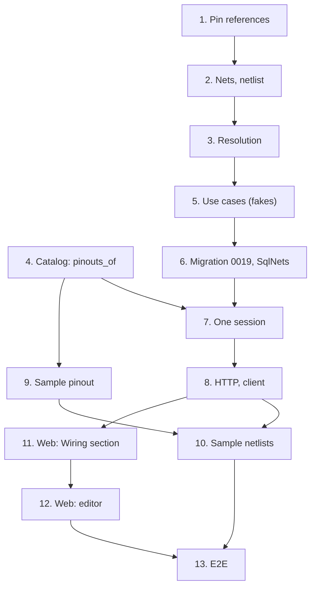

# Implementation Plan

## Overview

Thirteen tasks that build [design.md](design.md) against [requirements.md](requirements.md):
projects' pin vocabulary, references, nets and their resolution; catalog reading several
pinouts at once; the use cases, the migration and the repository; one session for projects and
catalog; the routes; the sample pinout and netlists; the web's Wiring section and its keyboard
editor; and the end-to-end journey. The phase-closing documentation is
[12-wiring-validation](../12-wiring-validation/requirements.md)'s last task, not one of these.

One migration, `0019_netlist.py`, moves the head from `0018` to `0019`. No new module and no new
ADR: `0014` stays free.

Branch first. Before task 1, run `git switch main && git pull && git switch -c
feat/netlist-editor`, and never commit this spec's work on `main`. This spec's
`requirements.md`, `design.md` and `tasks.md` reach `main` in the documentation commit that
started the phase (`docs: add the netlist editor spec`); if they aren't there yet, task 1's commit
adds them. The spec needs 10-build-lifecycle merged and `0.5.0` released first (10's notes).

One task, one commit, each passing `make check` **on its own** (AGENTS.md). `make coverage` on
tasks 4, 6, 7, 8 and 10; `make client` on 8, the regenerated client in that commit; `make e2e` on
8 and 11 to 13. A port that grows a method grows it in the same commit as its SQL implementation
and its fake, so bootstrap and mypy keep type-checking on every commit. Tick the task in this
file in the same commit. Suggested commit subjects are in `code` under each task.

Release footer: this spec is **the first of two** in `v0.6.0`, so no task carries `Release-As`;
12-wiring-validation's last task carries `Release-As: 0.6.0`. See
[Notes](#one-pr-per-spec-and-the-release).

## Tasks

- [x] 1. Projects: pin numbers and pin references
  - `projects/domain/pins.py`: `PinNumber`, `PinType`, `PinFacts`, `PartPins` with `numbered` and
    `matching`; `natural_key`.
  - `projects/domain/netlist.py`: `PinReference` and its order, `TypedReference.parse`,
    `parse_pin_list`; `InvalidPinReferenceError` in `errors.py`.
  - Tests: `test_pins.py` (`matching`'s order and case-folding, `natural_key`), `test_netlist.py`
    (properties 2 and 4).
  - Checks: `make check`.
  - `feat(projects): read pin references and order them the way schematics do`
  - _Requirements: 2.1, 2.2, 2.3, 2.5, 11.6_

- [x] 2. Projects: nets and the netlist
  - `NetName`, `WireColor`, `NetNotes`, `NetPins` (with `text`), `NetContent`, `Net`, `Netlist`;
    projects' `NetId`; the errors `invalid_net_name`, `net_name_taken`, `invalid_notes`,
    `repeated_pin`, `no_pins`, `too_many_pins`, `too_many_nets`, each a `ContentError` with its
    code and field.
  - Tests: `test_netlist.py` (properties 1 and 8 over the collection alone).
  - Checks: `make check`.
  - `feat(projects): model nets and a revision's netlist`
  - _Requirements: 1.2, 1.3, 1.5, 1.6, 1.7, 1.8, 1.9, 2.4, 2.7, 11.6_

- [x] 3. Projects: resolve references against the BOM and the pinouts
  - `ResolutionState`, `Resolution.of`, `TypedReference.resolve` (number, then label, then
    function), `NewNet` with `parse` and `content(bom, parts, pins, kept)`; the errors
    `unknown_designator`, `unknown_part`, `unknown_pin`, `ambiguous_pin` with its candidates.
  - Tests: `test_resolution.py` (properties 3, 5, 6 and 7, and Data Models' examples: `U1.GND`
    ambiguous on the sample DevKitC, `U2.SDA` stored `U2.3`).
  - Checks: `make check`.
  - `feat(projects): resolve pin references against the BOM and the pinouts`
  - _Requirements: 2.3, 2.4, 3.1, 3.2, 3.3, 3.4, 3.5, 3.6, 3.7, 3.8, 4.1, 4.2, 11.6_

- [x] 4. Catalog: several pinouts in one read
  - `Pinouts.of_parts` on the port, its fake and `SqlPinouts`, one `SELECT` ordered by part and
    position; `pinouts_of(work: CatalogRepositories, ids)` in `catalog/application/pinouts.py`.
  - Tests: `test_pinouts.py` (extended), `test_catalog_repositories.py` (order, a part with no
    pins absent, another workspace's part absent, one statement for many parts).
  - Checks: `make check`, `make coverage`.
  - `feat(catalog): read the pinouts of several parts in one query`
  - _Requirements: 7.2, 7.3, 11.3_

- [x] 5. Projects: the netlist use cases over fakes
  - Ports: `Nets`, `NetlistPins`, `NetlistUnitOfWork(BomUnitOfWork)`, `NetlistView` and its
    `summary`.
  - `projects/application/netlist.py`: `GetNetlist`, `AddNet`, `UpdateNet`, `RemoveNet`,
    `CopyNetlist`.
  - The in-memory unit of work gains `nets`, `parts` and `pins` fakes, registers `CopyNetlist`
    after `CopyBomLines`, and cascades nets with their revision and project.
  - Tests: `test_netlist_use_cases.py` (the lock before the reads, refusals before any write,
    `kept`, the no-op edit, `revision_locked`, `touch`, property 8 end to end); `test_fork.py`
    extended (property 9).
  - Checks: `make check`.
  - `feat(projects): add, edit, remove and read nets`
  - _Requirements: 1.1, 1.9, 1.10, 1.11, 1.12, 4.3, 4.5, 5.1, 5.2, 5.3, 5.5, 6.1, 6.2, 6.3, 6.4,
    11.6_

- [x] 6. Projects: the netlist tables in PostgreSQL
  - `orm.py`: `nets` and `net_pins`; `make migration m="netlist"`, hand-fixed into
    `0019_netlist.py` as Data Models says, with `isolate_by_workspace` on both tables.
  - `SqlNets` (two reads for a netlist, one insert for a net's pins, a delete and one insert on
    an edit); `SqlProjectsUnitOfWork` binds `nets`, registers `CopyNetlist(self.nets, self._ids)`
    after `CopyBomLines`, and clears `net_pins` and `nets` first in `_CLEAR_ORDER`.
  - `docs/adr/0007-workspace-isolation.md`: the list of isolated tables gains `nets` and
    `net_pins`.
  - Tests: `test_migrations.py` (the round trip; the CHECKs; the name index ignoring case; the
    composite keys refusing a cross-workspace net and reference);
    `test_projects_repositories.py` for `SqlNets`; a fork through Postgres copies the nets after
    the lines.
  - Checks: `make check`, `make coverage`.
  - `feat(projects): store nets and pin references in PostgreSQL`
  - _Requirements: 1.10, 5.5, 6.1, 6.3, 6.4, 8.1, 8.2, 11.2, 11.3_

- [x] 7. One session for projects and catalog
  - `bootstrap/netlist.py`: `CatalogNetlistPins` and `SqlNetlistUnitOfWork`, reusing 10's
    `CatalogBuildParts`. The use cases join `ProjectsUseCases` with their routes in task 8; the
    integration tests here build them over `SqlNetlistUnitOfWork` themselves.
  - Tests: `test_netlist_pins.py` (the translation; projects' and catalog's `PinNumber` agreeing
    on generated text, and their `PinType`s on every value); integration `test_netlist_reads.py`
    (nine statements for a read of one net and of sixty nets over forty parts; a write's fixed
    reads; a pinout replaced and a BOM line renumbered after a net was written leave the net and
    change its resolutions; as `wiredex_app`, another bench's nets unseen and its designators
    and parts unknown).
  - Checks: `make check`, `make coverage`.
  - `feat(projects): read pinouts on the netlist's own transaction`
  - _Requirements: 3.1, 4.3, 4.4, 5.4, 7.3, 8.1, 8.3, 11.1, 11.3_

- [x] 8. Projects: the netlist over HTTP
  - The schemas and four routes of design's HTTP section on projects' router, from
    `bootstrap/app.py`; `bootstrap/projects.py` wires the four use cases over
    `SqlNetlistUnitOfWork`; every netlist error in the router's error table as
    `NetRefusalResponse`.
  - `make client`, the regenerated client and its aliases in `packages/api-client/src/index.ts`
    in this commit; `src/test/server.ts`'s netlist routes.
  - Tests: `test_netlist_api.py` (every status and code, the wire-names test for the four
    unions), `test_netlist_auth.py` (401, 403 without CSRF, 404 across workspaces).
  - Checks: `make check`, `make coverage`, `make client`, `make e2e`.
  - `feat(projects): expose netlists over HTTP`
  - _Requirements: 1.4, 1.12, 5.1, 7.1, 7.2, 8.4, 8.5, 8.6, 11.4_

- [x] 9. The sample ESP32 board's pinout
  - `catalog/application/demo.py`: *ESP32-DevKitC* gains the 38 pins of Data Models.
  - Tests: `test_demo.py` in catalog (the pinout's size, its input-only pins, three `GND`s).
  - Checks: `make check`.
  - `feat(catalog): give the sample ESP32 board its header pinout`
  - _Requirements: 9.1_

- [x] 10. Sample netlists in the demo
  - `projects/application/demo.py`: `SampleNet`, the nets of design's demo table, `B`'s edits
    through `UpdateNet`, each revision's nets written before any reserve;
    `bootstrap/projects_demo.py` builds `AddNet` and `UpdateNet` over `SqlNetlistUnitOfWork`.
  - Tests: `test_demo.py` in projects (the nets, their resolutions, `B`'s copy and edits,
    *Greenhouse controller* `A` wired and reserved); `test_demo_cli.py` (a reset and an
    invitation restore the same netlists).
  - Checks: `make check`, `make coverage`.
  - `feat(projects): seed the demo bench with sample netlists`
  - _Requirements: 5.6, 9.2, 9.3, 9.4, 9.5_

- [x] 11. Web: the Wiring section
  - `styles.css`: the ten `--color-wire-*` tokens. `features/projects/netlist/`: `netlist.ts`
    (the query), `wireColors.ts`, `PinChip`, `NetRow` read-only, `NetlistSection` in
    `RevisionPanel` after `BomSection`, with its summary and the lock message.
  - `projects.netlist.*` keys for the section, the ten colors and the five resolutions, in
    `en.json` and `pt-BR.json`.
  - Tests: Vitest beside each component, by role and accessible name; each resolution's chip
    says its state in words.
  - Checks: `make check`, `make e2e`.
  - `feat(web): show a revision's wiring`
  - _Requirements: 10.1, 10.2, 10.5, 10.9, 10.11, 10.13_

- [x] 12. Web: wire a revision from the keyboard
  - `pinList.ts`, `PinListInput`, `WireColorSelect`, `NetAddRow`, `NetRow`'s edit mode and
    in-row removal, `refusal.ts`; the add, update and remove mutations. BOM writes and
    transitions invalidate the netlist query. Refusal keys for every code in both locales.
  - Tests: Vitest beside each component: the add row by keyboard alone, the combobox's
    designators, then pins by number and label, chosen with the arrows and Enter; Escape
    restoring an edit; each refusal on its field naming the reference; the web suite at or
    above 85 %.
  - Checks: `make check`, `make e2e`.
  - `feat(web): write a netlist from the keyboard`
  - _Requirements: 10.3, 10.4, 10.6, 10.7, 10.8, 10.10, 10.11, 10.12, 10.13, 11.5_

- [x] 13. E2E: the netlist journey
  - `e2e/tests/netlist.spec.ts` on the shared session, names from `Date.now()`: the journey of
    design's Testing Strategy.
  - In the Pixel 7 project, the revision page with its netlist and the open combobox have no
    horizontal page overflow.
  - Checks: `make check`, `make e2e`.
  - `test(e2e): cover writing a netlist, its unresolved pins and its fork`
  - _Requirements: 3.6, 4.4, 5.1, 6.1, 10.2, 10.3, 10.4, 10.6, 10.8, 10.9, 10.13_

## Task Dependency Graph



```json
{
  "waves": [
    {
      "wave": 1,
      "tasks": [
        { "id": "1", "name": "Pin references", "dependsOn": [] },
        { "id": "4", "name": "Catalog: pinouts_of", "dependsOn": [] }
      ]
    },
    {
      "wave": 2,
      "tasks": [
        { "id": "2", "name": "Nets, netlist", "dependsOn": ["1"] },
        { "id": "9", "name": "Sample pinout", "dependsOn": ["4"] }
      ]
    },
    { "wave": 3, "tasks": [{ "id": "3", "name": "Resolution", "dependsOn": ["2"] }] },
    { "wave": 4, "tasks": [{ "id": "5", "name": "Use cases (fakes)", "dependsOn": ["3"] }] },
    { "wave": 5, "tasks": [{ "id": "6", "name": "Migration 0019, SqlNets", "dependsOn": ["5"] }] },
    { "wave": 6, "tasks": [{ "id": "7", "name": "One session", "dependsOn": ["4", "6"] }] },
    { "wave": 7, "tasks": [{ "id": "8", "name": "HTTP, client", "dependsOn": ["7"] }] },
    {
      "wave": 8,
      "tasks": [
        { "id": "10", "name": "Sample netlists", "dependsOn": ["8", "9"] },
        { "id": "11", "name": "Web: Wiring section", "dependsOn": ["8"] }
      ]
    },
    { "wave": 9, "tasks": [{ "id": "12", "name": "Web: editor", "dependsOn": ["11"] }] },
    { "wave": 10, "tasks": [{ "id": "13", "name": "E2E", "dependsOn": ["10", "12"] }] }
  ]
}
```

Reading it:

- **Roots.** 1 (projects) and 4 (catalog) depend on no task here. The spec as a whole needs
  10-build-lifecycle on `main` and `0.5.0` released; that is a phase-level dependency, not a task
  edge.
- **Critical path.** 1 → 2 → 3 → 5 → 6 → 7 → 8 → 11 → 12 → 13, one task per wave. The catalog
  side (4, then 9) runs beside it and joins at 7 and 10.
- **10 after 8.** The demo writes nets through `AddNet` over `SqlNetlistUnitOfWork`, which 7
  builds and 8 wires; it waits for 8 rather than 7 so the demo and the routes agree on one wiring.
- **11 and 12 in line.** Both write the locale files and `src/test/server.ts`, so they don't share
  a wave.

## Notes

### Before pushing

- `make check` on every commit, not only the last.
- `make coverage` on 4, 6, 7, 8 and 10: API floor 90 %, web floor 85 %.
- `make client` in 8, whose commit carries the regenerated client; afterwards `make client` must
  leave the package unchanged, or CI's contract gate fails.
- `make e2e` on 8 and on 11 to 13.
- `wiredex db check` clean at `0019`.

### One PR per spec, and the release

Open this spec's PR from `feat/netlist-editor`, based on `main` once `0.5.0` is released, and turn
on auto-merge with `gh pr merge N --rebase --auto`. Its commits then wait on `main` for
12-wiring-validation, whose last task carries `Release-As: 0.6.0`; the release PR release-please
opens after that is the owner's to merge, which deploys to production (AGENTS.md, Safety), never
an agent's.
