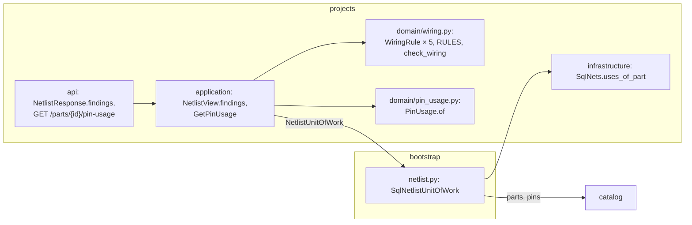

# Design Document: wiring validation

## Overview

The last of two specs in `v0.6.0` Wiring. It delivers the phase's roadmap lines *Validation
rules (unknown pin, pin reuse, voltage mismatch, input-only driven)* and *Pin usage view per
part ("what's on GPIO4?")*, and closes the phase with the documentation commit that carries
`Release-As: 0.6.0`. It builds [ADR 0004](../../../docs/adr/0004-netlist-and-pinouts.md)'s
last sentence, *validation is a list of independent rules (Strategy / Open-Closed); each rule
returns errors and warnings*, over what
[11-netlist-editor](../11-netlist-editor/design.md) built: nets, their pin references stored as
text, and `Resolution.of`, which says at every read what each reference names today.

Nothing new is stored and no migration is needed. Findings are computed from the view 11's
`GetNetlist` already assembles, in the same nine statements (decisions 1 and 2), as 09's
shortage report is computed from the BOM. The pin usage view is one new read: a join from
11's `net_pins` through 09's `bom_designators` and `bom_lines` to one part (decision 7).

**Owner decisions that bind this spec**, and what each does here:

- **`v0.6.0` is two specs**; this one holds the four rules and the pin usage view (2026-09-29).
- **A reference that stops resolving is a validation error to fix**, never a blocked edit
  (2026-09-29). 11's three unresolved states are the *unknown pin* rule's errors (decision 3).
- **A part with no pinout is a warning, *no pinout, pins not checked*, not an error**
  (2026-09-29). One warning per such part, naming its wired designators (decision 3).
- **Findings never block a reserve**; they show as warnings in the reserve dialog
  (2026-09-29). Nothing here touches 10's transitions (decision 9).
- **Input-only driven means a net whose only possible signal sources are input-only pins, so
  nothing drives it** (2026-09-29, confirming requirement 5's reading). Decision 6.
- **A connected `nc` pin and a net joining power to ground stay out of `v0.6.0`** (2026-09-29).
  They are later rules, each a new strategy (decision 1).
- **One PR per spec with auto-merge; the release PR waits for this spec, and only the owner
  merges it** (2026-09-27). This spec's last task carries `Release-As: 0.6.0`.

**Decisions this spec makes (2026-09-29), for the owner to check:**

1. **A rule is a small domain class, and the rules are a tuple.** `projects/domain/wiring.py`
   holds the `WiringRule` protocol (`code`, `check(facts) -> Iterable[Finding]`), the five
   rules and `RULES`, the tuple of them in their reporting order. `check_wiring(facts)` runs
   every rule and orders what they return. A rule sees only `WiringFacts`, the netlist and each
   reference's `Resolution`, never another rule's findings (requirement 1.2). Adding a rule is
   one class and one entry in `RULES` (requirement 11.1).
2. **Findings ride the netlist read.** `NetlistView` gains `findings()`, and
   `NetlistResponse` gains `findings` and the summary's `errors` and `warnings`. There is no
   endpoint of its own: every screen that shows wiring shows its findings, the read is already
   fixed at nine statements, and a second request would only be a second chance to disagree
   with the first (requirements 1.1, 1.4, 11.3).
3. **Five rules for the owner's four.** *Unknown pin* is two classes, because its errors and
   its warning count differently:
   - `UnresolvedReferences`: an **error** per unresolved reference, its code the state, so
     `unknown_designator`, `unknown_part` or `unknown_pin` (requirements 2.1 to 2.3).
   - `PartsWithoutPinout`: a **warning** `no_pinout` per part with an unchecked reference,
     naming the part and its wired designators as canonical text, `R1–R3` (requirement 2.4).
   - `PinReused`: an **error** `pin_reused` per stored reference in two or more nets, naming
     every net, whatever the reference resolves to (requirement 3).
   - `VoltageMismatch`: an **error** `voltage_mismatch` per net whose resolved pins with a level
     don't all share it, grouping the references by level (requirement 4).
   - `InputOnlyUndriven`: an **error** `input_only_undriven` per net of two or more references
     holding a resolved `input` pin and no driver (requirement 5, decision 6).
4. **A finding names things by value, not by id alone.** `Finding(code, severity, net_ids,
   references, part, levels)`: the nets it is about, in netlist order; the references, in
   canonical order; for `no_pinout` and `unknown_pin` the part's facts; for
   `voltage_mismatch` each level with its references. The web writes its sentence from these
   and the code, and the API also answers an English `message`, as every refusal does.
5. **Order: errors first, then `RULES` order, then the first net named, then the first
   reference** (requirement 1.3). A finding with no net, none today, would sort last in its
   rule. The order is total, so a Hypothesis property can hold it.
6. **A driver is anything that can supply a signal**, and an unchecked pin counts as one. A
   resolved pin of type `output`, `io`, `power`, `ground`, `analog` or `other` drives; so does
   an unchecked reference, since a resistor to 3V3 is how a pull-up drives an input. An `input`
   or `nc` pin, and an unresolved reference, don't. So *Greenhouse controller* `A`'s `SOIL`,
   GPIO34 with its divider resistors, is fine, and GPIO34 wired only to a sensor's `CSB` is
   an error. A net of one reference is a wire still being made, not an error (requirement 5.3).
7. **Pin usage is one join, read on the netlist's session.** `Nets.uses_of_part(part_id)`
   selects from `net_pins` joined to `bom_designators` on `(workspace_id, revision_id,
   designator)`, to `bom_lines` on the line with `part_id` equal to the part, and to `nets`,
   `revisions` and `projects` for the names. The rows are ordered after the read by the
   project's name folded, the revision's `created_at` and the designator in its canonical
   order, since text would put R10 before R2. `GetPinUsage` asks catalog's `describe` (a 404
   for a part the workspace doesn't hold; it reads the part and its category tree) and
   `pins.of_parts` for the pinout: five statements with the setting, whatever the number of
   pins, revisions and nets (requirement 7.5). 11's `ix_net_pins_reference` and 09's key on
   `bom_designators` serve the join.
8. **A use names its revision's status, and every status counts.** A built revision is where a
   board's wiring matters most, and a draft is where it is being planned; the table shows both,
   and the status says which (requirement 7.1). Pins come in their saved order, each with its
   uses; references whose number the pinout lacks, and every reference of a part with no
   pinout, come after as *other pins*, by natural order (requirement 7.2).
9. **The web shows findings where the wiring is, and in the reserve dialog.** `NetlistSection`
   gains `FindingsList` under the table, errors first, each linking to the net rows it names
   (anchors `#net-<id>`), and a line when there are none; `PinChip` gains the severity of the
   worst finding naming it, in words and an icon. `ReserveDialog` reads `useNetlist` and lists
   the findings as warnings above its *Reserve* button, which stays enabled (requirement 6).
10. **Pin usage sits on the part page, beside the pinout.** `PinUsageSection` in
    `features/projects/netlist/`, rendered by catalog's `PartPage` under `PinoutSection`, as
    inventory's `PartHoldings` renders projects' data on the part's stock. It shows for a part
    with a pinout or with any reference; a filter box keeps pins whose number, label or
    function contains the text (requirement 10.6).
11. **Every write that changes wiring refreshes pin usage too.** A root `pinUsageKeys.all`,
    dropped by net writes, BOM writes, pinout saves and transitions (requirement 10.7).
12. **No migration and no new ADR.** The phase-closing task writes ADR 0004's *Implementation
    (v0.6)* section for 11 and this spec, ADR 0001's third shared-session use, and
    docs/architecture.md's §5 line on "pin in ≤ 1 net", now a finding (After this spec).

**Requirement 2.5 is reworded** from "leave it out of the voltage and input-only rules" to
"leave it out of the voltage rule, and count an unchecked one as a possible driver in the
input-only rule": read literally, the old wording contradicted the glossary's *driver*, which
counts an unchecked reference, and would flag every input pulled up through a resistor.

**Seen while designing, not changed here:** the sample BME280's `SDO` is typed `output` and
wired to ground for address 0x76. That is correct wiring, and no rule here looks at it. A later
*output driven by power or ground* rule would need an exception for strapping pins, which is
one more reason the owner kept power and ground rules out of this phase.

**In scope:** `WiringFacts`, `Finding`, `Severity`, `FindingCode`, the five rules, `RULES` and
`check_wiring`; findings in `NetlistView` and `NetlistResponse`; `Nets.uses_of_part`,
`PinUsage` and `GetPinUsage` with its route; the web's findings list, chip markers, reserve
dialog warnings and pin usage section; the demo's findings and pin usage; the E2E journey; the
phase's closing documentation.

**Out of scope:** a connected `nc` pin, power joined to ground, unconnected power pins, and
every other rule (owner, later strategies); blocking a reserve or build on findings (owner);
suppressing a finding by hand; pin usage across workspaces; a wiring diagram (*Later*).

## Architecture



## Components and Interfaces

### Projects: the rules

`apps/api/src/wiredex/projects/domain/wiring.py`:

```python
class Severity(StrEnum):
    ERROR = "error"
    WARNING = "warning"


class FindingCode(StrEnum):
    UNKNOWN_DESIGNATOR = "unknown_designator"
    UNKNOWN_PART = "unknown_part"
    UNKNOWN_PIN = "unknown_pin"
    NO_PINOUT = "no_pinout"
    PIN_REUSED = "pin_reused"
    VOLTAGE_MISMATCH = "voltage_mismatch"
    INPUT_ONLY_UNDRIVEN = "input_only_undriven"


@dataclass(frozen=True, slots=True)
class VoltageGroup:
    voltage: Decimal
    references: tuple[PinReference, ...]  # canonical order


@dataclass(frozen=True, slots=True)
class Finding:
    code: FindingCode
    severity: Severity
    net_ids: tuple[NetId, ...]  # netlist order
    references: tuple[PinReference, ...]  # canonical order
    part: PartFacts | None = None  # no_pinout, unknown_pin
    levels: tuple[VoltageGroup, ...] = ()  # voltage_mismatch, ascending


@dataclass(frozen=True, slots=True)
class WiringFacts:
    """All a rule may see: the nets in order, and what each stored reference resolves to."""

    netlist: Netlist
    resolutions: Mapping[PinReference, Resolution]


class WiringRule(Protocol):
    code: ClassVar[FindingCode]

    def check(self, facts: WiringFacts) -> Iterable[Finding]: ...


RULES: tuple[WiringRule, ...] = (
    UnresolvedReferences(),
    PinReused(),
    VoltageMismatch(),
    InputOnlyUndriven(),
    PartsWithoutPinout(),
)


def check_wiring(facts: WiringFacts, rules: Sequence[WiringRule] = RULES) -> tuple[Finding, ...]:
    """Every rule's findings, errors first, then by rule, first net and first reference."""
```

`UnresolvedReferences` emits one finding per (net, unresolved reference); a reference
unresolved in two nets is two findings, since each net needs fixing. `PinReused` emits one
finding per reference, naming every net holding it. `DRIVES = {output, io, power, ground,
analog, other}` lives beside `InputOnlyUndriven`.

### Projects: pin usage

`apps/api/src/wiredex/projects/domain/pin_usage.py`:

```python
@dataclass(frozen=True, slots=True)
class PinUse:
    """One net of one revision that a pin of the part is on, through one designator."""

    project_id: ProjectId
    project_name: ProjectName
    revision_id: RevisionId
    revision_label: RevisionLabel
    status: RevisionStatus
    designator: Designator
    pin: PinNumber
    net_id: NetId
    net_name: NetName
    color: WireColor | None


@dataclass(frozen=True, slots=True)
class PinUsage:
    part: PartFacts
    pins: tuple[tuple[PinFacts, tuple[PinUse, ...]], ...]  # saved order; empty uses = free
    others: tuple[tuple[PinNumber, tuple[PinUse, ...]], ...]  # natural order

    @classmethod
    def of(cls, part: PartFacts, pinout: PartPins | None, uses: Sequence[PinUse]) -> PinUsage: ...
```

`Nets.uses_of_part(part_id) -> list[PinUse]` joins as decision 7 says, the uses already in
the order requirement 7.4 gives; its fake filters the in-memory stores the same way.

### Projects: application

- `NetlistView.findings()` builds `WiringFacts` from its nets and `resolution()`, and calls
  `check_wiring`; `NetlistSummary` gains `errors` and `warnings`.
- `GetPinUsage(unit_of_work)`: opens the `NetlistUnitOfWork`, `parts.describe([part_id])`
  (`PartNotFoundError`, 404, when absent), `pins.of_parts([part_id])`,
  `nets.uses_of_part(part_id)`, then `PinUsage.of`.

### HTTP

`NetlistResponse` gains `findings: list[FindingResponse]`; `NetlistSummaryResponse` gains
`errors` and `warnings`.

```python
type FindingCodeName = Literal["unknown_designator", "unknown_part", "unknown_pin",
                               "no_pinout", "pin_reused", "voltage_mismatch",
                               "input_only_undriven"]
type SeverityName = Literal["error", "warning"]


class VoltageGroupResponse(BaseModel):
    voltage: str
    refs: list[str]


class FindingResponse(BaseModel):
    code: FindingCodeName
    severity: SeverityName
    message: str  # English; the web writes its own from the code and fields
    net_ids: list[UUID]
    nets: list[str]
    refs: list[str]
    part_id: UUID | None
    part_name: str | None
    designators: str | None  # canonical text, no_pinout only
    levels: list[VoltageGroupResponse]
```

`GET /api/projects/parts/{part_id}/pin-usage` answers `PinUsageResponse`: `part_id`,
`part_name`, `has_pinout`, `pins` (each `NetlistPinResponse` plus `uses`), and `others` (each
`pin` plus `uses`); a use is `PinUseResponse` (`project_id`, `project_name`, `revision_id`,
`revision_label`, `status`, `designator`, `net_id`, `net_name`, `color`). 404 for a part the
workspace doesn't hold; 401 without a session.

### Web

| File | What |
| --- | --- |
| `netlist/FindingsList.tsx` | The findings under the table: severity in words and icon, the sentence, links to the nets named |
| `netlist/findings.ts` | Each code's i18n key and arguments; the worst severity per reference, for chips |
| `netlist/PinChip.tsx` | Gains `severity`: *error* or *warning* in words beside the existing marker |
| `netlist/NetRow.tsx` | Gains `id="net-<id>"`, the anchor a finding links to |
| `build/ReserveDialog.tsx` | Lists the netlist's findings as warnings; *Reserve* stays enabled |
| `netlist/pinUsage.ts` | `pinUsageKeys`, `usePinUsage(partId)` |
| `netlist/PinUsageSection.tsx` | The part page's table: pin, label, the nets on it with project, revision and status, links; free pins; *other pins*; a filter box |
| `catalog/PartPage.tsx` | Renders `PinUsageSection` under `PinoutSection` |

Keys under `projects.netlist.findings.*` and `projects.pinUsage.*` in both locales. Net
writes, BOM writes, pinout saves and transitions invalidate `pinUsageKeys.all`.

### The demo bench

Nothing new is seeded. After a restore the sample netlists answer no errors, and one
no-pinout warning per passive part they wire: two on *Weather station* `A` (*Resistor 4k7
0805* on R1, R2 and *Capacitor 100n 0603 X7R* on C1), three on `B` (the same two and
*Capacitor 2u2 0805 X5R* on C2, C3), and two on *Greenhouse controller* `A` (*Resistor 10k
0603* on R1–R3 and the 100n on C1). The DevKitC's pin usage answers GPIO34 on
*Greenhouse controller* `A`'s `SOIL`, and GPIO21 on `SDA` of both weather stations
(requirement 9).

## Data Models

No migration. `0019`'s `ix_net_pins_reference (workspace_id, revision_id, designator, pin)`
and `bom_designators`' key `(workspace_id, revision_id, designator)` make the pin usage join an
index join on both sides, and `ix_bom_lines_part (workspace_id, part_id)` picks the part's lines.

```json
GET /api/projects/revisions/0192…/netlist → "findings": [
  { "code": "voltage_mismatch", "severity": "error",
    "message": "the net VCC joins 3.3 V and 5 V pins",
    "net_ids": ["0192…"], "nets": ["VCC"], "refs": ["U1.1", "U1.19"],
    "part_id": null, "part_name": null, "designators": null,
    "levels": [ { "voltage": "3.3", "refs": ["U1.1"] }, { "voltage": "5", "refs": ["U1.19"] } ] },
  { "code": "no_pinout", "severity": "warning",
    "message": "Resistor 4k7 0805 has no pinout, so R1, R2 aren't checked",
    "net_ids": ["0192…", "0192…"], "nets": ["3V3", "SDA"], "refs": ["R1.1", "R1.2"],
    "part_id": "0192…", "part_name": "Resistor 4k7 0805", "designators": "R1, R2", "levels": [] }
]
```

## Correctness Properties

### Property 1: each rule finds exactly its own case

For any netlist and resolutions, `UnresolvedReferences` finds exactly the (net, reference)
pairs whose state is unresolved; `PinReused` exactly the references in two or more nets;
`VoltageMismatch` exactly the nets whose resolved levels differ; `InputOnlyUndriven` exactly
the nets of two or more references with a resolved input pin and no driver; and
`PartsWithoutPinout` exactly the parts with an unchecked reference.

### Property 2: rules are independent

For any facts and any subset of `RULES`, `check_wiring` with the subset answers exactly the
findings of the full run whose code belongs to the subset.

### Property 3: the order is total and errors come first

For any facts, `check_wiring`'s answer is sorted by (severity, rule position, first net's
position, first reference), and shuffling the netlist's nets changes it only by that order.

### Property 4: pin usage partitions the uses

For any pinout and uses, every use lands exactly once, under its pin when the pinout holds its
number and under *other pins* otherwise; every pin of the pinout appears once, in saved order.

### Property 5: levels compare exactly

For any levels, `3.3`, `3.30` and `3V3` read as one, and a net with one level and any number of
pins without a level has no mismatch.

## Error Handling

| Case | Status |
| --- | --- |
| Pin usage of a part the workspace doesn't hold, another workspace's included | 404 |
| Netlist or pin usage without a session | 401 |
| Findings | never an error: they are data in a 200 |

## Testing Strategy

| Level | Files | What |
| --- | --- | --- |
| Domain | `test_wiring.py`, `test_pin_usage.py` | Properties 1 to 5; each rule's examples, the demo's `SOIL` and `CSB` cases |
| Application | `test_netlist_use_cases.py`, `test_pin_usage_use_cases.py` | Findings in the view and summary; `GetPinUsage`'s 404, order and partition |
| Integration | `test_netlist_reads.py`, `test_pin_usage_reads.py`, `test_demo_cli.py` | Still nine statements with findings; pin usage in five across three projects; another bench unseen; the demo's warnings and GPIO34 |
| HTTP | `test_netlist_api.py`, `test_pin_usage_api.py`, `test_pin_usage_auth.py` | The finding shapes and wire-names test; 404 and 401 |
| Web | beside each component | The findings list and links, chip severity in words, the reserve dialog's warnings with *Reserve* enabled, the pin usage table and its filter |
| E2E | `e2e/tests/wiring-rules.spec.ts` | Below |

The journey: a part with a 3.3 V pin, a 5 V pin and an input-only pin, and a resistor. A net
joining 3.3 V and 5 V shows a voltage error naming both levels. The same pin in two nets
shows a reuse error. An input-only pin wired only to another input shows an input-only
error, cleared by adding the resistor. The resistor's no-pinout warning is shown. Reserving
lists the findings as warnings and still reserves. The part page's pin usage shows the nets
on each pin, and the filter narrows it. On a Pixel 7 there is no sideways scroll.

## Seams for later specs

| Seam | For | What it is |
| --- | --- | --- |
| `WiringRule`, `RULES` | later rules | `nc` connected, power to ground, unconnected power: one class and one entry each |
| `Nets.uses_of_part`, `PinUsage` | 13-firmware-versions, 18-dashboard | Which boards use a pin, for a firmware's pin map and the dashboard's part view |
| `NetlistView.findings` | 18-dashboard | Wiring errors across revisions |

## After this spec

The phase ships whole, so this spec's last task is the phase-closing documentation commit,
carrying `Release-As: 0.6.0`. It writes:

- **README.md**: ticks the three `v0.6.0` lines.
- **ADR 0004, a new "Implementation (v0.6)" section**, in two parts. 11's part is as its After
  this spec words it, with the implementation note naming the `pins` key as the reference's
  target corrected. This spec's part: the rules are Strategy classes over the netlist and its
  resolutions, in one tuple; the five rules and their severities; findings are computed at
  every read and stored nowhere; a driver includes an unchecked pin; `nc` and power-to-ground
  rules are left for later (owner, 2026-09-29); pin usage is one join from references through
  designators to a part.
- **ADR 0001** gains the third use of 07's shared-session pattern, `bootstrap/netlist.py`.
- **docs/architecture.md**: §5's "pin in ≤ 1 net" becomes *pin reused*, a finding; §4's
  `PIN_REF }o--|| BOM_LINE` edge is labelled *by designator, resolved at read*.
- **AGENTS.md** only where one of its rules changed.
- **No new ADR**: `0014` is still free.
