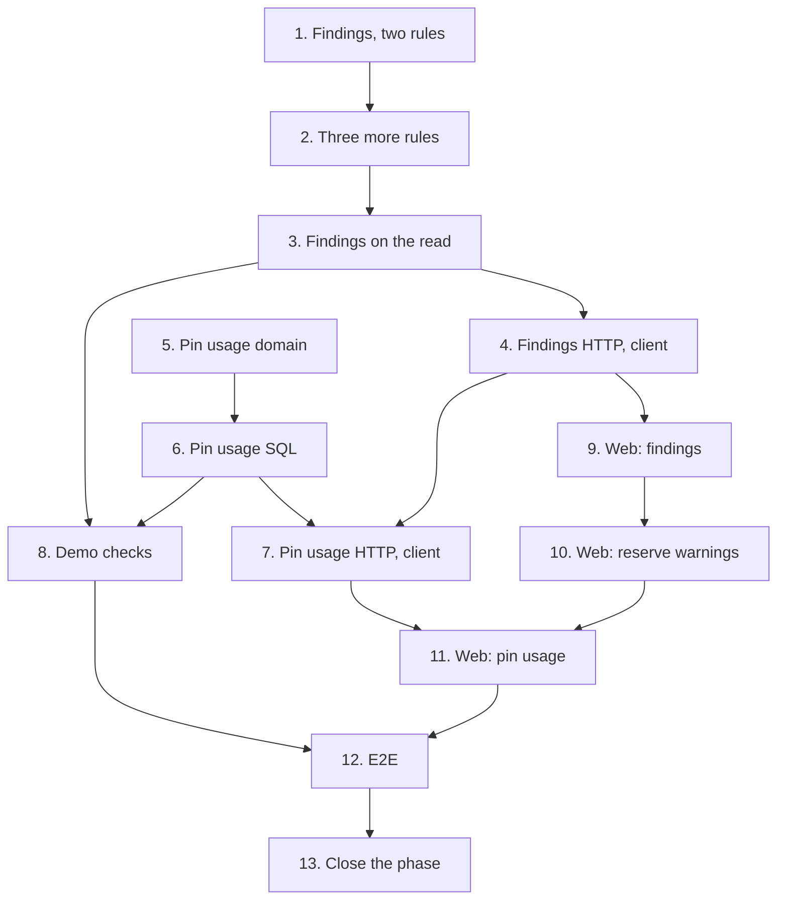

# Implementation Plan

## Overview

Thirteen tasks that build [design.md](design.md) against [requirements.md](requirements.md):
the findings model and the five rules; findings on 11's netlist read and over HTTP; pin usage
in the domain, in PostgreSQL and over HTTP; the demo's findings and pin usage; the web's
findings list, chip markers, reserve dialog warnings and pin usage section; the end-to-end
journey; and the phase-closing documentation.

No migration: the head stays at `0019`. No new module and no new ADR: `0014` stays free.

Branch first. Before task 1, 11-netlist-editor must be on `main`; then `git switch main && git
pull && git switch -c feat/wiring-validation`, and never commit this spec's work on `main`.
This spec's `requirements.md`, `design.md` and `tasks.md` reach `main` with 11's PR or in a
documentation commit of their own; if they aren't there yet, task 1's commit adds them.

One task, one commit, each passing `make check` **on its own** (AGENTS.md). `make coverage` on
tasks 3, 6, 7 and 8; `make client` on 4 and 7, the regenerated client in that commit; `make
e2e` on 4, 7 and 9 to 12. A port that grows a method grows it in the same commit as its SQL
implementation and its fake. Tick the task in this file in the same commit. Suggested commit
subjects are in `code` under each task.

Release footer: this spec is **the last of two** in `v0.6.0`, so task 13 carries
`Release-As: 0.6.0`, on a commit that changes files; no other task does. See
[Notes](#one-pr-per-spec-and-the-release).

## Tasks

- [x] 1. Projects: findings, and the unresolved and no-pinout rules
  - `projects/domain/wiring.py`: `Severity`, `FindingCode`, `VoltageGroup`, `Finding`,
    `WiringFacts`, the `WiringRule` protocol, `UnresolvedReferences`, `PartsWithoutPinout`, and
    `check_wiring` with decision 5's order.
  - Tests: `test_wiring.py`, property 1 for these two rules and property 3; an unresolved
    reference in two nets is two findings; one warning per part, its designators as canonical
    text.
  - Checks: `make check`.
  - `feat(projects): report unresolved pins and parts without a pinout`
  - _Requirements: 1.2, 1.3, 1.6, 2.1, 2.2, 2.3, 2.4, 2.5, 11.1, 11.2, 11.6_

- [x] 2. Projects: pin reused, voltage mismatch and input-only undriven
  - `PinReused`, `VoltageMismatch`, `InputOnlyUndriven` with `DRIVES`, and `RULES` in its
    reporting order.
  - Tests: `test_wiring.py`, property 1 for these three, properties 2 and 5; the demo's `SOIL`
    (GPIO34 and two unchecked resistors: nothing) and GPIO34 wired only to a `CSB` (an error);
    a net of one reference (nothing).
  - Checks: `make check`.
  - `feat(projects): report reused pins, voltage mismatches and undriven inputs`
  - _Requirements: 3.1, 3.2, 4.1, 4.2, 4.3, 5.1, 5.2, 5.3, 11.1, 11.6_

- [x] 3. Projects: findings on the netlist read
  - `NetlistView.findings()` over `WiringFacts`; `NetlistSummary` gains `errors` and
    `warnings`.
  - Tests: `test_netlist_use_cases.py` (findings in the view and its summary, whatever the
    revision's status; a reserve of a revision with findings reserves as before);
    integration `test_netlist_reads.py` (still nine statements with findings answered).
  - Checks: `make check`, `make coverage`.
  - `feat(projects): check a revision's wiring at every netlist read`
  - _Requirements: 1.1, 1.4, 1.5, 6.1, 6.2, 6.3, 11.3_

- [ ] 4. Projects: findings over HTTP
  - `FindingCodeName`, `SeverityName`, `VoltageGroupResponse`, `FindingResponse` with its
    English `message`; `NetlistResponse.findings`; the summary's `errors` and `warnings`.
  - `make client`, the regenerated client and its aliases in this commit; `src/test/server.ts`'s
    `aNetlist` answers `findings: []` and counts them in its summary.
  - Tests: `test_netlist_api.py` (the finding shapes, the wire-names test for the two unions).
  - Checks: `make check`, `make client`, `make e2e`.
  - `feat(projects): answer a netlist's findings over HTTP`
  - _Requirements: 1.1, 1.5, 11.4_

- [ ] 5. Projects: pin usage in the domain
  - `projects/domain/pin_usage.py`: `PinUse`, `PinUsage.of` (pins in saved order, free pins,
    *other pins* in natural order, a part with no pinout all under *other pins*).
  - Tests: `test_pin_usage.py` (property 4).
  - Checks: `make check`.
  - `feat(projects): group a part's pin uses by pin`
  - _Requirements: 7.1, 7.2, 7.3, 11.6_

- [ ] 6. Projects: pin usage in PostgreSQL
  - `Nets.uses_of_part` on the port, its fake and `SqlNets`, decision 7's one join and order;
    `GetPinUsage` over `NetlistUnitOfWork`, a 404 for a part the workspace doesn't hold.
  - Tests: `test_pin_usage_use_cases.py`; integration `test_pin_usage_reads.py` (four
    statements for a part used by nets of three projects; the order of requirement 7.4; every
    revision status; another bench's nets unseen as `wiredex_app`).
  - Checks: `make check`, `make coverage`.
  - `feat(projects): find every net on a part's pins`
  - _Requirements: 7.1, 7.4, 7.5, 7.6, 8.1, 8.2_

- [ ] 7. Projects: pin usage over HTTP
  - `GET /api/projects/parts/{part_id}/pin-usage`, `PinUsageResponse` and `PinUseResponse`;
    `ProjectsUseCases` gains `get_pin_usage`, wired over `SqlNetlistUnitOfWork` in
    `bootstrap/projects.py`.
  - `make client`, the regenerated client and its aliases in this commit; `src/test/server.ts`
    gains `aPinUsage` and `respondWithPinUsage`.
  - Tests: `test_pin_usage_api.py`, `test_pin_usage_auth.py` (401, 404 across workspaces).
  - Checks: `make check`, `make coverage`, `make client`, `make e2e`.
  - `feat(projects): expose a part's pin usage over HTTP`
  - _Requirements: 7.6, 8.2, 8.3, 11.4_

- [ ] 8. Findings and pin usage in the demo
  - No new seed. Tests: `test_demo.py` in projects (no errors; two, three and two no-pinout
    warnings on the three sample revisions); integration `test_demo_cli.py` (after a reset,
    the DevKitC's GPIO34 on the greenhouse's `SOIL` and GPIO21 on both weather stations'
    `SDA`).
  - Checks: `make check`, `make coverage`.
  - `test(projects): check the demo bench's wiring and the board's pin usage`
  - _Requirements: 9.1, 9.2_

- [ ] 9. Web: findings under the wiring and on its chips
  - `features/projects/netlist/`: `findings.ts`, `FindingsList` under the table, `PinChip`'s
    severity in words, `NetRow`'s `net-<id>` anchor, the summary's counts.
  - `projects.netlist.findings.*` keys for the seven codes and two severities, in both locale
    files.
  - Tests: Vitest beside each component: errors before warnings, links to the named nets, the
    no-findings line, a chip's severity in words.
  - Checks: `make check`, `make e2e`.
  - `feat(web): show a revision's wiring findings`
  - _Requirements: 10.1, 10.2, 10.3, 10.8, 10.9, 10.10_

- [ ] 10. Web: wiring warnings in the reserve dialog
  - `ReserveDialog` reads `useNetlist` and lists its findings as warnings; *Reserve* stays
    enabled. Keys in both locales.
  - Tests: `ReserveDialog.test.tsx` extended: warnings listed, the reserve still sent.
  - Checks: `make check`, `make e2e`.
  - `feat(web): warn about wiring findings before a reserve`
  - _Requirements: 6.1, 10.4, 10.8, 10.9_

- [ ] 11. Web: pin usage on the part page
  - `pinUsage.ts` (`pinUsageKeys`, `usePinUsage`), `PinUsageSection` with its filter box,
    rendered by `PartPage` under `PinoutSection`; net writes, BOM writes, pinout saves and
    transitions drop `pinUsageKeys.all`. `projects.pinUsage.*` keys in both locales.
  - Tests: Vitest beside each component: pins with their nets and links, free pins, *other
    pins*, the filter by number, label and function; the web suite at or above 85 %.
  - Checks: `make check`, `make e2e`.
  - `feat(web): show what is wired to each pin of a part`
  - _Requirements: 7.3, 10.5, 10.6, 10.7, 10.8, 10.9, 10.10, 11.5_

- [ ] 12. E2E: the wiring rules journey
  - `e2e/tests/wiring-rules.spec.ts` on the shared session, names from `Date.now()`: the
    journey of design's Testing Strategy.
  - In the Pixel 7 project, the findings, the reserve dialog and the pin usage table have no
    horizontal page overflow.
  - Checks: `make check`, `make e2e`.
  - `test(e2e): cover the wiring rules and a part's pin usage`
  - _Requirements: 3.1, 4.1, 5.1, 6.1, 7.1, 10.1, 10.2, 10.4, 10.5, 10.6, 10.10_

- [ ] 13. Close the wiring phase
  - Everything design.md's [After this spec](design.md#after-this-spec) lists, in one commit.
  - Footer `Release-As: 0.6.0`, on this commit, which changes files.
  - Checks: `make check`.
  - `docs: close the wiring phase`
  - _Requirements: 11.7_

## Task Dependency Graph



```json
{
  "waves": [
    {
      "wave": 1,
      "tasks": [
        { "id": "1", "name": "Findings, two rules", "dependsOn": [] },
        { "id": "5", "name": "Pin usage domain", "dependsOn": [] }
      ]
    },
    {
      "wave": 2,
      "tasks": [
        { "id": "2", "name": "Three more rules", "dependsOn": ["1"] },
        { "id": "6", "name": "Pin usage SQL", "dependsOn": ["5"] }
      ]
    },
    { "wave": 3, "tasks": [{ "id": "3", "name": "Findings on the read", "dependsOn": ["2"] }] },
    {
      "wave": 4,
      "tasks": [
        { "id": "4", "name": "Findings HTTP, client", "dependsOn": ["3"] },
        { "id": "8", "name": "Demo checks", "dependsOn": ["3", "6"] }
      ]
    },
    {
      "wave": 5,
      "tasks": [
        { "id": "7", "name": "Pin usage HTTP, client", "dependsOn": ["4", "6"] },
        { "id": "9", "name": "Web: findings", "dependsOn": ["4"] }
      ]
    },
    { "wave": 6, "tasks": [{ "id": "10", "name": "Web: reserve warnings", "dependsOn": ["9"] }] },
    { "wave": 7, "tasks": [{ "id": "11", "name": "Web: pin usage", "dependsOn": ["7", "10"] }] },
    { "wave": 8, "tasks": [{ "id": "12", "name": "E2E", "dependsOn": ["8", "11"] }] },
    { "wave": 9, "tasks": [{ "id": "13", "name": "Close the phase", "dependsOn": ["12"] }] }
  ]
}
```

Reading it:

- **Roots.** 1 (the rules) and 5 (pin usage) depend on no task here. The spec as a whole needs
  11-netlist-editor on `main`; that is a phase-level dependency, not a task edge.
- **Critical path.** 1 → 2 → 3 → 4 → 9 → 10 → 11 → 12 → 13. Pin usage (5 → 6 → 7) runs beside
  the rules and joins at 7 and 8.
- **7 after 4.** Both regenerate the client, so they never collide.
- **9, 10 and 11 in line.** All three write the locale files and `src/test/server.ts`, so no
  two share a wave.

## Notes

### Before pushing

- `make check` on every commit, not only the last.
- `make coverage` on 3, 6, 7 and 8: API floor 90 %, web floor 85 %.
- `make client` in 4 and 7, whose commits carry the regenerated client; afterwards `make client`
  must leave the package unchanged, or CI's contract gate fails.
- `make e2e` on 4, 7 and 9 to 12.
- `wiredex db check` clean at `0019`: this spec adds no migration.

### One PR per spec, and the release

Open this spec's PR from `feat/wiring-validation`, based on `main` after 11-netlist-editor
merged, and turn on auto-merge with `gh pr merge N --rebase --auto`. Task 13's
`Release-As: 0.6.0` footer makes the release PR release-please keeps open `0.6.0`, with 11's
and this spec's commits. Merging it deploys to production: only the owner decides when
(AGENTS.md, Safety).
