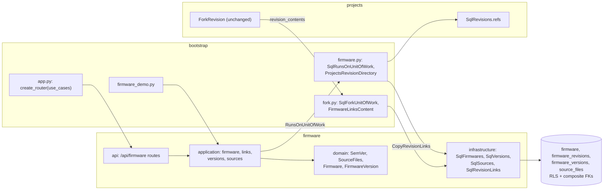

# Design Document: firmware versions

## Overview

The first of three specs in `v0.7.0` Firmware. It delivers the phase's roadmap lines *Firmware per
board target, linked to revisions* and *Versions with source files, changelog and immutability
after release*, and opens the `firmware` module that
[ADR 0001](../../../docs/adr/0001-modular-monolith.md) lists and
[docs/architecture.md](../../../docs/architecture.md) §2 plans. It builds
[ADR 0006](../../../docs/adr/0006-firmware-snapshots.md)'s firmware, versions and source files as
decided: a firmware names its board target and framework, a version is a SemVer with a changelog
and a set of text files, and a released version never changes. The *firmware line* that
[ADR 0003](../../../docs/adr/0003-project-revisions.md) gives a revision is the set of firmware
running on it, and [08-projects-and-revisions](../08-projects-and-revisions/design.md)'s fork
extension point copies it, the first content another module keeps. The demo bench opens with three
sample firmware. [14-firmware-viewer](../14-firmware-viewer/design.md) and
[15-flash-log](../15-flash-log/design.md) follow.

Four things carry the design. Where the firmware line lives, and how a fork carries it with
projects importing nothing from firmware (decisions 2 to 5). What a version number is and how
versions order (decision 6). What a release freezes, and how writes to one firmware take turns
(decisions 7 and 8). And how source is kept byte for byte within a version's limits (decision 9).

**Owner decisions that bind this spec**, and what each does here:

- **ADR 0006** (2026-09-22): a firmware has a name, a target board, a framework and a linked
  revision; a version has a SemVer, a changelog and source files, each a path and its text; a
  version is immutable once released and a change means a new version; source is text in
  PostgreSQL, capped per version. Decisions 1, 6, 7 and 9; the linked revision becomes decision 2's
  links.
- **ADR 0003** (2026-09-22): a revision holds the firmware line it runs. Decisions 2 to 4.
- **One PR per spec with auto-merge; the release PR waits for the phase's last spec, and only the
  owner merges it** (2026-09-27). This spec is the phase's first: it carries no `Release-As`
  footer, and since `0.6.0` is released its PR can turn on auto-merge at once.
- **A change history, soft delete and the trash wait for `v0.8.0`** (2026-09-26). Decision 3 keeps
  links through a revision delete, so 16-trash can bring a revision back with its firmware; every
  write here is one use case and one commit, where 17-history will add its row.

**Decisions this spec makes (2026-09-30), for the owner to check.** Where the repository doesn't
settle something, it is decided here, with the reason:

1. **A module of its own, four tables.** `wiredex.firmware`, with the four layers every module has,
   holds `firmware`, `firmware_revisions`, `firmware_versions` and `source_files`, each isolated by
   workspace. The first is `firmware`, a mass noun, where other tables are plurals; the code says
   `Firmwares` for its repository and `firmware` everywhere else. The module imports no other
   (ADR 0001): what it needs from projects arrives through a port bootstrap binds (decision 5), and
   what projects needs from it through 08's `RevisionContent` (decision 4).

2. **A firmware runs on any number of revisions, and firmware keeps the links.**
   `firmware_revisions` holds `(firmware_id, revision_id)`, the revision a bare id with no foreign
   key, as every id across modules is. ADR 0006 and docs/architecture.md §4 drew one linked revision
   per firmware (`FIRMWARE }o--o| REVISION`), which can't say that the weather station's sketch runs
   on both the breadboard `A` and the perfboard `B`, and a revision with two boards runs two
   firmware, so the link is many to many. It lives in firmware, not among a revision's contents in
   projects, because what a revision runs keeps changing after it is built, a new release or a
   rewrite for a board already soldered, while 09's lock freezes a revision's content once it
   leaves draft. So a link is made and removed whatever the revision's status (requirement 3.1),
   and projects' `ensure_content_editable` never applies to it.

3. **A link is resolved at every read, and kept when its revision goes.** Every read that names
   revisions asks projects for them (decision 5); a link whose revision the workspace no longer
   holds is left out of the answer and refuses nothing (requirement 3.6), as 11 keeps an unresolved
   pin reference and marks it. Deleting a revision or a project therefore changes nothing in
   projects' use cases, and when `v0.8.0`'s trash brings a revision back, its firmware line comes
   back with it. The cost is a few dozen bytes per link of a deleted revision, never shown, gone
   with its firmware or at a demo reset.

4. **A fork copies the links through 08's seam.** `bootstrap/fork.py` holds
   `SqlForkUnitOfWork(SqlProjectsUnitOfWork)`, which appends `FirmwareLinksContent` to
   `revision_contents` after 09's `CopyBomLines` and 11's `CopyNetlist`, over firmware's
   `CopyRevisionLinks` bound to the projects session through `SqlFirmwareRepositories`.
   `CopyRevisionLinks.copy(source, target, at)` inserts the target's links with one
   `INSERT … SELECT`, dated with the fork's `created_at`, and moves those firmware's last change
   with one `UPDATE`. `ForkRevision` is unchanged, as 08's requirement 6.7 promised;
   `bootstrap/projects.py` and `bootstrap/projects_demo.py` build it over the new unit of work. It is
   the fourth use of 07's shared-session pattern, and the first time 08's seam carries content
   another module keeps.

5. **Firmware reads projects' revisions on its own session.** Firmware declares `RevisionDirectory`
   (`refs(revision_ids)`: each listed revision the workspace holds, with its project's id and name,
   its label and its summary) as a property of `RunsOnUnitOfWork(FirmwareUnitOfWork)`.
   `bootstrap/firmware.py` binds `ProjectsRevisionDirectory` over projects' `SqlRevisions.refs`, 10's
   one read joining revisions to projects, on the session firmware opened, so one workspace setting
   scopes both modules and a read is one transaction (decision 12). A link checks its revision in
   its own transaction and locks no project row: a revision deleted by a concurrent request after
   the check leaves a link decision 3 already tolerates. Firmware keeps its own `RevisionFacts`,
   plain values, since it imports nothing from projects. This is the pattern's fifth use.

6. **Version numbers are SemVer 2.0.0, lower-cased, without build metadata.** `SemVer` parses as
   requirement 5.1 reads. A leading `v` is dropped, since `v1.2.0` and `1.2.0` are the same number
   to everyone. The number is lower-cased, so `1.0.0-RC.1` and `1.0.0-rc.1` are one version, as 08's
   labels fold. Build metadata is refused rather than dropped, because dropping what the owner typed
   would change it silently; and without it two numbers of equal precedence are equal, so the order
   is total and the canonical text is the version's identity, unique per firmware. The suggested
   version is the successor of the highest (requirement 5.4); a successor is above every version,
   so it is always free and needs no loop, unlike 08's labels. `0.1.0` starts a firmware, SemVer's
   advice for a first development version.

7. **A version is a draft until it is released, and release is one way.** `VersionStatus` is
   `draft` or `released`. `FirmwareVersion.release(files, now)` refuses a draft with no file (409
   `no_files`) or no changelog (409 `no_changelog`): a release is read later for what it changed,
   and one without a changelog is a number with no story. After it, `ensure_editable()` refuses every
   write to the number, the changelog or the files with 409 `version_released`. A draft starts empty
   or from any version of the same firmware, draft or released, copying its files; `based_on`
   records it and is cleared when that version is deleted, as 08's `forked_from` is. Several drafts
   may coexist, a `1.2.1` fix beside a `2.0.0` rewrite. A released version can still be deleted in
   this spec; 15-flash-log keeps one that a board's log names.

8. **Every write locks its firmware's row first.** `lock_firmware(work, firmware_id)` takes
   `SELECT … FOR UPDATE` on the firmware, and `lock_version(work, version_id)` reads the version's
   firmware id alone, locks that row, then reads the version fresh: 09's `lock_revision` again. So
   version numbers stay distinct, no file lands after a release commits, and a version's size is
   summed over files nothing else is changing (requirement 6.7). One lock per firmware serializes
   its writes, which a single owner never notices.

9. **Source is text, kept byte for byte within a version's limits.** In
   `firmware/domain/source.py`:
   - `SourcePath`: NFC, trimmed, `\` read as `/`, at most 200 characters, no leading `/`, no empty,
     `.` or `..` segment, no control character and none of `< > : " | ? *`. That is what Linux,
     macOS and Windows can all hold, so every path can one day be written to disk as it is. Paths
     compare by `lower()`, the folding the unique index uses.
   - `SourceText`: only line endings change, CRLF and lone CR to LF: the Arduino IDE on Windows saves
     CRLF, and LF everywhere keeps copies and 14's diff clean. Everything else is kept, trailing
     spaces and a missing final line break included. A NUL is refused, since PostgreSQL `text` can't
     hold one and a file with one isn't text; so is text that can't be encoded as UTF-8, such as a
     lone surrogate from a JSON escape. `size` is the UTF-8 length, and `lines` counts as an editor
     does.
   - `SourceFiles`, the first-class collection docs/architecture.md §5 names: paths distinct ignoring
     case, no path that is another's folder (`lib` beside `lib/bme.h`, which no file system holds),
     at most 100 files and 1,048,576 bytes, ADR 0006's *e.g. 1 MB*. It lists `.ino` files first, the
     Arduino IDE's main tab, then the rest, each group by folded path.

   Each row stores its `size`, so a version's total is one `sum()` that never reads the text.

10. **Files are added in batches and edited one at a time.** `POST …/files` takes 1 to 100 files,
    all or none, so three files chosen from the computer are one write that can't half succeed.
    `PATCH …/files/{file_id}` replaces a file's path and text whole, as 09's line edit does, and
    `DELETE` removes it. A file has an id, so a rename keeps it.

11. **A framework is one of five.** `arduino`, `platformio`, `esp_idf`, `micropython` and `other`.
    It changes no rule: the browser shows its name and offers the first file's placeholder from it
    (`sketch.ino`, `src/main.cpp`, `main/main.c`, `main.py`). A closed list gives the web a word to
    translate for *Other* and a later filter a value to match; widening it is a CHECK and a union,
    as 11's wire colors are.

12. **Reads are fixed.** With the workspace setting, a firmware's page is five statements (the
    firmware, its versions with each one's file count and size in one aggregate, its links, and the
    revisions' refs); the list is three (the firmware matching, their versions); a revision's
    firmware is four (the revision's ref, the firmware its links name in one join, their versions);
    and a version is four (the version, its base when it has one, its files). None grows with the
    numbers of firmware, versions, files or links (requirement 12.3).

13. **Sixteen routes under `/api/firmware`, and refusals that name what to fix.** They are in the
    HTTP section. A refused write answers `FirmwareRefusalResponse`: `message`, `code`, `field` and
    `item`, the path or number as typed, in 09's shape, so the editor marks the field it is about.
    Writes answer what they wrote: a firmware's page, a version, or the files.

14. **The web mirrors projects.** `/firmware` lists, `/firmware/new` starts one (for a revision
    when `?revision=` names it), and `/firmware/$firmwareId` opens a firmware the way a project page
    opens a project: its details and the revisions it runs on, over a grid of its versions, each a
    link, beside a `VersionPanel` for the open one, the highest unless `/versions/$versionId` names
    another. A file's text is shown in a `<pre>` in the mono face; 14-firmware-viewer replaces it with
    its viewer. A draft's files are written in a plain `<textarea>`, not CodeMirror's editor: that
    editor injects a `<style>` element the site's CSP (`style-src 'self'`) refuses (14's
    decision 1), and the owner mostly pastes what the Arduino IDE already holds. Tab leaves the box,
    so the page never traps the keyboard. The revision panel gains a *Firmware* section after
    *Wiring*.

15. **The demo bench opens with three firmware.** *Weather station* (Arduino,
    `esp32:esp32:esp32`) runs on the weather station's `A` and `B`, with `1.0.0` and `1.1.0`
    released and `1.2.0` a draft; *Greenhouse controller* runs on the greenhouse's `A`, with `0.1.0`
    released; *Pico blink* (MicroPython, `RPI_PICO`) runs on no revision and is there for the sample
    Pico, with `1.0.0` and `1.1.0` released, so 15 can show a board one release behind. The
    sources use the pins the sample netlists wire: the BME280 at 0x76 on GPIO21 and GPIO22, the soil
    probe on GPIO34 and the pump on GPIO26. They are restored after the projects, through the use
    cases.

16. **One migration and no new ADR.** `0020_firmware.py` adds the four tables and changes nothing
    that exists, so the release before this one keeps working against it. ADR 0006 already decided
    the model; the link's cardinality and where it lives are how it is built, recorded in ADR 0006's
    *Implementation (v0.7)* section by 15's closing task. `0014` stays free.

**Seen while designing, not changed here:**

- docs/architecture.md §4 draws `FIRMWARE }o--o| REVISION`; decision 2 makes it many to many, and
  15's closing documentation redraws it.
- docs/architecture.md §7 plans CodeMirror *editable in drafts*; decision 14 and 14's decision 1 say
  why not, and 15's closing documentation rewrites the line.
- Only `/api/files/attachments` has a body limit at the edge (`deploy/wiredex.caddy`); every other
  route reads a request of any size before validating it. This spec's version limit is enforced by
  the API alone, as every other limit is. A cap on `/api/*` in Caddy would protect every route; it
  is a deploy change for the owner to decide, so it isn't made here.
- 12's seams table offers `Nets.uses_of_part` for *a firmware's pin map*. Nothing here draws one,
  and the seam stays open.

**In scope:** the firmware module's domain (`FirmwareName`, `BoardTarget`, `Framework`,
`Description`, `Changelog`, `SemVer`, `SourcePath`, `SourceText`, `SourceFile`, `SourceFiles`,
`Firmware`, `FirmwareVersion`, `FirmwareVersions`); its use cases; migration `0020` with its
repositories and unit of work; `bootstrap/firmware.py` and `bootstrap/fork.py`; the routes; the
sample firmware; the web's firmware list, new firmware page, firmware page, version panel, draft
file writing and the revision panel's *Firmware* section; the E2E journey.

**Out of scope:** highlighting, copy per file and the diff (14); the flash log and the rule that
keeps a flashed version (15); building, binaries, flashing from the browser and git links
(ADR 0006, *Later*); a ZIP download, folder or ZIP upload, and binary files; a pin map drawn from
the netlist; which designator a firmware runs on; history, soft delete and the trash (`v0.8.0`).

## Architecture



## Components and Interfaces

### Firmware: values and version numbers

`apps/api/src/wiredex/firmware/domain/values.py`:

```python
WorkspaceId = NewType("WorkspaceId", UUID)
FirmwareId = NewType("FirmwareId", UUID)
VersionId = NewType("VersionId", UUID)
SourceFileId = NewType("SourceFileId", UUID)
# A revision of projects, by id alone: firmware holds no key into projects' tables (ADR 0001).
RevisionId = NewType("RevisionId", UUID)

MAX_NAME_LENGTH = 120
MAX_TARGET_LENGTH = 200
MAX_TEXT_LENGTH = 4_000


class Framework(StrEnum):
    ARDUINO = "arduino"
    PLATFORMIO = "platformio"
    ESP_IDF = "esp_idf"
    MICROPYTHON = "micropython"
    OTHER = "other"


@dataclass(frozen=True, slots=True)
class FirmwareName:
    """1 to 120 characters, trimmed and collapsed, no control character. `fold()` is what the
    unique index compares."""

    value: str


@dataclass(frozen=True, slots=True)
class BoardTarget:
    """An FQBN or a board name as its toolchain spells it: case kept, collapsed, 1 to 200."""

    value: str


@dataclass(frozen=True, slots=True)
class Description:
    """Line breaks kept, CRLF read as LF, ends trimmed, 1 to 4,000 characters; `Changelog` has the
    same rules and its own error."""

    value: str
```

Each value normalizes in `__post_init__` through `object.__setattr__` and refuses with its own
error, as projects' values do.

`apps/api/src/wiredex/firmware/domain/semver.py`:

```python
MAX_VERSION_LENGTH = 64

type Identifier = int | str


@dataclass(frozen=True, slots=True)
class SemVer:
    """A SemVer 2.0.0 number without build metadata, lower-cased (decision 6)."""

    major: int
    minor: int
    patch: int
    prerelease: tuple[Identifier, ...] = ()

    @classmethod
    def parse(cls, text: str) -> SemVer:
        """Requirement 5.1's grammar; `InvalidVersionError` says what is wrong."""

    def successor(self) -> SemVer:
        """With no pre-release, the patch plus one; with a numeric last identifier, that identifier
        plus one; otherwise `.1` appended (requirement 5.4)."""

    def precedence(self) -> tuple[object, ...]:
        """SemVer 2.0.0 §11 as a sort key: (major, minor, patch, release flag, identifiers), each
        identifier (0, n) when numeric and (1, text) otherwise."""

    def __lt__(self, other: SemVer) -> bool: ...  # by precedence: total, equal keys mean equal numbers

    def __str__(self) -> str: ...  # canonical: "1.3.0-rc.1"


FIRST_VERSION = SemVer(0, 1, 0)


def suggested_version(existing: Collection[SemVer]) -> SemVer:
    """`FIRST_VERSION` for none, else the successor of the highest, which is never taken."""
```

The key works because tuples compare element by element, a shorter one first: the release flag
(`0` for a pre-release, `1` for a release) puts `1.0.0-rc.1` before `1.0.0`, and `(0, n)` before
`(1, text)` puts numeric identifiers before words.

### Firmware: source files

`apps/api/src/wiredex/firmware/domain/source.py`:

```python
MAX_PATH_LENGTH = 200
MAX_FILES = 100
MAX_VERSION_BYTES = 1_048_576  # ADR 0006's "e.g. 1 MB"


@dataclass(frozen=True, slots=True)
class SourcePath:
    value: str  # NFC, trimmed, "/"-separated (decision 9)

    def fold(self) -> str: ...  # value.lower(), as the unique index folds
    def folders(self) -> tuple[str, ...]: ...  # "lib/bme/bme.h" → ("lib", "lib/bme"), folded
    def is_sketch(self) -> bool: ...  # ends in ".ino", ignoring case


@dataclass(frozen=True, slots=True)
class SourceText:
    value: str  # CRLF and lone CR read as LF, nothing else touched

    @property
    def size(self) -> int: ...  # len(value.encode("utf-8"))

    @property
    def lines(self) -> int: ...  # 0 for "", else the LFs, plus one unless it ends with one


@dataclass(frozen=True, slots=True)
class SourceFile:
    id: SourceFileId
    path: SourcePath
    text: SourceText


@dataclass(frozen=True, slots=True)
class SourceFiles:
    """A version's files, in requirement 7.10's order (decision 9)."""

    items: tuple[SourceFile, ...]

    @classmethod
    def of(cls, files: Iterable[SourceFile]) -> SourceFiles:
        """Checks distinct folded paths, no file where another has a folder, at most 100 files
        and 1,048,576 bytes, then orders them. `PathTakenError` names both paths."""

    def adding(self, new: Sequence[SourceFile]) -> SourceFiles: ...
    def replacing(self, file: SourceFile) -> SourceFiles: ...  # same id; its own path is free
    def without(self, file_id: SourceFileId) -> SourceFiles: ...
    def get(self, file_id: SourceFileId) -> SourceFile | None: ...

    @property
    def size(self) -> int: ...

    @property
    def room(self) -> int: ...  # what is left of MAX_VERSION_BYTES, for the refusal's message
```

`TooManyFilesError` and `VersionTooLargeError` come from `of`, so adding, replacing and a base's
copy check the same limits in one place.

### Firmware: firmware and versions

`apps/api/src/wiredex/firmware/domain/firmware.py` and `version.py`:

```python
@dataclass(frozen=True, slots=True)
class FirmwareDetails:
    name: FirmwareName
    target: BoardTarget
    framework: Framework
    description: Description | None = None


@dataclass(eq=False)
class Firmware:
    id: FirmwareId
    workspace_id: WorkspaceId
    name: FirmwareName
    target: BoardTarget
    framework: Framework
    description: Description | None
    created_at: datetime
    updated_at: datetime  # its last change (requirement 2.2)

    @classmethod
    def start(
        cls, firmware_id: FirmwareId, workspace_id: WorkspaceId, details: FirmwareDetails,
        now: datetime,
    ) -> Firmware: ...

    def revise(self, details: FirmwareDetails, now: datetime) -> bool: ...  # False: nothing new
    def touch(self, now: datetime) -> None: ...  # a link, a version or a file changed


class VersionStatus(StrEnum):
    DRAFT = "draft"
    RELEASED = "released"


@dataclass(eq=False)
class FirmwareVersion:
    id: VersionId
    workspace_id: WorkspaceId
    firmware_id: FirmwareId
    number: SemVer  # the `version` column; `version.number` never reads `version.version`
    changelog: Changelog | None
    status: VersionStatus
    based_on: VersionId | None
    created_at: datetime
    updated_at: datetime
    released_at: datetime | None = None

    @classmethod
    def draft(
        cls, version_id: VersionId, firmware: Firmware, number: SemVer,
        base: FirmwareVersion | None, now: datetime,
    ) -> FirmwareVersion: ...

    def ensure_editable(self) -> None: ...  # VersionReleasedError, 409 (decision 7)
    def revise(self, number: SemVer, changelog: Changelog | None, now: datetime) -> bool: ...
    def release(self, files: SourceFiles, now: datetime) -> None: ...  # NoFiles, NoChangelog
    def touch(self, now: datetime) -> None: ...  # one of its files changed


@dataclass(frozen=True, slots=True)
class FirmwareVersions:
    """One firmware's versions, highest first (requirement 5.3), as 08's `ProjectRevisions`."""

    items: tuple[FirmwareVersion, ...]

    @classmethod
    def of(cls, versions: Iterable[FirmwareVersion]) -> FirmwareVersions: ...

    @property
    def highest(self) -> FirmwareVersion | None: ...

    @property
    def latest_release(self) -> FirmwareVersion | None: ...

    def suggested(self) -> SemVer: ...

    def number_for(self, asked: SemVer | None, renaming: FirmwareVersion | None = None) -> SemVer:
        """The asked number, or the suggested one; `VersionTakenError` for one another holds."""

    def get(self, version_id: VersionId) -> FirmwareVersion | None: ...
```

`apps/api/src/wiredex/firmware/domain/errors.py` holds `FirmwareError(ValueError)`, the base the
router answers 422 unless a leaf has a status of its own; its not-found leaves
`FirmwareNotFoundError`, `VersionNotFoundError`, `SourceFileNotFoundError` and
`RevisionNotFoundError`; and `FirmwareRefusalError(FirmwareError)`, whose leaves carry
`code: ClassVar[FirmwareRefusal]`, `field: ClassVar[FirmwareField | None]` and the `item` as typed,
as 09's `ContentError` does. The codes and their statuses are in Error Handling.

### Firmware: application

`apps/api/src/wiredex/firmware/application/ports.py`:

```python
@dataclass(frozen=True, slots=True)
class RevisionFacts:
    """A revision as firmware names it (decision 5): plain values, no projects type."""

    revision_id: RevisionId
    project_id: UUID
    project_name: str
    label: str
    summary: str | None


class RevisionDirectory(Protocol):
    async def refs(
        self, revision_ids: Collection[RevisionId]
    ) -> Mapping[RevisionId, RevisionFacts]:
        """The listed revisions the workspace holds, in one read; any other is absent."""
        ...


class Firmwares(Protocol):
    async def add(self, firmware: Firmware) -> None: ...
    async def get(self, firmware_id: FirmwareId) -> Firmware | None: ...
    async def locked(self, firmware_id: FirmwareId) -> Firmware | None: ...  # FOR UPDATE, fresh
    async def named(self, name: FirmwareName) -> Firmware | None: ...  # compared folded
    async def matching(self, text: str) -> list[Firmware]: ...  # name or target; last change first
    async def running_on(self, revision_id: RevisionId) -> list[Firmware]: ...  # a join, by name
    async def remove(self, firmware: Firmware) -> None: ...  # versions, files, links by cascade


@dataclass(frozen=True, slots=True)
class VersionSummary:
    version: FirmwareVersion
    files: int
    size: int


class Versions(Protocol):
    async def add(self, version: FirmwareVersion) -> None: ...  # flushed, so its files can follow
    async def get(self, version_id: VersionId) -> FirmwareVersion | None: ...
    async def firmware_of(self, version_id: VersionId) -> FirmwareId | None: ...
    async def of_firmware(self, firmware_id: FirmwareId) -> FirmwareVersions: ...
    async def summaries(
        self, firmware_ids: Collection[FirmwareId]
    ) -> Mapping[FirmwareId, tuple[VersionSummary, ...]]: ...  # one aggregate, highest first
    async def remove(self, version: FirmwareVersion) -> None: ...  # its files by cascade


class Sources(Protocol):
    async def of_version(self, version_id: VersionId) -> SourceFiles: ...
    async def add_all(self, version_id: VersionId, files: Sequence[SourceFile]) -> None: ...
    async def update(self, version_id: VersionId, before: SourceFile, after: SourceFile) -> None: ...
    async def remove(self, version_id: VersionId, file: SourceFile) -> None: ...


class RevisionLinks(Protocol):
    async def of_firmware(self, firmware_id: FirmwareId) -> tuple[RevisionId, ...]: ...  # link order
    async def add(self, firmware_id: FirmwareId, revision_id: RevisionId, at: datetime) -> bool: ...
    async def remove(self, firmware_id: FirmwareId, revision_id: RevisionId) -> bool: ...
    async def copy(self, source: RevisionId, target: RevisionId, at: datetime) -> None:
        """The source's links given to the target, and each of those firmware's last change moved
        to `at`: two statements in SQL, both done by the fake too (decision 4)."""
        ...


class FirmwareUnitOfWork(UnitOfWork, Protocol):
    async def clear(self) -> None: ...  # every firmware of the workspace, for a demo bench

    @property
    def firmwares(self) -> Firmwares: ...

    @property
    def versions(self) -> Versions: ...

    @property
    def sources(self) -> Sources: ...

    @property
    def links(self) -> RevisionLinks: ...


class RunsOnUnitOfWork(FirmwareUnitOfWork, Protocol):
    """Firmware's unit of work that also reads projects' revisions on its session (decision 5)."""

    @property
    def revisions(self) -> RevisionDirectory: ...


class FirmwareRepositories(Protocol):
    """The links with no commit, for a fork's transaction (decision 4)."""

    @property
    def links(self) -> RevisionLinks: ...
```

`add` and `remove` on the links answer whether anything changed, so the firmware is touched only
when it was.

Use cases, one class each; every write is one transaction and one commit:

| File | Use case | What it does |
| --- | --- | --- |
| `application/firmware.py` | `CreateFirmware` | Checks the revision when one is named (404) and the name (409), then adds the firmware and its link; answers its page |
| | `UpdateFirmware` | Locks the firmware, checks a changed name, revises; nothing changed commits nothing |
| | `DeleteFirmware` | Locks it and removes it with everything it holds |
| | `GetFirmware` | Its page: details, versions with their summaries, `runs_on` resolved (decision 3), latest release, suggested version |
| | `ListFirmware` | The list, narrowed by text (requirement 2) |
| | `ListRevisionFirmware` | A revision's firmware: a 404 for a revision the directory doesn't hold, else `running_on` with each one's versions |
| `application/links.py` | `LinkRevision` | Locks the firmware, checks the revision (404), adds the link, touches the firmware when the link is new |
| | `UnlinkRevision` | Locks the firmware, removes the link, touches the firmware when there was one |
| | `CopyRevisionLinks` | Over `FirmwareRepositories`, never commits: a fork's copy (decision 4) |
| `application/versions.py` | `StartVersion` | Locks the firmware, reads its versions, takes the number asked or suggested, copies the base's files under new ids |
| | `UpdateVersion` | `lock_version`, `ensure_editable`, a changed number checked against the others, `revise` |
| | `ReleaseVersion` | `lock_version`, reads the files, `release` |
| | `DeleteVersion` | `lock_version`, removes it; versions based on it keep going, their base cleared |
| | `GetVersion` | The version, its base, its files |
| `application/sources.py` | `AddSourceFiles` | `lock_version`, `ensure_editable`, `SourceFiles.adding`, one insert; touches the version and the firmware |
| | `UpdateSourceFile` | The same through `replacing`; the same path and text write nothing |
| | `RemoveSourceFile` | The same through `without`; a file the version doesn't hold is a 404 |

`lock_firmware` is a function of `application/firmware.py` and `lock_version` one of
`application/versions.py`, as `lock_revision` is one of projects'. The views they answer:

```python
@dataclass(frozen=True, slots=True)
class FirmwareView:
    firmware: Firmware
    versions: tuple[VersionSummary, ...]  # highest first
    runs_on: tuple[RevisionFacts, ...]  # link order, revisions the workspace lost left out
    latest_release: FirmwareVersion | None
    suggested: SemVer


@dataclass(frozen=True, slots=True)
class FirmwareSummary:
    firmware: Firmware
    latest_release: FirmwareVersion | None
    versions: int
    drafts: int


@dataclass(frozen=True, slots=True)
class VersionView:
    version: FirmwareVersion
    base: FirmwareVersion | None
    files: SourceFiles
```

### Projects and bootstrap: forks carry the links

`apps/api/src/wiredex/bootstrap/fork.py`:

```python
class FirmwareLinksContent:
    """Projects' `RevisionContent` over firmware's `CopyRevisionLinks` (decision 4): the fork runs
    the firmware its source runs. The ids cross as the same UUID under each module's name."""

    def __init__(self, links: CopyRevisionLinks) -> None: ...

    async def copy(self, source: Revision, target: Revision) -> None:
        await self._links.copy(
            FirmwareRevisionId(source.id), FirmwareRevisionId(target.id), target.created_at
        )


class SqlForkUnitOfWork(SqlProjectsUnitOfWork):
    """08's unit of work with firmware's links as a third content, after the BOM and netlist."""

    async def __aenter__(self) -> Self:
        await super().__aenter__()
        firmware = SqlFirmwareRepositories(self.session, FirmwareWorkspaceId(self._workspace))
        links = FirmwareLinksContent(CopyRevisionLinks(firmware))
        self.revision_contents = (*self.revision_contents, links)
        return self
```

`bootstrap/projects.py` builds `fork_revision=ForkRevision(fork_unit_of_work, clock, ids)` over it,
and `bootstrap/projects_demo.py` does the same, so the demo forks as the product does. The docstring
of `ProjectsUnitOfWork.revision_contents`, still 08's "Empty in this spec", says what the tuple holds
now. Nothing else in projects changes.

### Bootstrap: firmware's session

`apps/api/src/wiredex/bootstrap/firmware.py`:

```python
class ProjectsRevisionDirectory:
    """Firmware's `RevisionDirectory` over projects' `SqlRevisions.refs`, on firmware's session:
    each `RevisionRef` read as `RevisionFacts`."""

    def __init__(self, revisions: SqlRevisions) -> None: ...

    async def refs(
        self, revision_ids: Collection[RevisionId]
    ) -> Mapping[RevisionId, RevisionFacts]: ...


class SqlRunsOnUnitOfWork(SqlFirmwareUnitOfWork):
    """Firmware's unit of work with projects' revisions bound on its session (decision 5)."""

    revisions: ProjectsRevisionDirectory

    async def __aenter__(self) -> Self:
        await super().__aenter__()
        projects = SqlRevisions(self.session, ProjectsWorkspaceId(self._workspace))
        self.revisions = ProjectsRevisionDirectory(projects)
        return self


def firmware_use_cases(session_factory: SessionFactory) -> FirmwareUseCases: ...
```

Every firmware use case runs over `SqlRunsOnUnitOfWork`, which is also a `FirmwareUnitOfWork`, so
one factory serves them all. `bootstrap/app.py` gains `_firmware_workspace(auth)` and includes the
router under `/api`; `bootstrap/orm.py` imports firmware's mappings.

### HTTP

`APIRouter(prefix="/firmware", tags=["firmware"])`, the static paths declared before
`/{firmware_id}`, as projects' are:

| Method and path | Answers | Requirement |
| --- | --- | --- |
| `GET /api/firmware?search=` | `list[FirmwareSummaryResponse]` | 2 |
| `POST /api/firmware` | 201 `FirmwareResponse` | 1.1, 3.3 |
| `GET /api/firmware/revisions/{revision_id}` | `list[FirmwareSummaryResponse]` | 3.4 |
| `GET /api/firmware/versions/{version_id}` | `VersionResponse` | 5.8 |
| `PATCH /api/firmware/versions/{version_id}` | `VersionResponse` | 5.7 |
| `POST /api/firmware/versions/{version_id}/release` | `VersionResponse` | 6.1 |
| `DELETE /api/firmware/versions/{version_id}` | 204 | 8 |
| `POST /api/firmware/versions/{version_id}/files` | 201 `list[SourceFileResponse]` | 7.1 |
| `PATCH /api/firmware/versions/{version_id}/files/{file_id}` | `SourceFileResponse` | 7.8 |
| `DELETE /api/firmware/versions/{version_id}/files/{file_id}` | 204 | 7.9 |
| `GET /api/firmware/{firmware_id}` | `FirmwareResponse` | 1.8 |
| `PATCH /api/firmware/{firmware_id}` | `FirmwareResponse` | 1.7 |
| `DELETE /api/firmware/{firmware_id}` | 204 | 1.9 |
| `PUT /api/firmware/{firmware_id}/revisions/{revision_id}` | 204 | 3.1 |
| `DELETE /api/firmware/{firmware_id}/revisions/{revision_id}` | 204 | 3.2 |
| `POST /api/firmware/{firmware_id}/versions` | 201 `VersionResponse` | 5.4, 5.5 |

Schemas, in `firmware/api/schemas.py`, named apart from projects' so OpenAPI holds each once:

```python
type FrameworkName = Literal["arduino", "platformio", "esp_idf", "micropython", "other"]
type VersionStatusName = Literal["draft", "released"]
type FirmwareRefusalCodeName = Literal[
    "invalid_name", "name_taken", "invalid_target", "invalid_description", "invalid_version",
    "version_taken", "invalid_changelog", "version_released", "no_files", "no_changelog",
    "invalid_path", "path_taken", "not_text", "too_many_files", "version_too_large",
]
type FirmwareFieldName = Literal[
    "name", "target", "description", "version", "changelog", "path", "content", "files"
]


class FirmwareRequest(BaseModel):  # PATCH replaces all four
    name: str
    target: str
    framework: FrameworkName
    description: str | None = None


class NewFirmwareRequest(FirmwareRequest):
    revision_id: UUID | None = None


class NewVersionRequest(BaseModel):
    version: str | None = None  # none: the suggested version
    from_version_id: UUID | None = None  # none: an empty draft


class VersionRequest(BaseModel):
    version: str
    changelog: str | None = None


class SourceFileRequest(BaseModel):
    # Transport bounds, far past the domain's, so its own refusal names the problem.
    path: str = Field(max_length=1_000)
    content: str = Field(max_length=MAX_VERSION_BYTES)


class NewSourceFilesRequest(BaseModel):
    files: list[SourceFileRequest] = Field(min_length=1, max_length=MAX_FILES)


class RunsOnResponse(BaseModel):
    revision_id: UUID
    project_id: UUID
    project_name: str
    label: str
    summary: str | None


class VersionTagResponse(BaseModel):
    id: UUID
    version: str


class VersionSummaryResponse(BaseModel):
    id: UUID
    version: str
    status: VersionStatusName
    based_on: UUID | None
    released_at: datetime | None
    created_at: datetime
    updated_at: datetime
    files: int
    size: int


class FirmwareSummaryResponse(BaseModel):
    id: UUID
    name: str
    target: str
    framework: FrameworkName
    latest_release: VersionTagResponse | None
    versions: int
    drafts: int
    updated_at: datetime


class FirmwareResponse(BaseModel):
    id: UUID
    name: str
    target: str
    framework: FrameworkName
    description: str | None
    created_at: datetime
    updated_at: datetime
    runs_on: list[RunsOnResponse]
    versions: list[VersionSummaryResponse]  # highest first
    latest_release: VersionTagResponse | None
    suggested_version: str


class SourceFileResponse(BaseModel):
    id: UUID
    path: str
    content: str
    size: int
    lines: int


class VersionResponse(BaseModel):
    id: UUID
    firmware_id: UUID
    version: str
    status: VersionStatusName
    changelog: str | None
    based_on: VersionTagResponse | None
    released_at: datetime | None
    created_at: datetime
    updated_at: datetime
    editable: bool
    files: list[SourceFileResponse]  # requirement 7.10's order
    size: int
    size_limit: int  # 1,048,576
    file_limit: int  # 100


class FirmwareRefusalResponse(BaseModel):
    message: str
    code: FirmwareRefusalCodeName
    field: FirmwareFieldName | None
    item: str | None
```

The writes declare `FirmwareRefusalResponse` as their 409 and 422, so the generated client knows the
shape. `_refusals()` answers a firmware error with its status, and `_firmware_refusals()`, nested
inside it, answers a `FirmwareRefusalError` with its structure, the pattern projects' `_net_refusals`
set. Blank text arrives as none through `_given`, so a cleared description or changelog is no text,
never a refusal.

### Web

| File | What |
| --- | --- |
| `features/firmware/firmware.ts` | `firmwareKeys`; the queries `useFirmwareList(q)`, `useFirmware(id)`, `useRevisionFirmware(revisionId)` and `useVersion(id)`; the mutations `useCreateFirmware`, `useUpdateFirmware`, `useDeleteFirmware`, `useLinkRevision`, `useUnlinkRevision`, `useStartVersion`, `useUpdateVersion`, `useReleaseVersion`, `useDeleteVersion`, `useAddSourceFiles`, `useUpdateSourceFile` and `useRemoveSourceFile`; `FirmwareRefusal` |
| `features/firmware/labels.ts` | Each framework's and status's key, the status pill's tone, each framework's first-file placeholder |
| `features/firmware/FirmwareListPage.tsx` | `/firmware`: the search box, `q` in the address and debounced as the projects list's is, over a table of name, target, framework, latest release, versions and drafts, and last change |
| `features/firmware/FirmwareForm.tsx` | Name, target, framework and description, for a new firmware and an edit |
| `features/firmware/NewFirmwarePage.tsx` | `/firmware/new`; with `?revision=` it names the revision through 10's `RevisionLink` and sends its id |
| `features/firmware/FirmwarePage.tsx` | The header with *Edit* and *Delete*, *Runs on* with a link to each revision, the versions list (`aria-current` on the open one) with *New version*, and the `VersionPanel` |
| `features/firmware/VersionPanel.tsx` | A region named *Version 1.2.0*: the status in words, the base as a link, the release date, the changelog as written, *Edit*, *Release*, *New version from this* and *Delete*, then `SourceFiles` |
| `features/firmware/VersionDialogs.tsx` | `NewVersionDialog` (the number prefilled with the suggestion; *Start from* listing the versions and *An empty version*), `EditVersionDialog` and `ReleaseDialog`, each in inventory's `StockDialog` shell, which projects' dialogs share |
| `features/firmware/SourceFiles.tsx` | An index of links when there are several files; each file a region named by its path, with its size and line count and its text in a `<pre>` scrolling in its own box; *Edit* and *Remove* on a draft |
| `features/firmware/SourceFileEditor.tsx` | Path and text, for *Add a file* and *Edit*: a `<textarea>` in the mono face, `wrap="off"`, spell-check, autocorrect and autocapitalize off |
| `features/firmware/AddFilesFromDisk.tsx` | A file input reading each chosen file with `File.text()`; one holding NUL or U+FFFD, or files passing the room left, are refused before anything is sent; the rest go in one request |
| `features/firmware/RevisionFirmwareSection.tsx` | The revision panel's *Firmware*: each firmware with its latest release and *Unlink*, a select of the others with *Link*, and *New firmware*, to `/firmware/new?revision=…` |
| `features/projects/RevisionPanel.tsx` | Renders `RevisionFirmwareSection` after `NetlistSection` |
| `app/router.tsx`, `app/AppLayout.tsx` | The four routes; *Firmware* after *Projects*, which `router.test.tsx`'s navigation order gains |

`firmwareKeys.all = ["firmware"]`, with `list(q)`, `one(id)`, `ofRevision(revisionId)` and
`version(id)` under it. Every firmware write refreshes `firmwareKeys.all`, which is small; a fork
needs nothing refreshed, since its new revision's section reads a key nothing has cached yet. Keys
under `nav.firmware` and `firmware.*` in both locales. *Release* is `aria-disabled`, its reason as
its description, while the draft has no file or no changelog, as 08's delete button is for a
project's only revision. `src/test/server.ts` gains `aFirmware`, `aFirmwareSummary`, `aVersion`,
`aSourceFile`, `respondWithFirmwareList`, `respondWithFirmware`, `respondWithVersion`,
`respondWithRevisionFirmware` and `acceptFirmwareWrites`, a stateful fake as 11's
`acceptNetWrites` is; `respondWithProject` and `acceptProjectWrites`, which both serve revision
panels, answer an empty firmware list for each revision, since the panel now asks for one, as they
answer empty netlists.

### The demo bench

`firmware/application/demo.py` holds `SAMPLE_FIRMWARE` and `RestoreSampleFirmware`; the sources
are string constants in `firmware/application/demo_sources.py`, every line within 100 columns. The
restore clears the bench's firmware, then writes each sample through `SampleFirmwareWrites`, which
bundles `CreateFirmware`, `StartVersion`, `AddSourceFiles`, `UpdateSourceFile`, `UpdateVersion`,
`ReleaseVersion` and `LinkRevision` so the restore stays within ruff's five arguments, as projects'
`SampleWrites` does. A later version starts from the one before and edits what changed. The sample
revisions are found by project name and label through `DemoRevisions`, which
`bootstrap/firmware_demo.py` answers over projects' `ListProjects` and `GetProject`, as 09's
`sample_parts` answers over catalog's `ListParts`. `bootstrap/cli.py`'s `_restore_benches` restores
firmware after projects.

| Firmware | Target · framework | Runs on | Versions |
| --- | --- | --- | --- |
| Weather station | `esp32:esp32:esp32` · Arduino | Weather station `A`, `B` | `1.0.0` released: `weather_station.ino` reads the BME280 at 0x76 on GPIO21 and GPIO22 every five minutes. `1.1.0` released, from `1.0.0`: sleeps between readings and moves the pins and the interval into `config.h`. `1.2.0` draft, from `1.1.0`: averages three readings |
| Greenhouse controller | `esp32:esp32:esp32` · Arduino | Greenhouse controller `A` | `0.1.0` released: `greenhouse.ino` reads the probe on GPIO34 and drives the pump on GPIO26, with hysteresis |
| Pico blink | `RPI_PICO` · MicroPython | no revision | `1.0.0` released: `main.py` blinks the on-board LED. `1.1.0` released, from `1.0.0`: fades it in and out with PWM |

Every sample version has a changelog, the draft's included, so it could be released. `B` was forked
before firmware is restored, so its link is made by `LinkRevision`, not by the fork.

## Data Models

`0020_firmware.py`, written as `0019` was: autogenerated, reviewed, and the four tables isolated.

```text
firmware
  id uuid pk, workspace_id uuid not null (index)
  name varchar(120) not null, target varchar(200) not null
  framework varchar(16) not null
    CHECK framework IN ('arduino', 'platformio', 'esp_idf', 'micropython', 'other')
  description varchar(4000) null
  created_at, updated_at timestamptz not null
  unique (workspace_id, id)                         -- what the composite keys point at
  unique index uq_firmware_name (workspace_id, lower(name))

firmware_revisions
  workspace_id uuid not null, firmware_id uuid not null
  revision_id uuid not null                         -- projects' revision: bare, no key
  created_at timestamptz not null                   -- link order (requirement 3.5)
  pk (workspace_id, firmware_id, revision_id)
  fk (workspace_id, firmware_id) → firmware (workspace_id, id) ON DELETE CASCADE
  index ix_firmware_revisions_revision (workspace_id, revision_id)

firmware_versions
  id uuid pk, workspace_id uuid not null, firmware_id uuid not null
  version varchar(64) not null, changelog varchar(4000) null
  status varchar(16) not null  CHECK status IN ('draft', 'released')
  based_on uuid null  fk → firmware_versions (id) ON DELETE SET NULL
  created_at, updated_at timestamptz not null, released_at timestamptz null
  CHECK released_dated: (status = 'released') = (released_at IS NOT NULL)
  unique (workspace_id, id)
  unique index uq_firmware_versions_version (workspace_id, firmware_id, version)
  fk (workspace_id, firmware_id) → firmware (workspace_id, id) ON DELETE CASCADE

source_files
  id uuid pk, workspace_id uuid not null, version_id uuid not null
  path varchar(200) not null, content text not null
  size integer not null  CHECK size_is_length: size = octet_length(content)
  unique index uq_source_files_path (workspace_id, version_id, lower(path))
  fk (workspace_id, version_id) → firmware_versions (workspace_id, id) ON DELETE CASCADE
```

- The composite keys are 02's third gate: PostgreSQL checks foreign keys without row-level
  security, so pairing `workspace_id` with the id lets the database refuse a version filed under
  another workspace's firmware (requirement 9.4).
- `version` needs no `lower()`: `SemVer` stores it lower-cased, so the column holds the canonical
  text.
- `size`'s CHECK ties the stored size to the text's UTF-8 length in the database's own terms, so
  the sum decision 9 relies on can't drift from the text.
- `Firmware` and `FirmwareVersion` are mapped imperatively; `source_files` and
  `firmware_revisions` are written with Core, as 09's lines and 11's nets are, since neither has an
  identity worth an ORM object.
- `based_on` is a plain key, as `revisions.forked_from` is: a version is only ever based on one of
  its own firmware's, which `StartVersion` checks.

```json
GET /api/firmware/0192… →
{ "id": "0192…", "name": "Weather station", "target": "esp32:esp32:esp32",
  "framework": "arduino", "description": null,
  "runs_on": [
    { "revision_id": "0192…", "project_id": "0192…", "project_name": "Weather station",
      "label": "A", "summary": "breadboard" },
    { "revision_id": "0192…", "project_id": "0192…", "project_name": "Weather station",
      "label": "B", "summary": "perfboard" } ],
  "versions": [
    { "id": "0192…", "version": "1.2.0", "status": "draft", "based_on": "0192…",
      "released_at": null, "files": 2, "size": 1412, … },
    { "id": "0192…", "version": "1.1.0", "status": "released", "based_on": "0192…",
      "released_at": "2026-09-30T03:00:12Z", "files": 2, "size": 1290, … },
    { "id": "0192…", "version": "1.0.0", "status": "released", "based_on": null, … } ],
  "latest_release": { "id": "0192…", "version": "1.1.0" },
  "suggested_version": "1.2.1", … }

POST /api/firmware/versions/0192…/files  { "files": [ { "path": "Config.h", "content": "…" } ] }
→ 409 { "detail": { "message": "1.2.0 already has a file config.h", "code": "path_taken",
                    "field": "path", "item": "Config.h" } }
```

## Correctness Properties

### Property 1: a version number reads back as itself

For any text `SemVer.parse` accepts, `str(SemVer.parse(text))` is canonical: parsing it again gives
an equal number, it is lower-case, and it has no leading `v`.

### Property 2: versions order by SemVer 2.0.0 precedence

For any two numbers, `a < b` agrees with a reference comparison the test writes from SemVer §11, the
order is total, and the specification's own chain holds: `1.0.0-alpha < 1.0.0-alpha.1 <
1.0.0-alpha.beta < 1.0.0-beta < 1.0.0-beta.2 < 1.0.0-beta.11 < 1.0.0-rc.1 < 1.0.0`.

### Property 3: the suggested version is free and above every version

For any set of numbers, `suggested_version` is above every one of them and equal to none; for the
empty set it is `0.1.0`.

### Property 4: paths normalize once and stay safe

For any text `SourcePath` accepts, normalizing its value again gives the same path, and it has no
empty, `.` or `..` segment, no leading `/`, no `\`, no control character and none of
`< > : " | ? *`.

### Property 5: text keeps everything but line endings

For any text `SourceText` accepts, its value is the text with CRLF and CR replaced by LF, applying
it again changes nothing, and `size` is the value's UTF-8 length.

### Property 6: a version's files stay within their limits, in order

For any files `SourceFiles.of` accepts, folded paths are distinct, no path is another's folder,
there are at most 100 files and 1,048,576 bytes, and the order is `.ino` first, then by folded
path; files breaking a rule are refused with that rule's error.

### Property 7: a released version never changes

For any released version and any sequence of number, changelog and file writes after its release,
every write is refused with `version_released`, and the number, changelog and files are what they
were when it was released.

### Property 8: a fork copies exactly its source's links

For any links, after `CopyRevisionLinks.copy(s, t, at)` the firmware linked to `t` are those linked
to `s`, and every other revision's links are unchanged.

### Property 9: links resolve at every read

For any links and any directory, a firmware's `runs_on` is exactly its linked revisions that the
directory holds, in link order.

## Error Handling

| Case | Status | Code |
| --- | --- | --- |
| A firmware, version, file or revision the workspace doesn't hold, another workspace's included | 404 | |
| A base that isn't a version of the same firmware | 404 | |
| A name another firmware holds | 409 | `name_taken` |
| A number another version of the firmware holds | 409 | `version_taken` |
| A path another file holds, or a file where another has a folder | 409 | `path_taken` |
| A write to a released version's number, changelog or files, or releasing it again | 409 | `version_released` |
| Releasing a draft with no file | 409 | `no_files` |
| Releasing a draft with no changelog | 409 | `no_changelog` |
| A name, target, description, number or changelog its value won't take | 422 | `invalid_name`, `invalid_target`, `invalid_description`, `invalid_version`, `invalid_changelog` |
| A path its rules refuse | 422 | `invalid_path` |
| Text holding a NUL, or that isn't valid Unicode | 422 | `not_text` |
| More than 100 files in a version | 422 | `too_many_files` |
| More than 1,048,576 bytes in a version | 422 | `version_too_large` |
| A body the request schema refuses, an unknown framework included | 422 | FastAPI's own list |
| No session | 401 | |
| A cookie write without the CSRF header | 403 | |

## Testing Strategy

| Level | Files | What |
| --- | --- | --- |
| Domain | `tests/firmware/test_values.py`, `test_semver.py`, `test_source.py`, `test_version.py`, `test_errors.py` | Properties 1 to 7; each value's rules; `release` needing a file and a changelog |
| Application | `test_firmware_use_cases.py`, `test_links.py`, `test_version_use_cases.py`, `test_source_use_cases.py` | Properties 7 to 9 over the fakes; every refusal of Error Handling; a batch refused whole; another firmware's base a 404; nothing written when nothing changed |
| Integration | `tests/integration/test_firmware_isolation.py`, `test_firmware_repositories.py`, `test_firmware_reads.py`, `test_fork_links.py`, `test_migrations.py`, `test_demo_cli.py` | Row-level security as `wiredex_app`, as `test_projects_isolation.py` checks projects'; the composite keys refusing another bench's firmware; the cascades and `based_on` cleared; the unique indexes; the size CHECK; the reads' statement counts, five, three, four and four, whatever the sizes; a fork copying links after the BOM and netlist, and a later content that fails keeping none; the round trip at `0020`; the demo's three firmware after a reset |
| HTTP | `tests/firmware/test_firmware_api.py`, `test_firmware_auth.py` | The shapes and statuses, and the wire-names test for the four unions; 401 and 403 |
| Web | beside each component | The list and its search; the form; the page opening the highest version; the panel's actions by status; *Release* unavailable with its reason; the new version dialog's defaults; typed and chosen files, a binary one refused before sending; edit, rename and remove; the revision section's link, unlink and new |
| E2E | `e2e/tests/firmware.spec.ts` | Below |

The journey: a project's revision `A` starts a firmware from its *Firmware* section, whose page
opens running on `A`. A new version takes `0.1.0`; one file is typed, another chosen from the
computer, and the first edited. *Release* stays unavailable until a changelog is written, then
releases, and the version offers no editing. A new version from it takes `0.1.1` and holds the
files; it is deleted. Forking `A` gives a `B` that runs the firmware; unlinking it there empties
`B`'s section, and linking it again from the section's select brings it back, so *Runs on* names
`A` and `B`. The list finds the firmware by its stamp, and deleting it takes it off the list. On a
Pixel 7 no page scrolls sideways.

## Seams for later specs

| Seam | For | What it is |
| --- | --- | --- |
| `VersionResponse.files[].content`, `GET /api/firmware/versions/{id}` | 14-firmware-viewer | The text the viewer highlights and copies, and each side of a comparison |
| `SourceFiles.tsx`'s `<pre>`, `VersionPanel` | 14-firmware-viewer | Where the viewer and the *Compare* link go |
| `lock_version`, `VersionStatus.RELEASED` | 15-flash-log | Only a released version is flashed, under its firmware's lock |
| `DeleteVersion`, `DeleteFirmware` | 15-flash-log | Where a version or firmware a board's log names is kept |
| `RunsOnUnitOfWork`, `RevisionDirectory` | 15-flash-log | The revision a unit's flash names, read on the session the unit directory joins |
| `ListRevisionFirmware` | 15-flash-log | The firmware offered first when a flash is logged on a unit a revision holds |
| Links kept through a revision delete | 16-trash | A restored revision comes back running its firmware |
| One use case, one commit per write | 17-history | Where a firmware's history row joins its transaction |
| `Firmware.updated_at`, `FirmwareVersion.released_at` | 18-dashboard | Recent activity: firmware changed and released |
| `/firmware/$firmwareId` | 19-command-palette | Jumping to a firmware |

## After this spec

The phase closes in 15-flash-log, whose last task writes ADR 0006's *Implementation (v0.7)*
section, ADR 0001's fourth to sixth shared-session uses, docs/architecture.md §4's links and §7's
viewer, and ticks the README's `v0.7.0` lines. This spec's own documentation changes are small:
ADR 0007's list of isolated tables gains the four new ones in the migration's commit, as 11's did,
and `revision_contents` gets its corrected docstring.
