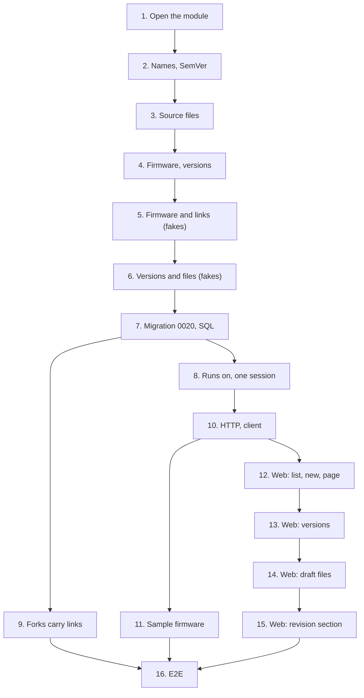

# Implementation Plan

## Overview

Sixteen tasks that build [design.md](design.md) against [requirements.md](requirements.md): the
firmware module and its import contracts; names, version numbers and source files in the domain;
firmware and versions as entities; the use cases over fakes; migration `0020` with its repositories;
firmware reading projects' revisions on its session; forks copying the links; the routes; the
sample firmware; the web's list, firmware page, version panel, draft files and revision section;
and the end-to-end journey. The phase-closing documentation is
[15-flash-log](../15-flash-log/tasks.md)'s last task, not one of these.

One migration, `0020_firmware.py`, moves the head from `0019` to `0020`. One new module,
`firmware`, and no new ADR: `0014` stays free.

Branch first. Before task 1, run `git switch main && git pull && git switch -c
feat/firmware-versions`, and never commit this spec's work on `main`. This spec's
`requirements.md`, `design.md` and `tasks.md`, with 14's and 15's, reach `main` in the documentation
commit that starts the phase (`docs: add the firmware specs`) on this branch; if they aren't there
yet, task 1's commit adds them. `0.6.0` is released, so nothing else waits.

One task, one commit, each passing `make check` **on its own** (AGENTS.md). `make coverage` on
tasks 7 to 11; `make client` on 10, the regenerated client in that commit; `make e2e` on 10 and 12 to
16. A port that grows a method grows it in the same commit as its SQL implementation and its fake,
so bootstrap and mypy keep type-checking on every commit. Tick the task in this file in the same
commit. Suggested commit subjects are in `code` under each task.

Release footer: this spec is **the first of three** in `v0.7.0`, so no task carries `Release-As`;
15-flash-log's last task carries `Release-As: 0.7.0`. See
[Notes](#one-pr-per-spec-and-the-release).

## Tasks

- [x] 1. Firmware: open the module and its import contracts
  - `apps/api/src/wiredex/firmware/__init__.py` with its docstring, and empty `api`,
    `application`, `domain` and `infrastructure` packages.
  - `firmware/domain/errors.py`: `FirmwareError`, the four not-found leaves, `FirmwareRefusal`,
    `FirmwareField`, `FirmwareRefusalError` and its fifteen leaves, each with a docstring saying why
    it is refused.
  - `apps/api/pyproject.toml`: `wiredex.firmware` in the layers contract, the bootstrap-forbidden
    contract and the independence contract.
  - Tests: `tests/firmware/test_errors.py` (every leaf is a `FirmwareError`, every refusal carries a
    code and a field).
  - Checks: `make check`.
  - `feat(firmware): open the module and its import contracts`
  - _Requirements: 12.1_

- [x] 2. Firmware: names, targets and version numbers
  - `firmware/domain/values.py`: the ids, `Framework`, `FirmwareName`, `BoardTarget`,
    `Description`, `Changelog`.
  - `firmware/domain/semver.py`: `SemVer` with `parse`, `successor`, `precedence` and its order,
    `FIRST_VERSION`, `suggested_version`.
  - Tests: `test_values.py` (each value's rules), `test_semver.py` (properties 1 to 3; the grammar's
    refusals: leading zeros, build metadata, over 64 characters; SemVer's own precedence chain).
  - Checks: `make check`.
  - `feat(firmware): number versions the way SemVer orders them`
  - _Requirements: 1.2, 1.4, 1.5, 1.6, 5.1, 5.3, 5.4, 5.6, 12.6_

- [x] 3. Firmware: source files within a version's limits
  - `firmware/domain/source.py`: `SourcePath`, `SourceText`, `SourceFile`, `SourceFiles` with
    `of`, `adding`, `replacing`, `without`, `size` and `room`.
  - Tests: `test_source.py` (properties 4 to 6; CRLF, lone CR, NUL and a lone surrogate; `lib`
    beside `lib/bme.h`; the 100th and 101st file; exactly 1,048,576 bytes and one more).
  - Checks: `make check`.
  - `feat(firmware): keep source files exact and within a version's limits`
  - _Requirements: 7.2, 7.3, 7.4, 7.5, 7.6, 7.7, 7.10, 12.6_

- [x] 4. Firmware: firmware, drafts and released versions
  - `firmware/domain/firmware.py`: `FirmwareDetails`, `Firmware` with `start`, `revise`, `touch`.
  - `firmware/domain/version.py`: `VersionStatus`, `FirmwareVersion` with `draft`,
    `ensure_editable`, `revise`, `release`, `touch`; `FirmwareVersions` with `highest`,
    `latest_release`, `suggested`, `number_for`.
  - Tests: `test_version.py` (property 7 over the entity; `release` refusing no files and no
    changelog; a number another version holds; a revise that changes nothing answers False).
  - Checks: `make check`.
  - `feat(firmware): model firmware, drafts and released versions`
  - _Requirements: 1.7, 5.2, 5.5, 5.7, 6.1, 6.2, 6.3, 6.4, 6.5, 12.6_

- [x] 5. Firmware: firmware and the revisions it runs on, over fakes
  - `firmware/application/ports.py`: the repositories, `RevisionFacts`, `RevisionDirectory`,
    `FirmwareUnitOfWork`, `RunsOnUnitOfWork`, `FirmwareRepositories`, and the views.
  - `firmware/application/firmware.py`: `CreateFirmware`, `UpdateFirmware`, `DeleteFirmware`,
    `GetFirmware`, `ListFirmware`, `ListRevisionFirmware`, `lock_firmware`.
  - `firmware/application/links.py`: `LinkRevision`, `UnlinkRevision`, `CopyRevisionLinks`.
  - `tests/support/firmware.py`: the in-memory repositories, `InMemoryFirmwareUnitOfWork` with
    `for_workspace`, and a directory of revisions a test fills.
  - Tests: `test_firmware_use_cases.py` (the name's 409 naming the holder; a create for a revision
    the directory lacks writes nothing; the list's text and order; a delete taking everything),
    `test_links.py` (properties 8 and 9; a repeated link and a missing unlink write nothing).
  - Checks: `make check`.
  - `feat(firmware): describe firmware and the revisions it runs on`
  - _Requirements: 1.1, 1.3, 1.7, 1.8, 1.9, 1.10, 2.1, 2.2, 2.3, 2.4, 3.1, 3.2, 3.3, 3.4, 3.5,
    3.6, 3.7, 4.2_

- [ ] 6. Firmware: start, write, release and delete versions, over fakes
  - `firmware/application/versions.py`: `StartVersion`, `UpdateVersion`, `ReleaseVersion`,
    `DeleteVersion`, `GetVersion`, `lock_version`.
  - `firmware/application/sources.py`: `AddSourceFiles`, `UpdateSourceFile`, `RemoveSourceFile`.
  - Tests: `test_version_use_cases.py` (the suggested number; a base's files copied under new ids; a
    base of another firmware a 404; deleting a base clears it; property 7 over the use cases),
    `test_source_use_cases.py` (a batch refused whole; the room left in the message; a file under
    another version a 404; the same path and text writing nothing; version and firmware touched).
  - Checks: `make check`.
  - `feat(firmware): start, write, release and delete versions`
  - _Requirements: 5.2, 5.4, 5.5, 5.7, 5.8, 5.9, 6.1, 6.2, 6.3, 6.4, 6.5, 6.6, 7.1, 7.3, 7.6, 7.7,
    7.8, 7.9, 7.11, 8.1, 8.2, 8.3_

- [ ] 7. Firmware: store it in PostgreSQL
  - Migration `0020_firmware.py` from `make migration m="firmware"`, reviewed: the four tables, their
    CHECKs, unique indexes and composite keys, and `isolate_by_workspace` for each.
  - `firmware/infrastructure/`: `orm.py`, `types.py`, `repositories.py` (`SqlFirmwares`,
    `SqlVersions`, `SqlSources`, `SqlRevisionLinks`), `unit_of_work.py` (`SqlFirmwareUnitOfWork`
    with `clear`, `SqlFirmwareRepositories`); `bootstrap/orm.py` imports the mappings.
  - `tests/integration/test_demo_cli.py`'s `TRUNCATE` names the four tables; ADR 0007's list of
    isolated tables gains them, in this commit, as 11's migration task added `nets` and `net_pins`.
  - Tests: integration `test_firmware_isolation.py` (the four tables' rows of another bench unseen
    and unwritable as `wiredex_app`, as `test_projects_isolation.py` checks projects'),
    `test_firmware_repositories.py` (a version under another workspace's firmware refused by its key;
    the cascades and `based_on` set null; `lower(name)` and `lower(path)` unique; the size CHECK; one
    insert for many files; the lock serializing a file write and a release); `test_migrations.py`'s
    round trip at `0020`; `wiredex db check` clean.
  - Checks: `make check`, `make coverage`.
  - `feat(firmware): store firmware, versions and source in PostgreSQL`
  - _Requirements: 1.9, 6.7, 8.2, 9.1, 9.3, 9.4, 12.2_

- [ ] 8. Firmware: name the revisions it runs on, on its own session
  - `bootstrap/firmware.py`: `ProjectsRevisionDirectory` and `SqlRunsOnUnitOfWork`.
    `firmware_use_cases` waits for task 10, which defines the `FirmwareUseCases` it answers.
  - Tests: integration `test_firmware_reads.py`, building the use cases over `SqlRunsOnUnitOfWork`
    as 11's task 7 built the netlist's (a firmware's page in five statements, the list in three, a
    revision's firmware in four and a version in four, each for one and for forty; a deleted
    revision left out of `runs_on`; another bench's revision a 404).
  - Checks: `make check`, `make coverage`.
  - `feat(firmware): read the revisions a firmware runs on`
  - _Requirements: 3.4, 3.5, 3.6, 3.7, 9.2, 12.3_

- [ ] 9. Projects: carry a revision's firmware into its forks
  - `bootstrap/fork.py`: `FirmwareLinksContent`, `SqlForkUnitOfWork`; `bootstrap/projects.py` and
    `bootstrap/projects_demo.py` build `ForkRevision` over it; `ProjectsUnitOfWork.revision_contents`'
    docstring says what the tuple holds.
  - Tests: integration `test_fork_links.py` (the fork's links after its BOM and netlist; the source's
    links and a third revision's unchanged; a fork of a reserved revision copies too; a content
    failing after the links keeps no link and no fork).
  - Checks: `make check`, `make coverage`.
  - `feat(projects): carry a revision's firmware into its forks`
  - _Requirements: 4.1, 4.2, 4.3, 4.4_

- [ ] 10. Firmware: over HTTP
  - `firmware/api/schemas.py` and `firmware/api/router.py`: `FirmwareUseCases`, `create_router`,
    `_STATUS_BY_ERROR`, `_refusals()` and `_firmware_refusals()`; `bootstrap/firmware.py`:
    `firmware_use_cases`; `bootstrap/app.py`: `_firmware_workspace(auth)` and the router under
    `/api`.
  - `make client`, the regenerated client and its aliases in `packages/api-client/src/index.ts` in
    this commit; `src/test/server.ts`'s `respondWithProject` and `acceptProjectWrites` answer an
    empty firmware list for each revision.
  - Tests: `test_firmware_api.py` (every route's shape and status; the structured refusals; the
    wire-names test for the four unions), `test_firmware_auth.py` (401 without a session, 403 for a
    cookie write without the CSRF header).
  - Checks: `make check`, `make coverage`, `make client`, `make e2e`.
  - `feat(firmware): expose firmware, versions and source over HTTP`
  - _Requirements: 9.2, 9.5, 9.6, 12.4_

- [ ] 11. Firmware: seed the demo bench with sample firmware
  - `firmware/application/demo.py` (`SAMPLE_FIRMWARE`, `SampleFirmwareWrites`,
    `RestoreSampleFirmware`, `DemoRevisions`),
    `firmware/application/demo_sources.py`, `bootstrap/firmware_demo.py`
    (`restore_sample_firmware_use_case`); `bootstrap/cli.py`'s `_restore_benches` restores firmware
    after projects.
  - Tests: `tests/firmware/test_demo.py` (the samples through the fakes: every version with a
    changelog, the weather station's draft based on `1.1.0`, *Pico blink*'s two releases, the pins of
    the sample netlists in the sources); integration `test_demo_cli.py` (after a reset the three
    firmware, the weather station's on `A` and `B`; a guest's own firmware gone after the next reset;
    a new bench seeded alike).
  - Checks: `make check`, `make coverage`.
  - `feat(firmware): seed the demo bench with sample firmware`
  - _Requirements: 10.1, 10.2, 10.3, 10.4, 10.5_

- [ ] 12. Web: list firmware, start one and open it
  - `features/firmware/firmware.ts`, `labels.ts`, `FirmwareListPage`, `FirmwareForm`,
    `NewFirmwarePage`, and `FirmwarePage` with its header alone (details, *Edit*, *Delete*, *Runs
    on*); the `/firmware`, `/firmware/new` and `/firmware/$firmwareId` routes, so saving a new
    firmware has a page to open; *Firmware* after *Projects* in the navigation, and
    `router.test.tsx`'s order with it; `nav.firmware`, `firmware.list.*`, `firmware.form.*`,
    `firmware.frameworks.*` and `firmware.page.*` in both locales.
  - `src/test/server.ts`: `aFirmwareSummary`, `aFirmware`, `respondWithFirmwareList`,
    `respondWithFirmware`, `acceptFirmwareWrites`.
  - Tests: Vitest beside each component: the search in the address, an empty list, a name taken
    marked on its field, a new firmware for a revision naming it and sending its id, saving opening
    its page, the page's *Runs on* links, an edit and a delete.
  - Checks: `make check`, `make e2e`.
  - `feat(web): list firmware, start one and open it`
  - _Requirements: 11.1, 11.2, 11.3, 11.4, 11.12, 11.13, 11.14, 11.16_

- [ ] 13. Web: show a firmware's versions and release them
  - `FirmwarePage`'s versions list with *New version*, `VersionPanel`, `VersionDialogs`, and
    `SourceFiles` with each file's text in a `<pre>`; the `/firmware/$firmwareId/versions/$versionId`
    route; `firmware.version.*`, `firmware.status.*`, `firmware.files.*` and `firmware.refusal.*` in
    both locales; `aVersion`, `aSourceFile` and `respondWithVersion` in `src/test/server.ts`.
  - Tests: Vitest beside each component: the highest version open by default, the others linked and
    the open one marked; a draft's actions and a release's; *Release* unavailable with its reason,
    then asking and releasing; the new version dialog's suggested number and default base; a delete
    opening the firmware's highest version.
  - Checks: `make check`, `make e2e`.
  - `feat(web): show a firmware's versions and release them`
  - _Requirements: 11.5, 11.6, 11.7, 11.8, 11.12, 11.13, 11.14, 11.16_

- [ ] 14. Web: write a draft's source files
  - `SourceFileEditor` (add and edit, rename through the path field), `AddFilesFromDisk`, *Remove*
    asking in place; the placeholder from the framework; the version's size against its limit.
  - Tests: Vitest beside each component: a typed file sent as typed, tabs and trailing spaces kept;
    three chosen files in one request; a file with NUL, and files over the room left, refused before
    sending; a path taken marked on the path field; Tab leaving the text box.
  - Checks: `make check`, `make e2e`.
  - `feat(web): write a draft's source files`
  - _Requirements: 11.9, 11.10, 11.12, 11.13, 11.14, 11.15, 11.16_

- [ ] 15. Web: the firmware a revision runs
  - `RevisionFirmwareSection`, rendered by `RevisionPanel` after `NetlistSection`;
    `firmware.revision.*` in both locales; `respondWithRevisionFirmware` in `src/test/server.ts`.
  - Tests: Vitest beside the component: each firmware with its latest release and a link; linking
    one from the select and unlinking it; *New firmware* opening `/firmware/new?revision=…`; the web
    suite at or above 85 %.
  - Checks: `make check`, `make e2e`.
  - `feat(web): show and link the firmware a revision runs`
  - _Requirements: 11.11, 11.12, 11.13, 11.14, 11.16, 12.5_

- [ ] 16. E2E: the firmware journey
  - `e2e/tests/firmware.spec.ts` on the shared session, names from `Date.now()`: the journey of
    design's Testing Strategy.
  - In the mobile project, the list, the firmware page and the version panel have no horizontal page
    overflow.
  - Checks: `make check`, `make e2e`.
  - `test(e2e): cover a firmware from its revision to a release and a fork`
  - _Requirements: 3.1, 3.2, 3.3, 4.1, 5.4, 5.5, 6.1, 6.3, 6.4, 7.1, 7.8, 8.1, 11.3, 11.4, 11.7,
    11.9, 11.11, 11.16_

## Task Dependency Graph



```json
{
  "waves": [
    { "wave": 1, "tasks": [{ "id": "1", "name": "Open the module", "dependsOn": [] }] },
    { "wave": 2, "tasks": [{ "id": "2", "name": "Names, SemVer", "dependsOn": ["1"] }] },
    { "wave": 3, "tasks": [{ "id": "3", "name": "Source files", "dependsOn": ["2"] }] },
    { "wave": 4, "tasks": [{ "id": "4", "name": "Firmware, versions", "dependsOn": ["3"] }] },
    { "wave": 5, "tasks": [{ "id": "5", "name": "Firmware and links", "dependsOn": ["4"] }] },
    { "wave": 6, "tasks": [{ "id": "6", "name": "Versions and files", "dependsOn": ["5"] }] },
    { "wave": 7, "tasks": [{ "id": "7", "name": "Migration 0020, SQL", "dependsOn": ["6"] }] },
    {
      "wave": 8,
      "tasks": [
        { "id": "8", "name": "Runs on, one session", "dependsOn": ["7"] },
        { "id": "9", "name": "Forks carry links", "dependsOn": ["7"] }
      ]
    },
    { "wave": 9, "tasks": [{ "id": "10", "name": "HTTP, client", "dependsOn": ["8"] }] },
    {
      "wave": 10,
      "tasks": [
        { "id": "11", "name": "Sample firmware", "dependsOn": ["10"] },
        { "id": "12", "name": "Web: list, new, page", "dependsOn": ["10"] }
      ]
    },
    { "wave": 11, "tasks": [{ "id": "13", "name": "Web: versions", "dependsOn": ["12"] }] },
    { "wave": 12, "tasks": [{ "id": "14", "name": "Web: draft files", "dependsOn": ["13"] }] },
    { "wave": 13, "tasks": [{ "id": "15", "name": "Web: revision section", "dependsOn": ["14"] }] },
    { "wave": 14, "tasks": [{ "id": "16", "name": "E2E", "dependsOn": ["9", "11", "15"] }] }
  ]
}
```

Reading it:

- **Root.** 1 depends on no task here. The spec as a whole needs `0.6.0` released, which it is.
- **Critical path.** 1 → 2 → … → 8 → 10 → 12 → 13 → 14 → 15 → 16, one task per wave: the domain,
  then the use cases, then SQL, then the routes, then the web in the order a page is built.
- **8 and 9 side by side.** One binds projects on firmware's session, the other firmware on
  projects'; they touch different bootstrap files and meet only in the journey.
- **11 after 10.** The demo writes through the use cases over `SqlRunsOnUnitOfWork`, which 8 binds
  and 10 wires into `firmware_use_cases` and the app; it waits for 10 so the demo and the routes
  agree on one wiring, as 11's sample netlists did.
- **12 before 13.** 12 opens the firmware's page with its header, so a saved firmware has somewhere
  to go and the router's types know the route; 13 fills the page with its versions.
- **12 to 15 in line.** All four write the locale files and `src/test/server.ts`, so no two share a
  wave.

## Notes

### Before pushing

- `make check` on every commit, not only the last.
- `make coverage` on 7 to 11: API floor 90 %, web floor 85 %.
- `make client` in 10, whose commit carries the regenerated client; afterwards `make client` must
  leave the package unchanged, or CI's contract gate fails.
- `make e2e` on 10 and on 12 to 16.
- `wiredex db check` clean at `0020`.

### One PR per spec, and the release

Open this spec's PR from `feat/firmware-versions`, based on `main`, and turn on auto-merge with
`gh pr merge N --rebase --auto`. Its commits then wait on `main` for 14-firmware-viewer and
15-flash-log, whose last task carries `Release-As: 0.7.0`; the release PR release-please opens after
that is the owner's to merge, which deploys to production (AGENTS.md, Safety), never an agent's.
