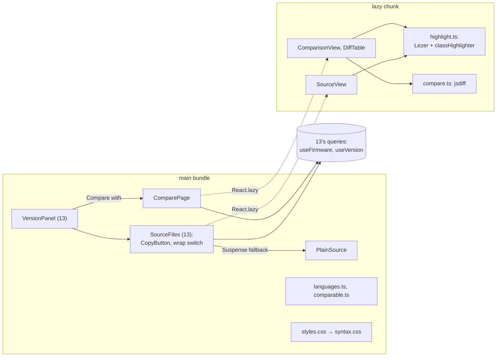

# Design Document: firmware viewer

## Overview

The second of three specs in `v0.7.0` Firmware. It delivers the phase's roadmap line
*Syntax-highlighted viewer, copy per file, diff between versions* and the viewer
[ADR 0006](../../../docs/adr/0006-firmware-snapshots.md) promised. It is web only: it reads the
versions [13-firmware-versions](../13-firmware-versions/design.md) answers, each file with its text
(`GET /api/firmware/versions/{id}`), and adds no route, schema or migration. It closes the item
[docs/design/visual-identity.md](../../../docs/design/visual-identity.md) left open, a syntax theme
drawn from the tokens. [15-flash-log](../15-flash-log/design.md) follows and closes the phase.

Three things carry the design. Highlighting without an editor, so the site's Content Security
Policy holds (decisions 1 to 3). Reading and copying a file (decisions 4 to 6). And comparing two
versions in the browser, where the computing costs the small server nothing (decisions 7 to 10).

**Owner decisions that bind this spec**, and what each does here:

- **ADR 0006** (2026-09-22): *a syntax-highlighted viewer, one-click copy per file and a diff
  between versions*. Decisions 1, 6 and 7.
- **The tech stack names CodeMirror 6 for the code viewer** (README, 2026-09-22). This spec uses
  CodeMirror 6's own parsers and highlighter, and not its editor view (decision 1).
- **The visual identity** (2026-09-22): colours from the tokens, status never by colour alone, one
  mono face, and anything a user copies exactly set in it. Decisions 3, 4 and 9.
- **One PR per spec with auto-merge; the release PR waits for the phase's last spec, and only the
  owner merges it** (2026-09-27). This spec is the second of three and carries no `Release-As`
  footer.

**Decisions this spec makes (2026-09-30), for the owner to check.** Where the repository doesn't
settle something, it is decided here, with the reason:

1. **CodeMirror 6's parsers and highlighter, without its editor view.** The editor view mounts its
   base theme as a `<style>` element in the document (style-mod does so for any root that has a
   `head`), and the site's CSP, `style-src 'self'` in `deploy/wiredex.caddy`, refuses inline styles.
   A nonce would need Caddy to template every response, a deploy change for what is a read-only
   view. So the viewer uses the layer beneath the editor: the Lezer grammars `@lezer/cpp`,
   `@lezer/python` and `@lezer/json` parse, and `@lezer/highlight`'s `highlightCode` walks the tree
   with `classHighlighter`, which names every token with a fixed class (`tok-keyword`,
   `tok-string`, `tok-comment` and so on). The app styles those classes in its own stylesheet
   (decision 3), so nothing inline is injected, the text is plain DOM a screen reader reads, and
   jsdom tests it without the measuring an editor needs. Drafts keep 13's text box.

2. **Four languages by extension, and plain text past a size.** `languageOf(path)`: C++ for
   `.ino .c .cc .cpp .cxx .h .hh .hpp .hxx`, since a sketch is C++; Python for `.py`, MicroPython's;
   JSON for `.json`; plain text for everything else, `platformio.ini` and `CMakeLists.txt`
   included. Another language is one grammar and one row. Lezer recovers from errors, so a sketch
   half written still highlights (requirement 1.3). Past 5,000 lines or 256 KB a file is shown
   plain and unnumbered: highlighting it would build tens of thousands of elements, and sketches are
   far smaller.

3. **The syntax theme is the existing tokens.** `source/syntax.css`, imported by `styles.css`, maps
   the classes to tokens: keywords to `--primary`; strings and escapes to `--ok`; numbers, atoms,
   booleans, preprocessor lines and macro names to `--accent-ink`; comments to `--muted`, in
   italics; type, class and namespace names to `--text` at weight 500; everything else to `--text`.
   No colour value is added, so dark mode follows the tokens. Code boxes sit on `--surface` framed by
   `--border`, not on `--surface-2`: on `--surface` every pair keeps 4.5:1 in both themes (the table
   in Data Models), while `--ok` on light `--surface-2` falls to about 4.3. The stylesheet ships
   with the main CSS, a few lines, so tokens are styled the moment they appear.

4. **A line is a row, and its number isn't part of its text.** `SourceView` renders a `<pre>` whose
   lines are rows: an `aria-hidden`, `select-none` number, then the line's tokens. Selecting and
   copying never pick the numbers up, and a screen reader reads only code (requirement 2.1). Rows
   are the lines 13 counts: a final line break ends the last line rather than opening an empty one.
   The `<pre>` takes `tabIndex={0}` and is labelled by its file's heading, so the keyboard reaches
   and scrolls it (requirement 2.4). *Wrap long lines* switches the rows to `whitespace-pre-wrap`;
   it is off by default and remembered through `preferences` under `wiredex.firmware.wrap`, beside
   the theme's `wiredex.theme` and the language's `wiredex.language`. Biome's
   `noNoninteractiveTabindex` rule flags a focusable `<pre>`, so the attribute carries the
   repository's usual `biome-ignore` with its reason: a box that scrolls must take focus for the
   keyboard to scroll it (WCAG 2.1.1).

5. **The highlighter loads with the first file, not with the app.** Every page is loaded eagerly
   today; the grammars and jsdiff would grow the one bundle every page pays for. `SourceView` and
   the comparison's body are the app's first `React.lazy` imports. Until their chunk arrives a file
   shows 13's plain `<pre>`, now `PlainSource`, so the text is never held back (requirement 1.5),
   and a page with no source never fetches the chunk (requirement 7.4). Vite splits the chunk by
   itself. An error boundary keeps the plain text if the chunk fails to load, a tab left open across
   a deploy, and says highlighting couldn't load.

6. **Copy writes the stored text, not the page.** *Copy* calls
   `navigator.clipboard.writeText(file.content)`, the text 13 answered, so nothing on the screen,
   numbers or wrapping, can leak into it (requirement 3.1). A status region says *Copied
   weather_station.ino*. Where the clipboard is missing or refuses, in an insecure context or with a
   permission denied, the file's text is selected with the Selection API and the region says *Press
   Ctrl+C, or ⌘C on a Mac, to copy* (requirement 3.3).

7. **A comparison is computed in the browser.** Its two sides are 13's version reads, cached by
   TanStack Query and at most 1 MB each; computing their difference on the laptop or phone in front
   of the owner costs the VM nothing and needs no route (requirement 8.1).
   `compareVersions(from, to)` matches files by the path folded as 13's unique index folds it, and
   sorts each into added, removed, changed or unchanged by exact text.

8. **Lines are compared with jsdiff.** The `diff` package, BSD-licensed and widely used, answers
   `structuredPatch`: hunks of `' '`, `'-'` and `'+'` lines with their starting lines, the unified
   diff the owner knows from `git diff`. Its context defaults to four lines, so it is called with
   `context: 3`, requirement 4.2's. Its `timeout` option makes it answer `undefined` for a
   pathological pair after one second, and that file is shown as changed with its sizes
   (requirement 4.9). A Myers diff written here would be one more algorithm to get right; the
   library's is exercised far beyond what this repository could.

9. **A comparison is a page, with its versions in the address.**
   `/firmware/$firmwareId/compare?from=…&to=…`, whose `validateSearch` keeps two ids or none. A
   version's panel offers *Compare with 1.1.0*: `to` is the version, and `from` its base when the
   base is in the firmware's list, or else the next version down that list, which 13 answers highest
   first; a version with neither offers no link. Two selects list every version with its status.
   A summary counts files and lines. Each changed, added or removed file is a region named by its
   path and status, holding a table (caption; old line, new line, change, text) of its hunks, each
   introduced by the lines it spans; unchanged files are named in one line. A changed line carries
   `+` or `−`, the word *added* or *removed* for screen readers, and a tinted gutter, so colour is
   never alone (requirement 5.1).

10. **Changed lines are highlighted as the viewer's are.** The From and To texts are each
    highlighted whole, then every line of a hunk takes its tokens by its line number, so a comment
    opened on an unchanged line still colours the changed line inside it. Files past decision 2's
    size are compared plain.

11. **No API change, no migration, no ADR.** The new packages are `@lezer/common`,
    `@lezer/highlight`, `@lezer/cpp`, `@lezer/python`, `@lezer/json` and `diff`, pinned exactly to
    versions published more than a day before, as pnpm 12 requires. 15's closing task records
    decision 1 in ADR 0006's implementation section and in the README's tech stack; `0014` stays
    free.

**Seen while designing, not changed here:**

- The README's tech stack names *CodeMirror 6* for the code viewer, and docs/architecture.md §7
  says it is *editable in drafts*. 15's closing documentation rewrites both after decision 1.
- The files index and the file regions 13 builds stay as they are; this spec only replaces what is
  inside each region's box and adds the buttons beside its heading.

**In scope:** `languageOf`, `highlightLines`, `SourceView`, `PlainSource`, `CopyButton`, the wrap
switch, the syntax theme, `compareVersions` and `comparisonBase`, the comparison page and its
table, the *Compare with* link, the E2E journey, and visual-identity.md's ticked item.

**Out of scope:** highlighting while editing; a side-by-side view, ignoring whitespace, changes
within a line and rename detection; comparing two firmware; downloads; Markdown changelogs; more
languages.

## Architecture



## Components and Interfaces

### Languages and highlighting

`apps/web/src/features/firmware/source/languages.ts`, in the main bundle:

```ts
export type Language = "cpp" | "python" | "json" | "plain";

/** Decision 2's table, extensions compared ignoring case. */
export function languageOf(path: string): Language;

export const HIGHLIGHT_LIMITS = { lines: 5_000, bytes: 262_144 } as const;

/** Whether a file is highlighted and numbered, or shown plain (requirement 1.4). */
export function highlightable(file: { size: number; lines: number }): boolean;
```

`apps/web/src/features/firmware/source/highlight.ts`, in the lazy chunk:

```ts
export type Token = { text: string; classes: string }; // "" when unstyled
export type HighlightedLine = Token[];

/**
 * The text as rows of tokens: exactly its lines, as 13 counts them, and exactly its characters
 * (property 1). Parses with the language's Lezer grammar and walks the tree with
 * `highlightCode(text, tree, classHighlighter, putText, putBreak)`; plain text is one token a line.
 */
export function highlightLines(text: string, language: Language): HighlightedLine[];
```

### The viewer

| File | Bundle | What |
| --- | --- | --- |
| `source/SourceView.tsx` | lazy | The `<pre tabIndex={0} aria-labelledby={headingId}>`, with decision 4's `biome-ignore`, and a row per line: an `aria-hidden` `select-none` number in `--muted`, then the tokens as `<span className={classes}>`; `whitespace-pre-wrap` when wrapping |
| `source/PlainSource.tsx` | main | 13's plain `<pre>`, now the fallback while the chunk loads, the view of a file past the limits (with its note) and of an empty file (*This file is empty*) |
| `source/useWrap.ts` | main | The remembered switch, `preferences.read/write("wiredex.firmware.wrap")` |
| `source/CopyButton.tsx` | main | *Copy*, named *Copy weather_station.ino*; the status region; the Selection API fallback over the file's box |
| `source/SourceErrorBoundary.tsx` | main | Keeps `PlainSource` and says highlighting couldn't load when the chunk fails |
| `SourceFiles.tsx` (13) | main | Each file region's box becomes `<Suspense fallback={<PlainSource/>}><SourceView/></Suspense>` in the error boundary; *Copy* beside each heading; *Wrap long lines* above the files |

`VersionPanel` (13) is unchanged but for the *Compare with …* link (decision 9).

### Comparing

`apps/web/src/features/firmware/source/compare.ts`, in the lazy chunk:

```ts
export type FileStatus = "added" | "removed" | "changed" | "unchanged";

export type DiffLine = {
  kind: "context" | "added" | "removed";
  text: string;
  oldNumber: number | null; // null on an added line
  newNumber: number | null; // null on a removed line
  // jsdiff's "\ No newline at end of file" after this line, kept as a flag rather than a row, so
  // a final line break added or removed reads as "no line break at the end" on the line it follows
  noFinalNewline: boolean;
};

export type Hunk = {
  oldStart: number;
  oldLines: number;
  newStart: number;
  newLines: number;
  lines: DiffLine[];
};

export type FileComparison = {
  path: string; // To's path, or From's for a removed file
  status: FileStatus;
  from: SourceFile | null;
  to: SourceFile | null;
  hunks: Hunk[] | null; // null: past the timeout (requirement 4.9)
  added: number;
  removed: number;
};

export type Comparison = {
  files: FileComparison[]; // 13's order over both sides: .ino first, then by folded path
  counts: Record<FileStatus, number>;
  lines: { added: number; removed: number };
};

/** Decision 7 and 8: files matched by folded path, lines by jsdiff's `structuredPatch`. */
export function compareVersions(
  from: SourceFile[],
  to: SourceFile[],
  options?: { timeoutMs?: number }, // 1,000 unless a test says otherwise
): Comparison;
```

`apps/web/src/features/firmware/source/comparable.ts`, in the main bundle:

```ts
/** Decision 9's default From: the base when the firmware lists it, else the next version down
 * 13's list (highest first), else none. Never the version itself (property 5). */
export function comparisonBase(versions: VersionSummary[], versionId: string): string | null;
```

### The comparison page

| File | Bundle | What |
| --- | --- | --- |
| `ComparePage.tsx` | main | The route: the firmware's name linking back, the *From* and *To* selects (each version with its status, highest first), the address kept in step, the wrong-version and same-version messages, then the lazy `ComparisonView` |
| `source/ComparisonView.tsx` | lazy | The summary sentence with its counts, *The two versions hold the same files* when nothing changed, a region per changed, added or removed file named *weather_station.ino, changed*, and the unchanged files named in one line |
| `source/DiffTable.tsx` | lazy | One file's table: a caption, the column headers, a row per hunk heading (*Lines 12–18 → 12–20*), and a row per line: old number, new number, the marker (`+` or `−` with the word for screen readers), and the highlighted text |
| `app/router.tsx` | main | `compareRoute` at `/firmware/$firmwareId/compare`, `validateSearch: validateCompareSearch` |

Keys under `firmware.source.*` and `firmware.compare.*` in both locales, the counts with i18next's
plurals. `src/test/server.ts`'s `respondWithVersion` answers every version it is given, by id, so a
test can serve both sides.

## Data Models

No API model changes. The syntax theme against `--surface`, with the contrasts visual-identity.md
gives each token, rounded as it rounds them (`--accent-ink` is 5.25 before rounding), and `--ok`
measured from `tokens.css` the same way:

| Classes | Token | Light | Dark |
| --- | --- | --- | --- |
| `tok-keyword` | `--primary` | 7.4 | 5.7 |
| `tok-string`, `tok-string2` | `--ok` | 5.0 | 8.0 |
| `tok-number`, `tok-atom`, `tok-bool`, `tok-literal`, `tok-meta`, `tok-macroName` | `--accent-ink` | 5.3 | 11.7 |
| `tok-comment` (italic) | `--muted` | 6.3 | 6.8 |
| `tok-typeName`, `tok-className`, `tok-namespace` (weight 500) | `--text` | 17.5 | 14.6 |
| every other class, and unstyled text | `--text` | 17.5 | 14.6 |

A comparison's changed line keeps its text on `--surface`, so every figure above holds in a diff
too; only its gutter is tinted, with `color-mix(in srgb, var(--ok) 16%, var(--surface))` for an
added line and `--crit` in its place for a removed one. The gutter's numbers stay `--muted`, at no
less than 4.9:1 on either tint in the light theme and 5.1:1 in the dark, and the marker is `--text`.

An example of what `compareVersions` answers for the sample *Weather station* `1.1.0` against the
draft `1.2.0` (13's demo):

```ts
{
  files: [
    { path: "weather_station.ino", status: "changed", added: 9, removed: 3,
      hunks: [{ oldStart: 9, oldLines: 7, newStart: 9, newLines: 13, lines: [/* … */] }] },
    { path: "config.h", status: "unchanged", added: 0, removed: 0, hunks: [] },
  ],
  counts: { added: 0, removed: 0, changed: 1, unchanged: 1 },
  lines: { added: 9, removed: 3 },
}
```

## Correctness Properties

Checked in Vitest over inputs from a small seeded generator written in the test files, two hundred
cases each, so no new dependency is needed.

### Property 1: highlighting keeps the text

For any text and language, the rows of `highlightLines` are as many as 13's `lines` count, and
joining each row's token texts with a line break, adding the final line break when the text ends
with one, gives the text back.

### Property 2: a comparison sorts every path once

For any two sets of files, every folded path of either side appears exactly once, as added (only
in To), removed (only in From), changed or unchanged (in both), and it is unchanged exactly when
the two texts are equal.

### Property 3: hunks turn From into To

For any changed file within the timeout, applying its hunks to its From text gives its To text, and
`added` and `removed` count its added and removed lines.

### Property 4: line numbers point at their lines

For any changed file, every context or removed line's old number names that line of From, and every
context or added line's new number names that line of To.

### Property 5: the default base is another version of the firmware

For any list of versions and any version in it, `comparisonBase` answers the base when the list
holds it, else the next version down the list, else none, and never the version itself.

## Error Handling

| Case | What the screen does |
| --- | --- |
| A comparison naming a version the firmware doesn't list, or one that answers 404 | Says that version isn't one of this firmware's and keeps the selects |
| The same version on both sides | Asks for two different versions |
| The clipboard missing or refusing | Selects the file's text and says how to copy it |
| A file past 5,000 lines or 256 KB | Shows it plain and unnumbered, saying why |
| A file's changes past the timeout | Shows the file as changed with its two sizes |
| The lazy chunk failing to load | Keeps the plain text and says highlighting couldn't load |

## Testing Strategy

| Level | Files | What |
| --- | --- | --- |
| Units | `source/languages.test.ts`, `source/highlight.test.ts`, `source/compare.test.ts`, `source/comparable.test.ts` | Properties 1 to 5; every extension's language; in a sketch, `void` a keyword, a string and a comment each styled; `def` a keyword in Python; a sketch cut in half still shown whole; the 5,000-line and 256 KB edges; the timeout answering no hunks |
| Components | `SourceView.test.tsx`, `CopyButton.test.tsx`, `SourceFiles.test.tsx` (13's, extended), `ComparePage.test.tsx`, `ComparisonView.test.tsx`, `VersionPanel.test.tsx` (13's, extended) | Numbers outside the accessibility tree and the selection; the wrap switch remembered; plain text first, highlighting after; *Copy* putting exactly the text on the clipboard and announcing it; the fallback selecting; the selects and the address; the counts; the words for added and removed lines; the same-version and wrong-version messages; the *Compare with* link's default |
| E2E | `e2e/tests/firmware-viewer.spec.ts` | Below |

The journey: a firmware whose `1.0.0` holds `app.ino` and `util.h` and is released, and whose `1.1.0`
starts from it, changes a line of `app.ino`, adds two, removes `util.h` and adds `util.cpp`. On
`1.0.0`, `app.ino` shows a highlighted keyword; *Copy* puts its exact text on the clipboard; *Wrap
long lines* leaves its box with nothing to scroll sideways. *Compare with 1.0.0* on `1.1.0` shows
one file changed, one added and one removed, and `app.ino`'s hunk with its removed and added lines.
Swapping the selects reverses the comparison. On a Pixel 7 neither page scrolls sideways.

## Seams for later specs

| Seam | For | What it is |
| --- | --- | --- |
| `CopyButton` beside a released version's files | 15-flash-log | Where copy, flash, then *Log a flash* follow each other on one panel |
| `highlightLines`, `languageOf` | 17-history | A source file shown before and after, in a firmware's history |
| `compareVersions` | 17-history | What a version changed, in the history's before and after |
| The first lazy chunk | later heavy screens | The pattern for code only some pages need, such as a rendered wiring diagram |

## After this spec

This spec ticks visual-identity.md's *Syntax-highlighting theme … derived from these tokens*, with
the table above, in the commit that builds the theme. The rest of the phase's documentation is
15-flash-log's last task.
