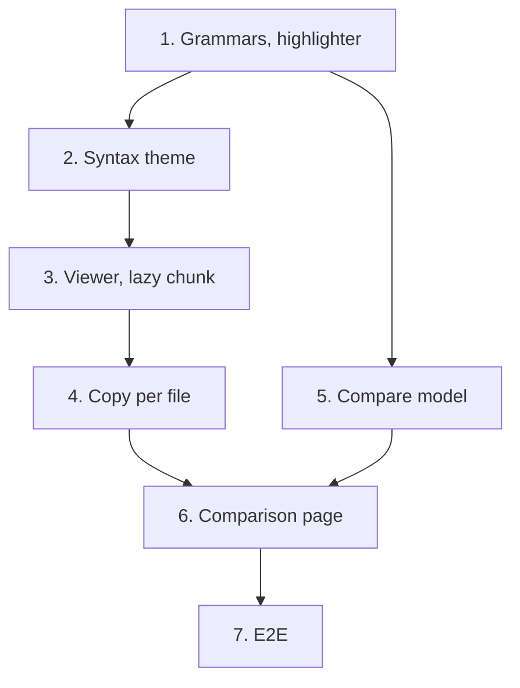

# Implementation Plan

## Overview

Seven tasks that build [design.md](design.md) against [requirements.md](requirements.md): the
grammars and the highlighter; the syntax theme; the viewer with its line numbers, wrapping and
first lazy chunk; copy per file; the comparison of two versions' files; the comparison page; and
the end-to-end journey. All of it is in `apps/web`: no route, no schema and no migration change, so
the head stays at `0020` and `packages/api-client` stays as
[13-firmware-versions](../13-firmware-versions/tasks.md) left it. No new ADR: `0014` stays free.

Branch first. Before task 1, 13-firmware-versions must be on `main`; then `git switch main && git
pull && git switch -c feat/firmware-viewer`, and never commit this spec's work on `main`. This
spec's documents reach `main` with 13's, in the phase's first documentation commit. This design was
written against 13's design, not its code: before task 1, check it against what 13 left (the
version read's shape, `SourceFiles.tsx`, `VersionPanel.tsx`, `respondWithVersion`) and correct it in
a `docs:` commit if they differ, as the netlist editor's spec was aligned with what was built.

One task, one commit, each passing `make check` **on its own** (AGENTS.md). `pnpm --filter
@wiredex/web test:coverage` on tasks 3 to 6, the web floor CI holds; `make e2e` on 3, 4, 6 and 7.
Tick the task in this file in the same commit. Suggested commit subjects are in `code` under each
task.

Release footer: this spec is **the second of three** in `v0.7.0`, so no task carries `Release-As`;
15-flash-log's last task carries `Release-As: 0.7.0`. See [Notes](#one-pr-per-spec-and-the-release).

## Tasks

- [ ] 1. Web: read firmware source as C++, Python or JSON
  - `@lezer/common`, `@lezer/highlight`, `@lezer/cpp`, `@lezer/python` and `@lezer/json` in
    `apps/web/package.json`, each pinned exactly to a version published more than a day before;
    the lockfile in this commit.
  - `features/firmware/source/languages.ts` (`languageOf`, `HIGHLIGHT_LIMITS`, `highlightable`) and
    `source/highlight.ts` (`highlightLines` over `highlightCode` and `classHighlighter`).
  - Tests: `languages.test.ts` (every extension, case ignored, the limits' edges),
    `highlight.test.ts` (property 1; `void`, a string and a comment in a sketch; `def` in Python; a
    key and a number in JSON; a sketch cut in half shown whole).
  - Checks: `make check`.
  - `feat(web): read firmware source as C++, Python or JSON`
  - _Requirements: 1.1, 1.2, 1.3, 1.4, 8.3, 8.4, 8.5_

- [ ] 2. Web: colour firmware source from the theme's tokens
  - `features/firmware/source/syntax.css`, imported by `src/styles.css`: the classes of design's Data
    Models table mapped to the tokens, and the diff gutter's tints with `color-mix`.
  - `docs/design/visual-identity.md`: *Syntax-highlighting theme … derived from these tokens* ticked,
    with the table of classes, tokens and contrasts.
  - Tests: none beyond `make check`; the contrasts are measured in the design from `tokens.css`, and
    no hex value is added (Biome and review).
  - Checks: `make check`.
  - `feat(web): colour firmware source from the theme's tokens`
  - _Requirements: 6.1, 6.2, 6.3, 7.1_

- [ ] 3. Web: show firmware source highlighted with line numbers
  - `source/SourceView.tsx` behind `React.lazy`, `source/PlainSource.tsx`, `source/useWrap.ts`,
    `source/SourceErrorBoundary.tsx`; 13's `SourceFiles.tsx` renders them, with *Wrap long lines*
    above the files; `firmware.source.*` keys in both locales.
  - Tests: `SourceView.test.tsx` and `SourceFiles.test.tsx` (the text shown plain, then highlighted;
    numbers outside the accessibility tree and unselectable; the box focusable and named by its path;
    wrapping switched and remembered; the empty file and the large file's notes; the chunk failing
    leaving the plain text); the web suite at or above 85 %.
  - Checks: `make check`, `pnpm --filter @wiredex/web test:coverage`, `make e2e`.
  - `feat(web): show firmware source highlighted with line numbers`
  - _Requirements: 1.4, 1.5, 2.1, 2.2, 2.3, 2.4, 2.5, 7.1, 7.2, 7.3, 7.4, 8.2_

- [ ] 4. Web: copy a source file in one click
  - `source/CopyButton.tsx` beside each file's heading, the status region, and the Selection API
    fallback; keys in both locales.
  - Tests: `CopyButton.test.tsx` (the clipboard holding exactly the stored text, CRLF-free, with no
    numbers; the announcement naming the file; a clipboard that refuses selecting the text and saying
    how to copy; offered on a draft and on a release).
  - Checks: `make check`, `pnpm --filter @wiredex/web test:coverage`, `make e2e`.
  - `feat(web): copy a source file in one click`
  - _Requirements: 3.1, 3.2, 3.3, 3.4, 7.1, 7.2_

- [ ] 5. Web: compare the files of two firmware versions
  - `diff` in `apps/web/package.json`, pinned exactly; the lockfile in this commit.
  - `source/compare.ts` (`compareVersions` over jsdiff's `structuredPatch`, with `context: 3` and
    its `timeout`) and `source/comparable.ts` (`comparisonBase`).
  - Tests: `compare.test.ts` (properties 2 to 4; a path changed only in case; an added and a removed
    file as all-added and all-removed hunks; a final line break added, flagged on its line and not a
    row; the timeout answering no hunks), `comparable.test.ts` (property 5).
  - Checks: `make check`, `pnpm --filter @wiredex/web test:coverage`.
  - `feat(web): compare the files of two firmware versions`
  - _Requirements: 4.1, 4.2, 4.3, 4.6, 4.9, 8.3, 8.4, 8.5_

- [ ] 6. Web: show what changed between two firmware versions
  - The `/firmware/$firmwareId/compare` route with `validateCompareSearch`; `ComparePage.tsx`,
    `source/ComparisonView.tsx` and `source/DiffTable.tsx` behind the lazy import; *Compare with …*
    on 13's `VersionPanel`; `firmware.compare.*` keys in both locales; `respondWithVersion` serving
    several versions.
  - Tests: `ComparePage.test.tsx`, `ComparisonView.test.tsx`, `VersionPanel.test.tsx` (the selects and
    the address; the summary's counts; *added* and *removed* in words; highlighted lines; the same
    versions; a version of another firmware; no link on a first version); the web suite at or above
    85 %.
  - Checks: `make check`, `pnpm --filter @wiredex/web test:coverage`, `make e2e`.
  - `feat(web): show what changed between two firmware versions`
  - _Requirements: 4.4, 4.5, 4.6, 4.7, 4.8, 5.1, 5.2, 5.3, 7.1, 7.2, 7.3, 7.4, 8.1, 8.2_

- [ ] 7. E2E: reading, copying and comparing
  - `e2e/tests/firmware-viewer.spec.ts` on the shared session, names from `Date.now()`, the clipboard
    permissions granted to its context: the journey of design's Testing Strategy.
  - In the mobile project, the version page and the comparison have no horizontal page overflow.
  - Checks: `make check`, `make e2e`.
  - `test(e2e): cover reading, copying and comparing firmware source`
  - _Requirements: 1.1, 2.2, 3.1, 4.1, 4.2, 4.4, 4.6, 4.7, 5.1, 7.3_

## Task Dependency Graph



```json
{
  "waves": [
    { "wave": 1, "tasks": [{ "id": "1", "name": "Grammars, highlighter", "dependsOn": [] }] },
    {
      "wave": 2,
      "tasks": [
        { "id": "2", "name": "Syntax theme", "dependsOn": ["1"] },
        { "id": "5", "name": "Compare model", "dependsOn": ["1"] }
      ]
    },
    { "wave": 3, "tasks": [{ "id": "3", "name": "Viewer, lazy chunk", "dependsOn": ["2"] }] },
    { "wave": 4, "tasks": [{ "id": "4", "name": "Copy per file", "dependsOn": ["3"] }] },
    { "wave": 5, "tasks": [{ "id": "6", "name": "Comparison page", "dependsOn": ["4", "5"] }] },
    { "wave": 6, "tasks": [{ "id": "7", "name": "E2E", "dependsOn": ["6"] }] }
  ]
}
```

Reading it:

- **Root.** 1 depends on no task here. The spec as a whole needs 13-firmware-versions on `main`;
  that is a phase-level dependency, not a task edge.
- **Critical path.** 1 → 2 → 3 → 4 → 6 → 7. The comparison's model (5) runs beside the viewer and
  joins at 6.
- **2 and 5 side by side.** The theme touches the stylesheets and visual-identity.md, the model
  touches `package.json` and its own module; they share no file.
- **3, 4 and 6 in line.** All three write the locale files, and 3 and 4 both change
  `SourceFiles.tsx`.

## Notes

### Before pushing

- `make check` on every commit, not only the last.
- `pnpm --filter @wiredex/web test:coverage` on 3 to 6: the web floor is 85 %. The API's floor is
  untouched, since nothing in `apps/api` changes.
- `make client` must leave `packages/api-client` unchanged on every commit: this spec changes no
  route or schema.
- `make e2e` on 3, 4, 6 and 7.
- The new packages are pinned exactly, and CI's OSV-Scanner passes over `pnpm-lock.yaml`.

### One PR per spec, and the release

Open this spec's PR from `feat/firmware-viewer`, based on `main` after 13-firmware-versions merged,
and turn on auto-merge with `gh pr merge N --rebase --auto`. Its commits wait on `main` for
15-flash-log, whose last task carries `Release-As: 0.7.0`; merging the release PR deploys to
production, and only the owner decides when (AGENTS.md, Safety).
