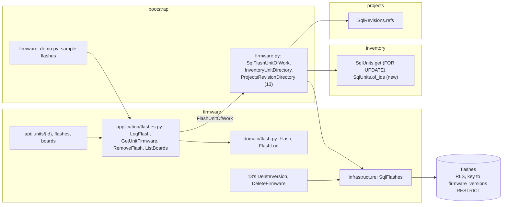

# Design Document: flash log

## Overview

The last of three specs in `v0.7.0` Firmware. It delivers the phase's roadmap line *Flash log per
unit, with the current version shown on the unit page*, and closes the phase with the documentation
commit that carries `Release-As: 0.7.0`. It builds
[ADR 0006](../../../docs/adr/0006-firmware-snapshots.md)'s deployment log, a *flash* here: which
released version of [13-firmware-versions](../13-firmware-versions/design.md) went onto which unit
of [06-tracked-units](../06-tracked-units/design.md), when, and why. A unit's current version is its
newest flash. The flash records the revision [10-build-lifecycle](../10-build-lifecycle/design.md)
says holds the unit, and a version a flash names can't be deleted. The unit page shows what the board
runs; a firmware's page shows the boards running it; and a released version's panel, where
[14-firmware-viewer](../14-firmware-viewer/design.md) copies the code, logs the flash that follows.

Three things carry the design: what a flash records and what it refuses (decisions 1 to 5), how
firmware reads and locks inventory's units without importing inventory (decision 8), and what keeps
the record whole when versions, firmware and units are deleted (decisions 6 and 7).

**Owner decisions that bind this spec**, and what each does here:

- **ADR 0006** (2026-09-22): *a deployment log records unit ← version flashes with a date and notes;
  a unit's current firmware is its latest deployment.* Decisions 1 and 4.
- **Every microcontroller board is a unit** (2026-09-26, docs/architecture.md §10 question 1). Any
  unit can be flashed; no category is checked (decision 7).
- **One PR per spec with auto-merge; the release PR waits for the phase's last spec, this one, and
  only the owner merges it** (2026-09-27). This spec's last task carries `Release-As: 0.7.0`.
- **A change history waits for `v0.8.0`** (2026-09-26). A removed flash is gone; 17-history will
  record removals (decision 5).

**Decisions this spec makes (2026-09-30), for the owner to check.** Where the repository doesn't
settle something, it is decided here, with the reason:

1. **A flash is a row in firmware, and the unit a bare id.** `flashes` lives in the firmware module,
   as ADR 0006 and docs/architecture.md §2 place deployments (`FW -- flashed on unit --> INV`). Its
   `unit_id` is a bare id, as every id across modules is; its `version_id` is a composite key into
   13's `firmware_versions` (decision 6). The code and the screens say *flash*, the roadmap's word;
   ADR 0006's *deployment* is the same thing.

2. **Only a released version is flashed.** A draft can still change, so an entry naming one would
   stop meaning the code on the board the moment the draft was edited: a draft is refused with 409
   `not_released`. A test build is logged the way SemVer means it to be, as a released pre-release
   such as `1.3.0-rc.1`.

3. **A flash keeps its unit's code and revision as they were.** `unit_code` is the unit's short code
   at logging, which 06 mints once and never changes or reuses, so a deleted unit's entries still
   say `WX-U-0003`. `revision_id` is the revision holding the unit when the flash is logged, or
   none. 10's seams table expected a flash to read the unit's `revision_id` at every read, *with no
   new link*; but 10's own cancel and dismantle clear that link, so a log read after a dismantle
   would lose the build its board was flashed in, and one nullable column keeps it. An entry logged
   days late for an earlier time records the unit's revision at logging, which is what Wiredex knows.
   The revision is resolved at every read through 13's `RevisionDirectory`, as 13's links are, so a
   deleted revision is left out.

4. **The current version is the newest by flash time, then by logging.** A unit's flashes order by
   `flashed_at`, then `created_at`, then id (UUIDv7, time-ordered), newest first, and the first one's
   version is current. A flash backdated to last week takes its place in the history without
   becoming current, and the order is total, so two flashes with one time still order.

5. **Any flash can be removed, and none is edited.** A log is only useful while it is right: a flash
   logged on the wrong board is removed and logged again. Editing a time or notes isn't common enough
   for a form of its own. Removing the newest flash makes the one before it current, which is what
   *the entry was a mistake* means.

6. **A flashed version stays, and so does its firmware.** 13's `DeleteVersion` refuses with 409
   `version_flashed`, and `DeleteFirmware` with 409 `firmware_flashed`; the foreign key from
   `flashes`, `ON DELETE RESTRICT`, is the database's own refusal behind them. The refusal answers
   the flashes in the way, each with its unit's code and whether inventory still holds the unit, so
   the page lists them and offers to remove each one there (decision 5). That is also how a deleted
   unit's entries are cleared, since its own page is gone: without it, a version flashed onto a unit
   later deleted could never be deleted. Removing an entry is the owner saying the board never ran
   the version. A released version stays immutable, as 13 made it; nothing here touches its files.

7. **A retired unit isn't flashed, and a deleted unit keeps its log.** Retired means damaged or lost
   (06), so a flash on a retired unit is a wrong pick: 409 `unit_retired`, which says to un-retire it
   first. Inventory deletes only retired units and keeps their movements (ADR 0002); firmware keeps
   their flashes the same way, and a firmware's boards leave out units inventory no longer holds.
   Any other status flashes: an in-stock board tested before a build, a reserved one on the bench,
   an in-use one in its enclosure.

8. **Firmware reads and locks inventory's units on its own session.** Firmware declares
   `UnitDirectory` (`lock(unit_id)`: one unit's facts, its row locked; `facts(unit_ids)`: many in one
   read, unlocked) as a property of `FlashUnitOfWork(RunsOnUnitOfWork)`. `bootstrap/firmware.py`
   binds `InventoryUnitDirectory` over inventory's `SqlUnits` on firmware's session: `lock` reads
   through `SqlUnits.get`, which already takes `SELECT … FOR UPDATE`, so a flash and 06's retire or
   delete of the same unit take turns (requirement 1.11); `facts` reads through a new
   `Units.of_ids`, one plain `SELECT` and inventory's only change. A unit's facts are its code,
   whether it is retired, and the revision holding it, plain values, since firmware imports nothing
   from inventory. It is the sixth use of 07's shared-session pattern.

9. **A flash locks its version's firmware, then the unit.** `LogFlash` takes 13's `lock_version`
   before `units.lock`, and `DeleteVersion` takes the same firmware lock, so no version is deleted
   between a flash's check and its insert. Nothing takes a unit's lock and then a firmware's, so no
   two writers wait on each other in a circle.

10. **A newer release is the firmware's latest release above the current version.**
    `FirmwareVersions.newer_than(number)` answers `latest_release` when it is above the number, and
    none otherwise. A released pre-release counts: the owner released it. The unit page and each
    board show it as *1.1.0 is out*, in `--warn` with an icon and the words, the colour visual
    identity gives a version mismatch.

11. **A firmware's boards are the units whose newest flash is its.** One `SELECT DISTINCT ON
    (unit_id)` over `flashes` joined to `firmware_versions` picks each unit's newest flash, among the
    units any flash of the firmware names, and keeps those whose version is the firmware's; the
    units' facts then drop the retired ones and those inventory no longer holds. Boards are ordered
    by code, and each names the revision holding its unit now.

12. **Reads are fixed.** With the workspace setting, a unit's log is five statements: the unit, its
    flashes joined to their versions and firmware, the revisions they recorded, and the current
    firmware's versions for the newer release. A firmware's boards are six: the firmware, each
    unit's newest flash, the units, the revisions those flashes recorded and those holding the units
    now in one read, and the firmware's versions. Neither
    grows with the numbers of flashes, units or versions (requirement 9.3).

13. **Four routes, and refusals that list the flashes in the way.** `GET
    /api/firmware/units/{unit_id}`, `POST /api/firmware/units/{unit_id}/flashes`, `DELETE
    /api/firmware/flashes/{flash_id}` and `GET /api/firmware/{firmware_id}/boards`, declared before
    `/{firmware_id}` as 13's static paths are. `FirmwareRefusalResponse` gains `flashes`, those a
    refused delete names, empty for every other refusal, so the web links each unit still held and
    removes each flash (requirement 8.7). The six new codes and three fields join 13's enums and
    unions in one commit, task 1's, with the client regenerated, so the wire-names test never sees
    one without the other.

14. **The web logs a flash from both ends.** The unit page gains a *Firmware* section, rendered by
    inventory's `UnitPage` from `features/firmware/`, as catalog's `PartPage` renders projects' pin
    usage: the current version, the newer release, the log and *Log a flash*. A released version's
    panel gains *Log a flash* beside the files 14 copies, so copying the code, flashing it and
    logging it happen on one page. One `LogFlashDialog` serves both, fixed on the unit or on the
    version. From a held unit it lists the firmware running on the unit's revision first, through
    13's `ListRevisionFirmware`; from a version it finds units with a new inventory `UnitPicker`, a
    combobox over 06's unit search, as `PartPicker` is over the catalog's. The time is a
    `datetime-local` defaulting to now, sent with the browser's offset.

15. **The demo bench logs two flashes.** The sample ESP32 (`WX-U-0001`), which the sample
    greenhouse reserves, flashed with *Greenhouse controller* `0.1.0` a day before the restore; the
    sample Pico (`WX-U-0002`), in stock, with *Pico blink* `1.0.0` two days before, so its page shows
    `1.1.0` out. The weather station's firmware runs on no board, since the bench's one ESP32 is the
    greenhouse's. The sample units are found by their MACs, which 06's sample data fixes.

16. **One migration, and the phase's documentation.** `0021_flashes.py` adds the table and changes
    nothing that exists; ADR 0007's list of isolated tables gains `flashes` in its commit, as 13's
    migration added its four. No new ADR: ADR 0006 decided the log, and task 11 records how the phase
    built it. `0014` stays free.

**Seen while designing, not changed here:**

- Inventory's router maps nothing for `UnitHeldError`, so it answers 422 where its docstring says
  409. Flashing never raises it; it stays inventory's to settle.
- `Units.of_location`'s docstring says in-use units are left out, and `SqlUnits.of_location` keeps
  them. Nothing here reads it.
- 10's seams table offered `Units.of_revision` for *a flash entry for a unit can say "on the
  greenhouse A board"*; decision 3 records the revision on the flash instead, for the reason given
  there.

**In scope:** `Flash`, `FlashNotes`, `UnitCode`, `UnitFacts`, `FlashLog`;
`FirmwareVersions.newer_than`; `LogFlash`, `GetUnitFirmware`, `RemoveFlash`, `ListBoards`, and the
flashed refusals in 13's deletes with the `BlockingFlash`es they carry; inventory's `Units.of_ids`;
`InventoryUnitDirectory` and `SqlFlashUnitOfWork`; migration `0021` with its repository; the
routes; the sample flashes; the unit page's *Firmware* section, the dialog, the unit picker, the
firmware page's boards and the refusals' flashes; the E2E journey; the phase's closing
documentation.

**Out of scope:** flashing from the browser (*Later*); editing a flash; a board's firmware on the
revision page, in the units list or on the dashboard (18-dashboard); matching a firmware's target
to a unit's part; the log's history (`v0.8.0`).

## Architecture



## Components and Interfaces

### Firmware: flashes in the domain

`apps/api/src/wiredex/firmware/domain/values.py` gains `UnitId` and `FlashId`, and
`apps/api/src/wiredex/firmware/domain/flash.py` holds:

```python
MAX_NOTES_LENGTH = 500
FUTURE_ALLOWANCE = timedelta(minutes=5)  # a phone's clock a little ahead of the server's


@dataclass(frozen=True, slots=True)
class UnitCode:
    """A unit's short code as inventory minted it, 1 to 16 characters, kept as given."""

    value: str


@dataclass(frozen=True, slots=True)
class FlashNotes:
    """Trimmed and collapsed, 1 to 500 characters, no control character."""

    value: str


@dataclass(frozen=True, slots=True)
class UnitFacts:
    """A unit as firmware sees it (decision 8): plain values, no inventory type."""

    unit_id: UnitId
    code: UnitCode
    retired: bool
    revision_id: RevisionId | None  # the revision holding it, while reserved or in use


@dataclass(frozen=True, slots=True)
class Flash:
    id: FlashId
    workspace_id: WorkspaceId
    unit_id: UnitId
    unit_code: UnitCode
    version_id: VersionId
    revision_id: RevisionId | None  # the unit's, when the flash was logged (decision 3)
    flashed_at: datetime
    notes: FlashNotes | None
    created_at: datetime

    @classmethod
    def record(
        cls, flash_id: FlashId, unit: UnitFacts, version: FirmwareVersion,
        flashed_at: datetime | None, notes: FlashNotes | None, now: datetime,
    ) -> Flash:
        """`NotReleasedError` for a draft, `UnitRetiredError` for a retired unit,
        `FlashedInFutureError` past `now + FUTURE_ALLOWANCE`; no time means `now`."""

    def order(self) -> tuple[datetime, datetime, UUID]: ...  # (flashed_at, created_at, id)


@dataclass(frozen=True, slots=True)
class FlashLog:
    """A unit's flashes, newest first (decision 4)."""

    items: tuple[Flash, ...]

    @classmethod
    def of(cls, flashes: Iterable[Flash]) -> FlashLog: ...

    @property
    def current(self) -> Flash | None: ...
```

13's `FirmwareVersions` gains `newer_than(number: SemVer) -> FirmwareVersion | None` (decision 10).
`errors.py` gains `UnitNotFoundError` and `FlashNotFoundError`, and the refusals `NotReleasedError`,
`UnitRetiredError`, `FlashedInFutureError`, `InvalidNotesError`, `VersionFlashedError` and
`FirmwareFlashedError`; the last two carry the flashes in the way (decision 6).

### Firmware: application

`firmware/application/ports.py` gains:

```python
class UnitDirectory(Protocol):
    async def lock(self, unit_id: UnitId) -> UnitFacts | None:
        """The unit, its row locked until the transaction ends, or None (decision 8)."""
        ...

    async def facts(self, unit_ids: Collection[UnitId]) -> Mapping[UnitId, UnitFacts]:
        """The listed units the workspace holds, in one read, unlocked; any other is absent."""
        ...


@dataclass(frozen=True, slots=True)
class NewFlash:
    """A flash as logged: the version, a time or none for now, and notes (requirement 1)."""

    version_id: VersionId
    flashed_at: datetime | None = None
    notes: FlashNotes | None = None


@dataclass(frozen=True, slots=True)
class FlashEntry:
    """A flash with what its log shows beside it, read in one join."""

    flash: Flash
    firmware_id: FirmwareId
    firmware_name: FirmwareName
    number: SemVer


class Flashes(Protocol):
    async def add(self, flash: Flash) -> None: ...
    async def get(self, flash_id: FlashId) -> Flash | None: ...
    async def remove(self, flash: Flash) -> None: ...
    async def of_unit(self, unit_id: UnitId) -> list[FlashEntry]: ...  # newest first
    async def current_on(self, firmware_id: FirmwareId) -> list[FlashEntry]:
        """Each unit's newest flash, kept when its version is the firmware's (decision 11)."""
        ...
    async def of_version(self, version_id: VersionId) -> list[FlashEntry]: ...  # what keeps it
    async def of_firmware(self, firmware_id: FirmwareId) -> list[FlashEntry]: ...  # the same


class FlashUnitOfWork(RunsOnUnitOfWork, Protocol):
    """Firmware's unit of work that also reads and locks inventory's units (decision 8)."""

    @property
    def units(self) -> UnitDirectory: ...
```

`FirmwareUnitOfWork` gains `flashes: Flashes`, since the table is firmware's own, and `clear()`
empties it first.

`firmware/application/flashes.py`:

| Use case | What it does |
| --- | --- |
| `LogFlash(unit_of_work, clock, ids)` | `(workspace_id, unit_id, NewFlash(version_id, flashed_at, notes))`: `lock_version`, `units.lock` (404), `Flash.record`, `flashes.add`, one commit; answers the entry with its revision |
| `GetUnitFirmware(unit_of_work)` | `units.facts([unit_id])` (404), `flashes.of_unit`, the recorded revisions' refs, the current firmware's versions for `newer_than` |
| `RemoveFlash(unit_of_work)` | `flashes.get` (404), `remove`, one commit |
| `ListBoards(unit_of_work)` | `firmwares.get` (404), `flashes.current_on`, `units.facts` dropping the retired and the gone, one `refs` read for both the revisions the flashes recorded and those holding the units now, the firmware's versions for `newer_than`; ordered by code |

The views:

```python
@dataclass(frozen=True, slots=True)
class FlashView:
    entry: FlashEntry
    revision: RevisionFacts | None  # recorded and still in the workspace


@dataclass(frozen=True, slots=True)
class UnitFirmwareView:
    unit: UnitFacts
    flashes: tuple[FlashView, ...]  # newest first
    newer_release: FirmwareVersion | None  # of the current version's firmware

    @property
    def current(self) -> FlashView | None: ...


@dataclass(frozen=True, slots=True)
class BoardView:
    unit: UnitFacts
    revision: RevisionFacts | None  # holding the unit now
    current: FlashView  # its own recorded revision resolved in the same `refs` read
    newer_release: FirmwareVersion | None


@dataclass(frozen=True, slots=True)
class BlockingFlash:
    """A flash that keeps a version from being deleted, and whether its unit is still held."""

    entry: FlashEntry
    unit_present: bool
```

13's `DeleteVersion` reads `flashes.of_version` after `lock_version`, and `DeleteFirmware`
`flashes.of_firmware` after `lock_firmware`; when either finds any, `units.facts` says which units
inventory still holds, and the use case refuses with `VersionFlashedError` or
`FirmwareFlashedError` carrying the `BlockingFlash`es. Both now take a `FlashUnitOfWork`, which
bootstrap's one factory has answered since task 4, and keep their call signatures.

### Inventory: several units in one read

`inventory/application/ports.py`'s `Units` gains:

```python
async def of_ids(self, unit_ids: Collection[UnitId]) -> list[Unit]:
    """The listed units the workspace holds, in one read and unlocked, by code; any other is
    absent. What another module's directory reads (15-flash-log decision 8)."""
```

with `SqlUnits.of_ids` (one `SELECT … WHERE id = ANY(…)`, filtered on the workspace) and the fake's
in `tests/support/inventory.py`. Nothing else in inventory changes.

### Bootstrap: firmware's session

`bootstrap/firmware.py` gains:

```python
class InventoryUnitDirectory:
    """Firmware's `UnitDirectory` over inventory's `SqlUnits`, on firmware's session: `lock` through
    `get`, which locks the row, and `facts` through `of_ids`, each `Unit` read as `UnitFacts`."""

    def __init__(self, units: SqlUnits) -> None: ...


class SqlFlashUnitOfWork(SqlRunsOnUnitOfWork):
    """13's unit of work with inventory's units bound on its session too (decision 8)."""

    units: InventoryUnitDirectory

    async def __aenter__(self) -> Self:
        await super().__aenter__()
        inventory = SqlInventoryRepositories(self.session, InventoryWorkspaceId(self._workspace))
        self.units = InventoryUnitDirectory(inventory.units)
        return self
```

`firmware_use_cases` builds every use case over `SqlFlashUnitOfWork` from here on, so one factory
still serves them all.

### HTTP

| Method and path | Answers | Requirement |
| --- | --- | --- |
| `GET /api/firmware/units/{unit_id}` | `UnitFirmwareResponse` | 2 |
| `POST /api/firmware/units/{unit_id}/flashes` | 201 `FlashResponse` | 1 |
| `DELETE /api/firmware/flashes/{flash_id}` | 204 | 3 |
| `GET /api/firmware/{firmware_id}/boards` | `list[BoardResponse]` | 4 |

```python
class FlashRequest(BaseModel):
    version_id: UUID
    flashed_at: AwareDatetime | None = None  # none: now; a time without an offset is a 422
    notes: str | None = None


class UnitTagResponse(BaseModel):
    id: UUID
    code: str


class FlashResponse(BaseModel):
    id: UUID
    unit: UnitTagResponse
    firmware_id: UUID
    firmware_name: str
    version: VersionTagResponse
    revision: RunsOnResponse | None  # recorded, and still in the workspace
    flashed_at: datetime
    notes: str | None
    created_at: datetime


class UnitFirmwareResponse(BaseModel):
    unit: UnitTagResponse
    retired: bool
    current: FlashResponse | None
    newer_release: VersionTagResponse | None
    flashes: list[FlashResponse]  # newest first


class BoardResponse(BaseModel):
    unit: UnitTagResponse
    revision: RunsOnResponse | None  # holding the unit now
    flash: FlashResponse
    newer_release: VersionTagResponse | None
```

```python
class BlockingFlashResponse(BaseModel):
    id: UUID
    unit: UnitTagResponse
    unit_present: bool  # link the unit only while inventory holds it
    version: VersionTagResponse
    flashed_at: datetime
```

13's unions gain `not_released`, `unit_retired`, `flashed_in_future`, `invalid_notes`,
`version_flashed` and `firmware_flashed` among the codes, and `unit`, `flashed_at` and `notes` among
the fields, with the enums, in task 1; `FirmwareRefusalResponse` gains
`flashes: list[BlockingFlashResponse]`, empty unless a delete is refused. `FirmwareUseCases` gains
`log_flash`, `get_unit_firmware`, `remove_flash` and `list_boards`.

### Web

| File | What |
| --- | --- |
| `features/firmware/flashes.ts` | `firmwareKeys.unit(unitId)` and `firmwareKeys.boards(firmwareId)` under 13's root; `useUnitFirmware`, `useBoards`, `useLogFlash`, `useRemoveFlash`, each write refreshing `firmwareKeys.all` |
| `features/firmware/FlashLogSection.tsx` | The unit page's region *Firmware*: the current firmware and version as links, when it was flashed, the newer release in words and an icon; the log as a table (flashed, firmware, version, recorded revision, notes, *Remove* asking in its row); *Log a flash*, or for a retired unit a line saying it can't be flashed |
| `features/firmware/LogFlashDialog.tsx` | Fixed on a unit: *Firmware* (those running on the unit's revision in their own group first), then *Version* (released ones, highest first, or a line saying the firmware has none yet); fixed on a version: *Board* (`UnitPicker`). Then *Flashed at* (`datetime-local`, now, not past now) and *Notes*. In inventory's `StockDialog` shell |
| `features/firmware/BoardsSection.tsx` | The firmware page's region *Boards*: each unit's code linking to its page, its version, when it was flashed, where it is now, and the newer release; *No board runs this firmware yet* when empty |
| `features/inventory/UnitPicker.tsx` | A combobox over 06's unit search: code, serial or MAC typed, each unit shown with its code and status, a retired one `aria-disabled` and marked in words; a `role="status"` count, as `PartPicker` has |
| `features/inventory/UnitPage.tsx` | Renders `FlashLogSection` under the unit's details |
| `features/firmware/BlockingFlashes.tsx` | A refused delete's flashes: each unit's code, a link while `unit_present`, the version and time, and *Remove*, which asks in its row; used by both pages below |
| `features/firmware/VersionPanel.tsx` (13) | *Log a flash* on a released version; a refused delete shows `BlockingFlashes` |
| `features/firmware/FirmwarePage.tsx` (13) | Renders `BoardsSection`; a refused delete shows `BlockingFlashes` |

Keys under `firmware.flash.*`, `firmware.boards.*` and `inventory.units.picker.*` in both locales.
`src/test/server.ts` gains `aFlash`, `aUnitFirmware`, `aBoard`, `respondWithUnitFirmware`,
`respondWithBoards` and `acceptFlashWrites`; `respondWithUnit` also answers an empty log for its unit,
and `respondWithFirmware` and `acceptFirmwareWrites`, which both serve a firmware's page, an empty
list of boards, since the pages now ask for them.

### The demo bench

`firmware/application/demo.py` gains `SAMPLE_FLASHES` and a last step in `RestoreSampleFirmware`:
each sample flash through `LogFlash`, its unit found by MAC through `DemoUnits`, which
`bootstrap/firmware_demo.py` answers over inventory's `SearchUnits`, as 13's `DemoRevisions` answers
over projects' use cases. The restore's clock dates them.

| Board | Firmware and version | Flashed | Notes | Recorded revision |
| --- | --- | --- | --- | --- |
| The sample ESP32-DevKitC (MAC `aa:bb:cc:00:11:22`), reserved for *Greenhouse controller* `A` | *Greenhouse controller* `0.1.0` | a day before the restore | *Bench test before the build* | *Greenhouse controller* `A` |
| The sample Raspberry Pi Pico (MAC `aa:bb:cc:00:11:33`), in stock | *Pico blink* `1.0.0` | two days before | *Checking a new board* | none |

## Data Models

`0021_flashes.py`, autogenerated and reviewed, the table isolated:

```text
flashes
  id uuid pk, workspace_id uuid not null
  unit_id uuid not null                  -- inventory's unit: bare, no key (decision 1)
  unit_code varchar(16) not null         -- as minted; codes never change or return (decision 3)
  version_id uuid not null
  revision_id uuid null                  -- projects' revision holding the unit when logged: bare
  flashed_at timestamptz not null
  notes varchar(500) null
  created_at timestamptz not null
  fk (workspace_id, version_id) → firmware_versions (workspace_id, id) ON DELETE RESTRICT
  index ix_flashes_unit (workspace_id, unit_id, flashed_at DESC, created_at DESC, id DESC)
  index ix_flashes_version (workspace_id, version_id)
```

- `RESTRICT` is decision 6 in the database: deleting a flashed version, or a firmware whose cascade
  would reach one, fails even if a use case forgot to ask.
- `ix_flashes_unit` serves a unit's log and the `DISTINCT ON (unit_id)` of the boards read in index
  order; `ix_flashes_version` serves the key and the refusals' reads.
- `Flash` is frozen and written with Core, as 13's source files are.

```json
GET /api/firmware/units/0199… →
{ "unit": { "id": "0199…", "code": "WX-U-0002" }, "retired": false,
  "current": {
    "id": "0199…", "unit": { "id": "0199…", "code": "WX-U-0002" },
    "firmware_id": "0199…", "firmware_name": "Pico blink",
    "version": { "id": "0199…", "version": "1.0.0" }, "revision": null,
    "flashed_at": "2026-09-28T03:00:05Z", "notes": "Checking a new board",
    "created_at": "2026-09-30T03:00:05Z" },
  "newer_release": { "id": "0199…", "version": "1.1.0" },
  "flashes": [ … the same flash … ] }

DELETE /api/firmware/versions/0199… → 409
{ "detail": { "message": "1.0.0 is in the flash log of WX-U-0002; remove those entries to delete it",
              "code": "version_flashed", "field": null, "item": "1.0.0",
              "flashes": [ { "id": "0199…", "unit": { "id": "0199…", "code": "WX-U-0002" },
                             "unit_present": true, "version": { "id": "0199…", "version": "1.0.0" },
                             "flashed_at": "2026-09-28T03:00:05Z" } ] } }
```

## Correctness Properties

### Property 1: the current version is the newest flash

For any flashes of a unit, `FlashLog.current` is the flash with the greatest `(flashed_at,
created_at, id)`, and the log lists every flash once, in that order, newest first.

### Property 2: removing a flash leaves the newest of the rest

For any flashes and any one of them removed, the current flash is the greatest of those left, or
none when none is left.

### Property 3: a flash refuses what it must

For any unit and version, `Flash.record` refuses exactly a draft, a retired unit and a time past five
minutes ahead of now, and otherwise records the unit's code and, while it is held, its revision.

### Property 4: the newer release is the highest release above

For any versions of a firmware and any number, `newer_than` answers the highest released version
when it is above the number, and none otherwise.

### Property 5: the boards are the units the firmware runs on now

For any flashes and units, a firmware's boards are exactly the units, neither retired nor gone,
whose current flash names one of its versions, each once, ordered by code.

## Error Handling

| Case | Status | Code |
| --- | --- | --- |
| A unit, version, firmware or flash the workspace doesn't hold, another workspace's included | 404 | |
| A flash naming a draft | 409 | `not_released` |
| A flash on a retired unit | 409 | `unit_retired` |
| Deleting a version a flash names | 409 | `version_flashed`, with `flashes` |
| Deleting a firmware whose versions flashes name | 409 | `firmware_flashed`, with `flashes` |
| A time more than five minutes ahead | 422 | `flashed_in_future` |
| Notes over 500 characters or holding a control character | 422 | `invalid_notes` |
| A time without an offset, or a body the schema refuses | 422 | FastAPI's own list |
| No session | 401 | |
| A cookie write without the CSRF header | 403 | |

## Testing Strategy

| Level | Files | What |
| --- | --- | --- |
| Domain | `tests/firmware/test_flash.py`, `test_version.py` (extended) | Properties 1 to 4; notes and codes; five minutes ahead and one second more |
| Application | `test_flash_use_cases.py`, `test_boards.py`, `test_version_use_cases.py` and `test_firmware_use_cases.py` (extended) | Property 5; a flash through the fakes, with and without a time; a draft, a retired unit, a unit or version of another bench; the recorded revision of a reserved unit kept after its release; removal making the previous flash current; the flashed refusals carrying their flashes, a deleted unit's marked absent and still removable |
| Inventory | `tests/integration/test_unit_repositories.py` and `test_inventory_isolation.py` (extended), the fake in `tests/support/inventory.py` | `of_ids` in one statement, by code, unlocked; another bench's units absent as `wiredex_app` |
| Integration | `tests/integration/test_flash_repositories.py`, `test_flash_reads.py`, `test_firmware_isolation.py` (extended), `test_migrations.py`, `test_demo_cli.py` | The key refusing a version of another bench and a flashed version's delete; `DISTINCT ON` over ties; a unit's log in five statements and boards in six, for one flash and for forty; a flash waiting on a retire of its unit; row-level security; the round trip at `0021`; the two sample flashes after a reset |
| HTTP | `tests/firmware/test_flash_api.py`, `test_firmware_auth.py` (extended) | The shapes and statuses, a refused delete's `flashes` with a deleted unit's marked absent, the wire-names tests for the widened unions; 401 and 403 |
| Web | beside each component | The unit page's current version, newer release and log; the dialog from a unit (the revision's firmware first, released versions only) and from a version (the picker, a retired unit unavailable); removal asking; a retired unit's page; the boards table; a refused delete listing its flashes, linking the units still held and removing a flash from there |
| E2E | `e2e/tests/flash-log.spec.ts` | Below |

The journey: a category tracked individually, a board part and one unit received; a firmware with
`1.0.0` and `1.1.0` released. *Log a flash* on `1.0.0`'s panel picks the unit by its code and logs
it; the unit's page shows `1.0.0` current and `1.1.0` out. *Log a flash* on the unit's page logs
`1.1.0`, now current, with no newer release, and the log lists both. The firmware's page lists the
unit among its boards on `1.1.0`. Deleting `1.1.0` is refused, listing the unit's flash; removing
that entry from the refusal makes `1.0.0` current again. Retiring the unit takes it off the firmware's boards, and its
page offers no *Log a flash*. On a Pixel 7 no page scrolls sideways.

## Seams for later specs

| Seam | For | What it is |
| --- | --- | --- |
| `LogFlash`, `RemoveFlash` | 17-history | Where a flash's history row joins its commit |
| `Flashes.current_on`, `BoardView.newer_release` | 18-dashboard | Boards running an older version than the latest release |
| `Flashes.of_unit`, `created_at` | 18-dashboard | Recent activity: boards flashed |
| `UnitFacts`, `InventoryUnitDirectory` | mobile (later) | A unit scanned by its code, then its firmware |
| `POST /api/firmware/units/{unit_id}/flashes` | *Later*: flashing from the browser | What a WebSerial flash would log when it ends |

## After this spec

The phase ships whole, so this spec's last task is the phase-closing documentation commit, carrying
`Release-As: 0.7.0`. It writes:

- **README.md**: ticks the four `v0.7.0` lines; the tech stack's *Code viewer* row becomes Lezer,
  CodeMirror 6's parsers, with jsdiff, and why no editor view (14's decision 1).
- **ADR 0006, a new "Implementation (v0.7)" section** in three parts. *Versions* (13): a module of its
  own; many revisions per firmware, the links kept by firmware, resolved at every read and copied by
  a fork through 08's seam; SemVer lower-cased, without build metadata, the suggestion a successor;
  a release needing a file and a changelog, and freezing both; source kept byte for byte but for line
  endings, 100 files and 1 MiB per version, `.ino` first. *Viewer* (14): CodeMirror's parsers without
  its editor view, because of the CSP; the theme drawn from the tokens; the diff computed in the
  browser with jsdiff. *Flash log* (15): only released versions flashed; the unit's code and revision
  recorded as they were; the current version the newest by flash time; a flashed version kept;
  retired units refused, deleted units' logs kept.
- **ADR 0003**: an *Implementation (v0.7)* line: a revision's firmware line is kept by firmware as
  links, made in any status, and a fork copies it.
- **ADR 0001**: the fourth to sixth uses of 07's shared-session pattern: `bootstrap/fork.py` binds
  firmware's links on the projects session, and `bootstrap/firmware.py` binds projects' revisions and
  inventory's units on firmware's.
- **docs/architecture.md**: §2's firmware row names `Flash` for `Deployment`; §4's diagram draws
  `FIRMWARE }o--o{ REVISION : "runs on"`, `FIRMWARE_VERSION |o--o{ FIRMWARE_VERSION : "based on"`,
  `UNIT ||--o{ FLASH`, `FIRMWARE_VERSION ||--o{ FLASH` and `FLASH }o--o| REVISION : "while in"`; §7's
  firmware viewer line says what 14 built; §8 names the firmware journeys beside the build's.
- **AGENTS.md** only where one of its rules changed.
- **No new ADR**: `0014` is still free.
