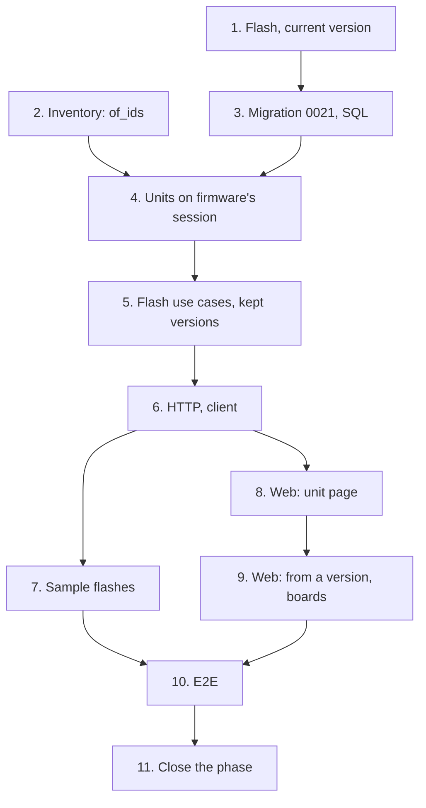

# Implementation Plan

## Overview

Eleven tasks that build [design.md](design.md) against [requirements.md](requirements.md): flashes
and the current version in the domain; inventory reading several units at once; migration `0021`
with its repository; firmware reading and locking inventory's units on its session; the flash use
cases and the flashed refusals in 13's deletes; the routes; the sample flashes; the unit page's
*Firmware* section; logging from a version and the firmware's boards; the end-to-end journey; and
the phase-closing documentation.

One migration, `0021_flashes.py`, moves the head from `0020` to `0021`. No new module and no new
ADR: `0014` stays free.

Branch first. Before task 1, 14-firmware-viewer must be on `main`, since both change
`VersionPanel.tsx`; then `git switch main && git pull && git switch -c feat/flash-log`, and never
commit this spec's work on `main`. This spec's documents reach `main` with 13's, in the phase's
first documentation commit. This design was written against 13's and 14's designs, not their code:
before task 1, check it against what they left (`lock_firmware`, `lock_version`, `DeleteVersion`,
`DeleteFirmware`, `SqlRunsOnUnitOfWork`, `FirmwareRefusalResponse`, `VersionPanel`, `FirmwarePage`)
and correct it in a `docs:` commit if they differ.

One task, one commit, each passing `make check` **on its own** (AGENTS.md). `make coverage` on
tasks 2 to 7; `make client` on 1 and 6, the regenerated client in each of those commits; `make e2e`
on 1, 6 and 8 to 10. A port that grows a method grows it in the same commit as its SQL implementation
and its fake, so bootstrap and mypy keep type-checking on every commit, and an enum the API mirrors
grows in the same commit as its union. Tick the task in this file in the same commit. Suggested
commit subjects are in `code` under each task.

Release footer: this spec is **the last of three** in `v0.7.0`, so task 11 carries
`Release-As: 0.7.0`, on a commit that changes files; no other task does. See
[Notes](#one-pr-per-spec-and-the-release).

## Tasks

- [ ] 1. Firmware: record a flash and read a board's current version
  - `firmware/domain/values.py` gains `UnitId` and `FlashId`; `firmware/domain/flash.py`:
    `UnitCode`, `FlashNotes`, `UnitFacts`, `Flash` with `record` and `order`, `FlashLog`.
  - `FirmwareVersions.newer_than`; `errors.py` gains `UnitNotFoundError`, `FlashNotFoundError` and
    the six refusals, whose codes and fields join `FirmwareRefusal` and `FirmwareField`.
  - `firmware/api/schemas.py`'s `FirmwareRefusalCodeName` and `FirmwareFieldName` widen with them, so
    13's wire-names test holds; `make client`, the regenerated client in this commit.
  - Tests: `test_flash.py` (properties 1 to 3; a time five minutes ahead and one second more; a held
    unit's revision recorded), `test_version.py` extended (property 4), `test_errors.py` extended.
  - Checks: `make check`, `make client`, `make e2e`.
  - `feat(firmware): record a flash and read a board's current version`
  - _Requirements: 1.1, 1.2, 1.3, 1.4, 1.5, 1.6, 1.7, 1.8, 1.9, 2.1, 2.2, 2.3, 3.2, 9.4, 9.6_

- [ ] 2. Inventory: read several units in one query
  - `Units.of_ids` on the port, `SqlUnits.of_ids` and the fake in `tests/support/inventory.py`.
  - Tests: integration `test_unit_repositories.py` extended (one statement for forty ids, by code, no
    lock taken), `test_inventory_isolation.py` extended (another bench's units absent from `of_ids`
    as `wiredex_app`).
  - Checks: `make check`, `make coverage`.
  - `feat(inventory): read several units in one query`
  - _Requirements: 4.2, 6.2, 9.3_

- [ ] 3. Firmware: store flashes in PostgreSQL
  - Migration `0021_flashes.py` from `make migration m="flashes"`, reviewed: the table, its key to
    `firmware_versions` with `RESTRICT`, its two indexes, and `isolate_by_workspace`.
  - `FlashEntry` and `Flashes` in `application/ports.py`, and `FirmwareUnitOfWork.flashes`;
    `SqlFlashes` with `current_on`'s `DISTINCT ON`; `SqlFirmwareUnitOfWork` binds it and clears it
    first; the fake in `tests/support/firmware.py`; `test_demo_cli.py`'s `TRUNCATE` names `flashes`;
    ADR 0007's list of isolated tables gains `flashes`, in this commit.
  - Tests: integration `test_flash_repositories.py` (a flash under another bench's version refused by
    its key; deleting a flashed version refused by the database; a unit's flashes newest first with
    ties ordered; each unit's newest flash kept only when it is the firmware's; `of_version` and
    `of_firmware`), `test_firmware_isolation.py` extended, `test_migrations.py`'s round trip at
    `0021`; `wiredex db check` clean.
  - Checks: `make check`, `make coverage`.
  - `feat(firmware): store flashes in PostgreSQL`
  - _Requirements: 5.1, 5.2, 6.1, 6.3, 9.2_

- [ ] 4. Firmware: read and lock inventory's units on its own session
  - `UnitDirectory` and `FlashUnitOfWork` in `application/ports.py`; `bootstrap/firmware.py`:
    `InventoryUnitDirectory`, `SqlFlashUnitOfWork`, and `firmware_use_cases` over it; the fake
    directory in `tests/support/firmware.py`.
  - Tests: integration `test_flash_reads.py` (a unit's facts read and locked on firmware's session;
    a flash's lock waiting for a retire of the same unit to commit; another bench's unit absent).
  - Checks: `make check`, `make coverage`.
  - `feat(firmware): read and lock the units a flash names`
  - _Requirements: 1.10, 1.11, 9.1_

- [ ] 5. Firmware: log, read and remove flashes, and keep what they name
  - `firmware/application/flashes.py`: `LogFlash`, `GetUnitFirmware`, `RemoveFlash`, `ListBoards`,
    `NewFlash` and their views; 13's `DeleteVersion` and `DeleteFirmware` take a `FlashUnitOfWork`
    and refuse with `VersionFlashedError` and `FirmwareFlashedError`, carrying the `BlockingFlash`es.
  - Tests: `test_flash_use_cases.py`, `test_boards.py` (property 5; a draft, a retired unit, another
    bench's unit or version; the recorded revision kept after a cancel; removing the newest flash;
    removing a deleted unit's flash; retired and deleted units left out of the boards),
    `test_version_use_cases.py` and `test_firmware_use_cases.py` extended (the flashed refusals, a
    deleted unit's flash marked absent); integration `test_flash_reads.py` extended (a unit's log in
    five statements and a firmware's boards in six, for one flash and for forty).
  - Checks: `make check`, `make coverage`.
  - `feat(firmware): log, read and remove a board's flashes`
  - _Requirements: 1.10, 2.1, 2.2, 2.3, 2.4, 2.5, 3.1, 3.2, 3.3, 4.1, 4.2, 4.3, 5.1, 5.2, 5.3, 5.4,
    9.3, 9.6_

- [ ] 6. Firmware: flashes over HTTP
  - The four routes before `/{firmware_id}`; `FlashRequest`, `UnitTagResponse`, `FlashResponse`,
    `UnitFirmwareResponse`, `BoardResponse`, `BlockingFlashResponse`, and
    `FirmwareRefusalResponse.flashes`; `FirmwareUseCases` gains the four use cases.
  - `make client`, the regenerated client and its aliases in this commit; `src/test/server.ts`'s
    `respondWithUnit` answers an empty log, and `respondWithFirmware` and `acceptFirmwareWrites` an
    empty list of boards.
  - Tests: `test_flash_api.py` (shapes, statuses, a time without an offset refused, a refused delete's
    `flashes`, the wire-names tests), `test_firmware_auth.py` extended (401 and 403 on the new
    routes).
  - Checks: `make check`, `make coverage`, `make client`, `make e2e`.
  - `feat(firmware): expose the flash log over HTTP`
  - _Requirements: 6.2, 6.4, 6.5, 9.4_

- [ ] 7. Firmware: the demo bench's sample flashes
  - `SAMPLE_FLASHES` and the restore's last step in `firmware/application/demo.py`; `DemoUnits` in
    `bootstrap/firmware_demo.py` over inventory's `SearchUnits`.
  - Tests: `tests/firmware/test_demo.py` extended (the two flashes through the fakes, the ESP32's
    recorded revision); integration `test_demo_cli.py` (after a reset the Pico's page answers `1.0.0`
    current and `1.1.0` newer; a guest's flash gone after the next reset).
  - Checks: `make check`, `make coverage`.
  - `feat(firmware): seed the demo bench with flashed boards`
  - _Requirements: 7.1, 7.2, 7.3_

- [ ] 8. Web: what a board runs, on its page
  - `features/firmware/flashes.ts`, `FlashLogSection`, rendered by inventory's `UnitPage`, and
    `LogFlashDialog` fixed on a unit; `firmware.flash.*` keys in both locales; `aFlash`,
    `aUnitFirmware`, `respondWithUnitFirmware` and `acceptFlashWrites` in `src/test/server.ts`.
  - Tests: Vitest beside each component: the current version, the newer release in words, an empty
    log; the dialog listing the revision's firmware first and released versions only, the time
    defaulting to now, a time in the future marked; removal asking in its row; a retired unit's page
    without *Log a flash*.
  - Checks: `make check`, `make e2e`.
  - `feat(web): show and log what a board runs on its page`
  - _Requirements: 8.1, 8.2, 8.4, 8.5, 8.8, 8.9, 8.10, 8.11_

- [ ] 9. Web: log a flash from a version, and a firmware's boards
  - `features/inventory/UnitPicker.tsx` and `inventory.units.picker.*` keys; `LogFlashDialog` fixed on
    a version, from 13's `VersionPanel`; `BoardsSection` on 13's `FirmwarePage`; `BlockingFlashes`
    under a refused delete on both; `firmware.boards.*` keys; `aBoard` and `respondWithBoards`.
  - Tests: Vitest beside each component: the picker finding a unit by code and by MAC, a retired unit
    unavailable, its count announced; the boards table with its newer release; a refused delete's
    flashes, a present unit linked and an absent one not, one removed from there; the web suite at
    or above 85 %.
  - Checks: `make check`, `pnpm --filter @wiredex/web test:coverage`, `make e2e`.
  - `feat(web): log a flash from a version and list a firmware's boards`
  - _Requirements: 8.3, 8.6, 8.7, 8.8, 8.9, 8.10, 8.11, 9.5_

- [ ] 10. E2E: the flash log journey
  - `e2e/tests/flash-log.spec.ts` on the shared session, names from `Date.now()`: the journey of
    design's Testing Strategy.
  - In the mobile project, the unit page, the dialog and the firmware's boards have no horizontal
    page overflow.
  - Checks: `make check`, `make e2e`.
  - `test(e2e): cover logging flashes and reading a board's firmware`
  - _Requirements: 1.1, 2.2, 2.3, 3.1, 3.2, 4.1, 4.2, 5.1, 8.1, 8.2, 8.3, 8.4, 8.6, 8.7, 8.11_

- [ ] 11. Close the firmware phase
  - Everything design.md's [After this spec](design.md#after-this-spec) lists, in one commit.
  - Footer `Release-As: 0.7.0`, on this commit, which changes files.
  - Checks: `make check`.
  - `docs: close the firmware phase`
  - _Requirements: 9.7_

## Task Dependency Graph



```json
{
  "waves": [
    {
      "wave": 1,
      "tasks": [
        { "id": "1", "name": "Flash, current version", "dependsOn": [] },
        { "id": "2", "name": "Inventory: of_ids", "dependsOn": [] }
      ]
    },
    { "wave": 2, "tasks": [{ "id": "3", "name": "Migration 0021, SQL", "dependsOn": ["1"] }] },
    {
      "wave": 3,
      "tasks": [{ "id": "4", "name": "Units on firmware's session", "dependsOn": ["2", "3"] }]
    },
    {
      "wave": 4,
      "tasks": [{ "id": "5", "name": "Flash use cases, kept versions", "dependsOn": ["4"] }]
    },
    { "wave": 5, "tasks": [{ "id": "6", "name": "HTTP, client", "dependsOn": ["5"] }] },
    {
      "wave": 6,
      "tasks": [
        { "id": "7", "name": "Sample flashes", "dependsOn": ["6"] },
        { "id": "8", "name": "Web: unit page", "dependsOn": ["6"] }
      ]
    },
    { "wave": 7, "tasks": [{ "id": "9", "name": "Web: from a version, boards", "dependsOn": ["8"] }] },
    { "wave": 8, "tasks": [{ "id": "10", "name": "E2E", "dependsOn": ["7", "9"] }] },
    { "wave": 9, "tasks": [{ "id": "11", "name": "Close the phase", "dependsOn": ["10"] }] }
  ]
}
```

Reading it:

- **Roots.** 1 (firmware's domain) and 2 (inventory) depend on no task here. The spec as a whole
  needs 14-firmware-viewer on `main`; that is a phase-level dependency, not a task edge.
- **Critical path.** 1 → 3 → 4 → 5 → 6 → 8 → 9 → 10 → 11.
- **1 regenerates the client.** Its new refusal codes are values of 13's enums, which the API's
  unions mirror and a wire-names test pins, so enum, union and client change in one commit; the
  routes that answer them wait for 6.
- **The SQL before the use cases.** The flash reads go through `FirmwareUnitOfWork.flashes`, which
  lands with its table and fake in 3; 4 adds the unit directory, so 5 finds both on the unit of work
  bootstrap already builds, and 13's deletes switch to it with no new wiring.
- **7 and 8 side by side.** The demo is API only and the unit page web only; they share no file.
- **8 and 9 in line.** Both write the locale files and `src/test/server.ts`.

## Notes

### Before pushing

- `make check` on every commit, not only the last.
- `make coverage` on 2 to 7: API floor 90 %, web floor 85 %.
- `make client` in 1 and 6, whose commits carry the regenerated client; afterwards `make client`
  must leave the package unchanged, or CI's contract gate fails.
- `make e2e` on 1, 6 and 8 to 10.
- `wiredex db check` clean at `0021`.

### One PR per spec, and the release

Open this spec's PR from `feat/flash-log`, based on `main` after 14-firmware-viewer merged, and turn
on auto-merge with `gh pr merge N --rebase --auto`. Task 11's `Release-As: 0.7.0` footer makes the
release PR release-please keeps open `0.7.0`, with 13's, 14's and this spec's commits. Merging it
deploys to production: only the owner decides when (AGENTS.md, Safety).
