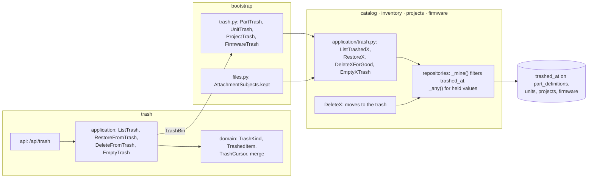

# Design Document: soft delete and trash

## Overview

The first of four specs in `v0.8.0` Everyday use. It delivers the phase's roadmap line *Soft
delete with a trash view* for the four records with a page of their own: a part, a unit, a
project and a firmware. Deleting one moves it to the trash with what it holds; there it is
absent from the app, exactly as a deleted record is, until it is restored or deleted for good.
A new `trash` module lists the trash across the four modules and hands each restore and delete
for good to the module that owns the record.

Three things carry the design: what *in the trash* means to every read (decisions 1 to 4), what a
record in the trash keeps so that it can always come back (decisions 5 to 7), and how one trash
lists four modules' records without any of them importing another (decisions 8 to 10).

**Owner decisions that bind this spec**, and what each does here:

- **One PR per spec with auto-merge; the release PR waits for the phase's last spec,
  19-command-palette, and only the owner merges it** (2026-09-27). No task here carries a
  `Release-As` footer.
- **ADR 0001**: modules never import each other, and only `bootstrap/` connects them. The trash
  module declares the port each module's share of the trash answers (decision 8).
- **ADR 0007**: every workspace row is filtered twice. The trash adds no table, only columns on
  tables already isolated.

**Decisions this spec makes (2026-10-01), for the owner to check.** They are listed with their
reasons in [requirements.md](requirements.md)'s introduction; here is how each is built.

1. **A `trashed_at` column on the four roots.** `part_definitions`, `units`, `projects` and
   `firmware` gain `trashed_at timestamptz NULL`, set by the clock when a record moves to the
   trash and cleared when it is restored. Contents carry no column of their own: a pinout, a
   revision or a version is in the trash when its root is, so a root's flag hides a whole
   aggregate and restoring it brings the aggregate back in one write. The domain entities gain
   `trashed_at`, `move_to_trash(now)`, `restore_from_trash()` and `in_trash`.

2. **Absent everywhere, through each repository's `_mine()`.** Every repository already reads
   through one `_mine()` select that filters the workspace. It now also filters
   `trashed_at IS NULL`, so every read built on it (pages, searches, pickers, `get`, `locked`,
   `with_ids`, cross-module directories) leaves a trashed record out without being touched. A
   revision and a firmware version have no column: `SqlRevisions._mine()` and
   `SqlVersions._mine()` keep only rows whose project or firmware is live, through an `EXISTS` on
   the root, and so do `project_of` and `firmware_of`, the one-column reads every lock starts from.
   The reads that don't go through `_mine()` are listed in the Components section, each filtered
   by hand: catalog's facets and category counts, projects' tag counts, revision refs and pin
   usage, inventory's units by location, and firmware's fork copy of links.

3. **The locking reads filter too, so a lock taken after a move to the trash finds nothing.**
   `SqlUnits.get`, `SqlProjects.locked` and `SqlFirmwares.locked` take `FOR UPDATE` with
   `trashed_at IS NULL` in their `WHERE`. A request queued behind a move to the trash wakes up to
   Postgres re-checking that `WHERE` against the committed row and gets no row: a flash on a unit
   just trashed, a reserve of a revision of a project just trashed, a version started on a firmware
   just trashed are each a 404 (requirement 1.5). A part had no lock; `DeletePart` now takes one,
   through a new `SqlPartDefinitions.locked`.

4. **Moving to the trash is today's delete use case, ending in an `UPDATE`.** `DeletePart`,
   `DeleteUnit`, `DeleteProject` and `DeleteFirmware` keep their names, routes, locks and
   refusals; their last step sets `trashed_at` instead of deleting. A BOM keeps naming its parts
   while its project is in the trash: `SqlBomLines.uses_of` reads every BOM whatever its project's
   state, and marks a use in the trash, so the part's refusal says which BOMs are in the trash and
   the part page doesn't link to them. That is what lets a project in the trash be restored with
   every line naming a real part.

5. **Unique values stay held.** No unique index changes: a part in the trash keeps its
   manufacturer and MPN, a project and a firmware their names, a unit its serial and MAC. The
   checks before a write read through `_any()`, the workspace filter without the trash one, and a
   holder in the trash gets its own sentence: catalog's `DuplicateMpnError` and projects'
   `DuplicateProjectNameError` say *in the trash*, firmware answers a new coded refusal
   `name_in_trash`, and a part draft naming a trashed part's MPN gets a new problem,
   `part_in_trash`, which catalog's `DraftProblemKind` and inventory's `ProblemCode` spell alike.
   Units keep 06's *another unit already has*: still true, and the code is the same.

6. **Containers keep what a record in the trash needs.** A category's delete counts its parts in
   the trash and refuses with *its parts are in the trash; delete them for good first*, since a
   part needs its category to be restored into and `fk_part_definitions_category_id_categories`
   is `RESTRICT`. A unit's lot is never deleted, so a unit always has somewhere to come back to.
   Projects and firmware are in no container.

7. **The prune asks whether a subject is kept, not whether it is live.** Files' `Subjects` port
   gains `kept(workspace, subject)`: a part, project or revision whose row still exists, in the
   trash or not. `PruneOrphans` sweeps attachments whose subject isn't kept; `Attach` still asks
   `exists`, so nothing is attached to a record in the trash. Bootstrap answers `kept` from three
   new read-only use cases, `PartIsKept`, `ProjectIsKept` and `RevisionIsKept`.

8. **A `trash` module, and a bin per kind.** `wiredex/trash` declares `TrashBin`, one per kind:
   a page of its records before a position, restore one, delete one for good, empty them all. Each
   module offers its share as four use cases, and `bootstrap/trash.py` wraps them in a bin,
   translating each module's not-found error into `TrashItemNotFoundError`. The trash module owns
   the kinds, the cursor, the merge and the routes; each module owns what restoring and deleting
   mean. Nothing opens a unit of work inside another: each bin runs its module's own unit of work,
   one after the other.

9. **One cursor over four lists.** The trash's order is `(trashed_at, id)` descending. The ids are
   UUIDv7, unique across tables, so the pair orders every record of every kind totally. A page asks
   each bin for its first `limit + 1` records before the cursor, through a partial index
   `(workspace_id, trashed_at DESC, id DESC) WHERE trashed_at IS NOT NULL` on each root; it merges
   them, keeps the first `limit`, and answers the last kept record's position as the next cursor
   when anything was left over. A record restored or deleted between two pages simply isn't read
   again; nothing shifts, as with the parts list's keyset (requirement 4.3). The cursor travels as
   base64url text of the time and the id, and anything else is a 422.

10. **Deleting for good is the old delete, and emptying is one statement per kind.** Restoring
    and deleting one record each lock it with `FOR UPDATE … AND trashed_at IS NOT NULL` and
    `populate_existing` first, so the two take turns and the second finds nothing (requirement
    5.4). Deleting for good then deletes the row and lets the existing cascades take its contents.
    Emptying is a `DELETE … WHERE trashed_at IS NOT NULL` per root, whose row locks and re-check
    make a restore racing it either win or find nothing. Neither checks anything else: nothing can
    point at a record while it is absent (requirements decision 6).

11. **The four delete buttons say *Move to trash*, and *Trash* is a page.** Each of the four pages
    keeps its in-place question, now saying the record can be restored from the trash, and its
    navigation back to the list. `/trash` lists the trash newest first, 50 at a time with *Show
    more*, each record with its kind, name, detail and date, *Restore*, and *Delete for good*,
    which asks in its row. A restored record leaves the list with a notice linking to its page.
    *Empty the trash* asks first. Every write refreshes the trash and the four modules' caches.

**Seen while designing, not changed here:**

- A part with stock can be deleted, as before: it now moves to the trash, and its lots and units
  read as an unknown part's until it is restored, as they did after a delete.
- `UnitHeldError` still answers 422 where its docstring says 409 (15's note).
- `ListAttachments` doesn't ask whether its subject exists, so a trashed record's attachments are
  listed to whoever names its subject; its page is a 404, so the web never asks.

**In scope:** the column and the filters in four modules; the moved deletes; the held values and
their sentences; the category's refusal; the prune's `kept`; each module's list, restore, delete
for good and empty; the `trash` module and its bins; the routes; the four pages' buttons; the trash
page; the E2E journey.

**Out of scope:** revisions, versions, categories, locations and attachments in the trash; a timer
emptying it; a record's page while it is in the trash; who moved it (17-history).

## Architecture



## Components and Interfaces

### Shared kernel: a position in the trash

`shared_kernel/domain/trash.py`, the shared kernel's first domain file:

```python
@dataclass(frozen=True, slots=True, order=True)
class TrashPosition:
    """Where a page of the trash stops: when a record was moved there, and its id, which
    breaks ties across kinds (decision 9)."""

    trashed_at: datetime
    id: UUID
```

Each module's repository takes `before: TrashPosition | None`, so the trash module and the four
modules share the one value without importing each other.

### The four roots

Each entity gains the same three members, beside its own:

```python
class PartDefinition:  # and Unit, Project, Firmware alike
    trashed_at: datetime | None = None  # last, so every constructor call keeps working

    def move_to_trash(self, now: datetime) -> None: ...

    def restore_from_trash(self) -> None: ...

    @property
    def in_trash(self) -> bool: ...
```

on `catalog/domain/part.py`'s `PartDefinition`, `inventory/domain/unit.py`'s `Unit`,
`projects/domain/project.py`'s `Project` and `firmware/domain/firmware.py`'s `Firmware`. Neither
method touches `updated_at`: a restored record comes back as it was, where its list had it.

Each root's repository port gains:

```python
class PartDefinitions(Protocol):  # and Units, Projects, Firmwares alike
    async def trashed(
        self, before: TrashPosition | None, limit: int
    ) -> list[PartDefinition]:
        """The records in the trash before the position, newest first, at most `limit`."""

    async def in_trash(self, part_id: PartDefinitionId) -> PartDefinition | None:
        """The record if it is in the trash, its row locked, read fresh (decision 10)."""

    async def empty_trash(self) -> int:
        """Every record in the trash deleted for good, in one statement; how many went."""
```

and, for parts, `locked(part_id)`, the live part with its row locked (decision 3).

### Catalog: parts

| File | Change |
| --- | --- |
| `infrastructure/orm.py` | `part_definitions.trashed_at`, `ix_part_definitions_trashed` |
| `infrastructure/repositories.py` | `_mine()` adds `trashed_at IS NULL`; `_any()` for `with_mpn`; `facets` and `counts_by_category` filter by hand; `count_in_trash(category_ids)`; `locked`, `trashed`, `in_trash`, `empty_trash`, `kept` |
| `application/parts.py` | `DeletePart` locks the part and moves it to the trash; `_check_mpn_free` says *in the trash* for a trashed holder |
| `application/categories.py` | `DeleteCategory` refuses a category whose only parts are in the trash (decision 6) |
| `application/drafts.py` | `_stored` reports a trashed holder as `part_in_trash` on the MPN, the draft then having no existing part |
| `domain/errors.py` | `DraftProblemKind.PART_IN_TRASH` |
| `application/trash.py` | `ListTrashedParts`, `RestorePart`, `DeletePartForGood`, `EmptyPartTrash`, `PartIsKept` |
| `domain/usage.py`, `api/schemas.py` | `PartUse.in_trash` and `PartUseResponse.in_trash`, so a refused delete marks the BOMs in the trash (decision 4) |

`search_sql.compile_spec` needs nothing: `search` combines it with `_mine()`. `SqlPinouts` reads
by part id after `load_part` has found the part, so a trashed part's pins are never reached.

### Inventory: units

| File | Change |
| --- | --- |
| `infrastructure/orm.py` | `units.trashed_at`, `ix_units_trashed` |
| `infrastructure/repositories.py` | `SqlUnits._mine()` filters, which `get` (`FOR UPDATE`), `of_ids`, `of_part`, `of_lot`, `lock`, `in_stock_of_parts` and `search` read through; `of_location` filters by hand; `serial_taken` and `mac_taken` read every unit (decision 5); `trashed`, `in_trash`, `empty_trash` |
| `application/units.py` | `DeleteUnit` moves a retired unit to the trash |
| `domain/intake.py` | `ProblemCode.PART_IN_TRASH`, spelled as catalog's |
| `api/schemas.py` | the problem code union gains `part_in_trash` |
| `application/trash.py` | `ListTrashedUnits`, `RestoreUnit`, `DeleteUnitForGood`, `EmptyUnitTrash` |

`in_stock_at`, `of_lot_reserved` and `of_revision` count by status, and a unit in the trash is
retired, so they need no filter.

### Projects: projects

| File | Change |
| --- | --- |
| `infrastructure/orm.py` | `projects.trashed_at`, `ix_projects_trashed` |
| `infrastructure/repositories.py` | `SqlProjects._mine()` filters; `_any()` for `named`; `tag_counts` filters; `SqlRevisions._mine()` and `project_of` keep revisions of live projects (decision 2); `_ref_query` joins live projects only; `SqlNets.uses_of_part` keeps live projects; `SqlBomLines.uses_of` reads every project and answers `in_trash`; `trashed`, `in_trash`, `empty_trash`, `kept`, and `SqlRevisions.kept` |
| `application/projects.py` | `DeleteProject` moves the locked project to the trash; `_check_name_free` says *in the trash* |
| `application/ports.py` | `BomUse.in_trash` |
| `application/trash.py` | `ListTrashedProjects`, `RestoreProject`, `DeleteProjectForGood`, `EmptyProjectTrash`, `ProjectIsKept`, `RevisionIsKept` |

`bootstrap/catalog.py`'s `BomPartUses` carries `in_trash` across. A project in the trash holds no
reserved or built revision, since moving it there refuses one, so inventory's holdings and units
never name one of its revisions.

### Firmware: firmware

| File | Change |
| --- | --- |
| `infrastructure/orm.py` | `firmware.trashed_at`, `ix_firmware_trashed` |
| `infrastructure/repositories.py` | `SqlFirmwares._mine()` filters, which `get`, `locked`, `matching` and `running_on` read through; `_any()` for `named`; `SqlVersions._mine()` and `firmware_of` keep versions of live firmware; `SqlRevisionLinks.copy` copies only live firmware's links (requirement 2.4); `trashed`, `in_trash`, `empty_trash` |
| `application/firmware.py` | `DeleteFirmware` moves the locked firmware to the trash; `_check_name_free` raises `NameInTrashError` for a trashed holder |
| `domain/errors.py`, `api/schemas.py` | `FirmwareRefusal.NAME_IN_TRASH` and its union member, in one commit with the client |
| `application/trash.py` | `ListTrashedFirmware`, `RestoreFirmware`, `DeleteFirmwareForGood`, `EmptyFirmwareTrash` |

A firmware in the trash has no flashed version, since moving it there refuses one, and nothing can
flash a version of it once there, so `SqlFlashes` needs no filter.

### Files: the prune

`files/application/ports.py`'s `Subjects` gains `kept(workspace_id, subject) -> bool`;
`PruneOrphans._detach_gone_subjects` asks it instead of `exists`. `bootstrap/files.py`'s
`AttachmentSubjects.kept` asks `PartIsKept`, `ProjectIsKept` or `RevisionIsKept` by kind, each one
read-only transaction of its module.

### The trash module

```text
wiredex/trash/
├── domain/trash.py        TrashKind, TrashedItem, TrashCursor, TrashPage, merge
├── domain/errors.py       TrashError, TrashItemNotFoundError, InvalidTrashCursorError
├── domain/values.py       WorkspaceId
├── application/ports.py   TrashBin
├── application/trash.py   ListTrash, RestoreFromTrash, DeleteFromTrash, EmptyTrash
└── api/                   router.py, schemas.py
```

```python
class TrashKind(StrEnum):
    PART = "part"
    UNIT = "unit"
    PROJECT = "project"
    FIRMWARE = "firmware"


@dataclass(frozen=True, slots=True)
class TrashedItem:
    kind: TrashKind
    id: UUID
    name: str
    detail: str | None  # a part's MPN, a unit's part, a firmware's target
    trashed_at: datetime

    @property
    def position(self) -> TrashPosition: ...


@dataclass(frozen=True, slots=True)
class TrashCursor:
    position: TrashPosition

    def encode(self) -> str: ...  # base64url of "<iso time>|<uuid>"

    @classmethod
    def decode(cls, text: str) -> TrashCursor: ...  # InvalidTrashCursorError


@dataclass(frozen=True, slots=True)
class TrashPage:
    items: tuple[TrashedItem, ...]
    next: TrashCursor | None


def merge(pages: Iterable[Sequence[TrashedItem]], limit: int) -> TrashPage:
    """The newest `limit` of every bin's page, and a cursor when any was left over."""
```

```python
class TrashBin(Protocol):
    @property
    def kind(self) -> TrashKind: ...

    async def page(
        self, workspace_id: WorkspaceId, before: TrashPosition | None, limit: int
    ) -> Sequence[TrashedItem]: ...

    async def restore(self, workspace_id: WorkspaceId, item_id: UUID) -> None: ...

    async def delete(self, workspace_id: WorkspaceId, item_id: UUID) -> None: ...

    async def empty(self, workspace_id: WorkspaceId) -> None: ...
```

| Use case | What it does |
| --- | --- |
| `ListTrash(bins)` | `(workspace_id, cursor, limit)`: each bin's `page(before, limit + 1)` in turn, then `merge` |
| `RestoreFromTrash(bins)` | `(workspace_id, kind, item_id)`: the kind's bin restores; `TrashItemNotFoundError` is a 404 |
| `DeleteFromTrash(bins)` | the same, deleting for good |
| `EmptyTrash(bins)` | every bin's `empty`, one after the other |

`bootstrap/trash.py` builds the four bins over each module's use cases and its own unit of work,
and `UnitTrash` names each unit's part through catalog's `DescribeParts`, one read per page.
`bootstrap/app.py` mounts the router with the same workspace closure every module gets.

### HTTP

| Method and path | Answers | Requirement |
| --- | --- | --- |
| `GET /api/trash?limit=&cursor=` | `TrashPageResponse` | 4 |
| `POST /api/trash/{kind}/{item_id}/restore` | 204 | 5 |
| `DELETE /api/trash/{kind}/{item_id}` | 204 | 6 |
| `DELETE /api/trash` | 204 | 6.4 |

```python
class TrashedItemResponse(BaseModel):
    kind: TrashKindName  # Literal["part", "unit", "project", "firmware"]
    id: UUID
    name: str
    detail: str | None
    trashed_at: datetime


class TrashPageResponse(BaseModel):
    items: list[TrashedItemResponse]
    next_cursor: str | None
```

`limit` is `Query(ge=1, le=100)`, 50 by default, and `cursor` at most 200 characters; `kind` is
the enum, so an unknown one is FastAPI's 422. The four existing `DELETE` routes keep their shapes
and say in their docstrings that they move to the trash.

### Web

| File | What |
| --- | --- |
| `features/trash/trash.ts` | `trashKeys`, `useTrash` (infinite, `next_cursor`), `useRestore`, `useDeleteForGood`, `useEmptyTrash`; each write refreshes `trashKeys.all` and the kind's root key, `useEmptyTrash` all four |
| `features/trash/kinds.ts` | Per kind: the label key and the link to its page |
| `features/trash/TrashPage.tsx` | `/trash`: *Empty the trash*, the list, *Show more*, a `role="status"` notice after a restore, and each row's *Restore* and *Delete for good* asking in its row |
| `app/router.tsx`, `app/AppLayout.tsx` | The route, and *Trash* last in the main navigation |
| `catalog/PartPage.tsx`, `inventory/UnitPage.tsx`, `projects/ProjectPage.tsx`, `firmware/FirmwarePage.tsx` | The delete button, question and confirmation say *Move to trash*; `KeptByBoms` names a BOM in the trash without a link |
| `catalog.ts`, `units.ts`, `projects.ts`, `firmware.ts` | The four delete hooks also refresh `trashKeys.all` |
| `inventory/intake/problems.ts` | Nothing: `part_in_trash` is one more `inventory.intake.problem.*` key |

Keys under `trash.*`, `nav.trash`, the four pages' new delete strings, the intake problem and
`firmware.refusal.name_in_trash`, in both locales. `src/test/server.ts` gains `aTrashedItem`,
`respondWithTrash` and `acceptTrashWrites`, a stateful trash that restores, deletes and empties.

## Data Models

`0022_trash.py`, autogenerated and reviewed:

```text
part_definitions, units, projects, firmware
  + trashed_at timestamptz null
  + index ix_<table>_trashed (workspace_id, trashed_at DESC, id DESC) WHERE trashed_at IS NOT NULL
```

- Only additive: four nullable columns with no default rewrite nothing, and four partial indexes
  over no rows yet. The previous release ignores the column, so a rollback of the API shows
  trashed records as live again, and loses none; no unique index changed, so none of them clashes
  (decision 5).
- `downgrade` drops the indexes and the columns: what was in the trash comes back.
- No new table, so ADR 0007's list of isolated tables is unchanged.

```json
GET /api/trash?limit=2 →
{ "items": [
    { "kind": "project", "id": "0199…", "name": "Weather station", "detail": null,
      "trashed_at": "2026-10-01T18:02:11Z" },
    { "kind": "part", "id": "0199…", "name": "4.7 kΩ 1% 0805", "detail": "RC0805FR-074K7L",
      "trashed_at": "2026-10-01T17:40:03Z" } ],
  "next_cursor": "MjAyNi0xMC0wMVQxNzo0MDowMy4wMDAwMDArMDA6MDB8MDE5OS…" }
```

## Correctness Properties

### Property 1: the trash reads every record once, newest first

For any records of any kinds and times, ties included, reading the trash page after page with any
limits answers every record once, ordered by `(trashed_at, id)` descending, and ends with no
cursor.

### Property 2: a record removed between pages is never read twice

For any records and any of them restored or deleted between two pages, the pages still answer no
record twice, in order, and every record that stayed.

### Property 3: a cursor reads back

For any position, `TrashCursor.decode(cursor.encode())` is the cursor, and any text that isn't one
is refused.

## Error Handling

| Case | Status | Detail |
| --- | --- | --- |
| A record in the trash named anywhere but the trash, another workspace's included | 404 | The module's own not-found sentence |
| A restore or delete for good of a record not in the trash | 404 | `TrashItemNotFoundError` |
| A part a BOM names, a project with a held revision, a flashed firmware, a unit not retired | 409, as before | BOMs in the trash marked `in_trash` |
| A category whose parts are in the trash | 409 | *its parts are in the trash* |
| A project or firmware name, or a part's MPN, held by a record in the trash | 409 | *in the trash*; firmware's code `name_in_trash` |
| A draft naming a trashed part's MPN | 422 | problem `part_in_trash` on the MPN |
| A limit out of range, or a cursor the API didn't give | 422 | |
| No session | 401 | |
| A cookie write without the CSRF header | 403 | |

## Testing Strategy

| Level | Files | What |
| --- | --- | --- |
| Domain | `tests/trash/test_trash.py`, each module's entity test extended | Properties 1 to 3; the three members on each root |
| Application | each module's `test_trash_use_cases.py`, `tests/trash/test_trash_use_cases.py` | Moving to the trash through the fakes with the old refusals; restore and delete for good, a record not in the trash a 404; the held values and their sentences; the category's refusal; the draft's problem; the bins dispatching by kind |
| Integration | `tests/integration/test_catalog_trash.py`, `test_unit_trash.py`, `test_project_trash.py`, `test_firmware_trash.py`, the four isolation tests extended, `test_files_cli.py`, `test_demo_cli.py`, `test_migrations.py` | Every read of decision 2 leaving a trashed record out; the held values; a page in one statement; the cascades of a delete for good; the races below; another bench's trash unseen as `wiredex_app`; the prune keeping a trashed part's attachments and sweeping them after its delete for good; a reset emptying a guest's trash; the round trip at `0022` |
| HTTP | `tests/trash/test_trash_api.py`, `test_trash_auth.py`, the four modules' API tests | Shapes, 404s, the limit and cursor 422s; 401 and 403 on the four routes; the new sentences and codes |
| Web | beside each component | The four pages' *Move to trash*; the trash page's list, *Show more*, restore with its notice, delete for good asking in its row, empty asking, the empty state; a BOM in the trash unlinked in a part's refusal |
| E2E | `e2e/tests/trash.spec.ts` | Below |

The races, each with an outside transaction holding the row so the two requests queue on the lock,
each failing without the lock or its re-checked `WHERE`:

- Restoring a part while it is deleted for good: one of the two is a 404, and the part is either
  back or gone.
- Flashing a unit while it moves to the trash: the flash, queued behind the move, is a 404.
- Reserving a revision while its project moves to the trash: the reserve is a 404 and holds nothing.
- Starting a version while its firmware moves to the trash: the version is a 404.

The journey, on the shared session with names stamped by project, worker and time: a part defined
and moved to the trash from its page is gone from the parts list and listed in the trash; restoring
it there brings back its page through the notice's link; moving it again and deleting it for good
from its row leaves it nowhere; a project moved to the trash is restored with its revision. On a
Pixel 7 the trash page has no horizontal page overflow. Emptying the trash stays in Vitest: the
journeys of both projects share one workspace and run in parallel.

## Seams for later specs

| Seam | For | What it is |
| --- | --- | --- |
| `trashed_at` on the four roots | 17-history | A move to the trash and back is an `UPDATE` the history trigger sees, and the feed tells it from the column's change |
| `RestoreFromTrash` | 17-history | The feed restores a record it shows moving to the trash, through the trash's own route |
| `_mine()` | 19-command-palette | The palette's searches leave the trash out without a filter of their own |
| `TrashBin` | later kinds | A revision, a version or an attachment joins the trash as one more bin |

## After this spec

Nothing is documented outside the spec yet: the phase closes in 19-command-palette's last task,
which records this spec's decisions in a new ADR, answers docs/architecture.md §10's question 5,
and adds `trash` to §2's contexts.
