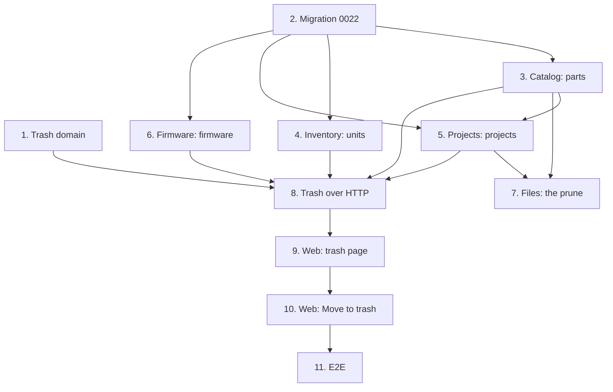

# Implementation Plan

## Overview

Eleven tasks that build [design.md](design.md) against [requirements.md](requirements.md): the
trash's positions, cursor and merge in a new `trash` module; migration `0022` with the column on
the four roots; parts, units, projects and firmware moving to the trash, one module a task, each
with its reads filtered, its held values and its list, restore, delete for good and empty; the
prune keeping what the trash holds; the trash over HTTP through one bin per kind; the trash page;
the four pages' *Move to trash*; and the end-to-end journey.

One migration, `0022_trash.py`, moves the head from `0021` to `0022`. One new module, `trash`. No
new ADR here: the phase's closing task, in 19-command-palette, writes it.

Branch first: `git switch main && git pull && git switch -c feat/soft-delete-and-trash`, and never
commit this spec's work on `main`. 17-history, 18-dashboard and 19-command-palette stack on this
branch.

One task, one commit, each passing `make check` **on its own** (AGENTS.md). `make coverage` on
tasks 2 to 8; `make client` on 3, 6 and 8, the regenerated client in each of those commits;
`make e2e` on 3, 6 and 8 to 11. A port that grows a method grows it in the same commit as its SQL
implementation and its fake, and an enum the API mirrors grows in the same commit as its union and
its translation. Tick the task in this file in the same commit. Suggested commit subjects are in
`code` under each task.

## Tasks

- [x] 1. Trash: read the trash newest first across kinds
  - `shared_kernel/domain/trash.py`: `TrashPosition`.
  - `trash/domain/`: `TrashKind`, `TrashedItem`, `TrashCursor`, `TrashPage`, `merge`, and the
    errors; `trash/domain/values.py`: `WorkspaceId`.
  - `pyproject.toml`'s import-linter contracts name `wiredex.trash` among the layered containers,
    the modules kept from `bootstrap` and the independent modules.
  - Tests: `tests/trash/test_trash.py` (properties 1 to 3; a cursor refused for other text; ties
    across kinds ordered by id).
  - Checks: `make check`.
  - `feat(trash): read the trash newest first across kinds`
  - _Requirements: 4.1, 4.3, 4.4, 10.1, 10.6_

- [x] 2. Keep when a part, unit, project or firmware moved to the trash
  - Migration `0022_trash.py` from `make migration m="trash"`, reviewed: the four columns and the
    four partial indexes, and a downgrade dropping them.
  - The four ORM tables gain `trashed_at` and `ix_<table>_trashed`; the four entities gain
    `trashed_at`, `move_to_trash`, `restore_from_trash` and `in_trash`.
  - Tests: each entity's test extended; `test_migrations.py`'s round trip at `0022`;
    `wiredex db check` clean.
  - Checks: `make check`, `make coverage`.
  - `feat: record when a part, unit, project or firmware moves to the trash`
  - _Requirements: 1.1, 10.2_

- [x] 3. Catalog: parts move to the trash
  - `SqlPartDefinitions`: `_mine()` filters, `_any()` for `with_mpn`, `facets` and
    `counts_by_category` by hand, `count_in_trash`, `locked`, `trashed`, `in_trash`,
    `empty_trash`; the port and `tests/support/catalog.py`'s fake grow alike.
  - `DeletePart` locks the part and moves it to the trash; `_check_mpn_free` says *in the trash*;
    `DeleteCategory` refuses a category whose parts are in the trash.
  - `PartDrafts._stored`: a trashed holder is problem `part_in_trash` on the MPN;
    `DraftProblemKind.PART_IN_TRASH`, inventory's `ProblemCode.PART_IN_TRASH` and the API's
    problem union, `make client`, the regenerated client and `inventory.intake.problem.part_in_trash`
    in both locales in this commit.
  - `catalog/application/trash.py`: `ListTrashedParts`, `RestorePart`, `DeletePartForGood`,
    `EmptyPartTrash`.
  - Tests: `tests/catalog/test_trash_use_cases.py` (a part a BOM names refused as before; the MPN
    sentence; the category's refusal; restore and delete for good, a part not in the trash a 404);
    `tests/catalog/test_drafts.py` and integration `test_intake_transaction.py` extended
    (the problem, through bootstrap's mapping); integration `test_catalog_trash.py` (a trashed part absent from `get`, `page`,
    `search`, `facets`, `with_ids` and the category counts; `with_mpn` still finding it; a trash
    page in one statement; delete for good taking the pins; emptying; restoring while deleting for
    good, one a 404), `test_catalog_isolation.py` extended, `test_demo_cli.py` (a guest's trashed
    part gone after a reset).
  - Checks: `make check`, `make coverage`, `make client`, `make e2e`.
  - `feat(catalog): move parts to the trash`
  - _Requirements: 1.1, 1.2, 1.4, 2.1, 2.2, 2.3, 3.2, 3.3, 5.1, 5.3, 5.4, 6.1, 6.2, 6.4, 7.1, 7.3,
    8.1, 8.2, 10.3_

- [x] 4. Inventory: units move to the trash
  - `SqlUnits`: `_mine()` filters, `of_location` by hand, `trashed`, `in_trash`, `empty_trash`; the
    port and `tests/support/inventory.py`'s fake alike.
  - `DeleteUnit` moves a retired unit to the trash; `inventory/application/trash.py`:
    `ListTrashedUnits`, `RestoreUnit`, `DeleteUnitForGood`, `EmptyUnitTrash`.
  - Tests: `tests/inventory/test_trash_use_cases.py` (an in-stock or held unit refused as before; a
    trashed unit's serial and MAC still taken; restore, delete for good keeping the movements);
    integration `test_unit_trash.py` (a trashed unit absent from `get`, `of_ids`, `of_part`,
    `of_lot`, `of_location`, `search` and `lock`; an un-retire queued behind a move to the trash a
    404; restoring while deleting for good), `test_flash_reads.py` extended (a flash's lock behind
    a move to the trash finding no unit, through bootstrap's `SqlFlashUnitOfWork`),
    `test_inventory_isolation.py` extended.
  - Checks: `make check`, `make coverage`.
  - `feat(inventory): move retired units to the trash`
  - _Requirements: 1.1, 1.3, 1.4, 1.5, 2.1, 2.2, 2.3, 3.4, 5.1, 5.3, 5.4, 6.1, 6.2, 6.3, 6.4, 8.1,
    8.2_

- [x] 5. Projects: projects move to the trash with their revisions
  - `SqlProjects`: `_mine()` filters, `_any()` for `named`, `tag_counts` by hand, `trashed`,
    `in_trash`, `empty_trash`; `SqlRevisions._mine()`, `project_of` and `_ref_query` keep live
    projects; `SqlNets.uses_of_part` too; `SqlBomLines.uses_of` answers `in_trash`; the ports and
    `tests/support/projects.py`'s fakes alike.
  - `DeleteProject` moves the locked project to the trash; `_check_name_free` says *in the trash*;
    `projects/application/trash.py`: `ListTrashedProjects`, `RestoreProject`,
    `DeleteProjectForGood`, `EmptyProjectTrash`.
  - `BomUse.in_trash`, carried by `bootstrap/catalog.py`'s `BomPartUses` into catalog's
    `PartUse.in_trash` and `PartUseResponse.in_trash`.
  - Tests: `tests/projects/test_trash_use_cases.py` (a held revision refused as before; the name's
    sentence; restore, delete for good); `tests/catalog/test_catalog_api.py` extended (a BOM in the
    trash marked); integration `test_project_trash.py` (a trashed project and its revisions absent
    from the list, the tags, `get`, `locked`, `project_of`, the refs and pin usage; its BOM still
    naming its parts; a reserve queued behind a move to the trash a 404, holding nothing; a move
    queued behind a reserve refused; delete for good taking its revisions and BOMs; restoring
    while deleting for good), `test_projects_isolation.py` extended.
  - Checks: `make check`, `make coverage`.
  - `feat(projects): move projects to the trash with their revisions`
  - _Requirements: 1.1, 1.2, 1.3, 1.4, 1.5, 2.1, 2.2, 2.3, 3.1, 5.1, 5.3, 5.4, 6.1, 6.2, 6.4, 8.1,
    8.2_

- [x] 6. Firmware: firmware moves to the trash with its versions
  - `SqlFirmwares`: `_mine()` filters, `_any()` for `named`, `trashed`, `in_trash`, `empty_trash`;
    `SqlVersions._mine()` and `firmware_of` keep live firmware; `SqlRevisionLinks.copy` copies live
    firmware's links; the ports and `tests/support/firmware.py`'s fakes alike.
  - `DeleteFirmware` moves the locked firmware to the trash; `NameInTrashError`, code
    `name_in_trash`, joining `FirmwareRefusal`, the API's union and the wire-names test; `make
    client`, the regenerated client, `firmware.refusal.name_in_trash` in both locales and
    `labels.ts`'s `TRANSLATED_REFUSALS` in this commit.
  - `firmware/application/trash.py`: `ListTrashedFirmware`, `RestoreFirmware`,
    `DeleteFirmwareForGood`, `EmptyFirmwareTrash`.
  - Tests: `tests/firmware/test_trash_use_cases.py` (a flashed firmware refused as before; the
    name's code; restore, delete for good); integration `test_firmware_trash.py` (a trashed
    firmware and its versions absent from the list, `get`, `locked`, a revision's firmware and
    `firmware_of`; a version started behind a move to the trash a 404; a fork copying only live
    firmware's links; delete for good taking versions, files and links; restoring while deleting
    for good), `test_firmware_isolation.py` extended.
  - Checks: `make check`, `make coverage`, `make client`, `make e2e`.
  - `feat(firmware): move firmware to the trash with its versions`
  - _Requirements: 1.1, 1.3, 1.4, 1.5, 2.1, 2.2, 2.3, 2.4, 3.1, 5.1, 5.3, 5.4, 6.1, 6.2, 6.4, 8.1,
    8.2_

- [x] 7. Files: keep the attachments of a record in the trash
  - `Subjects.kept`; `PruneOrphans` sweeps what isn't kept; `AttachmentSubjects.kept` over
    catalog's `PartIsKept` and projects' `ProjectIsKept` and `RevisionIsKept`, with their
    repository reads and fakes.
  - Tests: `tests/files/test_attachment_use_cases.py` extended (the prune asking `kept`); integration
    `test_files_cli.py` (a trashed part's and project's attachments kept by the prune, swept after
    their delete for good).
  - Checks: `make check`, `make coverage`.
  - `feat(files): keep the attachments of a record in the trash`
  - _Requirements: 7.2_

- [x] 8. Trash: list, restore, delete for good and empty over HTTP
  - `trash/application/`: `TrashBin`, `ListTrash`, `RestoreFromTrash`, `DeleteFromTrash`,
    `EmptyTrash`; `trash/api/`: the router and its schemas; `bootstrap/trash.py`: `PartTrash`,
    `UnitTrash`, `ProjectTrash`, `FirmwareTrash`, `trash_use_cases`; `bootstrap/app.py` mounts it.
  - `make client`, the regenerated client in this commit.
  - Tests: `tests/trash/test_trash_use_cases.py` (fake bins: the merge across bins, dispatch by
    kind, a missing record a 404), `test_trash_api.py` (shapes, statuses, the limit and cursor
    422s), `test_trash_auth.py` (401 and 403 on the four routes); integration `test_trash_bins.py`
    (one page across the four kinds as `wiredex_app` in a fixed number of statements; restoring and
    deleting through each bin; another bench's records unseen).
  - Checks: `make check`, `make coverage`, `make client`, `make e2e`.
  - `feat(trash): list, restore and delete the trash for good over HTTP`
  - _Requirements: 4.1, 4.2, 4.3, 4.4, 4.5, 5.1, 5.2, 5.3, 6.1, 6.2, 6.4, 8.1, 8.2, 8.3, 8.4, 10.1,
    10.3, 10.4_

- [ ] 9. Web: the trash page
  - `features/trash/`: `trash.ts`, `kinds.ts`, `TrashPage.tsx`; the `/trash` route; *Trash* last in
    the main navigation; `trash.*` and `nav.trash` keys in both locales; `aTrashedItem`,
    `respondWithTrash` and `acceptTrashWrites` in `src/test/server.ts`.
  - Tests: Vitest beside the page: the list in order with its kinds and details, *Show more*, a
    restore taking the row off with a notice linking to the record, delete for good asking in its
    row, emptying asking first, the empty state, an error; the navigation's *Trash* link.
  - Checks: `make check`, `make e2e`.
  - `feat(web): list the trash, restore and delete for good`
  - _Requirements: 9.2, 9.3, 9.4, 9.5, 9.6, 9.7, 9.8, 9.9, 9.10_

- [ ] 10. Web: Move to trash on the four record pages
  - `PartPage`, `UnitPage`, `ProjectPage` and `FirmwarePage`: the delete strings say *Move to
    trash* and the question says it can be restored from the trash; `KeptByBoms` names a BOM in the
    trash without a link; the four delete hooks refresh `trashKeys.all`.
  - The E2E journeys that delete (`projects.spec.ts`, `build.spec.ts`, `units.spec.ts`,
    `firmware.spec.ts` and any other) press the new button names.
  - Tests: each page's delete tests read the new strings; a refused part delete naming a BOM in the
    trash; the web suite at or above 85 %.
  - Checks: `make check`, `pnpm --filter @wiredex/web test:coverage`, `make e2e`.
  - `feat(web): move parts, units, projects and firmware to the trash`
  - _Requirements: 1.2, 9.1, 9.7, 9.8, 10.5_

- [ ] 11. E2E: the trash journey
  - `e2e/tests/trash.spec.ts` on the shared session, names stamped by project, worker and time,
    `test.slow()`: the journey of design's Testing Strategy, with `expectNoSidewaysScroll` on the
    trash page.
  - Checks: `make check`, `make e2e`.
  - `test(e2e): cover moving to the trash, restoring and deleting for good`
  - _Requirements: 2.1, 4.1, 5.1, 5.2, 6.1, 9.1, 9.3, 9.4, 9.5, 9.10_

## Task Dependency Graph



```json
{
  "waves": [
    {
      "wave": 1,
      "tasks": [
        { "id": "1", "name": "Trash domain", "dependsOn": [] },
        { "id": "2", "name": "Migration 0022", "dependsOn": [] }
      ]
    },
    {
      "wave": 2,
      "tasks": [
        { "id": "3", "name": "Catalog: parts", "dependsOn": ["2"] },
        { "id": "4", "name": "Inventory: units", "dependsOn": ["2"] }
      ]
    },
    {
      "wave": 3,
      "tasks": [
        { "id": "5", "name": "Projects: projects", "dependsOn": ["2", "3"] },
        { "id": "6", "name": "Firmware: firmware", "dependsOn": ["2"] }
      ]
    },
    { "wave": 4, "tasks": [{ "id": "7", "name": "Files: the prune", "dependsOn": ["3", "5"] }] },
    {
      "wave": 5,
      "tasks": [{ "id": "8", "name": "Trash over HTTP", "dependsOn": ["1", "3", "4", "5", "6"] }]
    },
    { "wave": 6, "tasks": [{ "id": "9", "name": "Web: trash page", "dependsOn": ["8"] }] },
    { "wave": 7, "tasks": [{ "id": "10", "name": "Web: Move to trash", "dependsOn": ["9"] }] },
    { "wave": 8, "tasks": [{ "id": "11", "name": "E2E", "dependsOn": ["10"] }] }
  ]
}
```

Reading it:

- **Roots.** 1 (the trash's domain) and 2 (the column) depend on no task here.
- **Critical path.** 2 → 3 → 5 → 7 → 8 → 9 → 10 → 11.
- **One module a task.** Each of 3 to 6 filters its own reads and offers its own share of the
  trash, so each commit leaves its module whole: a record it moves to the trash is absent from
  every read the module answers.
- **3 before 5.** The part's refusal marks a BOM in the trash with `PartUse.in_trash`, which
  catalog defines and projects fills.
- **9 before 10.** The four delete hooks refresh `trashKeys`, which the trash page's module
  defines.

## Notes

### Before pushing

- `make check` on every commit, not only the last.
- `make coverage` on 2 to 8: API floor 90 %, web floor 85 %.
- `make client` in 3, 6 and 8, whose commits carry the regenerated client; afterwards `make client`
  must leave the package unchanged, or CI's contract gate fails.
- `make e2e` on 3, 6 and 8 to 11.
- `wiredex db check` clean at `0022`.

### One PR per spec, and the release

Open this spec's PR from `feat/soft-delete-and-trash`, based on `main`, and turn on auto-merge
with `gh pr merge N --rebase --auto`. No commit here carries `Release-As`: the phase's last spec,
19-command-palette, does. Merging the release PR deploys to production: only the owner decides when
(AGENTS.md, Safety).
