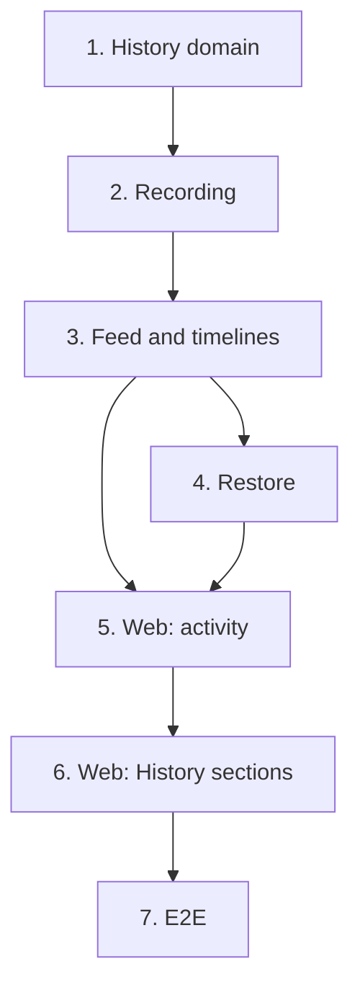

# Implementation Plan

## Overview

Seven tasks that build [design.md](design.md) against [requirements.md](requirements.md): the
history's domain; migration `0023` with the tables, the trigger and the transaction's user and
reason; the feed and the timelines over HTTP; restoring a past version; the *Activity* page; the
four pages' *History* sections; and the end-to-end journey.

One migration, `0023_history.py`, moves the head from `0022` to `0023`. One new module, `history`.
No new ADR here: the phase's closing task, in 19-command-palette, writes it.

Branch first: `git switch -c feat/history` from `feat/soft-delete-and-trash`, and never commit
this spec's work on `main`. 18-dashboard and 19-command-palette stack on this branch.

One task, one commit, each passing `make check` **on its own** (AGENTS.md). `make coverage` on
tasks 2 to 4; `make client` on 3 and 4, the regenerated client in each of those commits; `make
e2e` on 3 to 7. A port that grows a method grows it in the same commit as its SQL implementation
and its fake. Tick the task in this file in the same commit. Suggested commit subjects are in
`code` under each task.

## Tasks

- [x] 1. History: read a change's rows as fields before and after
  - `history/domain/`: `RecordKind`, `RowKind`, `Operation`, `Action`, `FieldChange`, `RowChange`
    (`label`, `fields`), `Change` (`action`, `own_row`, `more_rows`), `ChangeCursor`,
    `HistoryPage`, `shorten`, `shown`; `restore.py`: `EDITABLE_FIELDS`, `PutBack`,
    `TakeOutOfTrash`, `plan_restore`, `restorable`; the errors; `values.py`: `WorkspaceId`,
    `ChangeId`.
  - `pyproject.toml`'s import-linter contracts name `wiredex.history` among the layered
    containers, the modules kept from `bootstrap` and the independent modules.
  - Tests: `tests/history/test_history.py` (properties 1 to 3; labels per kind; the hidden fields;
    actions), `tests/history/test_restore.py` (what is restorable; a plan putting back the
    editable fields, a move to the trash planned as a restore from it).
  - Checks: `make check`.
  - `feat(history): read a change's rows as fields before and after`
  - _Requirements: 2.1, 2.2, 4.1, 4.3, 4.5, 8.1, 8.6_

- [ ] 2. Record every change in the database, with who and why
  - Migration `0023_history.py` from `make migration m="history"`, reviewed: the two tables, their
    indexes, `isolate_by_workspace` on both, the revoked `INSERT` and `UPDATE`, `history_root`,
    `history_trim`, `record_history`, `track_history` on the eighteen tables; a downgrade dropping
    them in reverse.
  - `shared_kernel/infrastructure/history_tracking.py` (`TRACKED_TABLES`, `track_history`,
    `stop_tracking`), `change_context.py` (`Actor`, `act_as`, `acting`, `changing_for`, `reason`),
    `row_security.name_the_transaction`; `SqlUnitOfWork` names the user and the reason in its one
    statement.
  - `history/infrastructure/orm.py` (both tables, registered in `bootstrap/orm.py`),
    `unit_of_work.py`, `repositories.py` with `clear`; `history/application/`: `HistoryChanges`
    (`clear` only, for now), `HistoryUnitOfWork`, `ClearHistory`; `tests/support/history.py`.
  - `bootstrap/app.py`: every workspace closure acts as the signed-in user; `bootstrap/history.py`:
    `clear_history_use_case`; `bootstrap/cli.py`: `_restore_benches` clears each bench's history.
  - Tests: integration `test_history_recording.py` (each tracked table's insert, update and delete
    recorded under its record and name; one change per transaction and record; a no-op and an
    `updated_at`-only update skipped; a rolled-back write leaving nothing; a part deleted with its
    pins recorded once; a user and a reason named by the transaction; the app role refused
    `INSERT` and `UPDATE` and seeing only its bench), `test_history_actor.py` (a write through the
    real app recorded with the signed-in user's name), `test_demo_cli.py` extended (a bench's
    history empty after an invite and after a reset), `test_migrations.py`'s round trip at `0023`;
    `tests/history/test_history_use_cases.py` (clearing).
  - Checks: `make check`, `make coverage`.
  - `feat(history): record every change in the database, with who and why`
  - _Requirements: 1.1, 1.2, 1.3, 1.4, 1.5, 1.6, 1.7, 5.1, 5.2, 5.3, 5.4, 6.1, 8.2_

- [ ] 3. History: read the activity feed and a record's timeline over HTTP
  - `HistoryChanges.page`; `SqlHistoryChanges.page` in two statements (the changes, then their rows
    ranked per change, the record's own row first, shortened by `history_trim`); `ListActivity`,
    `ListTimeline`, the `Records` port; `history/api/`: the router and its schemas;
    `bootstrap/history.py`: `RecordDirectory`, `history_use_cases`; `bootstrap/app.py` mounts it.
  - `make client`, the regenerated client and its named exports in this commit.
  - Tests: `tests/history/test_history_use_cases.py` (pages, a timeline's 404 asked of `Records`
    first), `test_history_api.py` (shapes, the limit and cursor 422s, an unknown kind),
    `test_history_auth.py` (401 on the reads); integration `test_history_reads.py` (a page of the
    feed and of a timeline in two statements whatever their size; a project's timeline holding its
    revision's lines; 20 rows a change and the count of the rest; another bench's changes unseen
    as `wiredex_app`; a timeline of a record in the trash a 404 through bootstrap).
  - Checks: `make check`, `make coverage`, `make client`, `make e2e`.
  - `feat(history): read the activity feed and a record's timeline over HTTP`
  - _Requirements: 2.1, 2.2, 2.3, 2.4, 2.5, 2.6, 3.1, 3.2, 3.3, 6.1, 6.2, 8.3, 8.4_

- [ ] 4. History: restore a part, unit, project or firmware to an earlier version
  - `HistoryChanges.own_row`; `RestoreVersion`; the `VersionRestorers` port;
    `bootstrap/history.py`: `Restorers` over `UpdatePart`, `RelabelUnit`, `UpdateProject`,
    `UpdateFirmware` and the trash's `RestoreFromTrash`, each under `changing_for("restore")`; the
    route `POST /api/history/changes/{change_id}/restore`.
  - `make client`, the regenerated client in this commit.
  - Tests: `tests/history/test_history_use_cases.py` (a plan handed to the restorers; 404 and 409),
    `test_history_api.py` (204, 404, 409), `test_history_auth.py` (401 and 403); integration
    `test_history_restore.py` (each of the four kinds put back through its module and recorded as
    a restore; a part whose values the schema no longer takes refused and unchanged; a move to the
    trash restored from it, and a 409 once it is gone; another bench's change a 404).
  - Checks: `make check`, `make coverage`, `make client`, `make e2e`.
  - `feat(history): restore a part, unit, project or firmware to an earlier version`
  - _Requirements: 4.1, 4.2, 4.3, 4.4, 4.5, 4.6, 6.3, 8.4_

- [ ] 5. Web: the activity page
  - `features/history/`: `history.ts`, `labels.ts`, `ChangeList.tsx`, `ActivityPage.tsx`; the
    `/activity` route; *Activity* before *Trash* in the main navigation; `history.*` and
    `nav.activity` in both locales; `aChange`, `aRowChange`, `respondWithActivity`,
    `respondWithTimeline` and `acceptRestores` in `src/test/server.ts`.
  - Tests: Vitest beside the page: the changes in order with who, what and the fields before →
    after, a record linking to its page, *Show more*, the end note, a restore asking first and
    refreshing, a refusal beside its change, an error, Brazilian Portuguese; the navigation's
    order.
  - Checks: `make check`, `make e2e`.
  - `feat(web): list the workspace's activity, and restore a version from it`
  - _Requirements: 7.1, 7.2, 7.4, 7.5, 7.6, 7.7, 7.8, 7.9_

- [ ] 6. Web: a History section on the part, unit, project and firmware pages
  - `features/history/HistorySection.tsx`, closed until *Show history*; the four pages render it.
  - Tests: a section opening its record's timeline and asking nothing before; a restore from it
    refreshing the page; the web suite at or above 85 %.
  - Checks: `make check`, `pnpm --filter @wiredex/web test:coverage`, `make e2e`.
  - `feat(web): show each part's, unit's, project's and firmware's history on its page`
  - _Requirements: 3.1, 7.3, 7.4, 7.7, 7.8, 8.5_

- [ ] 7. E2E: the history journey
  - `e2e/tests/history.spec.ts` on the shared session, names stamped by project, worker and time,
    `test.slow()`: a part defined and renamed twice, its *History* read on its page with the
    fields before and after, the version before the second rename restored, the page showing the
    earlier name, and the feed holding the restore; `expectNoSidewaysScroll` on the activity page.
  - Checks: `make check`, `make e2e`.
  - `test(e2e): cover a part's history, restoring a version and the activity feed`
  - _Requirements: 1.1, 2.1, 3.1, 4.1, 4.2, 7.2, 7.3, 7.4, 7.9_

## Task Dependency Graph



```json
{
  "waves": [
    { "wave": 1, "tasks": [{ "id": "1", "name": "History domain", "dependsOn": [] }] },
    { "wave": 2, "tasks": [{ "id": "2", "name": "Recording", "dependsOn": ["1"] }] },
    { "wave": 3, "tasks": [{ "id": "3", "name": "Feed and timelines", "dependsOn": ["2"] }] },
    { "wave": 4, "tasks": [{ "id": "4", "name": "Restore", "dependsOn": ["3"] }] },
    { "wave": 5, "tasks": [{ "id": "5", "name": "Web: activity", "dependsOn": ["3", "4"] }] },
    { "wave": 6, "tasks": [{ "id": "6", "name": "Web: History sections", "dependsOn": ["5"] }] },
    { "wave": 7, "tasks": [{ "id": "7", "name": "E2E", "dependsOn": ["6"] }] }
  ]
}
```

Reading it:

- **Root.** 1, the domain, depends on no task here.
- **Critical path.** 1 → 2 → 3 → 4 → 5 → 6 → 7: each task reads what the one before wrote.
- **2 before everything else.** Nothing can be read before the trigger writes it, and the demo
  benches' clearing lands with the trigger, so `test_demo_cli.py`'s row counts hold in that very
  commit.
- **4 before 5.** The activity page offers restoring, so the route exists first.

## Notes

### Before pushing

- `make check` on every commit, not only the last.
- `make coverage` on 2 to 4: API floor 90 %, web floor 85 %.
- `make client` in 3 and 4, whose commits carry the regenerated client.
- `make e2e` on 3 to 7.
- `wiredex db check` clean at `0023`.

### One PR per spec, and the release

Open this spec's PR from `feat/history`, based on `feat/soft-delete-and-trash` until that one
lands, then on `main`, with auto-merge (`gh pr merge N --rebase --auto`). No commit here carries
`Release-As`: the phase's last spec, 19-command-palette, does. Merging the release PR deploys to
production: only the owner decides when (AGENTS.md, Safety).
