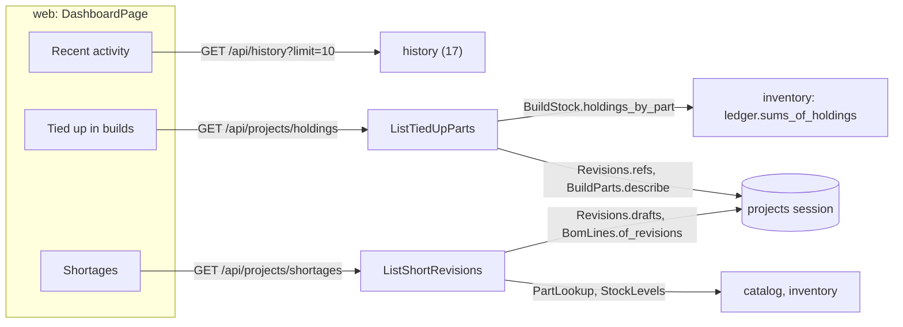

# Design Document: dashboard

## Overview

The third of four specs in `v0.8.0` Everyday use. The dashboard, the page at `/`, gets three
panels: recent activity, parts tied up in builds, and shortages. Recent activity reads 17's feed.
The other two are new reads of the projects module, built from what 09 and 10 already compute:
10's holdings, folded from the ledger, and 09's shortage report.

**Owner decisions that bind this spec**, and what each does here:

- **One PR per spec with auto-merge; the release PR waits for 19-command-palette, and only the
  owner merges it** (2026-09-27). No task here carries a `Release-As` footer.
- **ADR 0001**: modules never import each other. Projects asks inventory for holdings through
  10's `BuildStock` port, bound by bootstrap to projects' session, and asks catalog and inventory
  for part facts and stock levels through 09's `PartLookup` and `StockLevels`.
- **ADR 0002**: the ledger is the truth. Holdings are folded from it, as 10 does per revision.

**Decisions this spec makes (2026-10-01), for the owner to check.** They are listed with their
reasons in [requirements.md](requirements.md)'s introduction; here is how each is built.

1. **Holdings across the workspace come from one grouped ledger read.** Inventory's ledger gains
   `sums_of_holdings()`: 10's `_grouped_sums(with_revision=True)` with `revision_id IS NOT NULL`
   and no part filter, over the same partial index. `RevisionStock.holdings_by_part()` folds each
   revision's sums with `HeldStock.of`, splits them per part with `HeldStock.per_part()`, and
   regroups them. `BuildStock.holdings_by_part()` carries them into projects through
   `InventoryBuildStock`, on projects' session.

2. **`ListTiedUpParts` is one transaction of projects' build unit of work.** It asks
   `stock.holdings_by_part()`, then `revisions.refs` for every revision holding something, then
   `parts.describe` for every part held: five statements with the workspace setting and the
   catalog's tree, the last two reads skipped when nothing is held. Parts are ordered by reserved
   plus in builds, most first, then by name, folded; a part the catalog no longer holds has no
   name, so it comes after the named ones tied up as much. Each part lists its revisions with
   their own share, 10's `PartHoldingView`, by project name and label.

3. **`ListShortRevisions` reads the drafts and their BOMs, closes, then asks the other two
   modules.** `Revisions.drafts()` lists the drafts of live projects, joined to their projects,
   in one statement; `BomLines.of_revisions(ids)` loads their lines and designators in two, as
   `of_revision` does for one. Once the projects transaction is closed, `PartLookup.describe` and
   `StockLevels.available` are asked once for every part all those BOMs name. Each draft's
   `ShortageReport.of` then runs in memory against the same available stock (decision 5 of
   requirements), and only the drafts not `complete` are kept.

4. **Pages are a limit and a count.** Both reads take `limit` (1 to 100, 20 by default) and
   answer `more`, how many were left out. There is no cursor: the lists are bounded by the bench's
   builds and drafts, which are few, and a page holds the ones that matter most.

5. **The web: one page, three sections, each its own query.** Recent activity reads
   `GET /api/history?limit=10`; the other two read the new routes. Each query's key hangs off the
   root its data changes with: holdings off `lifecycleKeys.all`, which every transition drops;
   shortages off `bomKeys.all`, which every BOM write drops; recent activity off
   `historyKeys.all`. Every query is stale once it lands, so a receipt or a restore elsewhere shows
   the next time the dashboard is opened.

**Seen while designing, not changed here:**

- A unit-tracked part's units in builds aren't listed by code on the dashboard: the revision's own
  page lists them.
- The shortage of a part two drafts both need is counted in full for each, as each BOM page does.

**In scope:** the ledger read and its fold, the two ports' methods and their fakes, the two use
cases and routes, the dashboard page, the E2E journey.

**Out of scope:** sharing stock between drafts, a shopping list, configuring panels, stock
thresholds.

## Architecture



## Components and Interfaces

### Inventory

| File | Change |
| --- | --- |
| `domain/holdings.py` | `HeldStock.per_part() -> dict[PartId, PartHeld]`: reserved over the part's lots, and consumed |
| `application/ports.py` | `Ledger.sums_of_holdings() -> dict[RevisionId, list[MovementSum]]` |
| `infrastructure/repositories.py` | `SqlLedger.sums_of_holdings`, `_grouped_sums(with_revision=True)` with `revision_id IS NOT NULL` |
| `application/builds.py` | `RevisionStock.holdings_by_part() -> dict[PartId, list[PartHolding]]` |

### Projects

```python
class BuildStock(Protocol):
    async def holdings_by_part(self) -> Mapping[PartId, list[RevisionHolding]]:
        """Every part a revision holds, each with the revisions holding it, in one query."""


class Revisions(Protocol):
    async def drafts(self) -> list[RevisionRef]:
        """The drafts of the workspace's live projects, joined to them, in one read."""


class BomLines(Protocol):
    async def of_revisions(
        self, revision_ids: Sequence[RevisionId]
    ) -> Mapping[RevisionId, BillOfMaterials]:
        """The BOMs of these revisions, in two reads whatever their number."""
```

| Use case | What it does |
| --- | --- |
| `ListTiedUpParts(build_unit_of_work)` | `(workspace_id, limit) -> TiedUpParts`: decision 2 |
| `ListShortRevisions(bom_unit_of_work, parts, stock)` | `(workspace_id, limit) -> ShortRevisions`: decision 3 |

Not `HeldPart`: 10's lifecycle already names one part a revision holds that way, and its
response `HeldPartResponse` is on the wire.

```python
@dataclass(frozen=True, slots=True)
class TiedUpPart:
    part_id: PartId
    facts: PartFacts | None
    reserved: int
    consumed: int
    # Each revision with its share, by project name and label.
    revisions: tuple[PartHoldingView, ...]


@dataclass(frozen=True, slots=True)
class TiedUpParts:
    parts: tuple[TiedUpPart, ...]
    more: int


@dataclass(frozen=True, slots=True)
class ShortRevision:
    revision: RevisionRef
    report: ShortageReport


@dataclass(frozen=True, slots=True)
class ShortRevisions:
    revisions: tuple[ShortRevision, ...]
    more: int
```

Bootstrap: `InventoryBuildStock.holdings_by_part` over `RevisionStock.holdings_by_part`; the two
use cases join `ProjectsUseCases`, wired in `bootstrap/projects.py`.

### HTTP

| Method and path | Answers | Requirement |
| --- | --- | --- |
| `GET /api/projects/holdings?limit=` | `TiedUpPartsResponse` | 1 |
| `GET /api/projects/shortages?limit=` | `ShortRevisionsResponse` | 2 |

```python
class TiedUpPartResponse(BaseModel):
    part_id: UUID
    part: BomPartFactsResponse | None
    reserved: int
    consumed: int
    revisions: list[PartHoldingResponse]  # 10's: the revision's ref and its share


class TiedUpPartsResponse(BaseModel):
    parts: list[TiedUpPartResponse]
    more: int


class ShortRevisionResponse(BaseModel):
    revision: RevisionRefResponse
    summary: ShortageSummaryResponse
    parts: list[BomPartResponse]  # the short and unknown ones only


class ShortRevisionsResponse(BaseModel):
    revisions: list[ShortRevisionResponse]
    more: int
```

Both are static paths, declared before `/{project_id}` so neither reaches it as an id.

### Web

| File | What |
| --- | --- |
| `features/dashboard/dashboard.ts` | `useRecentActivity`, `useTiedUpParts`, `useShortRevisions`, keyed as decision 5 says |
| `features/dashboard/DashboardPage.tsx` | The three sections, and the invitation when all three are empty |
| `features/dashboard/RecentActivity.tsx`, `TiedUpParts.tsx`, `Shortages.tsx` | One panel each |
| `features/dashboard/Panel.tsx` | A panel's titled region and its loading, error and empty states, shared by the three |

The recent activity names each change's record with 17's `RecordName`, exported from
`ChangeList.tsx` for it; the rows, the fields and the restore stay on the activity page.

Keys under `dashboard.*`, in both locales. `src/test/server.ts` gains `aTiedUpPart`,
`respondWithTiedUpParts`, `aShortRevision` and `respondWithShortRevisions`.

## Data Models

No migration. Holdings are folded from `stock_movements`, shortages computed from BOMs, stock and
the catalog as they stand at each read, as 09 and 10 compute them.

## Correctness Properties

### Property 1: the workspace's holdings are the sum of each revision's

For any ledger of reserves, releases, consumptions and returns across revisions, every part's
reserved and in-builds quantities in `holdings_by_part` are the sums of what `HeldStock.of` gives
each revision for that part, and a part every revision has let go of is absent.

## Error Handling

| Case | Status |
| --- | --- |
| A limit below 1 or above 100 | 422 |
| No session | 401 |

## Testing Strategy

| Level | Files | What |
| --- | --- | --- |
| Domain | `tests/inventory/test_holdings.py` extended | `per_part` |
| Application | `tests/inventory/test_revision_stock.py` extended | Property 1 |
| Application | `tests/projects/test_dashboard_use_cases.py` | The order, the limit and the count, unknown parts after the named ones, covered and empty drafts left out, a draft of a trashed project left out, catalog and inventory asked once |
| Integration | `tests/integration/test_dashboard_reads.py` | Both reads as `wiredex_app` in a fixed number of statements whatever their size; the holdings following a reserve, a build, a dismantle and a cancel; another bench unseen |
| HTTP | `tests/projects/test_dashboard_api.py`, `test_projects_auth.py` extended | Shapes, the limit's 422, 401 |
| Web | beside each panel | Each panel's states and links, the invitation, Brazilian Portuguese |
| E2E | `e2e/tests/dashboard.spec.ts` | A part a revision reserves shows as tied up; its fork, short of what the reserve left, shows in shortages; recent activity lists what the feed answered; cancelling the reservation clears both the next time the dashboard is shown; no sideways scroll on a phone |

## Seams for later specs

| Seam | For | What it is |
| --- | --- | --- |
| `Revisions.drafts` | 19-command-palette | Nothing yet: the palette searches by name |
| `holdings_by_part` | later | A part's page can say *tied up in N builds* from it |
