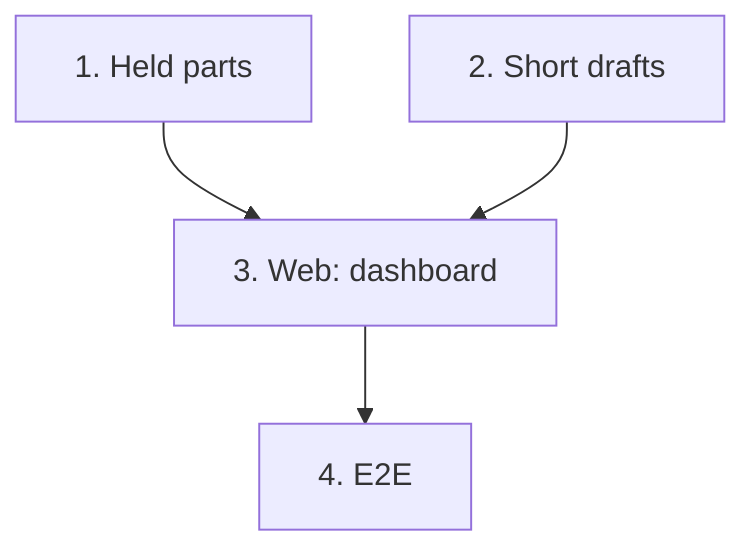

# Implementation Plan

## Overview

Four tasks that build [design.md](design.md) against [requirements.md](requirements.md): the parts
tied up in builds across the workspace; the drafts' shortages; the dashboard page with its three
panels; and the end-to-end journey.

No migration, no new module: the projects module answers both new reads, inventory's ledger one
more grouped sum.

Branch first: `git switch -c feat/dashboard` from `feat/history`, and never commit this spec's work
on `main`. 19-command-palette stacks on this branch.

One task, one commit, each passing `make check` **on its own** (AGENTS.md). `make coverage` on
tasks 1 and 2; `make client` on 1 and 2, the regenerated client in each of those commits; `make
e2e` on all four. A port that grows a method grows it in the same commit as its SQL implementation
and its fake. Tick the task in this file in the same commit. Suggested commit subjects are in
`code` under each task.

## Tasks

- [x] 1. Projects: list the parts tied up in builds across the workspace
  - Inventory: `Ledger.sums_of_holdings`, `SqlLedger.sums_of_holdings`,
    `RevisionStock.holdings_by_part`; the inventory fakes alike.
  - Projects: `BuildStock.holdings_by_part`, `InventoryBuildStock.holdings_by_part`,
    `InMemoryBuildStock.holdings_by_part`; `TiedUpPart`, `TiedUpParts`, `ListTiedUpParts`; the
    route `GET /api/projects/holdings` and its schemas; `make client`, the regenerated client and
    its named exports in this commit.
  - Tests: `tests/inventory/test_holdings.py` (`per_part`), `test_revision_stock.py` (property
    1), `tests/projects/test_dashboard_use_cases.py` (the order, the limit and the count, an
    unknown part after the named ones), `test_dashboard_api.py` and `test_projects_auth.py`;
    integration `test_dashboard_reads.py` (a reserve, a build, a dismantle and a cancel followed;
    five statements whatever the size; another bench unseen).
  - Checks: `make check`, `make coverage`, `make client`, `make e2e`.
  - `feat(projects): list the parts tied up in builds across the workspace`
  - _Requirements: 1.1, 1.2, 1.3, 1.4, 4.1, 4.2, 6.1, 6.3, 6.4_

- [x] 2. Projects: list the drafts short of parts
  - `Revisions.drafts`, `BomLines.of_revisions`, their SQL and fakes; `ShortRevision`,
    `ShortRevisions`, `ListShortRevisions`; the route `GET /api/projects/shortages` and its
    schemas; `make client`, the regenerated client and its named exports in this commit.
  - Tests: `tests/projects/test_dashboard_use_cases.py` extended (covered, consumable-only and
    empty drafts left out; a trashed project's draft left out; the limit and the count; catalog
    and inventory asked once, after the projects transaction), `test_dashboard_api.py` and the
    auth test extended; `test_dashboard_reads.py` extended (nine statements whatever the drafts
    and lines; covered, reserved and trashed drafts left out; another bench unseen).
  - Checks: `make check`, `make coverage`, `make client`, `make e2e`.
  - `feat(projects): list the drafts whose BOM is short of parts`
  - _Requirements: 2.1, 2.2, 2.3, 2.4, 4.1, 4.2, 6.2, 6.4_

- [x] 3. Web: the dashboard's three panels
  - `features/dashboard/`: `dashboard.ts`, `RecentActivity.tsx`, `TiedUpParts.tsx`,
    `Shortages.tsx`, `DashboardPage.tsx`; `dashboard.*` keys in both locales; `aTiedUpPart`,
    `respondWithTiedUpParts`, `aShortRevision` and `respondWithShortRevisions` in
    `src/test/server.ts`; the router's and the language switcher's tests answered.
  - Tests: Vitest beside the page: each panel's list, links, loading, error and empty states; the
    invitation when all three are empty; the activity's link to `/activity`; Brazilian
    Portuguese; the web suite at or above 85 %.
  - Checks: `make check`, `pnpm --filter @wiredex/web test:coverage`, `make e2e`.
  - `feat(web): show recent activity, parts tied up in builds and shortages on the dashboard`
  - _Requirements: 3.1, 3.2, 5.1, 5.2, 5.3, 5.4, 5.5, 5.6, 6.5_

- [x] 4. E2E: the dashboard journey
  - `e2e/tests/dashboard.spec.ts` on the shared session, names stamped by project, worker and time,
    `test.slow()`: a part received and reserved by a revision shows as tied up, with the revision;
    the revision's fork, a draft whose BOM needs more than the stock left, shows in shortages;
    recent activity lists the changes the feed answered it, newest first; cancelling the
    reservation, through the dashboard's link, empties both panels of them the next time the
    dashboard is shown; `expectNoSidewaysScroll` on a phone.
  - The stamp falls as time passes, so this run's project and part sort before every earlier
    run's: the local database keeps them all, and the panels hold 20. Other journeys write while
    this one runs, so it checks the activity panel against the feed's own answer, not for its own
    change.
  - Checks: `make check`, `make e2e`.
  - `test(e2e): cover the dashboard's builds, shortages and recent activity`
  - _Requirements: 1.1, 2.1, 3.1, 5.1, 5.6_

## Task Dependency Graph



```json
{
  "waves": [
    {
      "wave": 1,
      "tasks": [
        { "id": "1", "name": "Held parts", "dependsOn": [] },
        { "id": "2", "name": "Short drafts", "dependsOn": [] }
      ]
    },
    { "wave": 2, "tasks": [{ "id": "3", "name": "Web: dashboard", "dependsOn": ["1", "2"] }] },
    { "wave": 3, "tasks": [{ "id": "4", "name": "E2E", "dependsOn": ["3"] }] }
  ]
}
```

Reading it:

- **Roots.** 1 and 2 are independent reads of the projects module.
- **Critical path.** 1 → 2 → 3 → 4, built in that order so each commit's client holds the routes
  before them.

## Notes

### Before pushing

- `make check` on every commit, not only the last.
- `make coverage` on 1 and 2: API floor 90 %, web floor 85 %.
- `make client` in 1 and 2, whose commits carry the regenerated client.
- `make e2e` on all four.

### One PR per spec, and the release

Open this spec's PR from `feat/dashboard`, based on `feat/history` until that one lands, then on
`main`, with auto-merge (`gh pr merge N --rebase --auto`). No commit here carries `Release-As`: the
phase's last spec, 19-command-palette, does. Merging the release PR deploys to production: only
the owner decides when (AGENTS.md, Safety).
