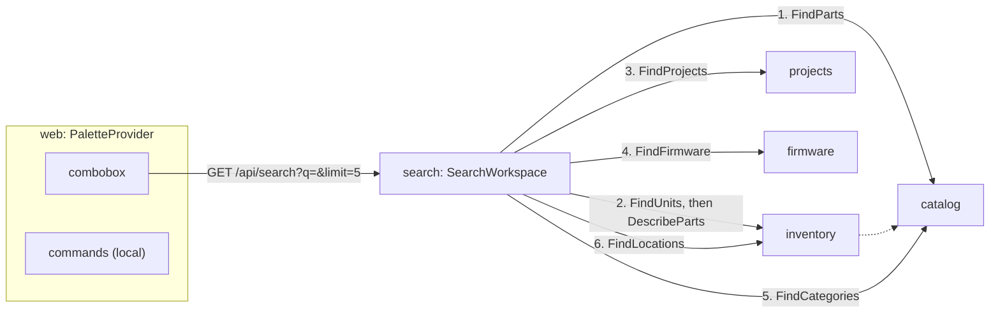

# Design Document: command-palette

## Overview

The last of four specs in `v0.8.0` Everyday use. A `search` module answers one read,
`GET /api/search`, by asking each of six kinds' modules for its records matching a text; the web
gets a palette, opened with `Ctrl K` from any page, that lists commands and those hits in one
keyboard-driven list. The last task closes the phase.

**Owner decisions that bind this spec**, and what each does here:

- **One PR per spec with auto-merge; the release PR waits for this spec, and only the owner
  merges it** (2026-09-27). The last task's commit carries `Release-As: 0.8.0`.
- **ADR 0001**: modules never import each other. `search` imports none; `bootstrap/search.py`
  builds one source per kind over that kind's module's own use case.
- **ADR 0007**: every read is the caller's workspace, through each module's own unit of work,
  row-level security included.
- **16-soft-delete-and-trash, decision 2**: a record in the trash is absent everywhere. Each
  module's new read goes through its `_mine()`, which leaves the trash out.

**Decisions this spec makes (2026-10-01), for the owner to check.** They are listed with their
reasons in [requirements.md](requirements.md)'s introduction; here is how each is built.

1. **Each module gets one `Find…` use case over one repository read.** Catalog `FindParts` and
   `FindCategories`, inventory `FindUnits` and `FindLocations`, projects `FindProjects`, firmware
   `FindFirmware`: `(workspace_id, text, limit) -> list[Entity]`. Each trims the text and answers
   nothing for a blank one; its repository's `find(text, limit)` is one `SELECT … WHERE … ILIKE
   … ORDER BY … LIMIT`, the wildcards escaped as every search escapes them.
2. **The order is decided in SQL.** `ORDER BY title ILIKE 'text%' DESC, lower(title), id`, so a
   record whose title starts with the text comes first, and the id settles a tie.
3. **`search` asks for one more than it shows.** `SearchWorkspace` asks each source for
   `limit + 1` hits, keeps `limit`, and says `more` when the extra came back: no count query.
4. **The sources run one after the other, in the groups' order**, each in its module's
   transaction, closed before the next opens (decision 5 of requirements). A unit's detail, its
   part's name, is asked of catalog's `DescribeParts` once, after inventory's read has closed,
   as the trash's unit bin does, and only when some unit matched.
5. **The palette is a provider beside quick-add's.** `PaletteProvider` holds the one dialog,
   listens for the chord, makes the page behind it inert and hands focus back on close, as
   `QuickAddProvider` does; it sits inside `QuickAddProvider`, so the quick-add command can open
   that dialog once the palette is gone.
6. **One combobox, one listbox.** The box keeps focus; the list holds the commands' group and one
   group per kind; the arrows move an active descendant through every choice in order. Commands
   filter on each keystroke; hits come from `GET /api/search?q=…&limit=5` once typing pauses for
   200 ms, as `usePartSuggestions` asks, so Enter never opens a hit for older text.
7. **A location is selected through the address.** `/locations?selected=<id>` opens the page
   with that location selected; a category opens `/parts?category=<id>`, which 04's search reads.

**Seen while designing, not changed here:**

- 06's unit search and 08's and 13's lists read every match: their pages show them all. The
  palette's reads are new, limited ones; the old ones are left as their pages use them.
- A location's page shows its rename, move and delete, not its stock: opening it selected is as
  far as a location goes today.

**In scope:** six module reads and their fakes, the `search` module and its route, the palette
and its provider, the locations page's `selected`, the E2E journey, and the phase's closing docs.

**Out of scope:** what requirements.md leaves out.

## Architecture



## Components and Interfaces

### The modules' reads

| Module | Use case | Repository | Matches | Title order |
| --- | --- | --- | --- | --- |
| catalog | `FindParts` | `PartDefinitions.find` | name, MPN, manufacturer | name |
| catalog | `FindCategories` | `Categories.find` | name | name |
| inventory | `FindUnits` | `Units.find` | code, serial, MAC | code |
| inventory | `FindLocations` | `Locations.find` | name, code | name |
| projects | `FindProjects` | `Projects.find` | name | name |
| firmware | `FindFirmware` | `Firmwares.find` | name, target | name |

Every one is the workspace's live records only, through the repository's `_mine()`.

### The search module

```python
class SearchKind(StrEnum):  # the groups' order
    PART = "part"
    UNIT = "unit"
    PROJECT = "project"
    FIRMWARE = "firmware"
    CATEGORY = "category"
    LOCATION = "location"


@dataclass(frozen=True, slots=True)
class SearchHit:
    kind: SearchKind
    id: UUID
    title: str
    detail: str | None


@dataclass(frozen=True, slots=True)
class SearchGroup:
    kind: SearchKind
    hits: tuple[SearchHit, ...]
    more: bool


@dataclass(frozen=True, slots=True)
class SearchResults:
    query: str
    groups: tuple[SearchGroup, ...]  # kinds with hits only, in `SearchKind` order


class SearchSource(Protocol):
    @property
    def kind(self) -> SearchKind: ...

    async def find(
        self, workspace_id: WorkspaceId, text: str, limit: int
    ) -> Sequence[SearchHit]: ...
```

`SearchText.of(raw)` trims and refuses a blank text or one past 100 characters with
`InvalidSearchError`; `SearchWorkspace(sources)` is `(workspace_id, text, limit) ->
SearchResults`.

### HTTP

| Method and path | Answers | Requirement |
| --- | --- | --- |
| `GET /api/search?q=&limit=` | `SearchResultsResponse` | 1, 2 |

```python
class SearchHitResponse(BaseModel):
    id: UUID
    title: str
    detail: str | None


class SearchGroupResponse(BaseModel):
    kind: SearchKindName  # Literal of the six
    hits: list[SearchHitResponse]
    more: bool


class SearchResultsResponse(BaseModel):
    query: str
    groups: list[SearchGroupResponse]
```

`q` is required, at most 100 characters (FastAPI's own 422 past that); `limit` is 1 to 20, 5
by default; a blank `q` is the domain's 422.

### Bootstrap

`bootstrap/search.py`: `PartSource`, `UnitSource`, `ProjectSource`, `FirmwareSource`,
`CategorySource` and `LocationSource`, each over its module's `Find…` on its own unit of work,
turning entities into `SearchHit`s; `search_use_cases(session_factory)`. `bootstrap/app.py`
mounts the router with the other modules'.

### Web

| File | What |
| --- | --- |
| `features/palette/palette.ts` | `workspaceSearchQuery`, `useWorkspaceSearch(text)` asking once typing pauses, `hitTarget(kind, hit)` |
| `features/palette/commands.ts` | The commands, their i18n keys, where each goes, `matchingCommands(text)` |
| `features/palette/PaletteProvider.tsx` | The chord, the inert page, focus back on close, `usePalette()` |
| `features/palette/CommandPalette.tsx` | The dialog: the combobox, the listbox, the groups, the status |
| `app/AppLayout.tsx` | The provider, and the header's search button beside quick-add's |
| `app/router.tsx`, `features/inventory/LocationsPage.tsx` | `selected` in the locations address |

Keys under `palette.*`, in both locales. `src/test/server.ts` gains `aSearchHit` and
`respondWithWorkspaceSearch`.

## Data Models

No migration: decision 6 of requirements.

## Correctness Properties

### Property 1: a group shows at most its limit and says when more match

For any number of records a source holds that match, and any limit from 1 to 20, the group
holds the first `min(n, limit)` of them in the source's order, `more` is true exactly when
`n > limit`, and a kind with no match has no group.

## Error Handling

| Case | Status |
| --- | --- |
| `q` missing, blank once trimmed, or past 100 characters | 422 |
| A limit below 1 or above 20 | 422 |
| No session | 401 |

## Testing Strategy

| Level | Files | What |
| --- | --- | --- |
| Domain | `tests/search/test_search.py` | `SearchText`, the grouping, property 1 |
| Application | `tests/search/test_search_use_cases.py` | The order of the sources, one at a time, `limit + 1`, groups left out |
| Application | each module's `test_find.py` | Matches, order, limit, blank text, the trash left out |
| Integration | `tests/integration/test_find_reads.py` | Each `find` over Postgres as `wiredex_app`: one statement, prefix first, wildcards as typed, the trash and another bench left out |
| Integration | `tests/integration/test_search_reads.py` | The whole search in a fixed number of statements, whatever the matches |
| HTTP | `tests/search/test_search_api.py`, `test_search_auth.py` | Shapes, 422s, 401 |
| Web | beside the palette | The chord, the button, commands, hits, keys, states, Portuguese, focus back |
| E2E | `e2e/tests/palette.spec.ts` | `Ctrl K`, a stamped part found and opened, a command run, no sideways scroll on a phone |

## Seams for later specs

| Seam | For | What it is |
| --- | --- | --- |
| `SearchSource` | later | A seventh kind is one more source in bootstrap |
| `commands.ts` | later | A command is one more entry |
