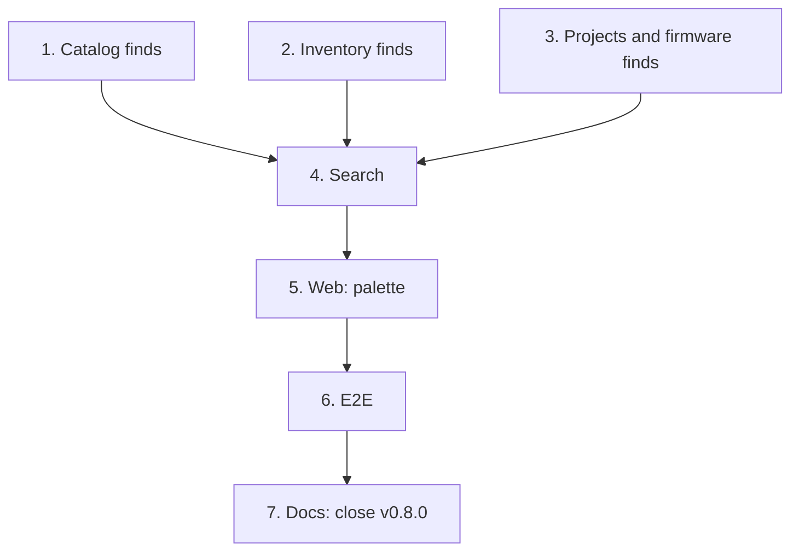

# Implementation Plan

## Overview

Seven tasks that build [design.md](design.md) against [requirements.md](requirements.md): one
limited read per kind in its own module, in three commits; the `search` module and its route; the
palette; the end-to-end journey; and the commit that closes `v0.8.0`.

No migration. A new module, `search`, joins the import-linter contracts in task 4.

Branch first: `git switch -c feat/command-palette` from `feat/dashboard`, and never commit this
spec's work on `main`.

One task, one commit, each passing `make check` **on its own** (AGENTS.md). `make coverage` on
tasks 1 to 4; `make client` on task 4, the regenerated client in that commit; `make e2e` on
tasks 4 to 6. A port that grows a method grows it in the same commit as its SQL implementation
and its fake. Tick the task in this file in the same commit. Suggested commit subjects are in
`code` under each task.

## Tasks

- [x] 1. Catalog: find parts and categories by typed text
  - `PartDefinitions.find`, `Categories.find`, their SQL and fakes; `FindParts`, `FindCategories`.
  - Tests: `tests/catalog/test_find.py` (matches, order, limit, blank text, a part in the trash
    left out); integration `test_find_reads.py` (one statement each, prefix first, wildcards as
    typed, the trash and another bench left out).
  - Checks: `make check`, `make coverage`.
  - `feat(catalog): find parts and categories by typed text`
  - _Requirements: 1.1, 1.3, 1.6, 2.1, 2.2_

- [x] 2. Inventory: find units and locations by typed text
  - `Units.find`, `Locations.find`, their SQL and fakes; `FindUnits`, `FindLocations`.
  - Tests: `tests/inventory/test_find.py`; `test_find_reads.py` extended.
  - Checks: `make check`, `make coverage`.
  - `feat(inventory): find units and locations by typed text`
  - _Requirements: 1.1, 1.3, 1.6, 2.1, 2.2_

- [x] 3. Projects and firmware: find projects and firmware by typed text
  - `Projects.find`, `Firmwares.find`, their SQL and fakes; `FindProjects`, `FindFirmware`.
  - Tests: `tests/projects/test_find.py`, `tests/firmware/test_find.py`; `test_find_reads.py`
    extended.
  - Checks: `make check`, `make coverage`.
  - `feat(projects): find projects and firmware by typed text`
  - _Requirements: 1.1, 1.3, 1.6, 2.1, 2.2_

- [x] 4. Search: the workspace's records in one read
  - The `search` module: `domain/search.py` (`SearchKind`, `SearchHit`, `SearchGroup`,
    `SearchResults`, `SearchText`), `application/` (`SearchSource`, `SearchWorkspace`),
    `api/` (`create_router`, the schemas); `bootstrap/search.py` with the six sources;
    `bootstrap/app.py`; the import-linter contracts; `make client`, the regenerated client and
    its named exports in this commit.
  - Tests: `tests/search/` (domain with property 1, use cases with fake sources, API, auth);
    integration `test_search_reads.py` (a fixed number of statements whatever the matches).
  - Checks: `make check`, `make coverage`, `make client`, `make e2e`.
  - `feat(search): search the workspace's parts, units, projects, firmware, categories and locations`
  - _Requirements: 1.1 to 1.6, 2.1 to 2.3, 6.1 to 6.3_

- [ ] 5. Web: the command palette
  - `features/palette/` (`palette.ts`, `commands.ts`, `PaletteProvider.tsx`,
    `CommandPalette.tsx`); the header's search button; `selected` in the locations address;
    `palette.*` keys in both locales; `aSearchHit` and `respondWithWorkspaceSearch`; the tab
    counts the header's new button moves.
  - Tests: Vitest beside the palette and the locations page; the web suite at or above 85 %.
  - Checks: `make check`, `pnpm --filter @wiredex/web test:coverage`, `make e2e`.
  - `feat(web): open a command palette with Ctrl K that searches the workspace`
  - _Requirements: 3.1 to 3.5, 4.1 to 4.6, 5.1 to 5.4_

- [ ] 6. E2E: the palette journey
  - `e2e/tests/palette.spec.ts` on the shared session, names stamped by project, worker and time,
    `test.slow()`: `Ctrl K` (the button on a phone), a stamped part typed, found and opened with
    Enter; a command typed and run; Escape handing focus back; `expectNoSidewaysScroll` on a
    phone with the palette open.
  - Checks: `make check`, `make e2e`.
  - `test(e2e): cover the command palette's search and commands`
  - _Requirements: 3.1, 3.4, 4.2, 4.4, 5.3_

- [ ] 7. Docs: close `v0.8.0`
  - The README's four `v0.8.0` lines ticked; ADR 0014 (soft delete and the trash) and ADR 0015
    (history), and the ADR table; ADRs 0001, 0003, 0006 and 0007 and `docs/architecture.md`
    updated for what the phase changed (the trash, history and search modules, the history
    tables among the isolated ones); the commit's footer `Release-As: 0.8.0`.
  - Checks: `make check`.
  - `docs: close v0.8.0 with the trash and history ADRs`
  - _Requirements: 7.1_

## Task Dependency Graph



```json
{
  "waves": [
    {
      "wave": 1,
      "tasks": [
        { "id": "1", "name": "Catalog finds", "dependsOn": [] },
        { "id": "2", "name": "Inventory finds", "dependsOn": [] },
        { "id": "3", "name": "Projects and firmware finds", "dependsOn": [] }
      ]
    },
    { "wave": 2, "tasks": [{ "id": "4", "name": "Search", "dependsOn": ["1", "2", "3"] }] },
    { "wave": 3, "tasks": [{ "id": "5", "name": "Web: palette", "dependsOn": ["4"] }] },
    { "wave": 4, "tasks": [{ "id": "6", "name": "E2E", "dependsOn": ["5"] }] },
    { "wave": 5, "tasks": [{ "id": "7", "name": "Docs: close v0.8.0", "dependsOn": ["6"] }] }
  ]
}
```

Reading it:

- **Roots.** 1, 2 and 3 are independent reads of their own modules.
- **Critical path.** 1 → 2 → 3 → 4 → 5 → 6 → 7, built in that order so each commit stands alone.

## Notes

### Before pushing

- `make check` on every commit, not only the last.
- `make coverage` on 1 to 4: API floor 90 %, web floor 85 %.
- `make client` in 4, whose commit carries the regenerated client.
- `make e2e` on 4 to 6.

### One PR per spec, and the release

Open this spec's PR from `feat/command-palette`, based on `feat/dashboard` until that one lands,
then on `main`, with auto-merge (`gh pr merge N --rebase --auto`). Task 7's commit carries
`Release-As: 0.8.0`, so release-please opens the `v0.8.0` release PR once this PR lands. Merging
that release PR deploys to production: only the owner decides when (AGENTS.md, Safety).
