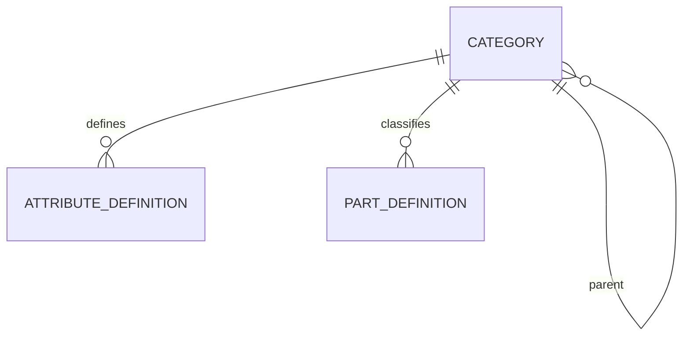

# Design: catalog foundation

Design-First spec. The architecture is already fixed by
[ADR 0001](../../../docs/adr/0001-modular-monolith.md),
[ADR 0005](../../../docs/adr/0005-typed-part-attributes.md) and
[ADR 0007](../../../docs/adr/0007-workspace-isolation.md), so the design comes first and
the requirements are written against it.

## 1. Scope

The first slice of `v0.3.0` Catalog: a category tree that carries attribute schemas, part
definitions whose attribute values are validated against the schema of their category,
and engineering notation normalized to SI so `4k7` and `4700` are the same number.

In scope:

- The `catalog` module: `domain`, `application`, `infrastructure`, `api`.
- Category tree with inherited `AttributeDefinition`s.
- `PartDefinition` with typed attribute values in JSONB.
- Engineering-notation parsing and formatting.
- What happens to existing parts when a category schema changes.
- The first workspace-scoped module, so: resolving the current workspace per request,
  `workspace_id` on every row, `isolate_by_workspace` in the migration.
- Web: browse and edit parts, manage categories and their attributes.
- Catalog sample data for the demo workspace.

Out of scope, each its own spec later in `v0.3.0`:

- Structured pinouts (`part-pinouts`).
- Attachments and the `files` module (`files-and-attachments`).
- Parametric search and filters (`parametric-search`).
- CSV import and keyboard-first quick-add (those land in `v0.4.0`).

Part listing here is a plain paginated list with a name substring match. Faceted
filtering by attribute is deliberately left to `parametric-search`; this spec only
guarantees the storage and indexes it will need.

## 2. Domain model



`apps/api/src/wiredex/catalog/domain/`:

| File | Holds |
| --- | --- |
| `values.py` | Ids, `CategoryName`, `AttributeKey`, `AttributeLabel`, `Unit`, `PartName`, `Manufacturer`, `Mpn`, `Package`, `AttributeKind`, `SiValue` |
| `notation.py` | Engineering notation: text → `SiValue`, `SiValue` → text |
| `validators.py` | One validator per `AttributeKind` (Strategy) |
| `schema.py` | `AttributeDefinition`, `AttributeSchema` (first-class collection) |
| `category.py` | `Category` |
| `part.py` | `PartDefinition`, `AttributeValues` (first-class collection) |
| `errors.py` | `CatalogError` and its leaves |

Ids follow identity: `NewType` over `UUID`, UUIDv7 from `IdGenerator`.

```python
WorkspaceId = NewType("WorkspaceId", UUID)
CategoryId = NewType("CategoryId", UUID)
AttributeDefinitionId = NewType("AttributeDefinitionId", UUID)
PartDefinitionId = NewType("PartDefinitionId", UUID)
```

`catalog` declares its own `WorkspaceId` rather than importing identity's: modules don't
import each other's domain, and the architecture diagram has no `catalog → identity`
arrow. When a third module needs it, promote it to `shared_kernel/domain/values.py`.

### 2.1 Values

Same shape as `identity/domain/values.py`: frozen slotted dataclasses that validate in
`__post_init__`, normalize through `object.__setattr__`, and raise a `CatalogError`.

- `CategoryName`, `PartName`, `AttributeLabel`: trimmed, whitespace collapsed, non-empty,
  length capped (80 / 120 / 80). Not lower-cased, because case is the user's choice.
- `AttributeKey`: trimmed, lower-cased, `^[a-z][a-z0-9_]{0,39}$`. It is a JSONB key and
  a query identifier, so it stays a slug.
- `Unit`: the SI symbol the numbers are stored in (`Ω`, `F`, `V`, `B`, `Hz`). Free text,
  capped at 16, kept as typed. It labels values; it does not convert them.
- `Manufacturer`, `Mpn`, `Package`: optional, trimmed, capped (80 / 80 / 40). `Mpn` keeps
  its case but compares case-insensitively for uniqueness, so a `fold()` accessor exists
  for the repository.
- `AttributeKind(StrEnum)`: `number`, `enum`, `text`, `bool` — exactly ADR 0005's four.
- `SiValue`: a `Decimal` in SI base units, the canonical form of a number attribute.

### 2.2 Engineering notation

`notation.py` is pure functions over `Decimal`, no I/O, and the heart of the
"`10k` equals `10000`" guarantee.

Accepted input, case-sensitively for prefixes (`m` ≠ `M`):

| Written | Means | Why it's accepted |
| --- | --- | --- |
| `4700`, `4.7e3` | 4700 | Plain decimal and scientific |
| `4k7`, `2u2`, `1R5` | 4700, 0.0000022, 1.5 | The prefix stands in for the decimal point |
| `10k`, `100n`, `2.2µ` | 10000, 1e-7, 0.0000022 | Prefix as a suffix |
| `10kΩ`, `100nF` | 10000, 1e-7 | A trailing unit that matches the definition's unit |
| `-40` | -40 | Negatives, for temperature ranges |

Prefixes: `p n µ u m k M G T` (`u` is an alias for `µ`, `R` means "no prefix" and exists
because resistors are written `1R5`). `K` is rejected rather than guessed at: `k` is kilo,
`K` is kelvin.

Two functions, inverses of each other:

```python
def parse_si(text: str, unit: Unit | None = None) -> SiValue: ...
def format_si(value: SiValue, unit: Unit | None = None) -> str: ...
```

`format_si` picks the prefix that puts the mantissa in `[1, 1000)` and prints at most
four significant digits: `SiValue(Decimal("4700"))` → `4.7k`. Parsing is the only way a
number enters the domain, so nothing else needs to know about notation.

**Why `Decimal` and not `float`.** Postgres stores JSONB numbers as `numeric`, which is
exact, and the whole point of normalizing is that two spellings of a value compare equal.
`float` would make `100n` land on 1.0000000000000001e-07 and force every comparison to
carry a tolerance. The engine therefore gets a matching serializer pair, in
`bootstrap/database.py`:

```python
create_async_engine(
    url,
    json_serializer=_dump_json,                                  # Decimal -> JSON number
    json_deserializer=lambda text: json.loads(text, parse_float=Decimal),
    ...
)
```

`_dump_json` is a `json.JSONEncoder` subclass that emits `Decimal` unquoted. Identity has
no JSON columns, so this changes nothing already shipped. The alternative considered and
rejected: store the number as a JSON *string* to dodge serialization. It keeps exactness
but loses `@>` containment against the GIN index, which `parametric-search` needs.

### 2.3 Attribute schema and validators

```python
@dataclass(eq=False)
class AttributeDefinition:
    id: AttributeDefinitionId
    category_id: CategoryId
    key: AttributeKey
    label: AttributeLabel
    kind: AttributeKind
    unit: Unit | None
    required: bool
    options: tuple[str, ...]          # enum only, non-empty for enum, empty otherwise
    position: int
```

`AttributeSchema` is a first-class collection, built by the application from a category
and its ancestors, nearest ancestor last so a child's own definitions come last:

```python
class AttributeSchema:
    @classmethod
    def inherited(cls, chain: Sequence[Iterable[AttributeDefinition]]) -> AttributeSchema: ...
    def validate(self, values: Mapping[str, object]) -> AttributeValues: ...
    def review(self, values: AttributeValues) -> tuple[AttributeProblem, ...]: ...
```

Inheritance is additive and a child may not shadow an inherited key:
`inherited()` raises `DuplicateAttributeKeyError` if it sees the same key twice. That
keeps "which definition applies" a question with one answer, and it is why the key
uniqueness check at definition time walks the ancestor chain, not just the category.

Validation is Strategy, one validator per kind, selected by a module-level mapping:

```python
class AttributeValidator(Protocol):
    def coerce(self, definition: AttributeDefinition, raw: object) -> object: ...

VALIDATORS: Mapping[AttributeKind, AttributeValidator] = {
    AttributeKind.NUMBER: NumberValidator(),
    AttributeKind.ENUM: EnumValidator(),
    AttributeKind.TEXT: TextValidator(),
    AttributeKind.BOOL: BoolValidator(),
}
```

- `NumberValidator` accepts `str | int | float | Decimal` and returns an `SiValue`
  through `parse_si`, passing the definition's unit so `100nF` on a farad attribute is
  fine and `100nH` is not.
- `EnumValidator` accepts a string that is in `options`, and reports the options in the
  error message so the API answer is usable.
- `TextValidator` trims and caps at 500.
- `BoolValidator` accepts real booleans only. `"true"` is rejected; the client sends JSON.

A new kind is a new validator plus a new enum member — the Open/Closed line from
`docs/architecture.md`.

`AttributeValues` wraps `dict[AttributeKey, object]` and is what `PartDefinition` holds.
It is immutable; editing a part builds a new one.

### 2.4 Category and part

```python
@dataclass(eq=False)
class Category:
    id: CategoryId
    workspace_id: WorkspaceId
    parent_id: CategoryId | None
    name: CategoryName
    created_at: datetime

    def rename(self, name: CategoryName) -> bool: ...
    def move_under(self, parent: Category | None, ancestors: Sequence[CategoryId]) -> None: ...
```

`move_under` raises `CircularCategoryError` when the new parent is the category itself or
one of its descendants. The domain can't query, so the caller passes the candidate
parent's ancestor chain in; the use case is what reads it.

Tree depth is capped at 6 (`MAX_CATEGORY_DEPTH`), enough for
*Passives → Resistors → Thick film* and shallow enough that the recursive read stays
cheap.

```python
@dataclass(eq=False)
class PartDefinition:
    id: PartDefinitionId
    workspace_id: WorkspaceId
    category_id: CategoryId
    name: PartName
    attributes: AttributeValues
    manufacturer: Manufacturer | None
    mpn: Mpn | None
    package: Package | None
    created_at: datetime
    updated_at: datetime

    @classmethod
    def define(cls, ...) -> PartDefinition: ...
    def revise(self, details: PartDetails, attributes: AttributeValues, now: datetime) -> bool: ...
    def reclassify(self, category_id: CategoryId, attributes: AttributeValues, now: datetime) -> None: ...
```

Time comes in as an argument, as in `identity/domain/session.py`, and mutators return
whether anything changed so the use case can skip a pointless `commit()`.

### 2.5 Schema changes: flag, never drop

ADR 0005 leaves this open ("warn and flag parts, never silently drop data"). The decision:

- **No write ever rewrites stored values.** Changing a definition touches the definition
  row only.
- **Fit is computed on read.** `AttributeSchema.review(values)` returns the problems of
  one part against the current schema: `MISSING_REQUIRED`, `WRONG_KIND`,
  `NOT_IN_OPTIONS`, `UNKNOWN_KEY`. A part with problems is reported as
  `needs_review: true` with the list, and the category carries a count.
- **Removing a definition keeps its values.** They become `UNKNOWN_KEY` problems, so the
  data is visible and recoverable by defining the key again. Purging them is a separate,
  explicit action, and not in this spec.
- **Editing a part must fix its problems.** `UpdatePart` validates the whole attribute
  map against the current schema, so a part can't be saved half-valid. A part that is
  only read stays readable no matter what.

This keeps schema edits O(1) and costs one validation pass per part on read, which is
already happening to shape the response.

## 3. Workspace scoping

This is the first workspace-scoped module, so the plumbing ADR 0007 describes gets its
first real use, and one identity change is needed.

**Identity gains the workspace on `CurrentUser`.** `Authenticate` already loads the user
and session; it now also reads the user's membership and puts the workspace on the
result:

```python
@dataclass(frozen=True, slots=True)
class CurrentUser:
    user: User
    session: Session
    workspace_id: WorkspaceId       # identity's WorkspaceId
```

A user with more than one membership gets the oldest by `created_at`. Today
`CreateAccount` makes exactly one workspace per user, so the rule is only a tie-break;
workspace switching is a later feature and deliberately not modelled here. If
authentication finds no membership, the request is 401, not 500: an account with no
workspace can't act.

`/auth/me` exposes it as `workspace_id`, so **`make client` must run** and the web can
show which bench it is on.

**Catalog never imports identity.** `bootstrap/app.py` builds the closure dependency and
hands it to the router, the same way `create_router` already takes its use cases:

```python
type CurrentWorkspaceDependency = Callable[[Request], Awaitable[WorkspaceId]]

def create_router(
    use_cases: CatalogUseCases, current_workspace: CurrentWorkspaceDependency
) -> APIRouter: ...
```

**Both gates, per ADR 0007.** Repositories filter on `workspace_id` explicitly (gate one)
*and* every catalog table gets `isolate_by_workspace` (gate two). The unit of work is
constructed per workspace:

```python
type UnitOfWorkFactory = Callable[[WorkspaceId], CatalogUnitOfWork]

class SqlCatalogUnitOfWork(SqlUnitOfWork):
    categories: SqlCategories
    attribute_definitions: SqlAttributeDefinitions
    parts: SqlPartDefinitions

    async def __aenter__(self) -> Self:
        await super().__aenter__()
        ...
```

so `bootstrap/catalog.py` wires
`lambda workspace_id: SqlCatalogUnitOfWork(session_factory, workspace_id)` and the
`workspace_id` reaches `set_config('app.workspace_id', …, true)` untouched.

## 4. Application layer

`catalog/application/ports.py` — Protocols only, repositories speaking domain types, and
the module's unit of work exposing them as read-only properties (the identity comment
about protocol attributes applies verbatim):

```python
class Categories(Protocol):
    async def add(self, category: Category) -> None: ...
    async def get(self, category_id: CategoryId) -> Category | None: ...
    async def all(self) -> list[Category]: ...
    async def ancestors(self, category_id: CategoryId) -> list[Category]: ...
    async def children_of(self, category_id: CategoryId) -> list[Category]: ...
    async def sibling_named(self, parent_id: CategoryId | None, name: CategoryName) -> Category | None: ...
    async def remove(self, category: Category) -> None: ...

class AttributeDefinitions(Protocol):
    async def add(self, definition: AttributeDefinition) -> None: ...
    async def get(self, definition_id: AttributeDefinitionId) -> AttributeDefinition | None: ...
    async def of_categories(self, category_ids: Sequence[CategoryId]) -> list[AttributeDefinition]: ...
    async def remove(self, definition: AttributeDefinition) -> None: ...

class PartDefinitions(Protocol):
    async def add(self, part: PartDefinition) -> None: ...
    async def get(self, part_id: PartDefinitionId) -> PartDefinition | None: ...
    async def page(self, query: PartQuery) -> Page[PartDefinition]: ...
    async def with_mpn(self, manufacturer: Manufacturer, mpn: Mpn) -> PartDefinition | None: ...
    async def count_in(self, category_ids: Sequence[CategoryId]) -> int: ...
    async def remove(self, part: PartDefinition) -> None: ...
```

`ancestors` is one recursive CTE, which is why loading a schema is a single round trip.

Use cases, one class with one `async __call__`, grouped by file:

| File | Use cases |
| --- | --- |
| `categories.py` | `CreateCategory`, `RenameCategory`, `MoveCategory`, `DeleteCategory`, `ListCategories` |
| `attributes.py` | `DefineAttribute`, `UpdateAttribute`, `RemoveAttribute`, `GetCategorySchema` |
| `parts.py` | `DefinePart`, `UpdatePart`, `GetPart`, `ListParts`, `DeletePart` |

Commands and results are frozen slotted dataclasses of domain types in the same file:
`NewCategory`, `NewAttribute`, `NewPart(category_id, name, raw_attributes, details)`,
`PartView(part, problems)`, `CategoryNode(category, child_count, part_count)`.

`raw_attributes` on the command is `Mapping[str, object]` on purpose: the untyped map
from the client is the one thing the API can't turn into a domain value on its own,
because the schema decides what each key means. The use case loads the schema and calls
`AttributeSchema.validate`, so the coercion stays in the domain.

Deletes refuse rather than cascade: `DeleteCategory` raises `CategoryInUseError` when the
category has children or parts (→ 409). Nothing in this module deletes data that another
row points at.

## 5. Persistence

`catalog/infrastructure/orm.py`, tables on the shared `metadata`, mapped imperatively.
Migration `0005_catalog.py`.

```
categories
  id uuid pk · workspace_id uuid not null (index) · parent_id uuid null → categories.id (RESTRICT)
  name varchar(80) not null · created_at timestamptz not null
  unique (workspace_id, parent_id, name) NULLS NOT DISTINCT

attribute_definitions
  id uuid pk · workspace_id uuid not null (index) · category_id uuid not null → categories.id (CASCADE)
  key varchar(40) not null · label varchar(80) not null
  kind varchar(16) not null (CHECK: number|enum|text|bool) · unit varchar(16) null
  required boolean not null · options jsonb not null default '[]' · position integer not null
  created_at timestamptz not null
  unique (workspace_id, category_id, key)

part_definitions
  id uuid pk · workspace_id uuid not null (index) · category_id uuid not null → categories.id (RESTRICT)
  name varchar(120) not null · manufacturer varchar(80) null · mpn varchar(80) null
  package varchar(40) null · attributes jsonb not null default '{}'
  created_at timestamptz not null · updated_at timestamptz not null
  index gin (attributes)
  index (workspace_id, category_id)
  unique index on (workspace_id, lower(coalesce(manufacturer, '')), lower(mpn)) where mpn is not null
```

Notes that matter:

- `NULLS NOT DISTINCT` on the sibling-name constraint, because root categories have
  `parent_id IS NULL` and Postgres would otherwise allow two roots named *Passives*.
  Verified supported: `UniqueConstraint(..., postgresql_nulls_not_distinct=True)` in
  SQLAlchemy 2.0.54, Postgres 18.
- The MPN constraint is a partial unique index over the lower-cased manufacturer and
  MPN, so `TI`/`BME280` and `ti`/`bme280` collide, as requirement 4.6 asks. A missing
  manufacturer counts as the empty string there; otherwise `NULL` would never collide
  and two parts with the same MPN and no manufacturer would both be accepted. Any number
  of parts without an MPN is fine.
- `options` is JSONB holding a list of strings, not a separate table. It is a closed list
  owned by one definition and never queried on its own.
- The GIN index exists now even though nothing queries it yet: adding it later means an
  index build on a populated table, and it belongs with the column it serves.
- All three tables end the migration with `isolate_by_workspace(op.execute, "<table>")`.
  This is the first migration to do so.
- Value objects reach the columns through `TypeDecorator`s in
  `catalog/infrastructure/types.py`, each repeating `cache_ok = True`.
  `migrations/env.py:render_item` already flattens them for the generated migration.
- `AttributeValues` is not a `TypeDecorator`: the JSONB column maps to a plain dict and
  the repository builds `AttributeValues` on the way out, because rebuilding it needs the
  schema and a type decorator has no access to one.

Postgres does the tree work. `ancestors` is:

```sql
WITH RECURSIVE chain AS (
  SELECT * FROM categories WHERE id = :id
  UNION ALL
  SELECT c.* FROM categories c JOIN chain ON c.id = chain.parent_id
)
SELECT * FROM chain WHERE id <> :id
```

with the depth cap making runaway recursion a non-issue.

## 6. HTTP API

`create_router(use_cases, current_workspace)`, prefix `/catalog`, tag `catalog`, mounted
under `/api` by `bootstrap/app.py`. Handlers are closures inside `_add_category_routes`,
`_add_attribute_routes` and `_add_part_routes` to stay under the complexity cap.

| Method | Path | Answers |
| --- | --- | --- |
| GET | `/catalog/categories` | The whole tree, flat, with `child_count` and `part_count` |
| POST | `/catalog/categories` | 201 `CategoryResponse` |
| PATCH | `/catalog/categories/{id}` | Rename, move, or both |
| DELETE | `/catalog/categories/{id}` | 204, or 409 when it has children or parts |
| GET | `/catalog/categories/{id}/schema` | The resolved schema, inherited definitions marked |
| POST | `/catalog/categories/{id}/attributes` | 201 `AttributeResponse` |
| PATCH | `/catalog/attributes/{id}` | Label, required, options, position. Not `key`, not `kind` |
| DELETE | `/catalog/attributes/{id}` | 204. Values stay, parts get flagged |
| GET | `/catalog/parts` | Page of `PartSummaryResponse`, `?q=`, `?category_id=`, `?limit=`, `?cursor=` |
| POST | `/catalog/parts` | 201 `PartResponse` |
| GET | `/catalog/parts/{id}` | `PartResponse` with `needs_review` and `problems` |
| PATCH | `/catalog/parts/{id}` | Full replace of the attribute map, validated |
| DELETE | `/catalog/parts/{id}` | 204 |

`key` and `kind` are immutable on a definition: changing either is a different attribute
wearing the same name, and the flag-don't-drop rule would then be flagging data the user
never touched. Remove and define instead.

Attribute values cross the wire in **two shapes**, and that is intentional:

```json
{
  "attributes": {
    "resistance": { "value": "4700", "display": "4.7k", "unit": "Ω" },
    "package": { "value": "0805", "display": "0805", "unit": null }
  }
}
```

Requests send `{"resistance": "4k7"}` — whatever the user typed. Responses send the
canonical `value` as a JSON string plus a `display` from `format_si`. A string for
`value` because JSON numbers are doubles in every client we generate, and exactness is
the point; the web formats from `display` and sorts on `value`.

Error mapping, in private `_helpers` with `raise ... from error` and no global handler:

| Domain error | Status |
| --- | --- |
| `CategoryNotFoundError`, `AttributeNotFoundError`, `PartNotFoundError` | 404 |
| `DuplicateCategoryNameError`, `DuplicateAttributeKeyError`, `DuplicateMpnError`, `CategoryInUseError` | 409 |
| Any other `CatalogError` (bad value, unknown key, missing required, bad notation) | 422 |

422 bodies name the attribute that failed, since the web renders errors per field.

No `operation_id` is set, matching the rest of the API: handler names become the client's
symbols, so they are the stable part. `make client` after this lands.

## 7. Web

`apps/web/src/features/catalog/`:

| File | What |
| --- | --- |
| `catalog.ts` | TanStack Query hooks over the generated client, query keys, invalidation |
| `PartsPage.tsx` | Paginated list, search box, category filter, "New part" |
| `PartPage.tsx` | One part: attributes as a description list, review banner, edit, delete |
| `PartForm.tsx` | React Hook Form + Zod; the attribute section is built from the schema |
| `AttributeField.tsx` | One field per kind: number with unit suffix, enum select, text, switch |
| `CategoriesPage.tsx` | Tree with add, rename, move, delete |
| `CategorySchemaPanel.tsx` | The category's own and inherited definitions, add and edit |

Notes:

- The part form fetches `/catalog/categories/{id}/schema` when the category changes and
  rebuilds its fields. The Zod schema is derived from the response, so required and enum
  options are checked before a request goes out; the API validates again regardless.
- Number fields accept engineering notation as typed, show the normalized `display`
  underneath as you type, and never rewrite the input.
- A flagged part shows a banner listing its problems and which fields to fix. Saving
  requires the whole attribute map to be valid.
- Routes in `app/router.tsx`: `/parts`, `/parts/new`, `/parts/$partId`, `/categories`.
  Nav gets *Parts* and *Categories*; the dashboard's "nothing here yet" copy loses its
  parts sentence.
- Every string is an i18n key under `catalog.*` in **both** `en.json` and `pt-BR.json`.
  Colours come from theme tokens.

## 8. Testing

| Level | Where | Covers |
| --- | --- | --- |
| Unit, domain | `apps/api/tests/catalog/test_notation.py` | Every accepted spelling, every rejection, `parse ∘ format` round trip |
| Unit, domain | `test_values.py`, `test_schema.py`, `test_validators.py`, `test_category.py`, `test_part.py` | Normalization, inheritance, shadowing, the four validators, depth and cycles, `review()` for each problem |
| Unit, application | `test_category_use_cases.py`, `test_attribute_use_cases.py`, `test_part_use_cases.py` | Real use cases over in-memory fakes in `tests/support/catalog.py` (`InMemoryCatalog`, `World`), including that no-op updates don't commit |
| Unit, api | `test_catalog_api.py` | Bare `FastAPI` + `create_router(fakes, stub_workspace)`, `TestClient`; status codes and the two attribute shapes |
| Integration | `tests/integration/test_catalog_repositories.py` | Real Postgres: the recursive ancestor query, the partial MPN index, JSONB `Decimal` round trip, `NULLS NOT DISTINCT` |
| Integration | `tests/integration/test_catalog_isolation.py` | A part written in workspace A is invisible and unwritable from workspace B, as `wiredex_app` |
| Integration | existing `test_migrations.py` | `0005` up → down → up |
| Web | Vitest + MSW next to each component | Schema-driven fields render per kind, notation preview, review banner, error per field |
| E2E | `e2e/tests/catalog.spec.ts` | Create a category, define resistance, add a part as `4k7`, see `4.7k` in the list |

The JSONB `Decimal` round trip is the one to write first among the integration tests: it
is the assumption everything else rests on.

## 9. Consequences

- The demo workspace needs catalog sample data, and `wiredex demo reset` has to restore
  it (ADR 0007 asks each module to add its own).
- `apps/api/pyproject.toml` gains `wiredex.catalog` in two import-linter contracts:
  `containers` in the layers contract and `source_modules` in the bootstrap contract.
- `bootstrap/orm.py` must import `wiredex.catalog.infrastructure.orm`, or Alembic won't
  see the tables.
- `/auth/me` changes shape, so the generated client changes and any stale tab sees a new
  field. Additive, so no coordination needed.
- `docs/architecture.md` §4 already describes this model; only the ERD's pinout and
  attachment edges stay unimplemented after this spec.
- ADR 0005 gets an "Implementation (v0.3)" section, as ADR 0007 has one, recording the
  flag-don't-drop rule and the `Decimal` serializer.
