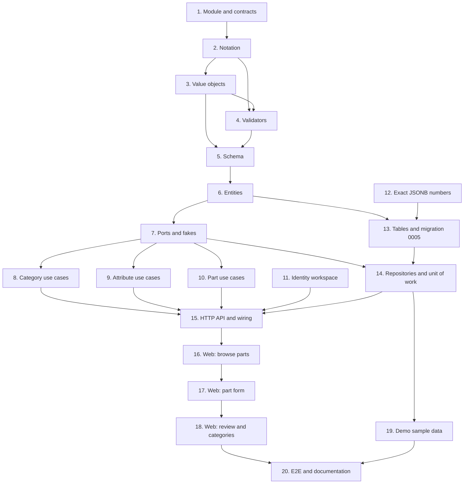

# Implementation Plan

## Overview

Twenty tasks that build the `catalog-foundation` slice described in [design.md](design.md)
and required by [requirements.md](requirements.md): the `catalog` module, engineering
notation, the category tree with inherited attribute schemas, part definitions validated
against those schemas, the first workspace-scoped tables, the HTTP API, the web pages, demo
sample data and the end-to-end journey.

One task, one commit. Every commit has to pass `make check` **on its own**, because `main`
is rebase-merged and each commit lands (AGENTS.md). Suggested Conventional Commit subjects
are in `code` under each task.

Release footer: this spec is the first of four in `v0.3.0`
(`part-pinouts`, `files-and-attachments`, `parametric-search` follow), so **no task here
carries `Release-As: 0.3.0`**. That footer belongs on a changing commit in whichever PR
closes the phase. See the decision in [Notes](#decided-one-pr-per-spec).

## Tasks

- [x] 1. Open the catalog module and its architecture contracts
  - Create `apps/api/src/wiredex/catalog/` with empty `__init__.py` files for the package
    and `domain`, `application`, `infrastructure`, `api`.
  - Add `wiredex.catalog` to `containers` in the layers contract and to `source_modules` in
    the bootstrap contract, in `apps/api/pyproject.toml`.
  - Add `catalog/domain/errors.py`: `CatalogError(ValueError)` and the leaves the design
    lists, one test asserting each is a `CatalogError`.
  - `feat(catalog): open the module and its import contracts`
  - _Requirements: 8.4_

- [x] 2. Engineering notation
  - `catalog/domain/notation.py`: `parse_si(text, unit=None) -> SiValue` and
    `format_si(value, unit=None) -> str` over `Decimal`.
  - `catalog/domain/values.py`: `SiValue`, and the ids as `NewType` over `UUID`.
  - `tests/catalog/test_notation.py`: parametrized over every row of the design's table,
    every rejection (`K`, mismatched unit, garbage), and a `parse ∘ format` round trip.
    Include the exactness case, `parse_si("10k") == parse_si("10000")`.
  - `feat(catalog): parse and format engineering notation`
  - _Requirements: 3.1, 3.2, 3.3, 3.4, 3.5, 3.6, 3.7, 3.8, 3.9, 3.10_

- [ ] 3. Catalog value objects
  - Finish `catalog/domain/values.py`: `CategoryName`, `AttributeKey`, `AttributeLabel`,
    `Unit`, `PartName`, `Manufacturer`, `Mpn` (with `fold()`), `Package`, `AttributeKind`.
  - Frozen slotted dataclasses, validating in `__post_init__`, normalizing through
    `object.__setattr__`, raising `CatalogError` leaves — as `identity/domain/values.py`.
  - `tests/catalog/test_values.py`: trimming, collapsing, caps, the key slug rule, `fold()`.
  - `feat(catalog): add the catalog value objects`
  - _Requirements: 2.4, 4.6_

- [ ] 4. Attribute validators
  - `catalog/domain/validators.py`: the `AttributeValidator` Protocol, `NumberValidator`,
    `EnumValidator`, `TextValidator`, `BoolValidator`, and the `VALIDATORS` mapping.
  - `tests/catalog/test_validators.py`: one accepting and one rejecting case per kind, the
    `"true"` rejection, the enum message listing its options, the unit check.
  - `feat(catalog): validate attribute values by kind`
  - _Requirements: 4.3, 4.4, 4.5, 3.5, 3.6_

- [ ] 5. Attribute definitions and the resolved schema
  - `catalog/domain/schema.py`: `AttributeDefinition`, `AttributeValues`,
    `AttributeSchema.inherited()`, `.validate()`, `.review()`, `AttributeProblem`.
  - `tests/catalog/test_schema.py`: inheritance order, the shadowing refusal, missing
    required, unknown key, and one `review()` case per problem kind.
  - `feat(catalog): resolve attribute schemas along the category chain`
  - _Requirements: 2.1, 2.2, 2.3, 2.7, 5.2, 5.3_

- [ ] 6. Category and part entities
  - `catalog/domain/category.py`: `Category`, `rename`, `move_under`, `MAX_CATEGORY_DEPTH`.
  - `catalog/domain/part.py`: `PartDefinition.define`, `revise`, `reclassify`, `PartDetails`.
  - Mutators return whether anything changed; `now` comes in as an argument.
  - `tests/catalog/test_category.py`, `tests/catalog/test_part.py`: cycles, depth, no-op
    rename and no-op revise.
  - `feat(catalog): add the category and part definition entities`
  - _Requirements: 1.4, 1.5, 1.6, 1.8, 4.9_

- [ ] 7. Ports and in-memory fakes
  - `catalog/application/ports.py`: `Categories`, `AttributeDefinitions`,
    `PartDefinitions`, `CatalogUnitOfWork` (read-only properties), `PartQuery`, `Page`.
  - `tests/support/catalog.py`: `InMemoryCategories`, `InMemoryAttributeDefinitions`,
    `InMemoryPartDefinitions`, `InMemoryCatalog` (counts commits), and a `World` that
    seeds *Passives → Resistors* with a resistance attribute.
  - No production behaviour yet, so the only test is that `World` builds.
  - `feat(catalog): declare the catalog ports`
  - _Requirements: 8.1_

- [ ] 8. Category use cases
  - `catalog/application/categories.py`: `CreateCategory`, `RenameCategory`, `MoveCategory`,
    `DeleteCategory`, `ListCategories`, with `NewCategory` and `CategoryNode`.
  - `type UnitOfWorkFactory = Callable[[WorkspaceId], CatalogUnitOfWork]`.
  - `tests/catalog/test_category_use_cases.py` over the fakes: duplicate sibling names
    including two roots, cycle refusal, depth refusal, delete refusing children and parts,
    and that a no-op rename doesn't commit.
  - `feat(catalog): manage the category tree`
  - _Requirements: 1.1, 1.2, 1.3, 1.7, 1.9, 1.10, 1.11_

- [ ] 9. Attribute use cases
  - `catalog/application/attributes.py`: `DefineAttribute`, `UpdateAttribute`,
    `RemoveAttribute`, `GetCategorySchema`.
  - Key uniqueness is checked against the whole ancestor chain; `key` and `kind` are
    refused on update.
  - `tests/catalog/test_attribute_use_cases.py`: ancestor collision, the immutability
    refusals, removal keeping values.
  - `feat(catalog): define attributes on a category`
  - _Requirements: 2.5, 2.6, 2.8, 2.9, 2.10, 5.1_

- [ ] 10. Part use cases
  - `catalog/application/parts.py`: `DefinePart`, `UpdatePart`, `GetPart`, `ListParts`,
    `DeletePart`, with `NewPart`, `PartView`.
  - `GetPart` returns the part with its problems from `AttributeSchema.review`.
  - `tests/catalog/test_part_use_cases.py`: validation against the resolved schema, the MPN
    conflict, reclassification refusal, a flagged part still readable, an update having to
    fix every problem.
  - `feat(catalog): define and revise part definitions`
  - _Requirements: 4.1, 4.2, 4.8, 4.10, 4.11, 4.12, 5.4, 5.5, 5.6_

- [ ] 11. Identity resolves the caller's workspace
  - Add `workspace_id` to `CurrentUser`; `Authenticate` reads the user's memberships and
    takes the oldest by `created_at`; no membership means the same 401 as no session.
  - Expose it on `/auth/me` (`UserResponse` or a new field on the session payload — pick one
    and keep it additive).
  - Update `tests/identity/test_sessions_use_cases.py` and `test_auth_api.py`; the fakes in
    `tests/support/identity.py` already seed a membership through `with_owner()`.
  - Run `make client`, commit the regenerated `packages/api-client`.
  - `feat(identity): put the caller's workspace on the authenticated user`
  - _Requirements: 6.1, 6.2, 6.3, 8.5_

- [ ] 12. Exact JSONB numbers
  - `bootstrap/database.py`: pass `json_serializer` (a `JSONEncoder` emitting `Decimal`
    unquoted) and `json_deserializer` (`parse_float=Decimal`) to the engine.
  - `tests/integration/test_json_decimal.py`: write `Decimal("1E-7")` into a JSONB column
    through the engine and read back an equal `Decimal`.
  - Do this before the tables, since everything after it assumes exactness.
  - `feat(api): keep JSONB numbers exact with Decimal`
  - _Requirements: 3.4_

- [ ] 13. Tables, mappings and migration 0005
  - `catalog/infrastructure/types.py`: one `TypeDecorator` per value object, each repeating
    `cache_ok = True`.
  - `catalog/infrastructure/orm.py`: `categories`, `attribute_definitions`,
    `part_definitions` on the shared `metadata`, the `_enum()` helper for `kind`, the GIN
    index, the `NULLS NOT DISTINCT` sibling constraint, the partial MPN index, then
    `map_imperatively` for all three.
  - Register it in `bootstrap/orm.py`.
  - `make migration m="catalog"`, then fix the generated `0005_catalog.py` by hand: real
    `downgrade()`, `op.f()` on every constraint, and
    `isolate_by_workspace(op.execute, …)` for each of the three tables.
  - `tests/integration/test_migrations.py` already covers the round trip; confirm it passes.
  - `feat(catalog): add the catalog tables with workspace isolation`
  - _Requirements: 6.5, 8.3_

- [ ] 14. Repositories and the unit of work
  - `catalog/infrastructure/repositories.py`: `SqlCategories` (with the recursive `ancestors`
    CTE), `SqlAttributeDefinitions`, `SqlPartDefinitions` (cursor page, `q` substring,
    `with_mpn` folding case). Every query filters `workspace_id` explicitly — gate one.
  - `catalog/infrastructure/unit_of_work.py`: `SqlCatalogUnitOfWork(SqlUnitOfWork)` binding
    the three repositories in `__aenter__`.
  - `tests/integration/test_catalog_repositories.py`: the ancestor chain in one round trip,
    the partial MPN index, a `Decimal` attribute surviving the round trip, two roots with
    the same name being refused.
  - `tests/integration/test_catalog_isolation.py`: as `wiredex_app`, a part written in
    workspace A is invisible and unwritable from workspace B.
  - `feat(catalog): store the catalog in PostgreSQL`
  - _Requirements: 6.4, 6.5, 8.1, 8.2_

- [ ] 15. HTTP API and wiring
  - `catalog/api/schemas.py`: the request and response models, primitives only, with
    `from_*` classmethods. Response attribute values carry `value`, `display`, `unit`.
  - `catalog/api/router.py`: `CatalogUseCases`, `create_router(use_cases, current_workspace)`,
    handlers as closures in `_add_category_routes`, `_add_attribute_routes`,
    `_add_part_routes`, and the error mapping table from the design.
  - `bootstrap/catalog.py`: build the use cases over
    `lambda workspace_id: SqlCatalogUnitOfWork(session_factory, workspace_id)`.
  - `bootstrap/app.py`: build the `current_workspace` dependency from the identity use
    cases and include the router under `API_PREFIX`.
  - `tests/catalog/test_catalog_api.py`: bare `FastAPI` + fakes, every status code in the
    mapping, both attribute shapes.
  - Run `make client`, commit the regenerated client.
  - `feat(catalog): expose the catalog over HTTP`
  - _Requirements: 1.*, 2.*, 4.*, 6.4, 8.5_

- [ ] 16. Web: browse parts
  - `apps/web/src/features/catalog/catalog.ts`: query hooks, keys, invalidation.
  - `PartsPage.tsx` with the search box and category filter; routes `/parts` and
    `/categories` in `app/router.tsx`; nav entries; drop the parts sentence from the
    dashboard's empty copy.
  - `catalog.*` keys in **both** `en.json` and `pt-BR.json`.
  - `PartsPage.test.tsx` with MSW, querying by role and accessible name.
  - `feat(web): browse the part catalog`
  - _Requirements: 7.1, 7.9, 7.10_

- [ ] 17. Web: the schema-driven part form
  - `AttributeField.tsx` (one field per kind, the notation preview) and `PartForm.tsx`
    (React Hook Form + Zod derived from the fetched schema), used by `/parts/new`.
  - `PartPage.tsx` with the attribute description list, edit and delete.
  - Tests: a field per kind, the preview updating without rewriting the input, a required
    field blocking submission, an API error landing on its field.
  - `feat(web): add and edit parts with schema-driven fields`
  - _Requirements: 7.2, 7.3, 7.4, 7.5_

- [ ] 18. Web: review banner and category management
  - The banner and field marks for a part that needs review.
  - `CategoriesPage.tsx` and `CategorySchemaPanel.tsx`: add, rename, move, delete, plus the
    category's own and inherited attributes, and the in-use refusal shown in place.
  - Tests for both, including the tree being operable by keyboard.
  - `feat(web): manage categories and flag parts needing review`
  - _Requirements: 7.6, 7.7, 7.8, 7.10_

- [ ] 19. Catalog sample data in the demo workspace
  - Extend the demo seeding so `wiredex demo reset` restores sample categories, attribute
    definitions and parts (ADR 0007 asks each module to add its own).
  - `tests/integration/test_demo_cli.py`: after a reset, the demo workspace has its sample
    catalog back, and only in that workspace.
  - `feat(catalog): seed the demo workspace with sample parts`
  - _Requirements: 6.6_

- [ ] 20. End-to-end journey and documentation
  - `e2e/tests/catalog.spec.ts` reusing the logged-in session: create a category, define
    resistance, add a part typing `4k7`, see `4.7k` in the list.
  - Tick the three catalog lines this spec covers in the `README.md` roadmap.
  - Add an "Implementation (v0.3)" section to
    `docs/adr/0005-typed-part-attributes.md` recording flag-don't-drop and the `Decimal`
    serializer.
  - `test(e2e): cover the catalog journey`
  - _Requirements: all, end to end_

## Task Dependency Graph



The same graph as waves. Everything in a wave can be worked in parallel; a wave starts
once every task in the waves above it has landed.

```json
{
  "waves": [
    {
      "wave": 1,
      "tasks": [
        { "id": "1", "name": "Module and contracts", "dependsOn": [] },
        { "id": "11", "name": "Identity workspace", "dependsOn": [] },
        { "id": "12", "name": "Exact JSONB numbers", "dependsOn": [] }
      ]
    },
    {
      "wave": 2,
      "tasks": [{ "id": "2", "name": "Notation", "dependsOn": ["1"] }]
    },
    {
      "wave": 3,
      "tasks": [{ "id": "3", "name": "Value objects", "dependsOn": ["2"] }]
    },
    {
      "wave": 4,
      "tasks": [{ "id": "4", "name": "Validators", "dependsOn": ["2", "3"] }]
    },
    {
      "wave": 5,
      "tasks": [{ "id": "5", "name": "Schema", "dependsOn": ["3", "4"] }]
    },
    {
      "wave": 6,
      "tasks": [{ "id": "6", "name": "Entities", "dependsOn": ["5"] }]
    },
    {
      "wave": 7,
      "tasks": [
        { "id": "7", "name": "Ports and fakes", "dependsOn": ["6"] },
        {
          "id": "13",
          "name": "Tables and migration 0005",
          "dependsOn": ["6", "12"]
        }
      ]
    },
    {
      "wave": 8,
      "tasks": [
        { "id": "8", "name": "Category use cases", "dependsOn": ["7"] },
        { "id": "9", "name": "Attribute use cases", "dependsOn": ["7"] },
        { "id": "10", "name": "Part use cases", "dependsOn": ["7"] },
        {
          "id": "14",
          "name": "Repositories and unit of work",
          "dependsOn": ["7", "13"]
        }
      ]
    },
    {
      "wave": 9,
      "tasks": [
        {
          "id": "15",
          "name": "HTTP API and wiring",
          "dependsOn": ["8", "9", "10", "11", "14"]
        },
        { "id": "19", "name": "Demo sample data", "dependsOn": ["14"] }
      ]
    },
    {
      "wave": 10,
      "tasks": [{ "id": "16", "name": "Web: browse parts", "dependsOn": ["15"] }]
    },
    {
      "wave": 11,
      "tasks": [{ "id": "17", "name": "Web: part form", "dependsOn": ["16"] }]
    },
    {
      "wave": 12,
      "tasks": [
        {
          "id": "18",
          "name": "Web: review and categories",
          "dependsOn": ["17"]
        }
      ]
    },
    {
      "wave": 13,
      "tasks": [
        {
          "id": "20",
          "name": "E2E and documentation",
          "dependsOn": ["18", "19"]
        }
      ]
    }
  ]
}
```

Reading it:

- **Roots.** Only 1, 11 and 12 depend on nothing. 11 touches `identity` and 12 touches
  `bootstrap/database.py`, so neither waits on catalog code; they just have to land before
  the tasks that consume them (15 and 13).
- **Critical path.** 1 → 2 → 3 → 4 → 5 → 6 splits into the application chain
  (7 → 8/9/10) and the persistence chain (13 → 14), which rejoin at 15 and then run
  straight through the web tasks to 20.
- **Parallel.** 8, 9 and 10 are independent once 7 exists, and 19 only needs 14, so it can
  be done any time while the web tasks are in flight.
- **Why these edges.** The domain files build on each other in the order design.md §2 lists
  them: `notation` needs `SiValue`, `validators` need the kinds and `parse_si`, `schema`
  needs the validators, `part.py` needs `AttributeValues`. Ports speak domain types, so
  they wait for the entities. 12 precedes 13 because every table after it assumes exact
  JSONB numbers, and 15 needs `workspace_id` on `CurrentUser` from 11 for its
  `current_workspace` dependency.

## Notes

### Before pushing

- `make check` on every commit, not only the last.
- `make coverage` once, since SQL changed (API floor 90 %, web floor 85 %).
- `make e2e` after task 20.
- `make client` must leave `packages/api-client` unchanged by the end, or CI's contract
  gate fails.

### Decided: one PR per spec

The owner chose four PRs for `v0.3.0`, one per spec (2026-09-25). This spec is the first;
the last spec's PR carries `Release-As: 0.3.0` on a changing commit, and the release PR
waits for it, so production gets the whole catalog at once.
