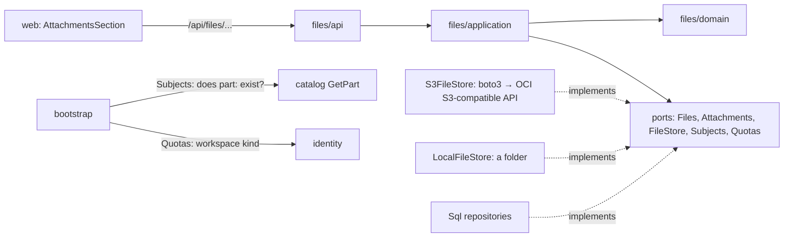

# Design Document: files and attachments

## Overview

The third of four specs in `v0.3.0`. It creates the `files` module that
[docs/architecture.md](../../../docs/architecture.md) plans: *Attachment, content-addressed
by SHA-256; the same bytes are stored once*. Part definitions get datasheets, images and
pinout diagrams now; projects will attach build photos to the same module in `v0.5.0`.

The owner chose **OCI Object Storage** for the bytes (2026-09-25): free up to 20 GB, 50,000
requests and 10 TB of outbound traffic a month in the Always Free tier, and off the small
VM's disk, which holds the system, Docker images and the database. The rows stay in
Postgres, isolated per workspace like every other table.

In scope:

- The `files` module: files, attachments, the file-store port and two adapters (OCI through
  its S3-compatible API, and a local folder for development and tests).
- Upload, list, open, rename, re-kind and remove attachments of a part, over HTTP.
- Migration `0007`, quotas, the nightly prune, demo resets clearing guest uploads.
- Web: the attachments section of the part page, with drag and drop.
- The runbook for the one-time OCI setup, and a new ADR.

Out of scope:

- Project attachments (build photos, Gerbers): `v0.5.0`, on this same module.
- Thumbnails and image resizing: images are shown scaled down by the browser for now.
- Text search inside PDFs, virus scanning, SVG uploads (refused: an SVG can carry script).
- Sample attachments in the demo bench (no binary files in the repository).

## Architecture



Decisions:

**A module of its own, reached through ports.** `files` imports neither `catalog` nor
`identity` (the independence contract enforces it). What it needs from them comes through
two small ports that `bootstrap/` implements: `Subjects.exists(workspace_id, subject)`,
answered by catalog's `GetPart`, and `Quotas.limit_for(workspace_id)`, answered from
identity's workspace kind. No foreign key crosses modules either; a part's deletion leaves
attachments behind for the nightly prune, which asks `Subjects` which subjects still exist.

**The S3-compatible API, through boto3.** Measured on this machine: Oracle's `oci` SDK
installs 270 MB (it would about double the image the VM pulls and Trivy scans), boto3
28 MB. Importing the part of each that is needed costs about the same memory (+7 MB and +14
MB over a bare interpreter). boto3 also lets the adapter be tested against MinIO in a
container, as the repositories are tested against Postgres. The price is a stored secret,
kept small: a **Customer Secret Key of a dedicated OCI user** whose only permission is the
files bucket (runbook, below).

**Content-addressed per workspace.** An object's key is
`workspaces/<workspace_id>/sha256/<hex>`. The same datasheet attached to three parts is one
object; two workspaces never share one, so a demo reset can delete its prefix without
looking at anyone else's files, and whether a file exists in another workspace can't be
probed.

**Bytes first, rows second.** An upload writes the object (idempotent: same key, same
bytes), then the rows in one transaction. A failure between the two leaves an object with
no row, which the nightly prune removes. Removal is the reverse: rows in the transaction,
the object after commit, and again the prune catches what a failure leaves.

**The API serves the bytes.** Content goes through the API rather than a pre-signed bucket
URL, so every read passes the session, the workspace check and the same origin, and the
Content-Security-Policy keeps allowing only `'self'`. It is streamed in chunks, so a 25 MB
PDF never sits in the container's memory whole.

**The type is sniffed, never trusted.** Only PDF, PNG, JPEG and WebP are accepted, decided
from the first bytes. SVG and HTML are refused because a browser would run their scripts
on Wiredex's own origin.

## Components and Interfaces

### Domain

`apps/api/src/wiredex/files/domain/`:

| Value / entity | Rule |
| --- | --- |
| `Sha256` | 64 lower-case hex characters |
| `MediaType` | `StrEnum`: `application/pdf`, `image/png`, `image/jpeg`, `image/webp`; `MediaType.sniff(head: bytes)` decides from the first bytes (`%PDF-`, `\x89PNG\r\n\x1a\n`, `\xff\xd8\xff`, `RIFF….WEBP`) or raises `UnsupportedFileTypeError` |
| `FileSize` | 1 byte to `MAX_FILE_SIZE` = 25 MiB |
| `AttachmentKind` | `StrEnum`: `datasheet`, `image`, `pinout_diagram`, `other`; `AttachmentKind.suggested_for(media_type)` (PDF → datasheet, image → image) for the web |
| `AttachmentTitle` | trimmed, whitespace collapsed, 1–120 characters; `AttachmentTitle.from_filename(name)` strips any path and caps |
| `Subject` | `kind` (`part` for now) + `UUID`; `Subject.parse("part:<uuid>")` and `str()` |
| `StoredFile` | `workspace_id`, `sha256`, `media_type`, `size`, `created_at`; `object_key` property |
| `Attachment` | `id`, `workspace_id`, `subject`, `sha256`, `kind`, `title`, `created_at`; `rename`, `rekind` returning whether anything changed |

`files` declares its own `WorkspaceId`, as `catalog` does, until a third module needs it in
the shared kernel.

### Application

`files/application/ports.py`:

```python
class FileStore(Protocol):
    async def put(self, key: str, data: bytes, media_type: MediaType) -> None: ...
    async def open(self, key: str) -> AsyncIterator[bytes]: ...       # chunks
    async def delete(self, key: str) -> None: ...                      # missing is fine
    async def keys(self, prefix: str) -> AsyncIterator[str]: ...

class Files(Protocol):              # rows, per workspace
    async def get(self, sha256: Sha256) -> StoredFile | None: ...
    async def add(self, file: StoredFile) -> None: ...
    async def remove(self, file: StoredFile) -> None: ...
    async def total_size(self) -> int: ...
    async def unused(self) -> list[StoredFile]: ...                    # no attachment

class Attachments(Protocol):
    async def get(self, attachment_id: AttachmentId) -> Attachment | None: ...
    async def of_subject(self, subject: Subject) -> list[Attachment]: ...
    async def find(self, subject: Subject, sha256: Sha256) -> Attachment | None: ...
    async def add(self, attachment: Attachment) -> None: ...
    async def remove(self, attachment: Attachment) -> None: ...
    async def uses(self, sha256: Sha256) -> int: ...
    async def subjects(self) -> set[Subject]: ...

class Subjects(Protocol):
    async def exists(self, workspace_id: WorkspaceId, subject: Subject) -> bool: ...

class Quotas(Protocol):
    async def limit_for(self, workspace_id: WorkspaceId) -> int: ...  # bytes
```

`FilesUnitOfWork` exposes `files` and `attachments` as read-only properties, per workspace
like `SqlCatalogUnitOfWork`.

`files/application/attachments.py`:

| Use case | Does |
| --- | --- |
| `Attach(workspace_id, subject, upload)` | Checks the subject exists (404), the type (415) and size (413); hashes; checks the quota against what isn't already stored (413); refuses an existing `(subject, sha256)` (409); `put`s the object unless its row exists; adds the rows; commits |
| `ListAttachments(workspace_id, subject)` | Newest first, with each file's media type and size |
| `OpenAttachment(workspace_id, attachment_id)` | The attachment, its file, and a stream of its bytes |
| `ChangeAttachment(workspace_id, attachment_id, title?, kind?)` | Commits only when something changed |
| `Detach(workspace_id, attachment_id)` | Removes the attachment, and the file row when unused; deletes the object after commit |
| `ClearWorkspace(workspace_id)` | Every attachment and file row, then every object under the prefix (demo reset) |
| `PruneOrphans(workspace_ids)` | Attachments whose subject is gone, unused file rows, then objects with no row |

`Upload` is a small command: the bytes (already bounded by the API), the original file
name, an optional title and a kind.

### Adapters

- `files/infrastructure/stores.py`:
  - `S3FileStore(bucket, client)`: a boto3 S3 client created with `endpoint_url`,
    `region_name`, path-style addressing and
    `Config(request_checksum_calculation="when_required", response_checksum_validation="when_required")`,
    because recent boto3 sends checksums OCI's S3-compatible API rejects. Every call runs in
    `asyncio.to_thread`, so the event loop never blocks (requirement 7.3); `open` reads the
    body in 256 KiB chunks.
  - `LocalFileStore(root: Path)`: files under a folder, the default in development
    (`apps/api/.files/`, gitignored) and in the e2e run.
- `files/infrastructure/repositories.py`: `SqlFiles`, `SqlAttachments`, filtering
  `workspace_id` in every statement; `SqlFilesUnitOfWork`.

### HTTP API

`create_router(use_cases, current_workspace)`, prefix `/files`:

| Method | Path | Answers |
| --- | --- | --- |
| GET | `/files/attachments?subject=part:<id>` | `AttachmentResponse[]`, newest first |
| POST | `/files/attachments` | multipart: `subject`, `kind`, optional `title`, `file`; 201 `AttachmentResponse` |
| GET | `/files/attachments/{id}/content` | the bytes, streamed; `?download=1` for a download |
| PATCH | `/files/attachments/{id}` | `title` and/or `kind` |
| DELETE | `/files/attachments/{id}` | 204 |

The upload reads the part at most 25 MiB + 1 byte; one byte over is 413 without reading on
(requirement 2.4). The content response sets `Content-Type`, `Content-Length`,
`Content-Disposition: inline` (or `attachment` with `?download=1`) with an RFC 5987
`filename*`, `ETag: "<sha256>"`, `Cache-Control: private, max-age=31536000, immutable`.
`AttachmentResponse` carries `id`, `subject`, `kind`, `title`, `media_type`, `size`,
`created_at` and `content_url`.

### CLI and bootstrap

- `bootstrap/files.py`: builds the store from settings, the use cases, and the two ports:
  `Subjects` over catalog's `GetPart`, `Quotas` over identity's workspace kind (demo 25 MB,
  personal 5 GB).
- `wiredex files prune`: runs `PruneOrphans` for every workspace; added to the nightly
  service next to `wiredex demo reset`.
- `wiredex demo reset` also runs `ClearWorkspace` on each demo bench, before restoring its
  sample catalog.
- Settings: `WIREDEX_FILE_STORE` (`local` | `s3`, default `local`), `WIREDEX_FILES_DIR`,
  `WIREDEX_FILES_ENDPOINT`, `WIREDEX_FILES_REGION`, `WIREDEX_FILES_BUCKET`,
  `WIREDEX_FILES_ACCESS_KEY`, `WIREDEX_FILES_SECRET_KEY` (a `SecretStr`). In production, a
  store that isn't `s3` or a missing `s3` setting refuses to start (requirement 7.1).

### Web

`apps/web/src/features/files/`:

| File | What |
| --- | --- |
| `attachments.ts` | `useAttachments(subject)`, `useUpload`, `useChangeAttachment`, `useDetach`; an `UploadRefusal` carrying the status and message |
| `AttachmentsSection.tsx` | On the part page: the list (kind, title, size, date, a small preview for images), open in a new tab, download, rename and re-kind in place, remove with a confirmation |
| `DropZone.tsx` | Drag and drop plus a file button, keyboard-reachable; the kind guessed from the type, changeable before upload |
| `sizes.ts` | Byte counts as `1.2 MB`, localized |

The upload is a `FormData` request through the generated client, with the CSRF header like
every write. Strings live under `files.*` in both locale files.

### Operations

- **Caddy**: `request_body { max_size 26MB }` on `/api/files/attachments`, so an oversized
  upload is stopped at the edge. If a browser refuses to show a PDF inline under the site's
  `object-src 'none'`, the content route gets its own policy
  (`default-src 'none'; object-src 'self'; img-src 'self'`); the e2e journey and a check in
  production decide.
- **One-time OCI setup** (the owner, with Claude Code, before the `v0.3.0` release; never
  from a spec task):
  1. Bucket `wiredex-files`: private, Standard tier, object versioning on, a lifecycle rule
     deleting previous versions after 30 days (requirement 7.2).
  2. IAM user `wiredex-files` in group `wiredex-files`, with the policy
     `Allow group wiredex-files to manage objects in tenancy where target.bucket.name = 'wiredex-files'`
     and `Allow group wiredex-files to read buckets in tenancy where target.bucket.name = 'wiredex-files'`.
  3. A Customer Secret Key for that user, written into `/srv/wiredex/api.env` with
     `WIREDEX_FILE_STORE=s3`, the endpoint
     `https://idtgsqumsw81.compat.objectstorage.us-ashburn-1.oraclecloud.com`, the region and
     the bucket.
- **Backups**: the database backup already covers the rows; the objects rely on the
  bucket's durability plus 30 days of versions. The runbook says how to restore a version.

## Data Models

Migration `0007_files.py`:

```
files
  workspace_id uuid not null
  sha256       char(64) not null
  media_type   varchar(32) not null (CHECK: the four types)
  size         integer not null (CHECK: 1 .. 26214400)
  created_at   timestamptz not null
  primary key (workspace_id, sha256)

attachments
  id           uuid primary key
  workspace_id uuid not null (index)
  subject_kind varchar(16) not null (CHECK: part)
  subject_id   uuid not null
  sha256       char(64) not null
  kind         varchar(16) not null (CHECK: datasheet|image|pinout_diagram|other)
  title        varchar(120) not null
  created_at   timestamptz not null
  foreign key (workspace_id, sha256) → files (workspace_id, sha256)   -- RESTRICT
  unique (workspace_id, subject_kind, subject_id, sha256)
  index (workspace_id, subject_kind, subject_id, created_at desc)
```

Both tables end the migration with `isolate_by_workspace(op.execute, "<table>")`. The
composite key keeps an attachment's file in its own workspace, as the pins' key keeps a pin
with its part. No key points at `part_definitions`: modules don't reach into each other's
tables, and the prune covers deleted parts.

Stored object: `workspaces/<workspace_id>/sha256/<hex>`, content type set on upload.

## Correctness Properties

Checked with Hypothesis in the API tests.

### Property 1: Sniffing decides by content alone

For any bytes, `MediaType.sniff` returns the same answer whatever file name or claimed type
accompanies them, and never accepts bytes that begin like SVG, HTML or XML.

**Validates: Requirements 2.1, 2.2, 2.3**

### Property 2: The same bytes are one file

For any sequence of uploads of byte strings to a workspace's parts, the number of stored
objects equals the number of distinct byte strings, and every attachment's file hashes to
its content.

**Validates: Requirements 1.3, 5.2**

### Property 3: A quota is never exceeded

For any sequence of uploads and removals within a workspace, the sum of its stored file
sizes never exceeds its quota, and a refusal happens only when accepting would exceed it.

**Validates: Requirements 2.6, 2.7**

### Property 4: Removing leaves nothing unused behind

For any sequence of attaches and detaches, after the last detach of a file no row and no
object for it remain, and a file still attached elsewhere keeps both.

**Validates: Requirements 4.2**

### Property 5: A title survives any file name

For any file name, `AttachmentTitle.from_filename` gives a non-empty title of at most 120
characters with no path separators, or a refusal for a name with nothing usable in it.

**Validates: Requirements 1.2**

## Error Handling

`FilesError(ValueError)` and its leaves, each mapped by the router, as catalog maps its own:

| Error | Status |
| --- | --- |
| `SubjectNotFoundError`, `AttachmentNotFoundError` | 404 |
| `AlreadyAttachedError` | 409 |
| `FileTooLargeError`, `QuotaExceededError` (message says how much is left) | 413 |
| `UnsupportedFileTypeError` | 415 |
| any other `FilesError` (empty file, bad title, bad subject) | 422 |

A file-store failure (network, credentials) is not a `FilesError`: it answers 503 with "the
file store can't be reached right now", logged with the cause and never with the key. In
the web, `useUpload` turns the status into the refusal's message, and the section keeps its
state.

## Testing Strategy

| Level | Where | Covers |
| --- | --- | --- |
| Unit, domain | `tests/files/test_values.py`, `test_media_type.py` | Every value rule, the four signatures, SVG/HTML/empty refused; properties 1 and 5 |
| Unit, application | `tests/files/test_attachment_use_cases.py` over fakes (`tests/support/files.py`: in-memory repositories and `InMemoryFileStore`) | Attach, dedupe, 409, 404, quota, detach keeping shared files, clear, prune; properties 2–4 |
| Unit, api | `tests/files/test_files_api.py` | Multipart upload, 413 at 25 MiB + 1 without reading on, 415, content headers, `?download=1`, 404; 401 and CSRF in `test_catalog_auth.py`'s style |
| Integration | `tests/integration/test_files_repositories.py` | Rows, the composite key, RLS as `wiredex_app` |
| Integration | `tests/integration/test_s3_file_store.py` | `S3FileStore` against MinIO (`testcontainers[minio]`): put, streamed read, delete, keys by prefix, checksum settings |
| Integration | `test_migrations.py`, `test_demo_cli.py` | `0007` round trip; a reset clearing a guest's uploads and objects |
| Web | `AttachmentsSection.test.tsx`, `DropZone.test.tsx`, `sizes.test.ts` | List, previews, upload by button and by drop, each refusal's message, rename, remove with confirmation |
| E2E | `e2e/tests/attachments.spec.ts` | Upload a small generated PDF and PNG to a part, see them listed, open the PDF inline, download it, remove it (local store) |

After this spec: a new ADR records the storage choice and the measurements behind it; the
README's attachments line is ticked; `docs/architecture.md` §10 question 4 (attachments per
revision) points at this module for `v0.5.0`.
