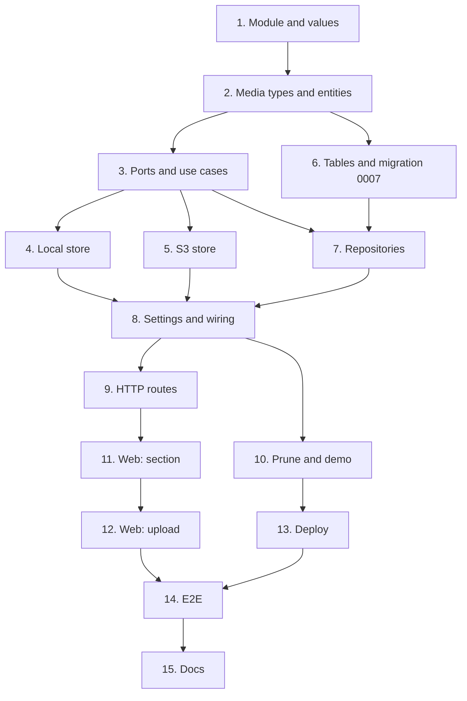

# Implementation Plan

## Overview

Fifteen tasks that build the `files-and-attachments` slice described in
[design.md](design.md) and required by [requirements.md](requirements.md): the `files`
module's domain and use cases, a local and an S3 file store, migration `0007`, the HTTP
routes, quotas and the nightly prune, the web section with drag and drop, the deploy
changes, the end-to-end journey and the ADR.

One task, one commit. Every commit has to pass `make check` **on its own**, because `main`
is rebase-merged and each commit lands (AGENTS.md); run `make coverage` on commits that
touch SQL or the file store, and `make e2e` on commits that touch the web. Tick the task in
this file in the same commit. Suggested Conventional Commit subjects are in `code` under
each task.

This is spec 3 of 4 in `v0.3.0`, so **no commit here carries `Release-As`**, and the release
PR stays unmerged. **The one-time OCI setup (bucket, IAM user, secret key in
`/srv/wiredex/api.env`) is not a task here**: it changes the owner's cloud account and
server, so the owner does it with Claude Code, with explicit approval, before the `v0.3.0`
release (AGENTS.md, Safety). Nothing in these tasks talks to OCI.

## Tasks

- [x] 1. Open the files module and its values
  - `apps/api/src/wiredex/files/` with `domain`, `application`, `infrastructure`, `api`;
    add `wiredex.files` to the layers, bootstrap and independence contracts in
    `apps/api/pyproject.toml`.
  - `files/domain/errors.py`: `FilesError(ValueError)` and the leaves of design.md's Error
    Handling table.
  - `files/domain/values.py`: `WorkspaceId`, `AttachmentId`, `Sha256`, `FileSize`
    (`MAX_FILE_SIZE` = 25 MiB), `AttachmentKind` (with `suggested_for`),
    `AttachmentTitle` (with `from_filename`), `Subject` (`parse`, `str`).
  - `tests/files/test_values.py`: every rule, and property 5 as a Hypothesis test.
  - `feat(files): open the files module and its values`
  - _Requirements: 1.2, 2.4, 2.5_

- [x] 2. Sniffed media types and the entities
  - `MediaType` with `sniff(head)` for PDF, PNG, JPEG and WebP; `StoredFile` (with
    `object_key`) and `Attachment` (`rename`, `rekind` returning whether anything changed).
  - `tests/files/test_media_type.py`: the four signatures, SVG, HTML, XML, a PNG named
    `.pdf`, empty bytes; property 1 as a Hypothesis test.
  - `tests/files/test_entities.py`: object keys under the workspace prefix, no-op renames.
  - `feat(files): sniff file types and add the file and attachment entities`
  - _Requirements: 2.1, 2.2, 2.3, 5.2_

- [x] 3. Ports, fakes and the use cases
  - `files/application/ports.py` as design.md: `FileStore`, `Files`, `Attachments`,
    `Subjects`, `Quotas`, `FilesUnitOfWork`.
  - `tests/support/files.py`: in-memory repositories, `InMemoryFileStore` (counting
    objects), a `World` with a subject that exists and a quota.
  - `files/application/attachments.py`: `Attach`, `ListAttachments`, `OpenAttachment`,
    `ChangeAttachment`, `Detach`, `ClearWorkspace`, `PruneOrphans`, and the `Upload` command.
  - `tests/files/test_attachment_use_cases.py`: every row of the use-case table, and
    properties 2–4 as Hypothesis tests.
  - `feat(files): attach, list, open, change and remove attachments`
  - _Requirements: 1.1, 1.3, 1.4, 1.5, 1.6, 2.6, 3.4, 4.1, 4.2, 4.4, 5.3_

- [~] 4. The local file store
  - `files/infrastructure/stores.py`: `LocalFileStore(root)`, writing atomically (a temporary
    name, then a rename), reading in 256 KiB chunks, `keys` by prefix, deleting a missing
    key quietly.
  - `.gitignore`: `apps/api/.files/`.
  - `tests/files/test_local_file_store.py` with `tmp_path`.
  - `feat(files): store files in a local folder for development`
  - _Requirements: 3.5, 5.2_

- [~] 5. The S3 file store
  - `uv add boto3`; `uv add --dev types-boto3[s3] "testcontainers[minio]"`.
  - `S3FileStore(bucket, client)` and `s3_client(endpoint, region, access_key, secret_key)`
    with path-style addressing and the checksum settings of design.md; every call in
    `asyncio.to_thread`; `open` streaming the body in chunks.
  - `tests/integration/test_s3_file_store.py` against MinIO (pin the image tag): put, a
    streamed read of a multi-chunk object, delete, keys by prefix, a missing key.
  - `feat(files): store files through the S3-compatible API`
  - _Requirements: 3.5, 7.3_

- [-] 6. The tables and migration 0007
  - `files/infrastructure/orm.py`: `files` and `attachments` as design.md's Data Models,
    mapped imperatively; register it in `bootstrap/orm.py`.
  - `make migration m="files"`, then fix `0007_files.py` by hand: the CHECK constraints, the
    composite key, the ordering index, `isolate_by_workspace` for both tables, a working
    `downgrade`.
  - `test_migrations.py` covers the round trip; `wiredex db check` reports no drift.
  - `feat(files): add the files and attachments tables`
  - _Requirements: 5.1, 7.4_

- [~] 7. Repositories and the unit of work
  - `SqlFiles`, `SqlAttachments`, `SqlFilesUnitOfWork`, filtering `workspace_id` in every
    statement.
  - `tests/integration/test_files_repositories.py`: rows round trip, newest first, `uses`,
    `unused`, `total_size`, the composite key refusing a file of another workspace.
  - `tests/integration/test_files_isolation.py`: as `wiredex_app`, workspace B can't read or
    write A's files or attachments.
  - `feat(files): store files and attachments in PostgreSQL`
  - _Requirements: 1.6, 5.1_

- [~] 8. Settings and wiring
  - `uv add python-multipart` (FastAPI's form and file parsing).
  - `bootstrap/settings.py`: the `WIREDEX_FILE_STORE` and `WIREDEX_FILES_*` settings of
    design.md; production refuses to start unless the store is `s3` and fully set.
  - `bootstrap/files.py`: the store from settings; `Subjects` over catalog's `GetPart`;
    `Quotas` over identity's workspace kind (demo 25 MB, personal 5 GB); the use cases.
  - `.env.example`: the local defaults, commented.
  - `tests/bootstrap/test_files_settings.py`: the production refusal, local by default.
  - `feat(files): configure and wire the file store`
  - _Requirements: 2.7, 7.1_

- [~] 9. HTTP routes
  - `files/api/schemas.py` and `files/api/router.py`: the five routes of design.md; the
    upload bounded at 25 MiB + 1 byte; the content response streamed with its headers;
    the error table, and 503 for a store failure.
  - `bootstrap/app.py`: include the router with the `current_workspace` dependency.
  - `tests/files/test_files_api.py`; add the upload, change and remove routes to
    `tests/catalog/test_catalog_auth.py` (401 without a session, 403 without CSRF).
  - `make client`, commit the regenerated client.
  - `feat(files): expose attachments over HTTP`
  - _Requirements: 1.1, 1.4, 1.5, 2.3, 2.4, 2.6, 3.1, 3.2, 3.3, 3.4, 3.5, 4.1, 4.2, 7.5_

- [~] 10. Prune and demo resets
  - `wiredex files prune` (every workspace); `wiredex demo reset` runs `ClearWorkspace` on each
    demo bench before restoring its sample catalog.
  - `tests/integration/test_files_cli.py`: a deleted part's attachments pruned, unused rows
    and stray objects removed; `test_demo_cli.py`: a reset clearing a guest's uploads and
    objects, the owner's untouched (local store in a temporary folder).
  - `feat(files): prune orphaned files nightly and clear demo uploads`
  - _Requirements: 4.3, 4.4, 5.3_

- [~] 11. Web: the attachments section
  - `features/files/attachments.ts` and `sizes.ts`; `AttachmentsSection.tsx` on `PartPage`:
    the list, image previews, open in a new tab, download, rename and re-kind in place,
    remove with a confirmation.
  - `files.*` strings in both locale files.
  - `AttachmentsSection.test.tsx` and `sizes.test.ts` with MSW.
  - `feat(web): show a part's attachments`
  - _Requirements: 6.1, 6.4, 6.5, 6.6_

- [~] 12. Web: uploading
  - `DropZone.tsx`: drop and file button, keyboard-reachable, the kind suggested from the
    type and changeable; `useUpload` sending `FormData` with the CSRF header; each refusal's
    message shown in place.
  - `DropZone.test.tsx`: upload by button and by drop, 413, 415, 409, quota.
  - `feat(web): upload attachments by dropping or picking a file`
  - _Requirements: 6.2, 6.3, 6.6_

- [~] 13. Deploy
  - `deploy/wiredex.caddy`: `request_body { max_size 26MB }` for `/api/files/attachments`.
  - `deploy/server-setup.sh`: the nightly service also runs `wiredex files prune` (a second
    `ExecStart`).
  - `deploy/README.md`: a "File storage" section: the one-time OCI setup of design.md's
    Operations, the `api.env` settings, restoring a previous object version, and the quota.
  - `feat(deploy): limit uploads at the edge and prune files nightly`
  - _Requirements: 2.4, 4.4, 5.4, 7.2_

- [~] 14. End-to-end journey
  - `e2e/tests/attachments.spec.ts`, on the local store: generate a tiny PDF and PNG in the
    test, upload both to a new part, see them listed with an image preview, open the PDF in
    a new tab (inline), download it, remove the PNG after confirming.
  - `test(e2e): cover uploading, opening and removing attachments`
  - _Requirements: all, end to end_

- [~] 15. Documentation
  - `docs/adr/0013-file-storage.md`: OCI Object Storage through the S3-compatible API, the
    measurements behind boto3, the dedicated key, per-workspace content addressing,
    versioning instead of restic for objects.
  - `README.md`: tick "Attachments: datasheets, images, pinout diagrams".
  - `docs/architecture.md` §10: question 4 answered for parts, projects follow in `v0.5.0`.
  - `docs: record how files are stored`
  - _Requirements: none (documentation)_

## Task Dependency Graph



The same graph as waves: every task in a wave can be worked once the waves above it have
landed.

```json
{
  "waves": [
    { "wave": 1, "tasks": [{ "id": "1", "name": "Module and values", "dependsOn": [] }] },
    { "wave": 2, "tasks": [{ "id": "2", "name": "Media types and entities", "dependsOn": ["1"] }] },
    {
      "wave": 3,
      "tasks": [
        { "id": "3", "name": "Ports and use cases", "dependsOn": ["2"] },
        { "id": "6", "name": "Tables and migration 0007", "dependsOn": ["2"] }
      ]
    },
    {
      "wave": 4,
      "tasks": [
        { "id": "4", "name": "Local store", "dependsOn": ["3"] },
        { "id": "5", "name": "S3 store", "dependsOn": ["3"] },
        { "id": "7", "name": "Repositories", "dependsOn": ["3", "6"] }
      ]
    },
    { "wave": 5, "tasks": [{ "id": "8", "name": "Settings and wiring", "dependsOn": ["4", "5", "7"] }] },
    {
      "wave": 6,
      "tasks": [
        { "id": "9", "name": "HTTP routes", "dependsOn": ["8"] },
        { "id": "10", "name": "Prune and demo", "dependsOn": ["8"] }
      ]
    },
    {
      "wave": 7,
      "tasks": [
        { "id": "11", "name": "Web: section", "dependsOn": ["9"] },
        { "id": "13", "name": "Deploy", "dependsOn": ["10"] }
      ]
    },
    { "wave": 8, "tasks": [{ "id": "12", "name": "Web: upload", "dependsOn": ["11"] }] },
    { "wave": 9, "tasks": [{ "id": "14", "name": "E2E", "dependsOn": ["12", "13"] }] },
    { "wave": 10, "tasks": [{ "id": "15", "name": "Docs", "dependsOn": ["14"] }] }
  ]
}
```

## Notes

### Before pushing

- `make check` on every commit, not only the last; `make coverage` once SQL or the file
  store changed (MinIO needs Docker, like Postgres).
- `make e2e` after task 14.
- `make client` must leave `packages/api-client` unchanged by the end, or CI's contract gate
  fails.
- Open one PR for this spec with auto-merge (`gh pr merge N --rebase --auto`); don't merge
  the release PR.

### After merging, before the `v0.3.0` release

- The owner and Claude Code do the one-time OCI setup (design.md, Operations) and add the
  file-store settings to `/srv/wiredex/api.env`, with the owner's explicit approval. Until
  then a production deploy would refuse to start, by design (requirement 7.1).
- `wiredex-demo-reset.service` gets the prune line from `server-setup.sh` when it is re-run
  (also owner-approved).
- After the release, open a PDF on wiredex.vinilabs.cc: if the browser refuses to show it
  inline under the site's Content-Security-Policy, give the content route its own policy
  (design.md, Operations).
