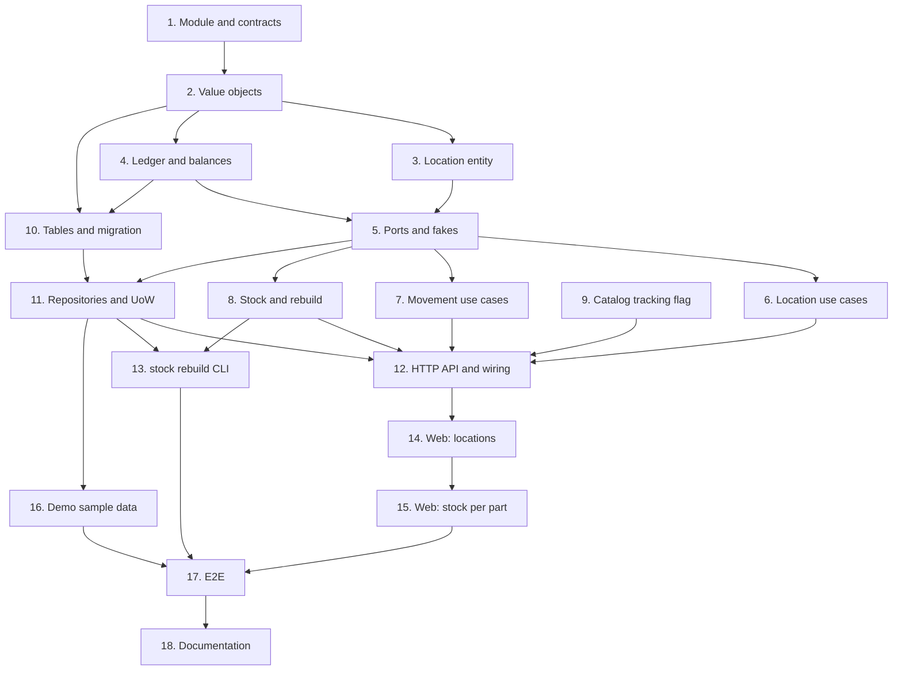

# Implementation Plan

## Overview

Eighteen tasks that build the `inventory-stock` slice described in [design.md](design.md)
and required by [requirements.md](requirements.md): the `inventory` module, the location
tree with short codes, stock lots, the append-only movement ledger (receive, adjust, move),
the balance projection written in the same transaction, `wiredex stock rebuild`, the second
workspace-scoped tables, the catalog `tracked_individually` flag it needs, the HTTP API, the
web pages, demo sample data and the end-to-end journey.

One task, one commit. Every commit has to pass `make check` **on its own**, because `main`
is rebase-merged and each commit lands (AGENTS.md); run `make coverage` on commits that touch
SQL, and `make e2e` on commits that touch the web. Tick the task in this file in the same
commit. Suggested Conventional Commit subjects are in `code` under each task.

Release footer: this spec is **the first of three** in `v0.4.0` (`tracked-units` and
`quick-add-and-import` follow), so **no task here carries `Release-As: 0.4.0`**. That footer
belongs on a changing commit in the last spec's PR. See [Notes](#decided-one-pr-per-spec).

## Tasks

- [x] 1. Open the inventory module and its architecture contracts
  - Create `apps/api/src/wiredex/inventory/` with empty `__init__.py` files for the package
    and `domain`, `application`, `infrastructure`, `api`.
  - Add `wiredex.inventory` to `containers` in the layers contract and to `source_modules`
    in the bootstrap contract, in `apps/api/pyproject.toml`. Confirm the independence
    contract already forbids `inventory → catalog` and `inventory → identity`; add it if not.
  - Add `inventory/domain/errors.py`: `InventoryError(ValueError)` and the leaves the design
    lists, with `tests/inventory/test_errors.py` asserting each is an `InventoryError`.
  - `feat(inventory): open the module and its import contracts`
  - _Requirements: 10.4_

- [x] 2. Inventory value objects
  - `inventory/domain/values.py`: the ids as `NewType` over `UUID`, `WorkspaceId`, `PartId`,
    `LocationName`, `ShortCode` (with `for_location`/`for_unit` and the rollover), `Quantity`
    (the `>= 0` floor), `MovementKind` (all seven ADR 0002 names), `MovementReason`, `Note`.
  - Frozen slotted dataclasses validating in `__post_init__`, as `catalog/domain/values.py`.
  - `inventory/domain/quantity.py` if `Quantity` grows past `values.py`'s size cap.
  - `tests/inventory/test_values.py`: trimming and caps, the code format and five-digit
    rollover, the quantity floor, the reason vocabulary.
  - `feat(inventory): add the inventory value objects`
  - _Requirements: 2.1, 2.4, 3.6, 4.4_

- [x] 3. The location entity
  - `inventory/domain/location.py`: `Location`, `rename`, `move_under`, `MAX_LOCATION_DEPTH`,
    `CircularLocationError`, mirroring `Category`.
  - `tests/inventory/test_location.py`: depth cap, cycle refusal (self and descendant),
    no-op rename returning `False`, code left untouched by rename and move.
  - `feat(inventory): add the location tree entity`
  - _Requirements: 1.4, 1.5, 1.6, 1.8, 1.9_

- [x] 4. The ledger and balances
  - `inventory/domain/ledger.py`: `StockMovement`, `MovementGroup`, `Balances.rebuilt_from`.
  - `inventory/domain/lot.py`: `StockLot`, `StockBalance` with `available`, `apply`,
    `NegativeStockError`, `ReservationError`.
  - `tests/inventory/test_ledger.py`, `tests/inventory/test_balances.py`: `apply` moving
    `on_hand`, the floor, the `reserved <= on_hand` guard, `Balances.rebuilt_from` folding a
    ledger. **Properties 1–4** as Hypothesis tests over generated movement sequences.
  - `feat(inventory): model the stock ledger and balance projection`
  - _Requirements: 3.3, 3.4, 3.5, 3.6, 3.7, 4.5, 4.6, 4.10, 5.1_

- [x] 5. Ports and in-memory fakes
  - `inventory/application/ports.py`: `Locations`, `Lots`, `Ledger`, `BalanceSheet`,
    `ShortCodes`, `Parts` (`PartStockInfo`), `InventoryUnitOfWork` (read-only properties),
    and the command/result dataclasses.
  - `tests/support/inventory.py`: in-memory repositories, an `InMemoryShortCodes`, a fake
    `Parts` seeded with a lot-counted and a unit-tracked part, `InMemoryInventory` (counts
    commits), and a `World` seeding a *Lab → Drawer 3* location.
  - Only test: `World` builds and the fake `Parts` answers both kinds.
  - `feat(inventory): declare the inventory ports`
  - _Requirements: 10.4_

- [x] 6. Location use cases
  - `inventory/application/locations.py`: `CreateLocation`, `RenameLocation`, `MoveLocation`,
    `DeleteLocation`, `ListLocations`, with `NewLocation`, `LocationNode`; the create mints a
    code through `ShortCodes.next(location)`.
  - `type UnitOfWorkFactory = Callable[[WorkspaceId], InventoryUnitOfWork]`.
  - `tests/inventory/test_location_use_cases.py`: duplicate siblings incl. two roots, cycle,
    depth, delete refusing children and lots, no-op rename not committing, one code per
    create.
  - `feat(inventory): manage the location tree`
  - _Requirements: 1.1, 1.2, 1.3, 1.7, 1.10, 1.11, 1.12, 2.6_

- [x] 7. Movement use cases
  - `inventory/application/movements.py`: `ReceiveStock`, `AdjustStock`, `MoveStock`, with
    `Receipt`, `Adjustment`, `Move`.
  - Receive checks `Parts.describe` (404 absent, 422 `ReceiveAsUnitsError` if unit-tracked),
    finds or creates the lot, appends `RECEIVE`, updates the balance. Adjust takes an absolute
    counted quantity and stores the signed delta. Move writes two `move_group` rows and
    updates both balances in one transaction, refusing an insufficient source (409) and the
    same location (422).
  - `tests/inventory/test_movement_use_cases.py`: each of the above; **property 5** (adjust
    reaches the counted quantity, stored change equals the delta) as a Hypothesis test.
  - `feat(inventory): receive, adjust and move stock`
  - _Requirements: 3.1, 3.2, 4.1, 4.2, 4.3, 4.7, 4.8, 4.9, 4.11, 6.3_

- [x] 8. Stock queries and rebuild
  - `inventory/application/stock.py`: `PartStock` (total and per-location breakdown, zero for
    a never-received part) and `RebuildBalances` (stream the ledger, fold with
    `Balances.rebuilt_from`, `replace_all`, one transaction per workspace).
  - `tests/inventory/test_stock_use_cases.py`: total and breakdown, the empty case,
    **property 6** (rebuild reproduces the incremental projection) as a Hypothesis test.
  - `feat(inventory): total stock per part and rebuild balances from the ledger`
  - _Requirements: 5.2, 5.3, 7.3, 7.4_

- [x] 9. Catalog gains the tracked-individually flag
  - `catalog`: add nullable `tracked_individually` to `Category`, resolve it along the
    existing `ancestors` chain (nearest set value wins, default `False`), expose it and
    `tracked_individually_resolved` on the category responses, and let `PATCH
    /catalog/categories/{id}` set or clear it.
  - Migration `0009_category_tracking.py`: add the column, a real `downgrade`; declare it in
    `catalog/infrastructure/orm.py` so `wiredex db check` sees no drift.
  - Tests: resolution along the chain in `tests/catalog/test_category.py` and
    `tests/integration/test_catalog_repositories.py`; the API field and PATCH in
    `tests/catalog/test_catalog_api.py`.
  - Run `make client`, commit the regenerated client.
  - `feat(catalog): mark categories as tracked individually`
  - _Requirements: 6.1, 6.2, 6.4, 10.5_

- [x] 10. Tables, mappings and the inventory migration
  - `inventory/infrastructure/types.py`: one `TypeDecorator` per value object, `cache_ok`.
  - `inventory/infrastructure/orm.py`: `locations` (trigram code index, `NULLS NOT DISTINCT`
    sibling constraint, unique code), `short_code_counters`, `stock_lots`, `stock_movements`
    (seven-name `kind` CHECK), `stock_balances` (the `on_hand`/`reserved`/`available`
    CHECKs, `version`), then `map_imperatively` for each.
  - Register it in `bootstrap/orm.py`.
  - `make migration m="inventory"`, then fix `0010_inventory.py` by hand: `CREATE EXTENSION
    IF NOT EXISTS pg_trgm` (already present from search; keep it idempotent), a real
    `downgrade`, `op.f()` on every constraint, and `isolate_by_workspace(op.execute, …)` for
    all five tables.
  - `tests/integration/test_migrations.py` already covers the round trip; confirm it passes.
  - `feat(inventory): add the inventory tables with workspace isolation`
  - _Requirements: 3.3, 3.7, 8.4, 10.3_

- [x] 11. Repositories and the unit of work
  - `inventory/infrastructure/repositories.py`: `SqlLocations` (recursive `ancestors` CTE,
    trigram code search, `has_lots`), `SqlLots`, `SqlLedger` (append/movements_of/all,
    ordered), `SqlBalanceSheet` (optimistic `put` on `version`, `totals_by_part` in one
    grouped query, `by_part`, `replace_all`), `SqlShortCodes` (the `ON CONFLICT ... RETURNING`
    counter). Every query filters `workspace_id` — gate one.
  - `inventory/infrastructure/unit_of_work.py`: `SqlInventoryUnitOfWork(SqlUnitOfWork)`
    binding the repositories in `__aenter__`.
  - `tests/integration/test_inventory_repositories.py`: the ancestor chain in one round trip,
    the code trigram search, the `available`/`reserved` CHECKs rejecting a bad row, the
    `version` retry, per-part totals in one query.
  - `tests/integration/test_short_codes.py`: concurrent `next()` in one workspace hands out
    distinct gap-free integers; two workspaces number independently.
  - `tests/integration/test_inventory_isolation.py`: as `wiredex_app`, a lot/location/movement
    in workspace A is invisible and unwritable from B, and B can't touch A's counter.
  - `feat(inventory): store inventory in PostgreSQL`
  - _Requirements: 2.2, 2.3, 2.5, 5.5, 8.3, 8.4, 8.5, 10.1, 10.2_

- [x] 12. HTTP API and wiring
  - `inventory/api/schemas.py`: request and response models, primitives only, with `from_*`
    classmethods; movement responses carry the resulting balance(s).
  - `inventory/api/router.py`: `InventoryUseCases`, `create_router(use_cases,
    current_workspace)`, handlers as closures in `_add_location_routes`, `_add_movement_routes`,
    `_add_stock_routes`, and the error mapping from the design; the stock route accepts a
    batch of `part_id`s for the list.
  - `bootstrap/inventory.py`: build the use cases over
    `lambda workspace_id: SqlInventoryUnitOfWork(session_factory, workspace_id)`, and the
    `Parts` port over catalog's `GetPart` plus the resolved flag (the files-style pattern).
  - `bootstrap/app.py`: include the router under `API_PREFIX` with the `current_workspace`
    dependency.
  - `tests/inventory/test_inventory_api.py`: bare `FastAPI` + fakes, every status in the
    mapping, balances in movement responses; `tests/inventory/test_inventory_auth.py`: 401
    without a session, 403 without CSRF on the POSTs.
  - Run `make client`, commit the regenerated client.
  - `feat(inventory): expose inventory over HTTP`
  - _Requirements: 4.1, 4.2, 4.3, 4.7, 4.8, 6.3, 7.1, 7.2, 8.1, 8.2, 8.3, 10.5_

- [x] 13. `wiredex stock rebuild`
  - `bootstrap/inventory.py`: a `rebuild_balances_use_case` context manager over its own
    engine, per the files prune/clear pattern.
  - `bootstrap/cli.py`: a `stock` group with a `rebuild` command that runs `RebuildBalances`
    for every workspace (reusing the workspace listing identity already exposes to the CLI).
  - `tests/integration/test_stock_cli.py`: after tampering with a balance row, `rebuild`
    restores it from the ledger; runs per workspace under isolation.
  - `feat(inventory): rebuild stock balances from the CLI`
  - _Requirements: 5.2, 5.3_

- [~] 14. Web: locations
  - `apps/web/src/features/inventory/inventory.ts`: query hooks, keys, invalidation.
  - `LocationsPage.tsx` and `LocationTree.tsx`: the tree with codes, add, rename, move,
    delete, the in-use refusal shown in place, keyboard-operable; route `/locations` in
    `app/router.tsx`; nav entry; drop the inventory sentence from the dashboard empty copy.
  - `inventory.*` keys in **both** `en.json` and `pt-BR.json`.
  - `LocationsPage.test.tsx`, `LocationTree.test.tsx` with MSW, by role and accessible name.
  - `feat(web): manage storage locations`
  - _Requirements: 9.1, 9.2, 9.7, 9.8_

- [~] 15. Web: stock on the parts pages, and the tracking control
  - `StockByPart.tsx` on the part page (total and per-location breakdown) with the
    `ReceiveDialog`, `AdjustDialog` (absolute count + reason) and `MoveDialog`, invalidating
    both the inventory and catalog queries; a stock column on the parts list fed by the batch
    totals route; the tri-state *Tracked individually* control on the category form.
  - Tests: stock shown and updated in place, the adjust dialog asking for an absolute count,
    the move dialog between two locations, the tri-state control and its resolved display.
  - `feat(web): show and change stock per part`
  - _Requirements: 7.1, 9.3, 9.4, 9.5, 9.6_

- [x] 16. Inventory sample data in the demo workspace
  - Extend the demo seeding so `wiredex demo reset` restores sample locations and some
    received stock, after catalog's parts are restored (stock points at parts).
  - `tests/integration/test_demo_cli.py`: after a reset, the demo workspace has its sample
    locations and stock back, and only in that workspace.
  - `feat(inventory): seed the demo workspace with sample stock`
  - _Requirements: 8.6_

- [~] 17. End-to-end journey
  - `e2e/tests/inventory.spec.ts` reusing the logged-in session: create a location, receive
    100 of a part into it, see 100 on the parts page, move 40 to a second location, see the
    split, adjust one lot to a recount and see the total change.
  - `test(e2e): cover the inventory journey`
  - _Requirements: all, end to end_

- [~] 18. Documentation
  - `docs/adr/0002-stock-ledger.md`: an "Implementation (v0.4)" section recording the two-row
    MOVE with a `move_group`, the absolute-count ADJUST stored as a delta, `reserved` staying
    zero until `v0.5.0`, and `wiredex stock rebuild`.
  - `docs/adr/0007-workspace-isolation.md`: add the five inventory tables to the isolated
    list.
  - `README.md` roadmap: tick "Stock lots and the movement ledger (receive, adjust, move)"
    and "Balances projection and `wiredex stock rebuild`", and change the line "Location tree
    and QR label sheet generation" to "Location tree with human-readable short codes"
    (decision 3: no QR labels).
  - `docs`: no `Release-As` here — this is the first of three specs in `v0.4.0`.
  - `docs(inventory): record the ledger implementation and short codes`
  - _Requirements: none (documentation)_

## Task Dependency Graph



The same graph as waves. Everything in a wave can be worked in parallel; a wave starts once
every task in the waves above it has landed.

```json
{
  "waves": [
    {
      "wave": 1,
      "tasks": [
        { "id": "1", "name": "Module and contracts", "dependsOn": [] },
        { "id": "9", "name": "Catalog tracking flag", "dependsOn": [] }
      ]
    },
    {
      "wave": 2,
      "tasks": [{ "id": "2", "name": "Value objects", "dependsOn": ["1"] }]
    },
    {
      "wave": 3,
      "tasks": [
        { "id": "3", "name": "Location entity", "dependsOn": ["2"] },
        { "id": "4", "name": "Ledger and balances", "dependsOn": ["2"] }
      ]
    },
    {
      "wave": 4,
      "tasks": [
        { "id": "5", "name": "Ports and fakes", "dependsOn": ["3", "4"] },
        { "id": "10", "name": "Tables and migration", "dependsOn": ["2", "4"] }
      ]
    },
    {
      "wave": 5,
      "tasks": [
        { "id": "6", "name": "Location use cases", "dependsOn": ["5"] },
        { "id": "7", "name": "Movement use cases", "dependsOn": ["5"] },
        { "id": "8", "name": "Stock and rebuild", "dependsOn": ["5"] },
        { "id": "11", "name": "Repositories and UoW", "dependsOn": ["5", "10"] }
      ]
    },
    {
      "wave": 6,
      "tasks": [
        {
          "id": "12",
          "name": "HTTP API and wiring",
          "dependsOn": ["6", "7", "8", "9", "11"]
        },
        { "id": "13", "name": "stock rebuild CLI", "dependsOn": ["8", "11"] },
        { "id": "16", "name": "Demo sample data", "dependsOn": ["11"] }
      ]
    },
    {
      "wave": 7,
      "tasks": [{ "id": "14", "name": "Web: locations", "dependsOn": ["12"] }]
    },
    {
      "wave": 8,
      "tasks": [{ "id": "15", "name": "Web: stock per part", "dependsOn": ["14"] }]
    },
    {
      "wave": 9,
      "tasks": [
        { "id": "17", "name": "E2E", "dependsOn": ["15", "16", "13"] }
      ]
    },
    {
      "wave": 10,
      "tasks": [{ "id": "18", "name": "Documentation", "dependsOn": ["17"] }]
    }
  ]
}
```

Reading it:

- **Roots.** Only 1 and 9 depend on nothing. 9 touches `catalog` (a column, its resolution,
  its API field), so it doesn't wait on inventory code; it just has to land before 12, which
  wires the `Parts` port over the resolved flag.
- **Critical path.** 1 → 2 splits into the domain entities (3, 4), which rejoin at 5 (ports)
  and 10 (tables). The application chain (6, 7, 8) and the persistence chain (11) rejoin at
  12, then run through the web tasks to 17 and the docs at 18.
- **Parallel.** 6, 7, 8 are independent once 5 exists; 16 only needs 11; 13 needs 8 and 11.
- **Why these edges.** The domain files build in the order design.md §2 lists: values first,
  then the location entity and the ledger/balances, then ports that speak those types. 10
  needs the balances' shape for its CHECKs; 12 needs `workspace_id` resolution (already on
  `CurrentUser` from catalog) and the `Parts` port from 9.

## Notes

### Before pushing

- `make check` on every commit, not only the last.
- `make coverage` on commits touching SQL (10, 11, 13, 16): API floor 90 %, web floor 85 %.
- `make e2e` after task 17.
- `make client` must leave `packages/api-client` unchanged by the end (regenerated in 9 and
  12), or CI's contract gate fails.

### Decided: one PR per spec

The owner chose one PR per spec for `v0.4.0` (2026-09-26), as for `v0.3.0`. This spec is the
first of three; open its PR with auto-merge (`gh pr merge N --rebase --auto`). The
`Release-As: 0.4.0` footer and the release PR belong to the last spec
(`quick-add-and-import`), so production gets the whole Inventory phase at once. Never merge
the release PR (AGENTS.md, Safety) — the owner does.
