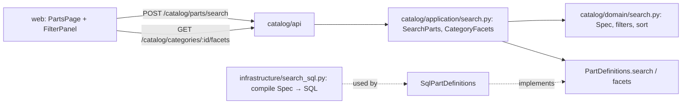

# Design Document: parametric search

## Overview

The last of four specs in `v0.3.0`. The part list, today a name-substring filter over one
category, becomes a parametric search: text across the part's identifying fields, a
category with its subcategories, typed attribute filters, a pin filter, sorting (by an
attribute too), cursor paging and facet counts. [docs/architecture.md](../../../docs/architecture.md)
already names the pattern, **Specification**: "composable filters that compile to SQL".

The owner chose (2026-09-25) to keep search **inside the catalog pages**. The `Ctrl K`
palette and global search stay in `v0.8.0`. This also answers `docs/architecture.md` §10
question 6: Postgres, with `pg_trgm` for text, is enough; no search engine.

In scope:

- The search specification in the catalog domain, its validation against a category's
  resolved schema, and its compilation to SQL.
- `POST /api/catalog/parts/search` and `GET /api/catalog/categories/{id}/facets`.
- Migration `0008`: `pg_trgm` and trigram indexes.
- Web: the parts page as a search, with its state in the address.
- The `Release-As: 0.3.0` footer on the last commit.

Out of scope:

- The global palette and searching projects, stock or firmware (`v0.8.0`, and later
  modules).
- Full-text search inside attachments.
- Saved searches.
- Filtering by stock levels (`v0.4.0` has no stock yet).

## Architecture



Decisions:

**A specification in the domain, compiled in the infrastructure.** The domain holds plain
filter objects that know how to evaluate one part (`matches`), which the in-memory fakes
use. The infrastructure turns the same objects into SQLAlchemy clauses, one function per
filter type. Domain code stays free of SQLAlchemy (import-linter), and a new filter is a new
class plus a new compile case.

**Filters are validated against the resolved schema, in the application.** A filter names an
attribute key; only the chosen category's resolved schema says whether it exists and what
kind it is. `SearchParts` loads that schema once and turns the request's raw filters into
typed ones, parsing range bounds with the attribute's unit through `parse_si`, so `4k7`
means 4700 here exactly as it does on a part. Attribute filters without a category are
refused.

**Search is a POST with a typed body.** A filter list is structured data, and the generated
client then types it end to end. The web keeps the search in the address itself (TanStack
Router search params) and sends the body. `GET /catalog/parts` stays as it is, for simple
listing and the mobile app later.

**Keyset paging with an opaque cursor that remembers the search.** The cursor is a
base64url token of `{sort, direction, last sort value, last id, search fingerprint}`. The
fingerprint is a hash of the normalized search, so a cursor replayed against a different
search is refused (requirement 4.4) instead of returning a confusing page. Ties on the sort
value are broken by id, so nothing repeats or goes missing.

**Wrong-kind values are simply not matched.** After a schema change a part may hold text
where a number is expected (flag, don't drop). Every numeric comparison is guarded by
`jsonb_typeof(...) = 'number'`, so such a part drops out of that filter instead of making the
query fail.

**Facets ignore the attribute filters.** Counting options with the other attribute filters
applied would hide options as the owner narrows (classic facet exclusion). The simpler rule
of counting over category, text and pin only keeps every option visible and costs one query.

## Components and Interfaces

### Domain

`apps/api/src/wiredex/catalog/domain/search.py`:

```python
class Spec(Protocol):
    def matches(self, part: PartDefinition, pins: Pinout) -> bool: ...

@dataclass(frozen=True, slots=True)
class TextContains:               # name, manufacturer, MPN or package, case-insensitive
    text: SearchText

@dataclass(frozen=True, slots=True)
class InCategories:               # the chosen category, and its descendants unless exact
    category_ids: frozenset[CategoryId]

@dataclass(frozen=True, slots=True)
class NumberBetween:
    key: AttributeKey
    minimum: SiValue | None
    maximum: SiValue | None       # at least one; minimum <= maximum

@dataclass(frozen=True, slots=True)
class OneOf:
    key: AttributeKey
    options: frozenset[str]       # non-empty

@dataclass(frozen=True, slots=True)
class IsBool:
    key: AttributeKey
    value: bool

@dataclass(frozen=True, slots=True)
class TextAttributeContains:
    key: AttributeKey
    text: SearchText

@dataclass(frozen=True, slots=True)
class HasPin:                     # label or alternate function, case-insensitive
    name: SearchText

@dataclass(frozen=True, slots=True)
class AllOf:
    specs: tuple[Spec, ...]       # an empty AllOf matches every part
```

`SearchText` is a value object: trimmed, whitespace collapsed, 1–80 characters.
`matches` for a number reads the value only when it is an `SiValue`, and so leaves wrong-kind
values out (requirement 2.7).

`PartSort` is `newest`, `name` or `attribute(key)`, with a `direction`. `SearchCursor` holds
the last sort value, the last id and the search fingerprint, and encodes to and decodes from
the opaque token. A token that doesn't decode, or whose fingerprint differs, raises
`InvalidCursorError`.

### Application

`catalog/application/search.py`:

```python
@dataclass(frozen=True, slots=True)
class RawFilter:          # what the API passes on, untyped until the schema is known
    key: str
    minimum: str | None = None
    maximum: str | None = None
    options: Sequence[str] = ()
    value: bool | None = None
    text: str | None = None

@dataclass(frozen=True, slots=True)
class PartSearch:
    text: str | None = None
    category_id: CategoryId | None = None
    exact_category: bool = False
    pin: str | None = None
    filters: Sequence[RawFilter] = ()
    sort: str = "newest"                 # "newest" | "name" | "attribute:<key>"
    direction: str = "desc"
    cursor: str | None = None
    limit: int = 50                      # 1..100
```

| Use case | Does |
| --- | --- |
| `SearchParts(workspace_id, search) -> Page[PartDefinition]` | Resolves the category's descendants and schema, builds the `AllOf` spec (refusing unknown keys, kind mismatches, bad bounds, filters without a category), the sort and the cursor, and asks `parts.search` for one page |
| `CategoryFacets(workspace_id, category_id, text, pin) -> Facets` | The resolved schema's enum option counts, boolean counts and number ranges, over the category's parts matching text and pin |

The `PartDefinitions` port gains:

```python
async def search(self, spec: Spec, sort: PartSort, after: SearchCursor | None, limit: int) -> Page[PartDefinition]: ...
async def facets(self, spec: Spec, schema: AttributeSchema) -> Facets: ...
```

and `Categories` gains `descendants(category_id) -> list[CategoryId]`, one recursive CTE, the
mirror of `ancestors`. The in-memory fakes implement `search` and `facets` with `matches`,
sorting and slicing in Python.

### Infrastructure

`catalog/infrastructure/search_sql.py`: `compile_spec(spec) -> ColumnElement[bool]`, one case
per filter:

| Filter | SQL |
| --- | --- |
| `TextContains` | `name ILIKE :t OR manufacturer ILIKE :t OR mpn ILIKE :t OR package ILIKE :t`, with `%` and `_` escaped (trigram indexes serve each) |
| `InCategories` | `category_id = ANY(:ids)` |
| `NumberBetween` | `CASE WHEN jsonb_typeof(attributes -> :k) = 'number' THEN (attributes -> :k)::numeric END BETWEEN :min AND :max` (either side omitted when absent) |
| `OneOf` | `attributes @> '{"k": "a"}' OR attributes @> '{"k": "b"}'` (GIN) |
| `IsBool` | `attributes @> '{"k": true}'` (GIN) |
| `TextAttributeContains` | `jsonb_typeof(attributes -> :k) = 'string' AND attributes ->> :k ILIKE :t` |
| `HasPin` | `EXISTS (SELECT 1 FROM pins WHERE pins.workspace_id = parts.workspace_id AND pins.part_id = parts.id AND (upper(pins.label) = :P OR EXISTS (SELECT 1 FROM unnest(pins.functions) AS f WHERE upper(f) = :P)))`, with `:P` upper-cased once; case-insensitive, so the functions' GIN index doesn't serve it, which is fine: a part has tens of pins and the workspace and part filters come first |
| `AllOf` | `and_(...)`, `true()` when empty |

Keys are always bound parameters, never interpolated. `SqlPartDefinitions.search` adds the
workspace filter (gate one), the sort with `NULLS LAST` and the id tie-break, the keyset
condition from the cursor, and `limit + 1` to know whether a next page exists: one query per
page (requirement 7.3). `facets` runs one grouped query per kind over the spec's parts.

### HTTP API

| Method | Path | Answers |
| --- | --- | --- |
| POST | `/catalog/parts/search` | `PartSearchResponse`: `items` (the part summaries plus the values of the category's number and enum attributes, for the result columns), `next_cursor` |
| GET | `/catalog/categories/{id}/facets?q=&pin=` | `FacetsResponse`: `enums[key] = [{option, count}]`, `bools[key] = {true, false}`, `numbers[key] = {min: {value, display}, max}` or `null` |

422 bodies name the filter they refuse (`{"detail": "filter resistance: ..."}`). The search
body is a Pydantic model mirroring `PartSearch`, with the filter as a discriminated union on
`type` (`range`, `options`, `bool`, `text`) so the generated client types each shape.

### Web

`apps/web/src/features/catalog/search/`:

| File | What |
| --- | --- |
| `searchParams.ts` | The search in the address: `validateSearch` for `/parts` (text, category, exact, pin, filters encoded compactly, sort, direction), and its conversion to the request body |
| `search.ts` | `usePartSearch(search)` as an infinite query (next cursor), `useFacets(category, text, pin)` |
| `FilterPanel.tsx` | Text, category picker (the tree, with "only this category"), pin, then one filter per attribute of the resolved schema; collapsible on phones |
| `NumberRangeFilter.tsx`, `OptionsFilter.tsx`, `BoolFilter.tsx`, `TextFilter.tsx` | One control per kind; number bounds show the normalized value as typed (the notation preview the part form already has); options show facet counts |
| `ResultsTable.tsx` | Name, category, MPN, then a column per number and enum attribute; sortable headers with `aria-sort`; "Show more" |

Typing waits 300 ms before the address changes, so each keystroke doesn't search. Clearing
resets the address. Strings live under `catalog.search.*` in both locale files.

## Data Models

Migration `0008_search.py`:

```
CREATE EXTENSION IF NOT EXISTS pg_trgm;          -- trusted since Postgres 13
CREATE INDEX ix_part_definitions_name_trgm         ON part_definitions USING gin (name gin_trgm_ops);
CREATE INDEX ix_part_definitions_mpn_trgm          ON part_definitions USING gin (mpn gin_trgm_ops);
CREATE INDEX ix_part_definitions_manufacturer_trgm ON part_definitions USING gin (manufacturer gin_trgm_ops);
```

`package` gets no trigram index: it is short and repeated (`0805`), and the category filter
narrows first. `downgrade` drops the indexes; the extension stays, since dropping it could
break anything else that uses it and costs nothing to keep. The attributes' GIN index from
`0005` and the pins' GIN index from `0006` serve the rest.

The cursor, decoded:

```json
{ "s": "attribute:resistance", "d": "asc", "v": "4700", "i": "0199...", "f": "9c1e..." }
```

## Correctness Properties

Checked with Hypothesis.

### Property 1: The database and the domain agree

For any generated set of parts (with values of every kind, some missing, some of the wrong
kind) and any generated valid search over them, the ids `SqlPartDefinitions.search` returns
across all its pages equal the ids the domain's `matches` selects, in the same order.

**Validates: Requirements 1.1, 1.2, 2.1, 2.3, 2.4, 2.5, 2.6, 2.7, 3.1, 4.1, 4.2, 7.4**

### Property 2: Paging neither repeats nor skips

For any search and any page size from 1 to 100, following the cursors to the end yields each
matching part exactly once, even when many parts share the sort value.

**Validates: Requirements 4.3, 4.5**

### Property 3: A cursor belongs to its search

For any two searches that differ in any field, a cursor from one is refused by the other,
and a cursor from a search is accepted by that same search.

**Validates: Requirements 4.4**

### Property 4: A range bound means what a stored value means

For any number written in engineering notation with the attribute's unit, filtering a part
holding that exact value with that text as both minimum and maximum matches the part.

**Validates: Requirements 2.1, 2.2**

### Property 5: Facet counts add up

For any category and any parts, the counts of an enum attribute's options sum to the number
of parts in the category that hold one of those options, and a number range's minimum and
maximum are values some part holds.

**Validates: Requirements 5.1, 5.2**

## Error Handling

| Error | Status | When |
| --- | --- | --- |
| `CategoryNotFoundError` | 404 | the category isn't in the workspace |
| `InvalidFilterError` (message names the filter) | 422 | unknown key, kind mismatch, empty options, both bounds missing, minimum above maximum, unreadable bound, attribute filter without a category |
| `InvalidCursorError` | 422 | a cursor that doesn't decode or belongs to another search |
| `InvalidSortError` | 422 | an attribute sort without a category, or on a non-number attribute |

The web keeps the last good results on screen while a refusal is shown next to the filter
that caused it, so a half-typed bound doesn't blank the page.

## Testing Strategy

| Level | Where | Covers |
| --- | --- | --- |
| Unit, domain | `tests/catalog/test_search_spec.py`, `test_search_cursor.py` | Each filter's `matches`, wrong-kind values left out, cursor encoding and refusal; property 3 |
| Unit, application | `tests/catalog/test_search_use_cases.py` over fakes | Schema validation of every filter, bounds parsed with the unit, descendants included, sorts, facets; properties 4 and 5 |
| Unit, api | `tests/catalog/test_search_api.py` | The body's union, 422 naming the filter, facets shape; 401 and CSRF in `test_catalog_auth.py` |
| Integration | `tests/integration/test_part_search.py` | Every compile case against Postgres, `%`/`_` literal, NULLS LAST, one query per page (statement count), `EXPLAIN` using the trigram and GIN indexes on a seeded table; properties 1 and 2 |
| Integration | `test_migrations.py`, `test_catalog_isolation.py` | `0008` round trip; a search as `wiredex_app` never returning another workspace's parts |
| Web | `searchParams.test.ts`, `FilterPanel.test.tsx`, `ResultsTable.test.tsx`, `PartsPage.test.tsx` | Address round trip, a filter per kind, facet counts, sort headers, refusals in place, the empty state, the phone panel |
| E2E | `e2e/tests/search.spec.ts` | In a fresh category of resistors: filter 1k–10k, see `4k7` and `10k` but not `220R`; sort by resistance; reload and keep the search |

After this spec: ADR 0005 gains a search section; `docs/architecture.md` §10 question 6 is
answered; the README's "Parametric search and filters" line is ticked, and with it the whole
`v0.3.0` phase.
