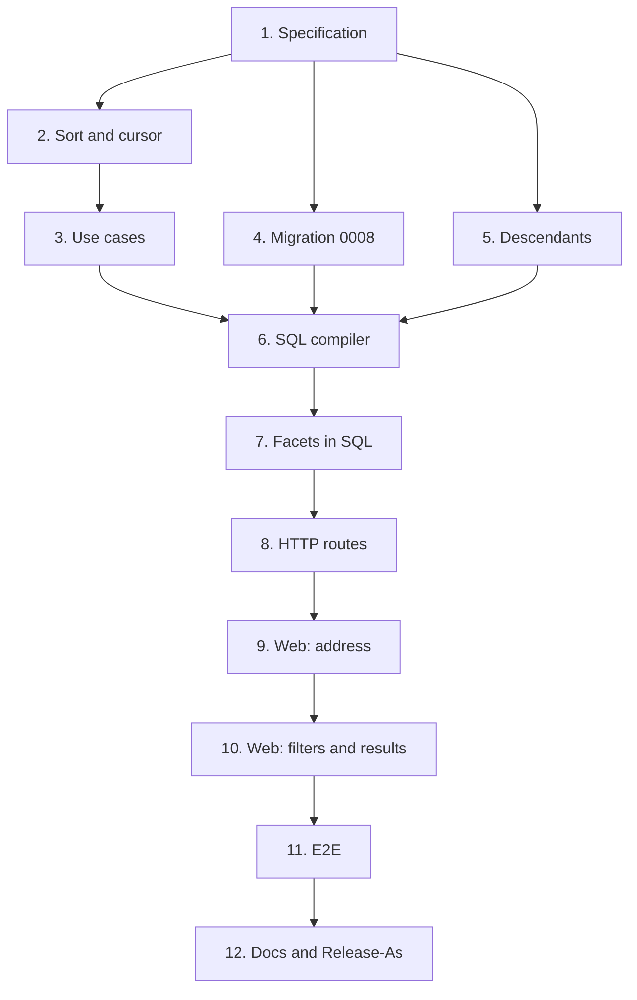

# Implementation Plan

## Overview

Twelve tasks that build the `parametric-search` slice described in [design.md](design.md)
and required by [requirements.md](requirements.md): the search specification and cursor in
the domain, the use cases with schema validation, migration `0008` with trigram indexes, the
SQL compiler and repository, facets, the HTTP routes, the web search page, the end-to-end
journey and the documentation that closes `v0.3.0`.

One task, one commit. Every commit has to pass `make check` **on its own**, because `main`
is rebase-merged and each commit lands (AGENTS.md); run `make coverage` on commits that
touch SQL, and `make e2e` on commits that touch the web. Tick the task in this file in the
same commit. Suggested Conventional Commit subjects are in `code` under each task.

This is **spec 4 of 4**: the last task's commit carries the footer `Release-As: 0.3.0`, on a
commit that changes files (a rebase merge drops an empty commit, footer and all; ADR 0012).
The release PR itself is merged only by the owner (AGENTS.md, Safety).

## Tasks

- [x] 1. The search specification
  - `catalog/domain/search.py`: `SearchText`, the filters of design.md (`TextContains`,
    `InCategories`, `NumberBetween`, `OneOf`, `IsBool`, `TextAttributeContains`, `HasPin`,
    `AllOf`), each with `matches(part, pins)`; wrong-kind values never match.
  - `catalog/domain/errors.py`: `InvalidFilterError`, `InvalidCursorError`,
    `InvalidSortError`; add them to `tests/catalog/test_errors.py`.
  - `tests/catalog/test_search_spec.py`: every filter matching and not matching, missing and
    wrong-kind values left out, an empty `AllOf` matching everything.
  - `feat(catalog): describe part searches as composable filters`
  - _Requirements: 1.1, 2.1, 2.3, 2.4, 2.5, 2.6, 2.7, 3.1_

- [x] 2. Sorting and the cursor
  - `PartSort` (`newest`, `name`, `attribute(key)`, direction) and `SearchCursor` with its
    base64url encoding and the search fingerprint, as design.md's Data Models.
  - `tests/catalog/test_search_cursor.py`: round trip, garbage refused, a cursor from another
    search refused; property 3 as a Hypothesis test.
  - `feat(catalog): sort searches and continue them with an opaque cursor`
  - _Requirements: 4.1, 4.4_

- [x] 3. The use cases over fakes
  - `catalog/application/ports.py`: `PartDefinitions.search` and `.facets`,
    `Categories.descendants`; the in-memory fakes in `tests/support/catalog.py` implement
    them with `matches`, sorting and slicing in Python.
  - `catalog/application/search.py`: `RawFilter`, `PartSearch`, `SearchParts`,
    `CategoryFacets`, `Facets`, validating every filter against the resolved schema and
    parsing range bounds with the attribute's unit.
  - `tests/catalog/test_search_use_cases.py`: each refusal of requirement 2.9 and 2.8,
    descendants included and `exact_category`, the sorts, facets; properties 4 and 5.
  - `feat(catalog): search parts and count facets against the category schema`
  - _Requirements: 1.2, 1.3, 1.4, 2.2, 2.8, 2.9, 4.1, 4.5, 5.1, 5.2, 5.3_

- [x] 4. Trigram indexes and migration 0008
  - `make migration m="search"` (or `--empty`), then write `0008_search.py` by hand as
    design.md's Data Models: `CREATE EXTENSION IF NOT EXISTS pg_trgm`, the three trigram
    GIN indexes, a `downgrade` that drops the indexes and keeps the extension.
  - Declare the indexes in `catalog/infrastructure/orm.py` so `wiredex db check` reports no
    drift; `test_migrations.py` covers the round trip.
  - `feat(catalog): index part names and numbers for text search`
  - _Requirements: 7.1, 7.5_

- [x] 5. Descendant categories
  - `SqlCategories.descendants`: one recursive CTE, the mirror of `ancestors`, filtered by
    workspace.
  - `tests/integration/test_catalog_repositories.py`: a three-level tree, the root's
    descendants, a leaf's, another workspace's tree unseen.
  - `feat(catalog): find a category's descendants in one query`
  - _Requirements: 1.2_

- [x] 6. The SQL compiler and search repository
  - `catalog/infrastructure/search_sql.py`: `compile_spec`, one case per filter, keys and
    values always bound; `SqlPartDefinitions.search` with the workspace filter, the sort
    with `NULLS LAST` and the id tie-break, the keyset condition, `limit + 1`.
  - `tests/integration/test_part_search.py`: every compile case, `%` and `_` matched
    literally, nulls last both ways, one statement per page (count them), `EXPLAIN` on a
    seeded table using the trigram and attribute indexes; properties 1 and 2 as Hypothesis
    tests (`max_examples` kept small: each example touches Postgres).
  - `tests/integration/test_catalog_isolation.py`: a search as `wiredex_app` never returns
    another workspace's parts.
  - `feat(catalog): compile part searches to SQL`
  - _Requirements: 1.1, 1.5, 2.1, 2.3, 2.4, 2.5, 2.6, 2.7, 3.1, 3.2, 4.2, 4.3, 7.2, 7.3, 7.4_

- [x] 7. Facets in SQL
  - `SqlPartDefinitions.facets`: enum option counts, boolean counts, number minimum and
    maximum, over the parts matching category, text and pin.
  - Tests in `tests/integration/test_part_search.py`: counts adding up, an attribute with no
    values answering no range.
  - `feat(catalog): count facets in PostgreSQL`
  - _Requirements: 5.1, 5.2, 5.3_

- [x] 8. HTTP routes
  - `catalog/api/schemas.py`: `PartSearchRequest` with the filter as a discriminated union
    on `type`, `PartSearchResponse` (summaries plus the category's number and enum values),
    `FacetsResponse`.
  - `catalog/api/router.py`: `POST /catalog/parts/search` and
    `GET /catalog/categories/{id}/facets` in a new `_add_search_routes`; 422 bodies naming
    the filter; wire the use cases in `bootstrap/catalog.py`.
  - `tests/catalog/test_search_api.py`; the search route in
    `tests/catalog/test_catalog_auth.py` (401, and 403 without CSRF: it is a POST).
  - `make client`, commit the regenerated client.
  - `feat(catalog): expose part search and facets over HTTP`
  - _Requirements: 2.8, 2.9, 4.4, 5.1, 7.6_

- [~] 9. Web: the search in the address
  - `features/catalog/search/searchParams.ts`: `validateSearch` for `/parts`, the compact
    filter encoding, conversion to the request body; `search.ts`: `usePartSearch` (infinite
    query over the cursor) and `useFacets`.
  - `searchParams.test.ts`: every field round-trips through the address; garbage in the
    address is dropped, not thrown.
  - `feat(web): keep part searches in the address`
  - _Requirements: 6.4_

- [~] 10. Web: filters and results
  - `FilterPanel.tsx` and one control per kind (`NumberRangeFilter`, `OptionsFilter` with
    facet counts, `BoolFilter`, `TextFilter`), collapsible on phones; `ResultsTable.tsx` with
    attribute columns, sortable headers (`aria-sort`) and "Show more"; `PartsPage` built from
    them; typing debounced by 300 ms; refusals next to their filter; the empty state.
  - `catalog.search.*` strings in both locale files.
  - Tests for each component and `PartsPage.test.tsx`.
  - `feat(web): search parts by attributes, pins and text`
  - _Requirements: 6.1, 6.2, 6.3, 6.5, 6.6, 6.7, 6.8_

- [~] 11. End-to-end journey
  - `e2e/tests/search.spec.ts`, reusing the logged-in session: create a category with a
    resistance attribute and three resistors (`220R`, `4k7`, `10k`; unique names), filter
    `1k` to `10k`, see `4k7` and `10k` only, sort by resistance, reload and keep the search.
  - `test(e2e): cover parametric search`
  - _Requirements: all, end to end_

- [~] 12. Documentation, closing v0.3.0
  - `docs/adr/0005-typed-part-attributes.md`: a search section (specification compiled to
    SQL, validation against the resolved schema, guarded numeric comparisons, facets ignoring
    attribute filters).
  - `docs/architecture.md` §10: question 6 answered (Postgres with `pg_trgm`, search inside
    the catalog pages; the palette stays in `v0.8.0`).
  - `README.md`: tick "Parametric search and filters", which completes `v0.3.0`.
  - Commit footer: `Release-As: 0.3.0`.
  - `docs: record how search works and close v0.3.0`
  - _Requirements: none (documentation)_

## Task Dependency Graph



The same graph as waves: every task in a wave can be worked once the waves above it have
landed.

```json
{
  "waves": [
    { "wave": 1, "tasks": [{ "id": "1", "name": "Specification", "dependsOn": [] }] },
    {
      "wave": 2,
      "tasks": [
        { "id": "2", "name": "Sort and cursor", "dependsOn": ["1"] },
        { "id": "4", "name": "Migration 0008", "dependsOn": ["1"] },
        { "id": "5", "name": "Descendants", "dependsOn": ["1"] }
      ]
    },
    { "wave": 3, "tasks": [{ "id": "3", "name": "Use cases", "dependsOn": ["2"] }] },
    { "wave": 4, "tasks": [{ "id": "6", "name": "SQL compiler", "dependsOn": ["3", "4", "5"] }] },
    { "wave": 5, "tasks": [{ "id": "7", "name": "Facets in SQL", "dependsOn": ["6"] }] },
    { "wave": 6, "tasks": [{ "id": "8", "name": "HTTP routes", "dependsOn": ["7"] }] },
    { "wave": 7, "tasks": [{ "id": "9", "name": "Web: address", "dependsOn": ["8"] }] },
    { "wave": 8, "tasks": [{ "id": "10", "name": "Web: filters and results", "dependsOn": ["9"] }] },
    { "wave": 9, "tasks": [{ "id": "11", "name": "E2E", "dependsOn": ["10"] }] },
    { "wave": 10, "tasks": [{ "id": "12", "name": "Docs and Release-As", "dependsOn": ["11"] }] }
  ]
}
```

## Notes

### Before pushing

- `make check` on every commit, not only the last; `make coverage` once SQL changed.
- `make e2e` after task 11.
- `make client` must leave `packages/api-client` unchanged by the end, or CI's contract gate
  fails.
- Check the last commit carries `Release-As: 0.3.0` in its body.
- Open one PR for this spec with auto-merge (`gh pr merge N --rebase --auto`).

### Before merging the v0.3.0 release PR (owner-approved)

- The one-time OCI setup from the files-and-attachments spec: the `wiredex-files` bucket
  with versioning and a 30-day lifecycle rule, the IAM user limited to it, its Customer
  Secret Key and the `WIREDEX_FILE*` settings in `/srv/wiredex/api.env`. Without them the
  new API refuses to start and the deploy rolls back, by design.
- Re-run `server-setup.sh` so the nightly service also runs `wiredex files prune`.
- After the release: open a PDF attachment on wiredex.vinilabs.cc, and give the content
  route its own Content-Security-Policy if the browser refuses to show it inline.
