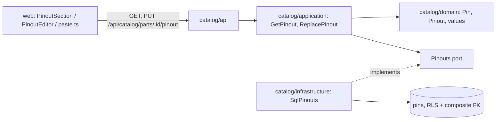

# Design Document: part pinouts

## Overview

The second of four specs in `v0.3.0`. The model is fixed by
[ADR 0004](../../../docs/adr/0004-netlist-and-pinouts.md): *a part definition owns a
`Pinout`, a first-class collection of `Pin`s, each with a number, label, type, alternate
functions and voltage level.* This spec builds that half of ADR 0004; the netlist that
points at pins is `v0.5.0`'s.

It extends the `catalog` module that
[catalog-foundation](../catalog-foundation/design.md) created, and follows its patterns
everywhere: value objects that validate themselves, a per-workspace unit of work, both
isolation gates of [ADR 0007](../../../docs/adr/0007-workspace-isolation.md), handlers as
closures, `make client` after API changes.

In scope:

- `Pin` and `Pinout` in the catalog domain, with the value objects a pin needs.
- Reading and replacing a part's whole pinout over HTTP, with refusals that name the row.
- Migration `0006`: the `pins` table, isolated per workspace, tied to its part's workspace.
- Web: the pinout section of the part page, a table editor, and pasting a pin table.
- Sample pinouts in the demo bench.

Out of scope:

- Nets, pin references and validation rules: the netlist, `v0.5.0`.
- Pin usage across projects ("what's on GPIO4?"): needs the netlist, `v0.5.0`.
- Pinout diagrams as images: `files-and-attachments`.
- Copying a pinout from another part, and uploading a CSV file (paste covers it for now).
- Finding parts by pin function ("parts with an SDA pin"): `parametric-search` may use the
  index this spec adds.

## Architecture

No new module and no new layer: pinouts live in `catalog`, in the same four layers.



Decisions:

**A pinout is replaced whole, never patched pin by pin.** The editor edits a table and
saves the table, and a paste replaces rows. One `PUT` with the full list keeps the rules
("numbers unique") checkable in one place, the collection, and makes a half-saved pinout
impossible. Pinouts are small: 1024 pins is the cap, and a big board has 40.

**The pin number is the pin's identity; the label is not.** ADR 0004's `PinRef` is "a BOM
designator plus a pin number", so numbers are unique within a pinout and labels may repeat
(many `GND`s). The netlist will reference `U1.21`; resolving `U2.SDA` by label is a UI
convenience for later, valid only when that label is unique on the part.

**Numbers are text, upper-cased.** Pins are `1`…`40` on a DIP, `A1`…`H8` on a BGA, and
sometimes `EP` for an exposed pad. Upper-casing makes `a1` and `A1` one ball.

**Pins are rows, not a JSONB blob on the part.** The netlist will join to them, a pin
function wants an index of its own, and the database can then hold the rule that a pin
belongs to a part of its own workspace (see Data Models). The domain doesn't know about
rows: the repository reads and writes a `Pinout`.

**Pins are read and written with SQLAlchemy Core, not mapped.** A pin has no identity of
its own outside its pinout and is never loaded alone, so an imperative mapping would add an
ORM entity the domain doesn't have. The repository turns rows into a `Pinout` and back, in
one `SELECT` and one bulk `INSERT`.

**Voltage is exact, in volts, and written the way boards print it.** `3V3` and `1V8` are
how a voltage appears on silkscreens and schematics; the voltage value object accepts them
next to what `parse_si` reads, and stores a `Decimal`.

## Components and Interfaces

### Domain: values

`apps/api/src/wiredex/catalog/domain/pinout.py`, plus leaves in `errors.py`. Frozen
slotted dataclasses, validating in `__post_init__`, normalizing through
`object.__setattr__`, raising `CatalogError` leaves, as `catalog/domain/values.py` does.

| Value | Rule | Normalized |
| --- | --- | --- |
| `PinNumber` | 1–16 characters of `A–Z 0–9 _ . + -` | trimmed, NFKC, upper-cased |
| `PinLabel` | 1–40 characters | trimmed, whitespace collapsed, case kept |
| `PinFunction` | 1–32 characters, no whitespace | trimmed, case kept |
| `PinType` | `StrEnum`: `power`, `ground`, `io`, `input`, `output`, `analog`, `nc`, `other` | — |
| `VoltageLevel` | a finite `Decimal` within ±1000 V | exact, in volts |

`PinType` separates `input` from `io` because ADR 0004's rule "input-only pins are not
driven" needs to know which pins can't drive; `nc` is a pin that must stay unconnected.

`VoltageLevel.parse(text)` reads, in order:

1. The board convention `<digits>V<digits>`: `3V3` → 3.3, `1V8` → 1.8, `12V0` → 12.
2. Otherwise `parse_si(text, Unit("V"))`, so `3.3`, `3.3V`, `5`, `-12V` and even `500mV`
   work, and `3.3A` is refused because the unit doesn't match.

`VoltageLevel.display()` is `format_si(value, Unit("V"))`: `3.3V`, `1.8V`, `500mV`.

### Domain: Pin and Pinout

```python
@dataclass(frozen=True, slots=True)
class Pin:
    number: PinNumber
    label: PinLabel
    type: PinType
    functions: tuple[PinFunction, ...] = ()
    voltage: VoltageLevel | None = None


@dataclass(frozen=True, slots=True)
class RawPin:
    """The untyped row the client sends; Pinout.parse is where it becomes typed."""

    number: str
    label: str
    type: str
    functions: Sequence[str] = ()
    voltage: str | None = None


class Pinout:
    """A part's pins in their saved order. Numbers are unique; labels may repeat."""

    MAX_PINS = 1024
    MAX_FUNCTIONS_PER_PIN = 16

    @classmethod
    def parse(cls, rows: Sequence[RawPin]) -> Pinout: ...
    @classmethod
    def empty(cls) -> Pinout: ...

    def __iter__(self) -> Iterator[Pin]: ...
    def __len__(self) -> int: ...
    def __eq__(self, other: object) -> bool: ...   # same pins, same order
```

`RawPin` sits in the domain for the same reason `raw_attributes` does in
catalog-foundation: only the domain can turn it into typed values. `Pinout.parse` builds
each `Pin`, then checks the collection: no repeated number, at most `MAX_PINS` pins, at
most `MAX_FUNCTIONS_PER_PIN` functions on a pin. Exact repeats of a function on one pin are
dropped, not refused (requirement 2.7). A `None` or blank voltage means none.

### Application

`catalog/application/ports.py` gains one repository, and `CatalogUnitOfWork` exposes it as
a read-only property like the others:

```python
class Pinouts(Protocol):
    async def of_part(self, part_id: PartDefinitionId) -> Pinout: ...
    async def replace(self, part_id: PartDefinitionId, pinout: Pinout) -> None:
        """Delete the part's pins and insert these, in their order."""
        ...
    async def count_of(self, part_id: PartDefinitionId) -> int: ...
```

No `remove`: deleting a part deletes its pins in the database (`ON DELETE CASCADE`), and
the demo reset's `parts.remove_all()` takes the pins with the parts the same way.

`catalog/application/pinouts.py`:

| Use case | Does |
| --- | --- |
| `GetPinout(workspace_id, part_id) -> Pinout` | Loads the part (404 if it isn't in the workspace), then its pinout |
| `ReplacePinout(workspace_id, part_id, rows) -> Pinout` | Loads the part, parses the rows, and if the result differs from the stored pinout, replaces it and marks the part updated; commits only then |

`PartDefinition` gains `pinout_changed(now) -> None`, which sets `updated_at`: entities own
their timestamps, as `revise` does. `GetPart`'s `PartView` gains `pin_count`, read with
`pinouts.count_of`, so the part page can say "no pinout yet" without a second request.

### HTTP API

Two routes, in a new `_add_pinout_routes` to stay under the complexity cap:

| Method | Path | Answers |
| --- | --- | --- |
| GET | `/catalog/parts/{id}/pinout` | `PinoutResponse`, `pins: []` when there is none |
| PUT | `/catalog/parts/{id}/pinout` | `PinoutResponse` of what was stored; 404 for a part not in the workspace; 422 with a row |

`PartResponse` gains `pin_count: int`. `bootstrap/catalog.py` wires the two use cases.

### Web

`apps/web/src/features/catalog/pinout/`:

| File | What |
| --- | --- |
| `pinout.ts` | `usePinout(partId)`, `useReplacePinout(partId)` over the generated client; a `PinoutRefusal` error carrying `row` and `field`; invalidates the part and its pinout |
| `PinoutSection.tsx` | On the part page: the read-only table, the filter (number, label or function), "no pinout yet", and **Edit pinout** |
| `PinoutEditor.tsx` | Editable rows: number, label, type (select), functions (space-separated text), voltage; add, remove, move up, move down; **Paste a table**; save; the refused row and field marked; asks before discarding unsaved edits |
| `PastePanel.tsx` | A textarea, the parsed preview with per-row warnings, and **Replace the table** / **Add to the table** |
| `paste.ts` | Pure functions: `parsePinTable(text) -> ParsedRow[]`, no React |
| `pinTypes.ts` | Type spellings and label guesses |

**Reading a pasted table** (`paste.ts`):

- The separator is detected from the first line: a tab (a spreadsheet copy), else `;`,
  else `,`.
- Columns are, in order: number, label, type, functions, voltage. Missing trailing cells
  are empty (requirement 6.4); extra ones are ignored.
- The first line is a header when its first cell isn't a plausible pin number and it
  contains a word like `pin`, `name`, `label`, `type`, `function` (EN or PT: `pino`,
  `nome`, `tipo`, `função`).
- Functions split on `/`, `;`, `|`, whitespace, and on `,` unless `,` is the separator.
- Types map from spellings, case-insensitively:

  | Spelled | Type |
  | --- | --- |
  | `power`, `pwr`, `vcc`, `vdd`, `supply`, `p` | `power` |
  | `ground`, `gnd`, `vss`, `g` | `ground` |
  | `io`, `i/o`, `gpio`, `bidir`, `inout` | `io` |
  | `input`, `in`, `i` | `input` |
  | `output`, `out`, `o` | `output` |
  | `analog`, `analogue`, `ai`, `a`, `adc` | `analog` |
  | `nc`, `n/c`, `not connected` | `nc` |

  An unknown spelling keeps the text and marks the row `unknown type`, so the preview shows
  it instead of guessing (requirement 6.5). An empty type with a power or ground label
  (`VCC`, `VDD`, `VIN`, `3V3`, `5V`, `VBAT` / `GND`, `VSS`, `AGND`) suggests the type and
  marks the row `type guessed` (requirement 6.6).

The client doesn't validate numbers, labels or voltages beyond "not empty": the API is the
one authority, and its refusal lands on the right cell. Every cell input is named
`Pin <n>, <column>` for screen readers, and the whole editor works by keyboard. Strings
live under `catalog.pinout.*` in both locale files.

### Demo bench

`catalog/application/demo.py`: `SamplePart` gains `pins: tuple[SamplePin, ...]`, spelled as
typed (`"3V3"`, `"SDA SCK"`), and goes through `Pinout.parse`, so the sample is read by the
same code the editor's rows are. Two new sample parts under a new `Integrated circuits`
root:

- **AMS1117-3.3** (SOT-223, a voltage regulator): `1 GND/ADJ ground`, `2 VOUT power 3V3`,
  `3 VIN power`.
- **BME280** (LGA-8, a sensor): `1 GND`, `2 CSB`, `3 SDI (SDA, MOSI)`, `4 SCK (SCL)`,
  `5 SDO (MISO)`, `6 VDDIO 3V3`, `7 GND`, `8 VDD 3V3`: two `GND` labels on purpose.

## Data Models

`catalog/infrastructure/orm.py` gains the `pins` table on the shared `metadata`. Migration
`0006_pinouts.py`:

```
part_definitions
  + unique (workspace_id, id)                    -- target of the composite FK below

pins
  workspace_id uuid not null
  part_id      uuid not null
  position     integer not null                  -- 0-based saved order
  number       varchar(16) not null
  label        varchar(40) not null
  type         varchar(16) not null (CHECK: power|ground|io|input|output|analog|nc|other)
  functions    varchar(32)[] not null default '{}'
  voltage      numeric null                      -- volts, exact
  primary key (part_id, number)
  unique (part_id, position)
  foreign key (workspace_id, part_id) → part_definitions (workspace_id, id) ON DELETE CASCADE
  index gin (functions)
```

- **The composite foreign key is gate three.** Postgres checks foreign keys without
  row-level security, so a plain `part_id` key would let a bug store a pin in workspace A
  that points at a part of workspace B. With `(workspace_id, part_id)` the database itself
  refuses it (requirement 4.2). It needs `unique (workspace_id, id)` on `part_definitions`,
  which `id` being the primary key makes cheap and always true.
- **No surrogate id.** A pin is identified by its part and number, exactly as `PinRef` will
  reference it, so `(part_id, number)` is the primary key.
- `functions` is a Postgres array, not JSONB: a flat list of short strings, and
  `functions @> ARRAY['SDA']` with the GIN index is what finding parts by function needs.
- `voltage` is `numeric`, not JSONB, and maps to `Decimal` directly.
- The migration ends with `isolate_by_workspace(op.execute, "pins")`, and its `downgrade`
  drops the table and then the new unique constraint.

`SqlPinouts(session, workspace_id)` in `catalog/infrastructure/repositories.py` filters on
`workspace_id` in every statement (gate one), like the other repositories:

- `of_part`: one `SELECT … WHERE workspace_id = :w AND part_id = :p ORDER BY position`.
- `replace`: `DELETE … WHERE workspace_id = :w AND part_id = :p`, then one `INSERT` of all
  rows (`insert(pins)` with a list of dicts), or none for an empty pinout.
- `count_of`: `SELECT count(*)`.

`SqlCatalogUnitOfWork` binds `pinouts` in `__aenter__` next to the others.

**On the wire:**

```json
PUT /api/catalog/parts/{id}/pinout
{ "pins": [
  { "number": "3", "label": "SDI", "type": "io", "functions": ["SDA", "MOSI"], "voltage": "3V3" }
] }

Response
{ "pins": [
  { "number": "3", "label": "SDI", "type": "io", "functions": ["SDA", "MOSI"],
    "voltage": { "value": "3.3", "display": "3.3V" } }
] }
```

`voltage` goes in as text (what was typed) and comes out like attribute numbers do: the
exact value as a string, plus a display form (requirement 2.13).

## Correctness Properties

Checked with [Hypothesis](https://hypothesis.readthedocs.io/) in the API tests (a dev
dependency added in task 2), except property 6, which the web checks with table-driven
tests.

### Property 1: A pinout survives its own wire form

For any valid pinout `p`, parsing the rows it serializes to gives `p` back: same pins, same
order, same normalized numbers, labels, types, functions and voltages.

**Validates: Requirements 1.1, 2.1, 2.4, 2.7, 2.9**

### Property 2: Pin numbers are unique after normalization

For any list of rows, `Pinout.parse` succeeds on the uniqueness rule if and only if no two
rows' numbers are equal once trimmed and upper-cased; when it refuses, the row it names is
the later of the first colliding pair.

**Validates: Requirements 2.1, 2.3, 3.2**

### Property 3: A voltage reads back from its display form

For any voltage within ±1000 V with at most four significant digits, `VoltageLevel.parse`
of its `display()` equals it exactly, and so does parsing its `3V3`-style spelling when the
value has one.

**Validates: Requirements 2.9, 2.13**

### Property 4: A refusal names the row that caused it

For any valid pinout with exactly one pin made invalid at a random position `i`, the
refusal's `row` is `i + 1` and its `field` is the field that was broken.

**Validates: Requirements 3.1**

### Property 5: Replacing is total

For any two valid pinouts `a` and `b`, replacing `a` with `b` and reading back gives exactly
`b`; nothing of `a` survives, and replacing `b` with `b` commits nothing.

**Validates: Requirements 1.3, 1.4, 1.6**

### Property 6: Pasting never loses a row

For any pasted table, the reader returns one row per non-empty line except a detected
header, in order, whatever the separator and however short a row is.

**Validates: Requirements 6.2, 6.3, 6.4**

## Error Handling

The value objects raise their own leaves, all `CatalogError`s: `InvalidPinNumberError`,
`InvalidPinLabelError`, `InvalidPinFunctionError`, `InvalidPinTypeError`,
`InvalidVoltageError`. `Pinout.parse` catches them per row and raises one error that knows
its row:

```python
class InvalidPinoutError(CatalogError):
    """A pinout refused as a whole, or because of one row (requirements 3.1–3.3)."""

    def __init__(self, message: str, row: int | None = None, field: PinField | None = None):
        super().__init__(message)
        self.row = row          # 1-based, as the table shows it
        self.field = field      # "number" | "label" | "type" | "functions" | "voltage"
```

Messages are prefixed with the row: `row 7: "SD A" is not a pin function (no spaces)`. A
duplicate number names the later row and the earlier one: `row 12: pin 5 is already row 3`.
A refusal of the whole pinout has no row: `a pinout has at most 1024 pins`.

**On the wire.** Every other catalog refusal answers `{"detail": "<message>"}`, and the part
form finds the field by the attribute name in the message. A table can't do that, so
`InvalidPinoutError` answers 422 with a structured detail:

```json
{ "detail": { "message": "row 12: pin 5 is already row 3", "row": 12, "field": "number" } }
```

`row` and `field` are `null` for a refusal of the whole pinout. The router maps
`InvalidPinoutError` itself, before the generic `_refusals()` mapping, so every other route
keeps its shape. A part that isn't in the caller's workspace answers 404, as everywhere in
the catalog.

**In the web**, `useReplacePinout` turns that detail into a `PinoutRefusal`; the editor
marks the named cell, scrolls to it, shows the message, and keeps every edit. A refusal
without a row shows above the table.

## Testing Strategy

| Level | Where | Covers |
| --- | --- | --- |
| Unit, domain | `tests/catalog/test_pinout.py` | Every value rule and normalization; `3V3`/`500mV`/`3.3A`; duplicate numbers naming both rows; repeated labels allowed; the pin and function caps; row and field on every refusal; properties 1–4 |
| Unit, application | `tests/catalog/test_pinout_use_cases.py` | Over the fakes: replace and read back, identical save not committing, the part marked updated, 404 outside the workspace; property 5 |
| Unit, api | `tests/catalog/test_pinout_api.py` | Both routes, the structured 422 with and without a row, 404, `pin_count` on the part; 401 and CSRF in `test_catalog_auth.py` |
| Integration | `tests/integration/test_pinout_repository.py` | Order kept, replace atomic, one query per read, cascade on part delete |
| Integration | `tests/integration/test_catalog_isolation.py` | As `wiredex_app`, pins of workspace A invisible and unwritable from B; the composite key refusing a pin whose part is in another workspace, even as the owner |
| Integration | existing `test_migrations.py`, `test_demo_cli.py` | `0006` round trip; the reset restoring sample pinouts |
| Web | `paste.test.ts`, `PinoutSection.test.tsx`, `PinoutEditor.test.tsx` | Separators, headers, short rows, type spellings, guesses (property 6); filter by function; editing, reordering, the paste flow, the refusal marking its cell, the discard prompt |
| E2E | `e2e/tests/pinout.spec.ts` | Open a part, paste a three-row table with a header, save, see the pins, filter by `SDA` |

After this spec: ADR 0004 gets an "Implementation (v0.3)" section (pinouts replaced whole,
numbers as identity, the composite key, Core instead of a mapping), and the README's
"Structured pinouts" line is ticked. The netlist (`v0.5.0`) can then reference
`(part_id, number)` directly, and the GIN index on `functions` is ready for "every part
with an SDA pin".
