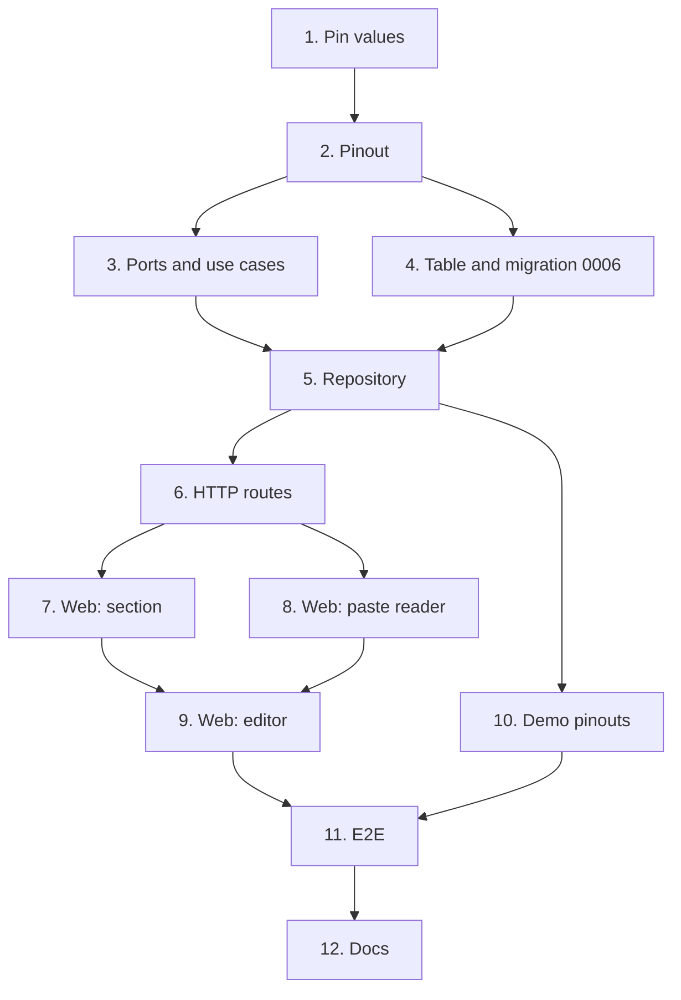

# Implementation Plan

## Overview

Twelve tasks that build the `part-pinouts` slice described in [design.md](design.md) and
required by [requirements.md](requirements.md): pin values and the `Pinout` collection,
the use cases, migration `0006` with the `pins` table, the repository, the HTTP routes,
the web section, editor and paste, demo pinouts and the end-to-end journey.

One task, one commit. Every commit has to pass `make check` **on its own**, because `main`
is rebase-merged and each commit lands (AGENTS.md); run `make coverage` on commits that
touch SQL, and `make e2e` on commits that touch the web. Tick the task in this file in the
same commit. Suggested Conventional Commit subjects are in `code` under each task.

This is spec 2 of 4 in `v0.3.0`, so **no commit here carries `Release-As`**, and the
release PR stays unmerged (AGENTS.md: one PR per spec; the phase's last PR carries it).

## Tasks

- [x] 1. Pin value objects
  - `catalog/domain/pinout.py`: `PinNumber`, `PinLabel`, `PinFunction`, `PinType`,
    `VoltageLevel` (`parse` with the `3V3` convention, then `parse_si` in volts;
    `display`), as design.md's "Domain: values".
  - `catalog/domain/errors.py`: `InvalidPinNumberError`, `InvalidPinLabelError`,
    `InvalidPinFunctionError`, `InvalidPinTypeError`, `InvalidVoltageError`; add them to
    `tests/catalog/test_errors.py`.
  - `tests/catalog/test_pinout.py`: trimming and upper-casing numbers (`a1` = `A1`), the
    character set, the caps, labels keeping case, every `PinType`, and voltages: `3.3`,
    `3.3V`, `3V3`, `1V8`, `12V0`, `5`, `-12V`, `500mV` accepted; `3.3A`, `abc`, `2000`
    refused.
  - `feat(catalog): add the pin value objects`
  - _Requirements: 2.1, 2.2, 2.4, 2.6, 2.8, 2.9, 2.10, 2.11_

- [x] 2. The Pin and Pinout collection
  - `Pin`, `RawPin`, `Pinout` (`parse`, `empty`, iteration, length, equality) and
    `InvalidPinoutError` with `row` and `field`, as design.md's "Domain: Pin and Pinout"
    and "Error Handling".
  - Add Hypothesis as an API dev dependency (`uv add --dev hypothesis`, pinned like the
    others) for the design's correctness properties.
  - Tests: order kept, repeated labels accepted, exact function repeats dropped, duplicate
    numbers refused naming both rows (`row 12: pin 5 is already row 3`), the 1024-pin and
    16-function caps, and the row and field on a refusal from each value object; and
    properties 1–4 of design.md as Hypothesis tests.
  - `feat(catalog): collect pins into a pinout that names the row it refuses`
  - _Requirements: 2.3, 2.5, 2.7, 2.12, 3.1, 3.2, 3.3_

- [x] 3. Ports, fakes and the use cases
  - `catalog/application/ports.py`: the `Pinouts` protocol and the `pinouts` property on
    `CatalogUnitOfWork`.
  - `tests/support/catalog.py`: `InMemoryPinouts`, bound in `InMemoryCatalog`; deleting a
    part in the fakes drops its pinout, as the database cascade will.
  - `PartDefinition.pinout_changed(now)`.
  - `catalog/application/pinouts.py`: `GetPinout` and `ReplacePinout`; `PartView` gains
    `pin_count`, filled by `GetPart`.
  - `tests/catalog/test_pinout_use_cases.py`: replace then read, an identical save not
    committing, the part's `updated_at` moving, an empty save clearing, 404 outside the
    workspace, deleting the part dropping its pinout; property 5 as a Hypothesis test.
  - `feat(catalog): read and replace a part's pinout`
  - _Requirements: 1.1, 1.2, 1.3, 1.4, 1.5, 1.6, 1.7, 1.9_

- [x] 4. The pins table and migration 0006
  - `catalog/infrastructure/orm.py`: the `pins` table (Core only, no mapping) and
    `unique (workspace_id, id)` on `part_definitions`, as design.md's "Data Models".
  - `make migration m="pinouts"`, then fix `0006_pinouts.py` by hand: the composite
    foreign key with `ON DELETE CASCADE`, the GIN index on `functions`, the `type` CHECK,
    `isolate_by_workspace(op.execute, "pins")`, and a `downgrade` that drops the table and
    then the new constraint.
  - `tests/integration/test_migrations.py` covers the round trip; confirm it passes and
    that `wiredex db check` reports no drift.
  - `feat(catalog): add the pins table, tied to its part's workspace`
  - _Requirements: 4.1, 4.2, 7.3_

- [x] 5. The pinout repository
  - `catalog/infrastructure/repositories.py`: `SqlPinouts` (`of_part`, `replace`,
    `count_of`), filtering `workspace_id` in every statement; bind it in
    `SqlCatalogUnitOfWork`.
  - `tests/integration/test_pinout_repository.py`: order kept across a round trip, a
    replace leaving no old pins, an empty replace, exact `Decimal` voltages, deleting the
    part cascading, and one statement per read (count them with an event listener).
  - `tests/integration/test_catalog_isolation.py`: as `wiredex_app`, workspace B can't read
    or write A's pins; as the owner, inserting a pin whose `workspace_id` differs from its
    part's is refused by the composite key.
  - `feat(catalog): store pinouts in PostgreSQL`
  - _Requirements: 1.7, 4.1, 4.2, 7.1, 7.2_

- [x] 6. HTTP routes
  - `catalog/api/schemas.py`: `PinRequest`, `ReplacePinoutRequest`, `PinResponse` (voltage
    as `{value, display}` or `null`), `PinoutResponse`; `PartResponse.pin_count`.
  - `catalog/api/router.py`: `GET` and `PUT /catalog/parts/{id}/pinout`, in their own
    `_add_pinout_routes`; `InvalidPinoutError` answered as 422 with
    `{"detail": {"message", "row", "field"}}`, before the generic mapping.
  - `bootstrap/catalog.py`: wire the two use cases.
  - `tests/catalog/test_pinout_api.py`: both routes, the structured 422 with and without a
    row, 404, `pin_count`. Extend `tests/catalog/test_catalog_auth.py` with the pinout
    `PUT` (401 without a session, 403 without the CSRF header).
  - `make client`, commit the regenerated `packages/api-client`.
  - `feat(catalog): expose pinouts over HTTP`
  - _Requirements: 1.1, 1.8, 1.9, 2.13, 3.1, 3.2, 3.3, 7.4_

- [x] 7. Web: the pinout section
  - `features/catalog/pinout/pinout.ts`: `usePinout`, `useReplacePinout`, `PinoutRefusal`
    (status, message, row, field).
  - `PinoutSection.tsx` on `PartPage`: the table, the filter matching number, label or
    function, "no pinout yet" with **Add a pinout**.
  - `catalog.pinout.*` strings in both locale files.
  - `PinoutSection.test.tsx` with MSW: rows rendered, filter by `SDA` finding the `SDI`
    pin, the empty state.
  - `feat(web): show a part's pinout`
  - _Requirements: 5.1, 5.2, 5.3, 6.11_

- [ ] 8. Web: reading a pasted table
  - `pinout/paste.ts` and `pinout/pinTypes.ts`: `parsePinTable`, separator detection, the
    header check (EN and PT words), short rows, function splitting, type spellings,
    guesses from labels, per-row warnings, as design.md's Web section.
  - `paste.test.ts`: a spreadsheet copy (tabs), a semicolon and a comma table, a header
    skipped, a short row, `I/O` and `N/C`, an unknown type kept and warned, `VCC` with no
    type guessed as `power`; property 6 as a table of cases.
  - `feat(web): read a pin table pasted from a spreadsheet or datasheet`
  - _Requirements: 6.2, 6.3, 6.4, 6.5, 6.6, 6.7_

- [ ] 9. Web: the pinout editor
  - `PinoutEditor.tsx` and `PastePanel.tsx`: editable rows, add, remove, move up and down,
    the paste preview with **Replace the table** / **Add to the table**, save, the refused
    row and field marked from `PinoutRefusal`, the prompt before discarding edits.
  - Cell inputs named `Pin <n>, <column>`; everything reachable by keyboard.
  - `PinoutEditor.test.tsx`: editing and reordering, the paste flow in both modes, a 422
    marking its cell and keeping the edits, the discard prompt.
  - `feat(web): edit and paste a part's pinout`
  - _Requirements: 6.1, 6.8, 6.9, 6.10, 6.11_

- [ ] 10. Sample pinouts in the demo bench
  - `catalog/application/demo.py`: `SamplePin`, `SamplePart.pins`, an `Integrated
    circuits` root with the AMS1117-3.3 and BME280 of design.md's "Demo bench", read through
    `Pinout.parse`.
  - `tests/catalog/test_demo.py` and `tests/integration/test_demo_cli.py`: after a reset,
    the BME280 has 8 pins with two `GND` labels, and the owner's workspace has none.
  - `feat(catalog): add sample pinouts to the demo bench`
  - _Requirements: 4.3_

- [ ] 11. End-to-end journey
  - `e2e/tests/pinout.spec.ts`, reusing the logged-in session: create a category and a part
    (unique names with `Date.now()`), open it, **Add a pinout**, paste a three-row table
    with a header, **Replace the table**, save, see the three pins, filter by `SDA`.
  - `test(e2e): cover pasting and saving a pinout`
  - _Requirements: all, end to end_

- [ ] 12. Documentation
  - `docs/adr/0004-netlist-and-pinouts.md`: an "Implementation (v0.3)" section recording
    the decisions of design.md's Architecture section and the composite key.
  - `README.md`: tick "Structured pinouts (pin table editor, CSV paste)".
  - `docs: record how pinouts are built`
  - _Requirements: none (documentation)_

## Task Dependency Graph



The same graph as waves: every task in a wave can be worked once the waves above it have
landed. Task 8 is pure TypeScript, so it can start as soon as task 6 has generated the
client; task 10 needs only the repository.

```json
{
  "waves": [
    { "wave": 1, "tasks": [{ "id": "1", "name": "Pin values", "dependsOn": [] }] },
    { "wave": 2, "tasks": [{ "id": "2", "name": "Pinout", "dependsOn": ["1"] }] },
    {
      "wave": 3,
      "tasks": [
        { "id": "3", "name": "Ports and use cases", "dependsOn": ["2"] },
        { "id": "4", "name": "Table and migration 0006", "dependsOn": ["2"] }
      ]
    },
    { "wave": 4, "tasks": [{ "id": "5", "name": "Repository", "dependsOn": ["3", "4"] }] },
    {
      "wave": 5,
      "tasks": [
        { "id": "6", "name": "HTTP routes", "dependsOn": ["5"] },
        { "id": "10", "name": "Demo pinouts", "dependsOn": ["5"] }
      ]
    },
    {
      "wave": 6,
      "tasks": [
        { "id": "7", "name": "Web: section", "dependsOn": ["6"] },
        { "id": "8", "name": "Web: paste reader", "dependsOn": ["6"] }
      ]
    },
    { "wave": 7, "tasks": [{ "id": "9", "name": "Web: editor", "dependsOn": ["7", "8"] }] },
    { "wave": 8, "tasks": [{ "id": "11", "name": "E2E", "dependsOn": ["9", "10"] }] },
    { "wave": 9, "tasks": [{ "id": "12", "name": "Docs", "dependsOn": ["11"] }] }
  ]
}
```

## Notes

### Before pushing

- `make check` on every commit, not only the last; `make coverage` once SQL changed.
- `make e2e` after task 11.
- `make client` must leave `packages/api-client` unchanged by the end, or CI's contract
  gate fails.
- Open one PR for this spec with auto-merge (`gh pr merge N --rebase --auto`); don't merge
  the release PR.
