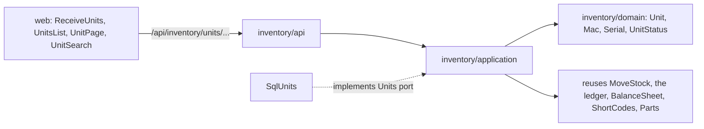

# Design Document: tracked units

## Overview

The second of three specs in `v0.4.0` Inventory. It adds the `UNIT` that
[docs/architecture.md](../../../docs/architecture.md) plans — *ESP32 board labelled
`WX-U-0042`, MAC `…`; exactly one; it can hold firmware* — for parts whose category is marked
"tracked individually" ([ADR 0002](../../../docs/adr/0002-stock-ledger.md)'s "parts that
matter individually … tracked as units with a label and an optional serial or MAC").

Design-First, and built squarely on the [inventory-stock](../inventory-stock/design.md) spec:
units do not invent a second way to count stock. A unit-tracked part still has lots, a ledger
and a balance projection; a unit is *additional identity* — a short code, an optional serial
and MAC, a location and a status — attached to stock that is already counted the ordinary
way. So "total on_hand per part", workspace isolation, `wiredex stock rebuild` and the
movement history stay uniform across lot-counted and unit-tracked parts, and ADR 0002's
"every change in stock is a movement" holds for units too.

**Owner decisions (2026-09-26), final**, that shape this spec:

- **Every microcontroller board is a unit**, by the `tracked_individually` category flag the
  inventory-stock spec added. This spec is what "unit-tracked" finally means.
- **No printed QR labels.** A unit's short code `WX-U-0001` is human-readable and searchable,
  minted from the same per-workspace counter as locations (`unit` kind). No QR.
- **`v0.4.0` records `RECEIVE`, `ADJUST` and `MOVE` only.** A unit's whole life in `v0.4.0`
  is expressed with those three kinds; `RESERVE`/`CONSUME` and the build lifecycle (which is
  where "installed in a build" belongs) arrive in `v0.5.0`.

**Settled design decisions for this spec** (with the owner, 2026-09-26):

1. **Units ride the ledger.** Receiving N units of a part into a location writes the ordinary
   lot + `RECEIVE` movement + balance update, *and* creates N `Unit` rows pointing at that
   lot, in one transaction. A lot's `on_hand`, for a unit-tracked part, equals the number of
   its `in_stock` units at that location — a checked invariant (Property 1).
2. **Two statuses, stock-neutral by design.** `in_stock` (counts toward `on_hand`) and
   `retired` (does not). Retiring writes a compensating `ADJUST -1` on the unit's lot;
   un-retiring writes `ADJUST +1` (reason `found`). No `in_use`/`reserved` status — those
   belong to the `v0.5.0` build lifecycle.
3. **Serial and MAC uniqueness match their real-world scope.** A `Mac` normalizes to
   canonical `aa:bb:cc:dd:ee:ff`; a MAC is unique per workspace (a MAC genuinely is globally
   unique); a serial is unique per (workspace, part) (a serial only means something within a
   part). Both are optional, and any number of units may leave either blank.
4. **Moving a unit reuses the two-row MOVE.** A `MoveUnit` moves one unit by delegating the
   stock effect to the inventory-stock `MOVE` (quantity 1, one `move_group`) and repointing
   the unit's `lot_id`, in one transaction.
5. **Retire before delete.** A unit may be deleted only once `retired`, so a hard delete
   never silently drops counted stock; the ledger history stays (append-only).

In scope:

- The `Unit` entity in the `inventory` domain, its value objects (`Mac`, `Serial`,
  `UnitStatus`), and the unit use cases.
- Receiving N units (creating N units and their ledger effect), moving a unit, editing a
  unit (serial, MAC), retiring and un-retiring, deleting a retired unit.
- Listing units of a part and of a location, and a workspace-wide unit search over code,
  serial and MAC.
- Migration `0012_units.py`: the `units` table, isolated by workspace, with the two partial
  unique indexes and a trigram index for search.
- Web: a unit receive path from the part page, the unit list on the part and location pages,
  a unit page, and a unit search.
- Unit sample data for the demo workspace (a couple of dev boards).

Out of scope:

- The build lifecycle and `RESERVE`/`CONSUME`/`RETURN` (`v0.5.0`), and firmware on a unit
  (`v0.7.0`, the ERD's `Deployment`). A unit has the seam for both but neither is built.
- Quick-add and CSV import of units (`quick-add-and-import`, the next spec, imports units
  through this spec's use cases).
- Bulk unit editing and any change history (`v0.8.0`).

## Architecture



This spec adds no module and no cross-module port. It extends `inventory`: a new `Unit`
entity and a `Units` repository port, and unit use cases that lean on the ledger, balance
and short-code machinery the inventory-stock spec already built. The `Parts` port
(implemented in `bootstrap/inventory.py` over catalog's `GetPart` and the resolved
`tracked_individually` flag) is reused unchanged: a unit receive checks the part exists *and*
is unit-tracked, the mirror of the lot receive's check.

`inventory` still imports neither `catalog` nor `identity`; the independence contract is
unaffected. The unit routes live in the same `inventory` router, added in a new
`_add_unit_routes`.

## Components and Interfaces

### Domain

New in `apps/api/src/wiredex/inventory/domain/`:

| File | Holds |
| --- | --- |
| `unit.py` | `Unit`, `UnitStatus` |
| `values.py` (extended) | `UnitId`, `Serial`, `Mac` |
| `errors.py` (extended) | `DuplicateSerialError`, `DuplicateMacError`, `UnitNotFoundError`, `UnitNotRetiredError`, `ReceiveAsLotError` |

```python
UnitId = NewType("UnitId", UUID)
```

**Values.**

- `Serial`: trimmed, whitespace collapsed, non-empty, capped at 80; case kept but compared
  case-insensitively for uniqueness, so a `fold()` accessor exists for the repository, as
  `Mpn` has in catalog.
- `Mac`: normalizes any of the common spellings to canonical `aa:bb:cc:dd:ee:ff`. It accepts
  `AA-BB-CC-DD-EE-FF`, `aabb.ccdd.eeff`, `aabbccddeeff` and the colon form, lower-cases,
  and re-joins as six colon-separated octets; anything that isn't exactly six hex octets is a
  `InventoryError`. This mirrors how catalog normalizes engineering notation: one canonical
  stored form, forgiving input. The stored, canonical value is what the unique index sees, so
  `AA:BB:…` and `aa-bb-…` collide as the same board.
- `UnitStatus(StrEnum)`: `in_stock`, `retired`. Only `in_stock` counts toward `on_hand`.

**The unit.**

```python
@dataclass(eq=False)
class Unit:
    id: UnitId
    workspace_id: WorkspaceId
    part_id: PartId
    lot_id: StockLotId          # the (part, location) it currently sits in
    code: ShortCode             # WX-U-NNNN, minted once, never changes
    serial: Serial | None
    mac: Mac | None
    status: UnitStatus
    created_at: datetime

    def relabel(self, serial: Serial | None, mac: Mac | None) -> bool: ...
    def retire(self) -> bool: ...          # in_stock -> retired
    def unretire(self) -> bool: ...        # retired -> in_stock
    def move_to(self, lot_id: StockLotId) -> None: ...
```

A unit's location is its lot's location; `lot_id` is the single pointer, so a unit and its
stock can never disagree about where it is. `relabel`, `retire` and `unretire` return whether
anything changed, so a no-op skips the `commit()`. `retire` refuses if already retired and
`unretire` if already `in_stock` — the compensating movement is the use case's job, not the
entity's, because the entity can't touch the ledger. The `firmware` seam (`v0.7.0`) and the
`revision`/reserve seam (`v0.5.0`) are deliberately absent; a unit is just identity over a
lot for now.

### Application

`inventory/application/ports.py` gains:

```python
class Units(Protocol):
    async def get(self, unit_id: UnitId) -> Unit | None: ...
    async def add(self, unit: Unit) -> None: ...
    async def of_part(self, part_id: PartId) -> list[Unit]: ...
    async def of_lot(self, lot_id: StockLotId) -> list[Unit]: ...
    async def in_stock_at(self, lot_id: StockLotId) -> int: ...          # for the invariant
    async def search(self, term: str) -> list[Unit]: ...                 # code|serial|mac substring
    async def serial_taken(self, part_id: PartId, serial: Serial) -> bool: ...
    async def mac_taken(self, mac: Mac) -> bool: ...
    async def remove(self, unit: Unit) -> None: ...
```

`SqlInventoryUnitOfWork` gains a `units` read-only property next to `lots`, `ledger`,
`balances`, `short_codes`.

Unit use cases, in `inventory/application/units.py`:

| Use case | Does |
| --- | --- |
| `ReceiveUnits(workspace_id, part_id, location_id, quantity, units)` | Checks the part exists (404) and **is** unit-tracked (422 `ReceiveAsLotError` if not); finds or creates the lot; appends one `RECEIVE` of `+quantity` and updates the balance (exactly the inventory-stock receive); mints `quantity` unit codes and creates the units, applying any per-unit serial/MAC given; refuses a duplicate serial (per part, 409) or MAC (per workspace, 409) before writing; commits. `quantity == len(units)`. |
| `RelabelUnit(workspace_id, unit_id, serial?, mac?)` | Sets a unit's serial and MAC, refusing a duplicate; commits only when something changed. |
| `RetireUnit(workspace_id, unit_id)` | `in_stock -> retired`; appends an `ADJUST -1` on the unit's lot (reason `damaged` by default, overridable to `lost`), so the lot's `on_hand` drops by one and the invariant holds. |
| `UnretireUnit(workspace_id, unit_id)` | `retired -> in_stock`; appends an `ADJUST +1` (reason `found`). |
| `MoveUnit(workspace_id, unit_id, to_location_id)` | Delegates the stock effect to the inventory-stock `MOVE` (quantity 1, one `move_group`, source = the unit's current lot's location, destination = `to_location_id`), then repoints the unit's `lot_id` to the destination lot, in one transaction. A retired unit can't move (422); same-location is refused (422). |
| `DeleteUnit(workspace_id, unit_id)` | Deletes a unit only if `retired` (else 409 `UnitNotRetiredError`); removes the unit row, leaves the ledger untouched. |
| `ListUnitsOfPart` / `ListUnitsOfLocation` / `SearchUnits` | Reads: units of a part, of a location, and the workspace search over code, serial and MAC. |

The receive of units and the receive of a lot are the same stock event with a different
identity layer: both go through the lot + `RECEIVE` + balance path, so the parts page's total
query is unchanged and `stock rebuild` still means one thing. The only new rule is that a
unit-tracked part is refused as a *lot* (inventory-stock's `ReceiveAsUnitsError`) and a
lot-counted part is refused as *units* here (`ReceiveAsLotError`); the `Parts.describe` flag
is the switch for both.

Retire and its compensating `ADJUST` are one transaction, so a unit is never `retired` while
its lot still counts it, and never counted while retired. `MoveUnit` is one transaction, so a
unit's `lot_id` and the two lots' balances always agree. These are the agreements Property 1
and Property 2 guard.

Nothing is saved without `commit()`; one use case, one transaction. The in-memory fakes count
commits, so a no-op relabel is asserted to write nothing.

### Short codes

Units reuse the inventory-stock `ShortCodes` port with the `unit` kind, so a unit's code comes
from the same per-workspace, gap-free, in-transaction counter as a location's, formatted with
`ShortCode.for_unit(n)` → `WX-U-0001`. `ReceiveUnits` of quantity N asks the counter N times
in its one transaction, so the N units get consecutive codes and the counter is advanced once
per unit — no code handed out twice, even under concurrent receipts (the counter row lock
serializes them). No new table; `short_code_counters` already has the `unit` kind in its
CHECK.

### HTTP API

New routes in the `inventory` router, prefix `/inventory`, in `_add_unit_routes`:

| Method | Path | Answers |
| --- | --- | --- |
| POST | `/inventory/units` | 201: receive N units of a part into a location; body carries `part_id`, `location_id`, and a list of `{serial?, mac?}` (its length is the quantity) |
| GET | `/inventory/units?search=…` | Units matching a code/serial/MAC substring, with part, location and status |
| GET | `/inventory/parts/{part_id}/units` | The part's units |
| GET | `/inventory/locations/{location_id}/units` | The location's units |
| GET | `/inventory/units/{id}` | One unit |
| PATCH | `/inventory/units/{id}` | Relabel (serial, MAC) |
| POST | `/inventory/units/{id}/move` | Move to a destination location |
| POST | `/inventory/units/{id}/retire` | Retire (optional reason `damaged`\|`lost`) |
| POST | `/inventory/units/{id}/unretire` | Un-retire |
| DELETE | `/inventory/units/{id}` | 204 if retired, else 409 |

All writes are POST/PATCH/DELETE, so they carry the CSRF header (ADR 0008). The receive
response carries the created units (each with its minted code) and the lot's new balance, so
the web needs no refetch. `make client` runs after these land.

### Bootstrap and CLI

- `bootstrap/inventory.py`: the unit use cases are wired next to the movement ones, over the
  same `SqlInventoryUnitOfWork` factory and the same `Parts` port; no new cross-module wiring.
- `wiredex demo reset` also restores a couple of sample units (dev boards with a code and a
  MAC), after the sample stock is restored.
- No new CLI command: `wiredex stock rebuild` from the inventory-stock spec already rebuilds
  every lot's balance, units included, because units count through the ledger.

### Web

`apps/web/src/features/inventory/` gains:

| File | What |
| --- | --- |
| `ReceiveUnitsDialog.tsx` | On the part page for a unit-tracked part: quantity, destination location, and an optional serial/MAC per unit (a small repeating row) |
| `UnitsList.tsx` | The units of a part or a location: code, serial, MAC, status, location; retire/move/relabel actions |
| `UnitPage.tsx` | One unit: its identity, its location, its status, and the actions |
| `UnitSearch.tsx` | A workspace search over code, serial and MAC, reachable from the inventory nav |
| `units.ts` | Query hooks, keys, invalidation |

How it composes: the part page (catalog feature) already mounts `StockByPart` from
inventory-stock. For a **unit-tracked** part (the `tracked_individually_resolved` flag on the
category response tells the web which), `StockByPart` shows *Receive units* instead of
*Receive*, and mounts `UnitsList` beneath the per-location breakdown. Adjust and move at the
lot level stay available; per-unit move and retire are on the unit rows. The web reads the
tracking flag from the catalog part/category response — no module import crosses features, as
in the first spec.

Notes: routes in `app/router.tsx`: `/units` (search) and `/units/$unitId`; the inventory nav
gains *Units*. Every string is an i18n key under `inventory.units.*` in **both** `en.json` and
`pt-BR.json`; colours from theme tokens. The MAC field shows the canonical form after entry,
and never rewrites what was typed until it validates, mirroring the notation preview pattern.

## Data Models

Migration `0012_units.py` (the inventory-stock spec took `0010`, and its append-only fix `0011`).

```
units
  id uuid pk · workspace_id uuid not null (index)
  part_id uuid not null · lot_id uuid not null → stock_lots.id (RESTRICT)
  code varchar(16) not null
  serial varchar(80) null · mac varchar(17) null
  status varchar(16) not null (CHECK: in_stock|retired)
  created_at timestamptz not null
  unique (workspace_id, code)
  unique index (workspace_id, part_id, lower(serial)) where serial is not null
  unique index (workspace_id, mac) where mac is not null
  index (workspace_id, part_id)
  index (workspace_id, lot_id)
  index gin (code gin_trgm_ops)          -- substring search on the code
  index gin (mac gin_trgm_ops)           -- substring search on the mac
  index gin (serial gin_trgm_ops)        -- substring search on the serial
```

Notes that matter:

- **The serial index is partial and per-part, lower-cased**: `(workspace_id, part_id,
  lower(serial)) WHERE serial IS NOT NULL`, so two units of the same part can't share a
  serial, two different parts may reuse one, and any number of units may have none — the
  mirror of catalog's partial MPN index. A serial only means something within a part.
- **The MAC index is partial and per-workspace**: `(workspace_id, mac) WHERE mac IS NOT
  NULL`. A MAC is globally unique in reality, so no two units in a workspace share one,
  whatever their parts. The stored value is already canonical, so the index needs no
  `lower()` — the `Mac` value object lower-cased it.
- **`lot_id` is the only location pointer.** A unit has no `location_id` column; its location
  is its lot's location. `RESTRICT` on the lot keeps a lot with units from being deleted out
  from under them (lots aren't deleted in `v0.4.0` anyway).
- **No foreign key to `part_definitions`.** `part_id` is a bare `uuid`, as everywhere in
  `inventory`; the `Parts` port checks existence.
- **`status` has no `in_use`/`reserved`.** Adding them is a `v0.5.0` migration alongside the
  build lifecycle; the CHECK stays at the two `v0.4.0` values so a stray status can't be
  written.
- The table ends the migration with `isolate_by_workspace(op.execute, "units")`. It is the
  sixth isolated inventory table.
- Value objects reach the columns through the `TypeDecorator`s in
  `inventory/infrastructure/types.py`, extended with `Serial`, `Mac` and `UnitStatus`.

No change to the inventory-stock tables: units point at `stock_lots` and count through
`stock_movements`/`stock_balances`, which already exist.

## Correctness Properties

Checked with Hypothesis, over the domain and application.

### Property 1: a lot's on_hand equals its in-stock units

For any sequence of unit receipts, retires, un-retires and moves on a unit-tracked part, each
lot's `on_hand` equals the number of `in_stock` units whose `lot_id` is that lot, at every
step.

**Validates: Requirements 1.4, 3.3, 3.4**

### Property 2: a move conserves units and count

For any move of a unit, the workspace keeps the same set of units and the same total
`on_hand` for the part; only the unit's `lot_id` and the two lots' balances change, by ∓1,
and they stay in agreement.

**Validates: Requirements 4.2, 4.3**

### Property 3: retire and un-retire are stock-neutral round trips

For any `in_stock` unit, retiring then un-retiring it returns the lot's `on_hand` to its
starting value and the unit to `in_stock`, and the ledger holds the two compensating
movements (−1 then +1).

**Validates: Requirements 3.1, 3.2, 3.5**

### Property 4: codes are unique and consecutive within a receipt

For any receipt of N units, the N codes are distinct, consecutive, and of the form
`WX-U-NNNN`, and no code is ever handed to two units, even across concurrent receipts.

**Validates: Requirements 2.1, 2.2**

### Property 5: a MAC survives any accepted spelling

For any accepted MAC spelling, `Mac` normalizes to the same canonical `aa:bb:cc:dd:ee:ff`, so
two spellings of one address compare equal and collide on the unique index; any string that
isn't six hex octets is refused.

**Validates: Requirements 5.3, 5.4**

The lot-on_hand-equals-in-stock-units agreement (the first property) is the one to write
first: it is what ties units to the ledger, and it is why units could be added without a
second counting system.

## Error Handling

Extends `inventory`'s existing error mapping (inventory-stock's Error Handling), same
`raise ... from error`, no global handler:

| Error | Status |
| --- | --- |
| `UnitNotFoundError`, `PartNotFoundError`, `LocationNotFoundError` | 404 |
| `DuplicateSerialError`, `DuplicateMacError`, `UnitNotRetiredError` | 409 |
| `ReceiveAsLotError`, `SameLocationError`, and any bad value (a malformed MAC, an empty serial, a retired unit asked to move) | 422 |

422 bodies name the field that failed; a duplicate serial or MAC 409 says which unit already
holds it (by its code), since the web resolves the conflict per field. `ReceiveAsLotError`
tells the caller the part is lot-counted, the mirror of inventory-stock's `ReceiveAsUnitsError`.

## Testing Strategy

| Level | Where | Covers |
| --- | --- | --- |
| Unit, domain | `tests/inventory/test_values.py` (extended) | `Serial` trimming and `fold`, `Mac` normalization of every spelling and its rejections, `UnitStatus`; **property 5** |
| Unit, domain | `tests/inventory/test_unit.py` | `relabel`/`retire`/`unretire`/`move_to` transitions and their no-ops |
| Unit, application | `tests/inventory/test_unit_use_cases.py` over the extended fakes | Receive N units (codes minted, serial/MAC applied, lot balance raised); lot-counted part refused as units; duplicate serial and MAC refused; retire/un-retire writing the compensating movements; move delegating to the two-row MOVE; delete refused unless retired; **properties 1–4** |
| Unit, api | `tests/inventory/test_unit_api.py` | Every unit route and status; the receive response carrying units and the balance; CSRF and 401 in `test_inventory_auth.py`'s style |
| Integration | `tests/integration/test_unit_repositories.py` | Real Postgres: the per-part serial index, the per-workspace MAC index, the trigram search over code/serial/MAC, `in_stock_at` counting |
| Integration | `tests/integration/test_short_codes.py` (extended) | A receipt of N units advances the `unit` counter N times, gap-free, distinct from the `location` counter |
| Integration | `tests/integration/test_inventory_isolation.py` (extended) | As `wiredex_app`, a unit in workspace A is invisible and unwritable from B |
| Integration | `test_migrations.py`, `test_demo_cli.py` | `0012` up → down → up; a reset restoring sample units |
| Web | Vitest + MSW | The receive-units dialog, the units list, the unit page, the search by code/serial/MAC, the MAC canonicalization shown after entry |
| E2E | `e2e/tests/units.spec.ts` | Mark a category tracked-individually, receive 3 boards into a location (see three `WX-U-…` codes and the part total of 3), give one a MAC, move it to another location, retire it (total drops to 2), find it again by MAC |

After this spec: `docs/architecture.md` §4's `UNIT` node is implemented (only its `Deployment`
edge to firmware stays, for `v0.7.0`); §10 question 1 (units vs lots for dev boards) is
answered — every board is a unit, by the category flag — and recorded when the phase closes
in the next spec's documentation task; the README's "Tracked units (label, serial or MAC)"
line is ticked. ADR 0002's `v0.4` implementation note gains the unit-rides-the-ledger rule and
the stock-neutral retire.
