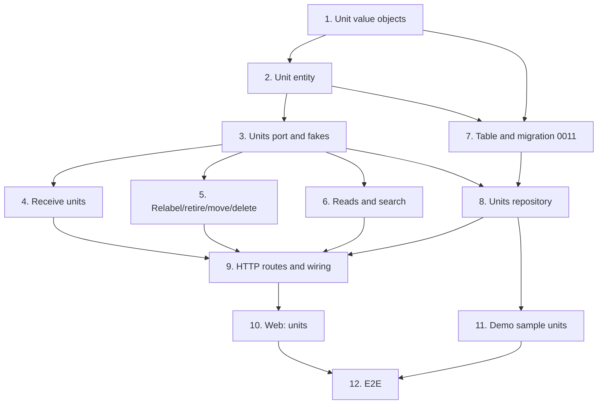

# Implementation Plan

## Overview

Twelve tasks that build the `tracked-units` slice described in [design.md](design.md) and
required by [requirements.md](requirements.md): the `Unit` entity and its value objects in the
`inventory` domain, the unit use cases that ride the inventory-stock ledger, migration `0011`
with the two partial unique indexes and the trigram search, the HTTP routes, the web unit
pages, demo sample units and the end-to-end journey.

This spec extends the `inventory` module the [inventory-stock](../inventory-stock/design.md)
spec created; it adds no module and no cross-module port. It reuses that spec's ledger,
balance projection, `ShortCodes` counter (the `unit` kind) and `Parts` port.

One task, one commit. Every commit has to pass `make check` **on its own**, because `main` is
rebase-merged and each commit lands (AGENTS.md); run `make coverage` on commits that touch SQL,
and `make e2e` on commits that touch the web. Tick the task in this file in the same commit.
Suggested Conventional Commit subjects are in `code` under each task.

Release footer: this spec is **the second of three** in `v0.4.0`, so **no task here carries
`Release-As: 0.4.0`**. That footer belongs on a changing commit in the last spec's PR
(`quick-add-and-import`). See [Notes](#one-pr-per-spec).

## Tasks

- [x] 1. Unit value objects
  - Extend `inventory/domain/values.py`: `UnitId`, `Serial` (trim, cap, `fold()`), `Mac`
    (normalize every accepted spelling to `aa:bb:cc:dd:ee:ff`, reject non-six-octet).
  - Extend `inventory/domain/errors.py`: `DuplicateSerialError`, `DuplicateMacError`,
    `UnitNotFoundError`, `UnitNotRetiredError`, `ReceiveAsLotError`; assert each in
    `tests/inventory/test_errors.py`.
  - `tests/inventory/test_values.py`: `Serial` rules and `fold`, every `Mac` spelling and its
    rejections; **property 5** (any accepted spelling canonicalizes the same) as Hypothesis.
  - `feat(inventory): add unit identity value objects`
  - _Requirements: 5.3, 5.4_

- [x] 2. The unit entity
  - `inventory/domain/unit.py`: `Unit`, `UnitStatus`, `relabel`, `retire`, `unretire`,
    `move_to`; mutators return whether anything changed; `retire`/`unretire` refuse a no-op
    transition.
  - `tests/inventory/test_unit.py`: each transition and its no-op, `move_to` repointing the
    lot, a retired unit's guards.
  - `feat(inventory): add the tracked unit entity`
  - _Requirements: 3.6, 3.7_

- [x] 3. The units port and extended fakes
  - `inventory/application/ports.py`: the `Units` Protocol and `units` on the unit of work.
  - `tests/support/inventory.py`: `InMemoryUnits` (with `in_stock_at`, `search`,
    `serial_taken`, `mac_taken`), seeded through the `World`; the fake `Parts` already answers
    a unit-tracked part from the first spec.
  - Only test: the fakes build and `in_stock_at` counts `in_stock` units of a lot.
  - `feat(inventory): declare the units port`
  - _Requirements: 9.4_

- [x] 4. Receive units
  - `inventory/application/units.py`: `ReceiveUnits` — check the part exists (404) and is
    unit-tracked (422 `ReceiveAsLotError`); find or create the lot; append one `RECEIVE` of N
    and update the balance (the inventory-stock receive path); mint N unit codes via
    `ShortCodes.next(unit)`; apply per-unit serial/MAC, refusing duplicates (409); create the
    units; commit.
  - `tests/inventory/test_unit_use_cases.py`: N units created with consecutive codes and the
    lot balance raised to N; lot-counted part refused; duplicate serial (per part) and MAC
    (per workspace) refused before any write; **property 1** (lot on_hand == in-stock units)
    and **property 4** (codes distinct, consecutive) as Hypothesis tests.
  - `feat(inventory): receive tracked units`
  - _Requirements: 1.1, 1.2, 1.3, 1.4, 1.5, 1.6, 1.7, 2.1, 2.2, 5.1, 5.2, 5.5_

- [x] 5. Relabel, retire, un-retire, move, delete
  - `inventory/application/units.py`: `RelabelUnit`, `RetireUnit` (`ADJUST −1`), `UnretireUnit`
    (`ADJUST +1`, reason `found`), `MoveUnit` (delegate to the two-row `MOVE` of quantity 1,
    then repoint the lot), `DeleteUnit` (only if retired).
  - `tests/inventory/test_unit_use_cases.py`: relabel refusing a duplicate and no-op not
    committing; retire/un-retire writing the compensating movements; move delegating and
    refusing same-location and a retired unit; delete refused unless retired; **property 2**
    (move conserves units and count) and **property 3** (retire↔un-retire is stock-neutral).
  - `feat(inventory): relabel, retire, move and delete units`
  - _Requirements: 3.1, 3.2, 3.3, 3.4, 3.5, 4.1, 4.2, 4.3, 4.4, 4.5, 5.6, 6.4, 6.5_

- [x] 6. Unit reads and search
  - `inventory/application/units.py`: `ListUnitsOfPart`, `ListUnitsOfLocation`, `SearchUnits`.
  - `tests/inventory/test_unit_use_cases.py`: each read; the search matching code, serial and
    MAC, and never another lot's or part's units.
  - `feat(inventory): list and search units`
  - _Requirements: 6.1, 6.2, 6.3, 2.5_

- [x] 7. The units table and migration 0011
  - Extend `inventory/infrastructure/types.py` with `Serial`, `Mac`, `UnitStatus`.
  - `inventory/infrastructure/orm.py`: the `units` table with the per-part lower-cased serial
    index, the per-workspace MAC index, the three trigram indexes, the `status` CHECK, the
    `lot_id` FK; `map_imperatively`.
  - `make migration m="units"`, then fix `0011_units.py` by hand: real `downgrade`, `op.f()`
    on constraints, the partial unique indexes written out, `isolate_by_workspace(op.execute,
    "units")`.
  - `tests/integration/test_migrations.py` covers the round trip; confirm it passes.
  - `feat(inventory): add the units table with workspace isolation`
  - _Requirements: 9.3_

- [x] 8. The units repository
  - `inventory/infrastructure/repositories.py`: `SqlUnits` (the reads, `in_stock_at`, the
    trigram `search`, `serial_taken` folding case, `mac_taken`), every query filtering
    `workspace_id`; bind `units` in `SqlInventoryUnitOfWork.__aenter__`.
  - `tests/integration/test_unit_repositories.py`: the per-part serial index and per-workspace
    MAC index enforced by Postgres, the trigram search, `in_stock_at` counting only `in_stock`.
  - `tests/integration/test_short_codes.py` (extended): a receipt of N advances the `unit`
    counter N times, gap-free, independent of the `location` counter.
  - `tests/integration/test_inventory_isolation.py` (extended): as `wiredex_app`, a unit in A
    is invisible and unwritable from B, and the search never crosses workspaces.
  - `feat(inventory): store units in PostgreSQL`
  - _Requirements: 5.1, 5.2, 6.3, 7.1, 7.2, 7.3, 9.1, 9.2_

- [x] 9. HTTP routes and wiring
  - `inventory/api/schemas.py`: the unit request and response models; the receive body carries
    a list of `{serial?, mac?}` whose length is the quantity; the receive response carries the
    created units and the lot balance.
  - `inventory/api/router.py`: `_add_unit_routes` with the ten routes of the design and the
    extended error mapping; wire the unit use cases in `bootstrap/inventory.py` over the same
    unit-of-work factory and `Parts` port.
  - `tests/inventory/test_unit_api.py`; the unit writes in `tests/inventory/test_inventory_auth.py`
    (401, and 403 without CSRF).
  - Run `make client`, commit the regenerated client.
  - `feat(inventory): expose units over HTTP`
  - _Requirements: 1.5, 1.6, 4.4, 4.5, 6.4, 8.2_

- [x] 10. Web: receive, list and manage units
  - `apps/web/src/features/inventory/units.ts`: query hooks, keys, invalidation.
  - `ReceiveUnitsDialog.tsx` (quantity, destination, per-unit serial/MAC, minted codes shown),
    `UnitsList.tsx`, `UnitPage.tsx`, `UnitSearch.tsx`; `StockByPart` shows *Receive units* and
    mounts `UnitsList` for a unit-tracked part (read from the category's resolved flag); routes
    `/units` and `/units/$unitId` and the *Units* nav entry.
  - `inventory.units.*` keys in **both** `en.json` and `pt-BR.json`; the MAC canonicalization
    shown after it validates.
  - Vitest + MSW for each component, by role and accessible name.
  - `feat(web): receive, list and manage tracked units`
  - _Requirements: 8.1, 8.2, 8.3, 8.4, 8.5, 8.6, 8.7_

- [x] 11. Unit sample data in the demo workspace
  - Extend the demo seeding so `wiredex demo reset` restores a couple of sample units (dev
    boards with a code and a MAC), after the sample stock is restored.
  - `tests/integration/test_demo_cli.py`: after a reset, the demo workspace has its sample
    units back, and only in that workspace.
  - `feat(inventory): seed the demo workspace with sample units`
  - _Requirements: 7.4_

- [~] 12. End-to-end journey
  - `e2e/tests/units.spec.ts` reusing the logged-in session: mark a category tracked
    individually, receive 3 boards into a location (three `WX-U-…` codes, part total 3), give
    one a MAC, move it to a second location, retire it (total 2), find it again by MAC.
  - `test(e2e): cover the tracked-units journey`
  - _Requirements: all, end to end_

## Task Dependency Graph



The same graph as waves: every task in a wave can be worked once the waves above it have
landed.

```json
{
  "waves": [
    { "wave": 1, "tasks": [{ "id": "1", "name": "Unit value objects", "dependsOn": [] }] },
    { "wave": 2, "tasks": [{ "id": "2", "name": "Unit entity", "dependsOn": ["1"] }] },
    {
      "wave": 3,
      "tasks": [
        { "id": "3", "name": "Units port and fakes", "dependsOn": ["2"] },
        { "id": "7", "name": "Table and migration 0011", "dependsOn": ["1", "2"] }
      ]
    },
    {
      "wave": 4,
      "tasks": [
        { "id": "4", "name": "Receive units", "dependsOn": ["3"] },
        { "id": "5", "name": "Relabel/retire/move/delete", "dependsOn": ["3"] },
        { "id": "6", "name": "Reads and search", "dependsOn": ["3"] },
        { "id": "8", "name": "Units repository", "dependsOn": ["3", "7"] }
      ]
    },
    {
      "wave": 5,
      "tasks": [
        {
          "id": "9",
          "name": "HTTP routes and wiring",
          "dependsOn": ["4", "5", "6", "8"]
        },
        { "id": "11", "name": "Demo sample units", "dependsOn": ["8"] }
      ]
    },
    { "wave": 6, "tasks": [{ "id": "10", "name": "Web: units", "dependsOn": ["9"] }] },
    { "wave": 7, "tasks": [{ "id": "12", "name": "E2E", "dependsOn": ["10", "11"] }] }
  ]
}
```

Reading it:

- **Root.** Only 1 depends on nothing. The whole spec is downstream of the inventory-stock
  spec having landed (its ledger, `ShortCodes`, `Parts` port and `SqlInventoryUnitOfWork`),
  which is a phase-level dependency, not a task edge here.
- **Critical path.** 1 → 2 splits into the port (3) and the table (7), which rejoin at the
  application chain (4, 5, 6) and the repository (8), then meet at 9 and run through the web to
  the E2E at 12.
- **Parallel.** 4, 5 and 6 are independent once 3 exists; 11 only needs 8.
- **Why these edges.** Values before the entity, the entity before the port that speaks it, 7
  before 8 because the repository maps the table, and 9 needs both the use cases and the
  repository. The receive use case (4) needs the ledger and `ShortCodes` from inventory-stock;
  the move use case (5) delegates to that spec's `MoveStock`.

## Notes

### Before pushing

- `make check` on every commit, not only the last.
- `make coverage` on commits touching SQL (7, 8, 11): API floor 90 %, web floor 85 %.
- `make e2e` after task 12.
- `make client` must leave `packages/api-client` unchanged by the end (regenerated in 9), or
  CI's contract gate fails.

### One PR per spec

The owner chose one PR per spec for `v0.4.0` (2026-09-26). This spec is the second of three;
open its PR with auto-merge (`gh pr merge N --rebase --auto`), based on `main` after the
inventory-stock PR has merged. The `Release-As: 0.4.0` footer and the release PR belong to the
last spec (`quick-add-and-import`), so production gets the whole Inventory phase at once. Never
merge the release PR (AGENTS.md, Safety) — the owner does.
