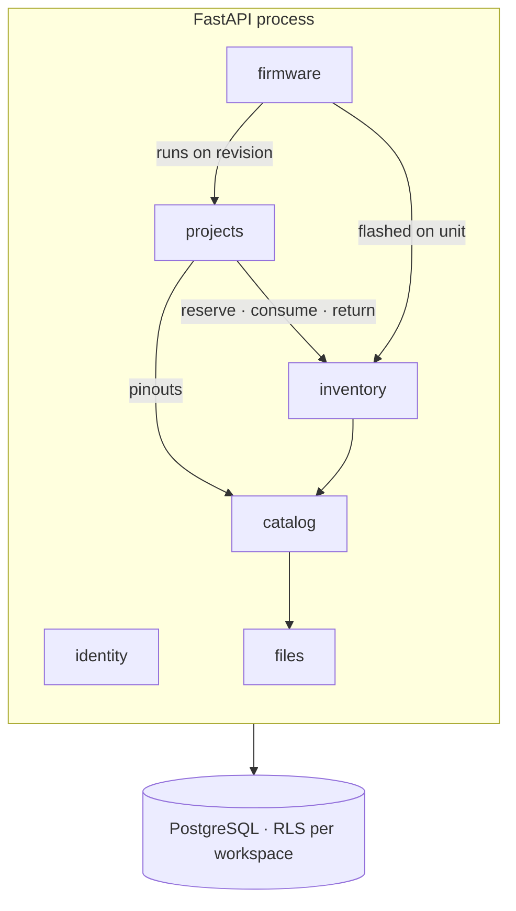
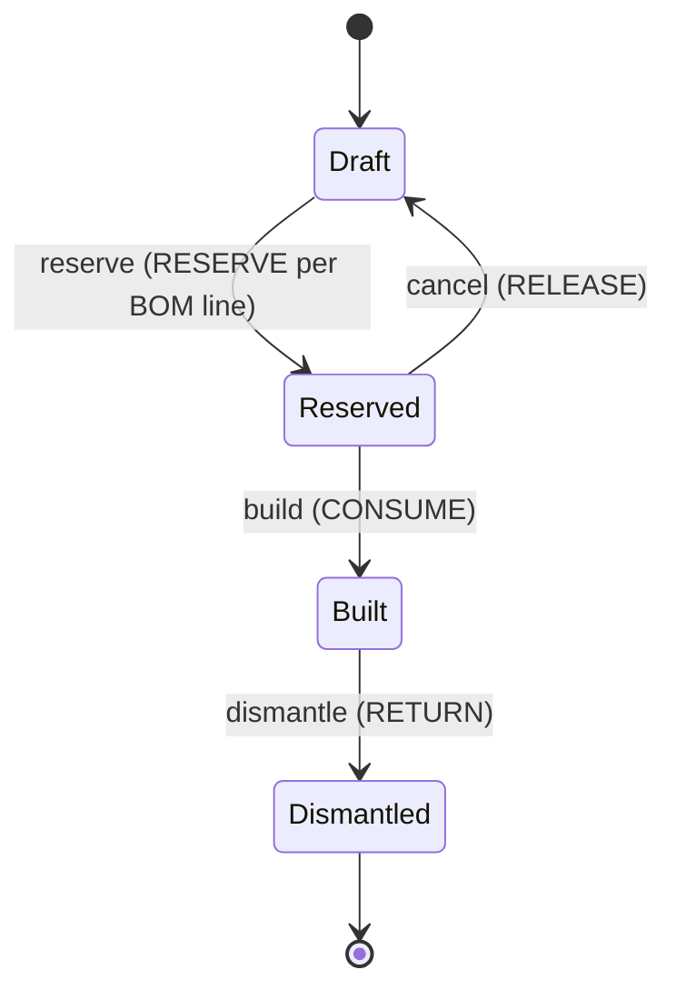

<div align="center">

# ⌁ Wiredex

**A home for every part and every project on your workbench.**

Inventory, bills of materials, wiring, pinouts, datasheets and firmware versions
for a personal hardware lab, all in one place.

[](#roadmap)
[](https://github.com/vinicius-cardoso/wiredex/releases)
[](LICENSE)
[](https://www.conventionalcommits.org)
<br/>


[wiredex.vinilabs.cc](https://wiredex.vinilabs.cc) · [Architecture](docs/architecture.md) · [Decisions](docs/adr/README.md) · [Roadmap](#roadmap)

</div>

---

## Contents

- [Why](#why)
- [Features](#features)
- [Roadmap](#roadmap)
- [Tech stack](#tech-stack)
- [Architecture](#architecture)
- [Repository layout](#repository-layout)
- [Getting started](#getting-started)
- [Quality gates](#quality-gates)
- [Versioning and releases](#versioning-and-releases)
- [Deployment](#deployment)
- [Security](#security)
- [Access and demo accounts](#access-and-demo-accounts)
- [Conventions](#conventions)
- [License](#license)

## Why

I have boxes full of components and a trail of projects built from them. Without
one place to track it all, the same questions keep coming back:

- *Do I still have a BME280, and which drawer is it in?*
- *Which pin did I wire SDA to on the weather station, v1 or v2?*
- *Which firmware version is running on the greenhouse ESP32 right now?*
- *If I build this again, what am I missing?*

Spreadsheets, photos of breadboards and a folder of PDFs answer some of that,
badly. Wiredex answers all of it from one searchable, structured source.

## Features

| Area | What it does |
| --- | --- |
| 🧩 **Parts catalog** | Part definitions with manufacturer, MPN, package and typed attributes per category (resistance, tolerance, flash, I²C address…). Engineering notation (`4k7`, `100n`) is normalized to SI units, so parametric search works. |
| 📦 **Inventory** | Nested locations (room → cabinet → drawer → bin) with printable **QR labels**. Stock is kept in an append-only **ledger** of receive, move, reserve, consume and return movements, with on-hand, reserved and available always correct. Boards that matter individually are tracked as **units**. |
| 🛠️ **Projects & revisions** | Projects evolve through revisions (breadboard → perfboard → PCB). Each revision has its own BOM, wiring and firmware line. Moving a revision to *Reserved* reserves stock, *Built* consumes it, and *Dismantled* returns it. |
| 🧾 **Bill of materials** | Designators (`R1–R4`), quantities, notes and a live shortage report against available stock. |
| 🔌 **Pinouts** | Structured pin tables per part: number, label, type, alternate functions (`ADC1_CH6`, `SDA`) and voltage level. |
| 🧵 **Wiring (netlist)** | Nets connect real pins (`U1.GPIO21 ↔ U2.SDA`) with wire colors. Validation catches unknown pins, pins used twice, 5 V on 3.3 V pins and more. Everything is queryable ("what's on GPIO4?"). |
| 💾 **Firmware** | Versioned source snapshots (single `.ino` or multi-file) with a changelog, syntax highlighting, one-click copy and a diff between versions. A **flash log** records which version is on which physical board. |
| 📄 **Datasheets & files** | PDFs, images and pinout diagrams attached to parts and projects. Storage is content-addressed, so the same datasheet is stored once. |
| 🔐 **Private by default** | Login only, no public sign-up. Guests get an **isolated demo workspace** with sample data, reset nightly. |
| 🌗 **Themes** | Light, dark and **system** theme, chosen per user. |
| 🌎 **Languages** | English and Português (Brasil). |
| 🏷️ **Version on screen** | The footer shows the running version and commit (`Wiredex v0.4.2 · a1b2c3d`) and warns when a stale tab is out of date. |
| 📱 **Mobile (planned)** | React Native app sharing the API client, translations and design tokens, with QR scanning of bins and boards. |

## Roadmap

Each phase ships as a **minor release** and has a matching
[GitHub Milestone](https://github.com/vinicius-cardoso/wiredex/milestones).
`1.0.0` is the first release I'd trust with my whole inventory.

### ✅ Groundwork

- [x] Repository, license (GPL-3.0) and editor config
- [x] Product interview and domain decisions ([ADRs 0002–0007](docs/adr/README.md))
- [x] Architecture proposal ([docs/architecture.md](docs/architecture.md))
- [x] Versioning strategy ([ADR 0012](docs/adr/0012-versioning-and-releases.md))
- [x] Theme picker with ten font and palette directions ([docs/design/theme-picker.html](docs/design/theme-picker.html))
- [ ] System design pass: accept or revise the *Proposed* ADRs
- [x] Visual identity: fonts and palette ([docs/design/visual-identity.md](docs/design/visual-identity.md))
- [ ] Logo and favicon

### `v0.1.0` · Foundations

- [ ] Monorepo scaffold: `apps/api` (uv), `apps/web` (Vite), pnpm workspaces
- [ ] Docker Compose for local development (api, db, web with hot reload)
- [ ] CI quality gates (lint, types, architecture, unit, integration, e2e, security)
- [ ] release-please: changelog, tags, GitHub Releases
- [ ] `GET /api/health`, `GET /api/version` and the version badge in the footer
- [ ] App shell: layout, routing, light / dark / system theme, EN / PT-BR
- [ ] Production deploy on `wiredex.vinilabs.cc` (Caddy + GHCR + Compose)
- [ ] Nightly off-box backups, with one restore drill done

### `v0.2.0` · Access

- [ ] Users, workspaces and memberships
- [ ] Login and logout with opaque sessions (cookie for web, bearer for mobile)
- [ ] Argon2id hashing and login rate limiting
- [ ] Postgres Row-Level Security per workspace
- [ ] CLI: `wiredex users create`, `wiredex demo invite --expires 7d`
- [ ] Demo workspace seed and nightly reset
- [ ] Sessions page (list and revoke devices)

### `v0.3.0` · Catalog

- [ ] Category tree with attribute schemas
- [ ] Part definitions with typed, validated attributes
- [ ] Engineering-notation parsing and SI normalization
- [ ] Structured pinouts (pin table editor, CSV paste)
- [ ] Attachments: datasheets, images, pinout diagrams
- [ ] Parametric search and filters

### `v0.4.0` · Inventory

- [ ] Location tree and QR label sheet generation
- [ ] Stock lots and the movement ledger (receive, adjust, move)
- [ ] Balances projection and `wiredex stock rebuild`
- [ ] Tracked units (label, serial or MAC)
- [ ] Keyboard-first quick-add and duplicate-part
- [ ] CSV import with validated preview

### `v0.5.0` · Projects & BOM

- [ ] Projects with description, tags and photos
- [ ] Revisions, including forking from an existing revision
- [ ] BOM editor with designators and a shortage report
- [ ] Build lifecycle: reserve, cancel, build, dismantle, each with its ledger effect

### `v0.6.0` · Wiring

- [ ] Netlist editor on top of real pinouts
- [ ] Validation rules (unknown pin, pin reuse, voltage mismatch, input-only driven)
- [ ] Pin usage view per part ("what's on GPIO4?")

### `v0.7.0` · Firmware

- [ ] Firmware per board target, linked to revisions
- [ ] Versions with source files, changelog and immutability after release
- [ ] Syntax-highlighted viewer, copy per file, diff between versions
- [ ] Flash log per unit, with the current version shown on the unit page

### `v0.8.0` · Everyday use

- [ ] Dashboard: parts tied up in builds, recent activity, shortages
- [ ] Command palette (`Ctrl K`) and global search
- [ ] Audit log from domain events
- [ ] Soft delete with a trash view

### `v1.0.0` · MVP

- [ ] All of the above in daily use with my real inventory
- [ ] Documentation for self-hosting

### Later

- [ ] 📱 React Native (Expo) app with QR scanning
- [ ] 📷 Parse part labels from a phone photo
- [ ] 🔎 Auto-fill part data from an MPN (LCSC / Octopart / Nexar)
- [ ] 🛒 Supplier links, unit prices and BOM cost *(manual fields first)*
- [ ] 🔔 Minimum stock and reorder list
- [ ] 🧷 Rendered wiring diagram from the netlist
- [ ] ⚡ Flash firmware from the browser (WebSerial / esptool-js)
- [ ] 🔗 Link firmware to a git repository and commit
- [ ] 🔑 TOTP second factor and passkeys
- [ ] 📥 KiCad BOM import

## Tech stack

| Layer | Choice | Why |
| --- | --- | --- |
| API | **FastAPI** · Python 3.14 | Typed, async, OpenAPI for free |
| ORM & migrations | **SQLAlchemy 2.0** (async, asyncpg) · **Alembic** | Mature, and imperative mapping keeps the domain free of ORM |
| Validation | **Pydantic v2** at the edges only | Request and response schemas, settings |
| Database | **PostgreSQL 17** | JSONB + GIN for attributes, `pg_trgm` + full-text search, Row-Level Security |
| Python tooling | **uv**, **ruff**, **mypy --strict**, **import-linter** | Fast, strict, enforces the architecture |
| Web | **React 19** · **TypeScript** (strict) · **Vite** | |
| Routing & data | **TanStack Router** · **TanStack Query** | Type-safe routes, server-state cache |
| API client | **openapi-typescript** + **openapi-fetch** | Generated from the backend and shared with mobile |
| UI | **Tailwind CSS v4** + owned components on **Radix** primitives | Accessible, themeable through CSS variables |
| Forms | **React Hook Form** + **Zod** | |
| i18n | **react-i18next** | EN / PT-BR, shared with mobile |
| Code viewer | **CodeMirror 6** | Firmware highlighting and diffs |
| Web tooling | **pnpm** workspaces, **Biome** | One fast linter and formatter |
| Tests | **pytest**, **Hypothesis**, **testcontainers**, **schemathesis**, **Vitest**, **Testing Library**, **MSW**, **Playwright** | See [testing strategy](docs/architecture.md#8-testing-strategy) |
| Delivery | **GitHub Actions**, **GHCR**, **release-please**, **Docker Compose**, **Caddy** | |
| Mobile *(later)* | **Expo** + React Native | Reuses the client, i18n and tokens |

<details>
<summary><b>What changed from the original stack, and why</b></summary>

The stack you asked for (FastAPI, React, React Native later, PostgreSQL,
SQLAlchemy) is kept. Additions:

- **TypeScript + TanStack Query/Router.** Types end to end, with the API client
  generated from OpenAPI, so web and mobile never drift from the backend.
- **Async SQLAlchemy with one uvicorn worker.** This handles the load well on
  a host with under 1 GB of RAM, where several sync workers would not fit.
- **Postgres does search, jobs and isolation.** Full-text, `pg_trgm`, RLS, and
  `SKIP LOCKED` queues if ever needed. No Elasticsearch, Redis or Celery.
- **Opaque sessions instead of JWT.** Simpler and revocable, and works for both
  cookies (web) and bearer tokens (mobile).
- **uv, ruff and Biome.** One fast tool per ecosystem for installing, linting
  and formatting.

</details>

## Architecture

A **modular monolith**: one FastAPI process with one module per bounded
context. Each module is layered as **ports and adapters**, and the boundaries
are enforced in CI.



Inside each module, dependencies point inward:

```
api (FastAPI routers)  ─┐
                        ├─►  application (use cases, ports)  ─►  domain (pure Python)
infrastructure (SQL)   ─┘
```

Patterns in use: Repository, Unit of Work, light CQRS (command and query
handlers), Value Objects and first-class collections, State (revision
lifecycle), Strategy (attribute validators, netlist rules), Specification
(parametric search), domain events and module facades. Object calisthenics is
applied strictly in the domain layer and deliberately *not* in DTOs, ORM
mappings or React components.

➡️ Full write-up with diagrams: **[docs/architecture.md](docs/architecture.md)**
➡️ Every decision and its trade-offs: **[docs/adr/](docs/adr/README.md)**

### Stock lifecycle



## Repository layout

> Planned. The scaffold lands in `v0.1.0`.

```
wiredex/
├── apps/
│   ├── api/                  # FastAPI · uv project
│   │   ├── src/wiredex/
│   │   │   ├── shared_kernel/
│   │   │   ├── identity/     # each module: domain/ application/ infrastructure/ api/
│   │   │   ├── catalog/
│   │   │   ├── inventory/
│   │   │   ├── projects/
│   │   │   ├── firmware/
│   │   │   ├── files/
│   │   │   └── bootstrap/    # composition root, settings, app factory, CLI
│   │   ├── migrations/
│   │   └── tests/            # unit/ integration/ contract/
│   ├── web/                  # React + Vite
│   └── mobile/               # Expo (later)
├── packages/
│   ├── api-client/           # generated from OpenAPI
│   └── i18n/                 # EN / PT-BR catalogs
├── e2e/                      # Playwright
├── deploy/                   # compose.prod.yml, Caddy snippet, backup scripts
├── docs/
│   ├── architecture.md
│   ├── adr/
│   └── design/
└── .github/workflows/
```

## Getting started

**Requirements:** [uv](https://docs.astral.sh/uv/), Node 24 and Docker. You don't
need a global pnpm: `make` uses the version pinned in `package.json` through `npx`.

```bash
git clone git@github.com:vinicius-cardoso/wiredex.git
cd wiredex
make install      # uv sync + pnpm install
make hooks        # pre-commit and commit-msg hooks
make check        # lint, types and tests, same as CI
```

Run `make` with no target to list everything.

| Command | What it does | Status |
| --- | --- | --- |
| `make install` | Install Python and Node dependencies | ✅ |
| `make hooks` | Install the pre-commit (ruff, Biome, gitleaks) and commit-msg hooks | ✅ |
| `make lint` / `make format` | Check or fix lint and formatting | ✅ |
| `make typecheck` | mypy `--strict` | ✅ |
| `make test` | Unit tests with coverage | ✅ |
| `make check` | Everything CI runs, locally | ✅ |
| `make api` / `make web` | Dev servers with hot reload | planned (`v0.1.0`) |
| `make test-integration` | Backend tests against a throwaway Postgres | planned |
| `make e2e` | Playwright against the full compose stack | planned |
| `make client` | Regenerate `packages/api-client` from OpenAPI | planned |
| `make migration m="add units"` | Autogenerate an Alembic revision | planned |

## Quality gates

Every pull request must pass all of these before merge:

| Gate | Tools | Fails when |
| --- | --- | --- |
| Lint & format | ruff, Biome | Any violation |
| Types | mypy `--strict`, `tsc --noEmit` | Any error |
| Architecture | import-linter | Domain imports a framework, or a module bypasses a facade |
| Backend unit | pytest + Hypothesis | Failure, or domain + application coverage < 90 % |
| Backend integration | pytest + Postgres | Failure, RLS leak, or migration round-trip fails |
| Migrations | `alembic check` | Models and migrations disagree |
| Contract | client regeneration, schemathesis | Generated client differs, or an endpoint breaks its schema |
| Frontend unit | Vitest + Testing Library + MSW | Failure, or coverage < 70 % |
| E2E | Playwright | A critical journey fails (traces attached) |
| Security | gitleaks, pip-audit, osv-scanner, Trivy | Secret committed, or a known high/critical vulnerability |
| Commits | commitlint | PR title or commit is not a Conventional Commit |

After a release: image build → deploy → migrations → health check → Playwright
smoke test → **automatic rollback** if anything fails.

## Versioning and releases

- **[SemVer](https://semver.org).** `0.x` until the MVP, and each roadmap phase is a minor version.
- **[Conventional Commits](https://www.conventionalcommits.org).** Commit types drive version bumps and changelog sections.
- **[release-please](https://github.com/googleapis/release-please).** It keeps a release PR open on `main`. Merging it
  tags `vX.Y.Z`, updates `CHANGELOG.md` (created by the first release) and publishes a
  [GitHub Release](https://github.com/vinicius-cardoso/wiredex/releases).
- **Deploys follow releases**, not every push. Images are tagged `vX.Y.Z` and `sha-<short>`.
- **[Milestones](https://github.com/vinicius-cardoso/wiredex/milestones)** track the planned work for each version.
- **The version is always visible.** The app footer shows `Wiredex vX.Y.Z · <commit>`,
  and `GET /api/version` returns `{ version, commit, built_at }`.

## Deployment

Wiredex runs next to [vinilabs.cc](https://vinilabs.cc) on a small OCI VM
(2 cores, under 1 GB of RAM):

- **Caddy** terminates TLS for `wiredex.vinilabs.cc`, serves the static SPA and
  proxies `/api/*` to the API container.
- **Docker Compose** runs `api` (one uvicorn worker) and `db` (Postgres tuned small).
- **Nothing is built on the server.** GitHub Actions builds, and the server pulls the image.
- **systemd timers** run the nightly demo reset and the backups.
- **Backups:** nightly `pg_dump` plus uploads, sent off-box and encrypted.

Details and the memory budget are in [ADR 0009](docs/adr/0009-single-host-deployment.md).

## Security

- No public sign-up. Accounts are created from the CLI.
- Argon2id password hashing, and login rate limiting per IP and per account.
- Session tokens are opaque and random, stored only as SHA-256 hashes, and can be revoked.
- Web cookies are `__Host-`, `HttpOnly`, `Secure` and `SameSite=Lax`, with a CSRF header on unsafe methods.
- Workspace isolation is enforced twice: in repositories and with **Postgres Row-Level Security**.
- Strict security headers (CSP, HSTS, `nosniff`, `frame-ancestors 'none'`).
- Uploads are checked by content type, capped in size, and served only to authenticated users.
- Secrets live in environment variables and GitHub Environments, never in the repo. gitleaks runs in CI and pre-commit.

## Access and demo accounts

Wiredex is private. To let someone try it:

```bash
wiredex demo invite --email friend@example.com --expires 7d
```

This creates an account inside a separate **demo workspace** with sample
projects, parts and firmware. The guest has full access there, never sees the
real inventory, and the workspace resets every night.

## Conventions

- **Clean Code and SOLID** throughout. **Object calisthenics** in the domain
  layer ([scope and rules](docs/architecture.md#6-object-calisthenics-where-it-applies-and-where-it-doesnt)).
- **Conventional Commits**: small, focused commits, one concern each.
- **ADRs** for every decision that is costly to reverse ([template](docs/adr/template.md)).
- **Trunk-based**: short-lived branches, PRs into `main`, linear history.
- **Tests first** where the logic lives: domain and application.

## License

[GNU General Public License v3.0](LICENSE) © Vinícius Cardoso
