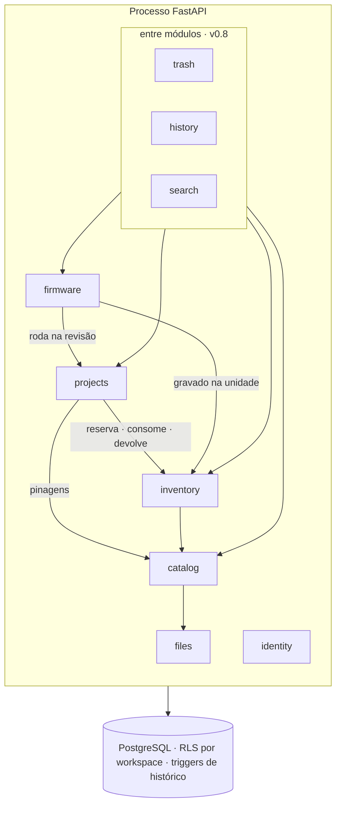
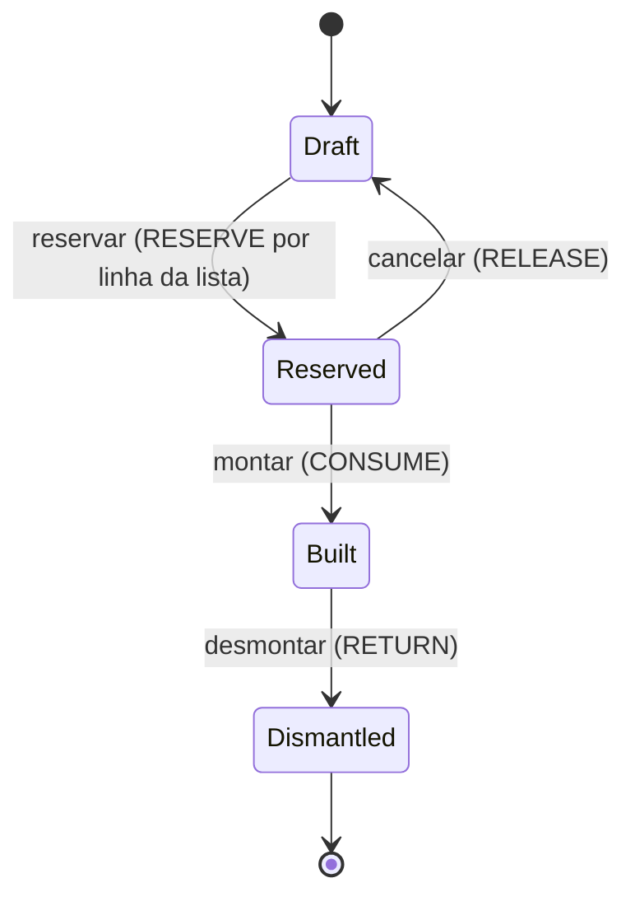

<div align="center">

[English](README.md) · **Português (Brasil)**

# ⌁ Wiredex

**Um lugar para cada peça e cada projeto da sua bancada.**

Estoque, listas de materiais, fiação, pinagens, datasheets e versões de firmware
de um laboratório pessoal de hardware, tudo em um só lugar.

[](#roadmap)
[](https://github.com/vinicius-cardoso/wiredex/releases)
[](LICENSE)
[](https://www.conventionalcommits.org)
<br/>


[wiredex.vinilabs.cc](https://wiredex.vinilabs.cc) · [Arquitetura](docs/architecture.pt-BR.md) · [Decisões](docs/adr/README.pt-BR.md) · [Hospedagem própria](docs/self-hosting.pt-BR.md) · [Roadmap](#roadmap)

</div>

---

## Conteúdo

- [Por quê](#por-quê)
- [Funcionalidades](#funcionalidades)
- [Roadmap](#roadmap)
- [Tecnologias](#tecnologias)
- [Arquitetura](#arquitetura)
- [Estrutura do repositório](#estrutura-do-repositório)
- [Como começar](#como-começar)
- [Portões de qualidade](#portões-de-qualidade)
- [Versionamento e releases](#versionamento-e-releases)
- [Deploy](#deploy)
- [Segurança](#segurança)
- [Acesso e contas de demonstração](#acesso-e-contas-de-demonstração)
- [Convenções](#convenções)
- [Licença](#licença)

## Por quê

Tenho caixas cheias de componentes e uma trilha de projetos montados com eles. Sem
um lugar único para acompanhar tudo, as mesmas perguntas sempre voltam:

- *Ainda tenho um BME280? Em qual gaveta ele está?*
- *Em qual pino liguei o SDA na estação meteorológica, v1 ou v2?*
- *Qual versão do firmware está rodando agora no ESP32 da estufa?*
- *Se eu montar isto de novo, o que está faltando?*

Planilhas, fotos de protoboards e uma pasta de PDFs respondem parte disso, e
mal. O Wiredex responde tudo a partir de uma única fonte estruturada e pesquisável.

## Funcionalidades

| Área | O que faz |
| --- | --- |
| 🧩 **Catálogo de peças** | Definições de peças com fabricante, MPN, encapsulamento e atributos tipados por categoria (resistência, tolerância, flash, endereço I²C…). A notação de engenharia (`4k7`, `100n`) é normalizada para unidades do SI, então a busca paramétrica funciona. |
| 📦 **Estoque** | Locais aninhados (sala → armário → gaveta → compartimento) com **códigos curtos** legíveis (`WX-L-0007`) que você pode buscar. O estoque fica em um **livro-razão** só de acréscimo, com movimentos de recebimento, mudança de local, reserva, consumo e devolução, e os saldos em estoque, reservado e disponível estão sempre corretos. As placas que importam individualmente são rastreadas como **unidades**. |
| 🛠️ **Projetos e revisões** | Os projetos evoluem por revisões (protoboard → placa perfurada → PCB). Cada revisão tem sua própria lista de materiais, fiação e linha de firmware. Passar uma revisão para *Reservada* reserva o estoque, *Montada* o consome e *Desmontada* o devolve. |
| 🧾 **Lista de materiais** | Designadores (`R1–R4`), quantidades, observações e um relatório de faltas ao vivo contra o estoque disponível. |
| 🔌 **Pinagens** | Tabelas de pinos estruturadas por peça: número, rótulo, tipo, funções alternativas (`ADC1_CH6`, `SDA`) e nível de tensão. |
| 🧵 **Fiação (netlist)** | As redes conectam pinos reais (`U1.GPIO21 ↔ U2.SDA`) com cores de fio. A validação pega pinos desconhecidos, pinos usados duas vezes, 5 V em pinos de 3,3 V e mais. Tudo pode ser consultado ("o que está no GPIO4?"). As redes de cada revisão também são **desenhadas como um diagrama**: cada peça com seus pinos ligados, cada rede um fio na sua cor. |
| 💾 **Firmware** | Snapshots versionados do código-fonte (um único `.ino` ou vários arquivos) com changelog e diff entre versões. Uma versão se lê como uma pasta: a lista dos seus arquivos, cada um aberto com um clique, com realce de sintaxe e cópia em um clique. Um **registro de gravações** diz qual versão está em qual placa física, e uma placa ESP pode ser **gravada pelo navegador** por USB (Chrome ou Edge), o que registra a gravação assim que ela é verificada. Uma versão publicada guarda os seus **builds**, gerados por um comando a partir do próprio código-fonte, então gravar é escolher uma placa e conectar. |
| 📄 **Datasheets e arquivos** | PDFs, imagens e diagramas de pinagem anexados a peças e projetos. O armazenamento é endereçado por conteúdo, então o mesmo datasheet é guardado uma vez só. |
| 🏠 **Painel e paleta** | A página em que o app abre conta o que a bancada guarda (peças, placas, projetos, firmware, locais) e mostra as peças presas em montagens, os rascunhos com peças em falta e as mudanças mais recentes. `Ctrl K` abre uma paleta que encontra qualquer peça, unidade, projeto, firmware, categoria ou local enquanto você digita, e executa comandos. |
| 🕘 **Histórico e lixeira** | Toda mudança fica guardada com quem a fez, quando, e os valores de antes e depois. Cada página tem uma linha do tempo, o workspace tem um feed de atividade, e uma versão anterior pode ser restaurada como uma nova mudança. Peças, unidades, projetos e firmware excluídos vão para uma lixeira e voltam inteiros. |
| 🧭 **Tour guiado** | Um passeio aponta cada parte do app, e depois uma lista curta de primeiras coisas a fazer se marca sozinha conforme a bancada enche. A página de cada módulo tem um tour curto próprio. É oferecido uma vez no painel, e está sempre no menu da conta e na paleta. |
| 🔐 **Privado por padrão** | Só login, sem cadastro público. Convidados recebem um **workspace de demonstração isolado** com dados de exemplo, reiniciado toda noite. Um dono compartilha um pelo menu da conta, por 1 a 90 dias, e repassa o login. |
| 🌗 **Temas** | Tema claro, escuro e **do sistema**, escolhido por usuário. |
| 🌎 **Idiomas** | English e Português (Brasil). |
| 🏷️ **Versão na tela** | O rodapé mostra a versão e o commit em execução (`Wiredex v0.4.2 · a1b2c3d`) e avisa quando uma aba antiga está desatualizada. |
| 📱 **Mobile (planejado)** | App em React Native que compartilha o cliente da API, as traduções e os tokens de design, com leitura de QR de compartimentos e placas. |

## Roadmap

Cada fase sai como uma **versão minor** e tem um
[Milestone no GitHub](https://github.com/vinicius-cardoso/wiredex/milestones) correspondente.
A `1.0.0` é a primeira versão a que eu confiaria meu estoque inteiro.

### ✅ Preparação

- [x] Repositório, licença (GPL-3.0) e configuração do editor
- [x] Entrevista de produto e decisões de domínio ([ADRs 0002–0007](docs/adr/README.pt-BR.md))
- [x] Proposta de arquitetura ([docs/architecture.pt-BR.md](docs/architecture.pt-BR.md))
- [x] Estratégia de versionamento ([ADR 0012](docs/adr/0012-versioning-and-releases.md))
- [x] Seletor de temas com dez direções de fontes e paletas ([docs/design/theme-picker.html](docs/design/theme-picker.html))
- [x] Rodada de design do sistema: os 12 ADRs aceitos
- [x] Identidade visual: fontes e paleta ([docs/design/visual-identity.md](docs/design/visual-identity.md))
- [x] Logo e favicon: o chip do cabeçalho do app ([apps/web/public/favicon.svg](apps/web/public/favicon.svg))

### `v0.1.0` · Fundações

- [x] Estrutura do monorepo: `apps/api` (uv), `apps/web` (Vite), workspaces do pnpm
- [x] Postgres no Docker Compose para desenvolvimento local (API e web rodam na máquina com hot reload)
- [x] Portões de qualidade no CI (lint, tipos, arquitetura, unidade, integração, e2e, segurança)
- [x] release-please: changelog, tags, GitHub Releases
- [x] `GET /api/health`, `GET /api/version` e o selo de versão no rodapé
- [x] Casca do app: layout, rotas, tema claro / escuro / do sistema, EN / PT-BR
- [x] Deploy de produção em `wiredex.vinilabs.cc` (Caddy + GHCR + Compose)
- [x] Backups noturnos fora da máquina, com uma simulação de restauração feita

### `v0.2.0` · Acesso

- [x] Usuários, workspaces e participações
- [x] Login e logout com sessões opacas (cookie para a web, bearer para o mobile)
- [x] Hash Argon2id e limite de tentativas de login
- [x] Row-Level Security do Postgres por workspace
- [x] CLI: `wiredex users create`, `wiredex demo invite --expires 7d`
- [x] Workspace de demonstração e sua reinicialização noturna (os dados de exemplo crescem conforme cada módulo chega)
- [x] Página de sessões (listar e revogar dispositivos)

### `v0.3.0` · Catálogo

- [x] Árvore de categorias com esquemas de atributos
- [x] Definições de peças com atributos tipados e validados
- [x] Leitura da notação de engenharia e normalização para o SI
- [x] Pinagens estruturadas (editor de tabela de pinos, colagem de CSV)
- [x] Anexos: datasheets, imagens, diagramas de pinagem
- [x] Busca paramétrica e filtros

### `v0.4.0` · Estoque

- [x] Árvore de locais com códigos curtos legíveis
- [x] Lotes de estoque e o livro-razão de movimentos (receber, ajustar, mover)
- [x] Projeção de saldos e `wiredex stock rebuild`
- [x] Unidades rastreadas (etiqueta, número de série ou MAC)
- [x] Cadastro rápido pelo teclado e duplicação de peça
- [x] Importação de CSV com prévia validada

### `v0.5.0` · Projetos e lista de materiais

- [x] Projetos com descrição, tags e fotos
- [x] Revisões, incluindo o fork de uma revisão existente
- [x] Editor da lista de materiais com designadores e relatório de faltas
- [x] Ciclo de vida da montagem: reservar, cancelar, montar, desmontar, cada um com seu efeito no livro-razão

### `v0.6.0` · Fiação

- [x] Editor de netlist sobre pinagens reais
- [x] Regras de validação (pino desconhecido, pino reutilizado, tensão incompatível, pino só de entrada acionado)
- [x] Visão de uso de pinos por peça ("o que está no GPIO4?")

### `v0.7.0` · Firmware

- [x] Firmware por placa-alvo, ligado a revisões
- [x] Versões com arquivos-fonte, changelog e imutabilidade depois de lançadas
- [x] Visualizador com realce de sintaxe, cópia por arquivo, diff entre versões
- [x] Registro de gravações por unidade, com a versão atual na página da unidade

### `v0.8.0` · Uso diário

- [x] Painel: peças presas em montagens, atividade recente, faltas
- [x] Paleta de comandos (`Ctrl K`) e busca global
- [x] Histórico de tudo: cada mudança com quem, quando e antes/depois, uma linha do tempo em
      cada página, um feed de atividade do workspace, e a restauração de uma versão passada
      (uma restauração é ela mesma uma nova mudança, então nada se perde). Os dados criados
      antes desta versão começam seu histórico aqui
- [x] Exclusão reversível com uma tela de lixeira

### `v1.0.0` · MVP

- [ ] Tudo acima em uso diário com meu estoque real
- [x] Documentação de hospedagem própria ([docs/self-hosting.pt-BR.md](docs/self-hosting.pt-BR.md))

### Depois

- [ ] 📱 App em React Native (Expo) com leitura de QR
- [ ] 📷 Ler etiquetas de peças a partir de uma foto do celular
- [ ] 🔎 Preencher os dados da peça a partir de um MPN (LCSC / Octopart / Nexar)
- [ ] 🛒 Links de fornecedores, preços unitários e custo da lista de materiais *(campos manuais primeiro)*
- [ ] 🔔 Estoque mínimo e lista de reposição
- [x] 🧷 Diagrama de fiação desenhado a partir da netlist
- [x] ⚡ Gravar firmware pelo navegador (WebSerial / esptool-js)
- [ ] 🔗 Ligar o firmware a um repositório git e a um commit
- [ ] 🔑 Segundo fator TOTP e passkeys
- [ ] 📥 Importação de lista de materiais do KiCad

## Tecnologias

| Camada | Escolha | Por quê |
| --- | --- | --- |
| API | **FastAPI** · Python 3.14 | Tipada, assíncrona, OpenAPI de graça |
| ORM e migrações | **SQLAlchemy 2.0** (async, asyncpg) · **Alembic** | Maduro, e o mapeamento imperativo mantém o domínio livre do ORM |
| Validação | **Pydantic v2** só nas bordas | Esquemas de requisição e resposta, configurações |
| Banco de dados | **PostgreSQL 18** | JSONB + GIN para atributos, `pg_trgm` + busca textual, Row-Level Security |
| Ferramentas Python | **uv**, **ruff**, **mypy --strict**, **import-linter** | Rápidas, estritas, impõem a arquitetura |
| Web | **React 19** · **TypeScript** (strict) · **Vite** | |
| Rotas e dados | **TanStack Router** · **TanStack Query** | Rotas tipadas, cache do estado do servidor |
| Cliente da API | **openapi-typescript** + **openapi-fetch** | Gerado a partir do backend e compartilhado com o mobile |
| UI | **Tailwind CSS v4** + componentes próprios sobre primitivos do **Radix** | Acessível, com temas por variáveis CSS |
| Formulários | **React Hook Form** + **Zod** | |
| i18n | **react-i18next** | EN / PT-BR, compartilhado com o mobile |
| Visualizador de código | **Lezer** (os parsers do CodeMirror 6) + **jsdiff** | Realce e diffs de firmware no navegador. Sem a view de editor: ela injeta estilos inline, que o `style-src 'self'` da CSP recusa |
| Gravação | **esptool-js** sobre **Web Serial** · **arduino-cli** | Grava uma placa ESP pelo navegador, em um chunk lazy, a partir de um build armazenado com a versão ou de arquivos do computador. O `wiredex firmware build` compila uma versão no seu computador e armazena o resultado; o servidor não compila nada |
| Ferramentas web | workspaces do **pnpm**, **Biome** | Um único linter e formatador, rápido |
| Testes | **pytest**, **Hypothesis**, **testcontainers**, **schemathesis**, **Vitest**, **Testing Library**, **MSW**, **Playwright** | Veja a [estratégia de testes](docs/architecture.pt-BR.md#8-estratégia-de-testes) |
| Entrega | **GitHub Actions**, **GHCR**, **release-please**, **Docker Compose**, **Caddy** | |
| Mobile *(depois)* | **Expo** + React Native | Reaproveita o cliente, o i18n e os tokens |

<details>
<summary><b>O que mudou em relação à stack original, e por quê</b></summary>

A stack que você pediu (FastAPI, React, React Native depois, PostgreSQL,
SQLAlchemy) foi mantida. Acréscimos:

- **TypeScript + TanStack Query/Router.** Tipos de ponta a ponta, com o cliente da API
  gerado a partir do OpenAPI, então web e mobile nunca se afastam do backend.
- **SQLAlchemy assíncrono com um worker do uvicorn.** Isso aguenta bem a carga em
  uma máquina com menos de 1 GB de RAM, onde vários workers síncronos não caberiam.
- **O Postgres faz busca, jobs e isolamento.** Busca textual, `pg_trgm`, RLS, e
  filas com `SKIP LOCKED` se um dia forem necessárias. Sem Elasticsearch, Redis ou Celery.
- **Sessões opacas em vez de JWT.** Mais simples e revogáveis, e funcionam tanto com
  cookies (web) quanto com tokens bearer (mobile).
- **uv, ruff e Biome.** Uma ferramenta rápida por ecossistema para instalar, lintar
  e formatar.

</details>

## Arquitetura

Um **monólito modular**: um processo FastAPI com um módulo por contexto
delimitado. Cada módulo é organizado em camadas como **portas e adaptadores**, e os
limites são impostos no CI.



Dentro de cada módulo, as dependências apontam para dentro:

```
api (routers FastAPI)  ─┐
                        ├─►  application (casos de uso, portas)  ─►  domain (Python puro)
infrastructure (SQL)   ─┘
```

Padrões em uso: Repository, Unit of Work, CQRS leve (handlers de comando e de
consulta), Value Objects e coleções de primeira classe, State (ciclo de vida da
revisão), Strategy (validadores de atributos, regras da netlist), Specification
(busca paramétrica), eventos de domínio e fachadas de módulo. Object calisthenics é
aplicado com rigor na camada de domínio e, de propósito, *não* em DTOs, mapeamentos
do ORM ou componentes React.

➡️ Texto completo com diagramas: **[docs/architecture.pt-BR.md](docs/architecture.pt-BR.md)**
➡️ Cada decisão e seus custos: **[docs/adr/](docs/adr/README.pt-BR.md)**

### Ciclo de vida do estoque



## Estrutura do repositório

> Planejado. A estrutura chega na `v0.1.0`.

```
wiredex/
├── apps/
│   ├── api/                  # FastAPI · projeto uv
│   │   ├── src/wiredex/
│   │   │   ├── shared_kernel/
│   │   │   ├── identity/     # cada módulo: domain/ application/ infrastructure/ api/
│   │   │   ├── catalog/
│   │   │   ├── inventory/
│   │   │   ├── projects/
│   │   │   ├── firmware/
│   │   │   ├── files/
│   │   │   ├── trash/        # a lixeira de catalog, inventory, projects e firmware
│   │   │   ├── history/      # lê as mudanças que os triggers do banco registram
│   │   │   ├── search/       # a busca da paleta de comandos entre os módulos
│   │   │   ├── shared_kernel/  # portas para tempo, ids e transações
│   │   │   ├── migrations/   # Alembic, distribuído dentro do pacote
│   │   │   └── bootstrap/    # raiz de composição, configurações, fábrica do app, CLI
│   │   └── tests/            # testes de unidade por módulo, integration/
│   ├── web/                  # React + Vite
│   └── mobile/               # Expo (depois)
├── packages/
│   ├── api-client/           # gerado a partir do OpenAPI
│   └── i18n/                 # catálogos EN / PT-BR
├── e2e/                      # Playwright
├── deploy/                   # compose.prod.yml, trecho do Caddy, scripts de backup
├── docs/
│   ├── architecture.md
│   ├── self-hosting.md
│   ├── adr/
│   └── design/
└── .github/workflows/
```

## Como começar

**Requisitos:** [uv](https://docs.astral.sh/uv/), Node 24 e Docker. Você não
precisa de um pnpm global: o `make` usa a versão fixada no `package.json` por meio do `npx`.

```bash
git clone git@github.com:vinicius-cardoso/wiredex.git
cd wiredex
make install      # uv sync + pnpm install
make db           # Postgres 18 no Docker em 127.0.0.1:5442
make migrate      # aplica as migrações do banco
make hooks        # hooks de pre-commit e commit-msg
make check        # lint, tipos e testes, igual ao CI
```

Para rodar o app, inicie `make api` e `make web` em dois terminais e abra
<http://localhost:5173>. Os padrões batem com o `compose.yaml`, então o `.env` é opcional;
copie `.env.example` para `.env` para mudá-los. Rode `make` sem alvo para listar tudo.

| Comando | O que faz | Status |
| --- | --- | --- |
| `make install` | Instala as dependências de Python e Node | ✅ |
| `make hooks` | Instala os hooks de pre-commit (ruff, Biome, gitleaks) e commit-msg | ✅ |
| `make lint` / `make format` | Verifica ou corrige lint e formatação | ✅ |
| `make typecheck` | mypy `--strict` na API, `tsc` em todos os pacotes TypeScript | ✅ |
| `make test` | Testes de unidade da API e da web (rápidos, sem banco) | ✅ |
| `make coverage` | Todos os testes da API, de unidade e de integração, com o piso de 90 % de cobertura (precisa do Docker) | ✅ |
| `make check` | Lint, tipos, arquitetura e testes, igual ao CI | ✅ |
| `make architecture` | Limites de módulos e camadas (import-linter) | ✅ |
| `make db` / `make db-down` | Inicia (e espera) ou para o Postgres local | ✅ |
| `make psql` | Shell do psql no banco local | ✅ |
| `make api` | API com hot reload em `:9000`, documentação em `/api/docs`; `/api/health/ready` verifica o banco | ✅ |
| `make web` | App web com hot reload em `:5173`, repassando `/api` para `:9000` | ✅ |
| `make test-integration` | Testes da API contra um Postgres descartável (testcontainers, precisa do Docker) | ✅ |
| `make e2e` | Jornadas do Playwright na API real, no banco e no build de produção da web | ✅ |
| `make client` | Regenera `packages/api-client` a partir do OpenAPI | ✅ |
| `make restore-drill` | Restaura o backup de produção mais novo em um Postgres descartável, a partir desta máquina | ✅ |
| `make migrate` | Aplica as migrações no Postgres local (`wiredex db upgrade`) | ✅ |
| `make migration m="add units"` | Gera automaticamente a próxima migração (`0002_add_units.py`, …) a partir dos modelos | ✅ |

## Portões de qualidade

Todo pull request roda o [`.github/workflows/ci.yml`](.github/workflows/ci.yml), e a
`main` só o aceita quando todos os portões estão verdes:

| Portão | Ferramentas | Falha quando | Status |
| --- | --- | --- | --- |
| Lint e formatação | ruff, Biome | Há qualquer violação | ✅ |
| Tipos | mypy `--strict` (app e testes), `tsc --noEmit` em todos os pacotes | Há qualquer erro | ✅ |
| Arquitetura | import-linter | O domínio importa um framework, uma camada importa para cima, ou um módulo importa `bootstrap` | ✅ |
| Unidade da API | pytest | Há qualquer falha | ✅ |
| Integração da API | pytest + Postgres com testcontainers | Há falha contra um banco real, ou a cobertura de todos os testes da API juntos fica < 90 % | ✅ |
| Unidade da web | Vitest + Testing Library + MSW | Há falha, ou a cobertura fica < 85 % das instruções | ✅ |
| Contrato | `make client` | O cliente da API versionado difere da API | ✅ |
| E2E | Playwright, desktop e mobile | Uma jornada falha na API real, no banco e no build de produção (relatório anexado) | ✅ |
| Segurança | gitleaks, OSV-Scanner | Há um segredo em qualquer ponto do histórico, ou uma vulnerabilidade conhecida em `uv.lock` / `pnpm-lock.yaml` | ✅ |
| Commits | verificação do `git log` + hook `commit-msg` | Um commit não é um Conventional Commit | ✅ |
| Migrações | ida e volta do Alembic (up, down, up) + `alembic check` | Uma migração não pode ser revertida, ou modelos e migrações discordam | ✅ |
| Testes de propriedade | Hypothesis | Uma invariante de domínio quebra (ex.: o livro-razão do estoque) | ✅ |
| Fuzzing da API | schemathesis | Um endpoint quebra seu próprio esquema | planejado |
| Varredura da imagem | Trivy | Há uma vulnerabilidade conhecida na imagem da API | `v0.1.0`, com o deploy |

O Dependabot abre um PR agrupado por semana por ecossistema (Actions, uv, npm, imagens
do Compose), e esses PRs passam pelos mesmos portões.

Depois de uma release: build da imagem → deploy → migrações → verificação de saúde →
teste de fumaça com Playwright → **rollback automático** se algo falhar.

## Versionamento e releases

- **[SemVer](https://semver.org).** `0.x` até o MVP. Cada fase do roadmap é uma versão minor (definida com um rodapé de commit `Release-As: 0.N.0`); entre elas, funcionalidades e correções saem como versões patch (0.1.1, 0.1.2 …).
- **[Conventional Commits](https://www.conventionalcommits.org).** Os tipos de commit definem os incrementos de versão e as seções do changelog.
- **[release-please](https://github.com/googleapis/release-please).** Ele mantém um PR de release aberto na `main`. O merge dele
  cria a tag `vX.Y.Z`, atualiza o `CHANGELOG.md` (criado pela primeira release) e publica uma
  [GitHub Release](https://github.com/vinicius-cardoso/wiredex/releases).
- **Os deploys seguem as releases**, não cada push. As imagens recebem as tags `vX.Y.Z` e `sha-<short>`.
- **[Milestones](https://github.com/vinicius-cardoso/wiredex/milestones)** acompanham o trabalho planejado de cada versão.
- **A versão está sempre visível.** O rodapé do app mostra `Wiredex vX.Y.Z · <commit>`,
  e `GET /api/version` devolve `{ version, commit, built_at }`.
- **Onde a versão fica:** o release-please a escreve em
  `.release-please-manifest.json`, `apps/api/src/wiredex/__init__.py` (a API a
  lê dali, então o `uv.lock` nunca fica defasado) e `apps/web/package.json`.
  Nunca edite esses arquivos à mão.

<details>
<summary><b>Configuração única: o token de release</b></summary>

O release-please precisa de um token capaz de iniciar o CI, porque as verificações
obrigatórias precisam rodar no PR de release e PRs abertos com o `GITHUB_TOKEN` não
disparam workflows.

1. GitHub → **Settings → Developer settings → Fine-grained tokens → Generate new token**
2. **Repository access:** apenas `vinicius-cardoso/wiredex`
3. **Permissions:** *Contents* leitura e escrita, *Pull requests* leitura e escrita
4. Salve-o como um segredo do repositório, sem que ele passe pelo histórico do shell:

   ```bash
   gh secret set RELEASE_TOKEN --repo vinicius-cardoso/wiredex
   ```

Renove-o antes de expirar. O workflow Release falha de forma bem visível quando ele expira.

</details>

## Deploy

O runbook está em [`deploy/README.pt-BR.md`](deploy/README.pt-BR.md): o que roda onde,
como fazer rollback e como cada falha é tratada. Para rodar uma cópia sua, comece por
[`docs/self-hosting.pt-BR.md`](docs/self-hosting.pt-BR.md).

O Wiredex roda ao lado do [vinilabs.cc](https://vinilabs.cc) em uma VM pequena da OCI
(2 núcleos, menos de 1 GB de RAM):

- O **Caddy** termina o TLS de `wiredex.vinilabs.cc`, serve a SPA estática e
  repassa `/api/*` para o contêiner da API.
- O **Docker Compose** roda `api` (um worker do uvicorn) e `db` (Postgres ajustado para pouco).
- **Nada é compilado no servidor.** O GitHub Actions faz o build, e o servidor baixa a imagem.
- **Timers do systemd** rodam a reinicialização noturna da demonstração e os backups.
- **Backups:** `pg_dump` noturno com restic, criptografado, para o OCI Object Storage com retenção 7/4/6, e uma simulação de restauração (`make restore-drill`) que roda fora do servidor.

Os detalhes e o orçamento de memória estão no [ADR 0009](docs/adr/0009-single-host-deployment.md).

## Segurança

- Sem cadastro público. As contas são criadas pela CLI.
- Hash de senha Argon2id, e limite de tentativas de login por IP e por conta.
- Os tokens de sessão são opacos e aleatórios, guardados apenas como hashes SHA-256, e podem ser revogados.
- Os cookies da web são `__Host-`, `HttpOnly`, `Secure` e `SameSite=Lax`, com um cabeçalho CSRF nos métodos não seguros.
- O isolamento de workspaces é imposto duas vezes: nos repositórios e com o **Row-Level Security do Postgres**.
- Cabeçalhos de segurança estritos (CSP, HSTS, `nosniff`, `frame-ancestors 'none'`).
- Os uploads são verificados pelo tipo de conteúdo, limitados em tamanho e servidos apenas a usuários autenticados.
- Os segredos ficam em variáveis de ambiente e GitHub Environments, nunca no repositório. O gitleaks roda no CI e no pre-commit.

## Acesso e contas de demonstração

O Wiredex é privado. Para deixar alguém experimentar:

```bash
wiredex demo invite --email friend@example.com --expires 7d
```

Isso imprime uma senha de uso único para uma conta de convidado que vale por 7 dias
(`--expires 12h`, `2w`, até `90d`). O convidado recebe um **workspace de demonstração
só dele**: acesso total ali, e nenhuma forma de ver o estoque real ou as bancadas de
outros convidados. Um `wiredex demo reset` noturno remove os convidados cujo acesso
terminou, com suas bancadas; a partir da v0.3 ele também restaura os projetos, peças e
firmware de exemplo de cada bancada. Os comandos para rodar no servidor estão em
[deploy/README.pt-BR.md](deploy/README.pt-BR.md#contas).

## Convenções

- **Clean Code e SOLID** em tudo. **Object calisthenics** na camada de
  domínio ([escopo e regras](docs/architecture.pt-BR.md#6-object-calisthenics-onde-se-aplica-e-onde-não)).
- **Conventional Commits**: commits pequenos e focados, um assunto cada.
- **ADRs** para toda decisão cara de reverter ([modelo](docs/adr/template.md)).
- **Trunk-based**: branches de vida curta, PRs para a `main`, histórico linear.
- **Testes primeiro** onde a lógica mora: domínio e aplicação.

## Licença

[GNU General Public License v3.0](LICENSE) © Vinícius Cardoso
