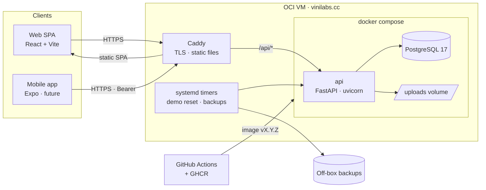
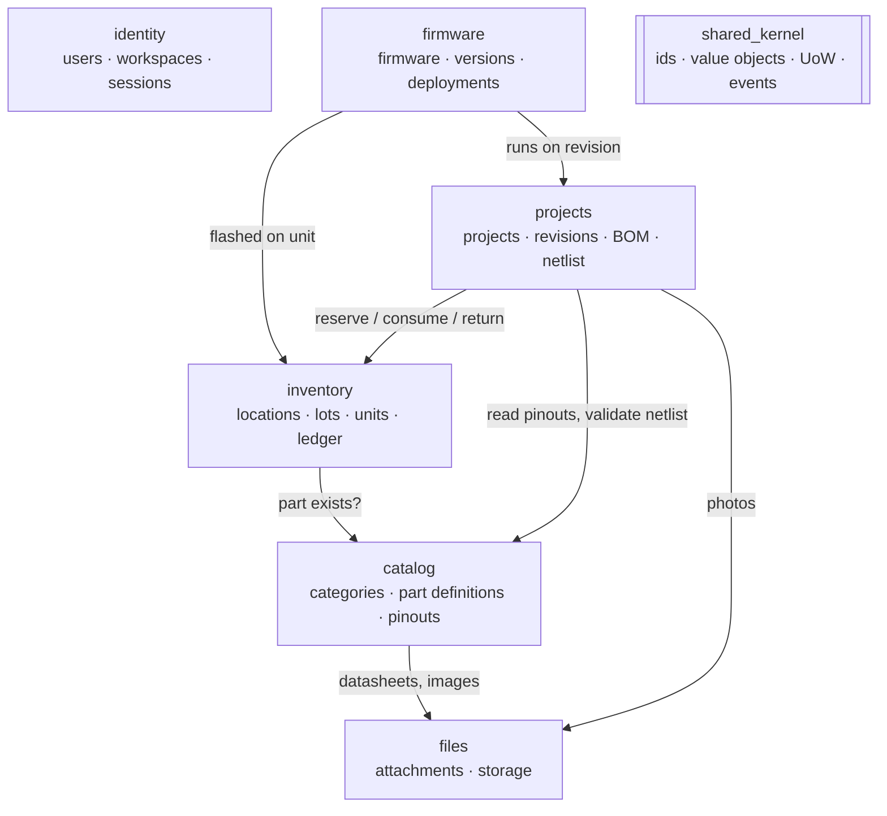
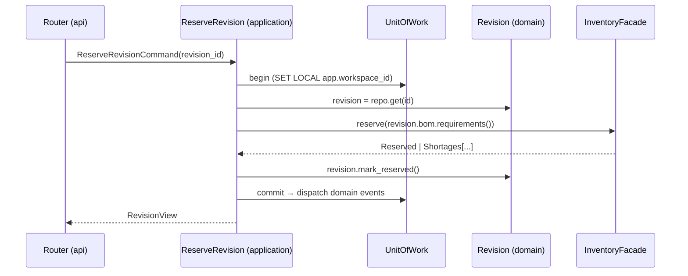
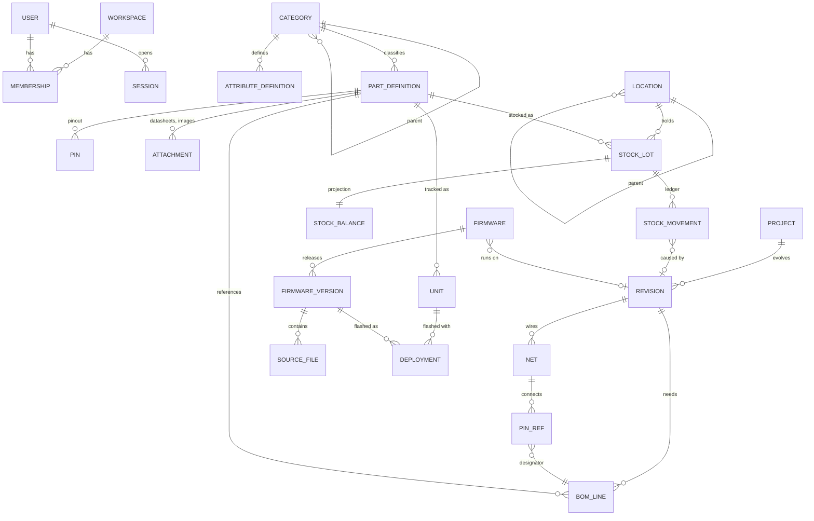

# Wiredex architecture

> **Status: proposal.** This is input for the system-design pass. Where it
> names a pattern, it also says *why* and *where*, so each choice can be
> accepted, changed or dropped on purpose. Decisions that are settled live in
> [`adr/`](adr/README.md).

- [1. Shape of the system](#1-shape-of-the-system)
- [2. Bounded contexts](#2-bounded-contexts)
- [3. Inside a module](#3-inside-a-module)
- [4. Domain model](#4-domain-model)
- [5. Patterns catalogue](#5-patterns-catalogue)
- [6. Object calisthenics: where it applies and where it doesn't](#6-object-calisthenics-where-it-applies-and-where-it-doesnt)
- [7. Frontend architecture](#7-frontend-architecture)
- [8. Testing strategy](#8-testing-strategy)
- [9. CI/CD pipeline](#9-cicd-pipeline)
- [10. Open questions for the design pass](#10-open-questions-for-the-design-pass)

---

## 1. Shape of the system



One process, one database, one host. Everything in this document assumes that
budget (see [ADR 0009](adr/0009-single-host-deployment.md)).

## 2. Bounded contexts



| Context       | Owns                                                        | Key invariant                                               |
| ------------- | ----------------------------------------------------------- | ----------------------------------------------------------- |
| **identity**  | User, Workspace, Membership, Session                        | Every request runs inside exactly one workspace             |
| **catalog**   | Category, AttributeDefinition, PartDefinition, Pinout, Pin  | Attribute values match the category schema                  |
| **inventory** | Location tree, StockLot, Unit, StockMovement, StockBalance  | `0 ≤ reserved ≤ on_hand`, and the ledger is append-only     |
| **projects**  | Project, Revision, BomLine, Net, PinRef                     | Stock effects follow the revision state machine only        |
| **firmware**  | Firmware, FirmwareVersion, SourceFile, Deployment           | Released versions are immutable                             |
| **files**     | Attachment (content-addressed by SHA-256)                   | The same bytes are stored once                              |

Dependencies point one way. `catalog` knows nothing about `projects`.
Arrows go through **facades**, never through another module's tables.

## 3. Inside a module

```
inventory/
├── domain/            # entities, value objects, domain services, events. No imports from outside.
│   ├── stock_lot.py
│   ├── ledger.py
│   ├── quantity.py
│   └── errors.py
├── application/       # use cases (one class per command/query) and ports (Protocols)
│   ├── commands/receive_stock.py
│   ├── queries/list_shortages.py
│   ├── ports.py       # StockRepository, LocationRepository, Clock …
│   └── facade.py      # the only thing other modules may import
├── infrastructure/    # SQLAlchemy mappings, repositories, adapters
│   ├── orm.py
│   └── sql_stock_repository.py
└── api/               # FastAPI router + Pydantic request/response schemas
    ├── router.py
    └── schemas.py
```

Dependency rule, enforced by `import-linter`:

```
api ─┐
     ├─► application ─► domain
infrastructure ─┘
```

- **domain** imports nothing from FastAPI, SQLAlchemy or Pydantic.
- **application** depends on *ports* (Python `Protocol`s), never on concrete
  adapters.
- **bootstrap** (the composition root) is the only place that wires concrete
  adapters to ports, through FastAPI `Depends` providers.

A request, end to end:



## 4. Domain model



**Part definition vs lot vs unit.** This distinction matters most:

| Concept            | Example                                    | Counted how            |
| ------------------ | ------------------------------------------ | ---------------------- |
| **PartDefinition** | "ESP32-DevKitC-V4", "10 kΩ ±1% 0805"       | Not counted. It is the *kind* of part |
| **StockLot**       | 180 × 10 kΩ in *Drawer 3 → Bin B2*         | Quantity via the ledger |
| **Unit**           | ESP32 board labelled `WX-U-0042`, MAC `…`  | Exactly one. It can hold firmware |

Every row carries `workspace_id`. IDs are **UUIDv7**, generated in the domain.
They are time-ordered and index well. Labels people read and print on QR codes
use short codes (`LOC-7K2Q`, `WX-U-0042`).

## 5. Patterns catalogue

| Pattern | Where | Why here |
| --- | --- | --- |
| **Hexagonal / Ports & Adapters** | Every module | Domain testable without a DB, and adapters swappable (local disk ↔ S3) |
| **Repository** | One per aggregate root | Aggregates load and save whole, and queries stay out of the domain |
| **Unit of Work** | Application layer | One transaction per use case, sets RLS workspace, dispatches events after commit |
| **Command / Query handlers** (light CQRS) | `application/commands`, `application/queries` | Writes go through aggregates, and reads can use tuned SQL straight into view models |
| **Value Object** | `Quantity`, `Measure` (SI), `SemVer`, `Designator`, `PinNumber`, `ShortCode`, `Mpn` | Validation lives in one place, and primitives don't leak ([§6](#6-object-calisthenics-where-it-applies-and-where-it-doesnt)) |
| **First-class collection** | `BillOfMaterials`, `Pinout`, `Netlist`, `SourceFiles` | Collection rules ("designators unique", "pin in ≤ 1 net") live with the collection |
| **State** | `Revision` lifecycle | Legal transitions and their stock effects are explicit and testable |
| **Strategy** | Attribute validators per type, netlist rules, CSV column parsers | New attribute types and rules are added, not edited in (Open/Closed) |
| **Specification** | Parametric part search ("category = resistor ∧ R ∈ [1k,10k] ∧ package = 0805") | Composable filters that compile to SQL |
| **Domain events** | `StockReserved`, `RevisionBuilt`, `FirmwareFlashed` | Audit log and cache invalidation without coupling modules |
| **Facade** | `application/facade.py` per module | The only cross-module entry point. import-linter enforces it |
| **Factory / Builder** | Demo workspace seeding, test data builders | Readable fixtures and one seed for demo, e2e and dev |
| **Adapter** | `FileStorage` (local, S3), `Clock`, `IdGenerator`, `PasswordHasher` | Infrastructure behind ports, deterministic in tests |
| **Composition root** | `bootstrap/` | The only module that knows concrete classes |

SOLID in one line each:

- **S**: a use case class does one thing. A router only translates HTTP.
- **O**: new attribute types, netlist rules and storage backends plug in
  through Strategy and Adapter.
- **L**: every adapter passes the same port contract test suite, whether it is
  the in-memory fake or the SQL version.
- **I**: small ports per need (`StockReader` vs `StockWriter`), not one
  god-repository.
- **D**: application code depends on `Protocol`s, and `bootstrap` injects the
  implementations.

## 6. Object calisthenics: where it applies and where it doesn't

Apply it **strictly in `domain/`** and **loosely in `application/`**:

| Rule | In Wiredex |
| --- | --- |
| One level of indentation per method | Guard clauses and extracted methods in aggregates |
| Don't use `else` | Early returns. The State pattern replaces status `if/else` chains |
| Wrap all primitives | `Quantity(12)`, `Designator("U1")`, `SemVer("1.4.0")`, never a bare `int`/`str` in domain signatures |
| First-class collections | `Pinout`, `BillOfMaterials`, `Netlist`, `SourceFiles` |
| One dot per line | `revision.reserve_with(inventory)` rather than `revision.bom.lines[0].part.id` |
| Don't abbreviate | `designator`, not `des`. `firmware_version`, not `fwv` |
| Keep entities small | Aim for < 50 lines per class and < 10 classes per package. Split when a class grows |
| ≤ 2 instance variables | *Aspirational.* Aggregates group state into value objects rather than obey it literally |
| No getters/setters | Tell, don't ask: `lot.receive(qty)`, not `lot.quantity = lot.quantity + qty` |

**Don't apply it** to Pydantic schemas, ORM mappings, migrations, React
components, or tests. Those are data shapes or glue, and ceremony there costs
readability and buys nothing.

## 7. Frontend architecture

```
apps/web/src/
├── app/               # router, providers (query client, i18n, theme), layout shell
├── features/          # one folder per bounded context, mirroring the backend
│   ├── parts/         # routes/, components/, hooks/ (TanStack Query wrappers), forms/
│   ├── inventory/
│   ├── projects/
│   ├── firmware/
│   └── auth/
├── shared/
│   ├── ui/            # owned primitives on Radix / React Aria: Button, Dialog, DataTable…
│   ├── theme/         # design tokens (CSS custom properties), light / dark / system
│   └── lib/           # formatters (SI units, dates), hooks
└── main.tsx
```

- **Server state** lives in TanStack Query, and nothing server-side is copied into
  a global store. **UI state** stays local, in the URL (filters, tabs,
  pagination), or in a small Zustand store if it really must be global.
- **API access** goes only through `packages/api-client` (generated,
  [ADR 0010](adr/0010-generated-api-client.md)) and is wrapped in
  feature hooks (`usePart(id)`, `useReserveRevision()`).
- **Forms** use React Hook Form with Zod schemas, and the Zod types are checked
  against the generated API types.
- **Theme**: tokens as CSS variables on `:root`, and `data-theme="light|dark"`
  when the user picks one explicitly. *System* follows
  `prefers-color-scheme`. The preference is saved on the user profile, so web
  and mobile agree.
- **i18n**: `react-i18next` with EN and PT-BR catalogs in `packages/i18n`,
  shared with mobile. CI fails on missing keys.
- **Version badge**: the footer shows `Wiredex vX.Y.Z · <sha>` from build-time
  env, compares it with `GET /api/version`, and suggests a reload on
  mismatch ([ADR 0012](adr/0012-versioning-and-releases.md)).
- **Keyboard-first**: a command palette (`Ctrl K`) for "jump to part / bin /
  project" and a quick-add form reachable from anywhere.
- **Firmware viewer**: CodeMirror 6 (read-only with syntax highlighting,
  editable in drafts) and a diff view between versions.

Mobile (later): Expo + React Native, reusing `api-client`, `i18n`, tokens and
feature hooks. Adds QR scanning of bins and units.

## 8. Testing strategy

```
            ▲  fewer, slower
           ╱ ╲   E2E (Playwright): critical journeys on the full stack
          ╱───╲  Contract: OpenAPI ↔ client drift, schemathesis fuzzing
         ╱─────╲ Integration: repositories, RLS, migrations on real Postgres
        ╱───────╲ Application: use cases with in-memory fakes
       ╱─────────╲ Domain unit + property tests (Hypothesis)
      ▔▔▔▔▔▔▔▔▔▔▔▔▔ more, faster
```

| Layer | Tooling | Examples |
| --- | --- | --- |
| Domain | pytest, **Hypothesis** | "for any sequence of movements, `0 ≤ reserved ≤ on_hand`"; `Measure.parse("4k7") == 4700 Ω` |
| Application | pytest + `FakeUnitOfWork` | reserving a revision with a shortage returns the shortage list and writes nothing |
| Integration | pytest + **testcontainers** Postgres | a query without a workspace filter still can't read another workspace (RLS) |
| Migrations | Alembic | `upgrade head` → `downgrade -1` → `upgrade head`; `alembic check` finds no pending diff |
| API / contract | httpx `AsyncClient`, **schemathesis** | every endpoint honours its schema; generated client is up to date |
| Architecture | **import-linter** | domain imports no framework; modules only import facades |
| Frontend | **Vitest**, Testing Library, **MSW** | BOM table marks shortages; theme toggle persists |
| E2E | **Playwright** | log in → add part → receive stock → create project → reserve → build → stock decreases |
| Post-deploy | Playwright smoke (demo user) | the app loads, `/api/version` matches the release tag |

Coverage gates: **domain + application ≥ 90 %**, backend overall ≥ 80 %,
frontend ≥ 70 %. The numbers only guard against backsliding. The goal is the
behaviour tests above.

## 9. CI/CD pipeline

```mermaid
flowchart LR
  subgraph PR["Pull request · all required"]
    L[lint + format<br/>ruff · biome]
    TY[types<br/>mypy --strict · tsc]
    AR[architecture<br/>import-linter]
    UB[backend unit<br/>+ coverage gate]
    IB[backend integration<br/>Postgres · migrations]
    CT[contract<br/>client drift · schemathesis]
    UF[frontend unit<br/>+ coverage gate]
    E2E[e2e<br/>Playwright on compose]
    SEC[security<br/>gitleaks · pip-audit · osv · trivy]
    CC[conventional<br/>commit check]
  end
  PR --> MAIN[merge to main]
  MAIN --> RP[release-please<br/>updates release PR]
  RP -->|merge release PR| REL[tag vX.Y.Z<br/>GitHub Release]
  REL --> IMG[build + push<br/>ghcr.io/…:vX.Y.Z]
  IMG --> DEP[deploy<br/>migrate · restart]
  DEP --> SMK[smoke test]
  SMK -->|fail| RB[rollback to<br/>previous tag]
```



- Branch protection on `main`: PR required, all gates green, linear history.
- `pre-commit` runs ruff, biome and gitleaks locally, so CI failures are rare.
- Renovate (or Dependabot) opens weekly grouped dependency PRs, and those PRs
  pass the same gates.

## 10. Open questions for the design pass

These questions are still open after the first interview:

1. **Units vs lots for dev boards.** Should *every* MCU board be a unit,
   or only the ones you flash? (It affects quick-add friction.)
2. **Substitutes in BOMs.** Can a BOM line accept alternatives (any 10 kΩ
   0805 ±5 % or better), matched by attributes rather than by part definition?
3. **Consumables.** Solder, wire and heat-shrink: track them in the ledger, or
   mark them "not stocked"?
4. **Attachments per revision.** Gerbers, STL files, photos of the build: stored
   in Wiredex, or linked out?
5. **Deletion policy.** Soft-delete (archive) everywhere, and hard delete only
   from a trash view?
6. **Search.** Is Postgres full-text plus `pg_trgm` enough, or do you want a
   global "search everything" palette from day 1?
7. **Label printer.** Which printer and label size for QR labels
   (e.g. Brother QL 29 mm, or A4 sticker sheets)?
8. **Backups target.** OCI Object Storage, Backblaze B2, or your own machine?
