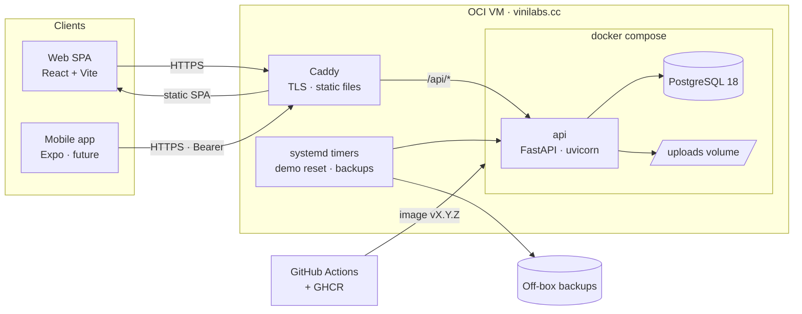
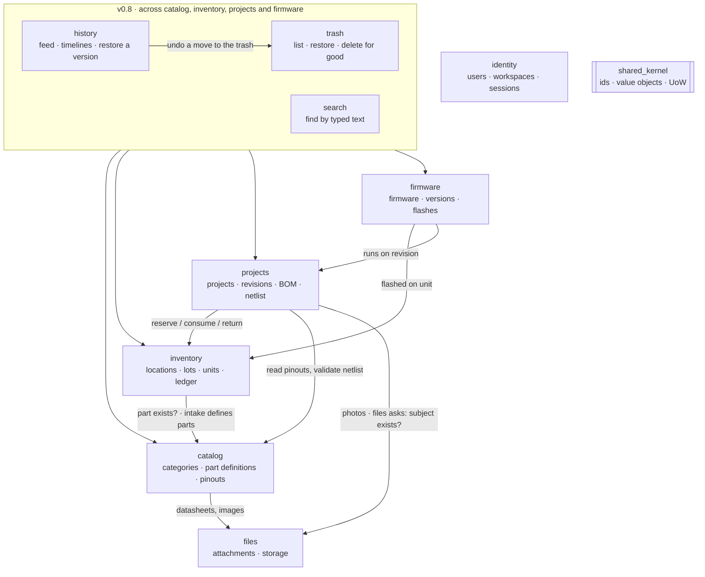
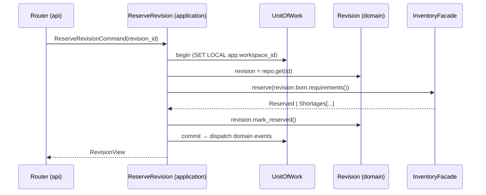
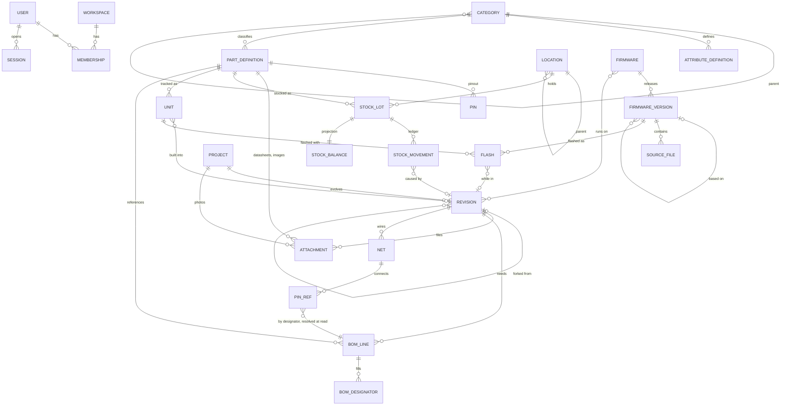

# Wiredex architecture

**English** · [Português (Brasil)](architecture.pt-BR.md)

> **Status: proposal.** This is input for the system-design pass. Where it
> names a pattern, it also says *why* and *where*, so each choice can be
> accepted, changed or dropped on purpose. Decisions that are settled live in
> [`adr/`](adr/README.md).

- [1. Shape of the system](#1-shape-of-the-system)
- [2. Bounded contexts](#2-bounded-contexts)
- [3. Inside a module](#3-inside-a-module)
- [4. Domain model](#4-domain-model)
- [5. Patterns catalogue](#5-patterns-catalogue)
- [6. Object calisthenics: where it applies and where it doesn't](#6-object-calisthenics-where-it-applies-and-where-it-doesnt)
- [7. Frontend architecture](#7-frontend-architecture)
- [8. Testing strategy](#8-testing-strategy)
- [9. CI/CD pipeline](#9-cicd-pipeline)
- [10. Open questions for the design pass](#10-open-questions-for-the-design-pass)

---

## 1. Shape of the system


```mermaid
flowchart LR
  subgraph Clients
    W[Web SPA<br/>React + Vite]
    M[Mobile app<br/>Expo · future]
  end

  subgraph OCI["OCI VM · vinilabs.cc"]
    C[Caddy<br/>TLS · static files]
    subgraph Compose["docker compose"]
      A[api<br/>FastAPI · uvicorn]
      D[(PostgreSQL 18)]
      V[/uploads volume/]
    end
    T[systemd timers<br/>demo reset · backups]
  end

  B[(Off-box backups)]
  G[GitHub Actions<br/>+ GHCR]

  W -- HTTPS --> C
  M -- HTTPS · Bearer --> C
  C -- /api/* --> A
  C -- static SPA --> W
  A --> D
  A --> V
  T --> A
  T --> B
  G -- image vX.Y.Z --> Compose
```

One process, one database, one host. Everything in this document assumes that
budget (see [ADR 0009](adr/0009-single-host-deployment.md)).

## 2. Bounded contexts


```mermaid
flowchart TB
  ID[identity<br/>users · workspaces · sessions]
  CAT[catalog<br/>categories · part definitions · pinouts]
  INV[inventory<br/>locations · lots · units · ledger]
  PRJ[projects<br/>projects · revisions · BOM · netlist]
  FW[firmware<br/>firmware · versions · flashes]
  FIL[files<br/>attachments · storage]
  subgraph across["v0.8 · across catalog, inventory, projects and firmware"]
    TR[trash<br/>list · restore · delete for good]
    HIS[history<br/>feed · timelines · restore a version]
    SR[search<br/>find by typed text]
  end
  SK[[shared_kernel<br/>ids · value objects · UoW]]

  PRJ -- reserve / consume / return --> INV
  PRJ -- read pinouts, validate netlist --> CAT
  INV -- part exists? · intake defines parts --> CAT
  FW -- flashed on unit --> INV
  FW -- runs on revision --> PRJ
  CAT -- datasheets, images --> FIL
  PRJ -- "photos · files asks: subject exists?" --> FIL
  across --> CAT & INV & PRJ & FW
  HIS -- undo a move to the trash --> TR
```

| Context       | Owns                                                        | Key invariant                                               |
| ------------- | ----------------------------------------------------------- | ----------------------------------------------------------- |
| **identity**  | User, Workspace, Membership, Session                        | Every request runs inside exactly one workspace             |
| **catalog**   | Category, AttributeDefinition, PartDefinition, Pinout, Pin  | Attribute values match the category schema                  |
| **inventory** | Location tree, StockLot, Unit, StockMovement, StockBalance  | `0 ≤ reserved ≤ on_hand`, and the ledger is append-only     |
| **projects**  | Project, Revision, BomLine, Net, PinRef                     | Stock effects follow the revision state machine only        |
| **firmware**  | Firmware, FirmwareVersion, SourceFile, Flash                | Released versions are immutable                             |
| **files**     | Attachment (content-addressed by SHA-256)                   | The same bytes are stored once                              |
| **trash**     | TrashedItem, one numbered page over four kinds; no table     | A record in the trash is absent everywhere and comes back whole ([ADR 0014](adr/0014-soft-delete-and-trash.md)) |
| **history**   | Change, RowChange (`history_changes`, `history_entries`)     | Only the database's trigger writes a change; the API's role never edits one ([ADR 0015](adr/0015-history-by-triggers.md)) |
| **search**    | SearchHit, SearchGroup; no table                             | It finds only what the workspace's own pages would show     |

Dependencies point one way. `catalog` knows nothing about `projects`.
Arrows go through **facades**, never through another module's tables. The three
`v0.8.0` modules only read through them, or hand a write to its owner, which runs
it in its own transaction ([ADR 0001](adr/0001-modular-monolith.md)).

## 3. Inside a module

```
inventory/
├── domain/            # entities, value objects, domain services, events. No imports from outside.
│   ├── stock_lot.py
│   ├── ledger.py
│   ├── quantity.py
│   └── errors.py
├── application/       # use cases (one class per command/query) and ports (Protocols)
│   ├── commands/receive_stock.py
│   ├── queries/list_shortages.py
│   ├── ports.py       # StockRepository, LocationRepository, Clock …
│   └── facade.py      # the only thing other modules may import
├── infrastructure/    # SQLAlchemy mappings, repositories, adapters
│   ├── orm.py
│   └── sql_stock_repository.py
└── api/               # FastAPI router + Pydantic request/response schemas
    ├── router.py
    └── schemas.py
```

Dependency rule, enforced by `import-linter`:

```
api ─┐
     ├─► application ─► domain
infrastructure ─┘
```

- **domain** imports nothing from FastAPI, SQLAlchemy or Pydantic.
- **application** depends on *ports* (Python `Protocol`s), never on concrete
  adapters.
- **bootstrap** (the composition root) is the only place that wires concrete
  adapters to ports. Each module's API exposes a router factory
  (`create_router(...)`) that receives its use cases as arguments, so no router
  reaches for globals and tests pass fakes straight in. `wiredex.system` is the
  working example.

A request, end to end:


```mermaid
sequenceDiagram
  participant R as Router (api)
  participant H as ReserveRevision (application)
  participant U as UnitOfWork
  participant P as Revision (domain)
  participant I as InventoryFacade
  R->>H: ReserveRevisionCommand(revision_id)
  H->>U: begin (SET LOCAL app.workspace_id)
  H->>P: revision = repo.get(id)
  H->>I: reserve(revision.bom.requirements())
  I-->>H: Reserved | Shortages[...]
  H->>P: revision.mark_reserved()
  H->>U: commit → dispatch domain events
  H-->>R: RevisionView
```

## 4. Domain model


```mermaid
erDiagram
  WORKSPACE ||--o{ MEMBERSHIP : has
  USER ||--o{ MEMBERSHIP : has
  USER ||--o{ SESSION : opens

  CATEGORY ||--o{ CATEGORY : parent
  CATEGORY ||--o{ ATTRIBUTE_DEFINITION : defines
  CATEGORY ||--o{ PART_DEFINITION : classifies
  PART_DEFINITION ||--o{ PIN : "pinout"
  PART_DEFINITION ||--o{ ATTACHMENT : "datasheets, images"

  LOCATION ||--o{ LOCATION : parent
  LOCATION ||--o{ STOCK_LOT : holds
  PART_DEFINITION ||--o{ STOCK_LOT : "stocked as"
  PART_DEFINITION ||--o{ UNIT : "tracked as"
  STOCK_LOT ||--o{ STOCK_MOVEMENT : ledger
  STOCK_LOT ||--|| STOCK_BALANCE : projection

  PROJECT ||--o{ REVISION : evolves
  REVISION |o--o{ REVISION : "forked from"
  PROJECT ||--o{ ATTACHMENT : photos
  REVISION ||--o{ ATTACHMENT : files
  REVISION ||--o{ BOM_LINE : needs
  BOM_LINE }o--|| PART_DEFINITION : references
  BOM_LINE ||--o{ BOM_DESIGNATOR : fills
  REVISION ||--o{ NET : wires
  NET ||--o{ PIN_REF : connects
  PIN_REF }o--|| BOM_LINE : "by designator, resolved at read"
  STOCK_MOVEMENT }o--o| REVISION : "caused by"
  UNIT }o--o| REVISION : "built into"

  FIRMWARE ||--o{ FIRMWARE_VERSION : releases
  FIRMWARE }o--o{ REVISION : "runs on"
  FIRMWARE_VERSION |o--o{ FIRMWARE_VERSION : "based on"
  FIRMWARE_VERSION ||--o{ SOURCE_FILE : contains
  UNIT ||--o{ FLASH : "flashed with"
  FIRMWARE_VERSION ||--o{ FLASH : "flashed as"
  FLASH }o--o| REVISION : "while in"
```

**Part definition vs lot vs unit.** This distinction matters most:

| Concept            | Example                                    | Counted how            |
| ------------------ | ------------------------------------------ | ---------------------- |
| **PartDefinition** | "ESP32-DevKitC-V4", "10 kΩ ±1% 0805"       | Not counted. It is the *kind* of part |
| **StockLot**       | 180 × 10 kΩ in *Drawer 3 → Bin B2*         | Quantity via the ledger |
| **Unit**           | ESP32 board labelled `WX-U-0042`, MAC `…`  | Exactly one. It can hold firmware |

Every row carries `workspace_id`. IDs are **UUIDv7**, generated in the domain.
They are time-ordered and index well. Locations and units also get a short code
people read and search for, sequential per workspace: `WX-L-0007` for a location,
`WX-U-0042` for a unit. Nothing is printed, so there are no QR codes.

## 5. Patterns catalogue

| Pattern | Where | Why here |
| --- | --- | --- |
| **Hexagonal / Ports & Adapters** | Every module | Domain testable without a DB, and adapters swappable (local disk ↔ S3) |
| **Repository** | One per aggregate root | Aggregates load and save whole, and queries stay out of the domain |
| **Unit of Work** | Application layer | One transaction per use case. It sets the RLS workspace and, from `v0.8.0`, the user and reason that history records |
| **Command / Query handlers** (light CQRS) | `application/commands`, `application/queries` | Writes go through aggregates, and reads can use tuned SQL straight into view models |
| **Value Object** | `Quantity`, `Measure` (SI), `SemVer`, `Designator`, `PinNumber`, `ShortCode`, `Mpn` | Validation lives in one place, and primitives don't leak ([§6](#6-object-calisthenics-where-it-applies-and-where-it-doesnt)) |
| **First-class collection** | `BillOfMaterials`, `Pinout`, `Netlist`, `SourceFiles` | Collection rules ("designators unique", "net names unique") live with the collection; a pin reused across nets is a finding of the wiring rules, not a refusal |
| **State** | `Revision` lifecycle | Legal transitions and their stock effects are explicit and testable |
| **Strategy** | Attribute validators per type, netlist rules, CSV column parsers | New attribute types and rules are added, not edited in (Open/Closed) |
| **Specification** | Parametric part search ("category = resistor ∧ R ∈ [1k,10k] ∧ package = 0805") | Composable filters that compile to SQL |
| **Domain events** | *Not built* | Postgres triggers record history, the audit log events were meant for ([ADR 0015](adr/0015-history-by-triggers.md)). The web refreshes its caches after each write |
| **Facade** | `application/facade.py` per module | The only cross-module entry point. import-linter enforces it |
| **Factory / Builder** | Demo workspace seeding, test data builders | Readable fixtures and one seed for demo, e2e and dev |
| **Adapter** | `FileStorage` (local, S3), `Clock`, `IdGenerator`, `PasswordHasher` | Infrastructure behind ports, deterministic in tests |
| **Composition root** | `bootstrap/` | The only module that knows concrete classes |

SOLID in one line each:

- **S**: a use case class does one thing. A router only translates HTTP.
- **O**: new attribute types, netlist rules and storage backends plug in
  through Strategy and Adapter.
- **L**: every adapter passes the same port contract test suite, whether it is
  the in-memory fake or the SQL version.
- **I**: small ports per need (`StockReader` vs `StockWriter`), not one
  god-repository.
- **D**: application code depends on `Protocol`s, and `bootstrap` injects the
  implementations.

## 6. Object calisthenics: where it applies and where it doesn't

Apply it **strictly in `domain/`** and **loosely in `application/`**:

| Rule | In Wiredex |
| --- | --- |
| One level of indentation per method | Guard clauses and extracted methods in aggregates |
| Don't use `else` | Early returns. The State pattern replaces status `if/else` chains |
| Wrap all primitives | `Quantity(12)`, `Designator("U1")`, `SemVer("1.4.0")`, never a bare `int`/`str` in domain signatures |
| First-class collections | `Pinout`, `BillOfMaterials`, `Netlist`, `SourceFiles` |
| One dot per line | `revision.reserve_with(inventory)` rather than `revision.bom.lines[0].part.id` |
| Don't abbreviate | `designator`, not `des`. `firmware_version`, not `fwv` |
| Keep entities small | Aim for < 50 lines per class and < 10 classes per package. Split when a class grows |
| ≤ 2 instance variables | *Aspirational.* Aggregates group state into value objects rather than obey it literally |
| No getters/setters | Tell, don't ask: `lot.receive(qty)`, not `lot.quantity = lot.quantity + qty` |

**Don't apply it** to Pydantic schemas, ORM mappings, migrations, React
components, or tests. Those are data shapes or glue, and ceremony there costs
readability and buys nothing.

## 7. Frontend architecture

```
apps/web/src/
├── app/               # router, providers (query client, i18n, theme), layout shell
├── features/          # one folder per bounded context, mirroring the backend
│   ├── parts/         # routes/, components/, hooks/ (TanStack Query wrappers), forms/
│   ├── inventory/
│   ├── projects/
│   ├── firmware/
│   └── auth/
├── shared/
│   ├── ui/            # owned primitives on Radix / React Aria: Button, Dialog, DataTable…
│   ├── theme/         # design tokens (CSS custom properties), light / dark / system
│   └── lib/           # formatters (SI units, dates), hooks
└── main.tsx
```

- **Server state** lives in TanStack Query, and nothing server-side is copied into
  a global store. **UI state** stays local, in the URL (filters, tabs,
  pagination), or in a small Zustand store if it really must be global.
- **API access** goes only through `packages/api-client` (generated,
  [ADR 0010](adr/0010-generated-api-client.md)) and is wrapped in
  feature hooks (`usePart(id)`, `useReserveRevision()`).
- **Forms** use React Hook Form with Zod schemas, and the Zod types are checked
  against the generated API types.
- **Theme**: tokens as CSS variables on `:root`, and `data-theme="light|dark"`
  when the user picks one explicitly. *System* follows
  `prefers-color-scheme`. The preference is saved on the user profile, so web
  and mobile agree.
- **i18n**: `react-i18next` with EN and PT-BR catalogs in `packages/i18n`,
  shared with mobile. CI fails on missing keys.
- **Version badge**: the footer shows `Wiredex vX.Y.Z · <sha>` from build-time
  env, compares it with `GET /api/version`, and suggests a reload on
  mismatch ([ADR 0012](adr/0012-versioning-and-releases.md)).
- **Keyboard-first**: quick-add opens from any page with `Alt N` (`useQuickAdd`
  in `features/inventory/intake/QuickAddProvider.tsx`). The command palette
  (`features/palette/`, `v0.8.0`) opens with `Ctrl K`, or `⌘ K` on a Mac, even
  while typing. On a phone it opens from the header's *Search* button. It never
  opens over another dialog. It lists the app's commands first, filtered in the
  browser, and after a 200 ms pause it searches the workspace's parts, units,
  projects, firmware, categories and locations with `GET /api/search`. Its
  *Quick add* command opens quick-add through the same hook.
- **Everyday pages** (`v0.8.0`): the dashboard at `/` (`features/dashboard/`)
  reads its three panels as three queries, so a slow panel never holds back the
  others, each asking for its first five rows, and counts the bench for the tiles
  above them from the lists' own endpoints. `/activity` and the *History* section of each record page render the
  same change list (`features/history/`). `/trash` lists the trash
  (`features/trash/`), and each of its writes refreshes the four modules' caches.
- **Lists**: one bar pages every list (`shared/ui/pagination.tsx`), over the
  list and under its filters: the range and total, a page size (25 unless
  another is chosen), and numbered pages. Page and size live in the address
  (`page`, `size`), so a page can be bookmarked and Back walks it; a filter or
  sort change goes back to page 1 at the same size. The API pages and counts the
  parts, boards, trash and history; Projects and Firmware come whole and are paged
  in the browser. Panels inside a page, a record's *History* and a category's
  parts, keep their own page in component state
  ([ADR 0016](adr/0016-page-lists-by-number.md)).
- **Detail pages**: a board, part, project or firmware page is a grid of blocks
  (`shared/ui/block.tsx`). `Block` is a card whose heading names its landmark;
  `PageGrid` lays the blocks out in one column below `xl`, two on `xl`, and three
  on `2xl` where a page has blocks enough for it; a block can span a row or two
  thirds of it. A project's selected revision repeats the grid for its own
  blocks, and the locations page shows a picked location, its stock and its
  boards as blocks beside the tree. A table in a block sits in a `StackedTable`,
  which turns it into one labelled card per row when the block itself is narrow,
  whatever the screen (`shared/ui/stacked.css`, container queries on the frame's own width, so
  the same table reflows in a third of a wide screen and on a phone). Each card's
  labels come from the cells' `data-label` and are drawn for the eye only: the
  table keeps its header row, hidden, for screen readers. Blocks and frames are
  positioned and never wider than their track, so a visually hidden caption
  can't stretch a scroll range and nothing scrolls sideways. A project's photos
  are thumbnails that open full size in a dialog. Panels inside these pages still
  keep their own page in component state
  ([ADR 0016](adr/0016-page-lists-by-number.md)).
- **Firmware viewer**: CodeMirror 6's Lezer parsers highlight each file into plain
  DOM, with classes the theme tokens colour, and without CodeMirror's editor view,
  whose inline styles the CSP's `style-src 'self'` refuses
  ([ADR 0006](adr/0006-firmware-snapshots.md)). Copy writes the stored text, and a
  comparison page diffs two versions in the browser with jsdiff. The highlighter and
  jsdiff are the app's first lazy chunks, so a page with no source never loads them.
  Drafts are written in a plain text box.

Mobile (later): Expo + React Native, reusing `api-client`, `i18n`, tokens and
feature hooks. Adds QR scanning of bins and units.

## 8. Testing strategy

```
            ▲  fewer, slower
           ╱ ╲   E2E (Playwright): critical journeys on the full stack
          ╱───╲  Contract: OpenAPI ↔ client drift, schemathesis fuzzing
         ╱─────╲ Integration: repositories, RLS, migrations on real Postgres
        ╱───────╲ Application: use cases with in-memory fakes
       ╱─────────╲ Domain unit + property tests (Hypothesis)
      ▔▔▔▔▔▔▔▔▔▔▔▔▔ more, faster
```

| Layer | Tooling | Examples |
| --- | --- | --- |
| Domain | pytest, **Hypothesis** | "for any sequence of movements, `0 ≤ reserved ≤ on_hand`"; `Measure.parse("4k7") == 4700 Ω` |
| Application | pytest + `FakeUnitOfWork` | reserving a revision with a shortage returns the shortage list and writes nothing |
| Integration | pytest + **testcontainers** Postgres | a query without a workspace filter still can't read another workspace (RLS) |
| Migrations | Alembic | `upgrade head` → `downgrade -1` → `upgrade head`; `alembic check` finds no pending diff |
| API / contract | httpx `AsyncClient`, **schemathesis** | every endpoint honours its schema; generated client is up to date |
| Architecture | **import-linter** | domain imports no framework; modules only import facades |
| Frontend | **Vitest**, Testing Library, **MSW** | BOM table marks shortages; theme toggle persists |
| E2E | **Playwright** | log in → add part → receive stock → create project → reserve → build → stock decreases (`e2e/tests/build.spec.ts`); start a firmware from a revision → release a version → fork the revision (`firmware.spec.ts`); read, copy and compare two versions (`firmware-viewer.spec.ts`); log flashes on a board from both ends → read what it runs (`flash-log.spec.ts`); move a part and a project to the trash → restore them (`trash.spec.ts`); rename a part → restore the version before (`history.spec.ts`); reserve a build → see it tied up and its fork short on the dashboard (`dashboard.spec.ts`); page through the parts and the activity → come back with Back (`pagination.spec.ts`); find a part with `Ctrl K` (`palette.spec.ts`). At most six journeys run at once, because they share one API process, as production does |
| Post-deploy | Playwright smoke (demo user) | the app loads, `/api/version` matches the release tag |

Coverage gates: **domain + application ≥ 90 %**, backend overall ≥ 80 %,
frontend ≥ 70 %. The numbers only guard against backsliding. The goal is the
behaviour tests above.

## 9. CI/CD pipeline


```mermaid
flowchart LR
  subgraph PR["Pull request · all required"]
    L[lint + format<br/>ruff · biome]
    TY[types<br/>mypy --strict · tsc]
    AR[architecture<br/>import-linter]
    UB[backend unit<br/>+ coverage gate]
    IB[backend integration<br/>Postgres · migrations]
    CT[contract<br/>client drift · schemathesis]
    UF[frontend unit<br/>+ coverage gate]
    E2E[e2e<br/>Playwright on compose]
    SEC[security<br/>gitleaks · pip-audit · osv · trivy]
    CC[conventional<br/>commit check]
  end
  PR --> MAIN[merge to main]
  MAIN --> RP[release-please<br/>updates release PR]
  RP -->|merge release PR| REL[tag vX.Y.Z<br/>GitHub Release]
  REL --> IMG[build + push<br/>ghcr.io/…:vX.Y.Z]
  IMG --> DEP[deploy<br/>migrate · restart]
  DEP --> SMK[smoke test]
  SMK -->|fail| RB[rollback to<br/>previous tag]
```

- Branch protection on `main`: PR required, all gates green, linear history.
- `pre-commit` runs ruff, biome and gitleaks locally, so CI failures are rare.
- Renovate (or Dependabot) opens weekly grouped dependency PRs, and those PRs
  pass the same gates.

## 10. Open questions for the design pass

These questions are still open after the first interview:

1. **Units vs lots for dev boards.** Should *every* MCU board be a unit,
   or only the ones you flash? (It affects quick-add friction.)
   **Decided (2026-09-26):** every microcontroller board is a unit, by its
   category's *tracked individually* flag, inherited along the tree
   ([tracked-units design](../.kiro/specs/06-tracked-units/design.md)).
2. **Substitutes in BOMs.** Can a BOM line accept alternatives (any 10 kΩ
   0805 ±5 % or better), matched by attributes rather than by part definition?
   **Decided (2026-09-27):** no substitutes before 1.0; a BOM line names exactly
   one part definition.
3. **Consumables.** Solder, wire and heat-shrink: track them in the ledger, or
   mark them "not stocked"? **Decided (2026-09-27):** consumables are marked by
   their category's *not stocked* flag, inherited along the tree like *tracked
   individually*; they sit on BOMs, are never received, reserved or counted short,
   and stock held before the flag was set keeps working.
4. **Attachments per revision.** Gerbers, STL files, photos of the build: stored
   in Wiredex. Parts get datasheets, images and pinout diagrams in `v0.3.0`
   through the `files` module (content-addressed by SHA-256 in OCI Object
   Storage, [ADR 0013](adr/0013-file-storage.md)); project revisions reuse the
   same module for build photos and Gerbers in `v0.5.0`. **Decided (2026-09-27):**
   build photos, schematics and Gerbers are attachments of `revision:` subjects,
   project photos of `project:` ones; ZIP is accepted for Gerbers and always served
   as a download.
5. **Deletion policy.** Soft-delete (archive) everywhere, and hard delete only
   from a trash view? **Proposed (2026-10-01, without the owner):** not
   everywhere. Parts, units, projects and firmware go to a trash with what they
   hold. There they are absent from the app until restored or deleted for good,
   and only the owner empties it. Everything else is still deleted at once, and
   history keeps its last state ([ADR 0014](adr/0014-soft-delete-and-trash.md),
   [ADR 0015](adr/0015-history-by-triggers.md)).
6. **Search.** Is Postgres full-text plus `pg_trgm` enough, or do you want a
   global "search everything" palette from day 1? **Decided (2026-09-25):**
   Postgres with `pg_trgm` for text is enough; no search engine. Search lives
   inside the catalog pages (the parts page becomes a parametric search over
   text, category, typed attributes and pins, [ADR 0005](adr/0005-typed-part-attributes.md)).
   The global `Ctrl K` "search everything" palette came in `v0.8.0`
   (19-command-palette). It matches each kind's identifying text as a substring,
   ignoring case. Prefix matches come first, five per kind, through each module's
   own read. No new index was added.
7. **Label printer.** Which printer and label size for QR labels
   (e.g. Brother QL 29 mm, or A4 sticker sheets)? **Decided (2026-09-26):** no
   printed labels. Locations and units carry short codes (`WX-L-0007`,
   `WX-U-0042`) that are shown and searchable.
8. **Backups target.** OCI Object Storage, Backblaze B2, or your own machine?
