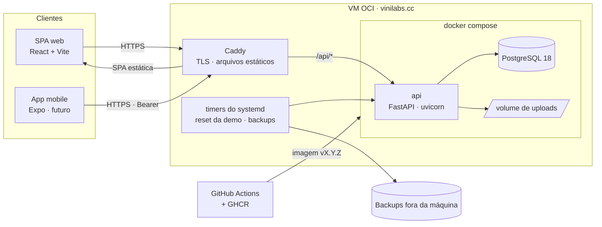
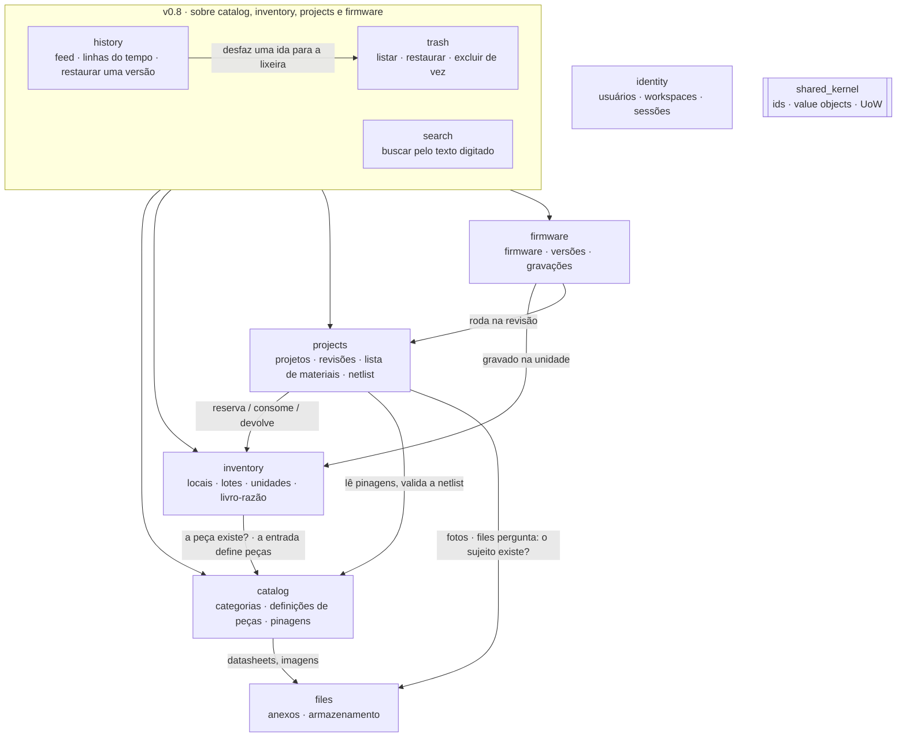
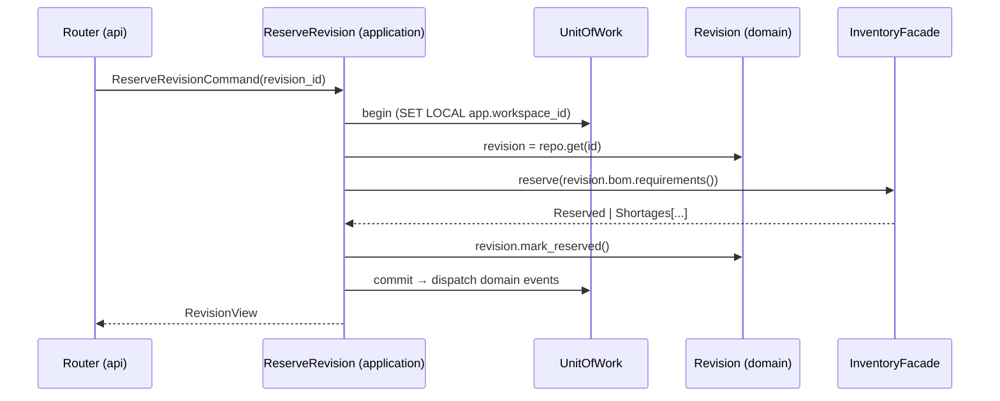
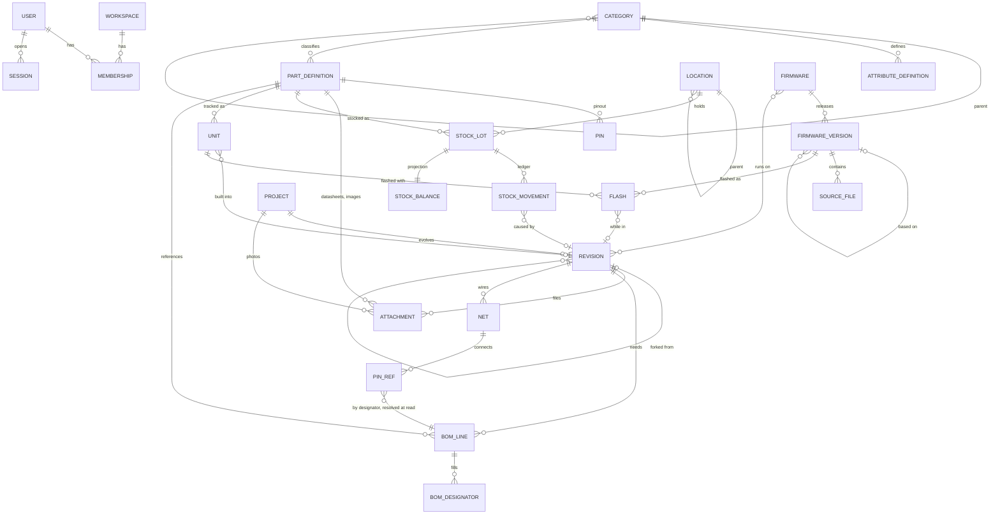

# Arquitetura do Wiredex

[English](architecture.md) · **Português (Brasil)**

> **Status: proposta.** Este texto é insumo para a rodada de design do sistema. Onde
> ele cita um padrão, também diz *por quê* e *onde*, para que cada escolha possa ser
> aceita, mudada ou descartada de propósito. As decisões já fechadas ficam em
> [`adr/`](adr/README.pt-BR.md).

- [1. Forma do sistema](#1-forma-do-sistema)
- [2. Contextos delimitados](#2-contextos-delimitados)
- [3. Dentro de um módulo](#3-dentro-de-um-módulo)
- [4. Modelo de domínio](#4-modelo-de-domínio)
- [5. Catálogo de padrões](#5-catálogo-de-padrões)
- [6. Object calisthenics: onde se aplica e onde não](#6-object-calisthenics-onde-se-aplica-e-onde-não)
- [7. Arquitetura do frontend](#7-arquitetura-do-frontend)
- [8. Estratégia de testes](#8-estratégia-de-testes)
- [9. Pipeline de CI/CD](#9-pipeline-de-cicd)
- [10. Perguntas em aberto para a rodada de design](#10-perguntas-em-aberto-para-a-rodada-de-design)

---

## 1. Forma do sistema



Um processo, um banco de dados, um servidor. Tudo neste documento parte desse
orçamento (veja o [ADR 0009](adr/0009-single-host-deployment.md)).

## 2. Contextos delimitados



| Contexto      | É dono de                                                   | Invariante principal                                        |
| ------------- | ----------------------------------------------------------- | ----------------------------------------------------------- |
| **identity**  | User, Workspace, Membership, Session                        | Toda requisição roda dentro de exatamente um workspace      |
| **catalog**   | Category, AttributeDefinition, PartDefinition, Pinout, Pin  | Os valores dos atributos seguem o esquema da categoria      |
| **inventory** | Árvore de locais, StockLot, Unit, StockMovement, StockBalance | `0 ≤ reserved ≤ on_hand`, e o livro-razão é só de acréscimo |
| **projects**  | Project, Revision, BomLine, Net, PinRef                     | Os efeitos no estoque seguem apenas a máquina de estados da revisão |
| **firmware**  | Firmware, FirmwareVersion, SourceFile, Flash                | Versões lançadas são imutáveis                              |
| **files**     | Attachment (endereçado por conteúdo, por SHA-256)           | Os mesmos bytes são guardados uma vez só                    |
| **trash**     | TrashedItem, uma página numerada sobre quatro tipos; sem tabela | Um registro na lixeira está ausente em todo lugar e volta inteiro ([ADR 0014](adr/0014-soft-delete-and-trash.md)) |
| **history**   | Change, RowChange (`history_changes`, `history_entries`)     | Só o trigger do banco escreve uma mudança; o papel da API nunca edita uma ([ADR 0015](adr/0015-history-by-triggers.md)) |
| **search**    | SearchHit, SearchGroup; sem tabela                           | Só encontra o que as páginas do próprio workspace mostrariam |

As dependências apontam em um sentido só. `catalog` não sabe nada sobre `projects`.
As setas passam por **fachadas**, nunca pelas tabelas de outro módulo. Os três
módulos da `v0.8.0` só leem por meio delas, ou entregam uma escrita ao seu dono, que a
executa em sua própria transação ([ADR 0001](adr/0001-modular-monolith.md)).

## 3. Dentro de um módulo

```
inventory/
├── domain/            # entidades, value objects, serviços de domínio, eventos. Nenhum import de fora.
│   ├── stock_lot.py
│   ├── ledger.py
│   ├── quantity.py
│   └── errors.py
├── application/       # casos de uso (uma classe por comando/consulta) e portas (Protocols)
│   ├── commands/receive_stock.py
│   ├── queries/list_shortages.py
│   ├── ports.py       # StockRepository, LocationRepository, Clock …
│   └── facade.py      # a única coisa que outros módulos podem importar
├── infrastructure/    # mapeamentos do SQLAlchemy, repositórios, adaptadores
│   ├── orm.py
│   └── sql_stock_repository.py
└── api/               # router do FastAPI + esquemas Pydantic de requisição/resposta
    ├── router.py
    └── schemas.py
```

Regra de dependência, imposta pelo `import-linter`:

```
api ─┐
     ├─► application ─► domain
infrastructure ─┘
```

- **domain** não importa nada de FastAPI, SQLAlchemy ou Pydantic.
- **application** depende de *portas* (`Protocol`s do Python), nunca de adaptadores
  concretos.
- **bootstrap** (a raiz de composição) é o único lugar que liga adaptadores
  concretos a portas. A API de cada módulo expõe uma fábrica de router
  (`create_router(...)`) que recebe seus casos de uso como argumentos, então nenhum
  router busca globais e os testes passam fakes direto. `wiredex.system` é o
  exemplo em funcionamento.

Uma requisição, de ponta a ponta:



## 4. Modelo de domínio



**Definição de peça, lote e unidade.** Esta é a distinção que mais importa:

| Conceito           | Exemplo                                    | Como é contado         |
| ------------------ | ------------------------------------------ | ---------------------- |
| **PartDefinition** | "ESP32-DevKitC-V4", "10 kΩ ±1% 0805"       | Não é contada. É o *tipo* de peça |
| **StockLot**       | 180 × 10 kΩ em *Gaveta 3 → Compartimento B2* | Quantidade pelo livro-razão |
| **Unit**           | Placa ESP32 etiquetada `WX-U-0042`, MAC `…` | Exatamente uma. Pode receber firmware |

Toda linha carrega `workspace_id`. Os IDs são **UUIDv7**, gerados no domínio.
São ordenados no tempo e indexam bem. Locais e unidades também recebem um código curto
que as pessoas leem e buscam, sequencial por workspace: `WX-L-0007` para um local,
`WX-U-0042` para uma unidade. Nada é impresso, então não há QR codes.

## 5. Catálogo de padrões

| Padrão | Onde | Por que aqui |
| --- | --- | --- |
| **Hexagonal / Portas e Adaptadores** | Todo módulo | Domínio testável sem banco, e adaptadores trocáveis (disco local ↔ S3) |
| **Repository** | Um por raiz de agregado | Os agregados carregam e salvam inteiros, e as consultas ficam fora do domínio |
| **Unit of Work** | Camada de aplicação | Uma transação por caso de uso. Ela define o workspace do RLS e, a partir da `v0.8.0`, o usuário e o motivo que o histórico registra |
| **Handlers de comando / consulta** (CQRS leve) | `application/commands`, `application/queries` | As escritas passam pelos agregados, e as leituras podem usar SQL ajustado direto para view models |
| **Value Object** | `Quantity`, `Measure` (SI), `SemVer`, `Designator`, `PinNumber`, `ShortCode`, `Mpn` | A validação fica em um lugar só, e os primitivos não vazam ([§6](#6-object-calisthenics-onde-se-aplica-e-onde-não)) |
| **Coleção de primeira classe** | `BillOfMaterials`, `Pinout`, `Netlist`, `SourceFiles` | As regras da coleção ("designadores únicos", "nomes de rede únicos") ficam com a coleção; um pino reutilizado entre redes é um achado das regras de fiação, não uma recusa |
| **State** | Ciclo de vida de `Revision` | As transições válidas e seus efeitos no estoque são explícitos e testáveis |
| **Strategy** | Validadores de atributos por tipo, regras da netlist, parsers de colunas de CSV | Novos tipos de atributos e regras são acrescentados, não editados (Open/Closed) |
| **Specification** | Busca paramétrica de peças ("categoria = resistor ∧ R ∈ [1k,10k] ∧ encapsulamento = 0805") | Filtros combináveis que compilam para SQL |
| **Eventos de domínio** | *Não construído* | Os triggers do Postgres registram o histórico, o log de auditoria para o qual os eventos serviriam ([ADR 0015](adr/0015-history-by-triggers.md)). A web atualiza seus caches depois de cada escrita |
| **Facade** | `application/facade.py` por módulo | O único ponto de entrada entre módulos. O import-linter impõe isso |
| **Factory / Builder** | Semeadura do workspace de demonstração, builders de dados de teste | Fixtures legíveis e uma única semente para demo, e2e e desenvolvimento |
| **Adapter** | `FileStorage` (local, S3), `Clock`, `IdGenerator`, `PasswordHasher` | Infraestrutura atrás de portas, determinística nos testes |
| **Raiz de composição** | `bootstrap/` | O único módulo que conhece classes concretas |

SOLID em uma linha cada:

- **S**: uma classe de caso de uso faz uma coisa. Um router só traduz HTTP.
- **O**: novos tipos de atributos, regras da netlist e backends de armazenamento se
  encaixam por meio de Strategy e Adapter.
- **L**: todo adaptador passa na mesma suíte de testes de contrato da porta, seja
  o fake em memória ou a versão SQL.
- **I**: portas pequenas por necessidade (`StockReader` vs `StockWriter`), não um
  repositório que faz tudo.
- **D**: o código de aplicação depende de `Protocol`s, e o `bootstrap` injeta as
  implementações.

## 6. Object calisthenics: onde se aplica e onde não

Aplique **com rigor em `domain/`** e **de forma solta em `application/`**:

| Regra | No Wiredex |
| --- | --- |
| Um nível de indentação por método | Cláusulas de guarda e métodos extraídos nos agregados |
| Não use `else` | Retornos antecipados. O padrão State substitui cadeias de `if/else` de status |
| Embrulhe todos os primitivos | `Quantity(12)`, `Designator("U1")`, `SemVer("1.4.0")`, nunca um `int`/`str` solto nas assinaturas do domínio |
| Coleções de primeira classe | `Pinout`, `BillOfMaterials`, `Netlist`, `SourceFiles` |
| Um ponto por linha | `revision.reserve_with(inventory)` em vez de `revision.bom.lines[0].part.id` |
| Não abrevie | `designator`, não `des`. `firmware_version`, não `fwv` |
| Mantenha as entidades pequenas | Mire em < 50 linhas por classe e < 10 classes por pacote. Divida quando uma classe crescer |
| ≤ 2 variáveis de instância | *Aspiracional.* Os agregados agrupam o estado em value objects em vez de obedecer ao pé da letra |
| Sem getters/setters | Diga, não pergunte: `lot.receive(qty)`, não `lot.quantity = lot.quantity + qty` |

**Não aplique** a esquemas Pydantic, mapeamentos do ORM, migrações, componentes
React ou testes. Esses são formatos de dados ou cola, e cerimônia ali custa
legibilidade e não compra nada.

## 7. Arquitetura do frontend

```
apps/web/src/
├── app/               # router, providers (query client, i18n, tema), casca do layout
├── features/          # uma pasta por contexto delimitado, espelhando o backend
│   ├── parts/         # routes/, components/, hooks/ (wrappers do TanStack Query), forms/
│   ├── inventory/
│   ├── projects/
│   ├── firmware/
│   └── auth/
├── shared/
│   ├── ui/            # primitivos próprios sobre Radix / React Aria: Button, Dialog, DataTable…
│   ├── theme/         # tokens de design (propriedades customizadas de CSS), claro / escuro / sistema
│   └── lib/           # formatadores (unidades do SI, datas), hooks
└── main.tsx
```

- O **estado do servidor** fica no TanStack Query, e nada do servidor é copiado para
  uma store global. O **estado da UI** fica local, na URL (filtros, abas,
  paginação), ou em uma pequena store do Zustand se realmente precisar ser global.
- O **acesso à API** passa apenas por `packages/api-client` (gerado,
  [ADR 0010](adr/0010-generated-api-client.md)) e é embrulhado em
  hooks de feature (`usePart(id)`, `useReserveRevision()`).
- Os **formulários** usam React Hook Form com esquemas Zod, e os tipos do Zod são
  conferidos contra os tipos gerados da API.
- **Tema**: tokens como variáveis CSS em `:root`, e `data-theme="light|dark"`
  quando o usuário escolhe um explicitamente. *Sistema* segue
  `prefers-color-scheme`. A preferência é salva no perfil do usuário, então web
  e mobile concordam.
- **i18n**: `react-i18next` com catálogos EN e PT-BR em `packages/i18n`,
  compartilhados com o mobile. O CI falha quando faltam chaves.
- **Selo de versão**: o rodapé mostra `Wiredex vX.Y.Z · <sha>` a partir do ambiente
  de build, compara com `GET /api/version` e sugere recarregar quando
  diferem ([ADR 0012](adr/0012-versioning-and-releases.md)).
- **Teclado primeiro**: o cadastro rápido abre de qualquer página com `Alt N` (`useQuickAdd`
  em `features/inventory/intake/QuickAddProvider.tsx`). A paleta de comandos
  (`features/palette/`, `v0.8.0`) abre com `Ctrl K`, ou `⌘ K` em um Mac, mesmo
  durante a digitação. No celular ela abre pelo botão *Buscar* do cabeçalho. Ela nunca
  abre sobre outro diálogo. Ela lista primeiro os comandos do app, filtrados no
  navegador, e depois de uma pausa de 200 ms busca as peças, unidades,
  projetos, firmware, categorias e locais do workspace com `GET /api/search`. O
  comando de cadastro rápido dela abre o cadastro rápido pelo mesmo hook.
- **Páginas do dia a dia** (`v0.8.0`): o painel em `/` (`features/dashboard/`)
  lê seus três blocos como três consultas, para que um bloco lento nunca segure os
  outros, cada uma pedindo suas cinco primeiras linhas, e conta a bancada para os
  cartões acima deles a partir dos endpoints das próprias listas. `/activity` e a seção
  *Histórico* de cada página de registro mostram a mesma lista de mudanças
  (`features/history/`). `/trash` lista a lixeira (`features/trash/`), e cada escrita
  dela atualiza os caches dos quatro módulos.
- **Listas**: uma única barra pagina todas as listas (`shared/ui/pagination.tsx`), acima
  da lista e abaixo dos filtros: o intervalo e o total, um tamanho de página (25, a menos
  que outro seja escolhido) e páginas numeradas. A página e o tamanho ficam no endereço
  (`page`, `size`), então uma página pode ser favoritada e o Voltar a percorre; uma
  mudança de filtro ou de ordenação volta para a página 1 com o mesmo tamanho. A API
  pagina e conta as peças, as placas, a lixeira e o histórico; Projetos e Firmware vêm
  inteiros e são paginados no navegador. Os blocos dentro de uma página, o *Histórico* de
  um registro e as peças de uma categoria, guardam a própria página no estado do
  componente ([ADR 0016](adr/0016-page-lists-by-number.md)).
- **Páginas de detalhe**: a página de uma placa, peça, projeto ou firmware é uma grade de
  blocos (`shared/ui/block.tsx`). `Block` é um cartão cujo título nomeia seu landmark;
  `PageGrid` dispõe os blocos em uma coluna abaixo de `xl`, duas em `xl`, e três
  em `2xl` quando a página tem blocos suficientes para isso; um bloco pode ocupar uma
  linha inteira ou dois terços dela. A revisão selecionada de um projeto repete a grade
  para seus próprios blocos, e a página de locais mostra um local escolhido, seu estoque
  e suas placas como blocos ao lado da árvore. Uma tabela em um bloco fica em uma
  `StackedTable`, que a transforma em um cartão rotulado por linha quando o próprio bloco
  é estreito, qualquer que seja a tela (`shared/ui/stacked.css`, container queries sobre
  a largura da própria moldura, então a mesma tabela se rearranja em um terço de uma tela
  larga e em um celular). Os rótulos de cada cartão vêm do `data-label` das células e são
  desenhados só para os olhos: a tabela mantém sua linha de cabeçalho, oculta, para
  leitores de tela. Blocos e molduras são posicionados e nunca mais largos que sua
  trilha, então uma legenda visualmente oculta não estica a área de rolagem e nada rola
  para os lados. As fotos de um projeto são miniaturas que abrem em tamanho real em um
  diálogo. Os blocos dentro dessas páginas também guardam a própria página no estado do
  componente ([ADR 0016](adr/0016-page-lists-by-number.md)).
- **Visualizador de firmware**: os parsers Lezer do CodeMirror 6 realçam cada arquivo em
  DOM simples, com classes que os tokens do tema colorem, e sem a view de editor do
  CodeMirror, cujos estilos inline o `style-src 'self'` da CSP recusa
  ([ADR 0006](adr/0006-firmware-snapshots.md)). Copiar grava o texto armazenado, e uma
  página de comparação faz o diff de duas versões no navegador com o jsdiff. O realçador e
  o jsdiff são os primeiros chunks lazy do app, então uma página sem código-fonte nunca os
  carrega. Os rascunhos são escritos em uma caixa de texto simples.

Mobile (depois): Expo + React Native, reaproveitando `api-client`, `i18n`, os tokens e
os hooks de feature. Acrescenta a leitura de QR de compartimentos e unidades.

## 8. Estratégia de testes

```
            ▲  menos, mais lentos
           ╱ ╲   E2E (Playwright): jornadas críticas na stack completa
          ╱───╲  Contrato: divergência OpenAPI ↔ cliente, fuzzing com schemathesis
         ╱─────╲ Integração: repositórios, RLS, migrações em Postgres real
        ╱───────╲ Aplicação: casos de uso com fakes em memória
       ╱─────────╲ Unidade de domínio + testes de propriedade (Hypothesis)
      ▔▔▔▔▔▔▔▔▔▔▔▔▔ mais, mais rápidos
```

| Camada | Ferramentas | Exemplos |
| --- | --- | --- |
| Domínio | pytest, **Hypothesis** | "para qualquer sequência de movimentos, `0 ≤ reserved ≤ on_hand`"; `Measure.parse("4k7") == 4700 Ω` |
| Aplicação | pytest + `FakeUnitOfWork` | reservar uma revisão com falta devolve a lista de faltas e não escreve nada |
| Integração | pytest + Postgres com **testcontainers** | uma consulta sem filtro de workspace ainda assim não lê outro workspace (RLS) |
| Migrações | Alembic | `upgrade head` → `downgrade -1` → `upgrade head`; `alembic check` não acha diferença pendente |
| API / contrato | `AsyncClient` do httpx, **schemathesis** | todo endpoint honra seu esquema; o cliente gerado está atualizado |
| Arquitetura | **import-linter** | o domínio não importa framework; os módulos só importam fachadas |
| Frontend | **Vitest**, Testing Library, **MSW** | a tabela da lista de materiais marca as faltas; a troca de tema persiste |
| E2E | **Playwright** | fazer login → adicionar peça → receber estoque → criar projeto → reservar → montar → o estoque diminui (`e2e/tests/build.spec.ts`); começar um firmware a partir de uma revisão → lançar uma versão → fazer fork da revisão (`firmware.spec.ts`); ler, copiar e comparar duas versões (`firmware-viewer.spec.ts`); registrar gravações em uma placa pelas duas pontas → ler o que ela roda (`flash-log.spec.ts`); mover uma peça e um projeto para a lixeira → restaurá-los (`trash.spec.ts`); renomear uma peça → restaurar a versão anterior (`history.spec.ts`); reservar uma montagem → vê-la presa e seu fork em falta no painel (`dashboard.spec.ts`); paginar as peças e a atividade → voltar com o Voltar (`pagination.spec.ts`); achar uma peça com `Ctrl K` (`palette.spec.ts`). No máximo seis jornadas rodam ao mesmo tempo, porque dividem um único processo da API, como a produção |
| Pós-deploy | Fumaça com Playwright (usuário de demonstração) | o app carrega, `/api/version` bate com a tag da release |

Portões de cobertura: **domínio + aplicação ≥ 90 %**, backend no geral ≥ 80 %,
frontend ≥ 70 %. Os números só protegem contra retrocesso. O objetivo são os
testes de comportamento acima.

## 9. Pipeline de CI/CD

```mermaid
flowchart LR
  subgraph PR["Pull request · todos obrigatórios"]
    L[lint + formatação<br/>ruff · biome]
    TY[tipos<br/>mypy --strict · tsc]
    AR[arquitetura<br/>import-linter]
    UB[unidade do backend<br/>+ portão de cobertura]
    IB[integração do backend<br/>Postgres · migrações]
    CT[contrato<br/>divergência do cliente · schemathesis]
    UF[unidade do frontend<br/>+ portão de cobertura]
    E2E[e2e<br/>Playwright no compose]
    SEC[segurança<br/>gitleaks · pip-audit · osv · trivy]
    CC[verificação de<br/>conventional commits]
  end
  PR --> MAIN[merge na main]
  MAIN --> RP[release-please<br/>atualiza o PR de release]
  RP -->|merge do PR de release| REL[tag vX.Y.Z<br/>GitHub Release]
  REL --> IMG[build + push<br/>ghcr.io/…:vX.Y.Z]
  IMG --> DEP[deploy<br/>migrar · reiniciar]
  DEP --> SMK[teste de fumaça]
  SMK -->|falha| RB[rollback para<br/>a tag anterior]
```



- Proteção de branch na `main`: PR obrigatório, todos os portões verdes, histórico linear.
- O `pre-commit` roda ruff, biome e gitleaks localmente, então falhas no CI são raras.
- O Renovate (ou o Dependabot) abre PRs semanais de dependências agrupadas, e esses PRs
  passam pelos mesmos portões.

## 10. Perguntas em aberto para a rodada de design

Estas perguntas continuam em aberto depois da primeira entrevista:

1. **Unidades ou lotes para placas de desenvolvimento.** *Toda* placa com MCU deve ser
   uma unidade, ou só as que você grava? (Isso afeta o atrito do cadastro rápido.)
   **Decidido (2026-09-26):** toda placa com microcontrolador é uma unidade, pela
   flag *rastreado individualmente* da sua categoria, herdada ao longo da árvore
   ([design de tracked-units](../.kiro/specs/06-tracked-units/design.md)).
2. **Substitutos em listas de materiais.** Uma linha da lista pode aceitar alternativas
   (qualquer 10 kΩ 0805 ±5 % ou melhor), casadas por atributos em vez de pela definição
   da peça? **Decidido (2026-09-27):** sem substitutos antes da 1.0; uma linha da lista
   nomeia exatamente uma definição de peça.
3. **Consumíveis.** Solda, fio e termorretrátil: acompanhá-los no livro-razão, ou
   marcá-los como "não estocados"? **Decidido (2026-09-27):** os consumíveis são marcados
   pela flag *não estocado* da sua categoria, herdada ao longo da árvore como *rastreado
   individualmente*; eles entram em listas de materiais, nunca são recebidos, reservados
   nem contados como falta, e o estoque guardado antes de a flag ser ligada continua
   funcionando.
4. **Anexos por revisão.** Gerbers, arquivos STL, fotos da montagem: guardados
   no Wiredex. As peças ganham datasheets, imagens e diagramas de pinagem na `v0.3.0`
   por meio do módulo `files` (endereçado por conteúdo, por SHA-256, no OCI Object
   Storage, [ADR 0013](adr/0013-file-storage.md)); as revisões de projeto reaproveitam o
   mesmo módulo para fotos de montagem e Gerbers na `v0.5.0`. **Decidido (2026-09-27):**
   fotos de montagem, esquemáticos e Gerbers são anexos de sujeitos `revision:`,
   e as fotos de projeto, de sujeitos `project:`; ZIP é aceito para Gerbers e sempre
   servido como download.
5. **Política de exclusão.** Exclusão reversível (arquivar) em tudo, e exclusão definitiva
   só a partir de uma tela de lixeira? **Proposto (2026-10-01, sem o dono):** não
   em tudo. Peças, unidades, projetos e firmware vão para uma lixeira com o que
   contêm. Lá ficam ausentes do app até serem restaurados ou excluídos de vez,
   e só o dono a esvazia. Todo o resto continua sendo excluído na hora, e o
   histórico guarda seu último estado ([ADR 0014](adr/0014-soft-delete-and-trash.md),
   [ADR 0015](adr/0015-history-by-triggers.md)).
6. **Busca.** A busca textual do Postgres mais `pg_trgm` basta, ou você quer uma
   paleta global de "buscar tudo" desde o primeiro dia? **Decidido (2026-09-25):**
   o Postgres com `pg_trgm` para texto basta; sem mecanismo de busca. A busca fica
   dentro das páginas do catálogo (a página de peças vira uma busca paramétrica por
   texto, categoria, atributos tipados e pinos, [ADR 0005](adr/0005-typed-part-attributes.md)).
   A paleta global de "buscar tudo" com `Ctrl K` veio na `v0.8.0`
   (19-command-palette). Ela casa o texto identificador de cada tipo como substring,
   ignorando maiúsculas e minúsculas. As correspondências por prefixo vêm primeiro,
   cinco por tipo, pela leitura própria de cada módulo. Nenhum índice novo foi adicionado.
7. **Impressora de etiquetas.** Qual impressora e tamanho de etiqueta para etiquetas QR
   (ex.: Brother QL 29 mm, ou folhas A4 de adesivos)? **Decidido (2026-09-26):** sem
   etiquetas impressas. Locais e unidades carregam códigos curtos (`WX-L-0007`,
   `WX-U-0042`) que são exibidos e pesquisáveis.
8. **Destino dos backups.** OCI Object Storage, Backblaze B2, ou a sua própria máquina?
